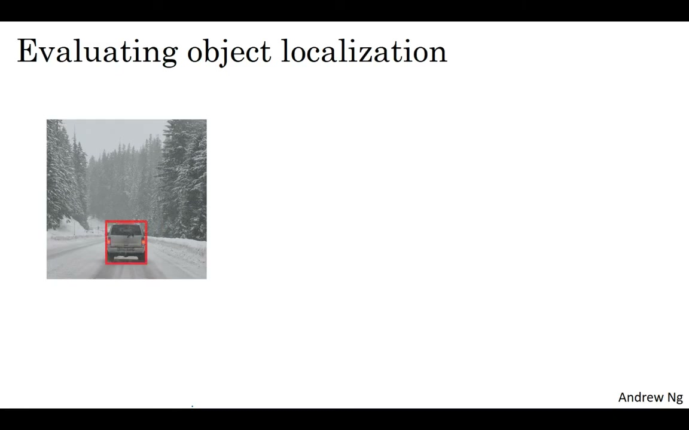
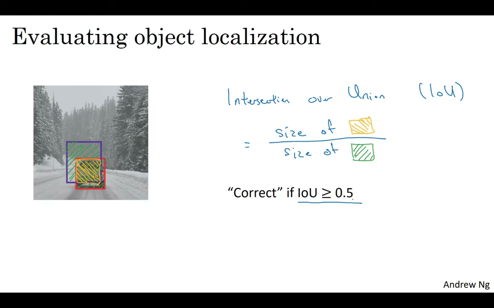

# C4W3L06 — Intersection Over Union (IoU)

**Andrew Ng · Deep Learning Specialization**
**Course 4: Convolutional Neural Networks — Week 3: Object Detection**

> Video: https://www.youtube.com/watch?v=ANIzQ5G-XPE

---

## 1. What is IoU?


*Figure 1: Intersection over Union — computing the ratio of intersection area to union area*

**Intersection over Union (IoU)** is a function that measures the overlap between two bounding boxes. It's used both for **evaluating** object detection algorithms and as a **component** within detection algorithms (like non-max suppression and anchor box matching).

```
IoU = size_of_intersection / size_of_union
```

- **Intersection**: The overlapping (orange) area shared by both boxes
- **Union**: The total (green) area covered by either box

---

## 2. IoU as an Evaluation Metric


*Figure 2: IoU threshold convention — 0.5 is standard; higher = more stringent*

IoU maps localization to accuracy:

| IoU Value | Meaning |
|-----------|---------|
| **1.0** | Perfect overlap — predicted box = ground truth |
| **≥ 0.5** | **Correct detection** (by standard convention) |
| **< 0.5** | Poor localization — not counted as correct |

### Threshold Conventions:

- **0.5** — Standard; most common in computer vision tasks
- **0.6 or 0.7** — More stringent; used when higher accuracy is needed
- **Below 0.5** — Rarely used; too lenient

> There's no deep theoretical reason for 0.5 — it's a human-chosen convention. Higher IoU = more accurate bounding box.

---

## 3. General Use: Measuring Box Similarity

Beyond evaluation, IoU is a general measure of **how similar two boxes are**. Any time you have two bounding boxes, you can compute their IoU to quantify overlap.

This is used in:
- **Non-max Suppression** — suppress boxes with high IoU with a selected detection
- **Anchor Box Matching** — assign objects to anchor boxes with highest IoU

---

## 4. Key Takeaways

| Concept | Detail |
|---------|--------|
| **IoU Formula** | IoU = intersection_area / union_area |
| **Range** | 0 (no overlap) to 1 (perfect overlap) |
| **Standard threshold** | IoU ≥ 0.5 = correct detection |
| **Stringent threshold** | IoU ≥ 0.6 or 0.7 for stricter evaluation |
| **Dual use** | Evaluation metric + algorithmic component (NMS, anchor matching) |

> Don't confuse with the financial "IOU" (I Owe You) — same abbreviation, completely different concept!

*Source: deeplearning.ai, CNN Course (Course 4), Week 3, Lecture 6*
