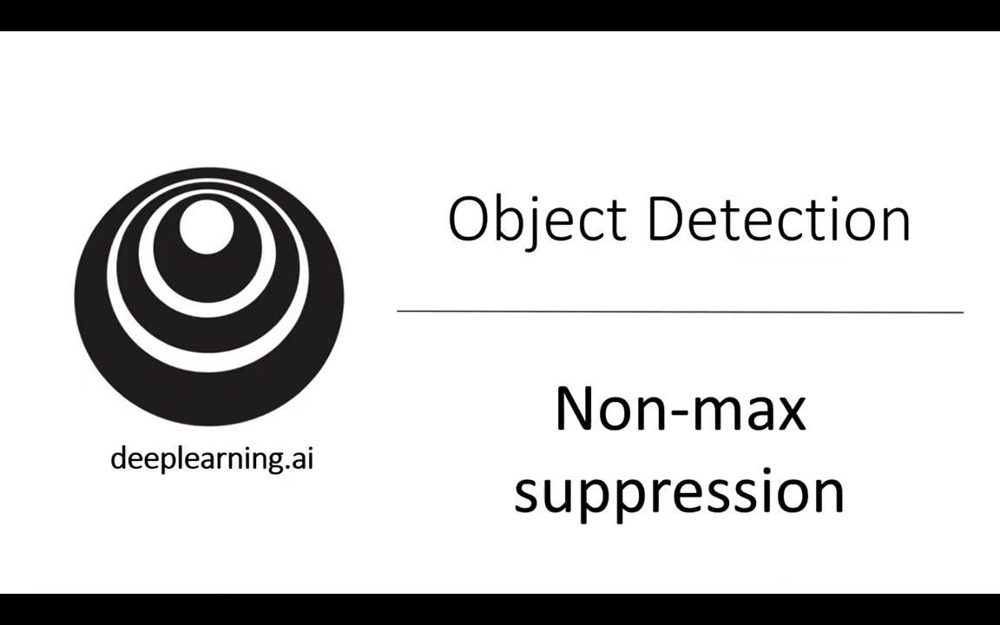
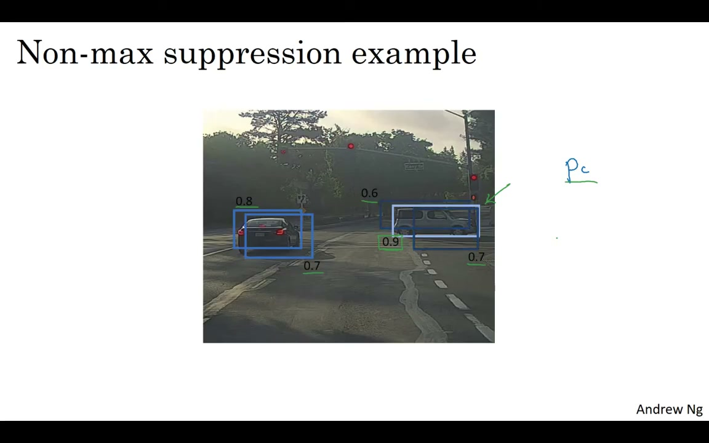
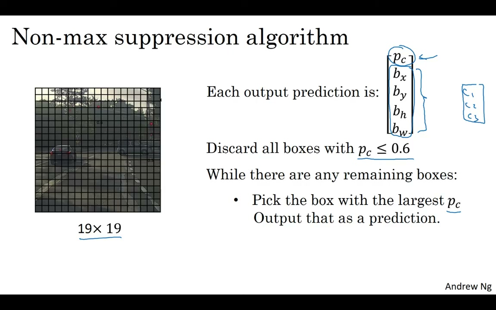

# C4W3L07 — Non-max Suppression

**Andrew Ng · Deep Learning Specialization**
**Course 4: Convolutional Neural Networks — Week 3: Object Detection**

> Video: https://www.youtube.com/watch?v=VAo84c1hQX8

---

## 1. The Problem: Multiple Detections


*Figure 1: Multiple detections of the same car — many grid cells raise their hand*

Object detection algorithms may find **multiple detections of the same object**. Rather than detecting a car just once, the algorithm might detect it multiple times from different grid cells.

With a 19×19 grid (361 grid cells), even though technically a car has only one center point and should be assigned to only one grid cell, in practice many neighboring cells may all think the car's center is in them — so they all predict a car.

## 2. What Non-max Suppression Does

Non-max suppression **cleans up** these detections so you end up with **just one detection per object**, rather than multiple detections.


*Figure 2: The NMS algorithm — pick highest Pc, suppress overlapping boxes, repeat*

## 3. The Algorithm Step-by-Step

### Step 1: Discard low-probability boxes
Discard all bounding boxes with `Pc ≤ 0.6` (or another threshold). Unless the network thinks there's at least a 60% chance an object is there, get rid of it.

### Step 2: Pick the highest-confidence box
While there are remaining bounding boxes:
1. **Pick** the box with the highest `Pc` — this is your most confident detection. Output it as a prediction.
2. **Suppress** any remaining box that has **high IoU** (high overlap) with the box you just output.
3. **Repeat** until all boxes are either output or suppressed.

### Result
You're left with only the highlighted (output) boxes — your **final predictions** with one detection per object.

---

## 4. The Name: "Non-max Suppression"

- **"Max"**: You output your **maximal** (highest probability) classifications
- **"Non-max Suppression"**: You **suppress** the nearby ones that are **non-maximal**

---

## 5. NMS with Multiple Object Classes


*Figure 3: For multiple classes — run NMS independently for pedestrians, cars, and motorcycles*

For detecting multiple object classes (pedestrians, cars, motorcycles):

- The output vector has additional components (C1, C2, C3)
- **Run non-max suppression independently for each class** — three separate times
- The probability used is actually `Pc × C1` (or C2, C3) — the product of object presence and class confidence

> The programming exercise at the end of this week lets you implement NMS yourself on multiple object classes.

---

## 6. NMS Algorithm Pseudocode

```
1. Discard all boxes with Pc < threshold (e.g., 0.6)

2. While remaining boxes exist:
   a. Pick the box with the highest Pc
   b. Output this box as a prediction
   c. Discard any remaining box with IoU > 0.5 with the output box

3. The remaining highlighted boxes are your final predictions
```

---

## 7. Key Takeaways

| Concept | Detail |
|---------|--------|
| **Problem** | Multiple grid cells may detect the same object |
| **Solution** | Non-max suppression picks the best detection and suppresses overlapping ones |
| **IoU threshold** | Typically ~0.5 — boxes with overlap above this get suppressed |
| **Multi-class** | Run NMS independently per class, using `Pc × class_confidence` |
| **End result** | One detection per object — clean, non-redundant predictions |

## 8. What's Next

The next video introduces **anchor boxes** — a key idea that makes the YOLO algorithm work much better by allowing one grid cell to detect multiple objects.

*Source: deeplearning.ai, CNN Course (Course 4), Week 3, Lecture 7*
