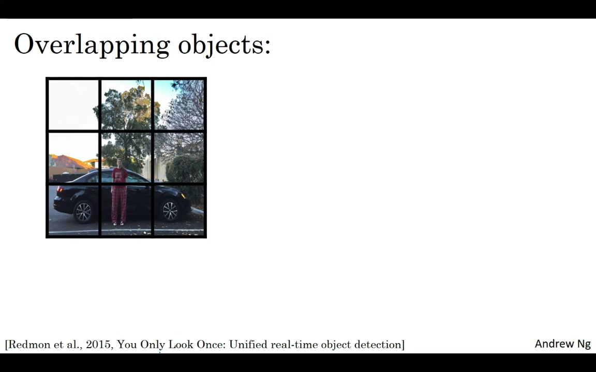
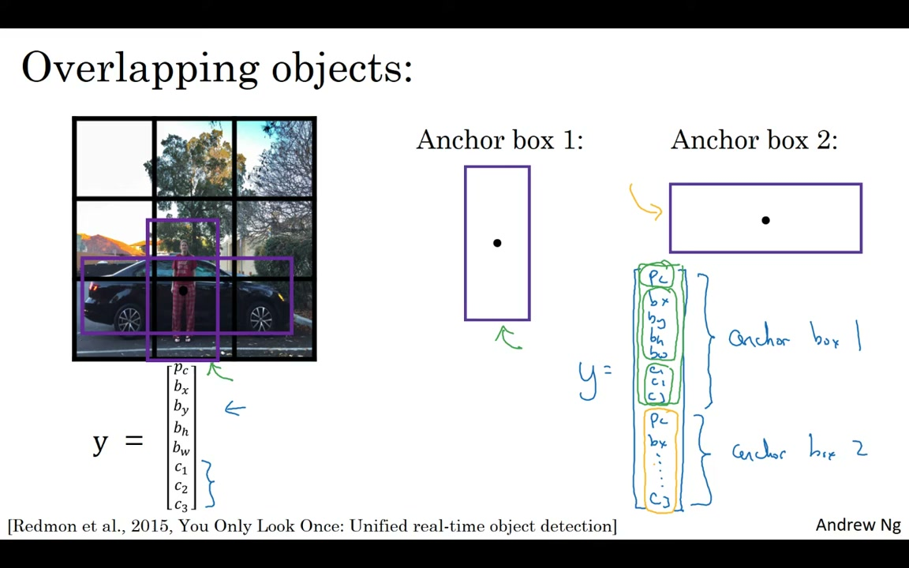
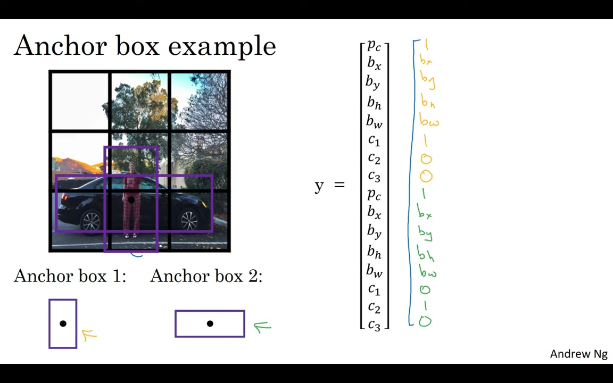

# C4W3L08 — Anchor Boxes

**Andrew Ng · Deep Learning Specialization**
**Course 4: Convolutional Neural Networks — Week 3: Object Detection**

> Video: https://www.youtube.com/watch?v=RTlwl2bv0Tg

---

## 1. The Problem: One Grid Cell, Multiple Objects


*Figure 1: Two objects (pedestrian + car) in the same grid cell — one cell cannot output two detections*

With the basic object detection approach, **each grid cell can detect only one object**. What if two objects' midpoints fall in the same cell?

Solution: **Anchor boxes** allow one grid cell to detect multiple objects by associating each object with a different "anchor box shape."

---

## 2. How Anchor Boxes Work

### Predefine Anchor Box Shapes

Define several anchor box shapes that span the variety of object shapes you expect:

- **Anchor box 1**: Tall and skinny (e.g., for pedestrians)
- **Anchor box 2**: Wide and flat (e.g., for cars)

In general, you might use 5 or more anchor boxes.

### Double the Output Vector

Each grid cell's output now contains **duplicate entries** — one set for each anchor box:

```
Before anchor boxes:  y = [Pc, bx, by, bh, bw, c1, c2, c3]     (8 values)
With 2 anchor boxes:  y = [Pc, bx, ..., c3 | Pc, bx, ..., c3]   (16 values)
```


*Figure 2: Output vector — top 8 values for anchor box 1, bottom 8 values for anchor box 2*

---

## 3. Assigning Objects to Anchor Boxes


*Figure 3: Object assignment — pedestrian matches anchor box 1 (tall/skinny), car matches anchor box 2 (wide/flat)*

For each object in the training set:

1. The object is assigned to the **grid cell** containing its midpoint (same as before)
2. Compute **IoU** between the object's ground-truth bounding box and **each anchor box shape**
3. Assign the object to the anchor box with the **highest IoU**
4. The object is now encoded in the corresponding half of the output vector

---

## 4. Concrete Example Label

For a grid cell containing both a pedestrian and a car (using 2 anchor boxes):

### Anchor Box 1 (top half — pedestrian):
```
Pc=1, bx, by, bh, bw, c1=1, c2=0, c3=0
```
Pedestrian shape is more similar to anchor box 1 (tall/skinny).

### Anchor Box 2 (bottom half — car):
```
Pc=1, bx, by, bh, bw, c1=0, c2=1, c3=0
```
Car shape is more similar to anchor box 2 (wide/flat).

### Cell with only a car (no pedestrian):
```
Anchor Box 1: Pc=0, rest = don't care
Anchor Box 2: Pc=1, bx, by, bh, bw, c1=0, c2=1, c3=0
```

---

## 5. Output Volume Dimensions

With 2 anchor boxes and 3 classes:

```
Y = 3 × 3 × 16   (or 3 × 3 × 2 × 8)
```

In general: `Y = grid_h × grid_w × (num_anchors × (5 + num_classes))`

---

## 6. Edge Cases & Limitations

| Scenario | Handling |
|----------|----------|
| **3 objects, 2 anchors** in same cell | Algorithm doesn't handle well — tiebreaker needed. Rare in practice with 19×19 grids. |
| **2 objects, same anchor box shape** | Also a tiebreaker case. Rare in practice. |
| **19×19 grid** | With 361 cells, objects sharing a midpoint is very uncommon. |

---

## 7. The Real Motivation for Anchor Boxes

While motivated as a solution to overlapping objects, anchor boxes provide an even more important benefit:

**Specialization** — different output units can specialize in detecting different object shapes:
- Some units specialize in **tall/skinny** objects (pedestrians)
- Other units specialize in **wide/flat** objects (cars)

This specialization improves overall detection accuracy.

---

## 8. How to Choose Anchor Box Shapes

| Method | Description |
|--------|-------------|
| **Hand-picked** | Choose 5-10 shapes that span the variety of objects you expect (tall, wide, square, etc.). Works well in practice. |
| **K-means clustering** (advanced) | Run k-means on ground-truth bounding box dimensions to find the most representative shapes automatically. Used in later YOLO research papers. |

---

## 9. Key Takeaways

| Concept | Detail |
|---------|--------|
| **Problem solved** | One grid cell can now detect multiple objects |
| **Mechanism** | Duplicate the output vector for each anchor box; assign objects to anchor boxes by highest IoU |
| **Output shape** | `grid × grid × (anchors × (5 + classes))` |
| **Specialization** | Different anchors specialize in different object shapes (tall vs wide) |
| **Choosing anchors** | Hand-pick shapes or use k-means clustering on training data |
| **Next step** | Anchor boxes + NMS + grid cells = the complete YOLO algorithm |

*Source: deeplearning.ai, CNN Course (Course 4), Week 3, Lecture 8*
