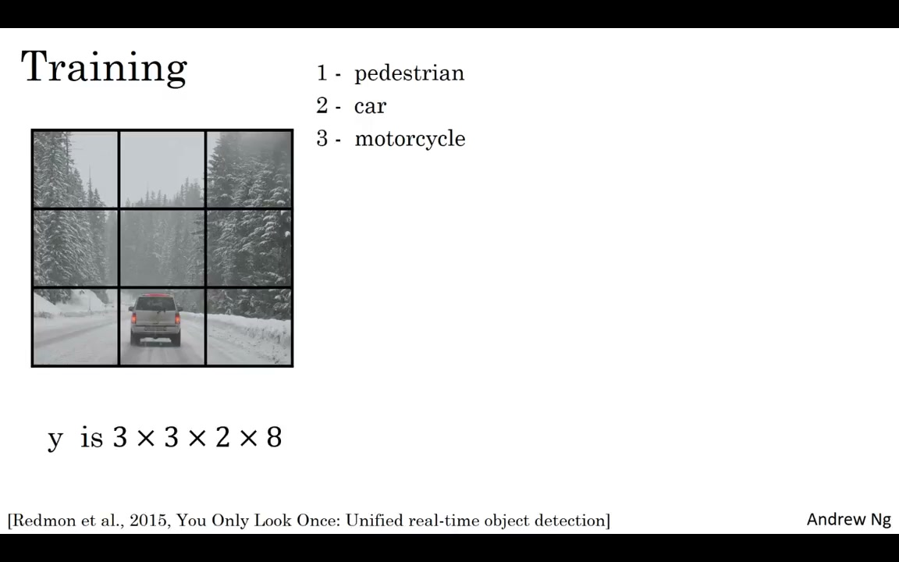
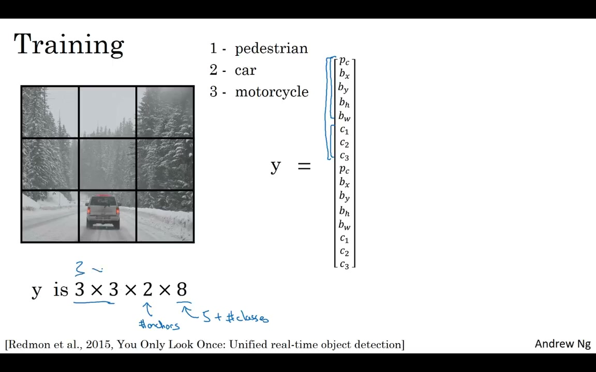
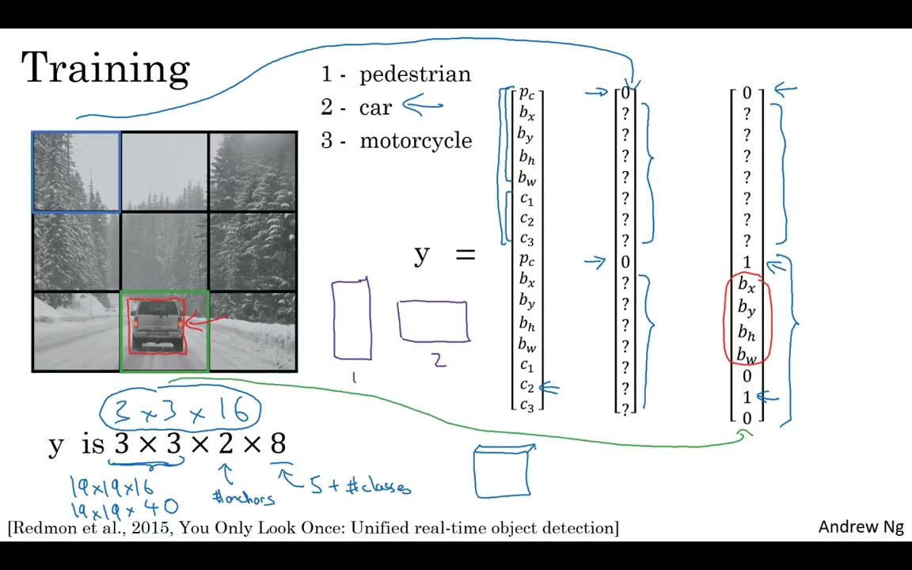
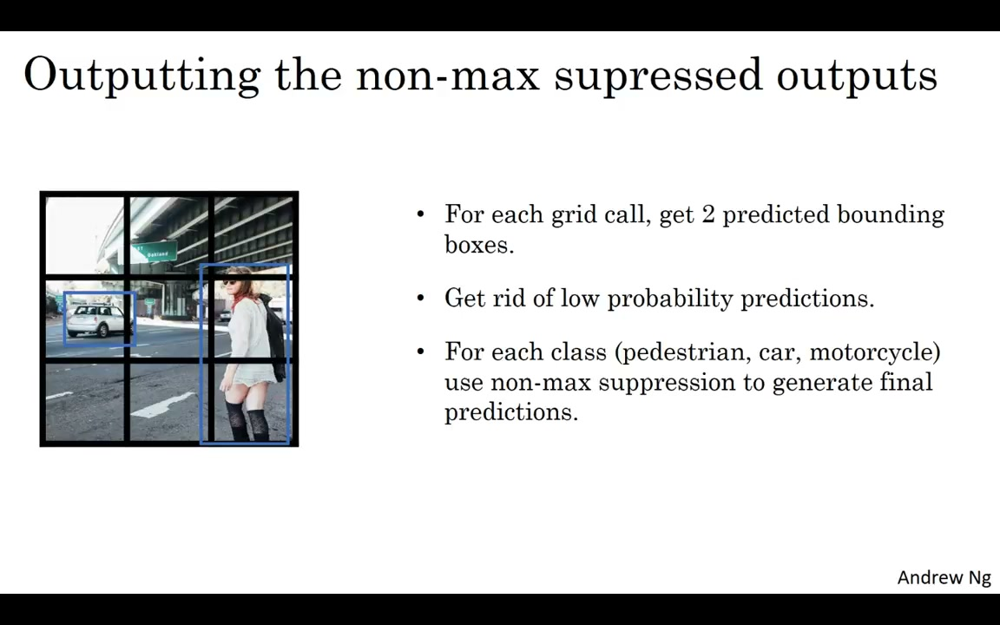

# C4W3L09 — YOLO Algorithm

**Andrew Ng · Deep Learning Specialization**
**Course 4: Convolutional Neural Networks — Week 3: Object Detection**

> Video: https://www.youtube.com/watch?v=9s_FpMpdYW8

---

## 1. Overview


*Figure 1: YOLO Algorithm — putting all components together*


The **YOLO** (You Only Look Once) algorithm integrates all the components of object detection — grid cells, anchor boxes, IoU, and non-max suppression — into a single, unified convolutional neural network. It is one of the most effective object detection algorithms in computer vision.

This lecture covers three key aspects:

- How to construct the training set for YOLO
- How the neural network makes predictions
- How to post-process predictions with non-max suppression

---

## 2. Constructing the Training Set


*Figure 2: The output volume — 3×3×16 (3×3 grid, 2 anchors, 8 values)*


### 2.1 Problem Setup

Detect three object classes: **pedestrians, cars, motorcycles**, plus an explicit **background class**. Use a 3×3 grid and two anchor boxes.

### 2.2 Output Volume Dimensions

For each grid cell, the target vector **y** has 8 values per anchor box:

```
y = [Pc, bx, by, bh, bw, c1, c2, c3]
```

| Component | Meaning |
|-----------|---------|
| `Pc` | Object presence confidence (0 or 1) |
| `bx, by, bh, bw` | Bounding box coordinates & dimensions |
| `c1, c2, c3` | One-hot class labels |

**Full output volume:** `Y = 3 × 3 × 16` (or equivalently `3 × 3 × 2 × 8`)

In practice, grids are much larger — e.g., **19×19×40** (5 anchors × 8 values).

### 2.3 Labeling Each Grid Cell


*Figure 3: Anchor box matching — the red car box has higher IoU with anchor box 2*


**Empty cell** (no object center falls here):
- `Pc = 0` for both anchor boxes
- All other values are **"don't care"** — the loss function ignores them

**Cell with an object:**
1. Determine which anchor box has **higher IoU** with the ground-truth box
2. Associate the object with that anchor; set `Pc = 1`
3. The other anchor gets `Pc = 0` (don't cares)
4. Encode correct bounding box & class

> The bounding box can extend beyond the grid cell — the cell is determined by the object's center point.

---

## 3. Making Predictions

Given an input image (e.g., 100×100×3), the CNN outputs a 3×3×16 volume:

- **Empty cells:** `Pc ≈ 0` — other values are noise, ignored in post-processing
- **Object cells:** `Pc ≈ 1` — well-localized bounding box, correct class

---

## 4. Post-Processing: Non-Max Suppression


*Figure 4: Class-wise non-max suppression — NMS run independently per class*


### Step 1: Gather all predictions
Each grid cell contributes 2 predicted bounding boxes (one per anchor). For 3×3 grid → 18 candidates. Boxes may extend beyond cell boundaries (this is allowed).

### Step 2: Filter by confidence
Discard predictions with low `Pc` (the network tells you it's not confident).

### Step 3: Class-wise non-max suppression
**Run NMS independently for each class:**

- Run NMS for "pedestrian" predictions
- Run NMS for "car" predictions
- Run NMS for "motorcycle" predictions

> **Crucial:** NMS is applied per-class, not across classes. A car detection must never suppress a pedestrian detection.

---

## 5. YOLO End-to-End Summary

**Training:**
1. Define grid size (e.g., 19×19) and anchor boxes (e.g., 5 shapes)
2. For each training image, construct output volume Y by labeling each grid cell
3. Train a CNN: input = image, output = `grid_h × grid_w × (anchors × 8)`

**Inference:**
1. Pass image through trained CNN
2. For each grid cell & anchor box, extract `[Pc, bx, by, bh, bw, c1..cn]`
3. Filter out boxes with `Pc` below confidence threshold
4. For each class independently, run NMS to eliminate duplicates

---

## 6. Key Insights

| Concept | Detail |
|---------|--------|
| **Background class** | Gives the network an explicit way to signal "no object here" |
| **Anchor box matching** | Each object assigned to the anchor with highest IoU; the other gets Pc=0 with don't-cares |
| **Don't care entries** | When Pc=0, bounding box & class values are ignored by the loss function |
| **Bounding box overflow** | Boxes can and do extend beyond the grid cell that "owns" them |
| **Per-class NMS** | Run NMS C times for C classes — never suppress across classes |
| **Scalability** | Real implementations: 19×19 grid, 5+ anchors → 19×19×40 output |
| **Unified architecture** | Single CNN predicts all bounding boxes & class probabilities in one forward pass |

---

## 7. Practical Note

Andrew Ng encourages implementing these components yourself in the programming exercise. An optional follow-up video dives deeper into the YOLO architecture.

*Source: deeplearning.ai, CNN Course (Course 4), Week 3, Lecture 9*
