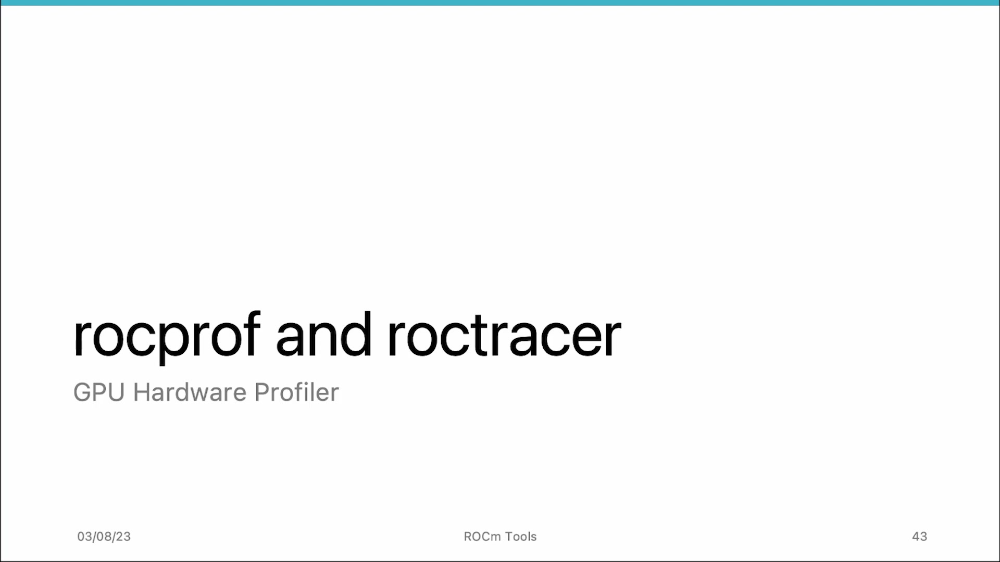
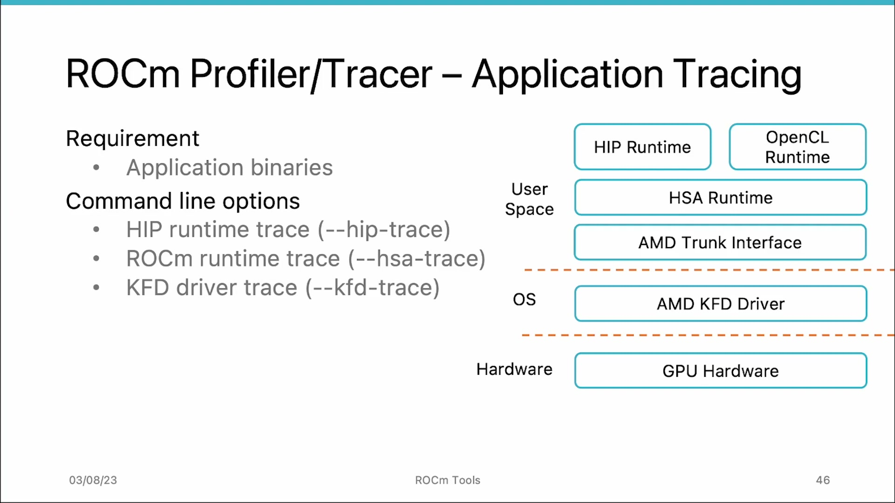
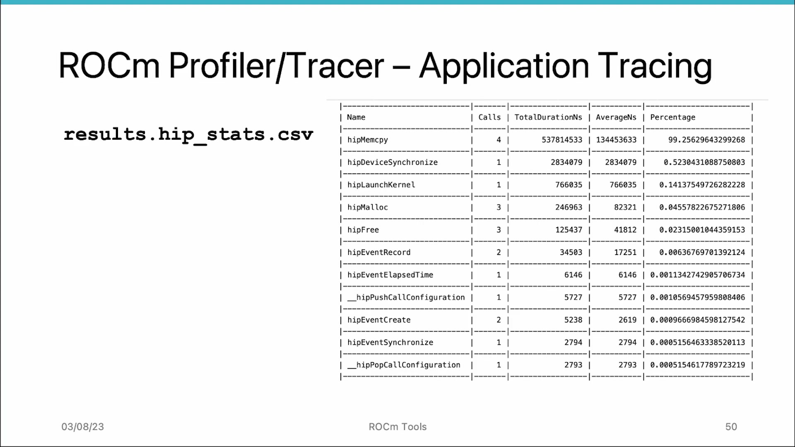
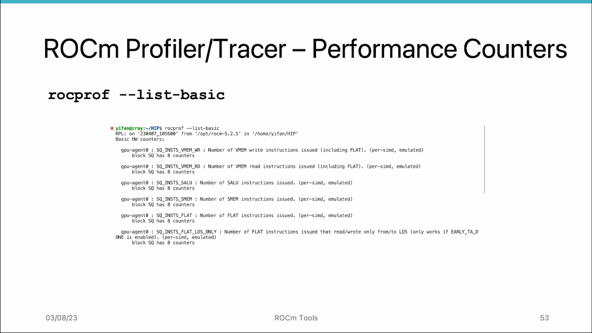

# AMD HIP Tutorial, 6-5 — rocprof and roctracer

**AMD HIP Tutorial Series — Profiling & Tracing on AMD GPUs**

> Video: https://www.youtube.com/watch?v=1KegIFcoa0c

---

## 1. Overview


*Figure 1: rocprof and roctracer — profiling & tracing tools for AMD GPUs*

When optimizing GPU performance, **profiling** and **tracing** are two essential tools. ROCm provides:

- **rocprof (ROC Profiler)** — application tracing + GPU profiling
- **roctracer (ROC Tracer)** — library-level tracing API

These tools help developers identify performance bottlenecks and understand how applications utilize the GPU.

---

## 2. Two Modes of Operation

### 2.1 Application Tracing Mode

Measures performance by tracing execution and measuring time taken by each function/section of code. Helps identify which code parts are slow.

### 2.2 GPU Profiling Mode

Provides deeper insights using **hardware performance counters**:

- Memory usage
- Instruction throughput
- Shader occupancy

| Mode                     | Trace Level    | Granularity                          |
| ------------------------ | -------------- | ------------------------------------ |
| Higher level (hip-trace) | HIP runtime    | Easier to associate with source code |
| Mid level (hsa-trace)    | HSA runtime    | Moderate detail                      |
| Lower level (kfd-trace)  | AMD kfd driver | Most detailed, closer to hardware    |

---

## 3. System Architecture & Tracing Levels


*Figure 2: System architecture — Hardware → kfd driver → HSA/HIP runtime with tracing options at each level*

```
┌─────────────────────────┐
│   HIP / HSA Runtime     │  ← hip-trace, hsa-trace
├─────────────────────────┤
│   AMD kfd Driver        │  ← kfd-trace
├─────────────────────────┤
│   GPU Hardware          │
└─────────────────────────┘
```

---

## 4. Application Tracing Commands & Output


*Figure 3: Output files from rocprof --hip-trace — hip_stats.csv, stats.csv, json, copy_unor_stats.csv*

### Command:

```bash
rocprof --hip-trace ./vector_addition
```

### 4 Output Files:

| File                          | Content                                                                                          |
| ----------------------------- | ------------------------------------------------------------------------------------------------ |
| `results.hip_stats.csv`       | Aggregated execution time by HIP runtime API calls (CSV). Shows avg/total duration, percentages. |
| `results.stats.csv`           | **Kernel execution time** (not API launch time!). In example: vector_add kernel = 283 µs.        |
| `results.json`                | Non-aggregated trace data in standard JSON format. Can be visualized in **chrome://tracing**.    |
| `results.copy_unor_stats.csv` | Individual HIP runtime call measurements.                                                        |

### ⚠ Important Caveat:

In `results.hip_stats.csv`, `hipLaunchKernel` shows only the CPU-side time to launch the kernel, **NOT** the kernel execution time itself. The actual kernel time is in `results.stats.csv`.

### Kernel Launch Internals:

When using `<<<>>>` syntax, three HIP APIs execute behind the scenes:

1. **hipPushCallConfiguration** — Pushes kernel config (grid dims, stream, LDS size, args) to GPU
2. **hipLaunchKernel** — Triggers actual kernel execution
3. **hipPopCallConfiguration** — Removes kernel info for next kernel

### Chrome Tracing Visualization:


*Figure 4: Chrome tracing — API calls and kernel executions in Gantt chart; first memory copy dominates*

1. Open Chrome browser
2. Navigate to `chrome://tracing`
3. Upload `results.json`
4. View API calls and kernel executions in Gantt chart format

---

## 5. GPU Profiling

### 5.1 Performance Counters

Hardware registers that automatically collect data while programs run on the GPU. **Different GPUs have different counters.** Always check first:

```bash
rocprof --list-basic     # List available hardware counters
rocprof --list-derived   # List available derived metrics
```

### 5.2 Two Types of Metrics

**Basic Metrics** — Hardware counters directly measuring component activity:

- Compute Unit, L1/L2 Cache

**Derived Metrics** — Higher-level metrics calculated from basic counters:

- VALU Utilization
- Fetch/Write Size
- L2 Cache Hit Rate

### 5.3 Hardware Components & Abbreviations

| Abbreviation | Component                         |
| ------------ | --------------------------------- |
| SQ           | Scheduler (dispatches wavefronts) |
| SP           | SIMD execution units              |
| TA           | Vector Memory Unit                |
| TCP          | L1 Cache                          |
| TCC          | L2 Cache                          |

### 5.4 Example Counters

**Basic:**

- `SQ_WAVES` — Number of wavefronts
- `SQ_INSTS_VALU` — VALU instructions executed
- `TCC_HIT` — L2 cache hit count
- `TCC_EA_WRREQ` — Write requests from L2 to DRAM

**Derived:**

- **VALU Utilization** — % of ALU utilization (100% ideal, low → divergence or memory-bound)
- **Fetch/Write Size** — KB fetched/written to DRAM (estimate bandwidth utilization)
- **L2 Cache Hit %** — % of instructions hitting L2 cache

### 5.5 Running GPU Profiling

Requires an **input text file** specifying metrics:

```bash
rocprof -i input.txt -o output.csv ./vector_addition
```

The output CSV contains:

- Kernel name, GPU ID, Queue ID, Thread ID
- Kernel characteristics: grid size, workgroup size, LDS size, scratch memory, VGPR/SGPR
- All requested metric values

---

## 6. Recommended Profiling Workflow

**Step 1 — Application Tracing:**
Start with `rocprof --hip-trace` to identify which API calls/kernels take unexpected time. Visualize with chrome://tracing.

**Step 2 — GPU Profiling:**
Once a problematic kernel is identified, use `rocprof -i metrics.txt` to drill into low-level counters:

- Is the kernel loading excessive DRAM data?
- Is L2 cache miss rate too high?
- Is the ALU being utilized efficiently?

**Step 3 — Optimize & Iterate:**
Use profiling data to guide code optimizations, then re-profile to verify improvements.

---

## 7. Quick Reference Commands

| Command                                 | Purpose                                |
| --------------------------------------- | -------------------------------------- |
| `rocprof --hip-trace ./app`             | Application tracing (HIP level)        |
| `rocprof --hsa-trace ./app`             | Application tracing (HSA level)        |
| `rocprof --kfd-trace ./app`             | Application tracing (kfd driver level) |
| `rocprof --list-basic`                  | List available hardware counters       |
| `rocprof --list-derived`                | List available derived metrics         |
| `rocprof -i input.txt -o out.csv ./app` | GPU profiling with metric input file   |

in v3 version

rocprofv3 \

  --sys-trace \

  --stats \

  --pmc SQ_WAVES \

  --output-format csv json pftrace \

  --output-directory rocprof_everything \

  -- ./hiplaunchkerneldemo_copy_debug


 request multiple counter passes

rocprofv3 \

  --pmc "SQ_WAVES" \

  --pmc "GPU_UTIL MeanOccupancyPerActiveCU" \

  --kernel-include-regex 'vector_add' \

  --output-format csv json \

  --output-file hiplaunch_counters \

  --output-directory "$COUNTER_OUT" \

  -- ./hiplaunchkerneldemo_copy_debug


https://ui.perfetto.dev

---

## 8. Key Insights

- **Tracing ≠ Profiling:** Tracing identifies *which* code is slow; profiling tells you *why* a kernel is slow at the hardware level.
- **hipLaunchKernel ≠ kernel time:** The CPU-side launch time and GPU-side execution time are separate metrics in different files.
- **Chrome tracing:** The JSON file uses a standard format compatible with chrome://tracing for visual timeline analysis.
- **Hardware counters vary by GPU:** Always run `rocprof --list-basic` first.
- **Derived metrics are more actionable** than raw counters for diagnosing problems.
- **Trace at the right level:** HIP-level for source code correlation; kfd-level for detailed hardware insight.

*Source: AMD HIP Tutorial Series, Lecture 6-5*
