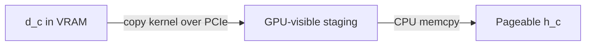
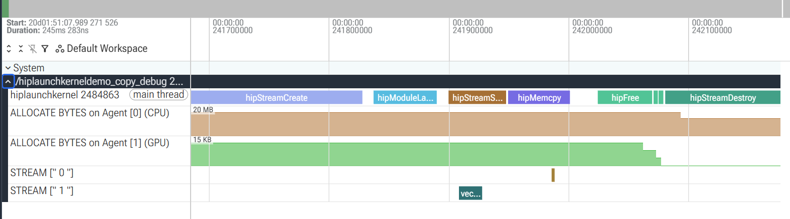
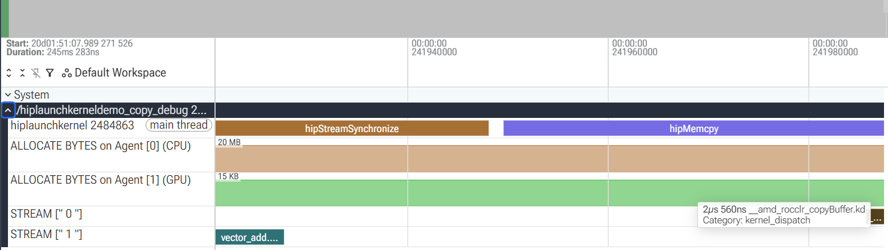

# HIP Launch Kernel Demo Profiling Notes

This note explains how to profile `hiplaunchkerneldemo_copy_debug`, read the rocprofv3 reports, and interpret the Perfetto views captured while investigating the demo.

## 1. Program Flow

The demo does the following:

1. Compiles `vector_add` at runtime with HIPRTC.
2. Dumps the generated code object and LLVM bitcode.
3. Loads the module with `hipModuleLoadData`.
4. Allocates three 4 KiB device buffers.
5. Copies `h_a` and `h_b` from pageable host memory to device memory.
6. Launches `vector_add` on an explicit stream.
7. Synchronizes the stream and copies `d_c` back to `h_c`.
8. Frees the buffers and destroys the stream.


HIPRTC compilation, `llvm-objdump`, `llvm-dis`, and printing LLVM IR make the full process much longer than the GPU computation. A microsecond kernel is almost invisible when the complete trace spans hundreds of milliseconds.

## 2. Environment

The old `hiplaunchkerneldemo` executable needs ROCm 6.4 (`libamdhip64.so.6`). Profile the debug executable built against the local ROCm 7.13 runtime:

```bash
cd /home/amd/zk/hip_programming_examples/hip_demo

export LD_LIBRARY_PATH=/home/amd/zk/rocm-systems-hip713/projects/rocr-runtime/build-debug/install/lib:\
/home/amd/zk/rocm-systems-hip713/projects/clr/build-hip-debug/install/lib:\
/opt/rocm/core-7.13/lib:/opt/rocm/lib

./hiplaunchkerneldemo_copy_debug
```

The final `SharedSignalPool` leak warning comes from the local debug runtime. It did not prevent profile generation.

## 3. Recommended Profile Commands

Use separate trace and counter passes. Counter collection can replay or alter kernel execution and therefore distort a timing trace.

### Full trace, statistics, and visualization

```bash
TRACE_OUT=rocprof_full_$(date +%Y%m%d_%H%M%S)

rocprofv3 \
  --sys-trace \
  --stats \
  --output-format csv json pftrace \
  --output-file hiplaunch_trace \
  --output-directory "$TRACE_OUT" \
  -- ./hiplaunchkerneldemo_copy_debug
```

`--sys-trace` includes HIP runtime/compiler APIs, HSA APIs, kernels, memory copies, allocations, scratch operations, and markers. `--runtime-trace` is lighter and omits HIP compiler and underlying HSA API tracing.

| Format | Use |
|---|---|
| CSV | Exact values, filtering, sorting, and calculations |
| PFTrace | Interactive timeline at <https://ui.perfetto.dev> |
| JSON | Structured rocprofiler data for programs |

The rocprofv3 JSON root is `rocprofiler-sdk-tool`, not Chrome's `traceEvents` schema. Use `.pftrace` for visualization rather than `chrome://tracing`.

### Hardware counters

List metrics supported by the installed profiler and GPU:

```bash
rocprofv3 --list-avail > rocprof_available.txt
```

Collect the verified wave counter for the application kernel only:

```bash
COUNTER_OUT=rocprof_counters_$(date +%Y%m%d_%H%M%S)

rocprofv3 \
  --pmc SQ_WAVES \
  --kernel-include-regex 'vector_add' \
  --output-format csv json \
  --output-file hiplaunch_counters \
  --output-directory "$COUNTER_OUT" \
  -- ./hiplaunchkerneldemo_copy_debug
```

Use repeated `--pmc` groups when metrics cannot be collected together:

```bash
rocprofv3 \
  --pmc "SQ_WAVES" \
  --pmc "GPU_UTIL MeanOccupancyPerActiveCU" \
  --kernel-include-regex 'vector_add' \
  --output-format csv json \
  --output-file hiplaunch_counters \
  --output-directory "$COUNTER_OUT" \
  -- ./hiplaunchkerneldemo_copy_debug
```

`SQ_WAVES` returned expected values on this gfx1201 system. `SQ_INSTS_VALU` and `SQ_INSTS_SALU` returned zero for `vector_add`, so do not rely on those values until gfx1201 metric mapping is confirmed.

## 4. Important Reports

Read the files in this order:

| Priority | Report | Question answered |
|---:|---|---|
| 1 | `*_kernel_stats.csv` | Which GPU kernels consume dispatch time? |
| 2 | `*_hip_api_stats.csv` | Which HIP calls occupy the CPU? |
| 3 | `*_kernel_trace.csv` | When and where did each kernel run? |
| 4 | `*_hip_api_trace.csv` | Which CPU API call initiated GPU work? |
| 5 | `*_counter_collection.csv` | What did a selected kernel do on hardware? |
| 6 | `*_agent_info.csv` | Which CPU/GPU agent executed the work? |
| 7 | Allocation reports | When and how much HIP-managed memory existed? |
| 8 | `*_domain_stats.csv` | What is the coarse duration distribution? |

Existing reports are under `rocprof_results/`, `rocprof_counters/`, and `rocprof_visual/`.

## 5. Example Measurements

The original kernel statistics were:

| Kernel | Calls | Total | Percentage |
|---|---:|---:|---:|
| `vector_add` | 1 | 19.6 us | 53.85% |
| `__amd_rocclr_copyBuffer` | 3 | 16.8 us | 46.15% |

The percentage denominator is captured kernel-dispatch duration:

$$
19{,}600\ \mathrm{ns} + 16{,}800\ \mathrm{ns} = 36{,}400\ \mathrm{ns}
$$

$$
\frac{19{,}600}{36{,}400}\times100 = 53.85\%
$$

It is not percentage of application wall time or GPU utilization. Kernel durations can overlap in multistream programs, so their sum is not necessarily elapsed time.

Selected host API measurements were:

| HIP API | Duration or total |
|---|---:|
| `hipGetDevice` | 16.25 ms |
| Three `hipMemcpy` calls | 14.10 ms |
| `hipModuleLoadData` | 8.44 ms |
| `hipStreamCreate` | 4.78 ms |
| `hipStreamSynchronize` | 267.4 us |
| `hipModuleLaunchKernel` | 141.9 us |

`hipModuleLaunchKernel` measures CPU submission. `vector_add` in the kernel trace measures actual GPU execution.

## 6. Correlation IDs

Use `Correlation_Id` to connect host calls and GPU operations:

```text
hipModuleLaunchKernel (11)  -> vector_add (11)
hipMemcpy (8)               -> __amd_rocclr_copyBuffer (8)
hipMemcpy (9)               -> __amd_rocclr_copyBuffer (9)
hipMemcpy (13)              -> __amd_rocclr_copyBuffer (13)
```

For a trace row, let $t_{\mathrm{start}}$ and $t_{\mathrm{end}}$ be its start
and end timestamps:

$$
T = t_{\mathrm{end}} - t_{\mathrm{start}}
$$

## 7. Grid, Block, and Wavefront

| HIP/CUDA | OpenCL/HSA | Meaning |
|---|---|---|
| Thread | Work item | One logical kernel invocation |
| Block | Workgroup | Threads scheduled as one group |
| Grid | NDRange | All blocks in one dispatch |
| `threadIdx` | Local ID | Position inside a block |
| `blockIdx` | Group ID | Block position in the grid |

The application uses:

```cpp
uint32_t blockDimX = 256;
uint32_t blockDimY = 1;
uint32_t blockDimZ = 1;
uint32_t gridDimX = (N + blockDimX - 1) / blockDimX;
```

For `N = 1024`, there are four blocks, 256 work items per block, and 1024 total work items. rocprof's `Grid_Size_X` is total work items, while `hipModuleLaunchKernel`'s `gridDimX` is number of blocks:

$$
\text{total work items}
= \text{number of blocks} \times \text{work items per block}
= 4 \times 256 = 1024
$$

The R9700 uses wave32:

$$
256/32=8\ \text{waves per block},\qquad4\times8=32\ \text{waves total}
$$

This agrees with `SQ_WAVES = 32` for `vector_add`.

Use `(256,1,1)` for a 1D vector, `(16,16,1)` or `(32,8,1)` for a 2D image, and a shape such as `(8,8,4)` for a 3D volume. Always satisfy:

$$
\text{block size}
= blockDimX \times blockDimY \times blockDimZ
\leq \text{maximum threads per block}
$$

Prefer a total block size divisible by wave size 32, then benchmark valid alternatives. Larger blocks are not automatically faster because registers, LDS, and wave slots limit occupancy.

## 8. Internal Copy Kernel

`__amd_rocclr_copyBuffer` is CLR's compute/shader copy path, not SDMA. Its central operation is:

```cpp
dstD[id] = srcD[id];
```

Aligned work items copy 16 bytes through `ulong2`; otherwise they copy four bytes through `uint`. It executes on Compute Units and consumes waves, registers, caches, and memory pipelines. An SDMA transfer does not appear as a kernel dispatch with a workgroup size, VGPR count, and wave count.

CLR can choose CPU, SDMA/HSA, or shader copies. The current default chooses shader copies for small transfers up to 16 KiB unless settings or engine preferences override it. Each demo array is only:

$$
1024\times4\ \mathrm{bytes}=4096\ \mathrm{bytes}=4\ \mathrm{KiB}
$$

| Kernel | Workgroups | Workgroup size | Work items | Waves |
|---|---:|---:|---:|---:|
| `vector_add` | 4 | 256 | 1024 | 32 |
| `__amd_rocclr_copyBuffer` | 1 | 512 | 512 | 16 |

For an aligned 4 KiB copy, only 256 work items need to copy 16 bytes each. CLR rounds the dispatch to one 512-work-item group; remaining work items fail the end-pointer test.

## 9. Pageable Host Memory and PCIe

The stack arrays are pageable CPU memory, so CLR stages each transfer through GPU-visible system memory.




GPU-visible means addressable by the GPU; it does not mean VRAM speed. The staging buffer is temporary, while `d_a`, `d_b`, and `d_c` are persistent VRAM allocations created by `hipMalloc`. The runtime must copy into those requested destinations.

Mapped memory from `hipHostMalloc` or `hipHostRegister` can be used directly by kernels, avoiding pageable staging. On a discrete GPU it still crosses PCIe and is often slower when data is reused repeatedly.

## 10. Perfetto Basics

Open the PFTrace at <https://ui.perfetto.dev>.

| Action | Control |
|---|---|
| Zoom in/out | `W` / `S` |
| Pan left/right | `A` / `D` |
| Inspect | Click an event rectangle |
| Find | Search an exact event name |

Search for `vector_add`, `__amd_rocclr_copyBuffer`, `hipMemcpy`, `hipModuleLaunchKernel`, and `hipStreamSynchronize`. Main-thread rectangles are CPU API durations; stream-track rectangles are GPU dispatch durations. Do not identify operations by color alone.

## 11. Perfetto Screenshot Explanations

The two detailed Perfetto screenshots are embedded below. The earlier collapsed and allocation-overview screenshots were not saved in the workspace, so diagrams preserve those two views.

### Image 1: collapsed full trace

```text
Full trace: | HIPRTC compile and dump commands .............. | GPU work |
Process:                                                      ---|--|---
```

Only the process summary was visible because the row was collapsed. At full scale, microsecond kernels were less than one pixel wide. Expanding the process and zooming near the right side revealed child tracks; the sparse display did not indicate a failed trace.

### Image 2: main thread and allocation tracks

```text
Main thread: [hipModuleLoadData] [           hipMemcpy           ] [...]
Agent 0 CPU: [system allocation counter                         ]
Agent 1 GPU: [device allocation counter                         ]
```

`hipModuleLoadData` was runtime/module initialization. A synchronous `hipMemcpy` includes staging, GPU work, waiting, and CPU copying. The brown and green filled areas were byte-allocation counter graphs, not kernels. Agent 0 tracked ROCm system resources; Agent 1 tracked device allocations. Stack arrays were not HIP allocations.

### Image 3: launch, copy, and cleanup



```text
Main thread: [create] [launch] [sync] [hipMemcpy] [free x3] [destroy]
STREAM 1:             [vector_add]
STREAM 0:                                  [internal copy]
GPU bytes:  ================================\__\__\____________
```

`STREAM ["1"]` is the explicit stream passed to `hipModuleLaunchKernel`, so `vector_add` appears there. `STREAM ["0"]` carries runtime-managed copy work. The GPU allocation counter drops in three steps as `d_a`, `d_b`, and `d_c` are freed.

### Image 4: synchronization and result copy



```text
Main thread: [ hipStreamSynchronize ] [          hipMemcpy          ]
STREAM 1:    [vector_add]
STREAM 0:                                      [rocclr copyBuffer]
```

The tooltip showed approximately `2 us 560 ns` for `__amd_rocclr_copyBuffer`. That was the GPU dispatch duration for the result copy. The enclosing `hipMemcpy` was wider because it measured the entire synchronous host API, including runtime setup, staging, waiting, and CPU `memcpy`.

`vector_add` completed on stream 1 before synchronization returned. The following device-to-host `hipMemcpy` caused the internal copy kernel on stream 0, matching source order.

## 12. Perfetto SQL

Find important events:

```sql
SELECT
  track.name AS track_name,
  slice.name AS event_name,
  slice.ts / 1000000.0 AS start_ms,
  slice.dur / 1000.0 AS duration_us
FROM slice
JOIN track ON slice.track_id = track.id
WHERE slice.name LIKE '%vector_add%'
   OR slice.name LIKE '%copyBuffer%'
   OR slice.name LIKE '%hipMemcpy%'
ORDER BY slice.ts;
```

Summarize durations:

```sql
SELECT
  name,
  COUNT(*) AS calls,
  SUM(dur) / 1000.0 AS total_us,
  AVG(dur) / 1000.0 AS average_us,
  MIN(dur) / 1000.0 AS minimum_us,
  MAX(dur) / 1000.0 AS maximum_us
FROM slice
WHERE dur >= 0
GROUP BY name
ORDER BY total_us DESC
LIMIT 30;
```

## 13. Benchmarking Guidance

This demo launches `vector_add` once, so the measured duration includes cold effects and is not a stable benchmark. For useful comparisons:

1. Move HIPRTC compilation and dump commands outside the measured region.
2. Warm up the kernel several times.
3. Launch it hundreds or thousands of times.
4. Measure GPU dispatches, not only CPU launch calls.
5. Compare aggregate or median timing over repeated runs.
6. Collect counters after identifying the important kernel.
7. Benchmark block sizes such as 64, 128, 256, and 512.

The main conclusion from this run is that initialization, module loading, and synchronous copies dominate application time. `vector_add` itself is a very small GPU operation.
