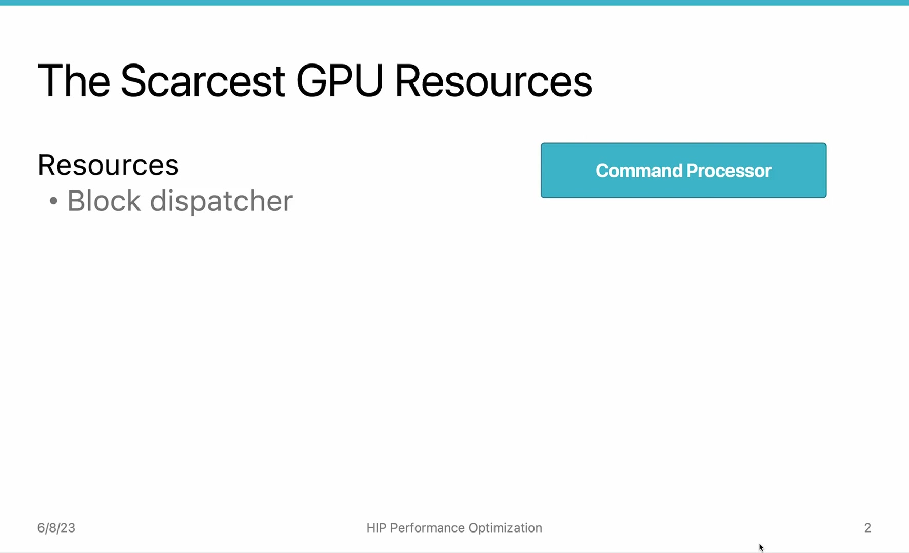
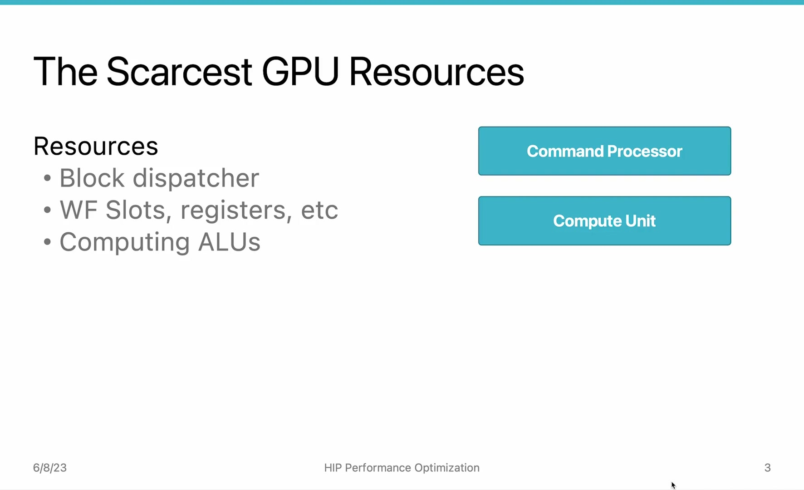
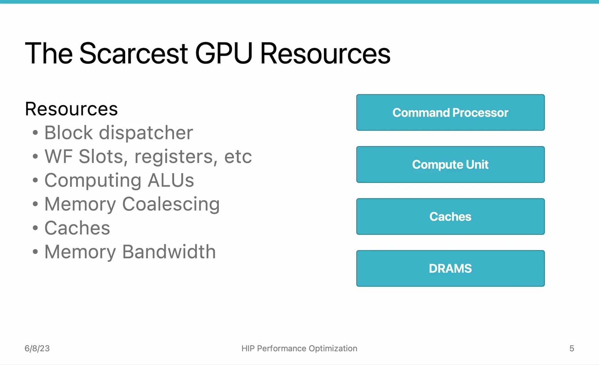

# AMD HIP Tutorial, 7-1 — HIP Performance Optimization (Intro)

**AMD HIP Tutorial — Week 7: GPU Performance Optimization**

> Video: https://www.youtube.com/watch?v=A4mSAw_d4Pw

---

## 1. Overview

*Figure 1: GPU resources overview — from command processor to DRAM, every component can be a bottleneck*

Performance doesn't come on its own — you have to **tune your program** to reach the highest performance. This video is the introduction to Week 7, mapping out all the GPU resources that could become performance bottlenecks.

---

## 2. GPU Performance Bottleneck Map

### 2.1 Pre-Core (Front-End)

| Component | Role | Bottleneck When... |
|-----------|------|-------------------|
| **Command Processor** | Gateway between CPU & GPU | Too many blocks to dispatch |
| **Block Dispatcher** | Sends blocks to compute units | Dispatch overhead for many small blocks |

### 2.2 Core — Compute Unit

| Resource | Limit | Bottleneck When... |
|----------|-------|-------------------|
| **Wavefront Slots** | 40 per CU | Too many wavefronts competing |
| **Vector Registers** | Limited per CU | Register spilling to memory |
| **Scalar Registers** | Limited per CU | Heavy scalar ops |
| **LDS (Local Data Share)** | Fixed size per CU | Too much shared memory allocation |
| **ALUs** | Fixed compute throughput | Compute-bound kernels |

*Figure 2: Compute unit resources — wavefront slots (40), registers, LDS, and ALUs*

### 2.3 Back-End — Memory System

| Component | Role | Bottleneck When... |
|-----------|------|-------------------|
| **Cache Interface** | CU ↔ Cache connection | Too many memory transactions |
| **L1/L2 Caches** | Fast on-chip storage | Cache space limited; bandwidth limited |
| **DRAM** | Main GPU memory | Loading lots of data → bandwidth limit |

---

## 3. Section 7 vs Section 8

*Figure 3: Section 7 focuses on command processor + compute unit; Section 8 on caches + DRAM*

The HIP performance optimization content is organized into **two units**:

| Section | Focus | Topics |
|---------|-------|--------|
| **Section 7** (This week) | **Front-end**: Command processor + Compute Unit | Block/grid sizing, loop unrolling, occupancy, ALU utilization, reduction |
| **Section 8** (Next week) | **Back-end**: Caches, DRAM, Memory system | Roofline model, memory coalescing, LDS tiling |

---

## 4. Key Takeaways

| Concept | Detail |
|---------|--------|
| **Every component matters** | Command processor, CU resources, caches, and DRAM can all be bottlenecks |
| **Two-section structure** | Section 7 = compute-side optimization; Section 8 = memory-side optimization |
| **No free performance** | GPU performance must be actively tuned — it doesn't come automatically |
| **Systematic approach** | Identify the bottleneck first, then apply the matching optimization technique |

*Source: AMD HIP Tutorial Series, Lecture 7-1*
