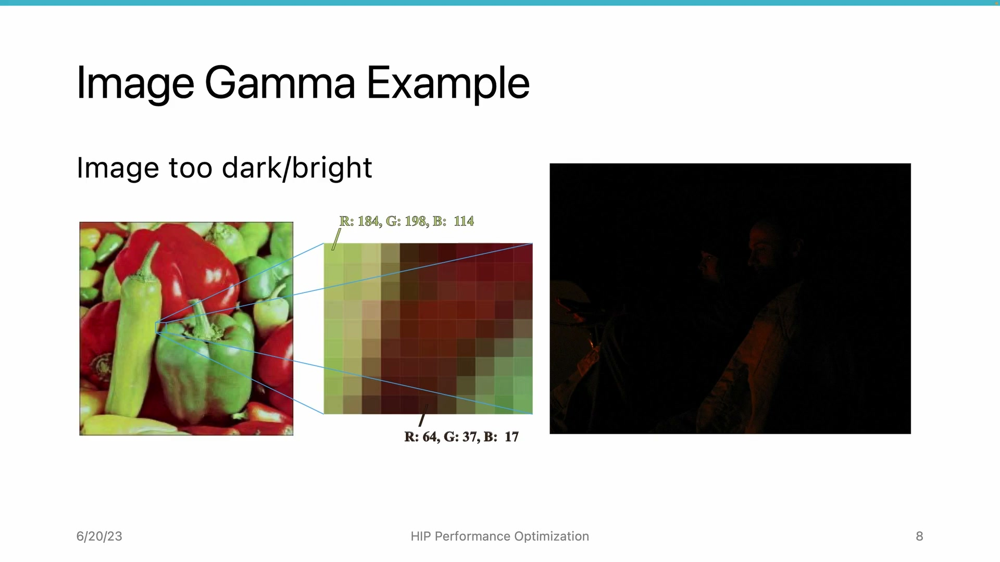
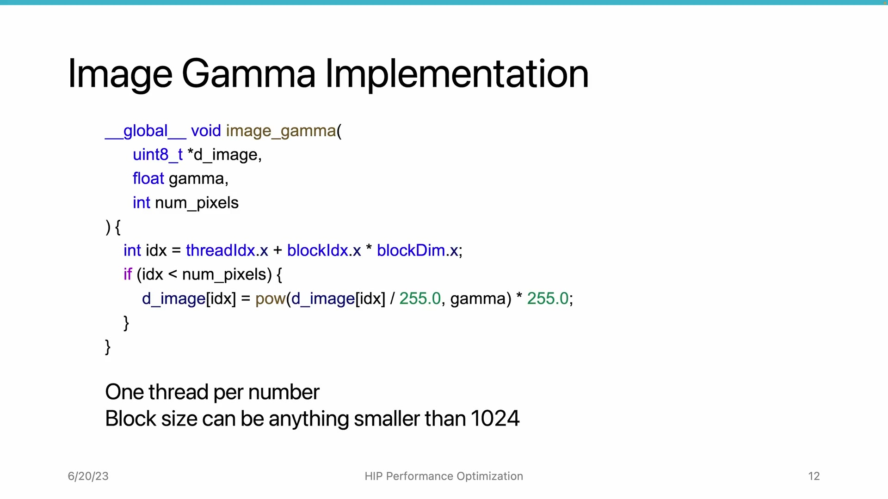
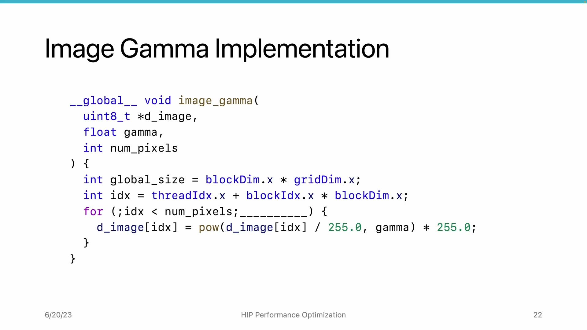
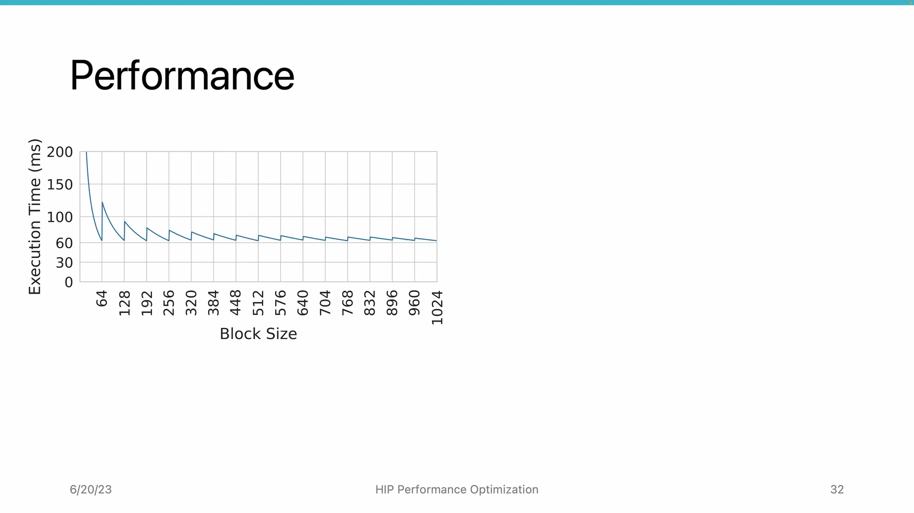

# AMD HIP Tutorial, 7-2 — Block/Grid Size Decision

**AMD HIP Tutorial — Week 7: GPU Performance Optimization**

> Video: https://www.youtube.com/watch?v=_jp0toGvdrU

---

## 1. Overview

Starting the deep dive into GPU kernel performance bottlenecks. This lecture uses an **image gamma correction** example to explore how **block size** and **grid size** decisions impact kernel performance.

---

## 2. Image Gamma Correction Example

### Algorithm:
```
V_out = a × V_in ^ γ
```

- V_in, V_out: brightness values [0, 1] (float) or [0, 255] (uint8)
- a = 1 (typically)
- γ (gamma): γ=1 → no change; γ>1 → darker; γ<1 → brighter

### Memory Representation:
- Image = array of pixels
- Each pixel = 3 channels (R, G, B), each 8-bit unsigned int (0-255)
- Total values to process = pixels × 3

---

## 3. The Naive Implementation


*Figure 1: Naive kernel — one thread per pixel-channel, block size as free parameter*


- One thread per pixel-channel
- Block size can be anything < 1024 (HW limit)
- **Results are identical** regardless of block size — but performance varies dramatically

---

## 4. Wavefront-Aware Block Sizing


*Figure 2: Performance vs block size — sawtooth pattern; multiples of 64 are optimal*


Running on MI50 GPU with various block sizes reveals a **sawtooth/jigsaw performance pattern:**

| Block Size | Result |
|-----------|--------|
| 1 | Extremely slow — only 1/64 compute power used |
| 65 | Almost doubles execution time vs 64 (one extra thread forces a second wavefront with 63 idle threads) |
| 64, 128, 256, 512 | Stable, near-optimal (~60 ms baseline) |

### **Rule: Always use full wavefronts. Block size must be a multiple of wavefront size (64 on AMD GPUs).**
Never use partial wavefronts.

---

## 5. The Dispatch Overhead Problem

The command processor dispatches blocks one-by-one to compute units. For embarrassingly parallel workloads (image gamma, vector add), each wavefront does a small task and retires quickly → **dispatch overhead becomes significant.**

### Solution:
Each wavefront should do **more work**, so fewer blocks need dispatching. Each thread must process **multiple** pixels instead of just one.

---

## 6. Grid-Stride Loop (Fixed-Size Kernel)


*Figure 3: Grid-stride (Option 1, GPU-friendly) vs contiguous partition (Option 2, CPU-friendly)*


Convert the simple kernel into a **fixed-size kernel** with a loop. Two ways to partition workload:

### Option 1: Grid-Stride Pattern (GPU-Friendly ✓)
- Thread 0 → pixel 0, 4, 8... ; Thread 1 → pixel 1, 5, 9...
- Each iteration strides by grid size
- Adjacent threads access adjacent memory → **coalesced memory access**

### Option 2: Contiguous Partition (CPU-Friendly, GPU-Bad ✗)
- Each thread gets a contiguous chunk
- Prevents coalesced memory access on GPUs

> **Use Option 1 for GPUs.** Memory coalescing will be covered in depth in Section 8.

---

## 7. Tuning the Total Thread Count


*Figure 4: Performance vs number of blocks — bottom curve significantly lower; fixed-size kernels can double performance*


With fixed block size (e.g., 256), total threads (grid size) becomes a tunable parameter:

| Observation | Detail |
|------------|--------|
| **Fewer total threads** | Performance almost doubles (~60ms → ~30ms). Lower dispatch pressure, wavefronts live longer. |
| **Too few blocks** | Underutilization. 1 block = only 1 of 60 CUs on MI50 used. |
| **Sweet spot** | ~300-600 blocks on MI50 → fully saturates all CUs and memory bandwidth. |
| **~60 blocks** | Smaller sawtooth — a second "round" of blocks gets scheduled. |

---

## 8. Key Takeaways

| Concept | Rule |
|---------|------|
| **Block size** | Always a multiple of wavefront size (64 on AMD). Avoid partial wavefronts. |
| **Grid-stride loop** | Convert simple kernels to fixed-size kernels — each thread processes multiple elements. Reduces dispatch overhead, enables coalesced memory. |
| **Grid size** | Enough to saturate all CUs (~300-600 on MI50), but not so many that dispatch overhead dominates. |
| **Performance gain** | Switching from naive one-thread-per-element to well-tuned grid-stride can yield **~2× speedup**. |

*Source: AMD HIP Tutorial Series, Lecture 7-2*
