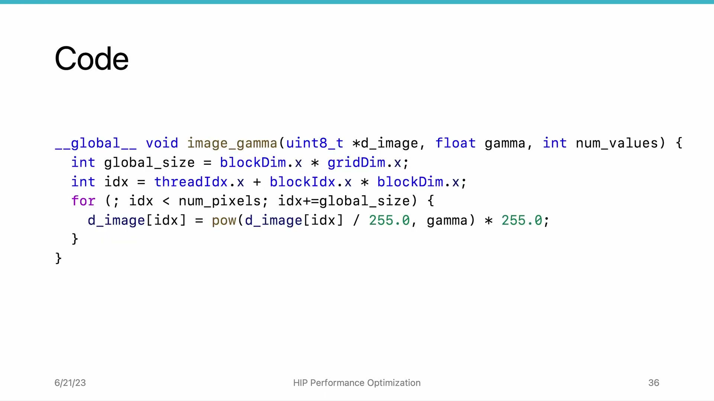
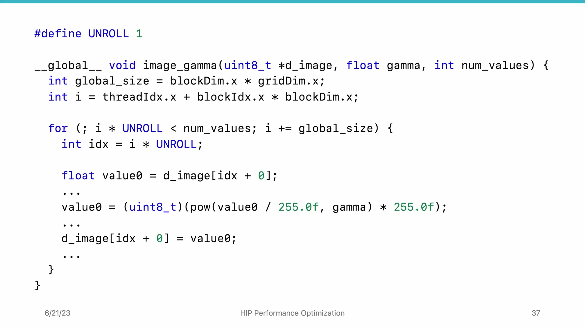
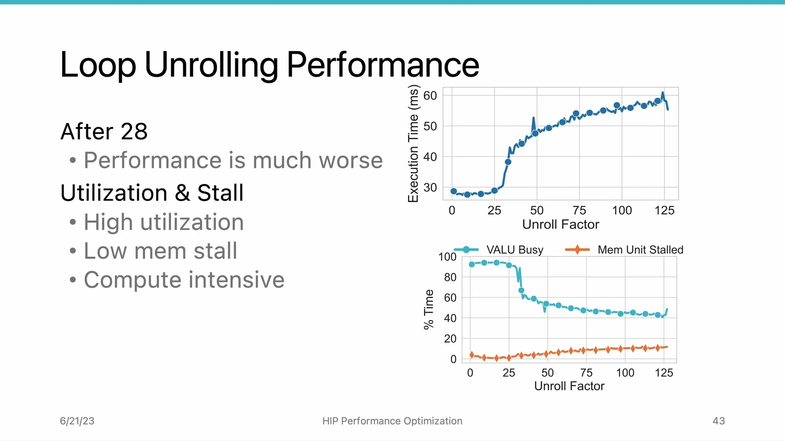

# AMD HIP Tutorial, 7-3 — Loop Unrolling

**AMD HIP Tutorial — Week 7: GPU Performance Optimization**

> Video: https://www.youtube.com/watch?v=M6PVH-mKPhI

---

## 1. Overview

*Figure 1: Loop unrolling — adding more work to loop body to reduce instruction overhead*

After optimizing dispatch overhead with fixed-size kernels, the next bottleneck lies **within the compute unit** — the loop body still contains control-flow instruction overhead. **Loop unrolling** reduces this overhead by making each iteration process more work.

---

## 2. The Loop Unrolling Technique

*Figure 2: Unrolled loop body — Load → Compute → Store pattern per pixel; registers hold intermediate values*

Instead of one pixel per iteration, unroll to process **N pixels** at once. Define an **unrolling factor** (e.g., 2, 3, 4, ...).

**Per-chunk pattern: Load → Compute → Store:**

1. **Load:** Read pixel value into register (`value_0`, `value_1`, ...)
2. **Compute:** Apply gamma correction (register operations, very fast)
3. **Store:** Write result back to memory

The three separated phases enable **memory access to overlap with computation**.

> The result is **always identical** regardless of unrolling factor value.

---

## 3. Performance Results on MI100

*Figure 3: Execution time vs unrolling factor — sweet spot at factor 6, sharp drop beyond 28*

| Unrolling Factor | Performance |
|-----------------|-------------|
| 1 | Baseline |
| 2–6 | Steady improvement (factor 6 = **sweet spot**) |
| 6–12 | Small degradation |
| 12–25 | Gradual decline |
| > 28 | **Sharp drop** |

---

## 4. rocprof Analysis: Why Does Performance Degrade?

### 4.1 Instruction Count
- VALU instructions **decrease** until factor 8 (matches expectations — less loop overhead)
- After factor 12: instruction count **grows** (something is wrong)

### 4.2 VALU Utilization & Memory Stalls
- Before factor 23: VALU busy > 90% (image gamma is **compute-intensive**)
- After factor 25: VALU busy drops to ~40%. Memory unit stall time increases dramatically.

### 4.3 Register Spilling (Root Cause)

Higher unrolling factors require **more registers**. When the GPU hardware can't provide enough, the compiler **spills registers to main memory**, causing excessive reads/writes.

| Before Factor 25 | After Factor 25 |
|-----------------|-----------------|
| Stable memory access | Memory traffic surges |
| VALU busy > 90% | VALU busy ~40% |
| Good performance | Massive slowdown |

> **Register spilling signature in rocprof:** VALU utilization drops + memory traffic surges.

---

## 5. Key Takeaways

| Concept | Detail |
|---------|--------|
| **Loop unrolling** | Process multiple elements per iteration → reduce control-flow overhead, overlap memory & compute |
| **Sweet spot** | Optimal unrolling factor exists. Too small → overhead remains. Too large → register spilling. |
| **Register spilling** | More registers needed than hardware provides → spill to main memory → massive slowdown |
| **VALU utilization** | Drop in VALU busy + increased memory traffic = classic register-spilling indicator |
| **Occupancy tradeoff** | More registers per thread → fewer concurrent wavefronts per CU → lower occupancy (covered next) |

*Source: AMD HIP Tutorial Series, Lecture 7-3*
