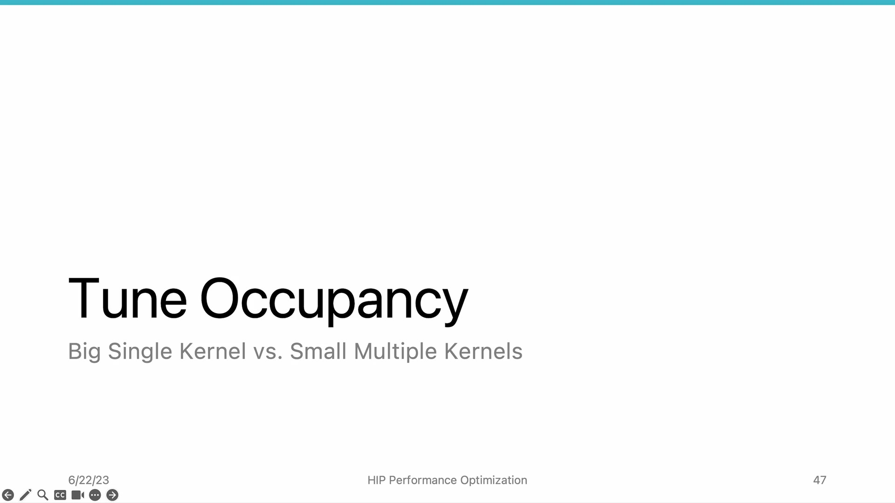
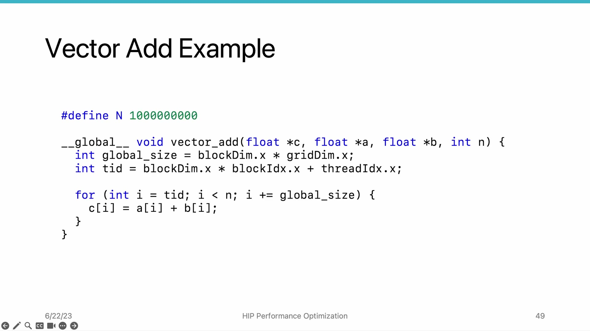
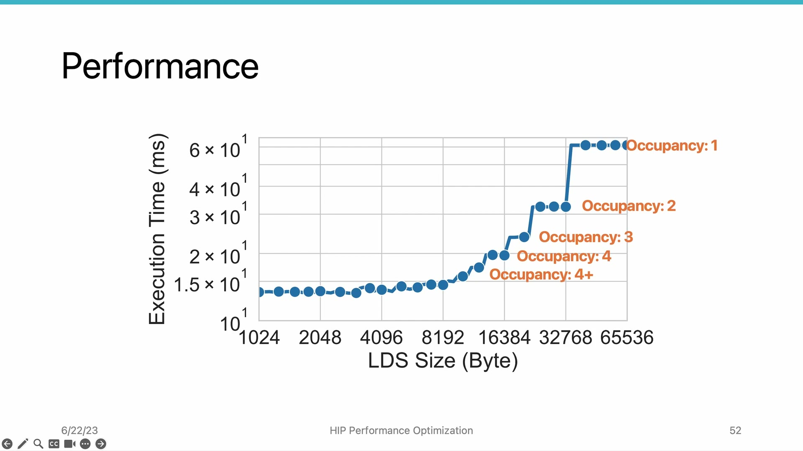

# AMD HIP Tutorial, 7-4 — Tune Occupancy

**AMD HIP Tutorial — Week 7: GPU Performance Optimization**

> Video: https://www.youtube.com/watch?v=wbGFRcU98R8

---

## 1. Overview


*Figure 1: Occupancy — number of concurrent wavefronts per compute unit*


**Occupancy** = number of wavefronts concurrently running in each compute unit at the same time.

The previous video showed how high register usage (from aggressive unrolling) reduces occupancy and hurts performance. This video explores **tuning occupancy** to find the optimal balance.

---

## 2. Why Occupancy Matters

GPUs hide memory latency through **thread-level parallelism**: while one wavefront waits for memory, others execute. Higher occupancy = more wavefronts to hide latency.

### Resource Limitations per CU:


*Figure 2: Resource limitations per CU — wavefront slots (40), registers, LDS*


| Resource | Capacity |
|----------|----------|
| Wavefront slots | 40 per CU |
| Vector register file | Limited size |
| Scalar register file | Limited size |
| LDS (Local Data Share) | Limited size |

**Occupancy = actual_wavefronts / max_possible_wavefronts**

---

## 3. Trade-off: Higher Occupancy is NOT Always Better

| Good | Bad |
|------|-----|
| Hides memory latency better | Too many concurrent wavefronts may **thrash L1 cache** |
| Memory-bound kernels benefit greatly | Competing for cache lines → possibly **lower** performance |

> There is a **sweet spot** — not too low, not too high.

---

## 4. Using LDS as a Tuning Knob


*Figure 3: Using LDS size as a knob to control occupancy — changing LDS_SIZE controls how many wavefronts fit per CU*


For a simple vector add kernel (few registers, no LDS usage), occupancy easily reaches 100%. To study occupancy's effect, we **artificially control it** by allocating LDS:

```cpp
__shared__ float dummy_array[LDS_SIZE];
```

- Larger LDS = fewer wavefronts fit in CU = lower occupancy
- This gives a **controllable knob** from occupancy ≈ 1/40 up to 100%

---

## 5. Performance Results (MI100)


| LDS Size | Occupancy | Execution Time |
|----------|-----------|---------------|
| > 32 KB | 1 (only 1 wavefront) | ~6 µs |
| ~16 KB | 2 | ~3 µs (**almost doubles performance!**) |
| ~8 KB | 3 | ~2.4 µs |
| ~4 KB | 4 | ~2 µs |
| < 4 KB | ≥ 4 | Hard to see stair boundaries (diminishing returns) |

**Key insight:** The biggest performance gain is from occupancy 1 → 2. Beyond 4, returns diminish for this memory-bound kernel.

---

## 6. Key Takeaways

| Concept | Detail |
|---------|--------|
| **Occupancy** | Concurrent wavefronts per CU / max possible (40 on AMD) |
| **Memory-bound kernels** | Generally benefit from higher occupancy |
| **Compute-bound kernels** | May suffer from too-high occupancy (cache thrashing). Find sweet spot experimentally. |
| **LDS as knob** | Allocating LDS controls occupancy. Use rocprof to measure actual values. |
| **1 → 2 jump** | Biggest performance improvement comes from occupancy 1→2 (6µs→3µs). Beyond 4, diminishing returns. |

*Source: AMD HIP Tutorial Series, Lecture 7-4*
