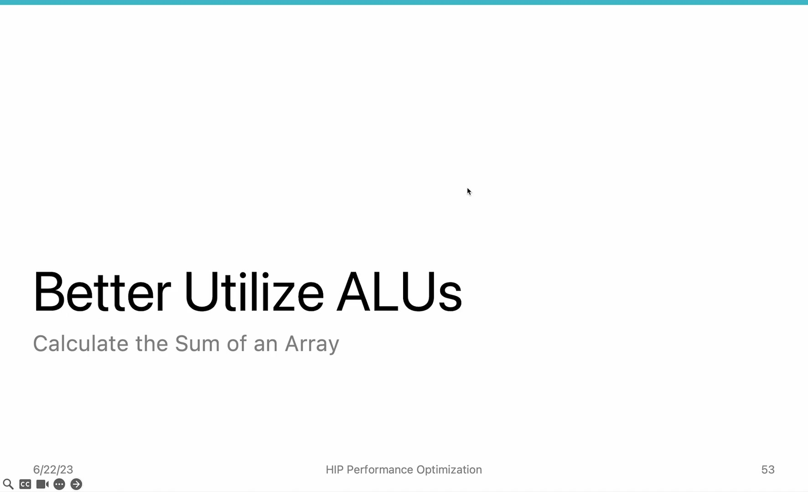
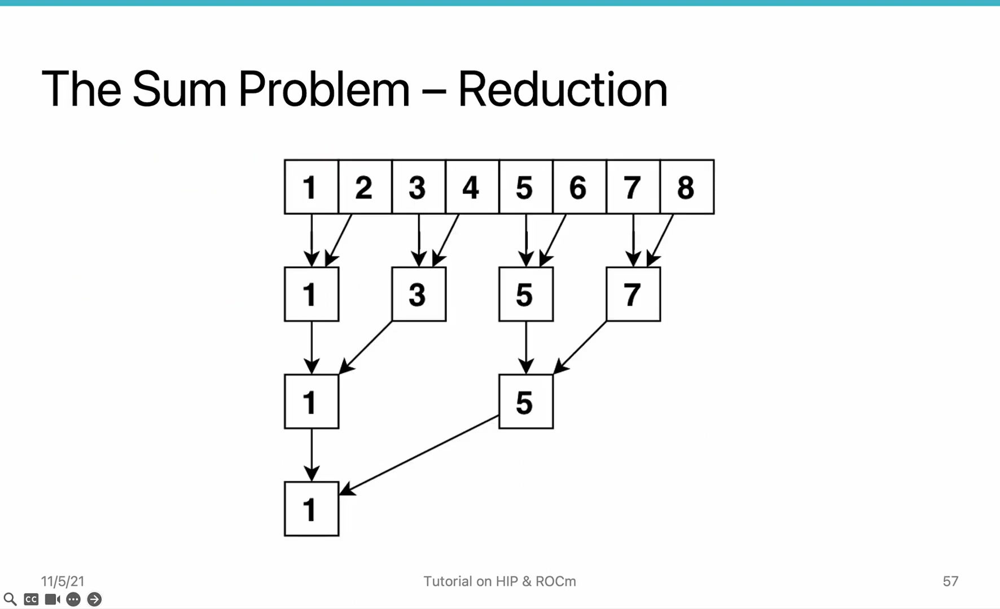
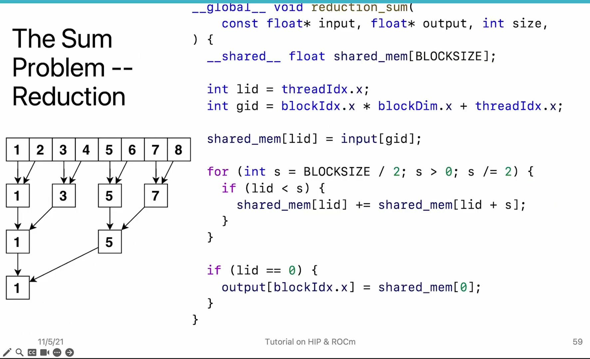
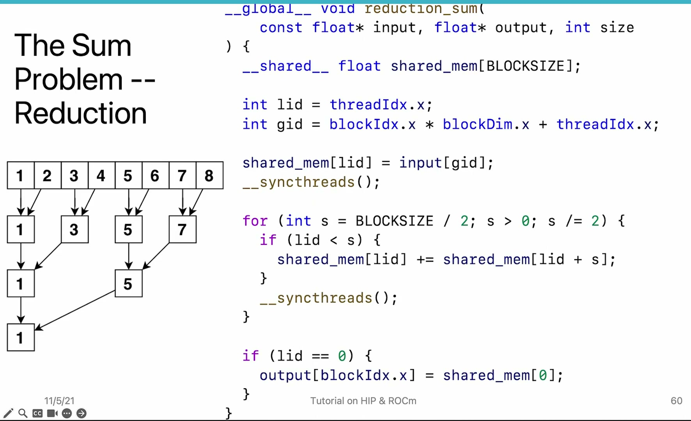

# AMD HIP Tutorial, 7-5 — Better Utilize GPUs

**AMD HIP Tutorial — Week 7: GPU Performance Optimization**

> Video: https://www.youtube.com/watch?v=cXN4TWrY36Q

---

## 1. Overview

Even with good occupancy, individual ALUs may be underutilized due to **thread divergence**. This video covers two key techniques:

- **Reduction algorithms** — to minimize thread divergence
- **Local Data Share (LDS)** — to enable fast thread-to-thread communication within a work group

---

## 2. Thread Divergence Problem


*Figure 1: Thread divergence — conditional branches waste ALU capacity by masking off threads*


When a wavefront encounters a conditional (`if/else`), threads that don't take the branch are **masked off**.

| Case | ALU Utilization |
|------|----------------|
| Perfect unity (all threads same branch) | 100% |
| Half threads take branch | 50% |
| Worst case | 1/64 = ~1.6% |

### Example: Array Sum on GPU
- **Naive single-threaded:** 0.58s for 10M elements on MI50 (slower than CPU!)
- Reason: 63 of 64 ALU lanes idle

---

## 3. Local Sums: First Optimization


*Figure 2: Local sums — each thread sums a subset; 7,300× speedup but output still needs CPU reduction*


Let each thread compute sum of a subset → execution drops from 0.58s to **78.1 µs** (**7,300× speedup**).

**Problem:** Output is still an array (one partial sum per thread) — CPU must sum them up, adding overhead.

---

## 4. GPU Reduction Algorithm


*Figure 3: Reduction algorithm — tree pattern; each step halves the number of elements until one remains per block*


A **tree-based reduction** progressively combines partial sums within a block:

```
Step 1: Thread 1 sums (1,2), Thread 3 sums (3,4), Thread 5 sums (5,6), Thread 7 sums (7,8) → 8→4
Step 2: Thread 1 sums (1,3), Thread 5 sums (5,7) → 4→2
Step 3: Thread 1 sums (1,5) → 2→1
```

With block size 1024, the whole array is reduced **1024×** — one number per block instead of per thread.

---

## 5. Local Data Share (LDS)


*Figure 4: LDS allocation in HIP code — shared memory per block for fast thread communication*


LDS is both a software concept and a hardware resource:

| Aspect | Description |
|--------|-------------|
| **Software** | Per-work-group memory addressable by all threads in the same block. Enables wavefront-to-wavefront & thread-to-thread communication. |
| **Hardware** | SRAM (same technology as registers & L1 cache). Physically close to SIMD units. |
| **Latency** | **1-2 cycles** — almost no latency |
| **Mental model** | **"Programmable L1 cache"** — programmers decide what data to store |

### Using LDS in HIP:
```cpp
__shared__ float shared_mem[BLOCK_SIZE];  // Size is per-block
```

Reading/writing LDS uses the **same syntax** as global memory — but MUCH faster.

---

## 6. Synchronization: `__syncthreads()`


When multiple wavefronts share data in LDS, barriers are needed:

1. After loading into LDS → sync (all data loaded before reduction)
2. Between reduction steps → sync (current level complete before next)
3. Before final output write → sync (only one thread writes result)

### ⚠ **CRITICAL RULE: Never put `__syncthreads()` (barriers) inside `if` statements.**

If some wavefronts execute the barrier while others skip it:
- Program will hang or produce incorrect results
- Such bugs are **extremely hard to debug**
- The HIP runtime cannot tell which barrier you're synchronizing

---

## 7. End-to-End Performance

Combining all techniques from Week 7:

```
Fixed-size kernel (grid-stride loop) + LDS + Reduction + __syncthreads()
```

**Result:** ~80 µs for 10M elements on MI50 — **single output value, no CPU-side summation needed.**

---

## 8. Key Takeaways

| Concept | Detail |
|---------|--------|
| **Thread divergence** | Conditionals waste ALU capacity by masking off threads. Redesign algorithmically (reduction). |
| **Reduction** | Tree-based pattern: N elements → 1 in log(N) steps using shared memory. |
| **LDS** | Ultra-fast on-chip memory (1-2 cycle latency). Programmers explicitly manage it. |
| **`__syncthreads()`** | Barrier for wavefronts within a block. **Never inside if-statements.** |
| **Combined approach** | Grid-stride loop + LDS + reduction + barriers = efficient GPU reduction kernel. |

*Source: AMD HIP Tutorial Series, Lecture 7-5*
