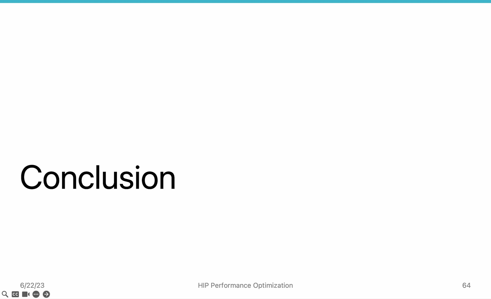
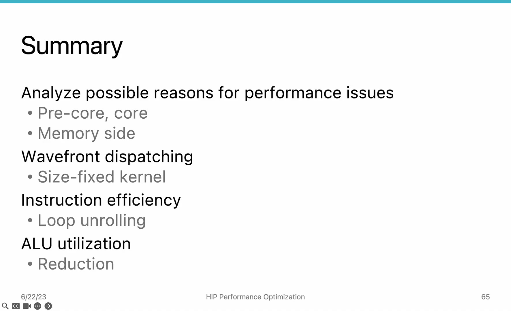

# AMD HIP Tutorial, 7-6 — Summary of Section 7

**AMD HIP Tutorial — Week 7: GPU Performance Optimization**

> Video: https://www.youtube.com/watch?v=dcc7b9FxWSo

---

## 1. Section 7 Summary


*Figure 1: Section 7 overview — analyzing and mitigating compute-side performance bottlenecks*

This video summarizes the methods introduced in Section 7 for tuning GPU compute performance. The focus has been on the **front-end** of the GPU: the command processor (pre-core) and the compute unit (core).

---

## 2. Methods Covered in Section 7

### 2.1 Wavefront Dispatching — Fixed-Size Kernels (7-2)

**Problem:** The block dispatcher creates overhead when dispatching many small blocks.

**Solution:** Use **fixed-size kernels** (grid-stride loop) so each wavefront does more work. Fewer total wavefronts → lower dispatch overhead.

### 2.2 Instruction Efficiency — Loop Unrolling (7-3)

**Problem:** Loop control-flow instructions add overhead within each compute unit.

**Solution:** **Loop unrolling** reduces instruction count by processing multiple elements per iteration. However, beware of register spilling at high unrolling factors.

### 2.3 ALU Utilization — Occupancy Tuning (7-4)

**Problem:** Low occupancy means fewer wavefronts to hide memory latency.

**Solution:** Tune occupancy using LDS allocation as a knob. For memory-bound kernels, higher occupancy helps. For compute-bound kernels, too high occupancy can cause cache thrashing.

### 2.4 Thread Divergence Reduction — Reduction + LDS (7-5)

**Problem:** Conditional branches waste ALU capacity by masking off threads.

**Solution:** Use **reduction algorithms** (tree-based pattern) with **LDS** for fast thread communication. `__syncthreads()` barriers ensure correct synchronization.

---

## 3. The Performance Optimization Flow

```
Identify bottleneck
       ↓
Choose matching technique:
  - Dispatch pressure  →  Fixed-size kernel (7-2)
  - Instruction overhead → Loop unrolling (7-3)
  - Low occupancy      →  Tune occupancy (7-4)
  - Thread divergence  →  Reduction + LDS (7-5)
       ↓
Apply & measure with rocprof
       ↓
Iterate
```

---

## 4. Assignment


*Figure 2: Assignment — rewrite matrix multiplication using the techniques from Section 7*

Implement a matrix multiplication kernel where each thread is responsible for **one output data point**. Then:

1. Convert to a **fixed-size kernel** (grid-stride loop) and measure the improvement
2. Optionally: apply loop unrolling and occupancy tuning for further gains

---

## 5. Looking Ahead: Section 8

The next section shifts focus from the compute side to the **memory side** of GPU optimization:

- Caches and DRAM bottlenecks
- Memory coalescing
- LDS tiling for coalesced access and reduced repeated loads
- The **roofline model** for classifying workloads

---

## 6. Key Takeaways

| Concept | Detail |
|---------|--------|
| **Section 7 focus** | Pre-core (dispatcher) + Core (CU, ALUs, registers, LDS) |
| **Fixed-size kernels** | Reduce dispatch overhead by making wavefronts do more work |
| **Loop unrolling** | Reduce instruction overhead; watch for register spilling |
| **Occupancy** | Balance wavefront count per CU; use LDS as tuning knob |
| **Reduction + LDS** | Improve ALU utilization by minimizing thread divergence |
| **Iterative process** | Profile → identify bottleneck → optimize → repeat |

*Source: AMD HIP Tutorial Series, Lecture 7-6*
