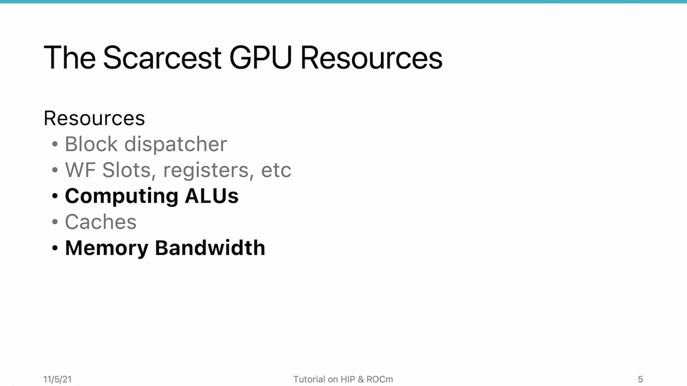
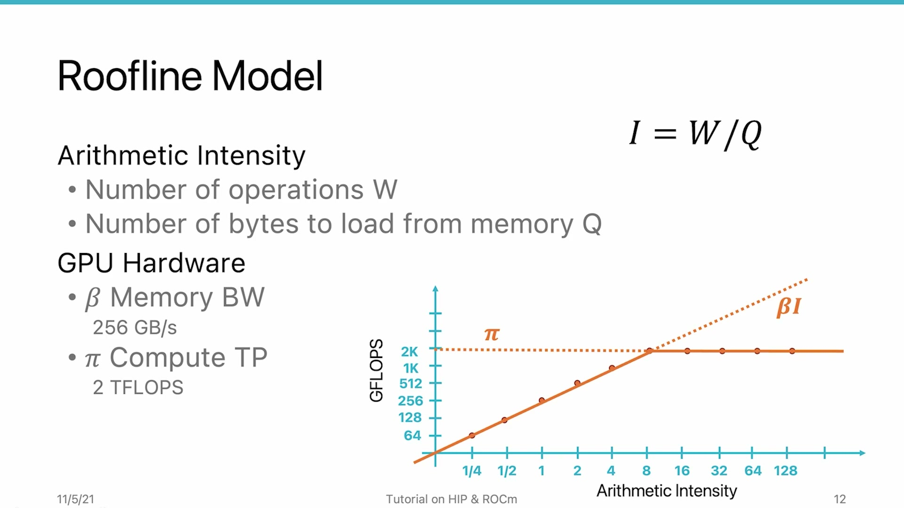
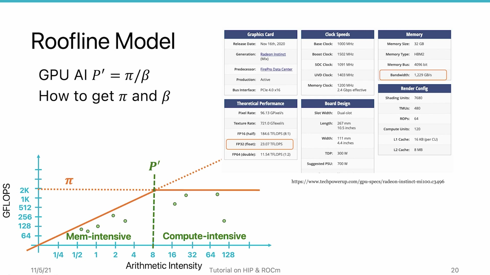

# AMD HIP Tutorial, 8-1 — The Roofline Model

**AMD HIP Tutorial — Week 8: Memory Performance Optimization**

> Video: https://www.youtube.com/watch?v=mVY1GfqxzNI

---

## 1. Overview

This video begins **Section 8: Memory Performance Optimization**. While Section 7 focused on compute resources (block dispatcher, wavefront slots, registers, ALUs), this section analyzes the **memory system** to find the best ways to tune applications for better memory utilization.

---

## 2. Arithmetic Intensity


*Figure 1: Arithmetic intensity I = W/Q — operations per byte of data loaded*


The key concept is **Arithmetic Intensity (I):**

```
I = W / Q
```

| Variable | Meaning |
|----------|---------|
| **W** | Total floating-point operations in the kernel |
| **Q** | Total bytes loaded from memory |

Arithmetic intensity answers: **"How many operations do I perform for every byte of data loaded?"**

- I = 1 → one operation per byte
- I = 1/4 → one operation per four bytes (very memory-heavy)
- Scale: 1/4 to 128 (logarithmic)

---

## 3. The Two-Segment Roofline Curve


*Figure 2: Two-segment roofline — sloped memory-bound region (β×I) and flat compute-bound region (π)*


The roofline model combines application AI with GPU hardware capabilities:

### Segment 1: Memory-Bound (Sloped Line)
- Slope **β** = memory bandwidth
- Performance = **β × I**
- If the application is here → **increasing memory bandwidth improves performance**

### Segment 2: Compute-Bound (Flat Line)
- Height **π** = theoretical compute throughput
- If the application is here → **increasing compute throughput improves performance**

### The Turning Point: GPU's Arithmetic Intensity
```
I_GPU = π / β
```

At this point, both memory bandwidth AND compute throughput are **fully utilized**.

---

## 4. Workload Classification


*Figure 3: Workload classification — memory-intensive (left of I_GPU) vs compute-intensive (right)*


| Classification | Arithmetic Intensity | Optimization Strategy |
|---------------|---------------------|----------------------|
| **Memory-intensive** | I < I_GPU | Improve memory bandwidth utilization; reduce data movement |
| **Compute-intensive** | I > I_GPU | Improve ALU utilization; optimize computation |

### Optimization Goal:
**Move the application's arithmetic intensity toward the GPU's arithmetic intensity** so both resources are fully utilized.

---

## 5. MI100 Specs

| Spec | Value |
|------|-------|
| Single-precision throughput | **23.7 Teraflops** |
| Memory bandwidth | **1,229 GB/s** |

The course provides a Python script that takes rocprofiler output and plots the roofline model with actual data points.

---

## 6. Key Takeaways

| Concept | Detail |
|---------|--------|
| **Arithmetic Intensity** | I = operations / bytes loaded. Measures computational density. |
| **Roofline curve** | Two segments: sloped (β×I, memory-bound) + flat (π, compute-bound) |
| **I_GPU** | The turning point = π/β. Represents balanced utilization. |
| **Optimization strategy** | Move app AI toward GPU AI. Memory-bound: reduce traffic/increase reuse. Compute-bound: optimize ALU utilization. |
| **General rule** | Moving the application point from left side (memory-bound) toward the right side improves overall utilization. |

*Source: AMD HIP Tutorial Series, Lecture 8-1*
