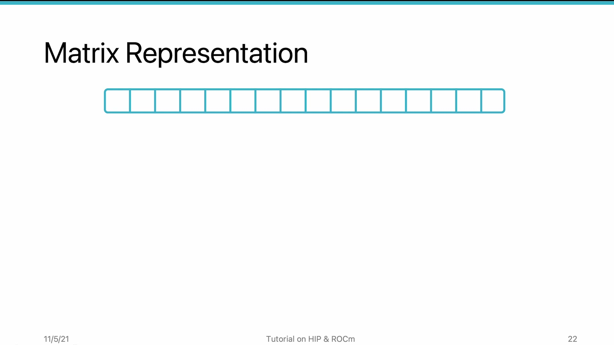
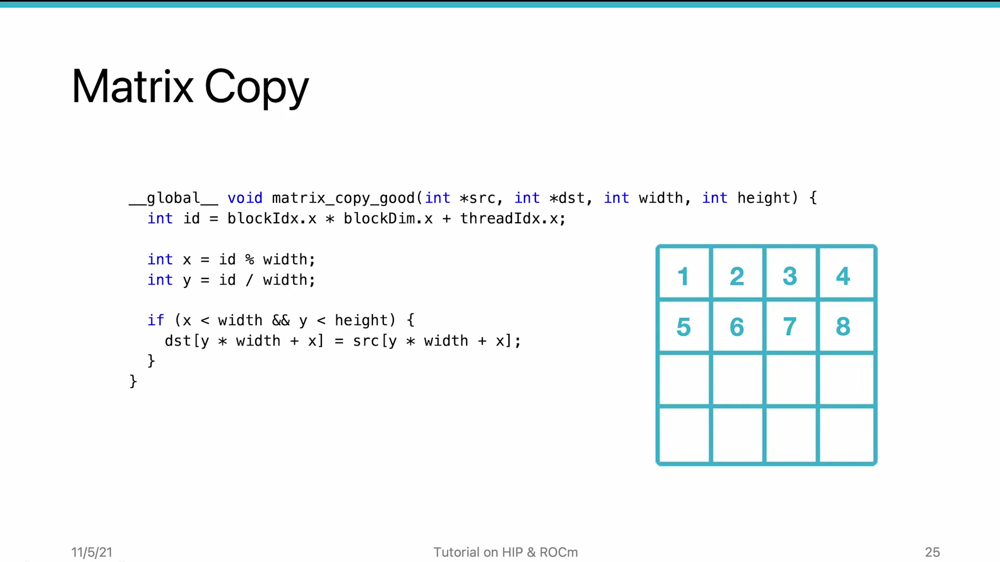
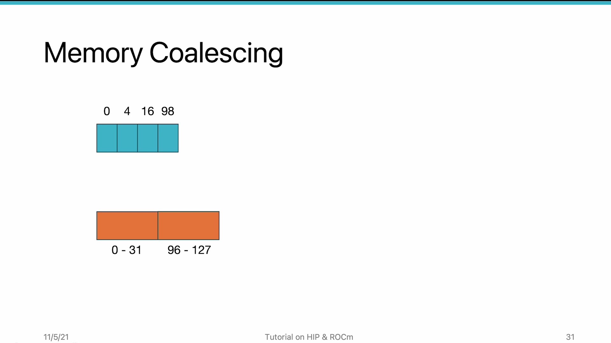

# AMD HIP Tutorial, 8-2 — Utilize Memory (Coalescing)

**AMD HIP Tutorial — Week 8: Memory Performance Optimization**

> Video: https://www.youtube.com/watch?v=3rptcftzI1g

---

## 1. Overview

**Memory coalescing** is a critical GPU performance feature. When adjacent threads in a wavefront access adjacent memory addresses, the GPU combines multiple small memory requests into a **single wide transaction**. This video demonstrates the impact using a matrix copy example.

---

## 2. Matrix Layout: Row-Major vs Column-Major


*Figure 1: Row-major vs Column-major matrix layout — affects coalesced access patterns*


| Layout | Adjacent Elements | Coalesced Access |
|--------|-------------------|------------------|
| **Row-major** | Horizontal neighbors are adjacent in memory | Row access (horizontal) ✓ |
| **Column-major** | Vertical neighbors are adjacent in memory | Column access (vertical) ✓ |

> For a row-major matrix: accessing horizontally = coalesced; accessing vertically = **strided and non-coalesced**.

---

## 3. Matrix Copy: Good vs Bad


*Figure 2: Good (coalesced) vs Bad (non-coalesced) — minimal code change, 40× performance difference*


### Good Implementation (Coalesced)
- Thread 0 → matrix[0], Thread 1 → matrix[1], etc.
- Adjacent threads access adjacent memory → ✓

### Bad Implementation (Non-Coalesced)
- Tiny code change: swap `/` vs `%`, treat row-major as column-major
- Adjacent threads write to far-apart addresses → ✗

---

## 4. Performance Results (MI100, 32K×32K)

```
Good: 9 ms    vs    Bad: 364 ms    (40× slower!)
```

---

## 5. How Coalescing Works: Cache Line Mechanics


*Figure 3: Cache line mechanics — one transaction covers 128 bytes; non-coalesced = many transactions + cache pollution*


The smallest unit a core accesses is a **cache line** (128 bytes on AMD GPUs):

| Thread Access Pattern | Memory Transactions |
|----------------------|-------------------|
| Threads 0,1 access addresses 0,4 | **1 transaction** (same cache line 0-127) |
| Thread 2 accesses address 16 | Still in same line — **0 extra** |
| Next thread accesses address 98 | **New** cache line needed |
| **Worst case:** all 64 threads access different cache lines | **64 separate transactions** |

### Penalties of Non-Coalesced Access:
1. More memory transactions → **higher latency**
2. Loading excess data → **L1 cache pollution** (useful data evicted)

---

## 6. The Golden Rule

**Adjacent threads within one wavefront should access:**
1. The **SAME** piece of data (best — broadcast), or
2. **ADJACENT** pieces of data (good — coalesced)

This minimizes memory transactions and preserves L1 cache space.

---

## 7. Key Takeaways

| Concept | Detail |
|---------|--------|
| **Coalescing impact** | **40× performance difference** on a simple matrix copy |
| **Cache line** | AMD GPU L1 cache line = 128 bytes. Adjacent threads in same line = 1 transaction. |
| **Design rule** | Adjacent threads must access adjacent (or same) memory. Be aware of matrix layout. |
| **Root cause** | Non-coalesced = more transactions + L1 cache pollution |

*Source: AMD HIP Tutorial Series, Lecture 8-2*
