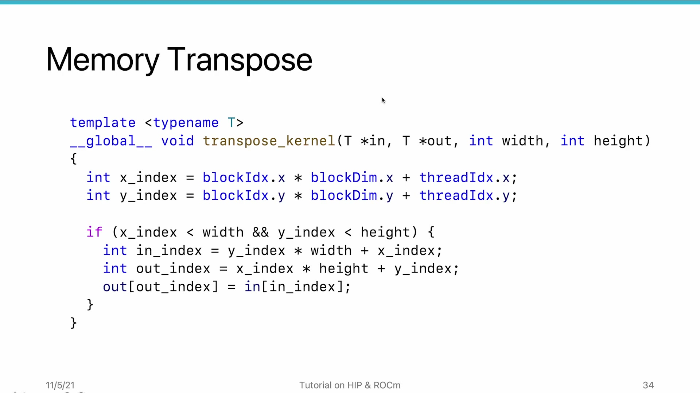
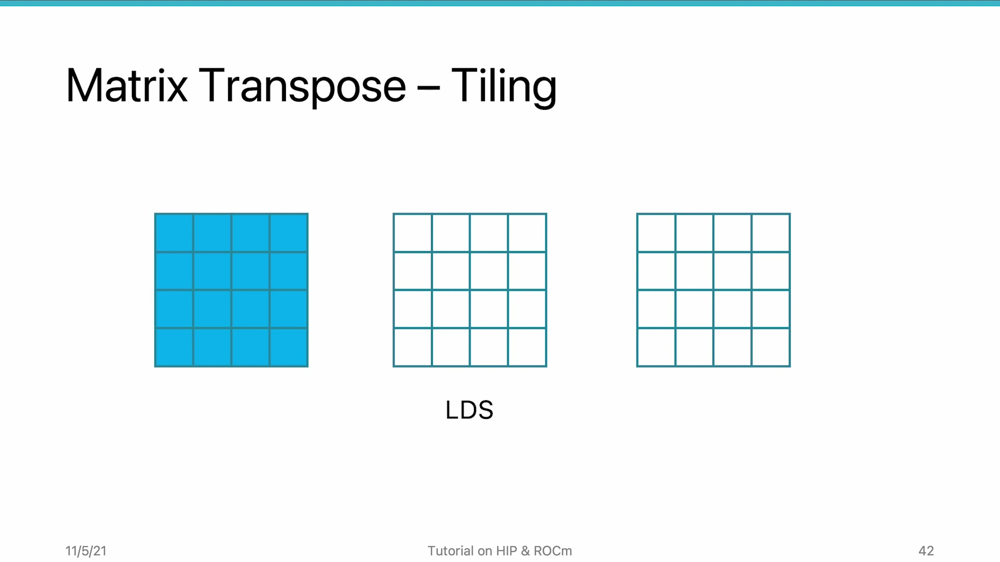
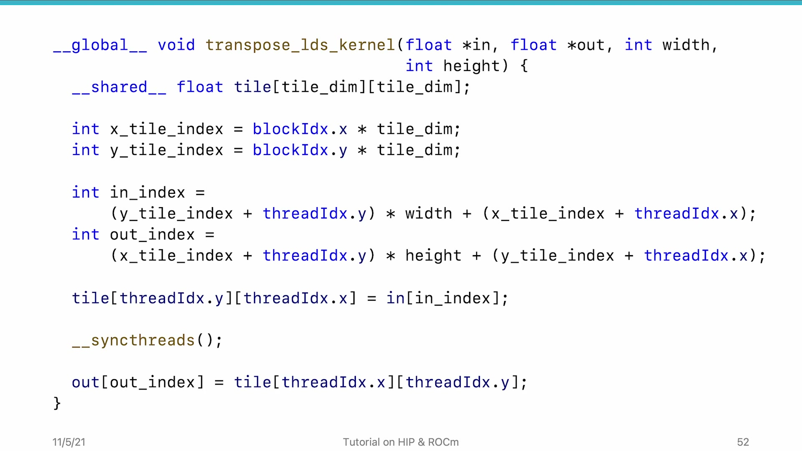

# AMD HIP Tutorial, 8-3 — Use LDS to Coalesce Memory Access

**AMD HIP Tutorial — Week 8: Memory Performance Optimization**

> Video: https://www.youtube.com/watch?v=dTQFUyxXPIE

---

## 1. Overview

**Matrix transpose** is a classic problem where coalesced access is unavoidable on one side: reading horizontally (coalesced) means writing vertically (non-coalesced for row-major). **LDS (Local Data Share)** provides the solution — an intermediate fast buffer to convert non-coalesced writes into coalesced writes.

---

## 2. Naive Transpose Performance Problem


*Figure 1: Matrix transpose — reads are coalesced but writes are scattered (3× excess write traffic)*


With a 16K×16K matrix on MI100 (1 GB):

| Metric | Value | Status |
|--------|-------|--------|
| Read size | ~1 GB (< 1% extra) | Coalesced ✓ |
| Write size | ~3 GB (3× more!) | Non-coalesced ✗ |

**Root cause:** Writing to different columns in a row-major output = each write is in a different cache line = redundant write transactions.

---

## 3. The LDS-Based Solution: Tiling


*Figure 2: Tiling mechanism — load tile to LDS row-by-row → transpose in LDS → write coalesced to output*


**LDS is on-chip SRAM with 1-2 cycle latency and NO coalescing requirement** — any access pattern is fast.

### Tiling Steps:

```
1. Load tile row-by-row from global → LDS   (coalesced READ ✓)
2. __syncthreads()                            (barrier)
3. Read tile column-by-column from LDS       (LDS is always fast)
4. Write as row to global memory              (coalesced WRITE ✓)
```

> Both global memory reads AND writes are now coalesced. The non-coalesced dimension stays entirely within fast LDS.

---

## 4. Tiling Implementation Details


*Figure 3: Tiling-based transpose code — LDS as intermediate buffer for coalesced reads AND writes*


| Aspect | Detail |
|--------|--------|
| **Tile shape** | Square (X dim = Y dim = block size) |
| **Tile size limit** | Limited by LDS capacity; typically 8×8 to 32×32 |
| **LDS load** | `tile[y_tile][x_tile] = input[input_idx]` |
| **Barrier** | `__syncthreads()` between load & store phases |
| **LDS read + store** | `output[output_idx] = tile[x_tile][y_tile]` (note: **x↔y swapped** for transpose) |

> Threads not on the diagonal: each writes one value to LDS and reads a different value from LDS before writing to global memory.

---

## 5. Why This Works

| Access Type | Coalesced? | Performance Penalty? |
|------------|-----------|---------------------|
| Global memory (read) | ✓ Yes (tiled row-by-row) | No |
| LDS (read column) | N/A — LDS is SRAM | **No penalty** — LDS doesn't have cache-line behavior |
| Global memory (write) | ✓ Yes (tiled row-by-row) | No |

---

## 6. Key Takeaways

| Concept | Detail |
|---------|--------|
| **LDS is not cached** | LDS is SRAM with no coalescing requirement — any access pattern is equally fast |
| **Tiling pattern** | Load (coalesced) → barrier → read LDS (transposed, no penalty) → write (coalesced) |
| **Tile size** | Limited by LDS per CU. 8×8, 16×16, or 32×32 typical. |
| **Application** | Tiling works for any workload where one access dimension is naturally non-coalesced. |

*Source: AMD HIP Tutorial Series, Lecture 8-3*
