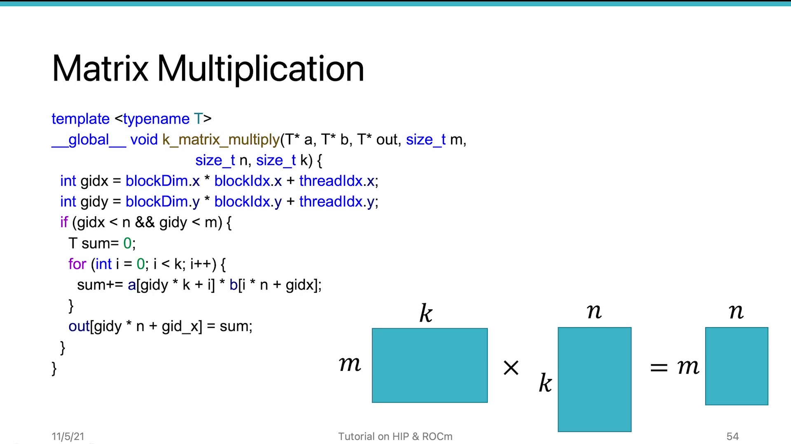
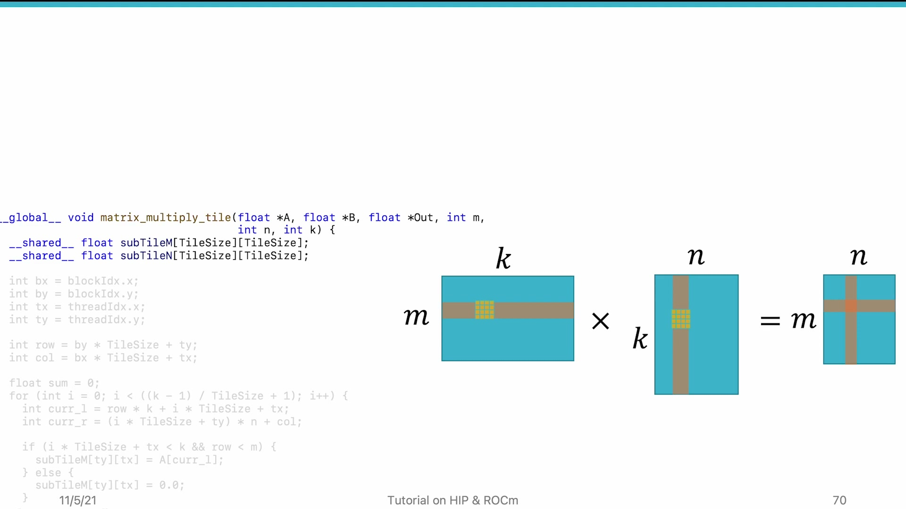
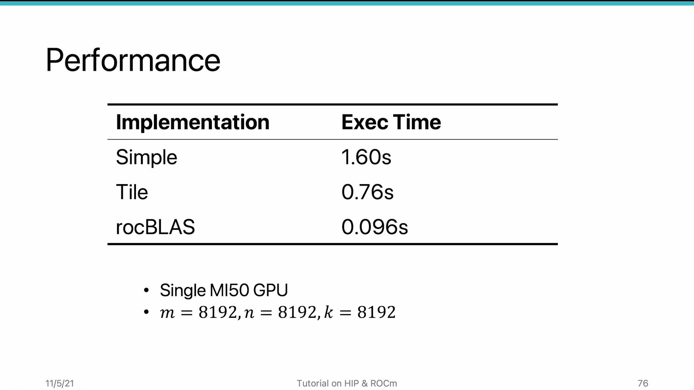

# AMD HIP Tutorial, 8-4 — Use LDS to Avoid Repeated Memory Access

**AMD HIP Tutorial — Week 8: Memory Performance Optimization**

> Video: https://www.youtube.com/watch?v=mwrXYG8dHjM

---

## 1. Overview

Another common performance problem: **repeated memory access**. In workloads like matrix multiplication, each input element is loaded multiple times. **LDS can cache tiles of data on-chip** to eliminate redundant global memory accesses.

---

## 2. Naive Matrix Multiplication Analysis

For C = A × B (M×K × K×N → M×N), each thread computes one output element by iterating K times.

### Coalescing Analysis:

| Matrix | Pattern | Coalesced? |
|--------|---------|-----------|
| **A** (M×K) | Adjacent threads access same row | ✓ (broadcast) |
| **B** (K×N) | Adjacent threads access adjacent columns | ✓ |
| **C** (M×N) | Adjacent threads write adjacent elements | ✓ |

> **All accesses are coalesced!** So why is performance still suboptimal?

---

## 3. The Repeated Access Problem


*Figure 1: Matrix multiplication — overlapping tiles cause repeated reads from global memory*


As the loop iterates through K:

- Iteration 1: Wavefront loads tile of A[0..T, 0..K] and B[0..K, 0..T]
- Iteration 2: Wavefront loads tile of A[0..T, 1..K+1] and B[1..K+1, 0..T]
- **Much of iteration 2's data was already loaded in iteration 1!**

Whether the reload hits L1 cache is **unreliable** — depends on cache size and number of concurrent threads.

### Solution: Use LDS to explicitly hold tile data.

---

## 4. Tiled Matrix Multiplication


*Figure 2: Tiling approach — two LDS tiles (A & B), K/tile_size outer iterations, tile_size inner accumulations*


Two LDS tiles (one for A, one for B):

```
Loop over tile-sized chunks of K (K/tile_size iterations):
  1. Load tile_A and tile_B into LDS (coalesced global reads)
  2. __syncthreads()
  3. Inner loop: accumulate over tile_size elements
  4. __syncthreads()
After all iterations: store accumulated sum to output
```

### Key Difference from Naive:
- Naive: K iterations (e.g., 8192)
- Tiled: K/tile_size iterations (e.g., 8192/32 = 256)
- Each tiled iteration does tile_size inner accumulations (32)

---

## 5. Performance Results (MI50, 8K×8K Matrices)


*Figure 3: Performance comparison — naive (1.6s) vs tiled (0.76s) vs rocBLAS (0.15s)*


| Implementation | Time | Speedup |
|---------------|------|---------|
| Naive | 1.6 s | 1× |
| Tiled (LDS) | 0.76 s | **~2×** |
| rocBLAS (ASM-optimized) | 0.15 s | **~10×** |

> **Takeaway:** For well-established algorithms (BLAS, FFT, convolution), use optimized **libraries** (rocBLAS, rocFFT, MIOpen). Hand-coded kernels typically cannot match library performance.

---

## 6. Key Takeaways

| Concept | Detail |
|---------|--------|
| **Repeated access** | Even perfectly coalesced code can waste bandwidth by reloading the same data. LDS caches tiles on-chip. |
| **Tiling for matmul** | Two LDS tiles (A & B). K/tile_size outer iterations, tile_size inner accumulations. |
| **Use libraries** | For established algorithms: rocBLAS, rocFFT, MIOpen. Library code is often **10× faster** than hand-written. |
| **Custom kernels** | When writing custom code, always consider LDS to reduce repeated memory accesses. |

*Source: AMD HIP Tutorial Series, Lecture 8-4*
