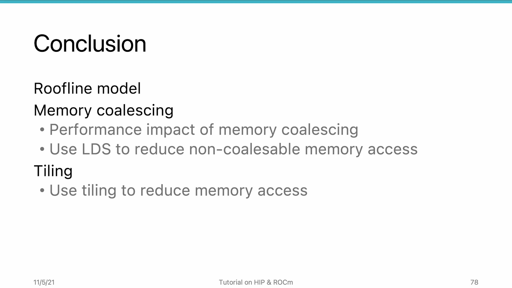
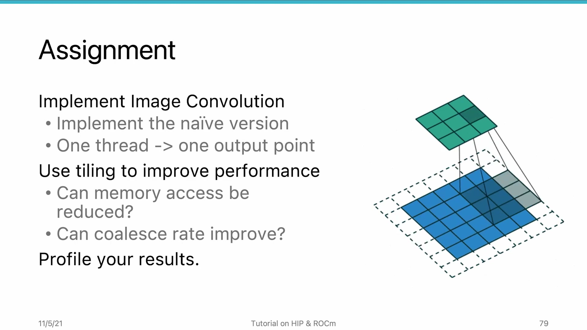

# AMD HIP Tutorial, 8-5 — Summary of Section 8

**AMD HIP Tutorial — Week 8: Memory Performance Optimization**

> Video: https://www.youtube.com/watch?v=V2mGJYrm8P8

---

## 1. Section 8 Summary

*Figure 1: Section 8 summary — from roofline model to practical LDS optimization techniques*

This final video ties together all memory optimization concepts covered in the unit.

---

## 2. What We Learned

### 8-1: The Roofline Model
- Classify workloads as **memory-intensive** or **compute-intensive**
- Arithmetic Intensity: `I = operations / bytes loaded`
- Two-segment curve: sloped (β×I, memory-bound) + flat (π, compute-bound)
- **Goal:** Move application AI toward GPU AI for balanced resource utilization

### 8-2: Memory Coalescing
- Adjacent threads accessing adjacent data → single transaction
- Non-coalesced access: **40× slower** (matrix copy: 9ms vs 364ms)
- Design rule: adjacent threads must access adjacent (or same) memory addresses
- Cache line = 128 bytes on AMD GPUs

### 8-3: LDS for Coalescing (Matrix Transpose)
- Matrix transpose: one dimension is always non-coalesced
- LDS as intermediate buffer: load (coalesced) → transpose in LDS (no penalty) → write (coalesced)
- **Tiling** enables coalesced reads AND writes

### 8-4: LDS for Reducing Repeats (Matrix Multiplication)
- Even with perfect coalescing, reloading same data wastes bandwidth
- Two LDS tiles cache A and B data on-chip
- **~2× speedup** over naive; **rocBLAS ~10× faster** than hand-coded

---

## 3. Assignment

*Figure 2: Assignment — implement image convolution, profile, and apply tiling with LDS*

Implement an **image convolution algorithm** (building block for CNNs):

1. Start with naive implementation (one thread per output element)
2. Use rocprof to profile: compute-intensive or memory-intensive?
3. Analyze: is memory access repeated or non-coalesced?
4. Apply **tiling with LDS** to improve performance
5. Profile again to measure improvement

> Image convolution is naturally suited for tiling.

---

## 4. Looking Ahead: Unit 9 — HIP Libraries

The next unit introduces HIP libraries (rocBLAS, rocFFT, MIOpen, etc.):

- Use highly-optimized library implementations instead of reinventing the wheel
- Library code written by AMD engineers in assembly
- For well-established algorithms, libraries achieve performance that hand-coded kernels **cannot match**

*Source: AMD HIP Tutorial Series, Lecture 8-5*
