# P2：【新手村】电影感构图篇 — 学习笔记

> **视频来源**：[BV1vx9hB5ELp](https://www.bilibili.com/video/BV1vx9hB5ELp?p=2)
> **系列**：AI视频做电影感，基础到进阶，构图光影运镜…（共10集）
> **UP主**：Xuan_酱
> **时长**：9分18秒
> **难度**：新手村（入门级）
> **整理日期**：2026-07-13
> **字幕来源**：B站AI识别字幕（中文）

---

## 目录

1. [开篇：构图的魔力](#一开篇构图的魔力)
2. [构图的基础：线和点](#二构图的基础线和点)
3. [中心构图](#三中心构图-center-composition)
4. [对称构图](#四对称构图-symmetrical-composition)
5. [三分法构图](#五三分法构图-rule-of-thirds)
6. [对角线构图](#六对角线构图-diagonal-composition)
7. [引导线构图](#七引导线构图-leading-lines)
8. [框架式构图](#八框架式构图-frame-composition)
9. [前景构图（脏构图）](#九前景构图foreground-composition脏构图)
10. [总结与工具推荐](#十总结)
11. [关键术语](#十一关键术语-glossary)
12. [课后实践](#十二课后实践建议)

---

## 一、开篇：构图的魔力

视频一开场，UP主就用两组对比镜头展示了构图的威力：

> "这个特工监视的镜头显得有点平淡对吧——我们换成**框架构图**——是不是紧张感一下就强了很多呢？"

> "这个男人孤独地行走在街头——换成有**前景遮挡**的构图——男人的孤独感是不是一下就出来了？"

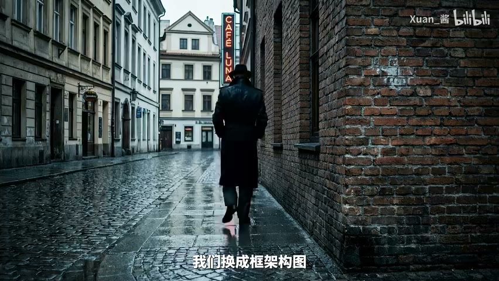

**UP主的核心理念**：同样的场景、同样的人物、同样的光线——只换构图方式，画面的情绪和表现力就能发生天翻地覆的变化。这就是构图的力量。

---

## 二、构图的基础：线和点

> "如果你对构图没有什么概念，那最快的上手方式，就是记住下面的这几个线条组合。记住了它们，你就学会了80%以上的构图。"

UP主把所有构图技法抽象为一组**线和点**的组合系统：

| 线/点 | 对应构图 | 说明 |
|-------|---------|------|
| **井字格**（长宽三等分线） | 三分法构图 | 四条线+4个交叉点 |
| **斜对角线** | 对角线构图 | 画面沿对角线分割 |
| **中心点** | 中心构图 | 画面正中央 |
| **两条中线**（垂直+水平） | 对称式构图 | 上下或左右对称 |
| **框** | 框架式构图 | 用画面中的框来构图 |
| **黄金分割点** | 黄金分割构图 | 经典美学参考点 |

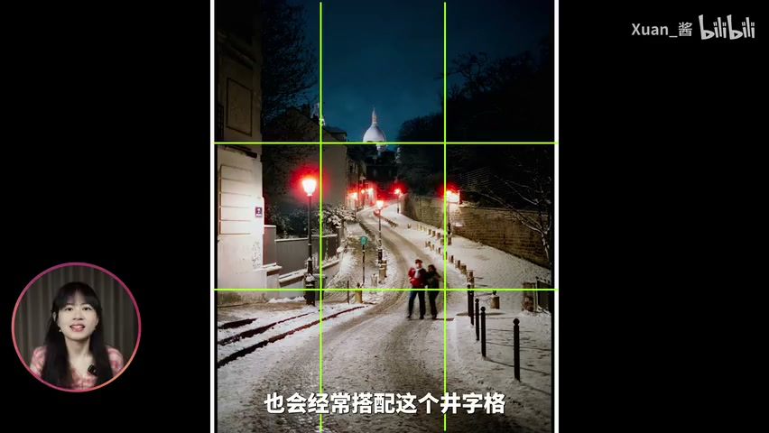

> "如果你已经记住了这些线和点，那恭喜你，你学后面每种构图的具体玩法就非常轻松了。"

UP主还提到：**所有案例的提示词和工具都整理到了一个文档里**（可在视频简介/评论区获取）。

---

## 三、中心构图 (Center Composition)

### 3.1 什么是中心构图

将主体直接放在画面正中央，观众的注意力被强制吸引到画面中心。

**使用比例**：电影行业中约 **10%~15%** 的画面使用中心构图。

### 3.2 经典电影案例：《奥本海默》

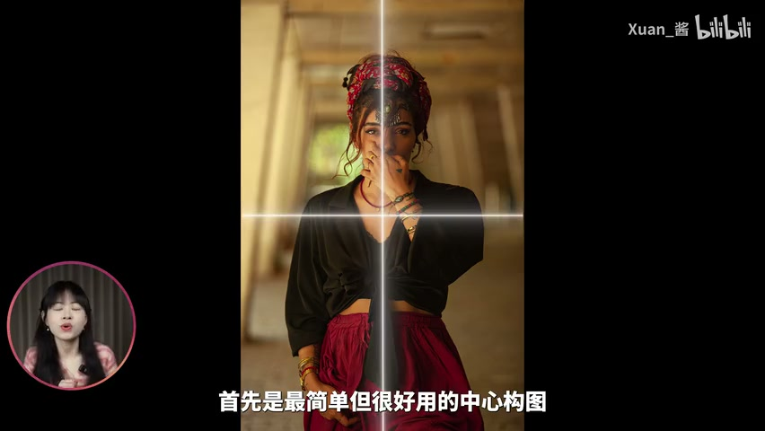

导演让奥本海默的脸部特写占据画面的绝对中心——我们很容易被带入角色的内心世界，感受他的情感冲突。

### 3.3 中心构图的视觉效果

- **强调主体情绪**：人脸在正中，注意力无法逃逸
- **突出宿命感**：角色被"钉"在画面中央，命运无法改变
- **压迫感**：巨大的主体占据中心，观众感受到强烈的压迫

### 3.4 案例对比

#### 案例1：士兵

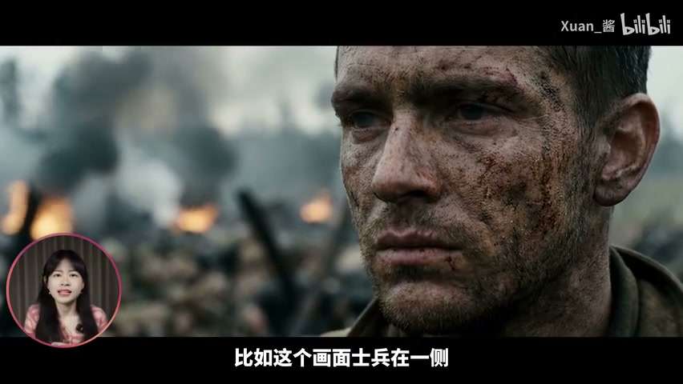

*构图前：士兵在一侧，观众的注意力相对分散*

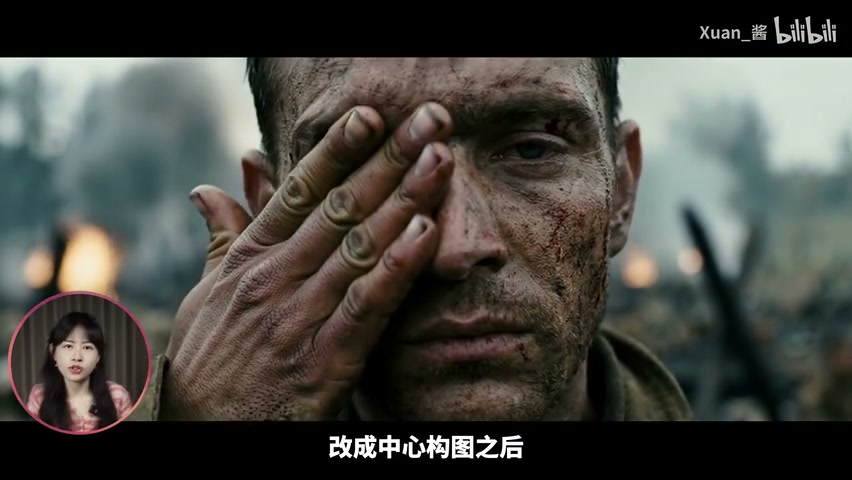

*改成中心构图后：士兵内心茫然无助的情绪更加强烈*

> "因为人脸在正中，比起靠一侧的构图，会让观众的注意力更容易被强制地停留在人脸上。"

#### 案例2：佛像

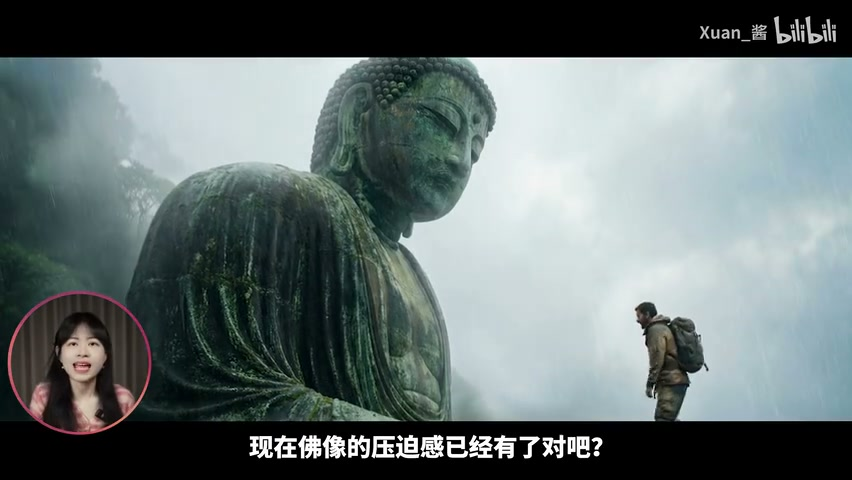

*构图前：佛像已经有压迫感了*

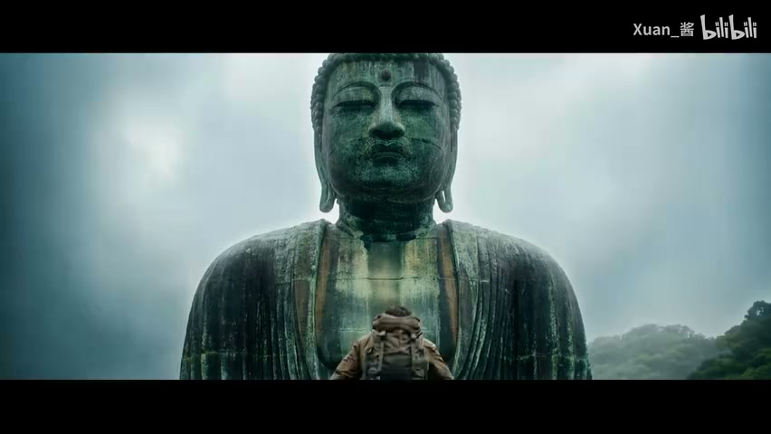

*中心构图后：压迫感更强烈，更加溢出屏幕*

> "就换一下构图，效果就是这么神奇！"

#### 案例3：孤独的女人

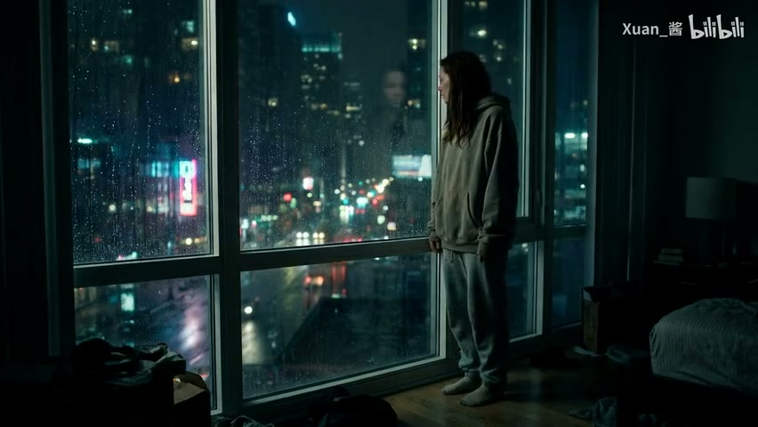

*换成中心构图后：女人的背影在画面正中心，孤独无助的感觉一下强了不少*

#### 案例4：大景别 + 中心构图

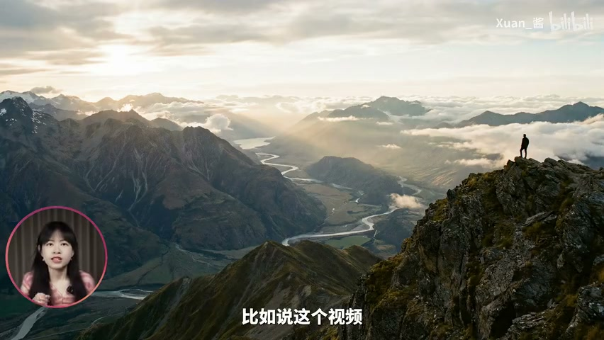

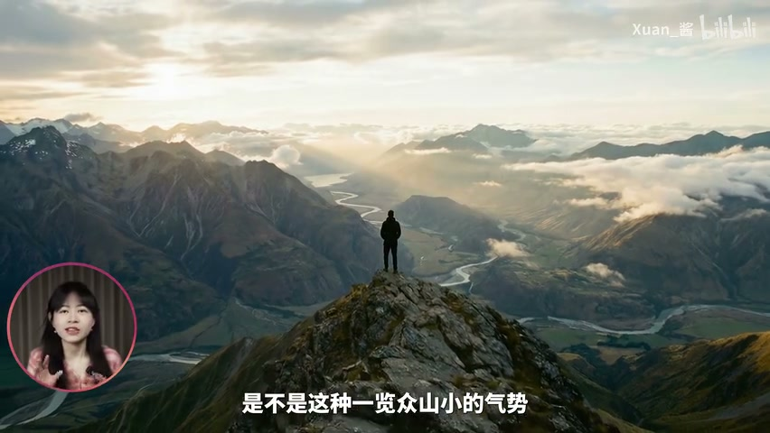

> "换成中心构图——是不是这种'一览众山小'的气势一下就变得更强烈了？"

### 3.5 中心构图小结

| 维度 | 说明 |
|------|------|
| **优点** | 突出主体、强调情绪、制造压迫感/宿命感 |
| **缺点** | 容易让画面显得呆板、缺少呼吸感 |
| **适用场景** | 人物特写、情绪高潮、权力/压迫表达 |
| **AI关键词** | `Centered composition`, `subject placed at center` |

### 3.6 工具推荐

UP主提到了修改参考图构图效果的工具：
- **Banana Pro**（国外）：深度效果很不错
- **即梦、可灵**：国内平替，可做深度图修改
- **海螺、Veo3**：AI视频生成

> "哪个效果好，用哪一个。"

---

## 四、对称构图 (Symmetrical Composition)

### 4.1 经典案例：《布达佩斯大饭店》

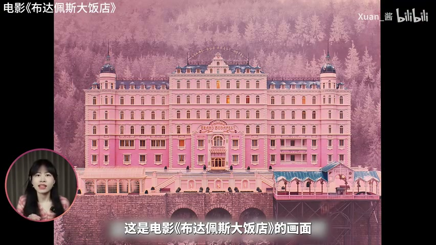

韦斯·安德森的《布达佩斯大饭店》大量使用对称构图，画面看起来特别舒服。

### 4.2 对称构图的视觉效果

> "对称会给人一种强烈的**秩序感**和**庄严感**。"

**使用比例**：电影中约 **10%** 的画面使用对称构图。

### 4.3 案例对比

#### 案例1：皇帝登基

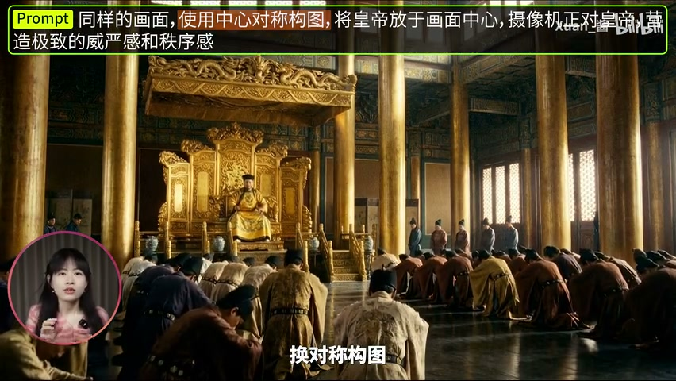

*构图前：总感觉画面还不够威严*

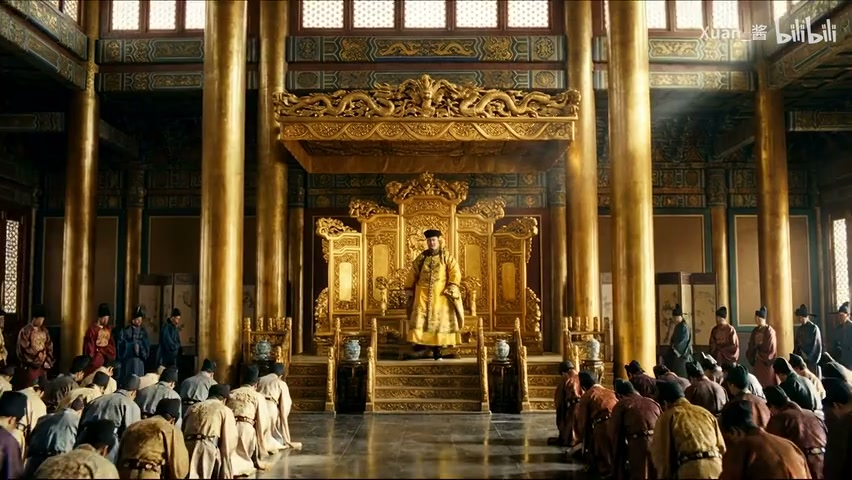

*对称构图 + 将皇帝放于画面中心 → 庄严感和皇帝压迫感扑面而来*

#### 案例2：男人爬台阶

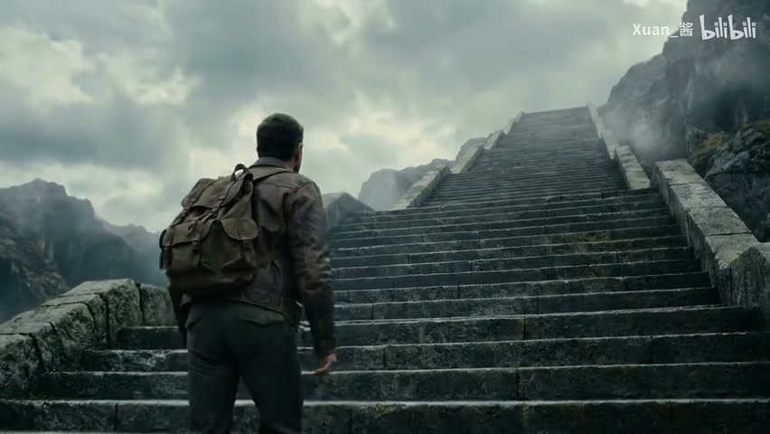

*侧后方视角，男人在爬台阶*

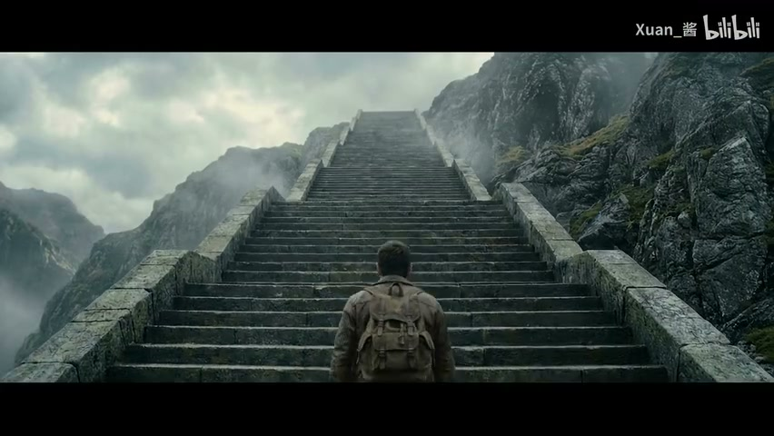

*换成对称构图 → 一往无前的力量感和气势瞬间更强烈*

#### 案例3：俯瞰对称

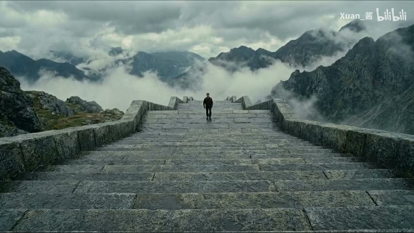

> "还是对称构图，再换成俯瞰视角——气势同样很足对吧？"

### 4.4 对称构图小结

| 维度 | 说明 |
|------|------|
| **优点** | 秩序感、庄严感、力量感、仪式感 |
| **缺点** | 过于完美可能显得机械，不宜滥用 |
| **适用场景** | 权力人物出场、仪式场景、建筑、大景别 |
| **AI关键词** | `Symmetrical composition`, `Wes Anderson style` |

---

## 五、三分法构图 (Rule of Thirds) ⭐ 最常用

### 5.1 什么是三分法

> "三分法构图是影视行业中**用得最多**的构图，有**50%以上**的画面都用了三分法构图。"

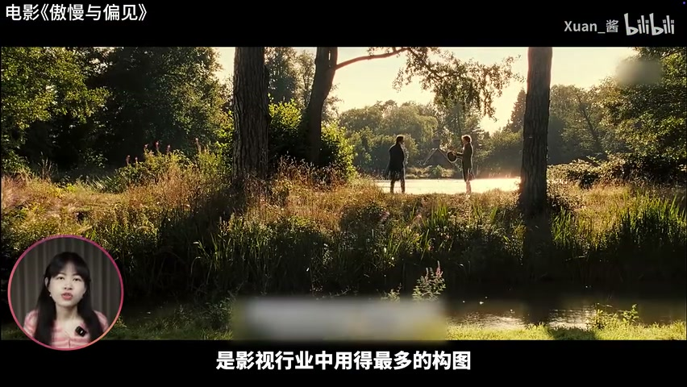

把画面的长和宽分别用线平均分成三份（形成井字格），然后把主体放在这几条线上或者线的交叉点上。

### 5.2 三分法 vs 中心构图

UP主详细对比了两种构图：

| 对比维度 | 中心构图 | 三分法构图 |
|---------|---------|-----------|
| 主体位置 | 画面正中心 | 1/3线或交叉点 |
| 感觉 | 更稳定、突出效果更强 | 更轻松、更自然 |
| 空白处理 | 几乎没有空白 | 留出呼吸空间 |
| 延伸感 | 较弱 | 较强 |
| 缺点 | 容易显得呆板 | 主体不够突出 |
| 使用频率 | 10%~15% | 50%+ |

> "中心构图将主体直接放在画面中心，给人的感觉会更稳定，而且对主体的突出效果更强。但坏处是容易让画面显得呆板。而三分线构图会在画面中留出一些空白，画面的**延伸感**、**呼吸感**都会好很多。"

### 5.3 案例对比

#### 案例1：一棵树

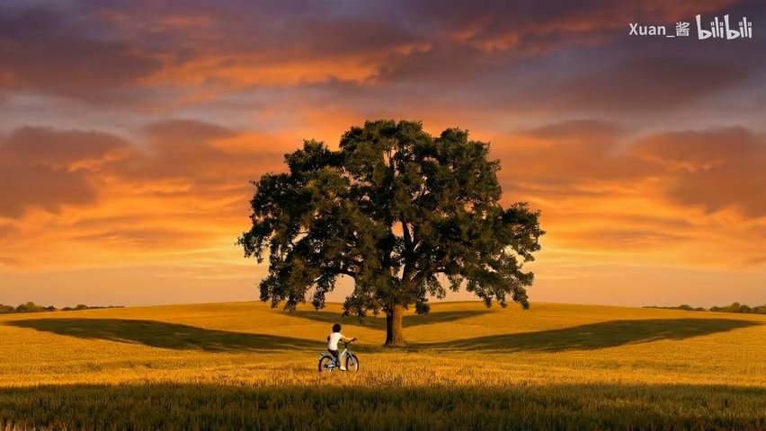

*中心构图：传达一种稳定而庄重的感觉*

*换成三分法 → 天际线和树都放在1/3处 → 感觉更加轻松自然*

#### 案例2：老人

*居中构图*

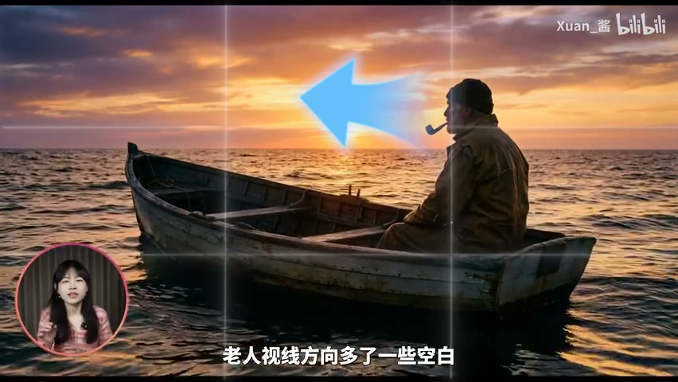

*改成三分线构图 → 老人视线方向多了一些空白 → 画面更加舒展自然，惬意感更突出*

> "所以同样的远景可以三分构图，中景可以，特写同样也可以。"

### 5.4 黄金法则

> **"当你不知道怎么构图的时候，用三分构图——这是一个不会出错的选择。"**

---

## 六、对角线构图 (Diagonal Composition)

### 6.1 经典案例

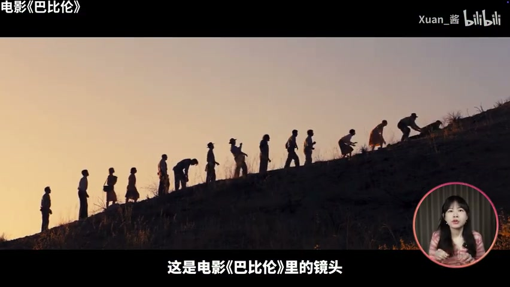

> "这是电影《巴比伦》里的镜头——山坡沿着对角线把画面分割开来。《楚门的世界》里也有类似的镜头。"

**使用比例**：电影中约 **10%~15%**。

### 6.2 视觉效果

- 画面元素沿对角线切开
- 主体在斜线条上，有很强的**形式美感**
- 特别适合**运动相关**的画面（登山、爬楼梯等）

### 6.3 案例对比

#### 案例1：登山

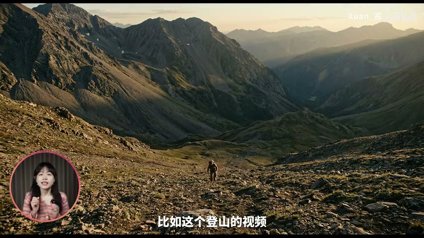

*构图前：略显平淡*

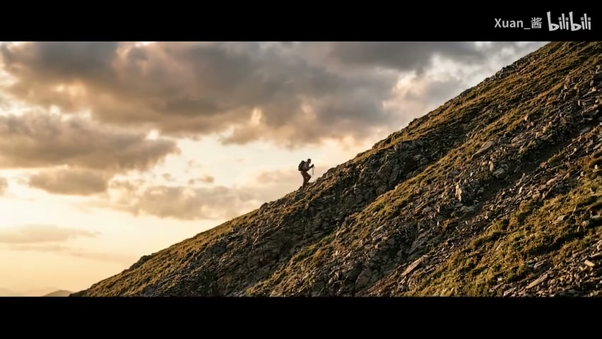

*对角线构图 → 大片感一下强了很多*

> "再换成环绕的运镜——再次把视觉冲击力提升了一档！"

#### 案例2：光影交界

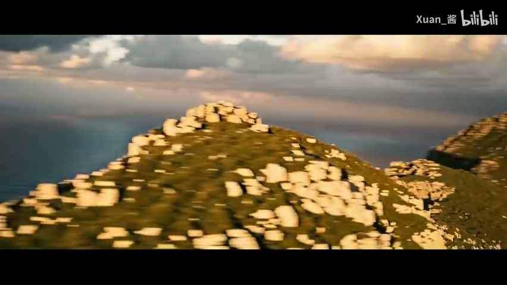

*构图前：稍微有点无趣*

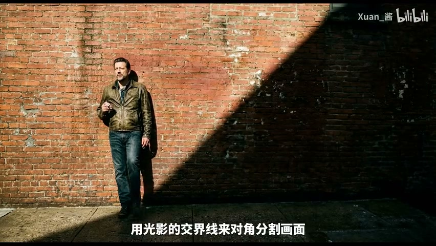

> "用**光影的交界线**来对角分割画面——是不是瞬间就更有故事感、电影感了？"

### 6.4 对角线构图小结

| 维度 | 说明 |
|------|------|
| **优点** | 动感强、形式美感、适合运动画面 |
| **适用场景** | 登山、爬楼梯、追逐、动作戏 |
| **提示词** | 直接写"使用对角线构图"即可 |
| **进阶用法** | 光影交界线也可以做对角线分割 |

---

## 七、引导线构图 (Leading Lines)

### 7.1 什么是引导线

> "引导线构图是电影中经常用、我们出去旅行也经常用的构图。小白的能用这种构图拍出大片感。"

**使用比例**：电影中约 **10%** 左右。

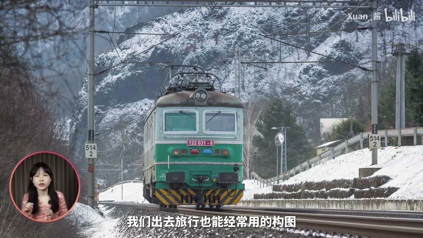

道路、栅栏、建筑物等都可以作为视觉引导线。

### 7.2 视觉效果

和对角线构图一样，因为有线条对观众的注意力做**强制引导**，引导线构图能带来很强的**形式美感**。

### 7.3 案例

#### 案例1：马路牙子

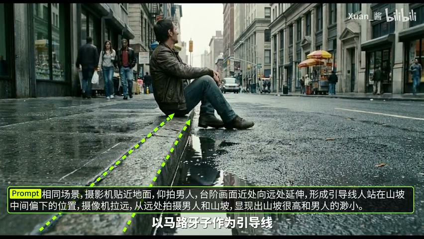

> "像这样很简单的场景——以马路牙子做引导线，高级感一下就来了。"

#### 案例2：公路行车

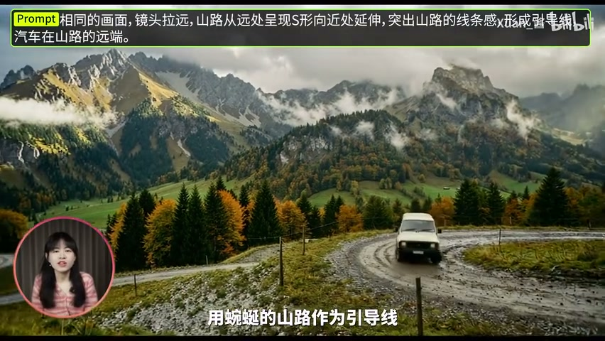

*用蜿蜒的山路做引导线 → 一下就更有电影感了*

#### 案例3：S型山路

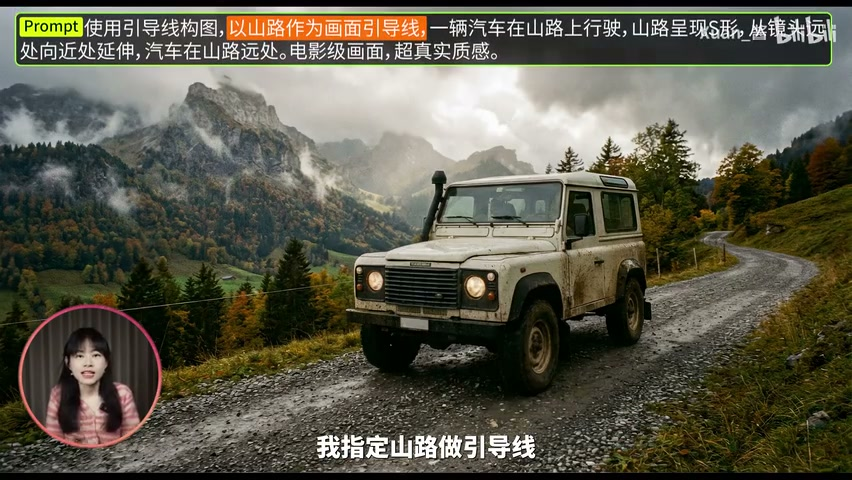

> "我指定山路做引导线，山路是S型，从远处向近处延伸出来的。"

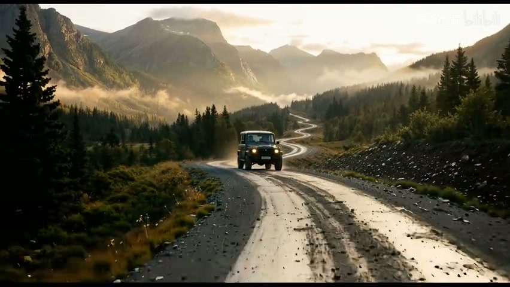

*效果：S型山路从远到近，视觉深度极强*

### 7.4 引导线构图小结

| 维度 | 说明 |
|------|------|
| **可用作引导线的元素** | 道路、栅栏、建筑、河岸、光影边界、一排树 |
| **适用场景** | 开场建立镜头、公路旅行、旅行vlog |
| **AI提示词** | `Leading lines composition`，可指定具体物体做引导线 |

---

## 八、框架式构图 (Frame Composition)

### 8.1 经典案例

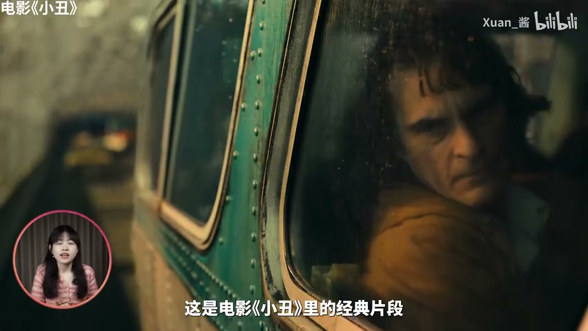

> "这是电影《小丑》里的经典片段——车窗形成了一个框，把主角框在其中，凸显出他内心的抑郁，仿佛身处一个无法逃脱的牢笼之中。"

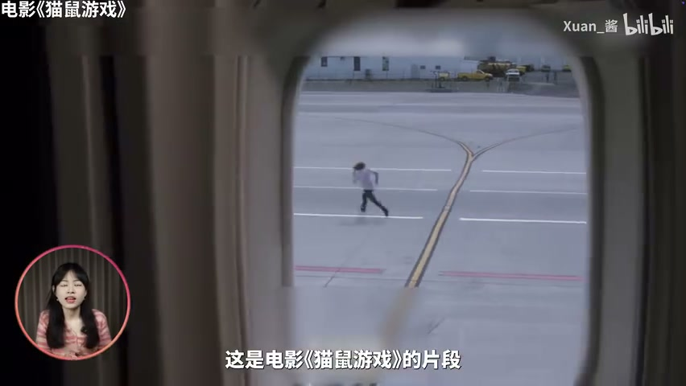

> "电影《莫属游戏》的片段——用飞机窗户把逃跑的主角框在其中，**窥视的视角**强化了画面的紧张急促感。"

**使用比例**：电影中约 **5%** 左右。

### 8.2 视觉效果

框架式构图很适合**表现人物处境**、强调**人物和环境的关系**。

### 8.3 案例对比

#### 案例1：车里的男人

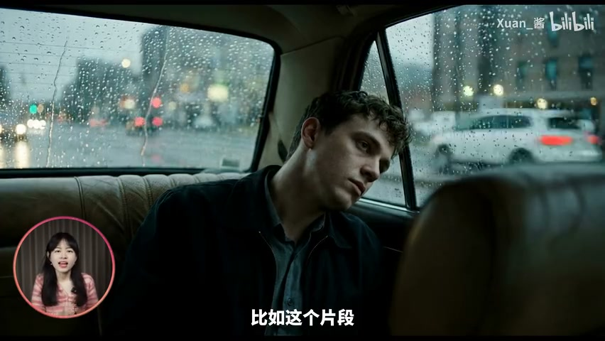

*构图前：男人闷闷不乐地坐在车里*

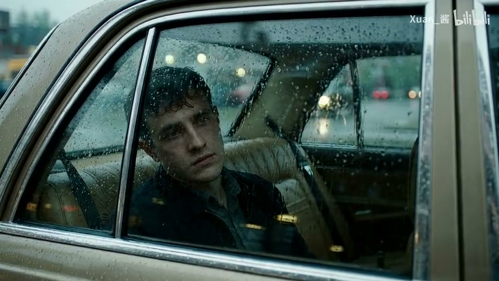

> "改用窗来做框架构图——男人内心的压抑和郁闷更突出了。"

#### 案例2：特工监视

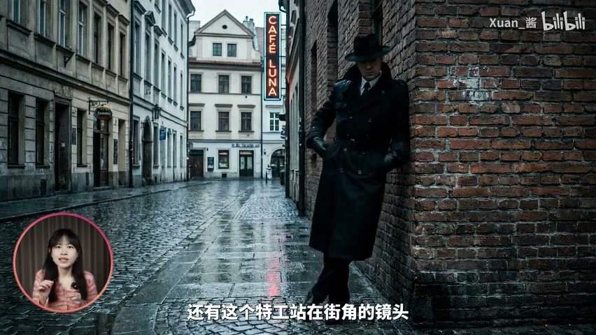

*构图前：特工在街角*

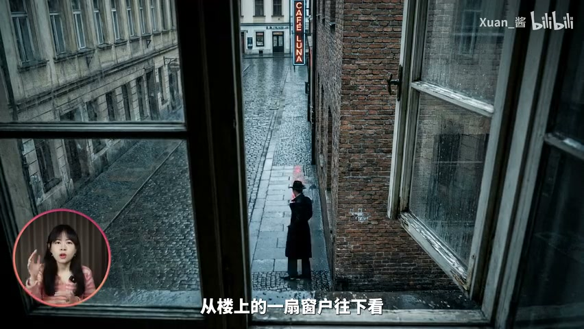

> "从楼上的窗户往下看——是不是危险感和紧张感就强了很多？仿佛我就是那个被他跟踪的人。"

### 8.4 更多框架示例

> "当然框架可以是任何东西——这种、这种、还有这种的，都是框架式构图。**有框的地方都可以试试这种构图。**"

---

## 九、前景构图/Foreground Composition（脏构图）

### 9.1 经典案例：《重庆森林》

> "这是电影《重庆森林》里的片段——画面都被一些东西给挡住了，有点脏脏的对吧？这叫**前景构图**，也叫**脏构图**。"

### 9.2 什么是前景构图

在主体前方加一些前景来遮挡，**还原当事人或第三者的视角**，让画面更有：
- **情绪代入感**
- **空间纵深感**

### 9.3 案例对比

#### 案例1：独自喝酒的女人

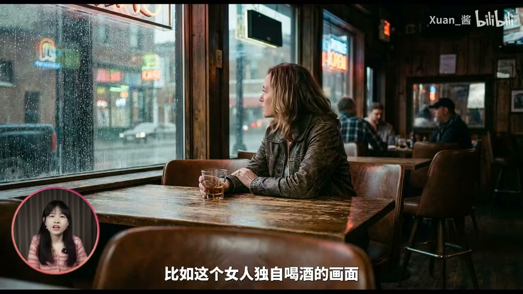

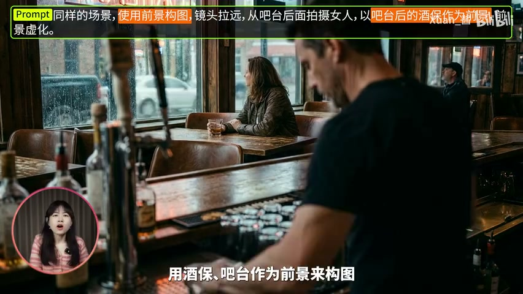

> "用酒保吧台作为前景来构图——是不是沉浸感就更强了？"

#### 案例2：人群中穿梭

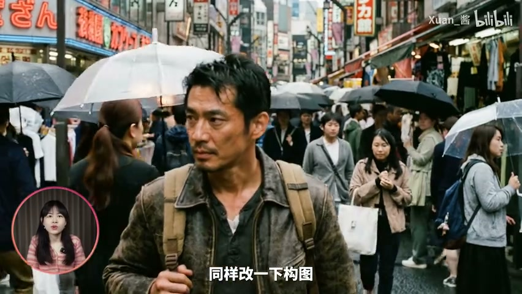

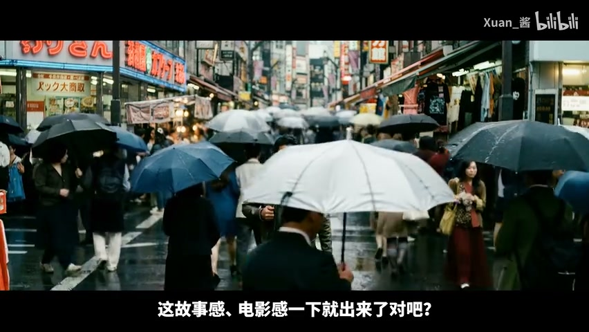

> "在提示词里写使用前景构图，让行人作为前景——故事感、电影感一下就出来了。"

### 9.4 前景构图小结

> "要当做**当事人**或者**路人**视角时，试试前景构图吧！"

---

## 十、总结

> **"构图方式没有好与坏，只有适合与不适合。能够把情绪氛围表达到位的构图，就是好的构图。"**

UP主最后强调：构图是为故事和情绪服务的工具，不是炫技的手段。选择哪种构图，取决于你想传达什么样的感受。

---

## 十一、关键术语 Glossary

| 术语 | 英文 | 使用频率 | 一句话解释 |
|-----|------|---------|-----------|
| 中心构图 | Center Composition | 10%~15% | 主体在画面正中，强调情绪和宿命感 |
| 对称构图 | Symmetrical Composition | ~10% | 左右/上下对称，秩序感和庄严感 |
| 三分法 | Rule of Thirds | 50%+ | 主体在1/3处，万能不出错的构图 |
| 对角线构图 | Diagonal Composition | 10%~15% | 沿对角线分割画面，适合运动场景 |
| 引导线构图 | Leading Lines | ~10% | 用线条引导视线，制造纵深 |
| 框架式构图 | Frame Composition | ~5% | 画中画，突出人物处境 |
| 前景构图 | Foreground Composition | — | 前景遮挡，还原当事人视角 |
| 黄金分割 | Golden Ratio | — | 经典美学参考点 |
| 井字格 | Rule of Thirds Grid | — | 长宽三等分线的九宫格 |

---

## 十二、课后实践建议

1. **看电影练眼力**：任意找3部电影，各随机截图10张，分析每张用了什么构图
2. **同场景对比练习**：用同一个AI提示词场景，分别用中心/三分/对称/对角线各生成1张图，对比效果差异
3. **分镜表练习**：构思一个30秒短片（5-6个镜头），为每个镜头标注构图方式
4. **主+辅策略**：设定70%三分法 + 20%引导线 + 10%对称，用这套策略生成一组统一风格的画面
5. **刻意练习顺序**：第一周专练三分法 → 第二周专练引导线 → 第三周专练对称 → 第四周融会贯通

---

> 📌 **下一集**：P3 —【新手村】电影感打光篇（光源方向、光质、光比、经典布光方案）
>
> 🛠 **推荐工具**：Banana Pro（国外）、即梦、可灵（国内）、海螺、Veo3

---

*笔记整理自 Bilibili 视频 [BV1vx9hB5ELp](https://www.bilibili.com/video/BV1vx9hB5ELp?p=2) P2，基于AI识别中文字幕逐句整理。*
