# Single-Stage and Multi-Cycle CPU Pipeline Design

**Course:** CSCI 654 Advanced Computer Architecture, Spring 2026  
**Instructor:** Yifan Sun, William & Mary  
**Video:** [YouTube lecture](https://www.youtube.com/watch?v=_S_-k0jLrlI) (55:38)

These notes follow the lecture's substantive slides and completed datapath states. Explanations combine the diagrams with the original English captions; obvious caption errors such as “risk five” and “AO” are normalized to RISC-V and ALU.

## Components of a CPU core

### Slide 1 — Core design ([00:00:05](https://www.youtube.com/watch?v=_S_-k0jLrlI&t=5s))

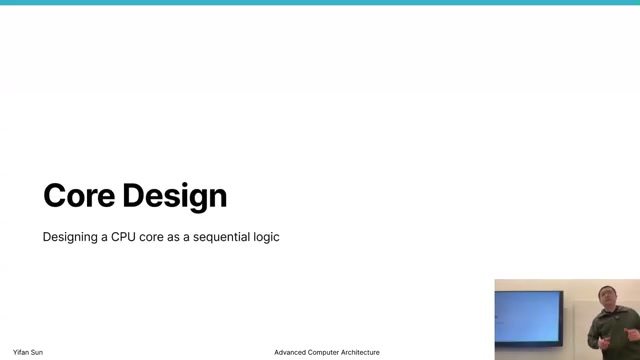

The lecture moves from the RISC-V ISA contract to microarchitecture: a sequential-logic implementation that fetches encoded instructions, gathers operands, computes results, accesses memory, and updates architectural state. It first builds a single-stage core and then reuses the components across multiple cycles.

### Slide 2 — Looking at an instruction ([00:00:35](https://www.youtube.com/watch?v=_S_-k0jLrlI&t=35s))

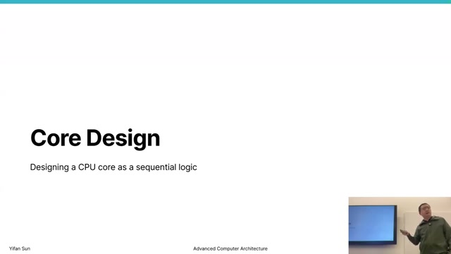

A RISC-V instruction such as `addi x0, x0, 1` is a 32-bit word containing an opcode and operands. Register operands are encoded as 5-bit IDs; an immediate operand is encoded in the instruction itself. The regular field locations let wires route register IDs and other fields directly to the relevant hardware, while control logic interprets the opcode and function bits.

### Slide 3 — Starting components ([00:01:35](https://www.youtube.com/watch?v=_S_-k0jLrlI&t=95s))

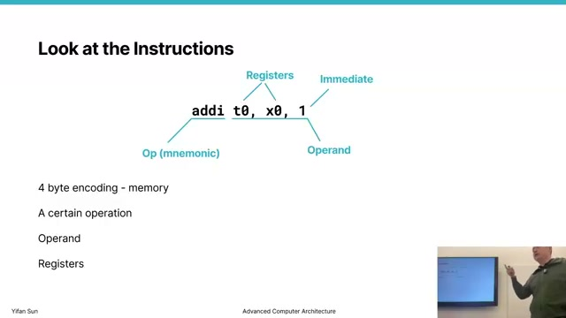

The starting datapath contains:

| Component | Role |
|---|---|
| Program counter (PC) | 32-bit register holding the current instruction address |
| Instruction memory | Maps the PC address to a 32-bit instruction |
| Register file | Two read ports and one clocked write port for 32 registers |
| ALU | Combinational arithmetic, logic, address, and comparison unit |
| Data memory | Reads or writes program data at a computed address |

The register file uses 5-bit addresses `A1`, `A2`, and `A3`; it produces `RD1` and `RD2`, and writes `WD3` when `WE3` is asserted. The diagrams simplify memory timing so the focus stays on datapath construction.

## Building a single-stage datapath

### Slide 4 — Load instruction ([00:07:35](https://www.youtube.com/watch?v=_S_-k0jLrlI&t=455s))

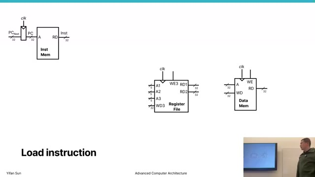

The first complete path is based on `lw x6, -4(x9)`. The PC selects the instruction. Bits `19:15` identify `x9` (`rs1`), bits `11:7` identify `x6` (`rd`), and bits `31:20` contain the signed I-type immediate. The required operation is

$$
x6 \leftarrow Memory[x9 + (-4)].
$$

### Slide 5 — Read the base register ([00:08:20](https://www.youtube.com/watch?v=_S_-k0jLrlI&t=500s))

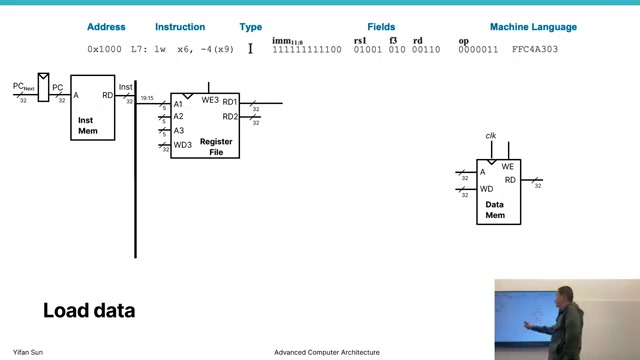

The `rs1` field drives register-file port `A1`. In the example, reading `x9` produces `0x20004` on `RD1`. Selecting a register is effectively a large multiplexer operation. The two read ports and independent write port allow multiple register-file operations in parallel when an instruction needs them.

### Slide 6 — Sign extension ([00:10:50](https://www.youtube.com/watch?v=_S_-k0jLrlI&t=650s))

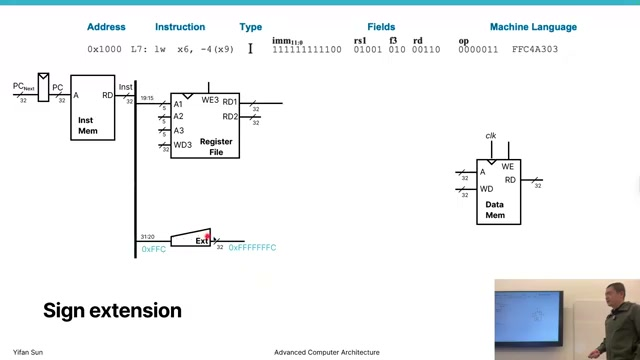

The 12-bit immediate must match the ALU's 32-bit width. Sign extension repeats the immediate's top bit:

$$
Imm_{32} = \{20\{instruction[31]\}, instruction[31:20]\}.
$$

Thus 12-bit `0xFFC` represents $-4$ and becomes `0xFFFFFFFC`, preserving the signed value.

### Slide 7 — Calculate the load address ([00:12:15](https://www.youtube.com/watch?v=_S_-k0jLrlI&t=735s))

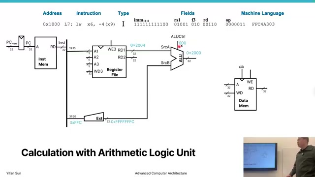

A multiplexer selects the extended immediate as the ALU's second input. Control selects addition, producing

$$
0x20004 + 0xFFFFFFFC = 0x20000.
$$

The opcode drives combinational control logic that chooses the ALU operation and operand sources. This activity is “operand gathering”: routing the correct register and immediate values to the execution unit.

### Slide 8 — Access data memory ([00:13:10](https://www.youtube.com/watch?v=_S_-k0jLrlI&t=790s))

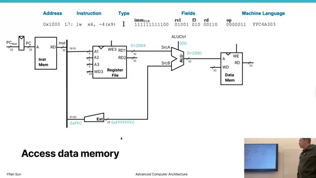

The ALU result drives data memory's address input. For a load, `MemWrite` is deasserted and the addressed 32-bit word appears on the read-data output. The datapath must route this memory value, rather than the ALU address, toward the register file.

### Slide 9 — Write loaded data back ([00:14:10](https://www.youtube.com/watch?v=_S_-k0jLrlI&t=850s))

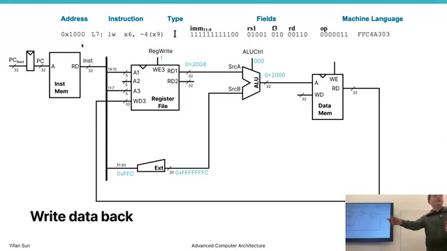

A result multiplexer selects data memory's output for `WD3`. The `rd` field drives `A3`, and `RegWrite`/`WE3` is asserted. At the active clock edge, the loaded value enters `x6`. The write enable is crucial: without it, merely presenting an address and value must not alter architectural state.

### Slide 10 — Update the program counter ([00:16:20](https://www.youtube.com/watch?v=_S_-k0jLrlI&t=980s))

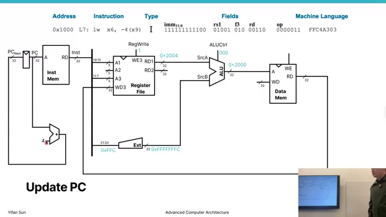

A dedicated adder calculates the sequential address:

$$
PC_{next} = PC + 4.
$$

The PC register captures this value at the clock edge while the load result enters the register file. These updates happen together, ending one instruction and beginning the next.

### Slide 11 — Store data ([00:18:00](https://www.youtube.com/watch?v=_S_-k0jLrlI&t=1080s))

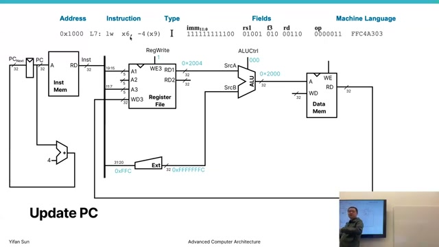

For `sw x2, 8(x9)`, the ALU still computes $x9 + 8$, but the second register-file port reads `x2` and routes it to data memory's write-data input. `MemWrite` is asserted and `RegWrite` is not. A store therefore reuses address-generation hardware but reverses the architectural data flow:

$$
Memory[x9 + 8] \leftarrow x2.
$$

### Slide 12 — R-type instruction ([00:20:10](https://www.youtube.com/watch?v=_S_-k0jLrlI&t=1210s))

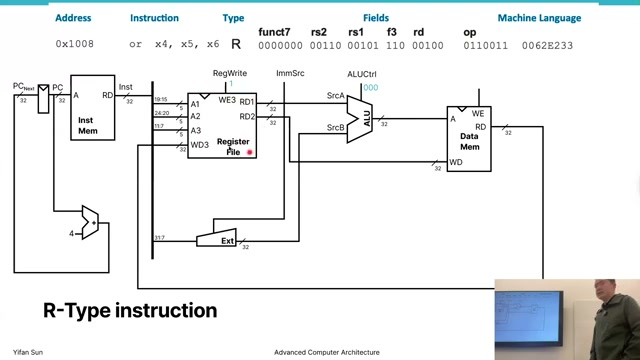

An R-type operation such as `add x4, x5, x6` reads both operands from the register file. The ALU-input multiplexer selects `RD2` instead of an immediate, while `funct3` and `funct7` help select add, subtract, XOR, or another operation. A writeback multiplexer selects the ALU result instead of memory data:

$$
x4 \leftarrow x5 + x6.
$$

### Slide 13 — B-type branch ([00:23:30](https://www.youtube.com/watch?v=_S_-k0jLrlI&t=1410s))

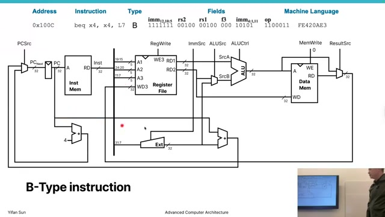

A conditional branch reads two registers and compares them, while another path forms a PC-relative target from the B-type immediate. A PC-source multiplexer chooses between the sequential and target addresses:

$$
PC_{next} =
\begin{cases}
PC + Imm_B, & \text{condition true},\\
PC + 4, & \text{condition false}.
\end{cases}
$$

The slide uses an illustrative `beq` with equal operands, making the branch unconditionally true; the point is the comparison and target-selection circuitry.

### Slide 14 — Completed single-stage datapath ([00:26:40](https://www.youtube.com/watch?v=_S_-k0jLrlI&t=1600s))

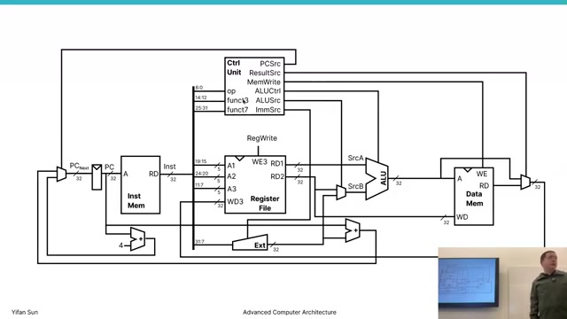

The completed core connects instruction memory, register file, immediate generation, ALU, data memory, PC adders, multiplexers, and control. The control unit derives signals such as `RegWrite`, `MemWrite`, ALU operation, ALU operand source, result source, and PC source from the instruction fields and comparison result.

It is a **single-stage** or **single-cycle** design because every instruction's combinational path runs from the current state to the next state within one clock period.

### Slide 15 — Single-cycle performance ([00:28:20](https://www.youtube.com/watch?v=_S_-k0jLrlI&t=1700s))

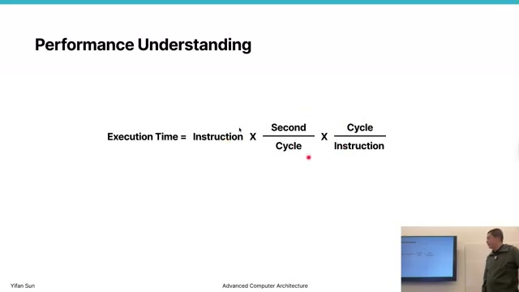

CPU time can be expressed as

$$
T_{CPU} = N_{instructions} \times CPI \times T_{cycle}.
$$

The single-cycle design has $CPI=1$, but its clock period must accommodate the slowest instruction, typically a load traversing instruction memory, register read, ALU address calculation, data memory, and register setup. Simpler arithmetic instructions still wait for that same long period even though they do not use data memory. The result is low CPI paired with a long cycle time.

## Reusing hardware across multiple cycles

### Slide 16 — Multi-cycle starting point ([00:34:10](https://www.youtube.com/watch?v=_S_-k0jLrlI&t=2050s))

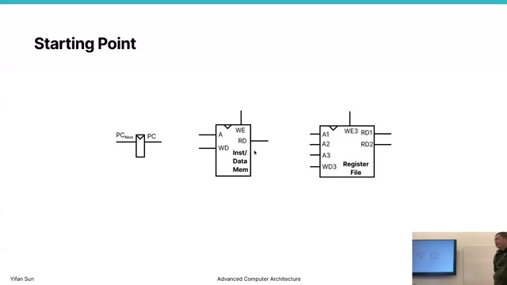

A multi-cycle core divides an instruction into shorter steps: fetch, decode/operand read, execute, memory access, and writeback. Each step can fit in a shorter clock period, and an instruction uses only the steps it needs. The price is $CPI>1$ and new state elements to retain intermediate values between clock edges.

### Slide 17 — Instruction register ([00:35:40](https://www.youtube.com/watch?v=_S_-k0jLrlI&t=2140s))

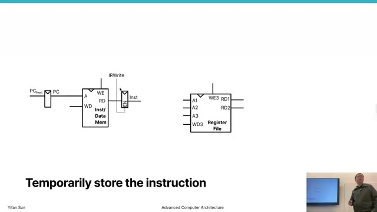

The instruction register (`IR`) captures the fetched instruction. It must remain stable while later cycles decode fields and execute the operation, even though memory and the PC may already be used for other work. An `IRWrite` control signal allows updates only in the fetch state.

### Slide 18 — Temporary operand registers ([00:36:40](https://www.youtube.com/watch?v=_S_-k0jLrlI&t=2200s))

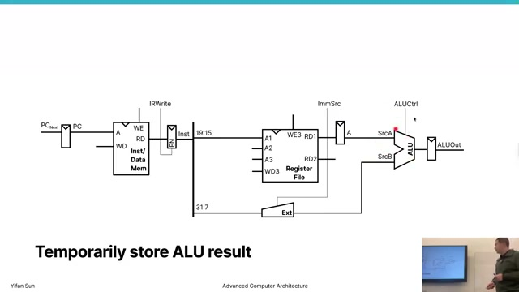

Registers conventionally called `A` and `B` capture the register-file outputs after decode:

$$
A \leftarrow RF[rs1], \qquad B \leftarrow RF[rs2].
$$

These are microarchitectural registers, not ISA-visible registers. They hold operands while the shared ALU and other components are reused in later cycles.

### Slide 19 — ALUOut register ([00:37:40](https://www.youtube.com/watch?v=_S_-k0jLrlI&t=2260s))

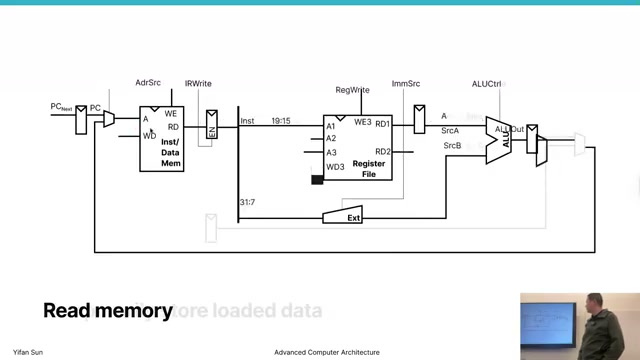

`ALUOut` captures an address, arithmetic result, or branch target computed in the execute cycle. A load can calculate $A + Imm$ now and use that stored address for memory in the next cycle. This register separates combinational steps and prevents an ALU result from disappearing when inputs change.

### Slide 20 — Memory data register ([00:40:20](https://www.youtube.com/watch?v=_S_-k0jLrlI&t=2420s))

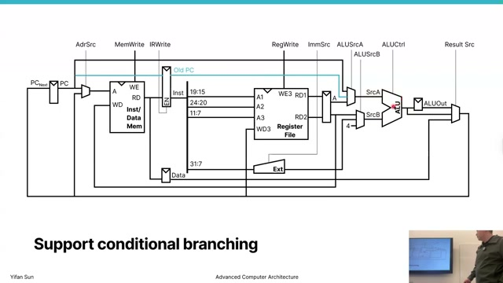

The memory data register (`MDR`) captures a load's read data:

$$
MDR \leftarrow Memory[ALUOut].
$$

The following cycle can write `MDR` into `RF[rd]`. Stores bypass the MDR because their direction is from `B` to memory.

### Slide 21 — Completed multi-cycle datapath ([00:42:20](https://www.youtube.com/watch?v=_S_-k0jLrlI&t=2540s))

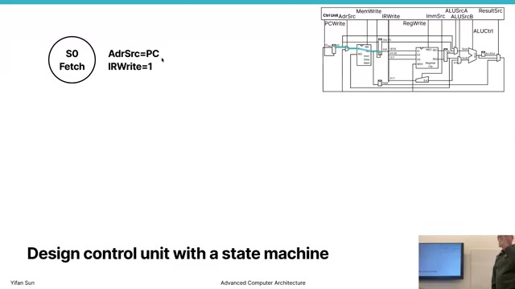

The complete datapath adds `IR`, `A`, `B`, `ALUOut`, and `MDR`, plus multiplexers that let common hardware serve different steps. A load follows:

1. Fetch: $IR \leftarrow Memory[PC]$.
2. Decode: $A \leftarrow RF[rs1]$ and generate the immediate.
3. Execute: $ALUOut \leftarrow A + Imm$.
4. Memory: $MDR \leftarrow Memory[ALUOut]$.
5. Writeback: $RF[rd] \leftarrow MDR$.

The temporary registers define cycle boundaries and hold each step's output for the next.

### Slide 22 — Branch support and operand gathering ([00:45:10](https://www.youtube.com/watch?v=_S_-k0jLrlI&t=2710s))

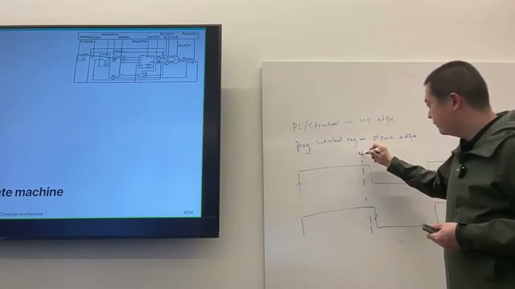

Branches reuse the operand registers and ALU. Decode captures both source values; a later state compares them and chooses whether to update the PC with the branch target. The expanded multiplexers let the ALU accept the PC, `A`, `B`, constants, or an immediate at different times. This is the core benefit of multi-cycle design: hardware can be reused because operations no longer need to occur simultaneously.

### Slide 23 — Control unit and clocked sequencing ([00:46:20](https://www.youtube.com/watch?v=_S_-k0jLrlI&t=2780s))

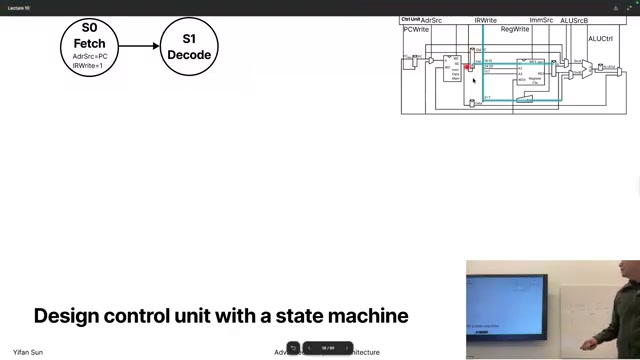

Control now depends on both the instruction and the current cycle. A finite-state machine (FSM) asserts the required write enables and multiplexer selections in each state: `IRWrite`, PC write, register write, memory write, ALU input controls, ALU operation, and result selection. The clock advances the control state and captures any enabled datapath registers.

## Multi-cycle control state machine

### Slide 24 — Fetch and decode states ([00:50:00](https://www.youtube.com/watch?v=_S_-k0jLrlI&t=3000s))

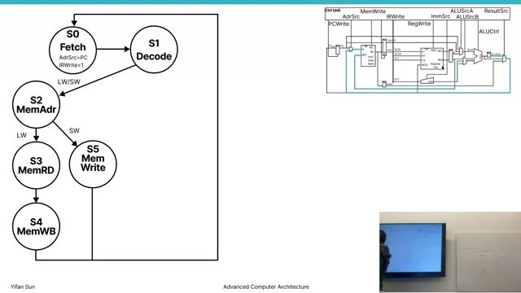

All instructions begin in fetch (`S0`) and decode (`S1`). Fetch reads the instruction at the PC into `IR`. Decode reads register operands and interprets the opcode. The opcode then selects an instruction-class-specific path. This is a Moore-style view: each state corresponds to a stable set of datapath control signals for one cycle.

### Slide 25 — Load and store paths ([00:53:00](https://www.youtube.com/watch?v=_S_-k0jLrlI&t=3180s))

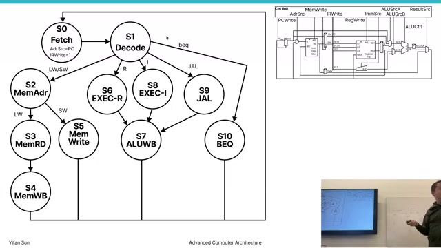

Loads and stores share the effective-address state, where `ALUOut` receives $A+Imm$. They then diverge:

| Instruction | Memory state | Final state |
|---|---|---|
| Load | `MDR <- Memory[ALUOut]` | `RF[rd] <- MDR` |
| Store | `Memory[ALUOut] <- B` | Return to fetch |

A load needs a register-write state; a store does not. Sharing the address path reduces duplicated hardware and control logic.

### Slide 26 — Complete instruction FSM ([00:54:30](https://www.youtube.com/watch?v=_S_-k0jLrlI&t=3270s))

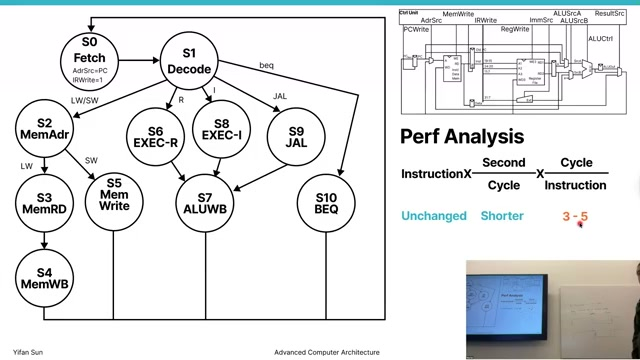

The completed FSM adds R-type execute/writeback and branch states. R-type instructions capture $A\;op\;B$ in `ALUOut`, then write it to `rd`. A branch compares `A` and `B`, conditionally updates the PC, and returns to fetch without writing a general-purpose register. Different instruction classes therefore take different cycle counts while sharing fetch, decode, and much of the datapath.

### Slide 27 — Performance and the intrinsic conflict ([00:55:20](https://www.youtube.com/watch?v=_S_-k0jLrlI&t=3320s))

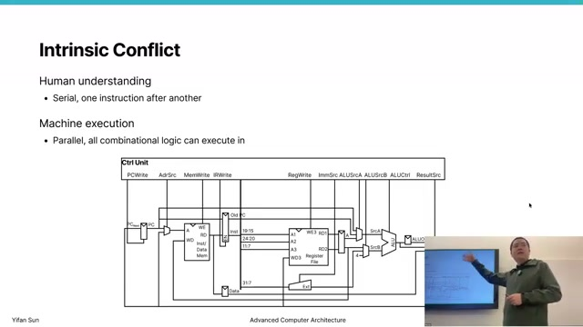

Multi-cycle execution trades a shorter clock period for a larger CPI. Average CPI depends on instruction mix:

$$
CPI_{avg} = \sum_i f_i \times cycles_i.
$$

Performance must compare both terms, not CPI alone:

$$
\text{throughput} = \frac{f_{clock}}{CPI}, \qquad
T_{CPU} = N \times \frac{CPI}{f_{clock}}.
$$

The lecture closes on an intrinsic conflict: human descriptions serialize fetch, decode, execute, memory, and writeback, while hardware can perform independent work concurrently. A multi-cycle design raises the clock rate but leaves most components idle in each state. Pipelining, the natural next step, overlaps stages from different instructions to seek both a short cycle and throughput approaching one completed instruction per cycle.

## Key formulas and takeaways

1. Sequential PC update: $PC_{next}=PC+4$.
2. Effective address: $Address=RF[rs1]+SignExtend(Imm)$.
3. A 12-bit I-type immediate becomes $\{20\{Imm[11]\},Imm[11:0]\}$.
4. Loads move memory to a register; stores move a register to memory.
5. R-type instructions select two register operands and write the ALU result.
6. A branch selects between $PC+4$ and a PC-relative target using a comparison result.
7. Write-enable signals determine which state elements may change at a clock edge.
8. A single-cycle core has $CPI=1$, but its clock follows the longest instruction path.
9. Multi-cycle execution inserts `IR`, `A`, `B`, `ALUOut`, and `MDR` between combinational steps.
10. Temporary datapath registers are microarchitectural state and are invisible to the ISA.
11. Hardware reuse lowers duplication but requires more multiplexers and sequenced control.
12. The FSM shares fetch/decode states, then follows instruction-specific execute, memory, and writeback paths.
13. Average CPI is $\sum_i f_i cycles_i$.
14. CPU time is $N \times CPI \times T_{cycle}$; throughput is $f_{clock}/CPI$.
15. Pipelining addresses multi-cycle hardware underutilization by overlapping different instructions.