# Cache System Design in Chips

**Course:** CSCI 654 Advanced Computer Architecture, Spring 2026  
**Instructor:** Yifan Sun, William & Mary  
**Video:** [YouTube lecture](https://www.youtube.com/watch?v=4ZtRKpToqB0) (1:01:29)

These notes cover the lecture's substantive slides and completed cache diagrams. Explanations combine the original English captions with the visuals; obvious caption errors such as “heat” are normalized to **hit**.

## Memory systems and locality

### Slide 1 — Cache 1 ([00:00:05](https://www.youtube.com/watch?v=4ZtRKpToqB0&t=5s))

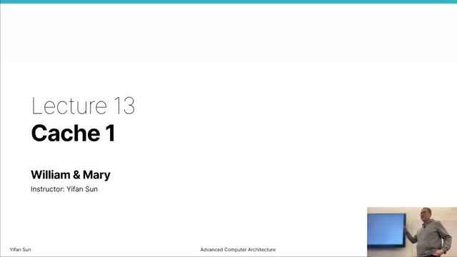

The lecture begins the memory-system unit after the course's CPU-core design material. Its focus is how a cache stores and locates data, why different placement organizations exist, and how those choices trade hit rate against hardware cost and latency.

### Slide 2 — Memory system: where data resides ([00:01:05](https://www.youtube.com/watch?v=4ZtRKpToqB0&t=65s))

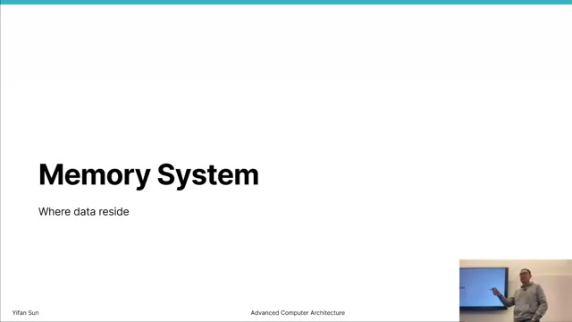

A processor accesses memory through an address and data interface. A read sends an address and receives data; a write sends an address, data, and an indication of which bytes should change. Real machines may expose fewer physical address bits than the ISA register width, and transfers are often organized around fixed-size cache lines such as 32, 64, or 128 bytes.

### Slide 3 — Memory-unit interface ([00:02:30](https://www.youtube.com/watch?v=4ZtRKpToqB0&t=150s))

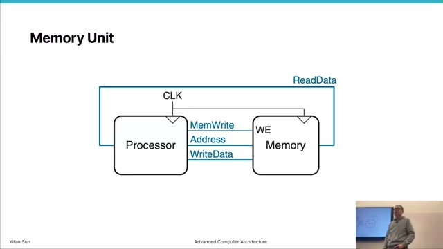

The simplified interface contains `Address`, `WriteData`, `ReadData`, `MemWrite`, and a clock. Memory is architectural state visible to software; caches placed between the core and memory are generally transparent performance structures.

The lecture discusses sub-line write masks. For a 64-byte line with one mask bit per four-byte word, 16 bits identify which words are modified. Such masks permit partial writes and are useful when merging data from independent writers. Coherence machinery is still required to coordinate ownership between cores; the mask records byte/word validity or dirtiness rather than replacing coherence.

### Slide 4 — SRAM and DRAM technologies ([00:12:00](https://www.youtube.com/watch?v=4ZtRKpToqB0&t=720s))

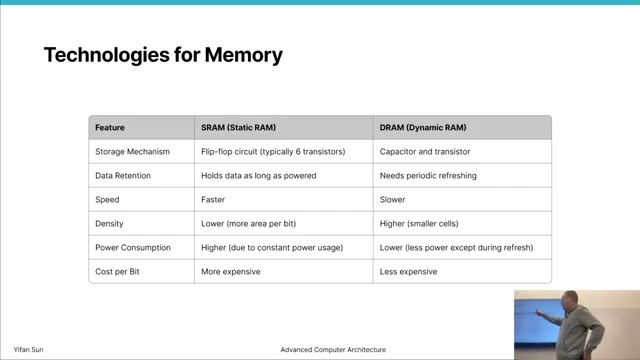

The hierarchy uses different technologies because no memory is simultaneously fastest, densest, cheapest, and lowest power.

| Property | SRAM | DRAM |
|---|---|---|
| Typical cell | About six transistors | One transistor plus one capacitor |
| Refresh | Not required while powered | Required because charge leaks |
| Read behavior | Nondestructive | Sensed data must be restored |
| Density/cost | Lower density, higher cost | Higher density, lower cost |
| Typical role | On-chip caches | Main memory |

SRAM's larger cell is suitable for limited on-chip capacity close to the core. DRAM's compact cells support much larger capacity, but access and refresh are slower and more complex.

### Slide 5 — Multi-level cache hierarchy ([00:17:00](https://www.youtube.com/watch?v=4ZtRKpToqB0&t=1020s))

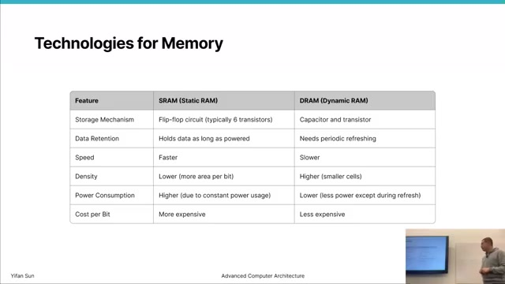

Small, fast SRAM caches bridge the latency gap between a core and DRAM. L1 is nearest and fastest; L2 is larger and slower; many CPUs add an L3 or last-level cache before main memory. CPU L1 is commonly split into instruction and data caches, whereas lower levels are often unified. GPU organizations commonly place per-CU/private L1 structures above a shared L2.

Each level trades capacity and sharing for latency. A hit at a near level avoids accessing all lower levels.

### Slide 6 — Locality ([00:18:30](https://www.youtube.com/watch?v=4ZtRKpToqB0&t=1110s))

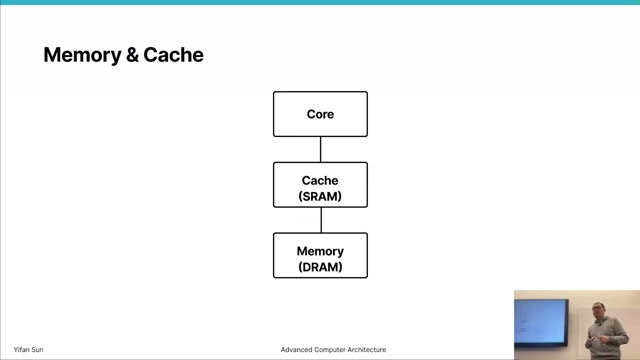

**Locality** is the tendency for programs to access the same addresses or nearby addresses. Caches work because program references are not uniformly random: a relatively small working set often accounts for many accesses.

### Slide 7 — Temporal and spatial locality ([00:19:30](https://www.youtube.com/watch?v=4ZtRKpToqB0&t=1170s))

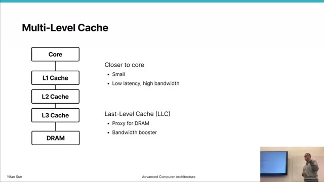

**Temporal locality** means recently accessed data is likely to be used again, as with a loop counter or repeatedly referenced variable. **Spatial locality** means data near a recent address is likely to be accessed, as when traversing an array.

```c
for (int i = 0; i < n; ++i)
    c[i] = a[i] + b[i];
```

The loop state demonstrates temporal reuse, while sequential array elements demonstrate spatial locality. Fetching an entire cache line exploits the latter by bringing neighboring bytes along with the requested value.

## Cache lookup

### Slide 8 — Read request and cache miss ([00:22:30](https://www.youtube.com/watch?v=4ZtRKpToqB0&t=1350s))

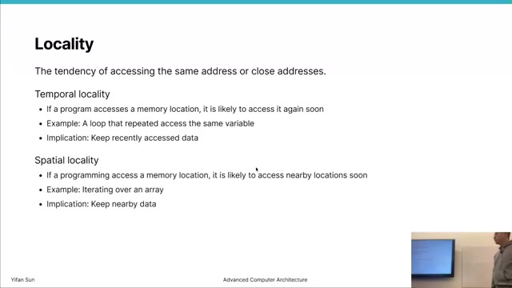

The processor presents address $A$. If the line containing $A$ is already present and valid, the cache returns a **hit**. Otherwise a **miss** sends a line-aligned request to the next level. When the line returns, the cache installs it and supplies the requested bytes to the processor. The first access to an initially empty, or cold, cache necessarily misses; a later access can hit.

Average memory access time is commonly modeled as

$$
AMAT = T_{hit} + MissRate \times MissPenalty,
$$

with additional nested terms for multiple cache levels.

### Slide 9 — Tags, valid bits, and data ([00:24:30](https://www.youtube.com/watch?v=4ZtRKpToqB0&t=1470s))

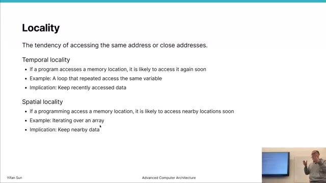

Each resident line includes data plus metadata:

| Field | Purpose |
|---|---|
| Valid | Says whether the entry contains meaningful data |
| Tag | Identifies which memory line occupies the entry |
| Data | Holds the cache-line bytes |

A hit requires both a matching tag and a set valid bit. Valid bits begin cleared so uninitialized tag storage cannot create a false hit.

### Slide 10 — Cache design transition ([00:25:30](https://www.youtube.com/watch?v=4ZtRKpToqB0&t=1530s))

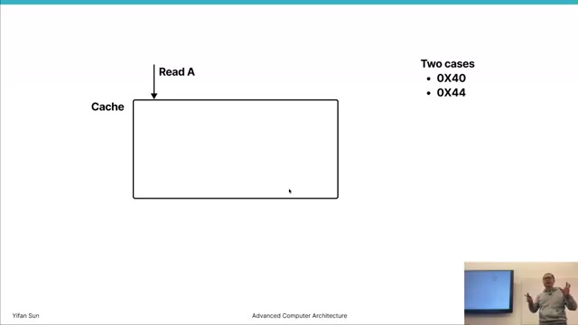

The lecture moves from cache behavior to implementation. The central question is where a memory line may be placed. Allowing every line in every entry minimizes placement conflicts but requires many tag comparisons. Restricting placement reduces hardware while creating conflict misses.

### Slide 11 — Associative lookup hardware ([00:27:30](https://www.youtube.com/watch?v=4ZtRKpToqB0&t=1650s))

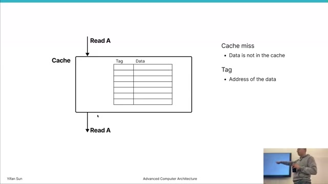

In a fully flexible lookup, the requested tag is compared with many stored tags in parallel. Match signals identify a hit, an encoder identifies the matching entry, and a multiplexer returns its data. If no valid comparison matches, miss logic forwards the request to the next level.

This organization is fast for a small number of entries but comparator, wiring, power, and selection cost scale with entry count.

### Slide 12 — Why the tag is necessary ([00:29:30](https://www.youtube.com/watch?v=4ZtRKpToqB0&t=1770s))

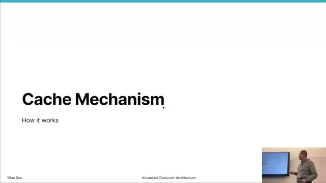

A cache holds only a subset of memory, so an entry's position alone usually does not identify its contents. The tag preserves the upper address identity. Lookup selects candidate entries and compares their stored tags; mismatch means the desired memory line is absent even if the candidate slot contains valid data.

### Slide 13 — Toward one comparator ([00:32:30](https://www.youtube.com/watch?v=4ZtRKpToqB0&t=1950s))

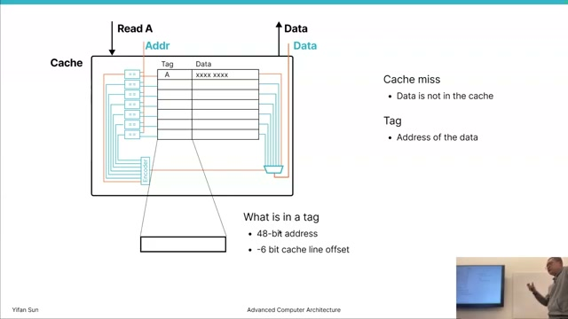

The instructor asks whether one comparator can replace a comparator per entry. A direct-mapped cache does this by using address bits to select exactly one candidate. Only that entry's tag needs comparison. The price is that every memory line has only one legal cache location.

## Placement and associativity

### Slide 14 — Address split into tag, set, and offset ([00:35:00](https://www.youtube.com/watch?v=4ZtRKpToqB0&t=2100s))

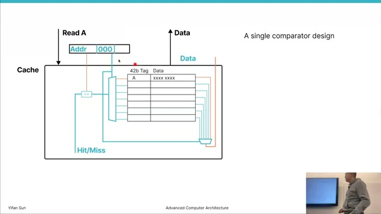

For an 8-set cache with 64-byte lines, an address is divided as follows:

$$
\underbrace{Tag}_{A-3-6\ bits}\;|\;
\underbrace{Set}_{3\ bits}\;|\;
\underbrace{Byte\ Offset}_{6\ bits}.
$$

In general,

$$
OffsetBits=\log_2(LineBytes), \qquad IndexBits=\log_2(Sets),
$$

$$
TagBits=AddressBits-IndexBits-OffsetBits.
$$

The offset selects bytes within a line, the index selects a set, and the tag distinguishes all memory lines that map to that set. Consecutive lines cycle through consecutive sets before wrapping around.

### Slide 15 — Direct-mapped cache ([00:38:00](https://www.youtube.com/watch?v=4ZtRKpToqB0&t=2280s))

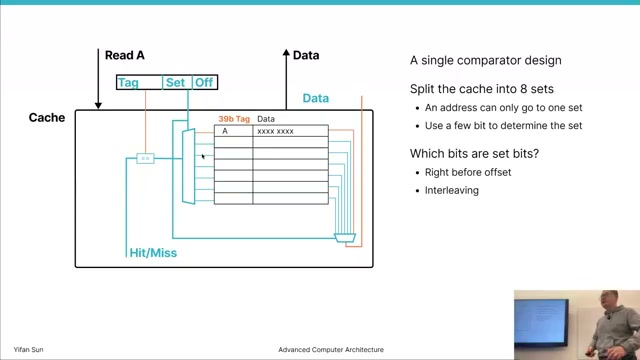

A direct-mapped cache has one way per set. Lookup is cheap: index one entry, compare one tag, and return its data on a valid match. However, two frequently used lines with the same index cannot coexist. They repeatedly evict each other even if other sets are empty, producing **conflict misses** or thrashing.

### Slide 16 — Increasing associativity ([00:41:00](https://www.youtube.com/watch?v=4ZtRKpToqB0&t=2460s))

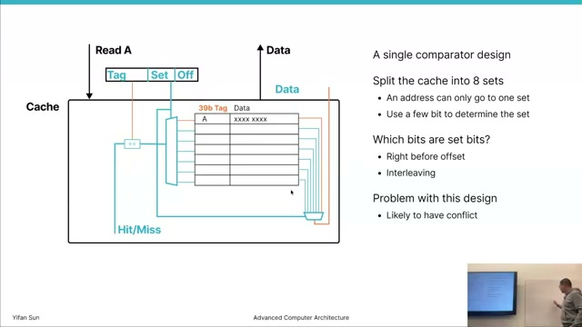

An $N$-way set-associative cache gives each memory line $N$ possible locations in its selected set. For a fixed total number of entries, increasing ways reduces the number of sets and therefore the number of index bits. It also requires one parallel tag comparator per way.

A two-way cache can keep two conflicting lines in the same set, avoiding the immediate ping-pong eviction of a direct-mapped design.

### Slide 17 — Two-way set-associative lookup ([00:43:00](https://www.youtube.com/watch?v=4ZtRKpToqB0&t=2580s))

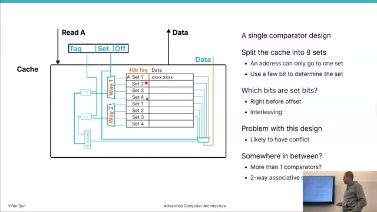

The index selects one row from each way. Both tags in that set are compared with the request in parallel. A valid match selects the corresponding data; no match is a miss. On a fill when both ways are occupied, the cache must additionally choose a victim, introducing replacement policy.

### Slide 18 — Associativity spectrum ([00:45:00](https://www.youtube.com/watch?v=4ZtRKpToqB0&t=2700s))

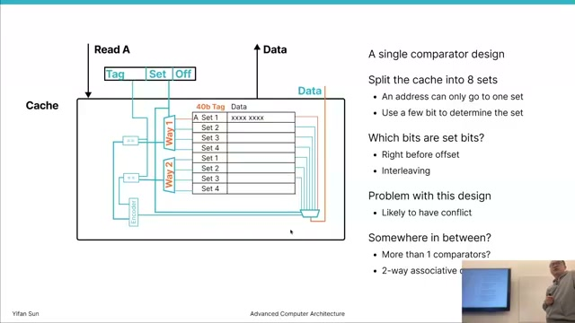

For fixed capacity,

$$
Capacity = Sets \times Ways \times LineBytes.
$$

| Organization | Sets | Ways | Tag comparators per lookup | Main tradeoff |
|---|---:|---:|---:|---|
| Direct mapped | $N$ | 1 | 1 | Lowest lookup cost, most conflicts |
| Set associative | $N/W$ | $W$ | $W$ | Balanced cost and flexibility |
| Fully associative | 1 | $N$ | $N$ | Any placement, highest lookup cost |

Mainstream caches are usually set associative. Small structures with costly misses, such as some TLBs, can justify high or full associativity.

## Replacement

### Slide 19 — Choosing a victim ([00:50:00](https://www.youtube.com/watch?v=4ZtRKpToqB0&t=3000s))

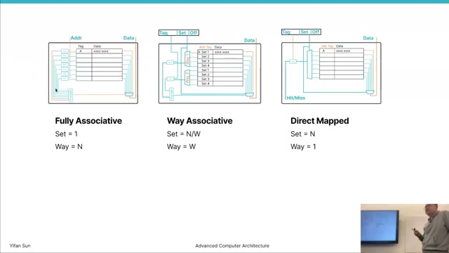

When a miss targets a full set, one resident line must be evicted. The selected line is the **victim**, and the replacement policy chooses it. Direct-mapped caches have no choice; associative caches gain placement flexibility but need policy state and decision logic.

### Slide 20 — A, B, C replacement example ([00:51:00](https://www.youtube.com/watch?v=4ZtRKpToqB0&t=3060s))

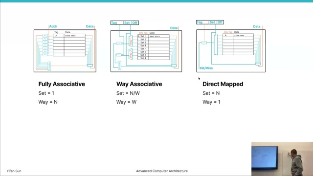

Consider a two-way set receiving lines `A`, `B`, and then `C`. Once `A` and `B` occupy both ways, inserting `C` requires an eviction. If the sequence is `A, B, A, C`:

| Policy | Victim | Reason |
|---|---|---|
| LRU | `B` | It was used least recently |
| FIFO | `A` | It entered the set first |
| Random | `A` or `B` | No history-based preference |
| MRU | `A` | It was used most recently |

The choices can behave very differently on the next access, so no policy is universally optimal.

### Slide 21 — Replacement-policy tradeoffs ([00:54:00](https://www.youtube.com/watch?v=4ZtRKpToqB0&t=3240s))

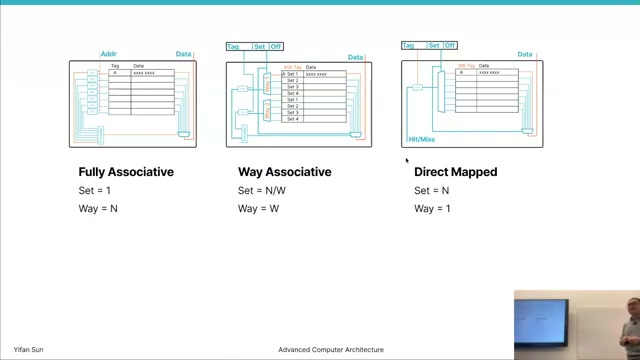

LRU follows temporal locality but exact ordering becomes expensive as associativity grows; practical caches often use pseudo-LRU or another approximation. FIFO is simpler because hits do not reorder entries. Random requires little history and avoids some adversarial patterns. MRU can help certain scans or streaming patterns where the newest line is unlikely to be reused, though it is not the usual general-purpose choice.

Replacement policy matters only among eligible ways in the indexed set. Its value depends on workload reuse, associativity, miss penalty, metadata cost, and the latency/power budget of the cache level.

## Key formulas and takeaways

1. $Capacity=Sets\times Ways\times LineBytes$.
2. $OffsetBits=\log_2(LineBytes)$.
3. $IndexBits=\log_2(Sets)$.
4. $TagBits=AddressBits-IndexBits-OffsetBits$.
5. A hit requires a selected entry with both a matching tag and valid bit.
6. $AMAT=T_{hit}+MissRate\times MissPenalty$ for a one-level model.
7. Temporal locality predicts reuse of the same address; spatial locality predicts use of nearby addresses.
8. SRAM is fast but area-expensive; DRAM is dense but requires sensing, restoration, and refresh.
9. Direct mapping needs one comparison but can suffer severe conflict misses.
10. An $N$-way lookup compares $N$ candidate tags in parallel.
11. Fully associative placement eliminates set conflicts but has the highest lookup cost.
12. More associativity generally reduces conflict misses while increasing access energy, area, and potentially latency.
13. A miss fill may require eviction; dirty victims must be written to the next level under a write-back policy.
14. LRU, FIFO, random, and MRU encode different predictions about future reuse.
15. Real designs jointly optimize hit time, miss rate, miss penalty, power, and chip area rather than maximizing one metric alone.