# Pipelined CPU Core Design

**Course:** CSCI 654 Advanced Computer Architecture, Spring 2026  
**Instructor:** Yifan Sun, William & Mary  
**Video:** [YouTube lecture](https://www.youtube.com/watch?v=5TzQrH2GEbk) (1:10:06)

These notes follow the lecture's substantive diagrams and timing examples. Explanations combine the original English captions with the visuals; obvious caption errors such as “header” and “knobs” are normalized to **hazard** and **NOPs**.

## From multi-cycle to pipelined execution

### Slide 1 — Pipelined core design ([00:00:05](https://www.youtube.com/watch?v=5TzQrH2GEbk&t=5s))

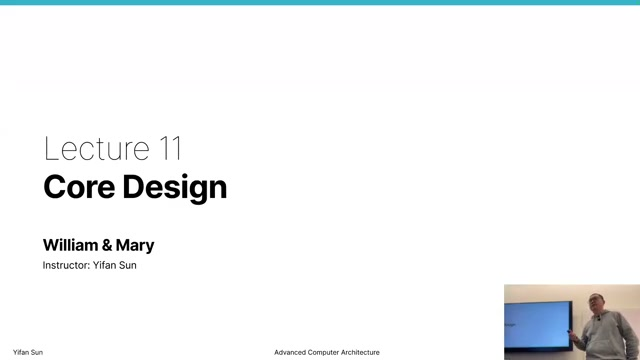

The lecture extends the previously constructed single-cycle and multi-cycle RISC-V cores into a five-stage pipeline. Pipelining preserves the short stage-sized clock period of a multi-cycle core while overlapping different instructions to seek throughput near one completed instruction per cycle.

### Slide 2 — Multi-cycle datapath review ([00:00:35](https://www.youtube.com/watch?v=5TzQrH2GEbk&t=35s))

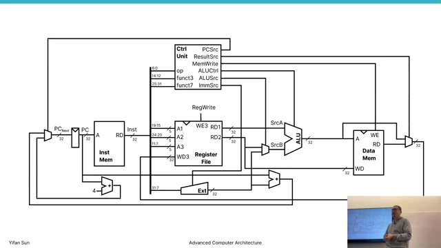

The review traces the shared multi-cycle datapath: the PC fetches an instruction, the register file supplies operands, the ALU computes arithmetic or addresses, data memory serves loads and stores, and a result returns to the register file. Temporary registers retain the instruction, operands, ALU result, and memory data across cycles.

### Slide 3 — Control FSM and performance ([00:03:30](https://www.youtube.com/watch?v=5TzQrH2GEbk&t=210s))

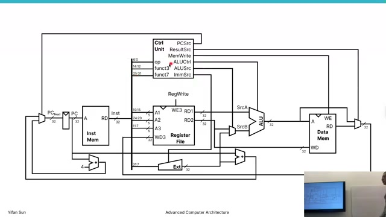

The multi-cycle control unit is a finite-state machine. Every instruction passes through fetch and decode, then follows operation-specific execute, memory, and writeback states. Its clock can be short, but the states are serialized: while one instruction uses execute, no later instruction uses fetch or decode.

CPU time remains

$$
T_{CPU}=N_{instructions}\times CPI\times T_{cycle}
=\frac{N_{instructions}\times CPI}{f_{clock}}.
$$

### Slide 4 — Intrinsic conflict ([00:06:30](https://www.youtube.com/watch?v=5TzQrH2GEbk&t=390s))

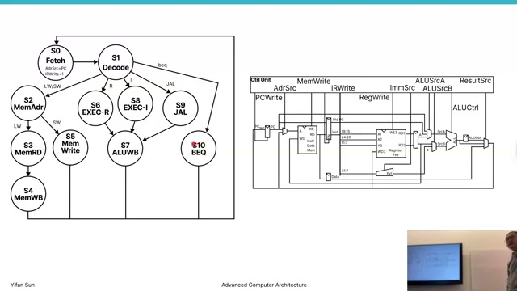

Human explanations naturally serialize “fetch, decode, execute,” while hardware contains independent structures that can work simultaneously. In the multi-cycle core, instruction memory is idle during execute and the ALU is idle during fetch. Pipelining exploits this latent parallelism by assigning different instructions to those components at the same time.

### Slide 5 — Grouping states into stages ([00:08:30](https://www.youtube.com/watch?v=5TzQrH2GEbk&t=510s))

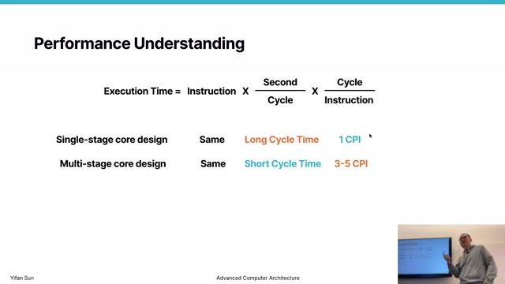

The control FSM's states can be grouped by hardware role:

| Stage | Abbreviation | Main work |
|---|---|---|
| Fetch | F / IF | Read instruction and advance PC |
| Decode | D / ID | Decode and read registers |
| Execute | E / EX | ALU operation, address, or comparison |
| Memory | M / MEM | Read or write data memory |
| Writeback | W / WB | Update destination register |

Different instruction classes do not intrinsically need every stage, but a regular pipeline gives them aligned stage slots and carries “no write” control where a stage has no architectural effect.

### Slide 6 — Pipelined execution ([00:11:00](https://www.youtube.com/watch?v=5TzQrH2GEbk&t=660s))

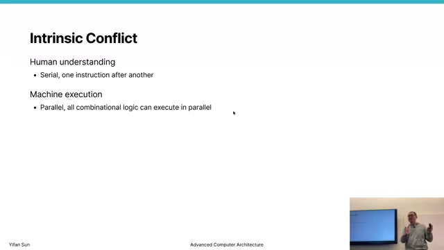

Pipeline registers divide the datapath into stage-sized combinational regions. At each clock edge, every stage hands its instruction state to the next register while accepting another instruction from the previous stage. The latency of one instruction remains about five cycles, but throughput improves after the pipeline fills.

### Slide 7 — Five-stage timing ([00:13:00](https://www.youtube.com/watch?v=5TzQrH2GEbk&t=780s))

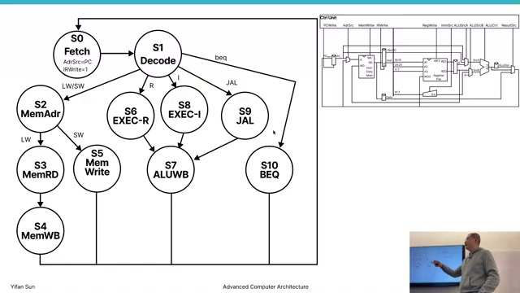

With independent instructions, the timing is staggered:

| Cycle | Instruction 1 | Instruction 2 | Instruction 3 |
|---:|---|---|---|
| 1 | F |  |  |
| 2 | D | F |  |
| 3 | E | D | F |
| 4 | M | E | D |
| 5 | W | M | E |
| 6 |  | W | M |

For $N$ instructions and $K$ ideal stages, completion takes approximately

$$
Cycles=N+K-1,
$$

so the long-run CPI approaches 1 as $N$ grows.

### Slide 8 — Adding pipeline registers ([00:15:30](https://www.youtube.com/watch?v=5TzQrH2GEbk&t=930s))

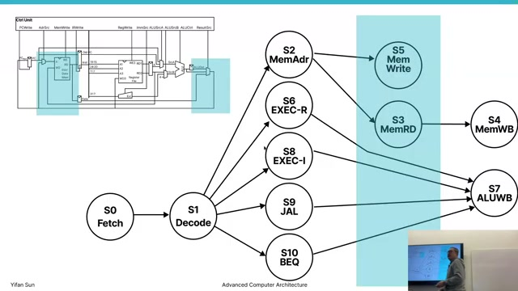

Registers are inserted at IF/ID, ID/EX, EX/MEM, and MEM/WB boundaries. Each must carry every value needed later, not only the obvious data result. For example, a load's destination register ID must travel beside its operands and memory data until writeback.

The minimum clock period is constrained by the slowest stage plus pipeline-register overhead:

$$
T_{cycle}\geq \max(T_F,T_D,T_E,T_M,T_W)+T_{reg}.
$$

### Slide 9 — Instruction propagation ([00:18:30](https://www.youtube.com/watch?v=5TzQrH2GEbk&t=1110s))

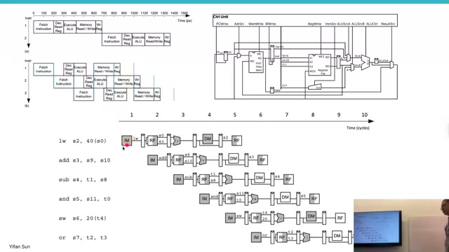

The diagram follows one instruction's fields and values across the new registers. Decode generates operands and immediate data; execute consumes them; memory receives an address and store value; writeback receives a result and destination ID. Values must arrive in the same cycle as the control bits that describe how to use them.

### Slide 10 — Pipelining control signals ([00:21:30](https://www.youtube.com/watch?v=5TzQrH2GEbk&t=1290s))

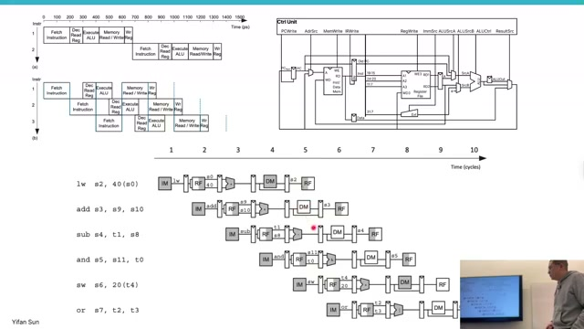

Control is decoded early but used later. ALU controls travel to EX, memory read/write controls travel to MEM, and register-write/result-select controls travel to WB. Delaying these signals through stage registers prevents one instruction's control from being applied to another instruction's data.

### Slide 11 — Completed pipelined datapath ([00:25:00](https://www.youtube.com/watch?v=5TzQrH2GEbk&t=1500s))

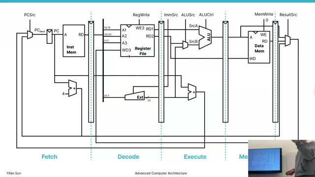

The complete datapath has distinct instruction and data memory paths, stage registers, and feedback from writeback to the register file. In steady state, fetch, decode, ALU, memory, and writeback can all be active for different instructions. This is instruction-level parallelism: instructions overlap while each instruction still observes sequential program semantics.

### Slide 12 — Overlapping instruction timeline ([00:29:00](https://www.youtube.com/watch?v=5TzQrH2GEbk&t=1740s))

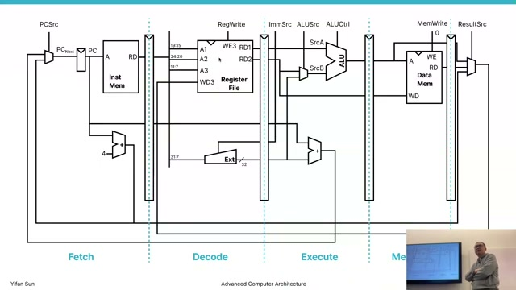

The instruction sequence is laid out diagonally across cycles. The first result appears after the fill latency; thereafter one instruction can finish each cycle until the pipeline drains. Pipelining improves throughput, not the isolated latency of a single instruction.

### Slide 13 — Performance comparison ([00:33:00](https://www.youtube.com/watch?v=5TzQrH2GEbk&t=1980s))

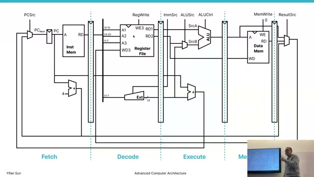

| Design | Cycle period | Ideal CPI | Limitation |
|---|---|---:|---|
| Single cycle | Long critical path | 1 | Every instruction waits for worst case |
| Multi-cycle | Short stage-sized clock | 3–5 | Stages used serially |
| Pipeline | Short stage-sized clock | Near 1 | Hazards disrupt ideal overlap |

Ideal speedup is bounded by stage count and balance. Register overhead, unequal stage delays, fill/drain time, and hazards make real speedup smaller than $K$ for a $K$-stage pipeline.

## Data hazards

### Slide 14 — Hazard ([00:35:00](https://www.youtube.com/watch?v=5TzQrH2GEbk&t=2100s))

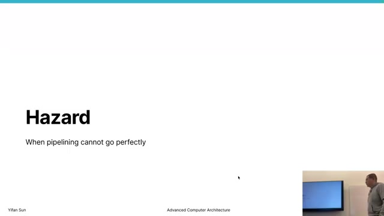

A **pipeline hazard** is a situation in which normal overlapped execution would produce an incorrect result or cannot proceed. The three broad classes are data hazards, structural hazards, and control hazards. Correct hardware must detect or prevent them even though doing so can reduce throughput.

### Slide 15 — Dependency types ([00:37:30](https://www.youtube.com/watch?v=5TzQrH2GEbk&t=2250s))

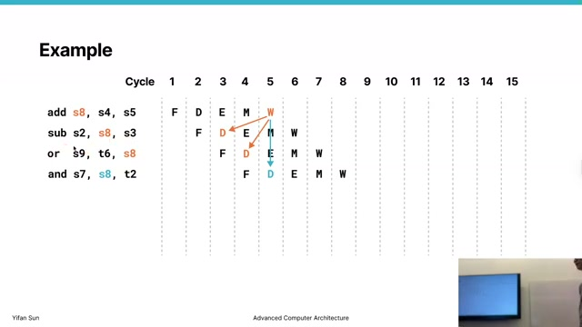

For two instructions accessing the same location:

| Relationship | Meaning | In a simple in-order five-stage pipeline |
|---|---|---|
| RAW | Later instruction reads an earlier result | True dependency; common hazard |
| WAR | Later instruction writes before earlier read | Cannot occur with ordered reads/writes here |
| WAW | Later write overtakes earlier write | Cannot occur when writeback stays ordered |
| RAR | Both read | No dependency requiring serialization |

WAR and WAW become hazards in machines that allow instructions to complete out of order. The lecture focuses on RAW for this in-order pipeline.

### Slide 16 — RAW timing example ([00:40:00](https://www.youtube.com/watch?v=5TzQrH2GEbk&t=2400s))

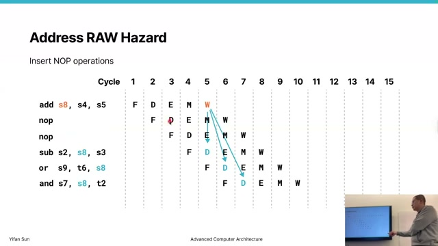

In a sequence such as

```asm
add s8, s4, s5
sub s2, s8, s3
or  s9, t6, s8
and s7, s8, t2
```

the `add` produces `s8`, but the following `sub` tries to read the old register-file value before the `add` reaches writeback. The dependency exists in the program; it becomes a hazard because the consumer's need time precedes the producer's normal availability time.

### Slide 17 — Insert NOPs ([00:42:00](https://www.youtube.com/watch?v=5TzQrH2GEbk&t=2520s))

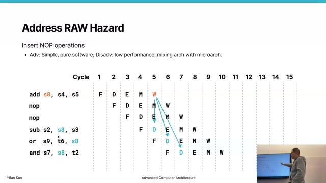

Inserting no-operation instructions delays the consumer until the producer writes back. This is simple and makes timing explicit, but every NOP occupies a pipeline slot without useful work. Encoding fixed delays in software also couples binaries to one microarchitecture's pipeline depth.

### Slide 18 — Software scheduling ([00:45:00](https://www.youtube.com/watch?v=5TzQrH2GEbk&t=2700s))

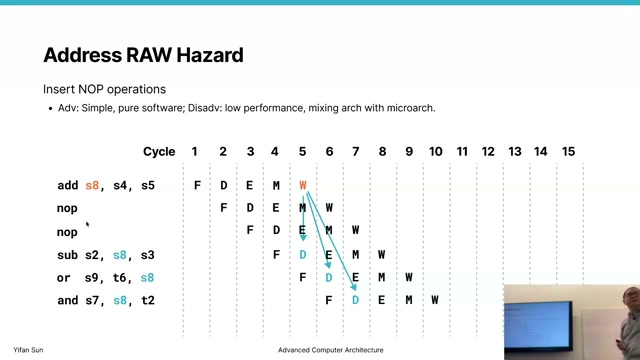

Instead of wasting slots, a compiler can move independent instructions between the producer and consumer. Scheduling preserves dependencies while filling delay cycles with useful work. Its effectiveness depends on finding independent operations and respecting memory aliases, control flow, and exceptions; short dependency chains may offer nothing safe to move.

### Slide 19 — Pipeline stalling and bubbles ([00:47:00](https://www.youtube.com/watch?v=5TzQrH2GEbk&t=2820s))

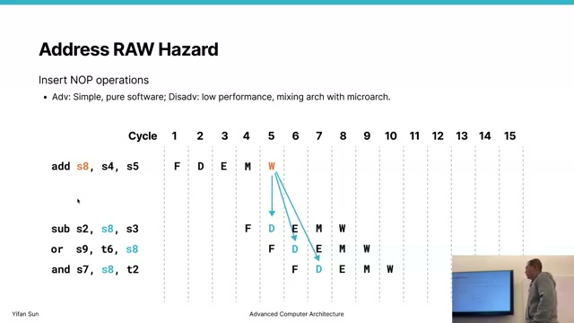

Hardware can detect a source register that conflicts with an in-flight destination. It holds the PC and IF/ID state, prevents the dependent instruction from advancing, and injects a **bubble** into the next stage while older instructions continue. This avoids ISA-visible NOPs and lets binaries run correctly on different implementations, at the cost of detection and control logic.

### Slide 20 — Value forwarding ([00:50:00](https://www.youtube.com/watch?v=5TzQrH2GEbk&t=3000s))

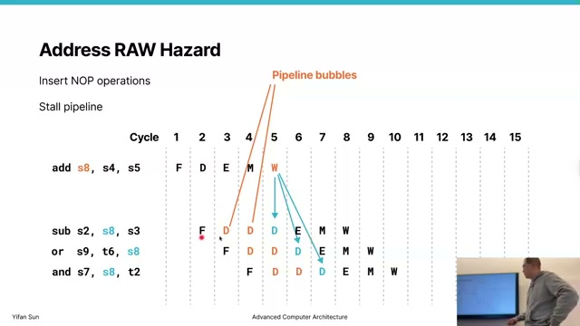

An ALU result exists at the end of EX before it is written to the register file. **Forwarding** or **bypassing** routes that result directly from EX/MEM or MEM/WB to a later instruction's ALU-input multiplexer. Comparators match the consumer's source IDs against in-flight destination IDs and select the newest valid value.

### Slide 21 — Forwarding worked example ([00:53:00](https://www.youtube.com/watch?v=5TzQrH2GEbk&t=3180s))

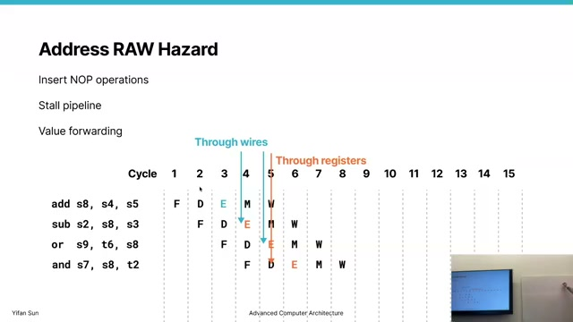

The timing diagram shows consumers receiving `s8` through bypass paths rather than waiting for register writeback. A nearest dependent ALU instruction can use the producer's EX result in its own next-cycle EX stage. Later consumers may forward from MEM/WB or simply read the now-updated register file. Forwarding removes many RAW stalls but adds comparators, wide bypass buses, and larger ALU-input multiplexers to a timing-critical path.

### Slide 22 — Load-use hazard ([00:56:00](https://www.youtube.com/watch?v=5TzQrH2GEbk&t=3360s))

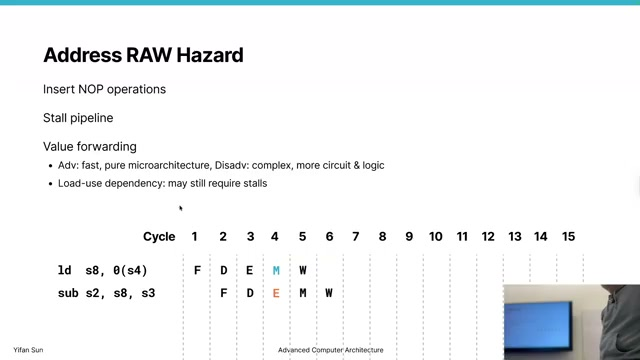

For an immediately dependent load,

```asm
ld  s8, 0(s4)
sub s2, s8, s3
```

the loaded value appears only after the memory stage, later than an ALU result. The following instruction needs it at the start of EX, so ordinary forwarding cannot move data backward in time. A one-cycle stall delays the consumer; then memory-to-EX forwarding supplies the value. Longer memory latency can require additional waiting.

## Structural and control hazards

### Slide 23 — Structural hazards ([00:58:00](https://www.youtube.com/watch?v=5TzQrH2GEbk&t=3480s))

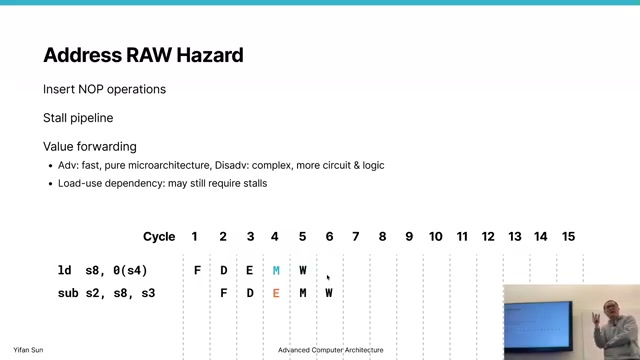

A structural hazard occurs when simultaneous stages need one insufficiently replicated resource. A unified single-port memory, for example, cannot serve instruction fetch and a load/store in the same cycle. Remedies include stalling, adding ports, replicating resources, or separating instruction and data memories/caches.

### Slide 24 — Register-bank conflict ([01:03:00](https://www.youtube.com/watch?v=5TzQrH2GEbk&t=3780s))

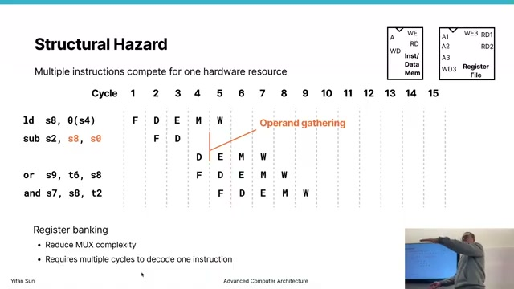

Operand gathering can create a similar conflict when a register structure lacks enough read/write ports or when multiple operands target the same bank. Banking increases aggregate bandwidth only when accesses distribute across banks; conflicting accesses serialize. Hardware may detect bank conflicts and replay or stall one request.

### Slide 25 — Mitigating structural hazards ([01:05:00](https://www.youtube.com/watch?v=5TzQrH2GEbk&t=3900s))

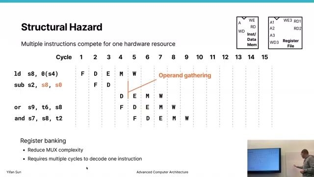

The design alternatives embody an area-versus-throughput tradeoff. A von Neumann organization shares instruction and data memory and may conflict; a Harvard-style front end provides separate instruction and data paths. Multiported register files support simultaneous operand reads and writeback but cost area, power, and access time. Stalling is cheaper in hardware but lowers performance.

### Slide 26 — Control hazards ([01:08:30](https://www.youtube.com/watch?v=5TzQrH2GEbk&t=4110s))

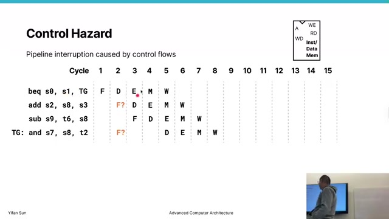

A branch makes the next PC uncertain while younger sequential instructions are already in the pipeline. If the branch is taken after those instructions have entered fetch/decode, they are wrong-path work and must be flushed. The lost cycles are the branch penalty.

Resolving branches earlier reduces the number of wrong-path stages. Branch prediction chooses a likely next PC and preserves throughput when correct; a misprediction redirects fetch and squashes younger instructions. Deeper pipelines tend to increase the potential penalty, making prediction quality increasingly important.

## Key formulas and takeaways

1. $T_{CPU}=N\times CPI/f_{clock}$.
2. Pipeline clock period is at least the slowest stage delay plus register overhead.
3. An ideal $K$-stage pipeline completes $N$ instructions in $N+K-1$ cycles.
4. Ideal long-run pipeline $CPI\rightarrow1$ and $IPC\rightarrow1$ for a scalar pipeline.
5. Pipelining improves throughput, not the latency of one isolated instruction.
6. Data and control signals must cross pipeline registers together.
7. RAW is a true dependency; WAR and WAW do not become hazards in this simple ordered pipeline.
8. A bubble consumes a stage slot but performs no architectural work.
9. Software scheduling fills dependency gaps with independent instructions when possible.
10. Stalling holds younger state while older instructions continue toward completion.
11. Forwarding uses an in-flight result before register-file writeback.
12. An immediate load-use dependency still requires a stall in the classic five-stage pipeline.
13. Structural hazards arise from insufficient ports or replicated resources.
14. Separate instruction and data paths avoid fetch-versus-memory conflicts.
15. A taken or mispredicted branch flushes wrong-path instructions, creating a control-hazard penalty.
16. Real CPI is $1+\text{stall cycles per instruction}$ for an ideal scalar pipeline plus hazards.