# Cache Coherence Design and Protocols

**Course:** CSCI 654 Advanced Computer Architecture, Spring 2026  
**Instructor:** Yifan Sun, William & Mary  
**Video:** [YouTube lecture](https://www.youtube.com/watch?v=OsUwN-PPspw) (1:13:59)

These notes follow the lecture's substantive diagrams and protocol transitions. Explanations combine the original English captions with the visuals; protocol event names such as `BusRd`, `BusRdX`, and `BusUpgr` describe conceptual transactions whose exact implementation varies.

## Why coherence is required

### Slide 1 — Cache hierarchy review ([00:00:05](https://www.youtube.com/watch?v=OsUwN-PPspw&t=5s))

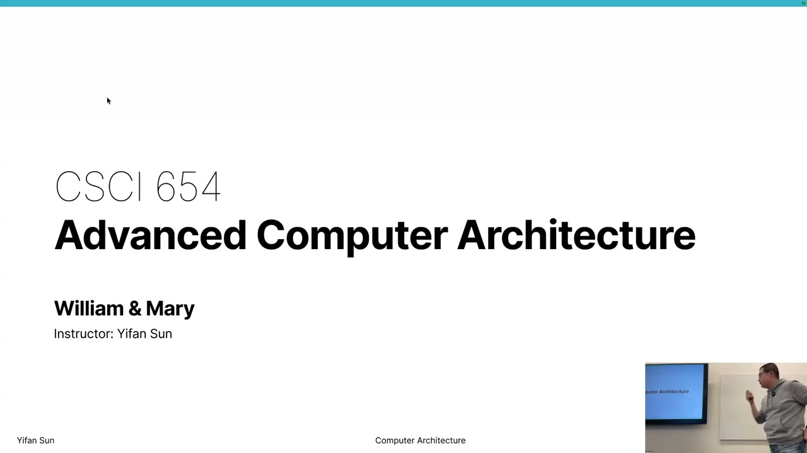

The final cache lecture asks how a multicore system keeps private cached copies consistent. A hierarchy reduces average memory latency, but replication means several caches can hold the same line. Once one core writes its copy, the machine needs a protocol that prevents other cores from using stale data.

### Slide 2 — Multicore cache hierarchy ([00:01:35](https://www.youtube.com/watch?v=OsUwN-PPspw&t=95s))

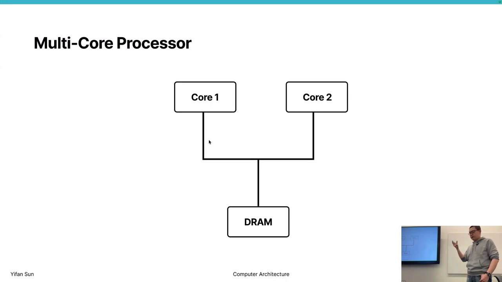

Each core may have a private L1, while L2 or lower levels may be private to a cluster or shared. A line can therefore appear simultaneously in multiple L1s and at a lower cache or memory. The hierarchy must track which copies are readable, which cache may write, and where the newest data resides.

### Slide 3 — Inconsistent cached copies ([00:03:05](https://www.youtube.com/watch?v=OsUwN-PPspw&t=185s))

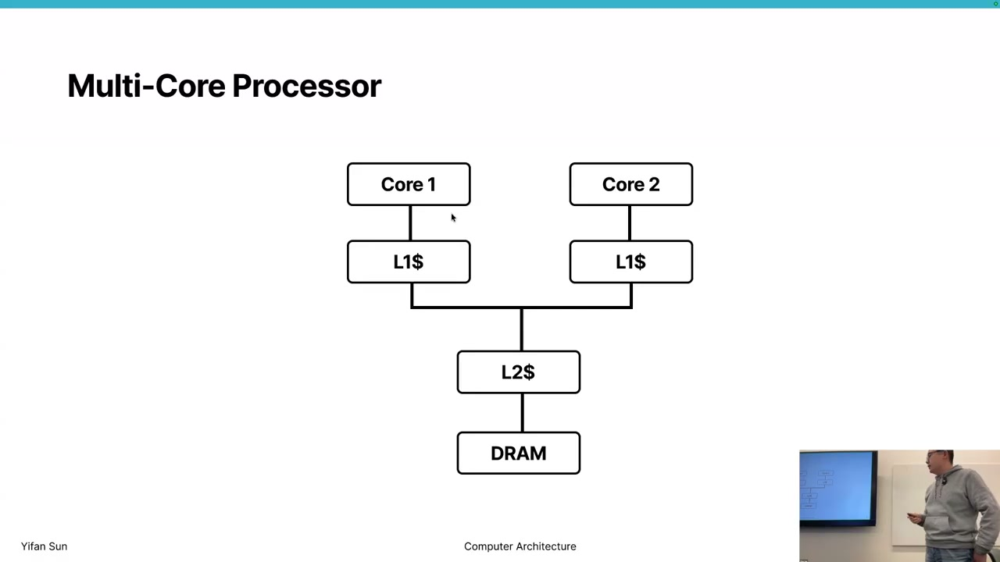

Suppose two cores read line $X$ and both cache value $x_0$. Core 0 then writes $x_1$ locally. Without coherence, Core 1 can still hit on $x_0$, violating the expectation that later synchronized reads observe the newest write. A cache hit is useful only when the copy is also coherent.

### Slide 4 — Coherence invariants ([00:05:05](https://www.youtube.com/watch?v=OsUwN-PPspw&t=305s))

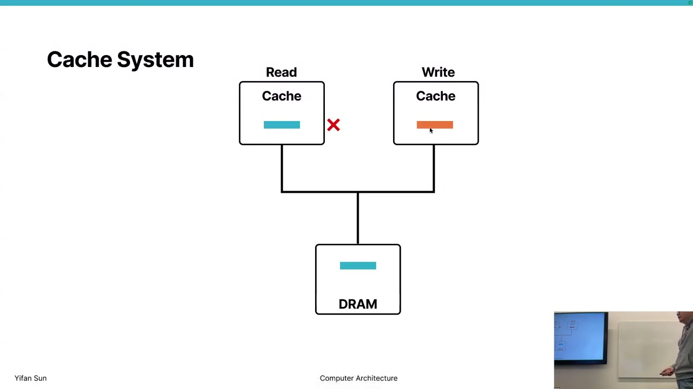

The lecture expresses coherence through two requirements:

1. **Single-writer, multiple-reader (SWMR):** during an epoch, a line may have one writable owner or multiple read-only sharers, but not both.
2. **Data-value invariant:** a read must receive the value of the latest write visible under the memory-consistency rules.

Coherence controls one address at a time; memory consistency defines the ordering in which accesses to different addresses become visible.

### Slide 5 — Line granularity and false sharing ([00:07:35](https://www.youtube.com/watch?v=OsUwN-PPspw&t=455s))

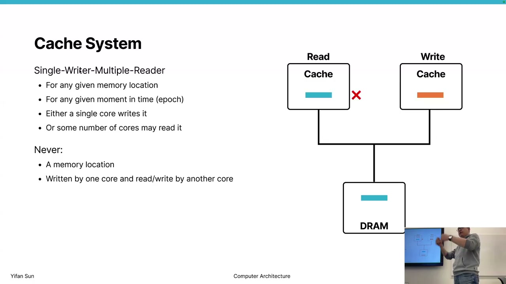

Protocols normally track cache lines rather than individual bytes. If Core 0 writes one word and Core 1 writes another word in the same line, the program's data may be independent, yet ownership of the entire line repeatedly moves between cores. This **false sharing** creates invalidations and transfers without a true variable-level dependency.

Smaller coherence granularity reduces false sharing but increases tags, states, messages, and control complexity.

### Slide 6 — Cache coherence protocols ([00:10:05](https://www.youtube.com/watch?v=OsUwN-PPspw&t=605s))

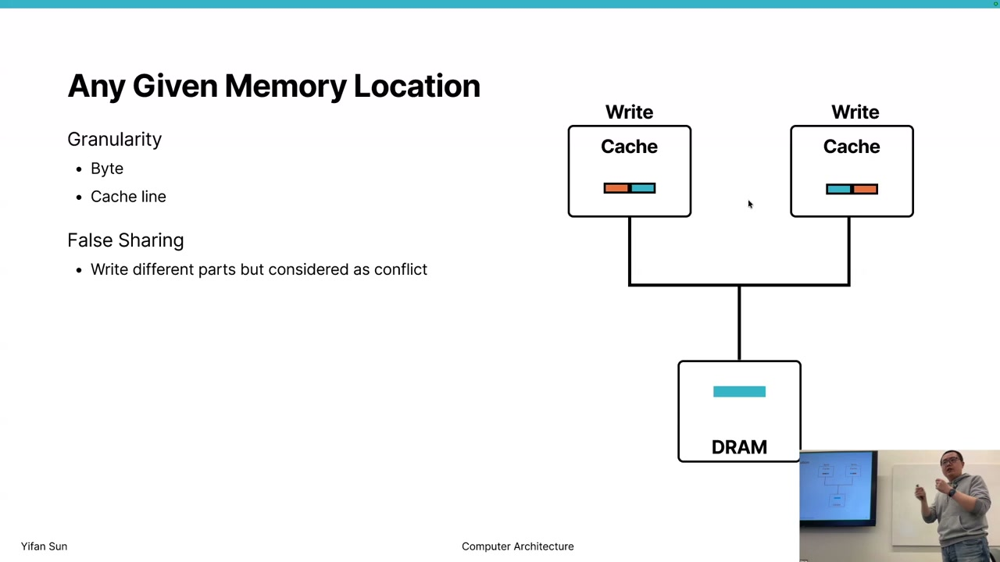

Brute-force approaches such as disabling private caching, flushing broadly, or serializing execution sacrifice most of the hierarchy's benefit. A coherence protocol instead attaches state to each cached line and exchanges messages when reads, writes, or evictions change legal ownership.

## VI and communication organizations

### Slide 7 — VI protocol assumptions ([00:12:35](https://www.youtube.com/watch?v=OsUwN-PPspw&t=755s))

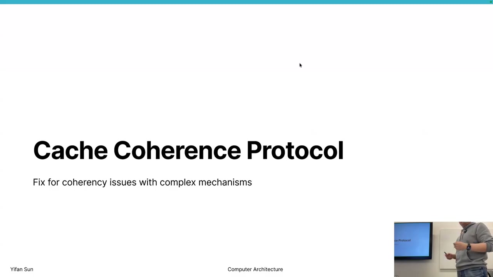

The introductory **VI** protocol gives each line two states: Valid or Invalid. The example uses a shared bus. An arbiter allows one transaction at a time, and every cache can snoop the broadcast. This makes it easy for one cache's write notification to invalidate matching copies elsewhere.

### Slide 8 — VI read miss ([00:13:35](https://www.youtube.com/watch?v=OsUwN-PPspw&t=815s))

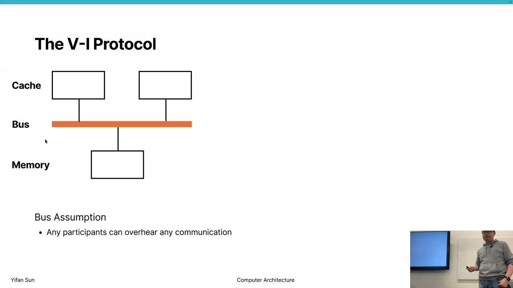

A processor read that finds the line Invalid issues `BusRd`. Data comes from memory or another appropriate responder, and the requesting cache installs the line as Valid:

$$
I \xrightarrow{PrRd/BusRd} V.
$$

A processor read in V is a local hit. Other caches observe the bus request but need not invalidate their clean valid copies.

### Slide 9 — VI write and invalidation ([00:16:35](https://www.youtube.com/watch?v=OsUwN-PPspw&t=995s))

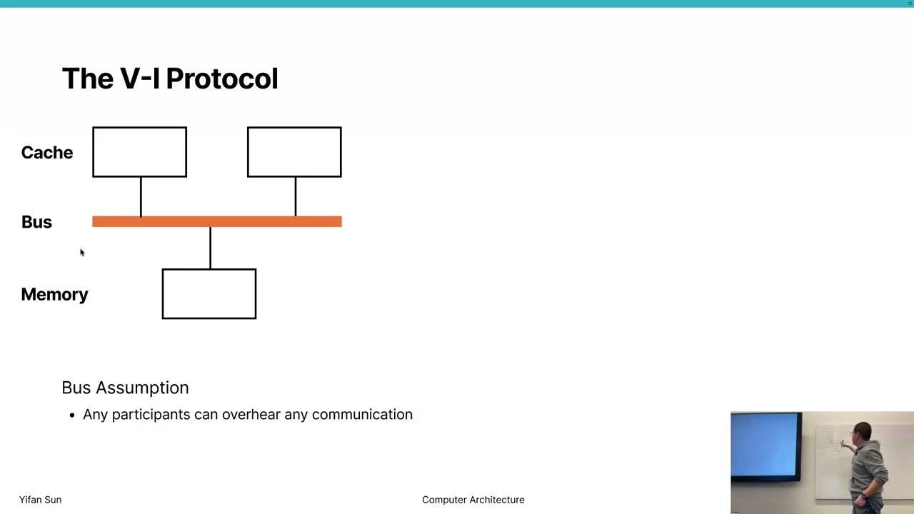

Before a core writes, other valid copies must become Invalid. In the lecture's simple model, the writer broadcasts a write transaction; snooping peers with the line transition $V\rightarrow I$, while the writer remains Valid with the new value. Because VI does not distinguish private from shared valid data, even a sole owner cannot know that a write is locally safe without communication.

### Slide 10 — VI transition table ([00:18:45](https://www.youtube.com/watch?v=OsUwN-PPspw&t=1125s))

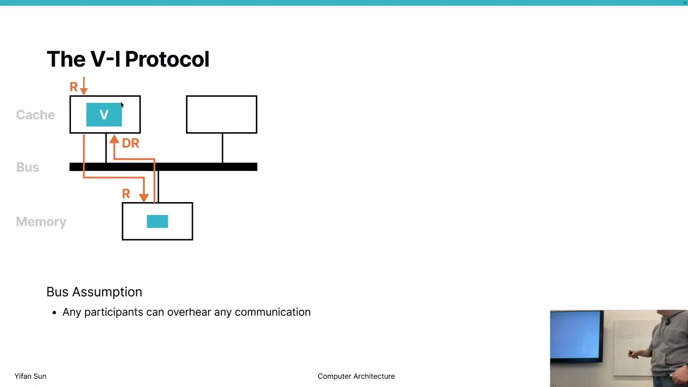

| State | Local read | Local write | Snooped read | Snooped write/exclusive request |
|---|---|---|---|---|
| I | Issue read, fill to V | Obtain writable copy, go V | Stay I | Stay I |
| V | Hit, stay V | Broadcast/perform write, stay V | Stay V | Invalidate to I |

VI is easy to explain and cheap in state bits, but it cannot represent whether a valid line is private, shared, clean, or dirty. That lost information creates unnecessary traffic.

### Slide 11 — Snooping protocols ([00:21:15](https://www.youtube.com/watch?v=OsUwN-PPspw&t=1275s))

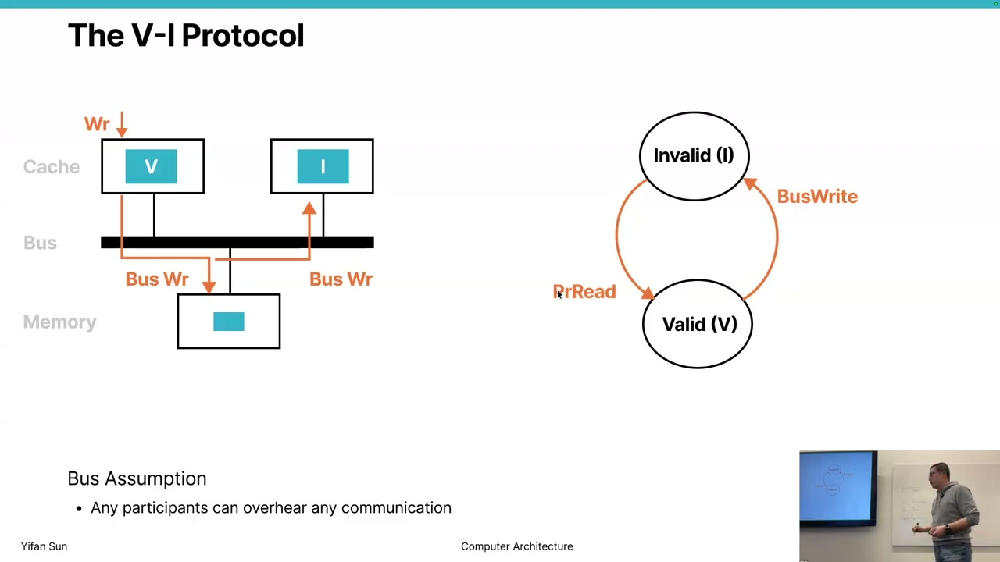

In a snooping design, all coherent caches monitor a totally ordered broadcast medium and react to relevant transactions. The ordering simplifies protocol reasoning and gives low latency in small systems. Its weakness is scalability: every request consumes shared bandwidth and is observed by every participant.

### Slide 12 — Directory-based protocols ([00:24:15](https://www.youtube.com/watch?v=OsUwN-PPspw&t=1455s))

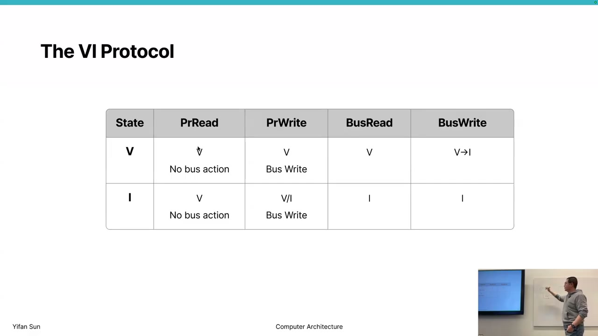

A directory records the owner or sharer set for each line. A requester contacts the line's home directory, which sends targeted invalidations or forwards the request to the current owner. This avoids broadcasting to unrelated caches and scales better across switched networks.

The tradeoff is extra metadata and protocol steps: directory lookup, messages to sharers, acknowledgments, and transient states while requests are outstanding.

### Slide 13 — Limits of VI ([00:27:45](https://www.youtube.com/watch?v=OsUwN-PPspw&t=1665s))

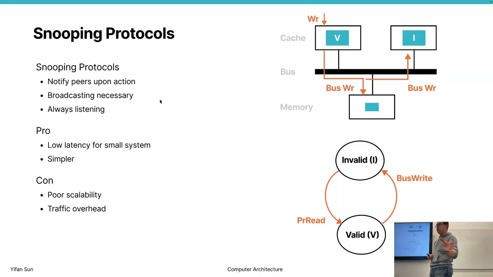

VI collapses all usable copies into V. It cannot tell whether memory is current, whether another cache shares the line, or whether this cache owns the only copy. Richer protocols split V into states that encode cleanliness and sharing, allowing common operations to avoid broadcasts or memory writes.

## MSI

### Slide 14 — MSI states ([00:30:45](https://www.youtube.com/watch?v=OsUwN-PPspw&t=1845s))

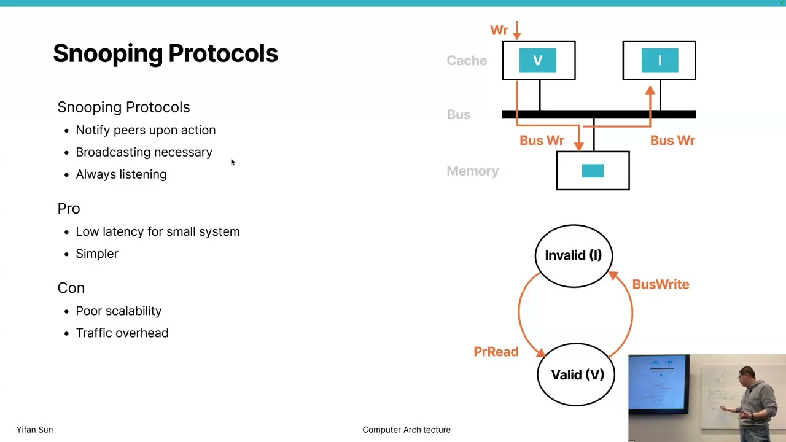

MSI defines:

| State | Meaning |
|---|---|
| I — Invalid | No usable copy |
| S — Shared | Clean copy; other caches may also hold it |
| M — Modified | Dirty, exclusive copy; memory may be stale |

At most one cache may hold M for a line, and if it does, every other cache must be I. Multiple S copies may coexist because they all represent the same clean value.

### Slide 15 — MSI read behavior ([00:33:15](https://www.youtube.com/watch?v=OsUwN-PPspw&t=1995s))

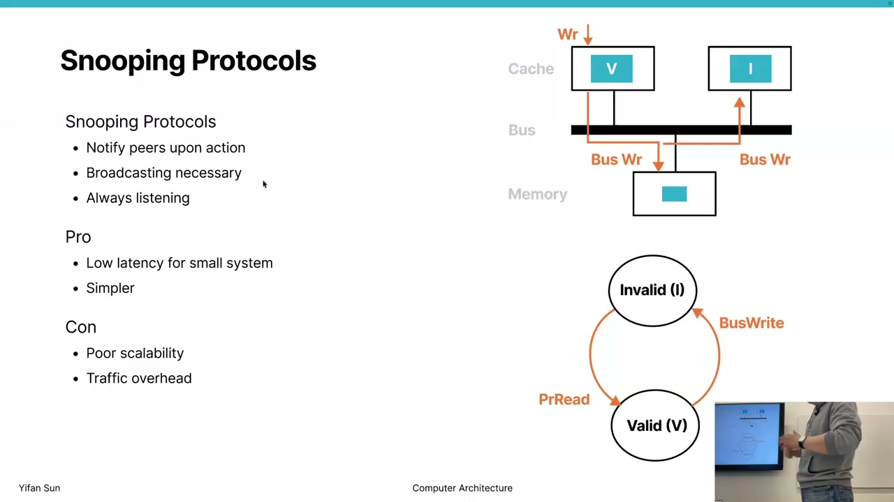

An I-state read issues `BusRd` and conservatively enters S. If another cache holds M, it must supply or write back the newest dirty data and downgrade to S. The requester and any previous sharers then hold the same readable value:

$$
I \xrightarrow{PrRd/BusRd} S, \qquad
M \xrightarrow{snoop\ BusRd} S.
$$

### Slide 16 — MSI writes and exclusive requests ([00:35:15](https://www.youtube.com/watch?v=OsUwN-PPspw&t=2115s))

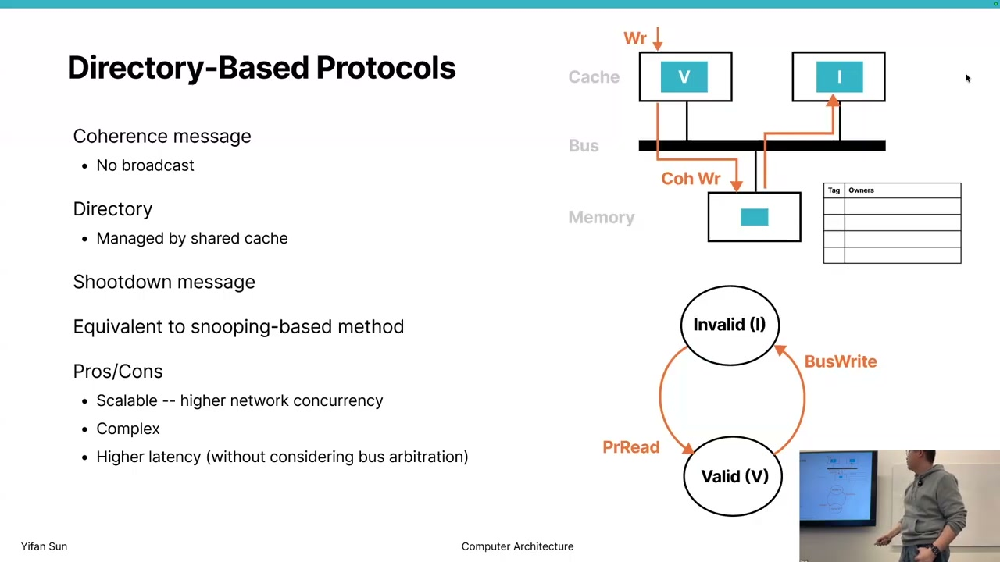

A write requires M ownership. From I, `BusRdX` obtains the line and invalidates all other copies. From S, an exclusive or upgrade transaction invalidates peers before the local state becomes M. Once in M, further reads and writes hit locally until an external request or eviction intervenes.

### Slide 17 — MSI complete state machine ([00:37:45](https://www.youtube.com/watch?v=OsUwN-PPspw&t=2265s))

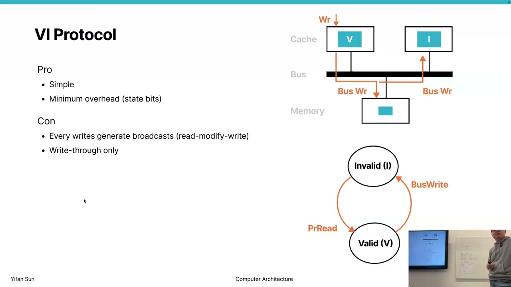

| Current | Event | Bus/data action | Next |
|---|---|---|---|
| I | `PrRd` | `BusRd`, receive data | S |
| I | `PrWr` | `BusRdX`, receive ownership/data | M |
| S | `PrRd` | None | S |
| S | `PrWr` | Upgrade/exclusive request | M |
| S | Snooped exclusive request | Invalidate | I |
| M | `PrRd` or `PrWr` | None | M |
| M | Snooped `BusRd` | Supply/write back newest data | S |
| M | Snooped `BusRdX` | Supply/write back and invalidate | I |

Writeback is required when a dirty M copy is displaced or ownership changes in a protocol that needs memory updated; cache-to-cache forwarding may satisfy the requester directly in other implementations.

## MESI

### Slide 18 — Why add Exclusive? ([00:40:45](https://www.youtube.com/watch?v=OsUwN-PPspw&t=2445s))

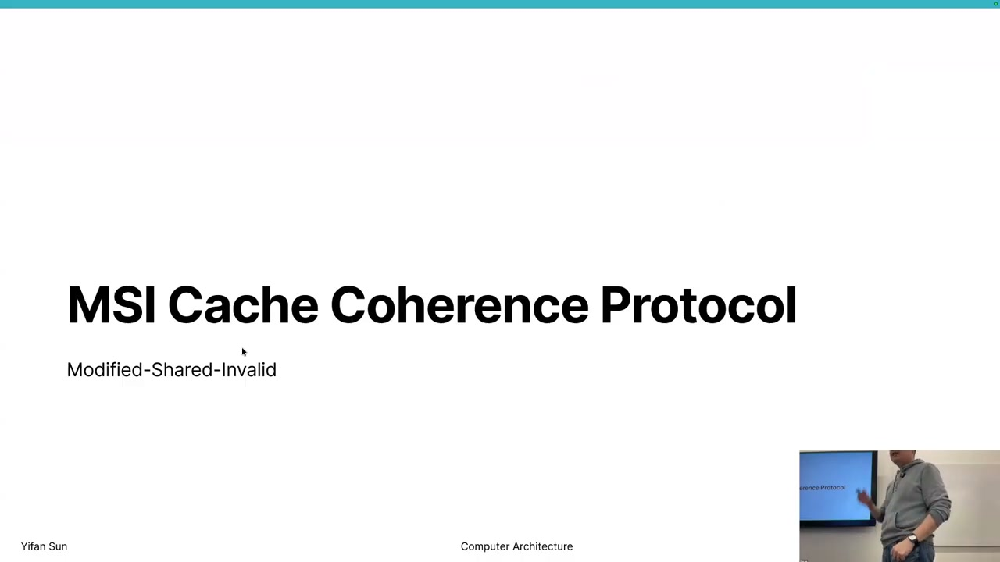

MSI represents clean-and-shared (S) and dirty-and-private (M), but not **clean-and-private**. Treating a sole clean copy as S means its first write unnecessarily sends an upgrade. MESI adds E to record that no other cache has a copy while memory remains current.

### Slide 19 — Entering Exclusive ([00:43:45](https://www.youtube.com/watch?v=OsUwN-PPspw&t=2625s))

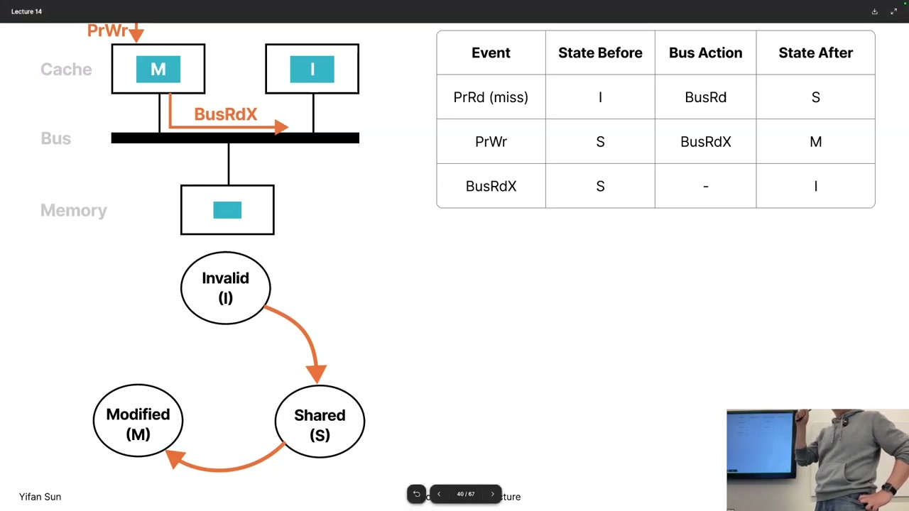

On an I-state read miss, the requester issues `BusRd`. A shared-response mechanism determines whether another cache holds the line. If none does, the requester enters E; otherwise it enters S:

$$
I \xrightarrow{PrRd/BusRd}
\begin{cases}
E, & \text{no other cached copy},\\
S, & \text{another copy exists}.
\end{cases}
$$

### Slide 20 — Another reader appears ([00:46:45](https://www.youtube.com/watch?v=OsUwN-PPspw&t=2805s))

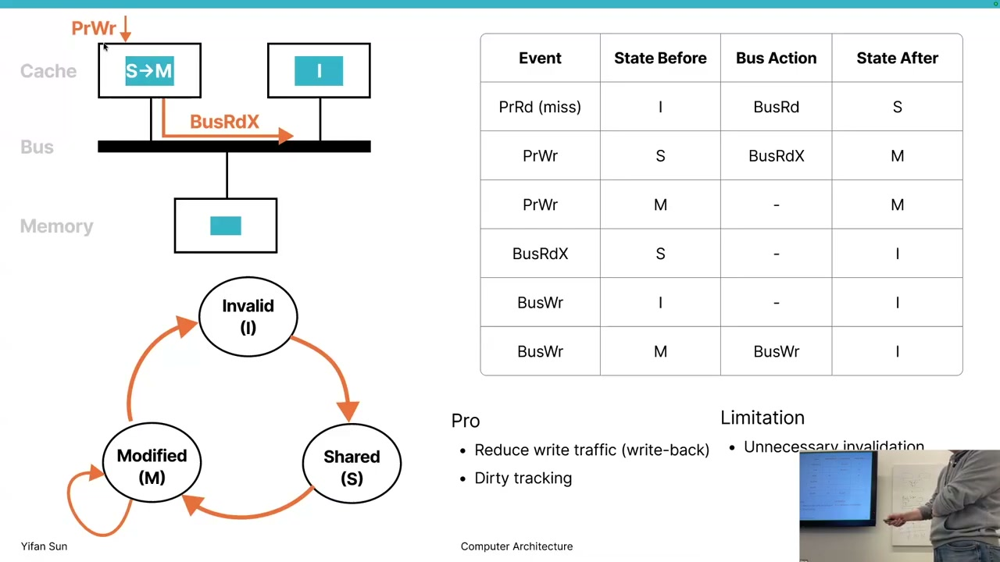

If a cache in E snoops another `BusRd`, the line is no longer private and it downgrades $E\rightarrow S$ without a dirty writeback. If it was M, the newest data must be supplied and the owner downgrades $M\rightarrow S$. Both cases end with multiple coherent readers.

### Slide 21 — Reactions to a snooped read ([00:49:15](https://www.youtube.com/watch?v=OsUwN-PPspw&t=2955s))

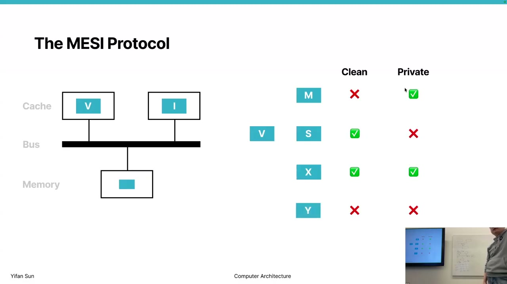

| Current state | Snooped `BusRd` | Next state |
|---|---|---|
| I | Ignore | I |
| S | Permit sharing | S |
| E | Indicate/share data | S |
| M | Supply newest dirty data; write back if required | S |

The important distinction is cleanliness: E can downgrade without restoring memory, while M owns a value newer than memory.

### Slide 22 — Write upgrade versus read-exclusive ([00:51:45](https://www.youtube.com/watch?v=OsUwN-PPspw&t=3105s))

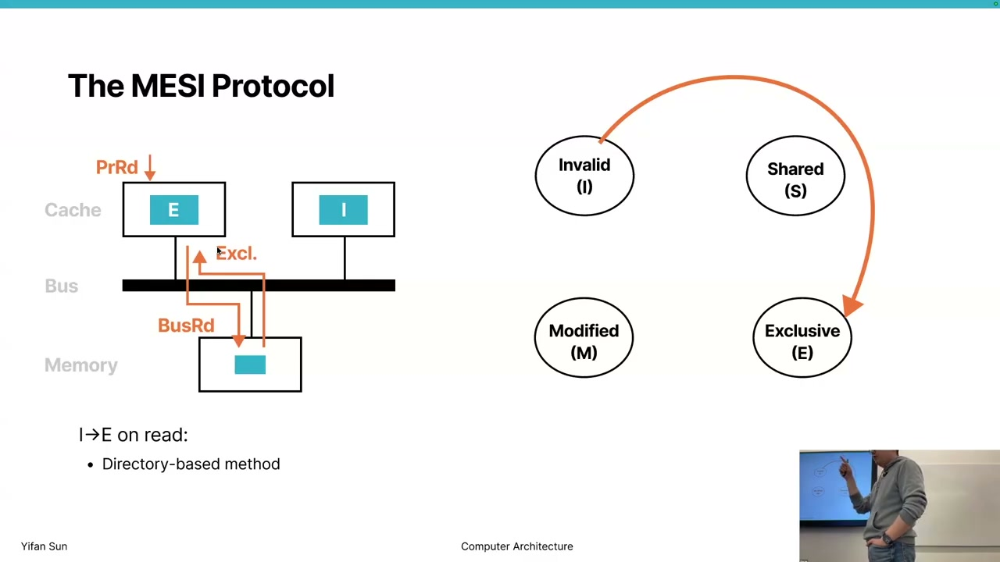

From S, the cache already has the data and needs only to invalidate other sharers, so it can issue `BusUpgr` and move to M. From I, it needs both data and ownership, so it issues `BusRdX`. From E, no other sharers exist, so a processor write silently changes $E\rightarrow M$ with no coherence transaction.

### Slide 23 — MESI full state machine ([00:54:45](https://www.youtube.com/watch?v=OsUwN-PPspw&t=3285s))

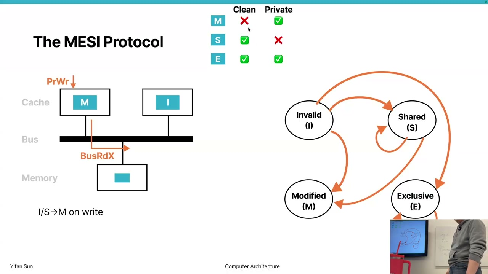

The four stable states encode two dimensions:

| State | Valid? | Dirty relative to memory? | Other cached copies? |
|---|---:|---:|---:|
| I | No | No | Irrelevant |
| S | Yes | No | Possibly |
| E | Yes | No | No |
| M | Yes | Yes | No |

Local reads hit in S, E, or M. Local writes hit silently in M and convert E to M silently; S needs an upgrade and I needs an exclusive fill. Snooped reads downgrade private states to S, while snooped exclusive requests invalidate S/E and force M to relinquish its dirty copy.

### Slide 24 — MESI walkthrough ([00:58:15](https://www.youtube.com/watch?v=OsUwN-PPspw&t=3495s))

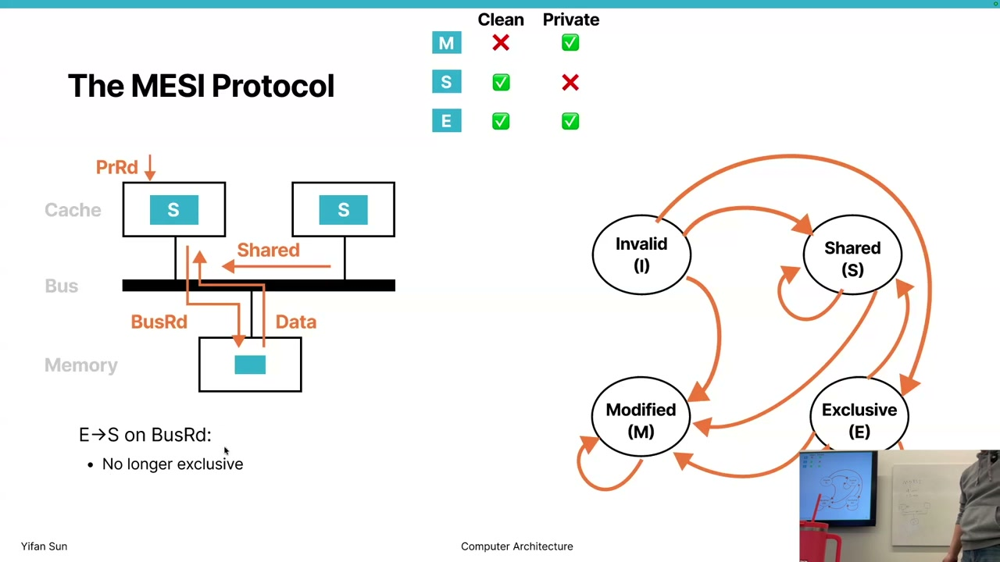

A representative sequence is:

1. Core 0 reads an uncached line: `BusRd`, no sharer, Core 0 enters E.
2. Core 1 reads it: Core 0 snoops `BusRd`; both end in S.
3. Core 0 writes: `BusUpgr` invalidates Core 1; Core 0 enters M.
4. Core 0 reads or writes again: local hit in M, no bus traffic.
5. Core 1 reads: `BusRd`; Core 0 supplies the newest value and downgrades M to S; both end in S.

The sequence demonstrates MESI's purpose: communicate only when sharing or ownership actually changes.

### Slide 25 — Protocol extensions and limits ([01:02:45](https://www.youtube.com/watch?v=OsUwN-PPspw&t=3765s))

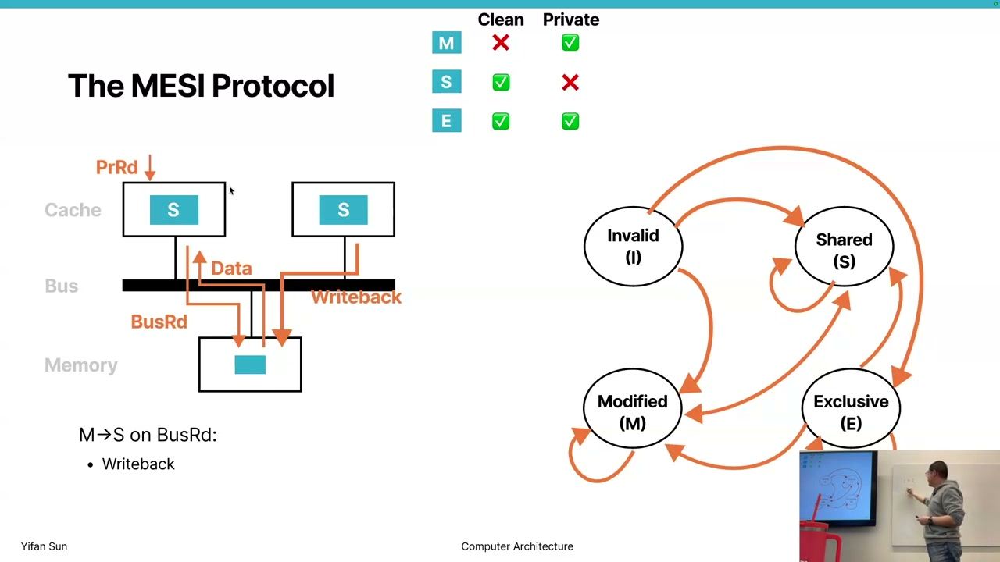

MESI reduces traffic compared with MSI, particularly for private data that moves $I\rightarrow E\rightarrow M$. It remains a stable-state abstraction; real implementations add transient states for outstanding requests, acknowledgments, races, and retries.

Other protocols add information for common cases. MOESI's Owned state permits dirty shared data with a designated responder, while MESIF's Forward state designates one clean sharer to respond. Large systems commonly combine MESI-family states with a directory so invalidations and forwards are targeted rather than broadcast.

## Protocol summaries

| Protocol | Stable states | Key benefit | Main limitation |
|---|---|---|---|
| VI | Valid, Invalid | Minimal metadata and logic | Cannot distinguish ownership or dirtiness |
| MSI | Modified, Shared, Invalid | Tracks dirty exclusive ownership | Sole clean reader still treated as shared |
| MESI | Modified, Exclusive, Shared, Invalid | Silent E-to-M write for private clean data | More states; broadcast snooping still scales poorly |

## Key takeaways

1. Coherence preserves SWMR and the latest visible value for each cache line.
2. Coherence and memory consistency are related but distinct: per-location value agreement versus cross-location ordering.
3. Cache-line granularity makes hardware practical but causes false sharing.
4. Snooping uses an ordered broadcast medium; directories track sharers and send targeted messages.
5. VI cannot distinguish clean, dirty, private, and shared valid copies.
6. In MSI, M means dirty and exclusive; S means clean and potentially shared.
7. `BusRd` requests readable data, while `BusRdX` requests data plus exclusive ownership.
8. A shared holder can use `BusUpgr` because it already has the data and needs only ownership.
9. Dirty M data must be supplied or written back before another cache can read or own the line.
10. MESI's E state records a clean private copy and enables a silent $E\rightarrow M$ write.
11. An external read downgrades E or M to S; an external exclusive request invalidates competing copies.
12. Stable-state diagrams omit transient states required by real concurrent implementations.
13. Directory protocols trade metadata and message latency for scalability.
14. MOESI and MESIF add responder/ownership information to reduce data and memory traffic.
15. Protocol quality depends on traffic, latency, storage, race handling, and scalability, not just state count.