# Virtual Memory and Address Translation

**Course:** CSCI 654 Advanced Computer Architecture, Spring 2026  
**Instructor:** Yifan Sun, William & Mary  
**Video:** [YouTube lecture](https://www.youtube.com/watch?v=IzTIZTiHlW4) (1:13:34)

These notes follow the lecture's substantive diagrams and completed address-translation examples. Explanations combine the original English captions with the visuals; terms are normalized to VPN, PFN, MMU, TLB, VIVT, VIPT, and PIPT.

## Why virtual addressing exists

### Slide 1 — Virtual addressing ([00:00:05](https://www.youtube.com/watch?v=IzTIZTiHlW4&t=5s))

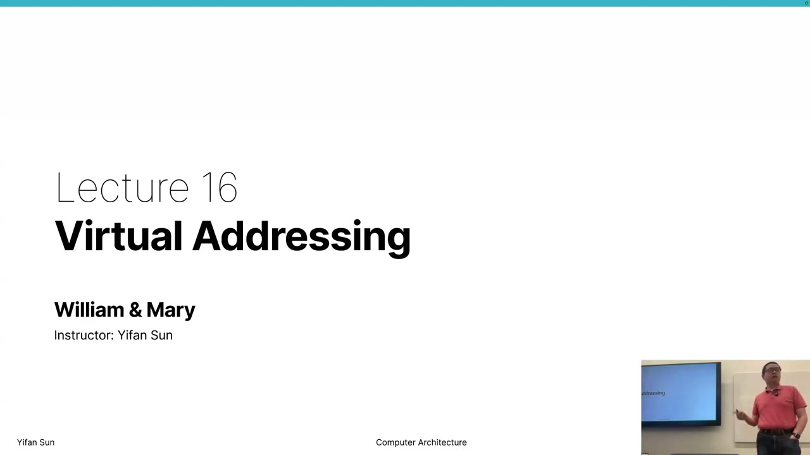

The lecture completes the memory-system unit by inserting address translation between a core and physical memory. Programs generate virtual addresses; the operating system and hardware map them to physical addresses while enforcing isolation, permissions, sharing, and demand paging.

### Slide 2 — Atlas and the memory-capacity problem ([00:01:10](https://www.youtube.com/watch?v=IzTIZTiHlW4&t=70s))

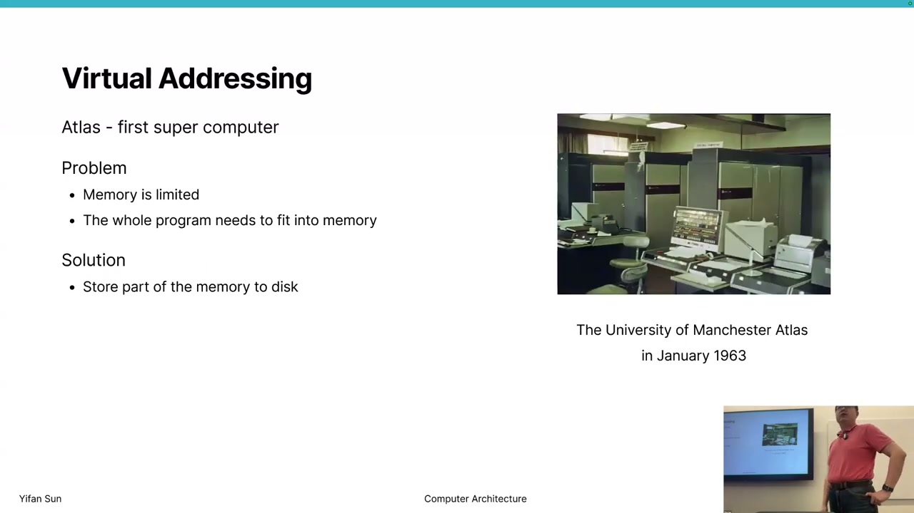

The Atlas computer is presented as an early virtual-memory system. The motivating problem is that a program's required address space may exceed available fast memory. Indirection lets only the active portion reside in RAM while inactive pages live on secondary storage, allowing execution to continue at the cost of page-fault latency.

### Slide 3 — Per-process virtual address spaces ([00:03:10](https://www.youtube.com/watch?v=IzTIZTiHlW4&t=190s))

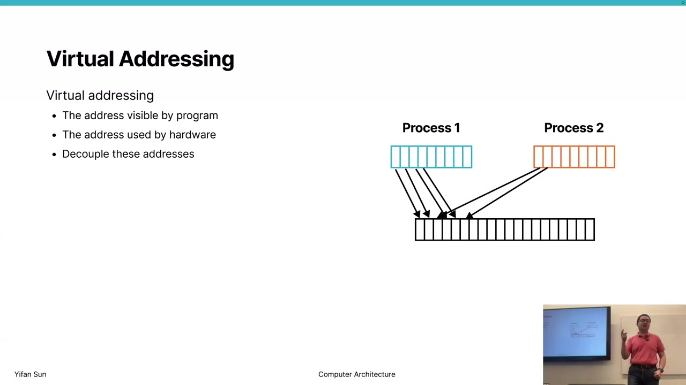

Each process sees its own virtual address space. The same virtual address in Process 1 and Process 2 can map to different physical frames, preventing one process from directly naming another process's memory. Conversely, the OS can deliberately map two virtual pages to one physical frame for controlled sharing.

Virtual addressing therefore decouples names used by software from locations implemented by memory hardware.

### Slide 4 — Benefits of address indirection ([00:09:40](https://www.youtube.com/watch?v=IzTIZTiHlW4&t=580s))

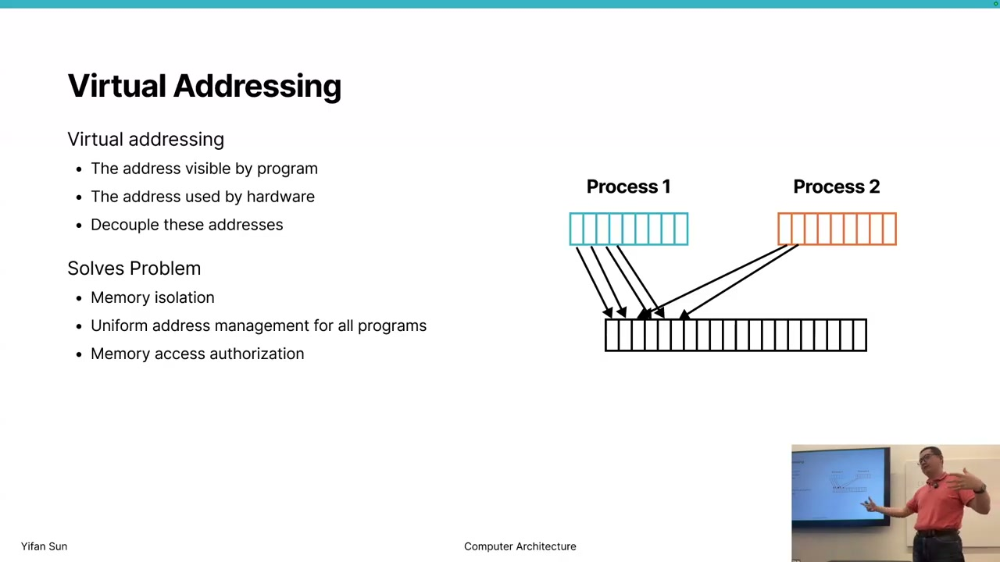

The main benefits are:

1. **Isolation:** processes cannot normally access each other's frames.
2. **Uniform layout:** programs can use conventional code, heap, library, and stack locations independent of physical placement.
3. **Flexible allocation:** physical frames need not be contiguous even when virtual pages are.
4. **Controlled sharing:** multiple mappings can grant selected processes access to common pages.
5. **Capacity virtualization:** pages can move between RAM and storage.

### Slide 5 — Pages and the address translator ([00:11:40](https://www.youtube.com/watch?v=IzTIZTiHlW4&t=700s))

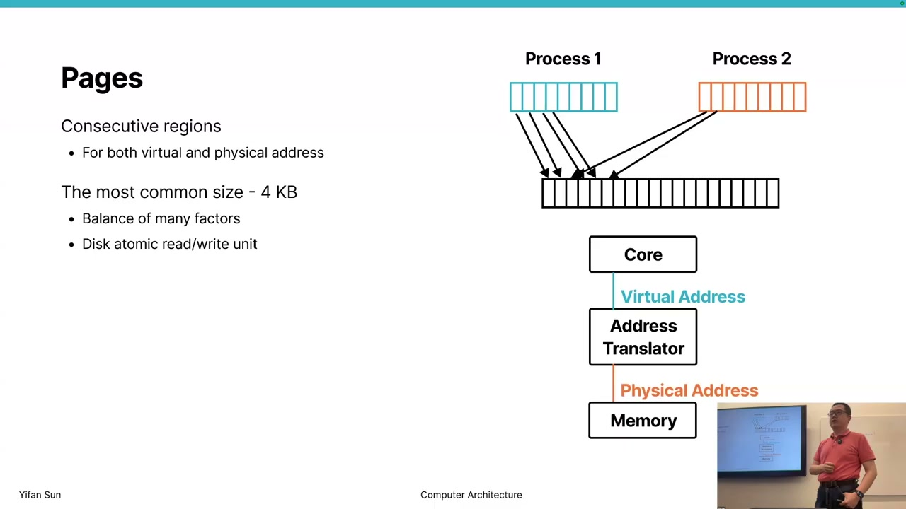

Translation is performed at page granularity rather than byte by byte. A virtual address is split into a virtual page number and an offset:

$$
VA = VPN \;|\; PageOffset.
$$

The translator replaces the VPN with a physical frame number while preserving the offset:

$$
PA = PFN \;|\; PageOffset.
$$

Because pages and frames have the same size and alignment, no arithmetic translation is needed for the low offset bits.

### Slide 6 — Page size and consecutive regions ([00:15:00](https://www.youtube.com/watch?v=IzTIZTiHlW4&t=900s))

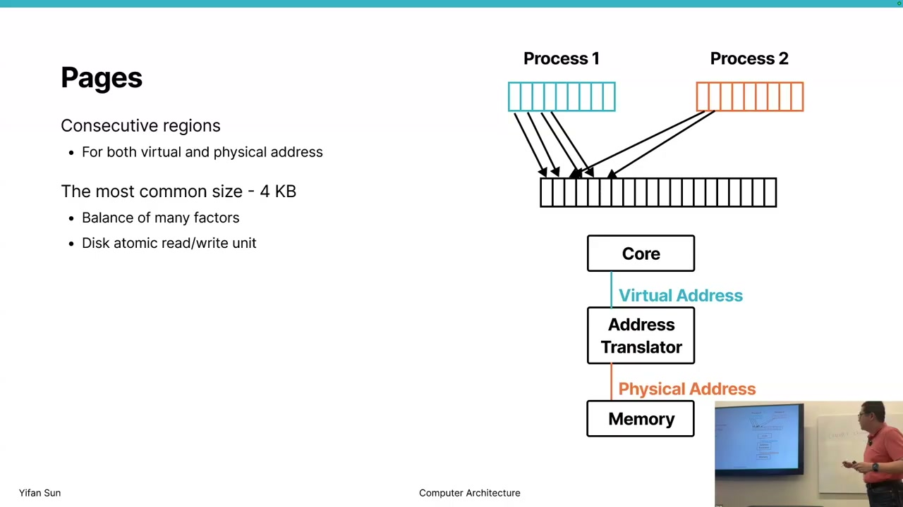

For a 4 KiB page,

$$
PageBytes=4096=2^{12},
$$

so the low 12 address bits are the page offset. Larger pages reduce translation entries and expand TLB reach, but increase internal fragmentation and the amount of data moved or allocated per fault. Modern systems often support multiple page sizes, including huge pages.

### Slide 7 — Process memory in the operating system ([00:17:00](https://www.youtube.com/watch?v=IzTIZTiHlW4&t=1020s))

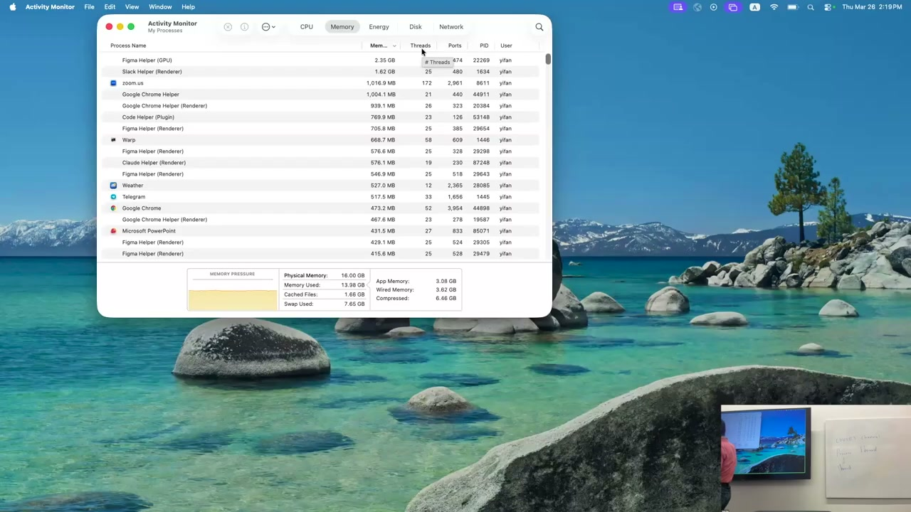

The operating-system demonstration shows that processes have independent memory accounting and mappings. A process is an isolation and resource-management unit containing one or more threads. Threads of one process normally share its virtual address space, whereas different processes receive distinct address-space contexts.

### Slide 8 — Address spaces and context ([00:19:00](https://www.youtube.com/watch?v=IzTIZTiHlW4&t=1140s))

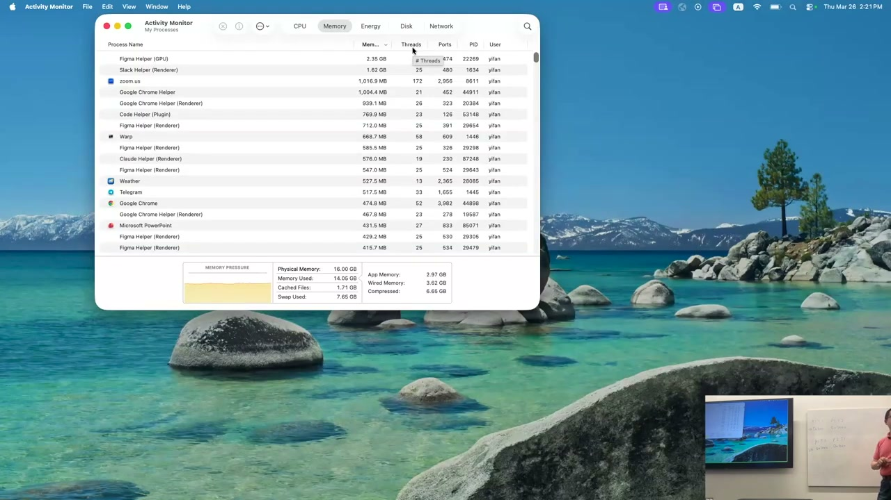

A context switch between threads in different processes changes the active translation context. Hardware or the OS must ensure cached translations and virtually tagged cache entries are not confused across processes. An address-space identifier (ASID), process-context identifier, or flushing can separate otherwise identical virtual addresses.

## Allocation and page tables

### Slide 9 — Allocation mechanism ([00:21:00](https://www.youtube.com/watch?v=IzTIZTiHlW4&t=1260s))

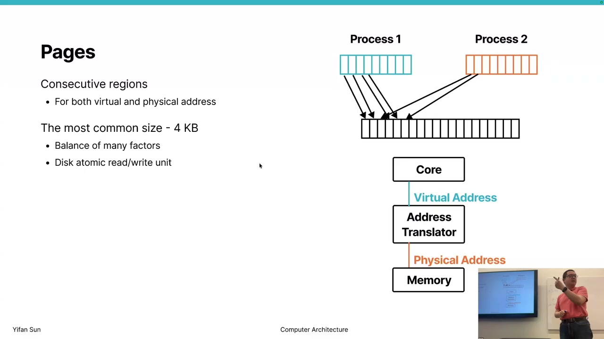

User-level `malloc` or `new` obtains storage from a runtime allocator. When that allocator needs more virtual address space, it requests mappings from the operating system through facilities such as `mmap`. Reserving virtual space does not necessarily allocate physical frames immediately; demand paging can defer physical allocation until first access.

### Slide 10 — Virtual allocation and physical pages ([00:23:00](https://www.youtube.com/watch?v=IzTIZTiHlW4&t=1380s))

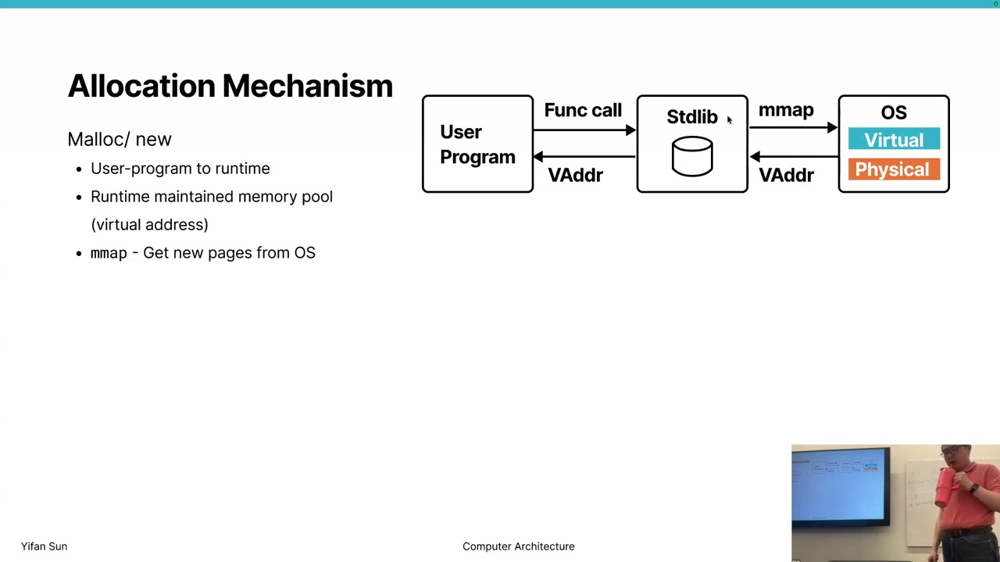

The program receives contiguous virtual pages, but the OS may map them to arbitrary free physical frames. The heap typically grows upward and the stack downward in the virtual layout. Sparse virtual regions need no physical backing until they are committed or touched.

### Slide 11 — Page-table entries ([00:25:00](https://www.youtube.com/watch?v=IzTIZTiHlW4&t=1500s))

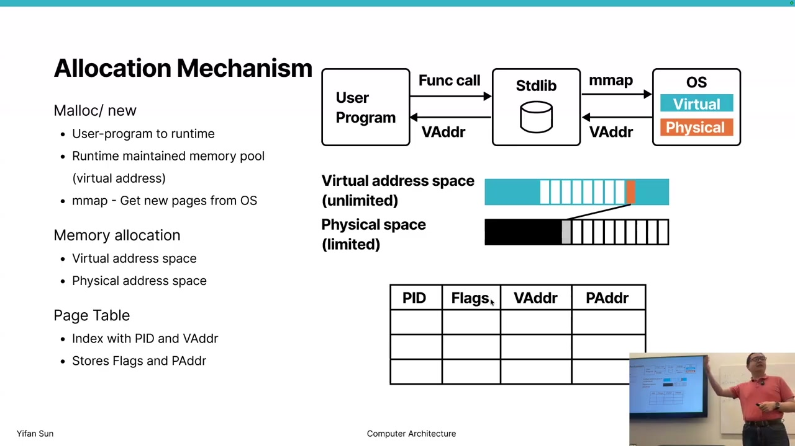

A page-table entry (PTE) associates a VPN with a PFN and metadata. Common fields include valid/present, readable, writable, executable, user/supervisor, accessed, and dirty bits. The process identity is usually represented by selecting a per-process page-table root rather than storing the PID in every conventional PTE.

For a 48-bit physical address and 4 KiB pages, the frame-number portion is

$$
PFNBits=48-12=36.
$$

### Slide 12 — Translation during execution ([00:28:00](https://www.youtube.com/watch?v=IzTIZTiHlW4&t=1680s))

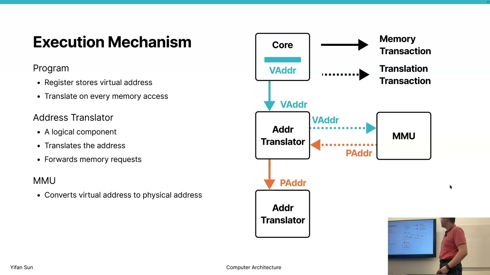

A load or store computes a virtual address. The translation hardware looks up the VPN, checks permissions, obtains the PFN, concatenates the unchanged offset, and sends the physical address into the memory hierarchy. Translation is logically required for every instruction fetch and data access, so its common path must be heavily cached.

### Slide 13 — Memory management unit ([00:30:30](https://www.youtube.com/watch?v=IzTIZTiHlW4&t=1830s))

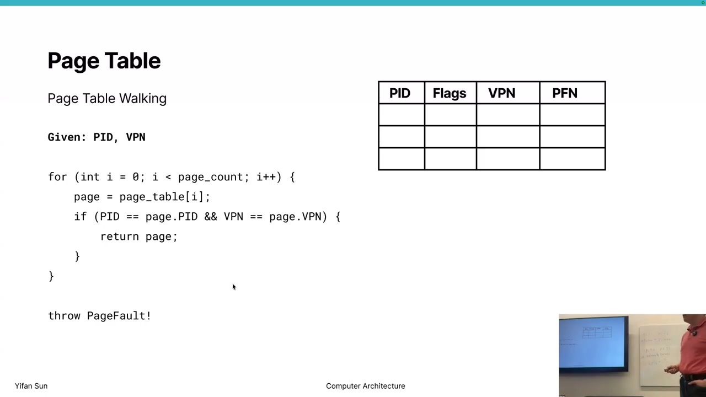

The **memory management unit (MMU)** performs or coordinates translation and permission checks. On a cached translation hit, it quickly produces the physical address. On a miss, a hardware page-table walker or privileged software reads page-table entries from memory. Invalid, absent, or forbidden mappings raise a page fault or protection fault for the OS.

### Slide 14 — Flat page-table lookup ([00:33:00](https://www.youtube.com/watch?v=IzTIZTiHlW4&t=1980s))

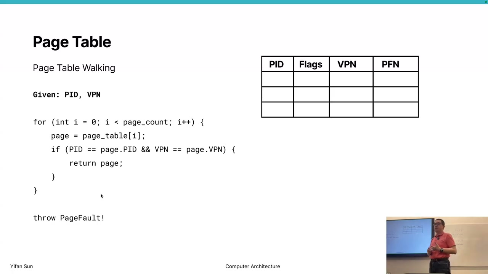

A linear search through `(VPN, PFN)` records would be far too slow. A flat page table instead uses the VPN as an array index:

$$
PTEAddress=PageTableBase+VPN\times PTEBytes.
$$

This gives constant-time indexing but allocates an entry for every possible VPN, including unused virtual regions.

### Slide 15 — Flat-table memory cost ([00:36:00](https://www.youtube.com/watch?v=IzTIZTiHlW4&t=2160s))

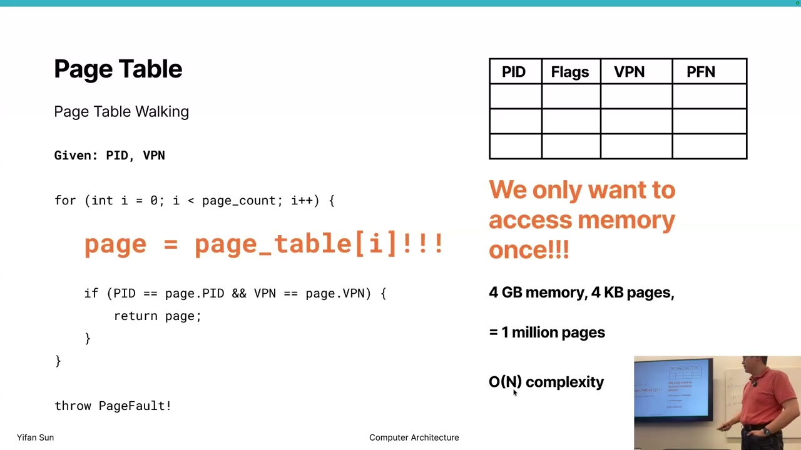

A 32-bit virtual space with 4 KiB pages contains

$$
\frac{2^{32}}{2^{12}}=2^{20}=1,048,576
$$

virtual pages. At 4–8 bytes per PTE, one fully populated flat table costs roughly 4–8 MiB per process. Extending the same idea to a broad 64-bit virtual space is infeasible because most potential entries would describe unused addresses.

### Slide 16 — Per-process roots and sparse mappings ([00:39:00](https://www.youtube.com/watch?v=IzTIZTiHlW4&t=2340s))

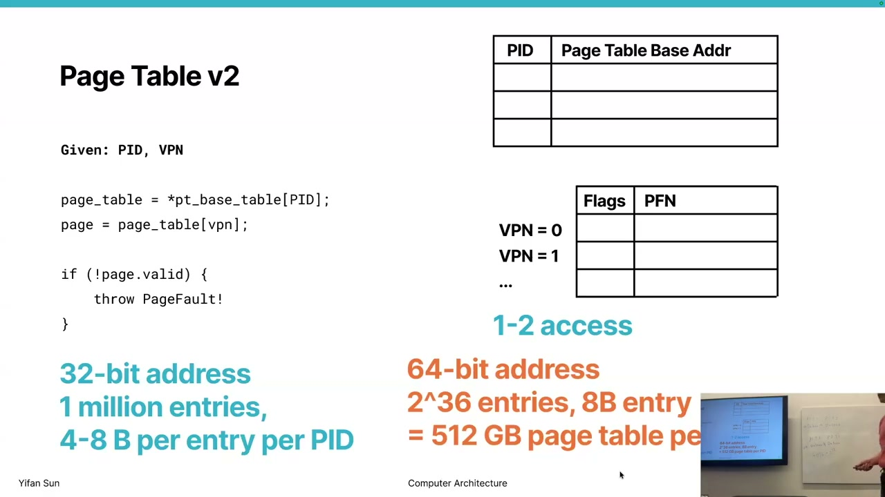

Each process has a page-table root selected by a privileged register. The OS changes that root during a process switch. Sparse mappings motivate allocating translation structures only for populated virtual regions, rather than reserving a monolithic array for the entire space.

### Slide 17 — Multi-level page-table motivation ([00:42:00](https://www.youtube.com/watch?v=IzTIZTiHlW4&t=2520s))

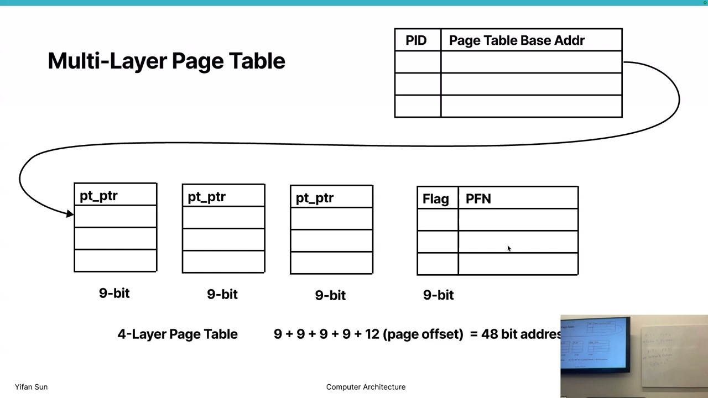

A hierarchical page table divides the VPN into several indices. Upper-level entries point to lower-level tables, and absent upper entries compactly represent large unmapped regions. Only branches needed by actual mappings consume memory.

The cost is a page walk containing several dependent memory reads on a translation-cache miss.

### Slide 18 — Multi-layer address split ([00:45:00](https://www.youtube.com/watch?v=IzTIZTiHlW4&t=2700s))

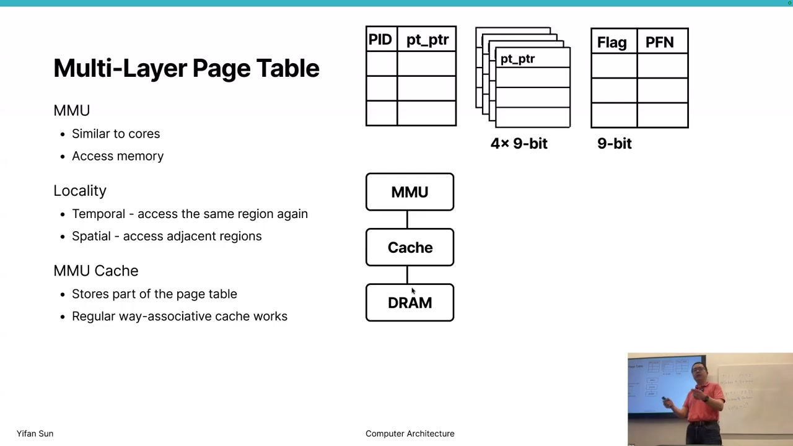

The virtual address is divided into page-table indices and a page offset. A typical 64-bit ISA implementation uses only a canonical subset of address bits; each level indexes a page-sized table, and the final leaf PTE supplies the PFN and permissions.

Conceptually:

$$
VA=VPN_{L_n}|\cdots|VPN_{L_1}|Offset.
$$

Each walk step reads one entry and obtains the base address of the next level.

## MMU caches and TLBs

### Slide 19 — Page-walk latency and MMU cache ([00:48:00](https://www.youtube.com/watch?v=IzTIZTiHlW4&t=2880s))

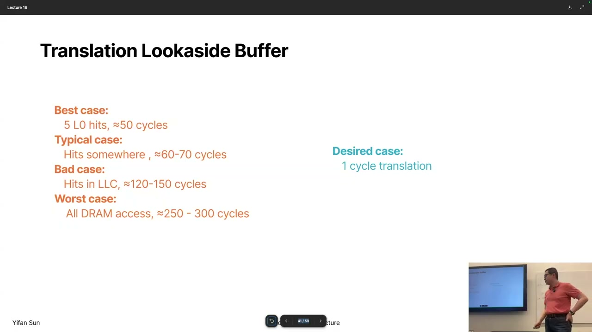

A multi-level walk can require several serial memory accesses before the requested data access even begins. Small page-walk or MMU caches retain upper-level entries so repeated translations in the same virtual region skip early levels. Ordinary data caches may also serve page-table reads, further reducing walk cost.

### Slide 20 — Translation lookaside buffer ([00:51:00](https://www.youtube.com/watch?v=IzTIZTiHlW4&t=3060s))

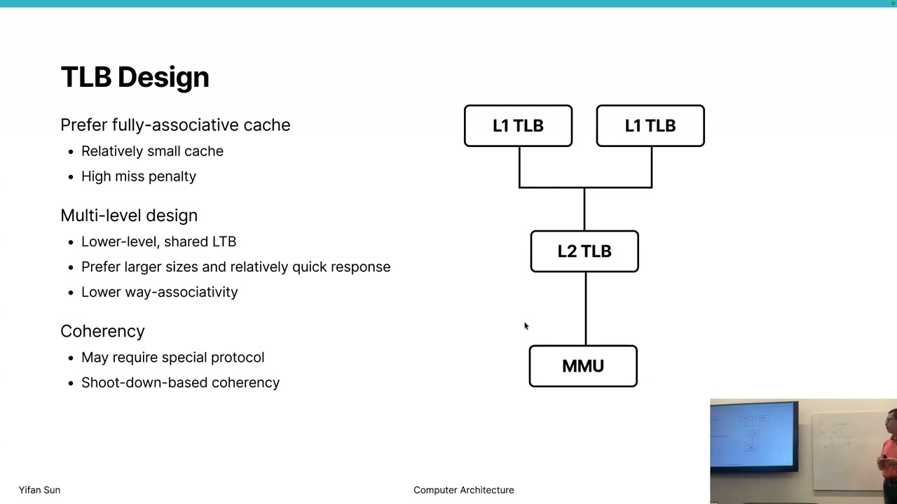

A **translation lookaside buffer (TLB)** caches complete VPN-to-PFN translations and permission bits. On a TLB hit, translation avoids the page walk. On a miss, the walker finds the PTE and fills the TLB; if the PTE is absent or invalid, the processor faults to the OS.

TLB reach is

$$
TLBReach=Entries\times PageBytes,
$$

so larger pages cover more memory with the same entry count.

### Slide 21 — TLB associative lookup ([00:54:00](https://www.youtube.com/watch?v=IzTIZTiHlW4&t=3240s))

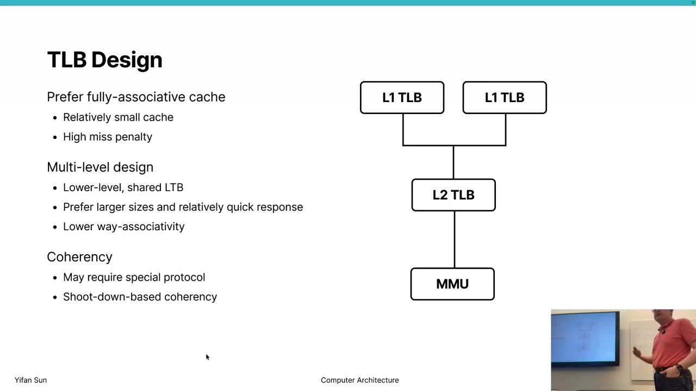

Because a TLB miss is expensive, small L1 TLBs are highly associative and compare a VPN against multiple entries in parallel. A matching valid entry returns the PFN and flags. ASIDs can be included in the match so translations from multiple processes coexist safely without flushing on every context switch.

### Slide 22 — Multi-level TLB design ([00:57:30](https://www.youtube.com/watch?v=IzTIZTiHlW4&t=3450s))

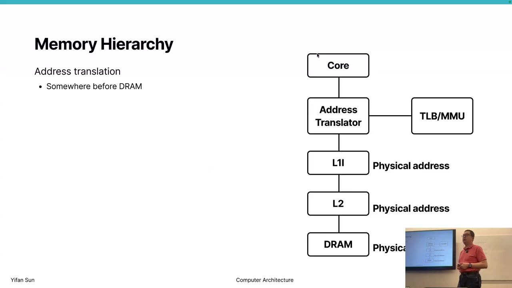

Processors often have separate L1 instruction and data TLBs backed by a larger shared L2 TLB. L1 prioritizes latency; L2 prioritizes reach. When the OS changes a mapping, stale translations must be invalidated, locally or on other cores through **TLB shootdowns**. Page-table and TLB coherence is therefore an explicit OS/hardware protocol.

## Virtual and physical cache addresses

### Slide 23 — Where translation sits relative to cache ([01:01:00](https://www.youtube.com/watch?v=IzTIZTiHlW4&t=3660s))

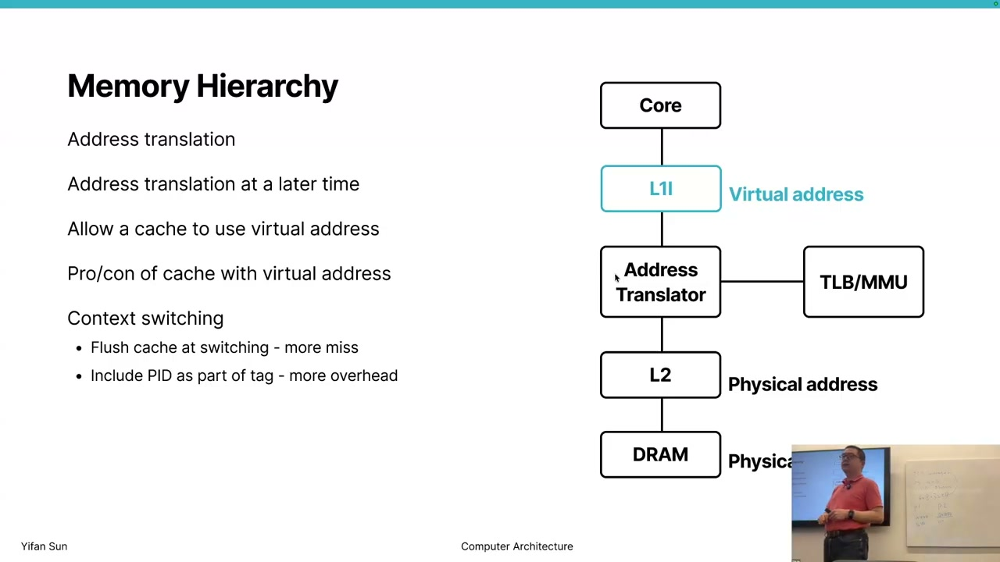

A cache lookup needs a set index and a tag. Those fields may come from virtual or physical addresses:

| Organization | Index | Tag | Main property |
|---|---|---|---|
| VIVT | Virtual | Virtual | Lookup before translation, but context/alias complexity |
| VIPT | Virtual | Physical | Cache-array read overlaps TLB lookup |
| PIPT | Physical | Physical | Simple identity/coherence, but translation precedes lookup |

### Slide 24 — VIVT, VIPT, and PIPT ([01:05:00](https://www.youtube.com/watch?v=IzTIZTiHlW4&t=3900s))

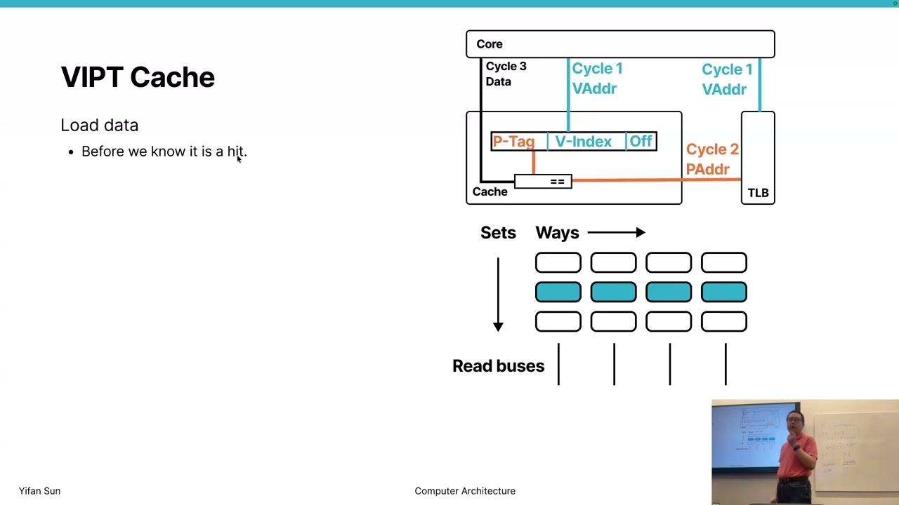

**VIVT** accesses and tags entirely by virtual address. It is fast, but equal virtual addresses in different processes can name different physical data, a **homonym** problem. Flushing on context switches or tagging entries with an ASID prevents cross-process false hits. Multiple virtual aliases for one physical line are **synonyms** and can create duplicate inconsistent entries.

**PIPT** translates first, then indexes and compares physical tags. It naturally identifies physical memory and is common for larger L2/L3 caches, but TLB time lies before cache-array access.

**VIPT** uses untranslated page-offset bits to select a set while the TLB simultaneously produces the physical tag. It then compares that tag against all ways read from the selected set, overlapping translation and cache-array latency.

### Slide 25 — VIPT constraint and tradeoff ([01:09:00](https://www.youtube.com/watch?v=IzTIZTiHlW4&t=4140s))

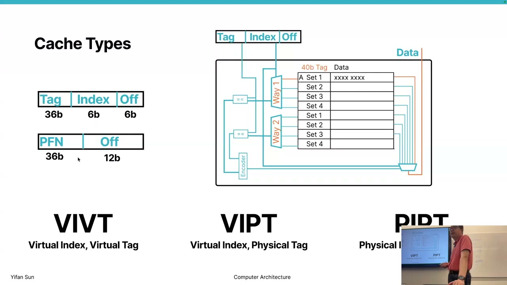

Virtual and physical addresses have identical page-offset bits. To ensure every synonym selects the same set, all set-index and line-offset bits must fit inside the page offset:

$$
IndexBits+LineOffsetBits\leq PageOffsetBits.
$$

Equivalently, for a $W$-way cache,

$$
CacheCapacity\leq PageBytes\times Ways.
$$

With 4 KiB pages, 64-byte lines, and 64 sets, the six line-offset bits plus six index bits exactly fill the 12-bit page offset. A larger number of sets would consume translated VPN/PFN bits and reintroduce synonym placement problems unless the design uses larger pages, more ways, page coloring, or a physical index.

VIPT is therefore attractive for latency-critical L1 caches, while physically indexed/tagged organizations dominate larger lower levels.

## Key formulas and takeaways

1. $VA=VPN|PageOffset$ and $PA=PFN|PageOffset$.
2. $PageOffsetBits=\log_2(PageBytes)$; 4 KiB pages use 12 bits.
3. A 48-bit physical address with 4 KiB pages has a 36-bit PFN.
4. Per-process mappings provide isolation while deliberate shared mappings enable IPC.
5. Virtual allocation can be sparse and need not immediately consume physical frames.
6. A PTE stores a PFN plus validity, permission, accessed, dirty, and related metadata.
7. Flat lookup uses $PTEAddress=Base+VPN\times PTEBytes$.
8. A 32-bit, 4 KiB-page space has $2^{20}$ virtual pages.
9. Multi-level tables allocate translation structures only for populated regions.
10. A TLB caches complete translations; a page-walk cache caches intermediate entries.
11. $TLBReach=Entries\times PageBytes$.
12. TLB misses trigger page walks; absent or forbidden mappings trigger faults.
13. ASIDs distinguish equal virtual addresses belonging to different processes.
14. TLB shootdowns remove stale mappings after OS page-table updates.
15. VIVT is fast but must handle homonyms and synonyms.
16. PIPT avoids virtual alias identity problems but serializes translation before lookup.
17. VIPT overlaps TLB and cache-array access using unchanged page-offset bits.
18. VIPT requires $IndexBits+LineOffsetBits\leq PageOffsetBits$.
19. For VIPT, $CacheCapacity\leq PageBytes\times Ways$.