# Cache Design with MSHR and Write Policies

**Course:** CSCI 654 Advanced Computer Architecture, Spring 2026  
**Instructor:** Yifan Sun, William & Mary  
**Video:** [YouTube lecture](https://www.youtube.com/watch?v=CZkU5W9aKlk) (1:12:54)

These notes follow the lecture's substantive diagrams and completed transaction flows. Explanations combine the original English captions with the visuals; terms are normalized to MSHR, ready/valid handshake, miss merging, write-through, write-around, and write-back.

## Cache organization review

### Slide 1 — Memory and cache ([00:00:05](https://www.youtube.com/watch?v=CZkU5W9aKlk&t=5s))

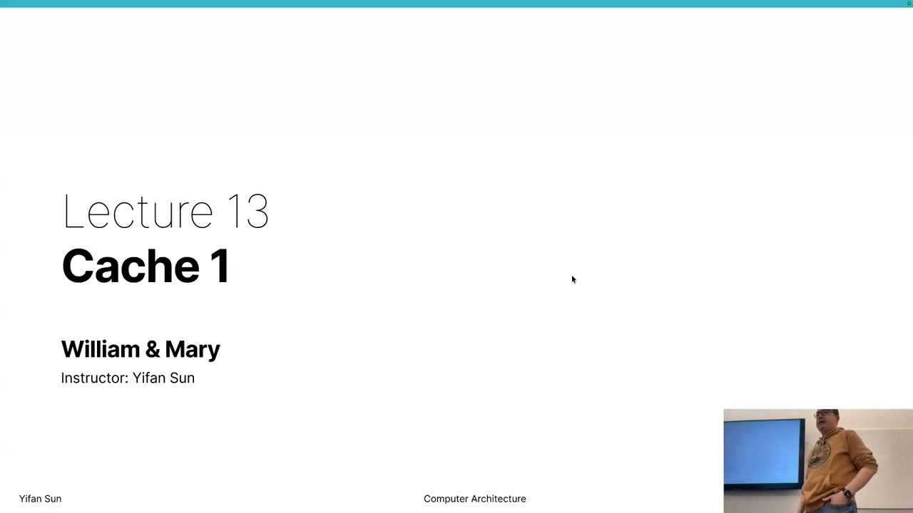

A cache keeps a small, fast subset of data from a larger, slower memory. It must preserve the architectural illusion that loads and stores access one coherent memory while reducing average latency. This lecture extends the basic cache with machinery for concurrent misses and then compares policies for propagating writes.

### Slide 2 — Tag lookup ([00:01:05](https://www.youtube.com/watch?v=CZkU5W9aKlk&t=65s))

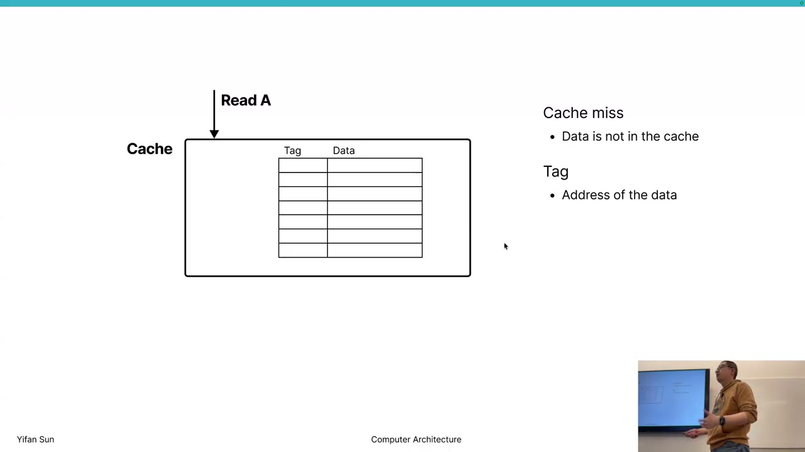

An address is divided into tag, set index, and line offset. The index selects a set, parallel comparators test the request tag against each valid way, and a matching way supplies data. No valid match is a miss.

$$
CacheCapacity=Sets\times Ways\times LineBytes.
$$

### Slide 3 — Associativity recap ([00:04:05](https://www.youtube.com/watch?v=CZkU5W9aKlk&t=245s))

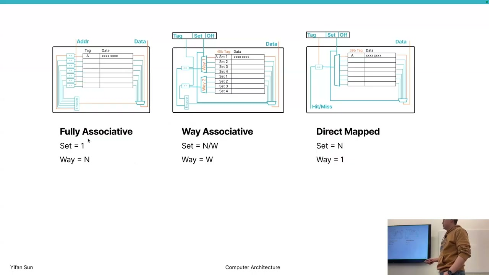

Direct mapping uses one candidate and one tag comparison, but conflicting lines repeatedly evict one another. Set associativity compares several ways and gives each line several possible locations. Full associativity permits any entry but scales comparator and selection cost with total entry count. Associativity therefore exchanges area, power, and hit latency for fewer conflict misses.

### Slide 4 — Miss, victim, and replacement ([00:06:05](https://www.youtube.com/watch?v=CZkU5W9aKlk&t=365s))

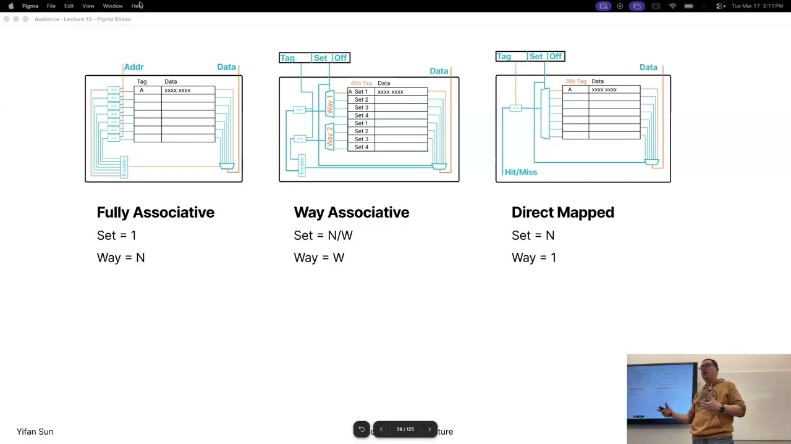

On a miss, the cache requests the containing line from the next level. If the selected set has no invalid way, a replacement policy chooses a victim. A clean victim can be discarded; a dirty victim in a write-back cache must be preserved through a writeback before its storage is reused.

## Nonblocking caches and MSHRs

### Slide 5 — Missing Status Holding Registers ([00:06:45](https://www.youtube.com/watch?v=CZkU5W9aKlk&t=405s))

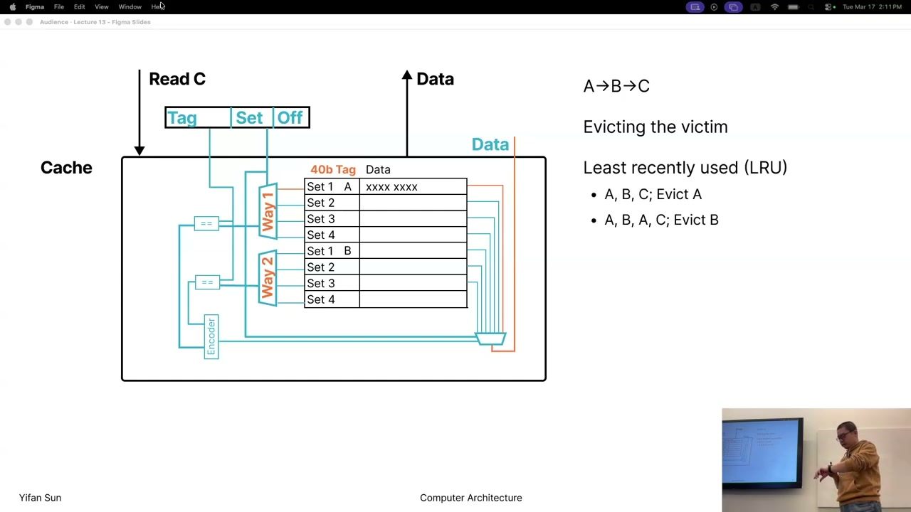

A blocking cache retains all miss context in its request path and refuses new work until the lower level responds. A **Missing Status Holding Register (MSHR)** moves that context into a dedicated entry. The cache can then accept unrelated requests while the miss remains outstanding.

### Slide 6 — Cache request interface ([00:08:05](https://www.youtube.com/watch?v=CZkU5W9aKlk&t=485s))

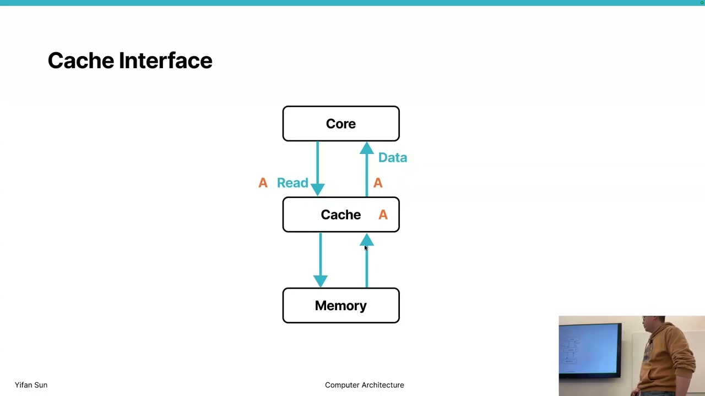

The interface carries an address, operation/data, and flow-control signals. In a decoupled ready/valid convention, a request transfers on a cycle when both sides assert their signals:

$$
RequestAccepted=Valid\land Ready.
$$

If `Ready` is low, the requester retains the same request. A separate response channel may return data much later and normally includes an ID or ordering context.

### Slide 7 — Why request B waits in a blocking cache ([00:12:05](https://www.youtube.com/watch?v=CZkU5W9aKlk&t=725s))

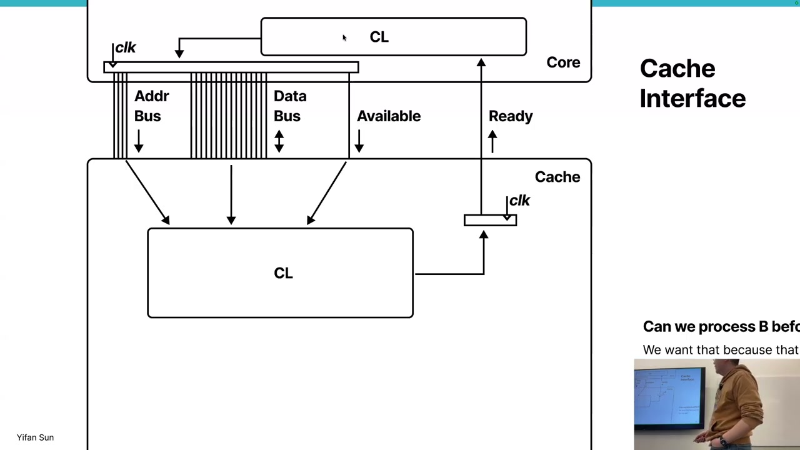

Request A misses and occupies the only transaction state while memory is accessed. Even if request B would hit, the cache cannot overwrite A's address and control state, so it holds `Ready` low. Hundreds of otherwise usable cache cycles can be lost behind one long miss.

### Slide 8 — Process new transactions while waiting ([00:16:05](https://www.youtube.com/watch?v=CZkU5W9aKlk&t=965s))

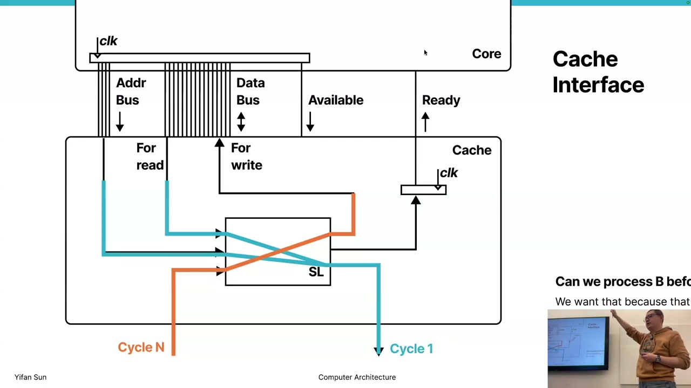

The cache datapath is mostly idle after sending a lower-level request. Capturing A in an MSHR frees the front end to process B. Serving a cache hit while another line is missing is **hit under miss**; launching another independent miss is **miss under miss**. Both forms increase memory-level parallelism.

### Slide 9 — Cache lookup and control paths ([00:19:25](https://www.youtube.com/watch?v=CZkU5W9aKlk&t=1165s))

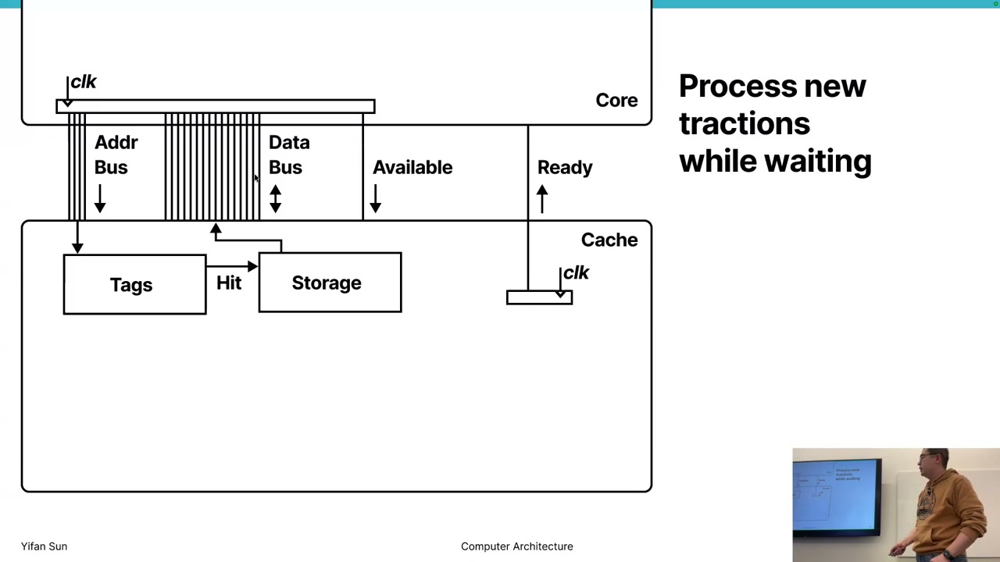

The cache separates tag storage, data storage, and control logic. A fast hit path selects a matching way and returns bytes to the core. A miss path records the request, selects a destination or victim, and sends work downward. These paths must arbitrate shared arrays and response ports when activity overlaps.

### Slide 10 — Miss request and fill return paths ([00:21:25](https://www.youtube.com/watch?v=CZkU5W9aKlk&t=1285s))

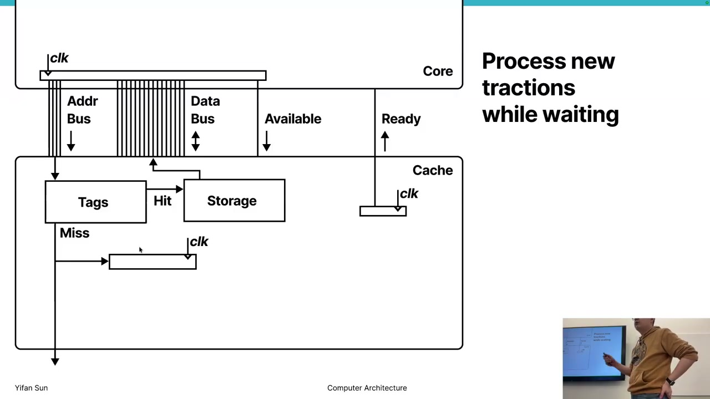

The miss path sends a line-aligned request to the next level. The return path uses transaction metadata to identify the matching MSHR, install the line in the chosen set/way, extract requested words, and deliver responses to waiting consumers. Fills can race with new lookups, so arbitration and transient line state are required.

### Slide 11 — Allocate an MSHR on a miss ([00:24:25](https://www.youtube.com/watch?v=CZkU5W9aKlk&t=1465s))

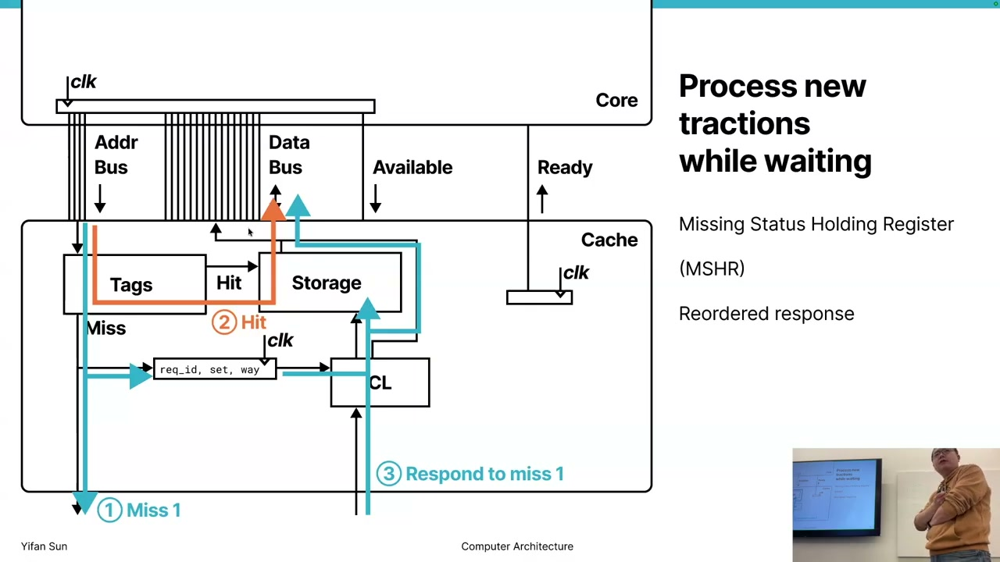

A new line miss reserves an entry containing enough information to finish later. Typical fields include:

| Field | Purpose |
|---|---|
| Line address | Match the returning fill and same-line requests |
| Set/way or victim state | Identify installation resources |
| Request type and byte mask | Complete load/store semantics |
| Requester or transaction IDs | Route responses |
| Waiter list | Represent merged consumers |
| State bits | Track request, fill, replay, or writeback progress |

Once the entry and lower-level queue accept the transaction, the request interface can become ready again.

### Slide 12 — Reordered completions ([00:27:25](https://www.youtube.com/watch?v=CZkU5W9aKlk&t=1645s))

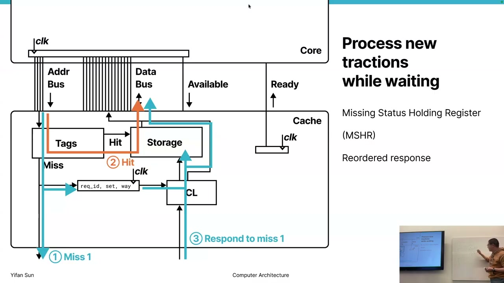

A younger hit can finish before an older miss, and independent misses can return in a different order from issue. IDs associate each response with the proper load/store or instruction. An out-of-order core records completion in its reorder/load-store structures and retires architectural effects in order; a simpler requester may require the cache or an adapter to preserve response order.

### Slide 13 — Multiple outstanding misses ([00:31:25](https://www.youtube.com/watch?v=CZkU5W9aKlk&t=1885s))

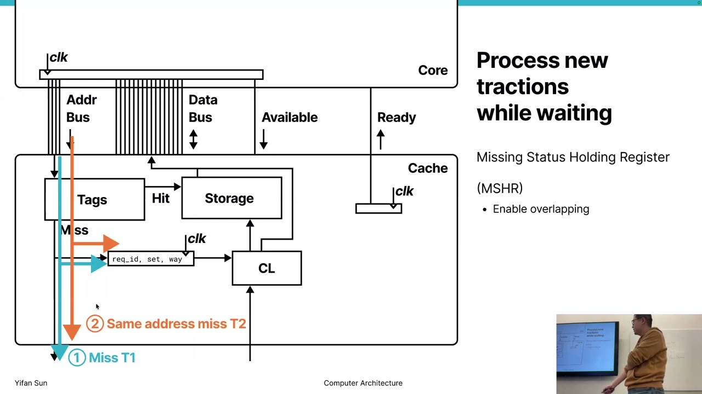

An MSHR table holds several line transactions simultaneously. Each occupied entry corresponds to one unique outstanding cache-line fill, not necessarily one core request. Lower cache levels have their own MSHRs, so a miss can consume resources at L1, L2, and memory-controller queues at the same time.

The maximum number of independent line misses is bounded by free MSHRs and downstream credits.

### Slide 14 — Miss merging ([00:35:25](https://www.youtube.com/watch?v=CZkU5W9aKlk&t=2125s))

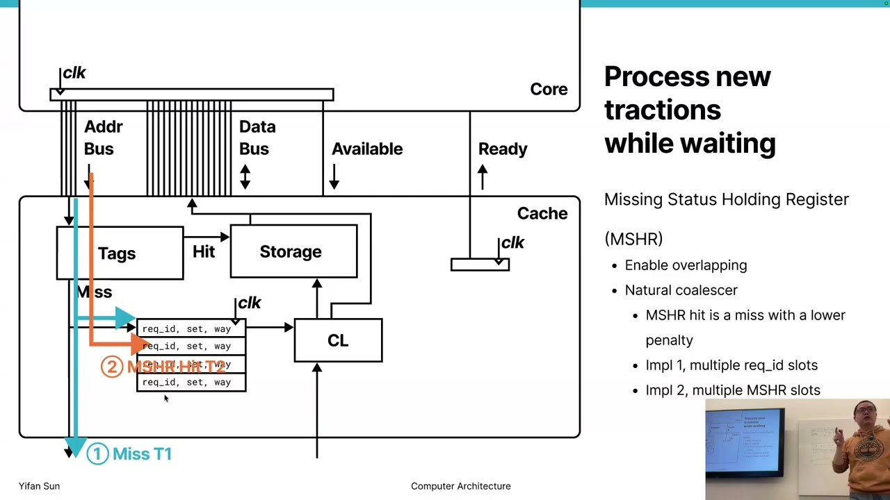

If a request misses on a line already represented by an MSHR, the cache does not send a duplicate read. It adds the request to that entry's waiter list. When the line returns, one fill supplies all compatible consumers.

For line size $L$,

$$
LineAddress(A)=A\;\&\;\sim(L-1).
$$

Requests merge when their line addresses match and their operations can be combined safely. Stores may require byte masks and ordering checks.

### Slide 15 — MSHR-full stall ([00:39:25](https://www.youtube.com/watch?v=CZkU5W9aKlk&t=2365s))

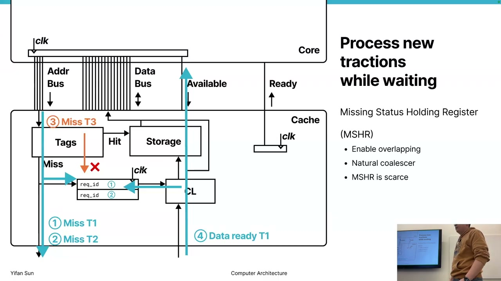

MSHRs are finite. A new unique miss with no free entry cannot be recorded, so the cache applies backpressure or replays the request. Hits and same-line merges may still proceed if array and control resources allow, but some designs conservatively block more traffic.

An MSHR-full event is a structural hazard. Increasing entries exposes more memory-level parallelism only until another limit, such as memory bandwidth, fill buffers, or core reorder capacity, becomes dominant.

### Slide 16 — Miss completion ([00:44:25](https://www.youtube.com/watch?v=CZkU5W9aKlk&t=2665s))

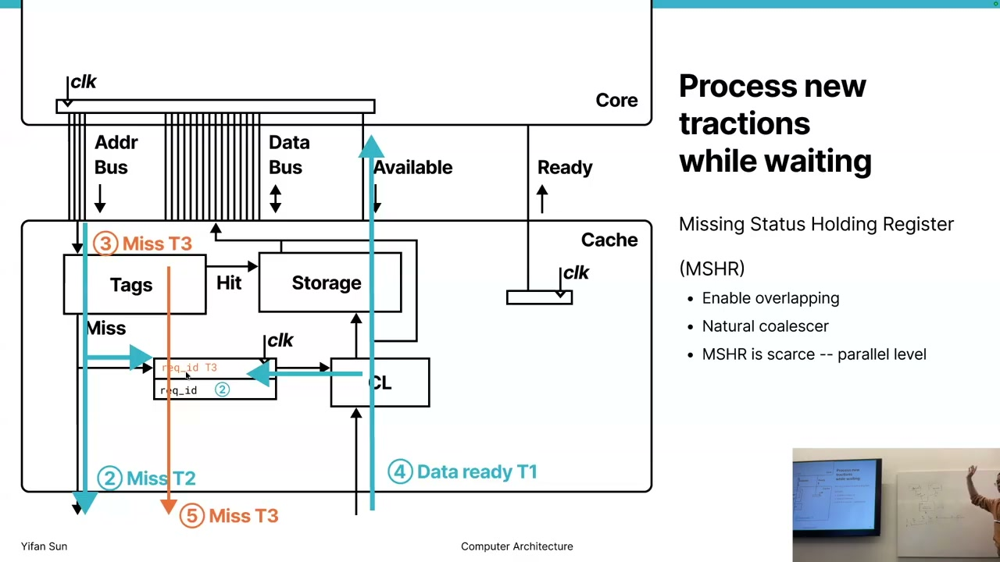

When data returns, the controller matches the transaction to an MSHR, installs the line, updates valid/tag/state metadata, sends words to every waiter, and frees the entry after all obligations complete. If a conflicting eviction or coherence event is still pending, the entry may remain occupied through additional transient states.

MSHRs do not make memory faster; they overlap latency with useful independent work and avoid duplicate requests.

## Writing policies

### Slide 17 — Two independent write decisions ([00:46:55](https://www.youtube.com/watch?v=CZkU5W9aKlk&t=2815s))

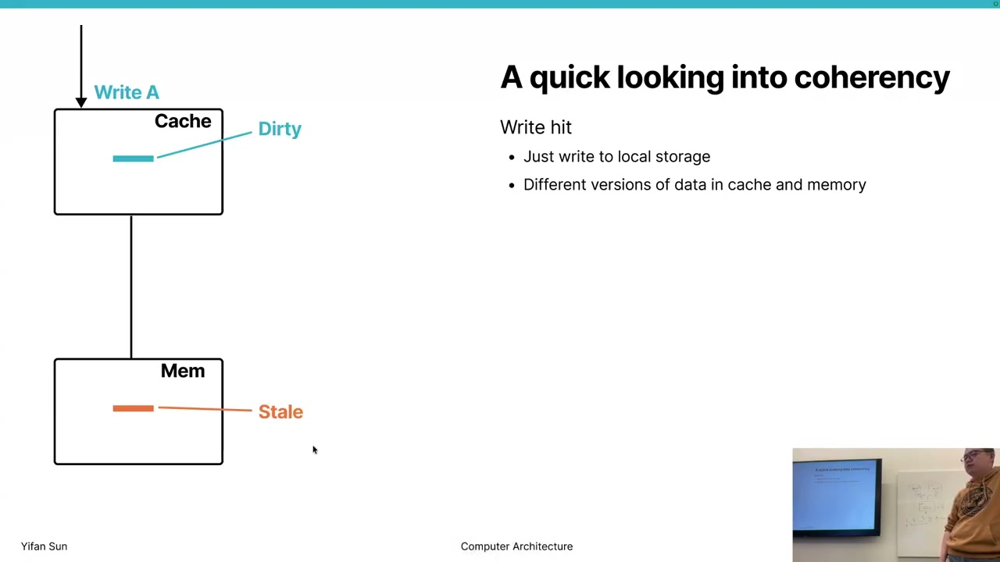

Cache write behavior contains two orthogonal choices:

1. **Propagation:** write-through updates the next level for every write; write-back defers propagation until eviction or flush.
2. **Allocation:** write-allocate fetches/installs a line on a write miss; no-write-allocate, often called write-around, sends the miss downward without filling this cache.

Thus “write-around” describes miss allocation, not an alternative to write-through/write-back on hits.

### Slide 18 — Writes and coherence ([00:50:25](https://www.youtube.com/watch?v=CZkU5W9aKlk&t=3025s))

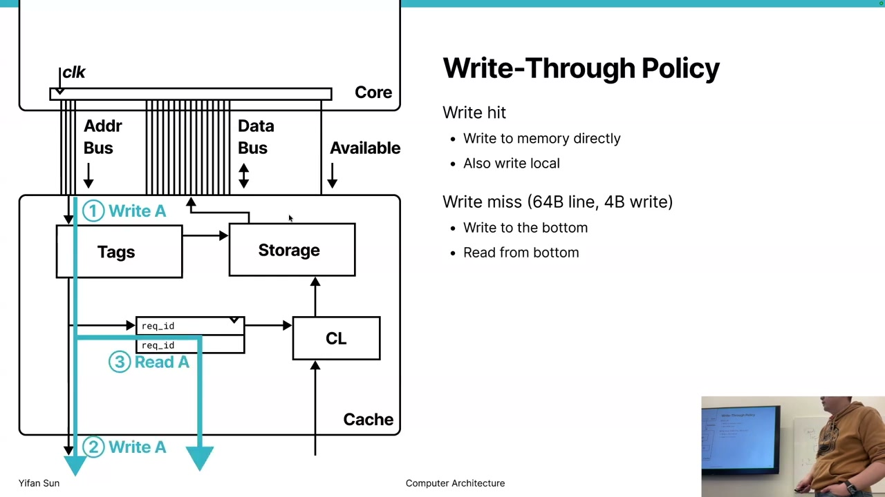

A write changes the newest version of a memory location. In a multicore hierarchy, propagation policy alone does not maintain coherent private copies: an ownership/invalidation protocol must prevent stale readers. Write-through keeps the next level current, while write-back allows a private cache to own data newer than memory and therefore requires dirty tracking.

### Slide 19 — Write-through ([00:52:25](https://www.youtube.com/watch?v=CZkU5W9aKlk&t=3145s))

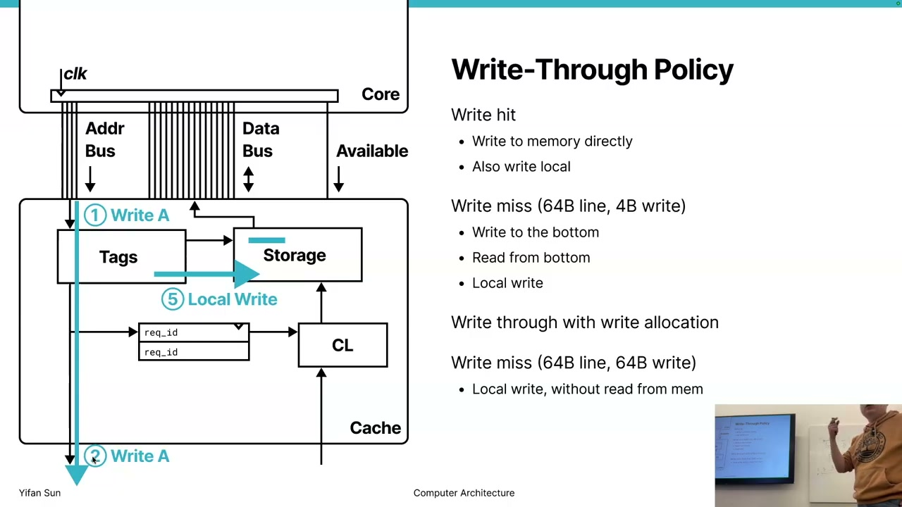

With write-through, every accepted write is propagated to the next cache or memory level. The local line remains clean relative to that next level once the write completes. A write buffer can decouple the core from downstream latency, but if the buffer fills, writes backpressure the cache.

### Slide 20 — Write-through hit ([00:54:25](https://www.youtube.com/watch?v=CZkU5W9aKlk&t=3265s))

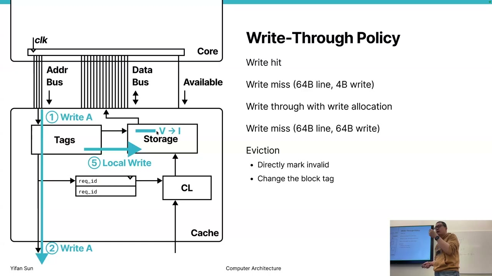

On a hit, the cache updates the selected bytes and enqueues the same update downward. The store can be acknowledged when the architecture's required ordering/durability point is reached; it need not always wait for DRAM if buffered writes are allowed.

Advantages are simple clean evictions and an up-to-date next level. Costs are one lower-level transaction per write and pressure on write queues/bandwidth.

### Slide 21 — Write-through miss with allocation ([00:56:25](https://www.youtube.com/watch?v=CZkU5W9aKlk&t=3385s))

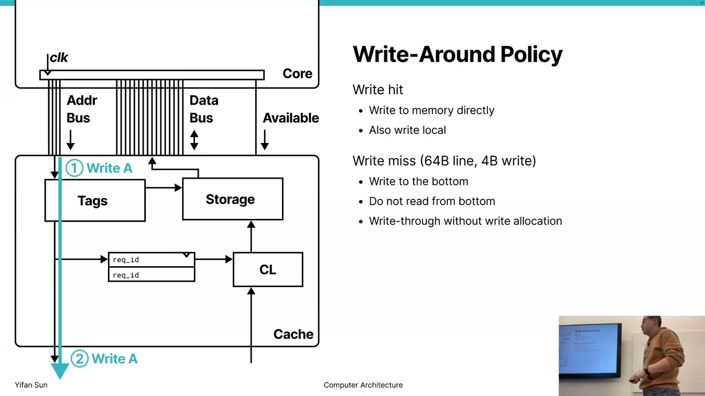

With write-allocate, a write miss obtains the line, installs it, merges the requested bytes, and propagates the write. This is useful when nearby or repeated accesses are expected. A full-line store may avoid reading old bytes if the implementation can construct the complete line; a partial store generally needs the untouched bytes or sub-line validity tracking.

### Slide 22 — Write-through eviction ([00:58:25](https://www.youtube.com/watch?v=CZkU5W9aKlk&t=3505s))

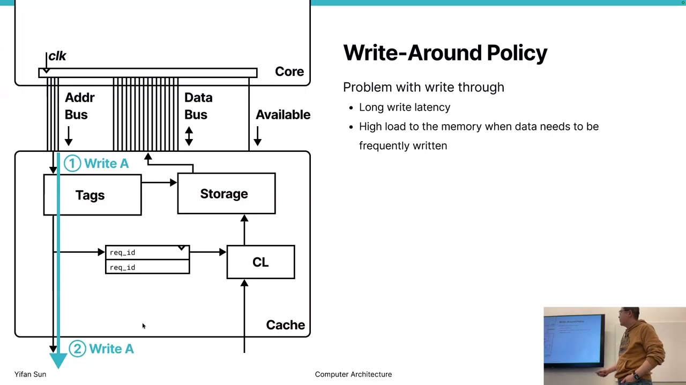

Because completed write-through updates leave the next level current, a victim normally needs no data writeback. Eviction invalidates or overwrites its metadata. This simplifies replacement, but write-heavy workloads can generate much more downstream traffic than write-back.

### Slide 23 — Write-around ([01:00:25](https://www.youtube.com/watch?v=CZkU5W9aKlk&t=3625s))

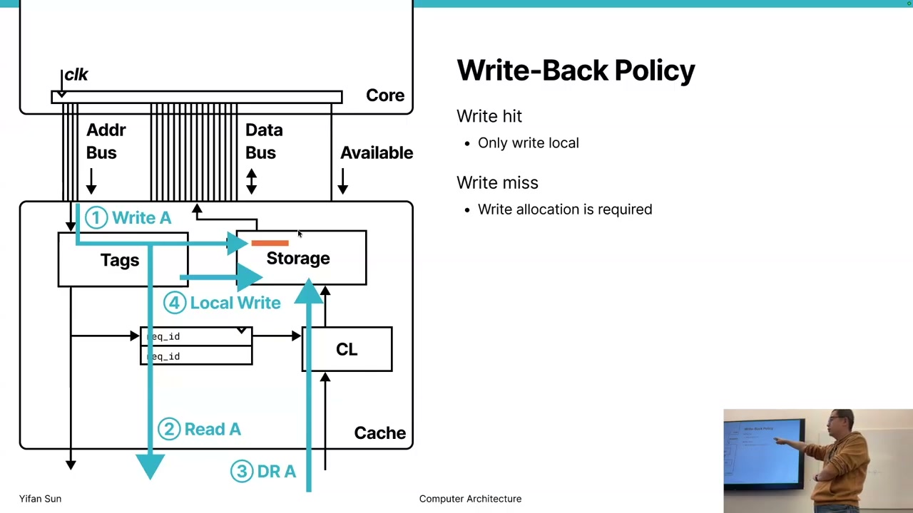

With no-write-allocate, a write miss bypasses the cache and is sent to the next level. The cache does not fetch data merely to overwrite it. This avoids pollution and read-for-ownership traffic for streaming or write-once data, but a later read of that line still misses.

### Slide 24 — Write-around hit and miss ([01:03:25](https://www.youtube.com/watch?v=CZkU5W9aKlk&t=3805s))

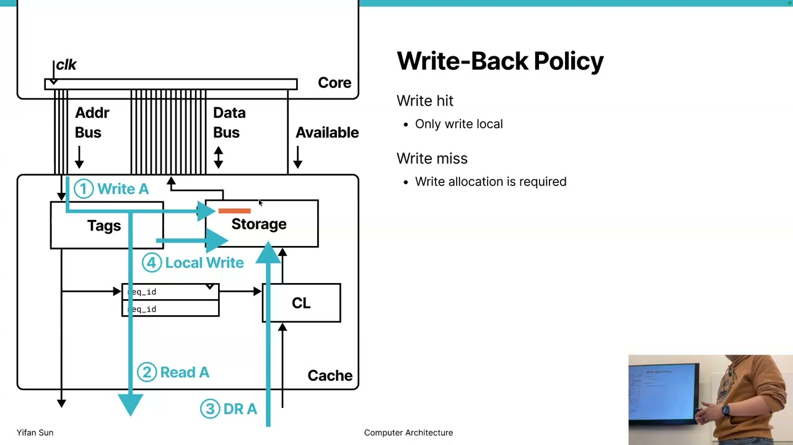

| Event | No-write-allocate action |
|---|---|
| Write hit | Update resident line according to its propagation policy |
| Write miss | Send write downward; do not install line |
| Later read | Miss unless another event installed the line |

Write-through plus no-write-allocate is common for simple streaming behavior. Write-back plus no-write-allocate is possible but requires careful handling if another copy of the line is already dirty or coherent ownership is involved.

### Slide 25 — Write-back and dirty bits ([01:06:25](https://www.youtube.com/watch?v=CZkU5W9aKlk&t=3985s))

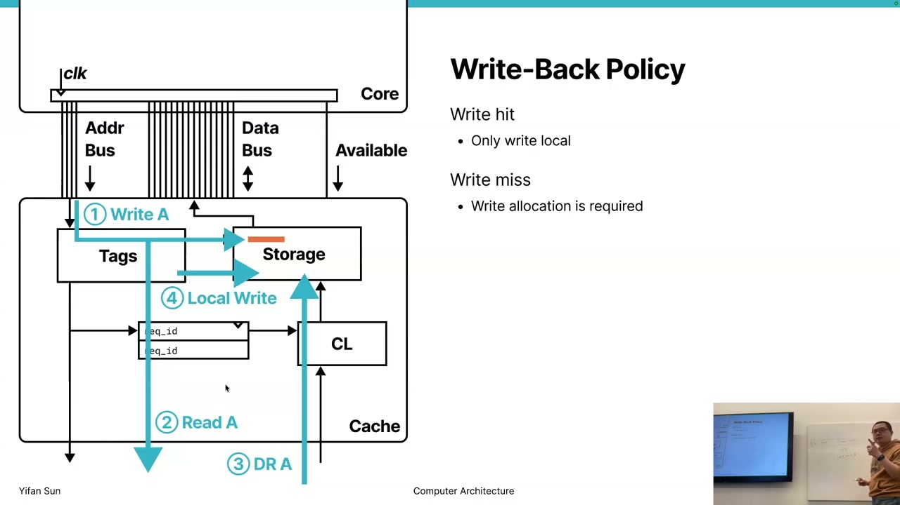

With write-back, a hit modifies only the cache and sets the line's dirty bit. Repeated writes to the same line collapse into one later line writeback. Memory or the next level may remain stale while the cache owns the dirty copy.

Each entry therefore needs at least tag, valid, dirty, and data fields, plus coherence/transient metadata in a multicore design.

### Slide 26 — Write-back miss and eviction ([01:09:25](https://www.youtube.com/watch?v=CZkU5W9aKlk&t=4165s))

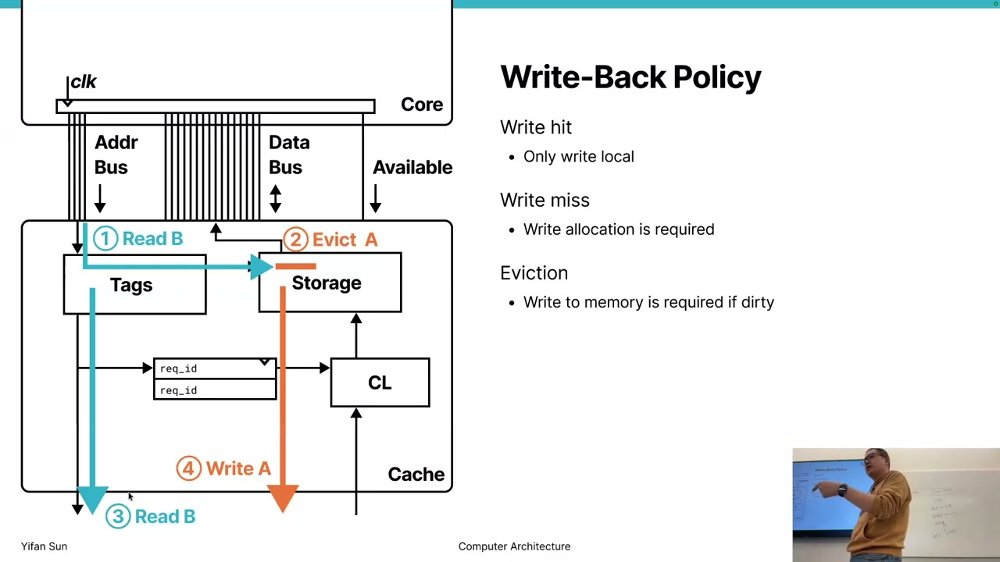

On a write-back hit, update bytes, set dirty, and respond without a next-level data write. On a write-allocate miss:

1. Select a destination way.
2. If its victim is dirty, enqueue the victim address/data in a writeback buffer.
3. Request or construct the incoming line.
4. Install it and apply the store.
5. Mark the new line dirty.

The victim must remain protected until its data is safely buffered; otherwise reusing the array slot would destroy the only current copy.

### Slide 27 — Write-policy tradeoffs ([01:11:55](https://www.youtube.com/watch?v=CZkU5W9aKlk&t=4315s))

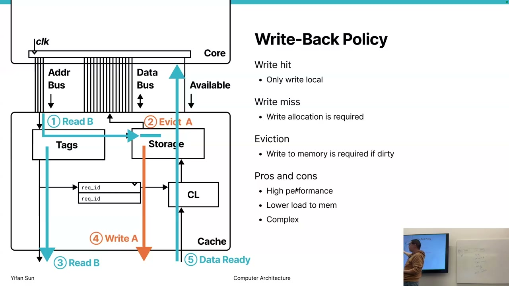

| Policy choice | Strength | Cost |
|---|---|---|
| Write-through | Clean lower-level copy, simple eviction | High write traffic and buffer pressure |
| Write-back | Fast repeated writes, reduced bandwidth | Dirty state, writeback buffers, harder coherence |
| Write-allocate | Exploits expected reuse after a miss | Fetch/installation cost and possible pollution |
| No-write-allocate | Avoids fetch for streaming stores | Later reuse misses |

High-performance data caches commonly use write-back plus write-allocate, supported by MSHRs, store/writeback buffers, and coherence protocols. The best choice still depends on locality, ordering requirements, bandwidth, persistence, and cache level.

## Key formulas and takeaways

1. A decoupled request transfers when $Valid\land Ready$.
2. Blocking caches serialize all work behind a miss; nonblocking caches retain miss state in MSHRs.
3. Hit under miss serves resident lines while another fill is pending.
4. Miss under miss permits several independent line fills simultaneously.
5. MSHRs hold line identity, request metadata, waiter information, and transient state.
6. Same-line misses can merge into one lower-level request.
7. $LineAddress=A\;\&\;\sim(LineBytes-1)$ for power-of-two line size.
8. IDs route out-of-order responses to the correct core operations.
9. MSHR exhaustion creates backpressure even when memory has unused latency.
10. MSHR count bounds independent outstanding line misses, not total merged requests.
11. Write-through/write-back and allocate/no-allocate are independent decisions.
12. Write-through propagates every write and normally keeps victims clean.
13. Write-back marks modified lines dirty and writes them downward on eviction or flush.
14. Write-allocate installs a line on a write miss; write-around bypasses on a miss.
15. Dirty victims require buffering or completion before their cache storage is reused.
16. Write buffers and MSHRs hide latency but do not remove bandwidth demand.
17. Coherence is still required when multiple private caches can hold a line.