# Lecture 1: Introduction to Computer Architecture

**Video**: [2RQ_81aNdwk](https://www.youtube.com/watch?v=2RQ_81aNdwk) | **Course**: Advanced Computer Architecture, Spring 2026 | **Duration**: ~69 min | **Slides**: 40

---

## Slide 1 — Title Slide
**Timestamp**: [00:01]

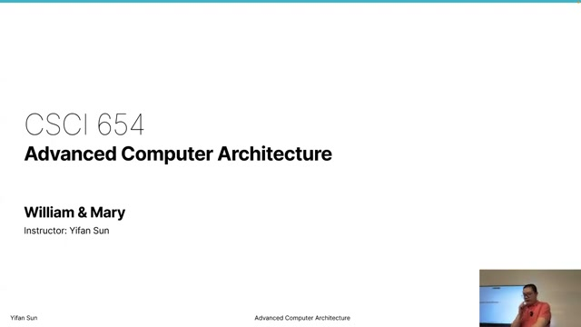

*Course title slide. The first 2 minutes are the professor setting up recording equipment.*

The professor explains he is experimenting with multiple recording methods to combine videos. This course was previously taught in Spring 2025, and those videos are already on YouTube. The skeleton of this year's course will be largely the same for the first half, with more advanced (PhD-level) content in the second half.

---

## Slide 2 — Course Overview
**Timestamp**: [02:12]

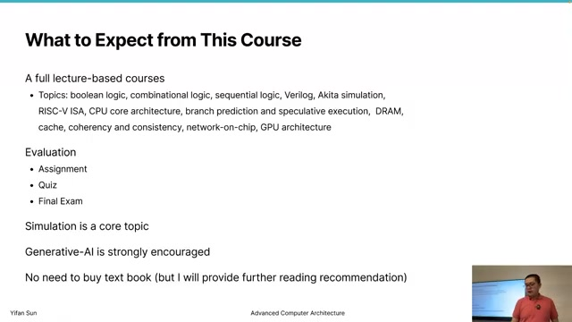

The professor polls the class to understand the student mix: 4 undergraduates, ~4-5 master's students, and a similar number of PhD students — a roughly balanced distribution. When asked who has taken a basic computer architecture course, only "several" raise their hands. Most are not comfortable with sequential logic or combinational logic.

**The professor's response**: While an advanced computer architecture course typically does not teach these fundamentals, he will spend the first **two weeks** reviewing them because "it's the basics for you to understand that no matter what advanced features we're designing in computer architecture, they're eventually implemented with basic features."

**Course format**: Fully lecture-based — no paper readings or student presentations.

**Topics covered** (in order):
1. Boolean logic → Combinational logic → Sequential logic
2. Verilog simulation (likely skipped this year)
3. RISC-V CPU core architecture
4. Branch prediction & Speculative execution
5. DRAM & Cache
6. Cache coherency & Memory consistency (consistency is NEW this year)
7. Network-on-chip (NEW this year — "something I really want to add")
8. GPU architecture (last year: blackboard only; this year: proper slides)

---

## Slide 3 — Course Mechanics
**Timestamp**: [05:41]

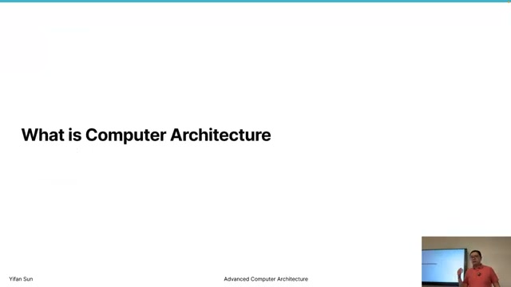

**Quizzes**: Google Forms with multiple-choice questions that provide immediate grading.

**Simulations**: The core assessment component. Students run architecture simulations and write their own simulation code. For example, for the cache topic, students will write a cache simulator to demonstrate understanding of how cache actually works.

**Generative AI policy**: The professor takes a permissive stance — students can and should use generative AI to ask questions ("what is a cache?", "how does a set-associative cache work?") and to help write simulation code. "Generative AI is everywhere... you can use it to help you learn."

**Simulation framework**: The course uses **Akida**, a simulation framework developed by the professor himself, written in **Go**. He reassures students: "If you have no Go experience, don't worry. It's easy. It's easier than Python. With generative AI, you probably just don't need to learn — just see examples and write code, as long as you can read it, it's good enough."

**Textbook**: Not required. The professor will cover all content and provide further reading recommendations. The recommended textbook is an undergraduate-level computer architecture text (the same one the professor learned from). For advanced topics like memory consistency and network-on-chip, there are specialized textbooks available electronically through the library.

---

## Slide 4–5 — Course Topics Detail
**Timestamp**: [06:04]

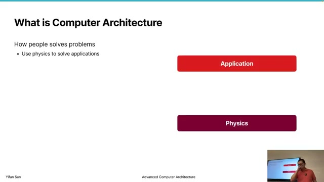

Continuation of the course topics overview and mechanics. The professor elaborates on what was covered last year vs. this year's additions.

---

## Slide 6 — What is Computer Architecture?
**Timestamp**: [06:50]

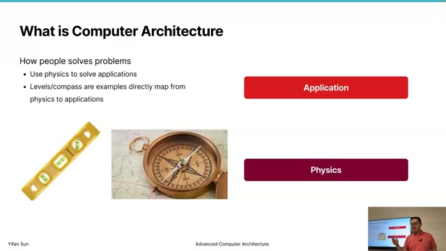

The professor introduces a classic **technology stack** diagram (application at the top, physics at the bottom) and explains the fundamental problem computer architecture solves: bridging physics and applications.

**Simple vs. complex tools**: For a compass, you can directly use physics (magnets point north) without a complex stack — "a single person may probably be able to produce these types of tools." But for computing, "there's almost impossible for a single person to work on everything." This is why we divide the stack into **layers with defined interfaces** — different people work on different layers and collaborate through well-defined boundaries.

The professor notes this stack diagram is "definitely an oversimplification." The actual computing landscape today is more like a **graph** with many domains combining together — which is how we can run generative AI today.

---

## Slide 7 — The Technology Stack Layers
**Timestamp**: [07:37]

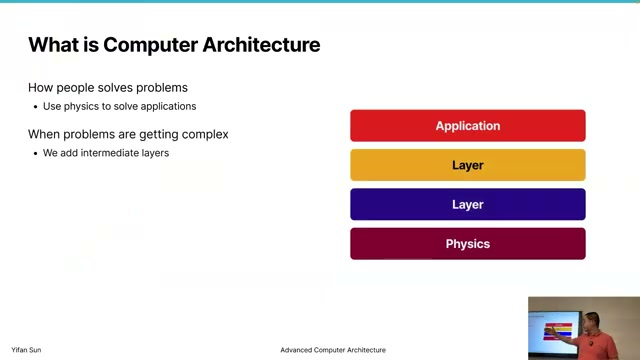

The stack, from bottom to top:
- **Devices**: Transistors — "super small things doing on and off switches"
- **Gates**: AND, NOT, etc.
- **Microarchitecture**: How chips are designed internally
- **Instruction Set Architecture (ISA)**: The dividing line between hardware and software
- **Assembly / Machine Code**: The most basic software communicating with hardware
- **Operating System, Programming Languages, Algorithms**: The software domain

---

## Slide 8 — Instruction Set Architecture (ISA)
**Timestamp**: [07:54]

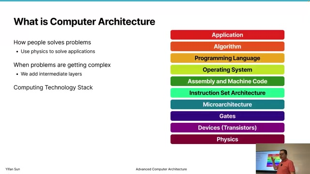

**ISA = a protocol between software and hardware.** Examples: x86, AMD64, ARM, IBM PowerPC, RISC-V. It defines the encoding: `00000001` might mean ADD two numbers together; `00000010` means SUBTRACT.

**Historical context — before ISA existed**: In the earliest computers, there were no standard layers. People used paper tape with punched holes. Every computer had its own instruction set and programming language. "If you program for one computer, then you have a new computer — you totally need to write new software." Nobody cared because software was "pretty much disposable — you use it one time, get the result, and you're done."

**Why ISA is the most stable layer**: As software reuse became important, the ISA layer was added. The professor argues it is "probably the most stable layer in the entire stack." Device technology changes rapidly (3nm, 7nm, new transistor types), but ISA changes very slowly.

**The Apple example**: Apple switched from PowerPC → x86 → ARM. Apple is a rare **success story** — "there are so many unsuccessful examples. It's a very hard, high-cost transition because if you change the middle layer, you have to redesign everything below and redesign everything on the top. That's a lot of work." The stability of ISA is what allows software ecosystems to thrive across hardware generations.

---

## Slide 9 — Department Boundaries & Architecture's Role
**Timestamp**: [09:08]

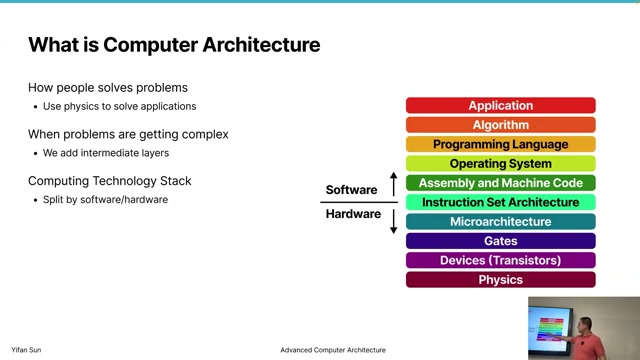

At the professor's university there is only Computer Science. At other universities with separate departments:
- **Electrical Engineering**: Everything below ISA (devices, transistors)
- **Computer Science**: The software side
- **Computer Engineering / Computer Architecture**: The **middle layer** — the system side / microarchitecture side

**Analogy — Computer Architecture as "core muscle"**: The professor compares computer architecture to the core muscle of a human body. "If you want to play tennis, you need to hit a ball hard — you really need your core muscle." Applications keep changing (generative AI, image generation appearing "almost every day"), and devices keep evolving (7nm, 3nm, compute-in-memory). These develop independently — applications just want "faster, faster, smaller, low energy," while devices just keep shrinking. **Computer architecture in the center connects these two parts.** Whenever there's a new algorithm, architects think about how to make it run faster. Whenever there's new hardware, architects think about how to use it to accelerate the layers above.

**It's not only about faster — it's about making the impossible possible.**

---

## Slide 10 — The Role of Computer Architects
**Timestamp**: [12:12]

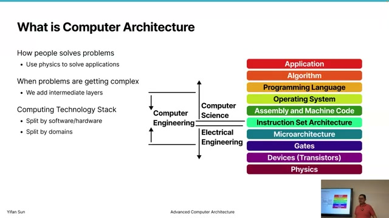

**Industry job roles comparison**:
- **Circuit designer / Verilog engineer**: "People who write very low code, who design circuits — rather entry-level jobs." They implement the current generation of products.
- **Computer architect**: "A slightly higher-level job — research-type or manager-type." They look **one generation beyond, two generations beyond** (~3 years ahead in the product line) and decide **what features to implement**.
- **UX designer / Project manager**: Similar to architects in that they define what to build.

The architect's workflow: "You probably have many many ideas... then you just have to discard all those ideas. Then eventually you decide what are valuable, what are practical, then you give it to the entry-level Verilog writers to implement."

**Required knowledge breadth**: Computer architects must understand what happens at **both** the device level and the application level to "really design the right thing."

---

## Slide 11 — Why Architecture Matters: The AlexNet Story (2012)
**Timestamp**: [13:05]

The professor asks: "Why was AI not a thing before 2012? What happened in 2012?"

**The answer — AlexNet**: A convolutional neural network that "significantly increased the accuracy of image recognition — it's just another level." The professor draws an analogy: it was like quartz watches vs. mechanical watches. "Quartz watches are so much more accurate than mechanical watches — it's just suddenly a new type of animal entered the game." Within a few years after AlexNet, image recognition became mature and commercial — face recognition appeared in virtually every camera.

The professor argues that **2012 is "probably more important than the year ChatGPT was released."**

**Two big reasons AlexNet succeeded**:
1. **Big Data — ImageNet** (from Stanford): A large, high-quality labeled dataset that made people care about training data quality.
2. **GPUs for computation**: "It's not because CPUs cannot do it. It's just because CPUs are slow." GPUs provided **10× to 100× speedup** for AI workloads. "Think about 100 times. If it's a year's task, you can reduce it to three days. That's turning something impossible into possible."

**The key insight**: Computer architecture (using GPUs instead of CPUs) was an **enabler of new technology** — without architectural innovation, AlexNet would not have been practical.

---

## Slide 12 — Transistors: Basic Concepts
**Timestamp**: [16:54]

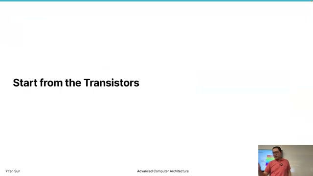

The professor transitions to the hardware fundamentals, starting with transistors.

**The basic transistor**: A **3-pin device** — input, output, and control — connected to the outside world via three pins. For digital logic, each pin carries either 0 or 1.

**Pins as a hard limiting factor**: The professor compares pins to pixels on a screen. "1024×768 is about less than a million pixels. That means you cannot really show more than one million elements — that's a hard limiting factor." For chips, the number of pins and how fast each pin can communicate with the outside world is "another hard limit that people easily ignore."

---

## Slide 13 — Vacuum Tubes
**Timestamp**: [17:01]

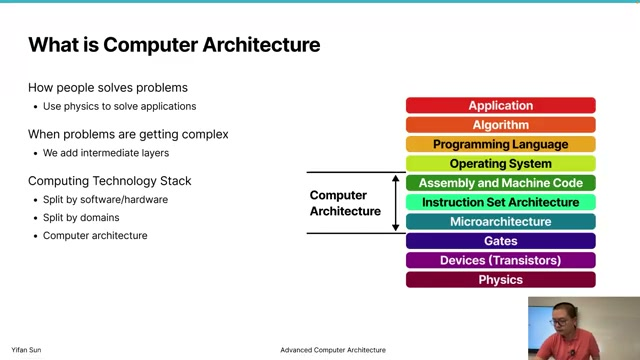

Early computers used **vacuum tubes** — glass tubes with no air inside. They have two sides: a load side and a control side. When the control side is powered, it heats up a control grid. When heated, electrons can flow from one side to the other, closing the circuit. **When the circuit is closed, the two sides are connected.**

For computer architecture purposes, the physics details do not matter. What matters is the abstraction: **a switch**. 1 means connect the circuit; 0 means disconnect the circuit. "Although transistors can be super complex, for computer architecture, that's the basic thing — this can represent a zero and one, then we can combine these transistors to make logics."

---

## Slide 14 — Problems with Vacuum Tubes
**Timestamp**: [18:32]

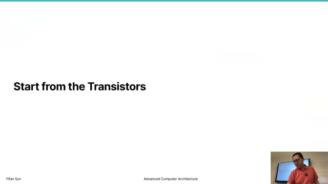

The professor lists the two major problems that drove the industry beyond vacuum tubes:

1. **Size**: "Really big." Early computers filled an entire room or building and could only store hundreds of bits.

2. **Energy consumption**: This becomes the central theme. Heating metal takes enormous energy. Moreover, current keeps flowing continuously — "it's like a short circuit, energy is wasted on this side."

---

## Slide 15 — The Energy/Heat Problem
**Timestamp**: [18:46]

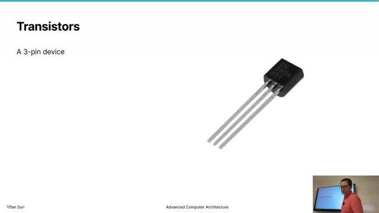

The professor expands on why energy matters, connecting historical problems to **today's biggest challenge**:

**All electricity becomes heat**: "If my laptop takes 25 volts of power, the energy is eventually turned into heat." Then we need even more energy to remove that heat — air conditioning, fans, or liquid cooling.

**The data center anecdote**: "I asked someone who built a data center — they say it takes more energy to bring the heat away than to power the computer itself."

**Exotic cooling proposals**: Building supercomputing centers near rivers (river water carries heat away), putting data centers under the ocean, or in outer space.

**The performance connection**: This is not just about environmental concerns. "Even if you just consider performance, you need to consider energy consumption." If a chip generates heat too fast and the temperature exceeds a threshold, **the chip will melt**. To prevent this, some cores or parts of the circuit must be turned off — reducing performance. **Therefore: reducing energy consumption = enabling more active cores = more performance.**

**The AI connection**: The professor notes that for generative AI today, "the bottleneck of capability is electricity — how much electricity we can generate. If we have more electricity, we can have more powerful AI."

---

## Slide 16 — BJT Transistor
**Timestamp**: [20:21]

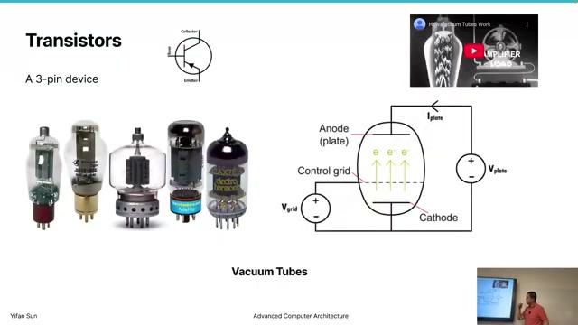

The industry moved from vacuum tubes to **BJT (Bipolar Junction Transistor)**, a semiconductor device.

**Structure**: Three layers with three terminals — **Emitter, Collector, and Base**. The Base is the control terminal. If Base = 1, the circuit is connected; if Base = 0, it is disconnected.

**What BJT solved**: The heating problem — no need to heat up metal to enable switching.

**Why BJT was still not ideal**: It is **current-driven** — current flows through the control path itself, meaning significant power consumption when the transistor is on. BJT is "not the technology that we use in modern computer chip design today."

---

## Slide 17 — CMOS Technology
**Timestamp**: [22:19]

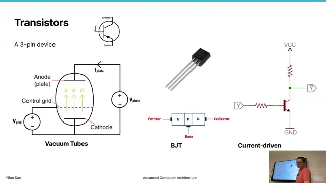

**CMOS = Complementary Metal Oxide Semiconductor** — the technology used in all modern computer chips.

**Structure** (side view): A **P-substrate** with N-wells on each side. On top: an **oxide layer** (insulator — "electricity cannot go through") and a piece of **metal** (the **gate**). When a voltage is applied to the gate, "some magic things happen in the semiconductor" — an electric field creates a channel connecting the two N regions.

**How it works**:
- **With voltage on the gate**: The N regions are connected (circuit closed)
- **Without voltage on the gate**: The N regions are NOT connected (circuit open)
- **The complementary version** (PMOS): Works in reverse — with no voltage, connected; with voltage, disconnected

This is why it is called **complementary** — one side is NMOS, the other is PMOS. In circuit notation, a **circle on the gate** indicates a "NOT" signal — the transistor is enabled when the input is 0 (PMOS). Without the circle, it is enabled when the input is 1 (NMOS).

---

## Slide 18 — CMOS NOT Gate (Inverter)
**Timestamp**: [26:05]

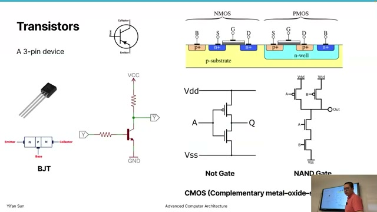

The professor walks through the operation of a CMOS NOT gate (inverter), the simplest CMOS circuit:

**The circuit**: VDD (power supply, "1") at the top, VSS (ground, "0") at the bottom. A PMOS transistor (with circle) connects VDD to the output Q. An NMOS transistor (no circle) connects Q to VSS. Both gates are controlled by input A.

**Operation**:
- **A = 1 (VDD)**: The PMOS (circle) sees 1 → disconnects. The NMOS sees 1 → connects. Output Q is connected to VSS → **Q = 0**.
- **A = 0 (VSS)**: The PMOS sees 0 → connects. The NMOS sees 0 → disconnects. Output Q is connected to VDD → **Q = 1**.

**Summarized**: Q always equals the opposite of A. This is a **NOT gate**.

**Student interaction**: A student asks: "So this is like an electrical version of a mechanical switch or wire?" The professor confirms enthusiastically: "Yeah! It's a **signal-controlled switch**. Just consider there's a wire connecting these two."

---

## Slide 19 — CMOS Energy Advantages
**Timestamp**: [32:49]

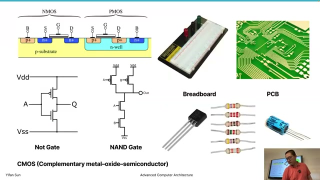

**The key advantage of CMOS**: The gate metal is "totally disconnected from the rest of the circuit" — the oxide insulator prevents current from flowing through the gate. **VDD and VSS are NEVER directly connected.** This eliminates the short-circuit-like energy waste of vacuum tubes and BJTs.

**Two types of chip energy consumption**:

1. **Static energy (leakage)**: Electrons sneak from VDD to VSS even when the transistor is "off" because isolation is never 100% perfect. In CMOS, this is **very small** — roughly the same whether the output is 0 or 1.

2. **Dynamic energy (switching)**: Energy consumed when the transistor changes state — electrons moving from one place to another as the gate switches on/off. **This dominates modern chip power consumption.**

**Comparison**:
- BJT: High static consumption (current always flowing when on) → unsuitable for high-density chips
- CMOS: Low static, mainly dynamic → enables billions of transistors on a single chip

---

## Slide 20 — CMOS NAND Gate & Energy Examples
**Timestamp**: [32:49]

The professor briefly introduces the CMOS **NAND gate** circuit as an exercise for students. Two PMOS transistors in parallel at the top, two NMOS transistors in series at the bottom. If A=0 and B=0, both PMOS transistors connect (output is pulled to 1), while the NMOS transistors disconnect. This produces the **inverse of AND** = NAND.

The professor leaves detailed analysis of the NAND gate as an exercise, focusing instead on the bigger picture of how these gates combine to build complex circuits.

---

## Slide 21 — From Breadboards to Integrated Circuits
**Timestamp**: [33:42]

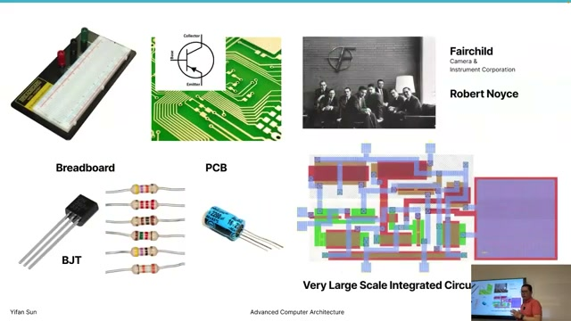

**Personal anecdote**: As an undergraduate, the professor built a **24-hour clock** on two full breadboards — "That's the practical limit. I cannot build anything more complex than that."

**The evolution**:
1. **Breadboard**: Manual wiring, very limited scale
2. **PCB (Printed Circuit Board)**: Much better — circuits are pre-built. But still impractical for very complex chips.
3. **Integrated Circuit (IC)**: The breakthrough — invented by people at **Fairchild Semiconductor**. The professor notes: "Fairchild as a company does not exist anymore, but it's still a legend because many people from this company became very important people at other companies."

From IC, the industry progressed through SSI → LSI → **VLSI (Very Large-Scale Integration)**.

**VLSI layout** (shown in slides): Different colors represent different materials:
- Red = P-well
- Green = N-well
- Blue = copper interconnects (wires)
- X marks = copper vias connecting to lower layers

This is essentially **printing circuits** at nanometer scale, rather than manually wiring them.

---

## Slide 22 — Fairchild, Intel & Moore's Law
**Timestamp**: [35:20]

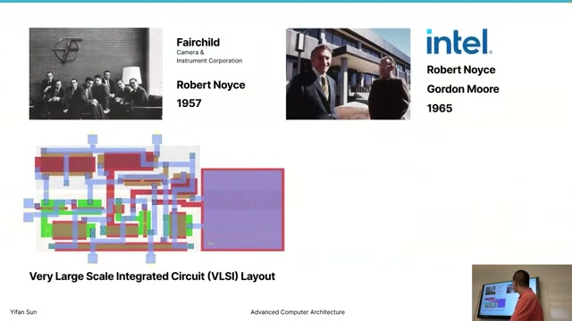

Two key people from Fairchild — **Robert Noyce** and **Gordon Moore** — left to start **Intel**, the company that made integrated circuits a practical, scalable business.

**Student interaction**: The professor asks if students know what Moore's Law is. A student correctly states it.

**Moore's Law — Two formulations**:
- **Original (1965)**: "The number of components per integrated circuit doubles every year."
- **Modified (1975)**: "The number of transistors on computer chips roughly doubles every 18 months, with no increase in power consumption." The 18-month figure was a curve-fitting adjustment.

The "no increase in power consumption" part was later formalized as **Dennard Scaling** (discussed later).

**Historical perspective**: "Since 1990, people have been saying we're close to the end of Moore's Law." In the 1990s, transistors were 1,000 nanometers (1 micrometer) — people could not imagine making them smaller. "We are 25 or 35 years later, we're still saying we are at the end of Moore's Law."

---

## Slide 23 — Moore's Law Data Evidence
**Timestamp**: [36:30]

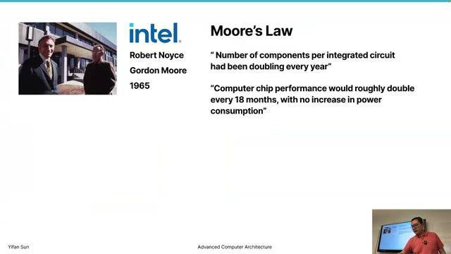

The professor presents empirical evidence from two sources:

1. **Wikipedia data**: Shows a linear trend on a logarithmic scale, which means **exponential growth** in transistor counts. The trend continues to the present day.

2. **The professor's own dataset**: ~4,000 commercially available CPUs and GPUs with published technical specifications. The data confirms exponential growth continues. A notable pattern: when Intel stopped releasing transistor count information for several years, Moore's Law appeared to plateau. "But when AMD started catching up, the trend is still kind of growing."

---

## Slide 24 — Transistor Scaling & Technology Nodes
**Timestamp**: [37:37]

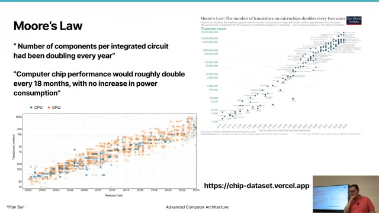

**How Moore's Law is achieved**: Making transistors **smaller and smaller**.

**Technology nodes timeline**:
- A few years ago: **7 nanometer**
- Today's mainstream: **5 nanometer** and **3 nanometer**
- Coming next year: **2 nanometer**

**⚠️ Critical caveat — "nanometer" is now a marketing term**: The professor warns that the node name no longer describes actual transistor dimensions. "TSMC and Intel use very different terminologies. Intel is still in the '14 nanometer era' by their naming... but that doesn't mean TSMC's 5nm transistor is actually smaller than Intel's 14nm transistor. It's more and more a commercial term."

**What actually matters — transistor density**: From TSMC data, **transistors per mm²** consistently increases with each process node. 7nm is much denser than 12nm, 5nm is denser than 7nm, etc. This is the real metric of progress.

---

## Slide 25 — Atomic Scale Limits
**Timestamp**: [38:51]

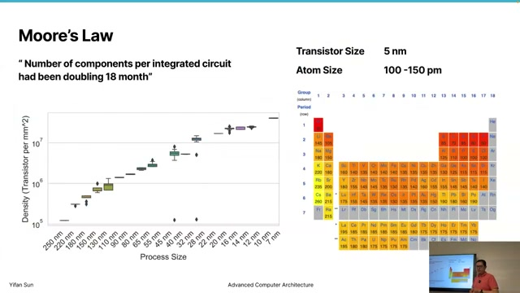

**Atoms vs. transistors**:
- An atom is typically **100–200 picometers** (1 picometer = 1/1000 of a nanometer)
- With today's transistor sizes, a transistor spans only **tens to hundreds of atoms**
- "We have pretty much **atom-level control**"

**Is Moore's Law ending?**
- **If you count atoms**: Probably yes — we are approaching fundamental physical limits
- **If you look at the trend**: "Probably we can continue for at least a few more tens of years" — new techniques (like chiplets, 3D stacking, new materials) continue to extend it

---

## Slide 26 — Chip Manufacturing: Silicon to Wafers
**Timestamp**: [42:04]

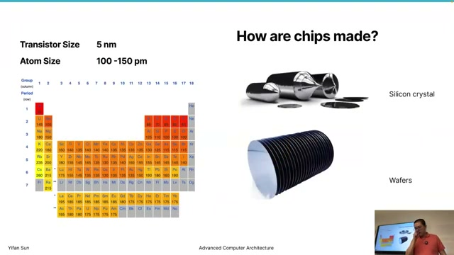

The professor explains **why architects need to understand manufacturing**: the physical constraints of manufacturing directly shape what is possible in computer architecture — die size limits, yield economics, power constraints.

**Step 1 — Silicon crystals from sand**: "It's magic, converting from sand to chips." TSMC buys silicon crystals from specialized suppliers. The purity requirements are extraordinary — **99.999%+ pure, much purer than gold**. Even tiny impurities can cause the entire chip to fail.

**Step 2 — Wafers**: The silicon crystal ingot is sliced into thin wafers. The professor compares them to cookies or crackers — "that's why they call them wafers." A wafer is typically **less than 20 inches in diameter** — about the size of a medium/small pizza.

**How large is a chip die?** The largest single chips today (H100, A100 — not counting multi-chip packages like AMD Threadripper) are about the size of **the cap of a whiteboard pen, or two of them**. GPUs can be slightly larger. Maximum single die: **~800 mm²**.

---

## Slide 27 — Lithography Process
**Timestamp**: [44:14]

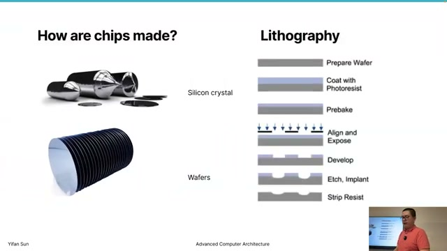

**Lithography** (by **ASML** — "the masters of lithography"):

1. **Prepare** the wafer — ultra-clean, using massive amounts of pure water
2. **Coat** with **photoresist** — a light-sensitive gel
3. **Pre-bake** to harden the gel
4. **Align** a **mask** (stencil containing the circuit pattern) — precision at nanometer level
5. **Expose** to light — photoresist exposed to light **disappears**
6. **Etch** — chemicals wash away material where photoresist is gone
7. **Deposit** new materials — particle streams for doping, copper for interconnects
8. **Repeat** — multiple layers, multiple etching passes

**The precision challenge**: Light **scatters** when passing through narrow gaps in the mask. The narrower the gap, the more scattering — this limits how small features can be. **Shorter wavelength = less scattering = smaller features**. This is why ASML developed **EUV (Extreme Ultraviolet)** lithography — moving toward the ultraviolet side minimizes wavelength and maximizes precision.

**Multi-patterning**: To make extremely thin wires, manufacturers do multiple rounds of etching from different angles, achieving atom-scale precision through iterative refinement.

---

## Slide 28 — Chip Packaging
**Timestamp**: [47:32]

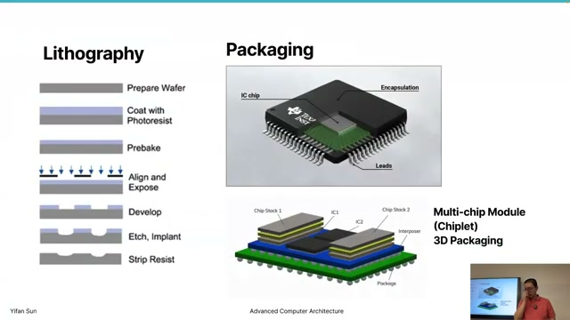

"Do not underestimate the power of packaging — it's actually very, very important."

**Basic packaging**: The silicon die sits in the center of a package. Tiny wires connect the die to external pins around the edges. Everything is sealed in plastic.

**Simple packaging analogy**: Cheap toy watches — the chip is placed directly on the PCB, then plastic or wax is dripped over it. "Even this super cheap packaging provides protection."

**Static electricity danger**: Even when touching only the plastic part of a chip, static electricity can still damage it through the package.

---

## Slide 29 — Pins & Communication
**Timestamp**: [51:50]

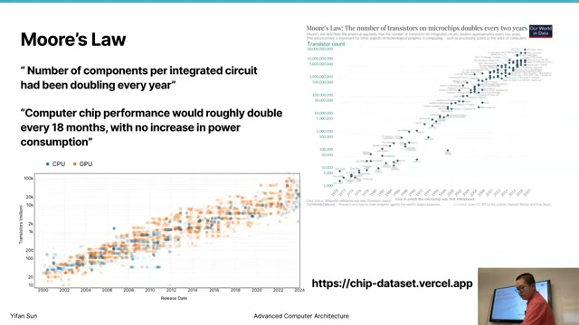

**How many pins?** The professor asks students to guess. One student: "A couple hundred for lower-end." The professor confirms: **1,000 to 2,000 pins** for high-end desktop CPUs. With **bottom pins** (BGA — Ball Grid Array), they can have thousands.

**What pins do**: Pins handle all external communication — "CPU may read and write memory, send video signals to your monitor, send signals to Wi-Fi, send signals to the hard drive."

**Pin bandwidth**: At 1 GHz, a single pin might send ~16 bits per cycle — that is one nanosecond per transfer. Pins are fundamentally a **communication bottleneck**.

---

## Slide 30 — Multi-Chip Module / Chiplet Technology
**Timestamp**: [52:11]

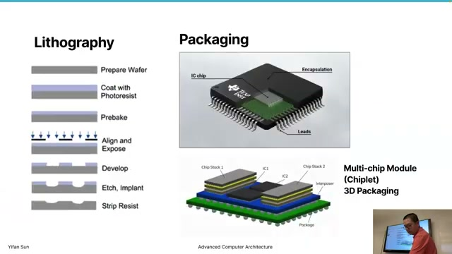

**Modern high-end CPUs and GPUs use chiplets** — multiple silicon dies combined in a single package. This is "one of many creative ways to continue Moore's Law" beyond what Gordon Moore originally envisioned.

The professor notes that strictly speaking, the **original Moore's Law says "transistors on ONE chip"** — so multi-chip modules technically do not count by the original definition. But they are how the industry continues to deliver exponential performance gains.

**Three-tier communication network**:

| Tier | Where | Speed | Energy |
|------|-------|-------|--------|
| On-chip | Within a single die | Fastest | Lowest |
| In-package | Chiplet to chiplet via **interposer** | Medium | Medium |
| Off-package | PCIe, external buses | Slowest | Highest |

"Each lower layer consumes more energy and is slower." Staying on the same chip is always fastest. The **interposer** (a silicon substrate beneath the chiplets) provides faster communication than going off-package through PCIe — "that's why this technology is so important."

---

## Slide 31 — SoC vs. SoW (System-on-Wafer)
**Timestamp**: [52:11]

**Student question**: "Is this the same thing as system-on-chip?"

The professor clarifies:

**SoC (System-on-Chip)**: Different types of IP cores integrated into ONE die — Wi-Fi controller, memory controller, CPU cores, GPU, AI accelerators — all on the same piece of silicon. This is an **architecture/design** concept.

**SoW (System-on-Wafer)**: A **packaging** concept. Multiple large dies (e.g., many GPU chips) placed on a wafer-scale interposer. TSMC announced this technology for 2027. The interposer is made of silicon, so its maximum size is limited by the wafer size. SoW is "probably the largest thing we can imagine on this type of technology."

---

## Slide 32 — Defects & Yield
**Timestamp**: [54:54]

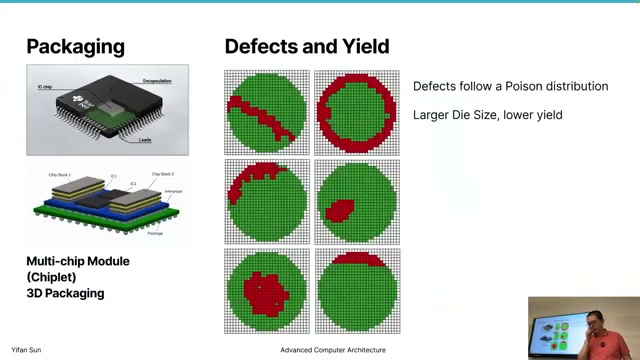

**Yield = fraction of working chips on a wafer.**

On a wafer, many chips are produced simultaneously, then sliced apart. During manufacturing, defects occur.

**How chips fail**: "Imagine a piece of dust or a hair falls on the wafer. A hair is micrometer or even millimeter level — it can hit thousands, millions of transistors. That chip — there's no way to use it."

**Cleanroom measures**: Super-clean rooms where air constantly blows from top to bottom, pushing particles downward. Workers wash and wear special full-body garments all day.

**Yield vs. Die Size**: Defects follow "something like a 2D Gaussian distribution or Poisson distribution." **The larger the die size, the more likely it is to be hit by a defect → the lower the yield.** This is why large, high-end chips are so expensive — "while producing this number of chips, a lot of them have to be discarded."

---

## Slide 33 — Wafer Defect Patterns
**Timestamp**: [58:17]

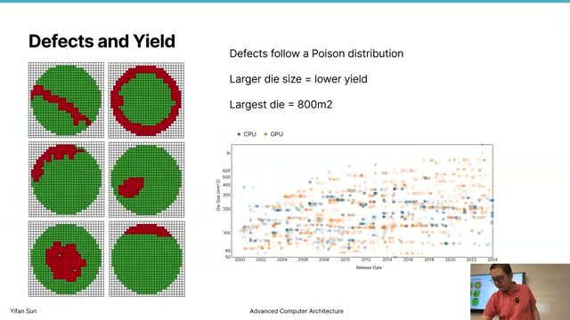

The professor shows actual wafer maps with defect patterns:

- **Large striping/streak patterns**: "Very likely a piece of hair falling on it, dragging across."
- **Twisted/rotation patterns**: The mask was slightly twisted — "just a few arc-seconds off center."
- **Center vs. edge**: Center tiles/dies are more likely to be good. Side tiles are more likely to be bad.

**Maximum die size** — two constraints:
1. **Yield**: Larger dies → more likely hit by defects → yield drops sharply beyond ~800mm²
2. **Lithography**: The light source is a single point that scatters — precision degrades over larger areas. This is another fundamental limit.

NVIDIA H100 and A100 are in the ~800mm² range. Multi-chip combinations can reach ~1,000mm².

---

## Slide 34 — Chip Binning (芯片分级)
**Timestamp**: [59:27]

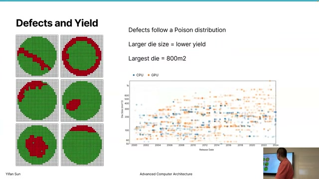

**Chip binning** is the practice of selling partially-defective chips as lower-tier products rather than discarding them.

**Apple example**: Apple sells MacBook Air with a **7-core GPU**. "They may detect: two GPU cores are not working. Rather than wasting it, let's sell it as a lower-end device." The 7-core GPU is "probably just one GPU core not working" on what was designed as an 8-core die.

**Built-in redundancy**: Sometimes, when demand for low-end devices is high but yield is good, manufacturers use software to disable perfectly working cores to create lower-tier products. "When they say 2MB of cache, they probably built 2.4MB of cache." This provides margin for defects.

---

## Slide 35 — The "Chip Lottery"
**Timestamp**: [59:38]

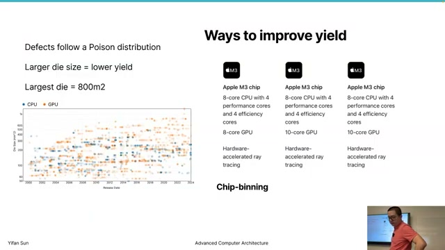

**Not all chips of the same model are identical.** This creates a "chip lottery":

- Some cores may be physically faster than others
- Cores closer to the center of the on-chip network → faster communication → better performance
- If a center core is defective and disabled, the chip may be slightly slower than one where only an edge core is broken
- Two chips both sold as "10-core GPU" may have slightly different performance

**Enthusiasts and hackers** try to re-enable disabled cores through software modifications — sometimes successfully, sometimes not. Manufacturers use **fuses** (one-time programmable bits) to permanently disable defective components.

---

## Slide 36 — TDP (Thermal Design Power)
**Timestamp**: [62:00]

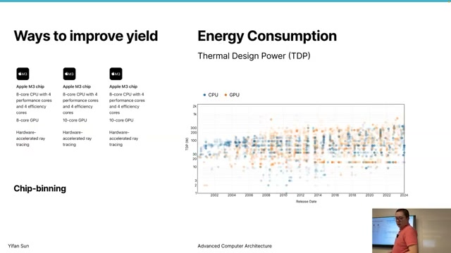

**TDP is not the actual power the chip consumes.** It is a **guideline** for system designers — what cooling solution to design for. "If we really want this chip to run faster and faster, we can use liquid nitrogen as cooling."

**TDP ranges and cooling guidance**:

| TDP | Cooling Solution |
|-----|-----------------|
| < 25W | Passive cooling (no fan needed) |
| ~45W | Fan required |
| ~200W | Liquid cooling required |
| ~300-350W | Highest TDP today (high-end GPUs) |

**Historical trends**: CPU TDP has stabilized around ~100W. GPU TDP has grown dramatically — high-end GPUs now reach 300-350W. GPUs can have higher TDP because "you always buy the whole thing from one company including the cooling technology."

---

## Slide 37 — Dennard Scaling
**Timestamp**: [63:07]

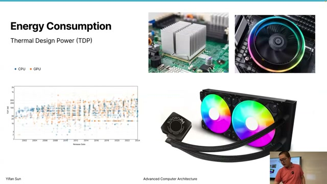

**Dennard Scaling** (named after Robert Dennard): As transistors get smaller, **power density stays constant**. An 800mm² chip should consume roughly the same power whether made with 3nm, 7nm, or 20nm technology.

The professor shows data:
- **Watts per billion transistors**: Decreasing — each transistor uses less energy
- **Watts per mm²**: Relatively stable over time — power density remains roughly constant

**But Dennard Scaling is now "seriously being challenged."** As die sizes increase and frequencies rise, TDP is also increasing. The simple promise — "no special technology needed, the chip will naturally stay within power limits" — no longer holds.

---

## Slide 38 — Dark Silicon
**Timestamp**: [64:14]

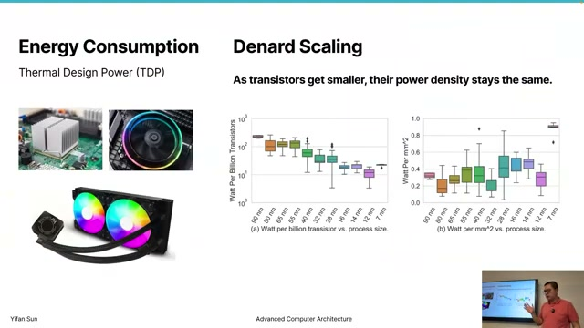

**Dark Silicon effect**: "To stay within TDP, we cannot have the whole chip working at the same time."

Parts of the chip must be turned off or slowed down to keep total power within thermal limits. The chip has "dark" regions — transistors that exist but cannot be powered simultaneously.

**Two techniques to manage power**:

1. **Power gating**: Completely cutting power to unused portions of the chip — cores, caches, registers. "We just do not provide power to part of the chip."

2. **Frequency reduction (throttling)**: Reducing clock speed when the chip gets too hot. "You probably have experienced it — your phone gets too hot and feels really slow. That's exactly this." The phone reduces frequency to reduce power consumption and bring temperature down.

---

## Slide 39 — Moore's Law vs. Dennard Scaling
**Timestamp**: [65:26]

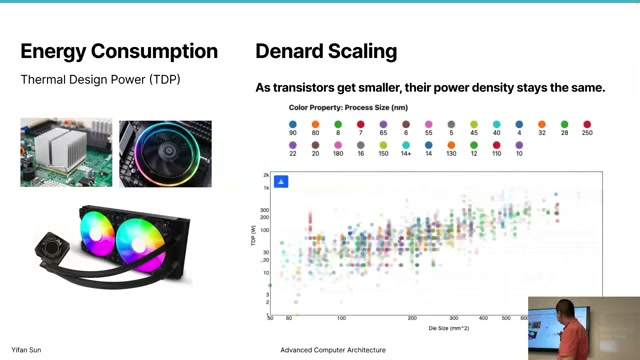

The professor draws a key distinction between the two "laws" that have guided the semiconductor industry:

| | Moore's Law | Dennard Scaling |
|---|---|---|
| **Nature** | Social / market / psychology law | Physics law |
| **Mechanism** | Self-fulfilling prophecy — people expect exponential growth, so they find new ways to deliver it | Device-level metric about power density staying constant |
| **Status** | Still going (via chiplets, 3D stacking, new architectures) | **Breaking down** — dark silicon is the consequence |

**Moore's Law** persists because the market demands it. When one approach reaches its limit, the industry invents new ones (chiplets, new materials, 3D packaging). It is "more like a psychology or business law."

**Dennard Scaling** is closer to an actual physics law — and it is now being violated. This is why novel architectural techniques (power gating, fine-grained power gating, heterogeneous computing) are essential to continue improving performance even as transistors shrink.

---

## Slide 40 — Conclusion & Next Week
**Timestamp**: [65:56] → [67:36] → [68:12] → [69:06]

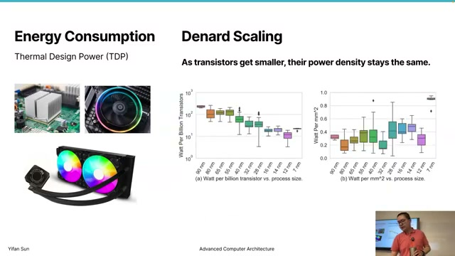
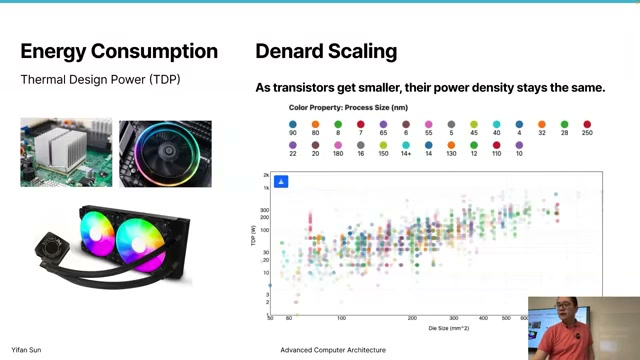
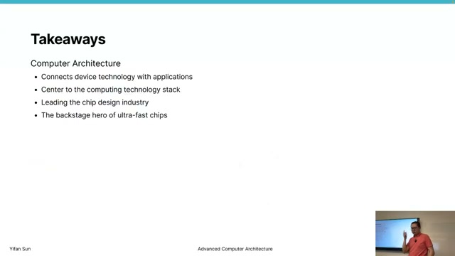
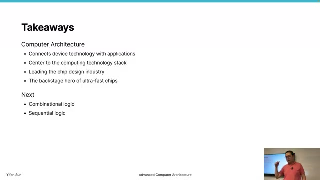

**Key takeaways**:

1. **Computer architecture sits at the center** of the computing technology stack — it bridges device technology (physics, transistors) with applications (AI, software, algorithms).

2. **Computer architects lead the chip design industry** — they look a few generations ahead, decide what features will be valuable and practical, and hand specifications to implementation teams.

3. **It is the "backstage hero" of ultra-fast chips.** "You may think the power comes from smaller and smaller transistors, but to make those transistors work, we face lots of new challenges that require novel architecture solutions."

4. **Novel architectural techniques** — power gating, fine-grained power gating, heterogeneous architectures — are what make 7nm, 5nm, and 3nm technologies actually work in practice.

5. While transistor scaling (Moore's Law) gets the attention, **architectural innovation is equally essential** to turning smaller transistors into faster, more efficient computers.

**Next week**: Combinational logic, sequential logic, and Boolean algebra — the fundamental building blocks of digital design.

---

## Key Terms

| Term | Definition |
|------|-----------|
| **ISA** | Instruction Set Architecture — the stable software-hardware interface |
| **CMOS** | Complementary Metal Oxide Semiconductor — voltage-driven, energy-efficient |
| **Moore's Law** | Transistor count doubles ~18 months (social/market phenomenon) |
| **Dennard Scaling** | Power density constant as transistors shrink (physics, now challenged) |
| **Dark Silicon** | Cannot power entire chip simultaneously due to thermal limits |
| **Power Gating** | Turning off power to unused chip components |
| **TDP** | Thermal Design Power — cooling solution design guideline |
| **Yield** | Fraction of working chips per wafer |
| **Chip Binning** | Selling partially-defective chips as lower-tier products |
| **MCM/Chiplet** | Multiple dies in one package — modern Moore's Law extension |
| **Interposer** | Silicon substrate for in-package chiplet communication |
| **SoC** | System-on-Chip — different IP cores integrated on one die |
| **SoW** | System-on-Wafer — wafer-scale integration (TSMC 2027) |
| **VLSI** | Very Large-Scale Integration |
| **EUV** | Extreme Ultraviolet lithography (by ASML) |
| **BJT** | Bipolar Junction Transistor — current-driven, obsolete for logic |

---

*40 slides extracted via fps=1 frame capture + animation frame deduplication (threshold=0.012, animation window=5s).*
*Transcript: YouTube auto-captions in JSON3 format (1510 sentences).*
