# Lecture 3: Boolean Logic & Combinational Logic

**Video**: [DKVowttUTos](https://www.youtube.com/watch?v=DKVowttUTos) | **Course**: Advanced Computer Architecture, Spring 2026 | **Duration**: ~75 min | **Slides**: 67

---

## Slide 1–2 — Course Context & Motivation
**Timestamp**: [00:01 – 01:44]

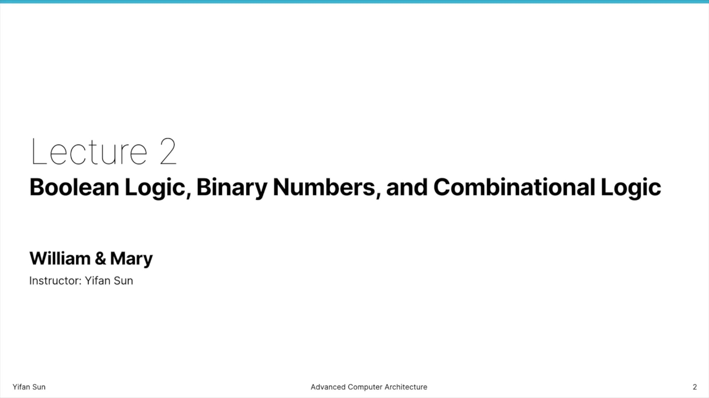
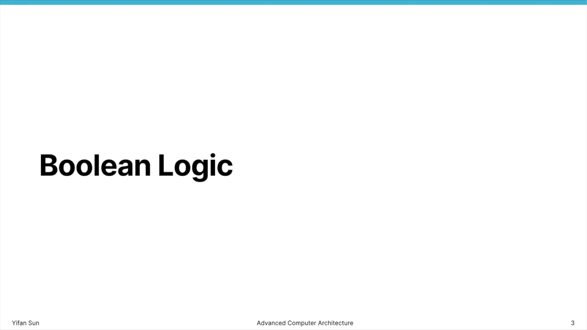

This is a review lecture covering the foundations: Boolean logic, binary numbers, and combinational logic. The professor frames the purpose: this is low-level circuit design knowledge that is essential if you do your own hardware design. But for higher-level architecture research, you may not need this daily — you can treat a cache as a "software algorithm executed in hardware."

**The real purpose**: Remove the "missing feeling" — knowing that complex hardware components (CPU cores, GPU cores, cache units) CAN be implemented at the lowest level, even if it takes months or a team of people. The goal is awareness that these things are feasible.

---

## Slide 3–5 — What is Boolean Logic?
**Timestamp**: [01:44 – 05:18]

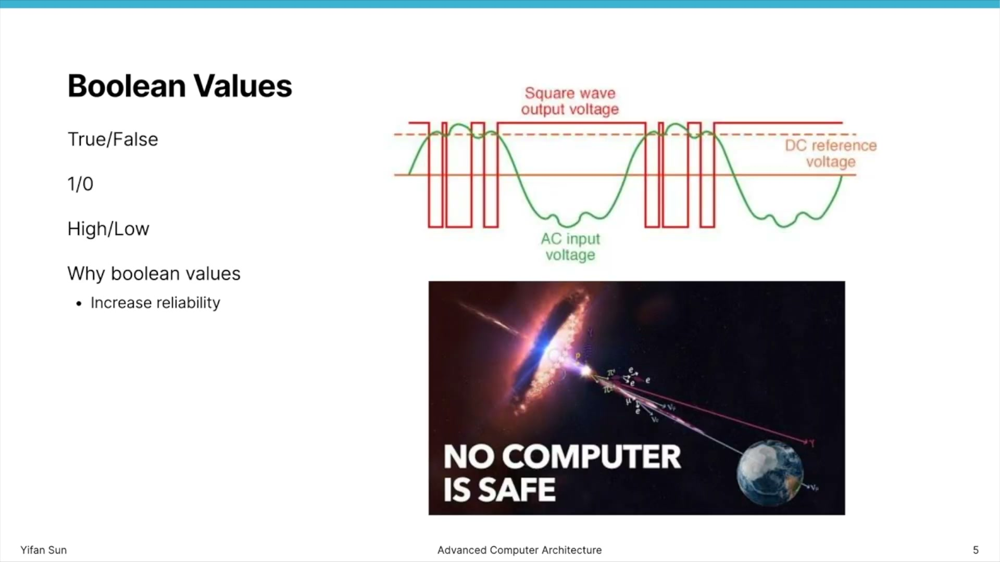
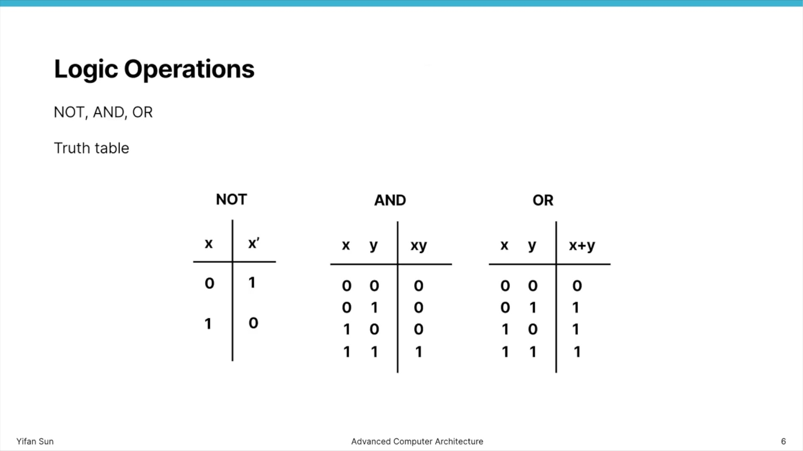
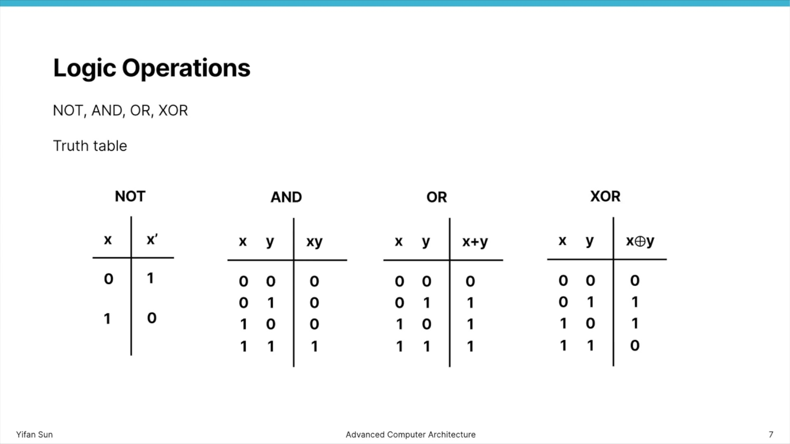

Boolean logic uses true/false (in circuits: 0 and 1). High voltage = 1, low voltage = 0. **Why binary? Reliability.**

**The analog reality**: Although we treat digital logic as discrete 0/1, internally all digital circuits are actually **analog circuits** — continuous voltages with no inherent 0 or 1. A 5V-max signal might arrive at 3.3V — is that a 1? Setting a **threshold** is the most reliable way to decide.

**Could we build non-binary computers?** In principle yes — you could use values 0, 1, 2, 3 (e.g., 0-1V=0, 1-2V=1, >2V=2). Prototypes exist but are "not that simple, not that easy." The transistor's natural strong shutdown and conduction characteristics make binary simple — use 0 and 1 to control whether a transistor is connected.

**Reliability concern — Cosmic rays**: Transistors maintaining high/low states are only "a few electrons" or "a few atoms" wide. High-energy particles from space can hit your CPU/GPU and **flip a bit**, corrupting data. Having more than two values makes such flips more likely because voltage margins are tighter. This is a real concern for aviation, space, and supercomputing.

---

## Slide 6–8 — Basic Logic Operations: NOT, AND, OR, XOR
**Timestamp**: [04:58 – 08:09]

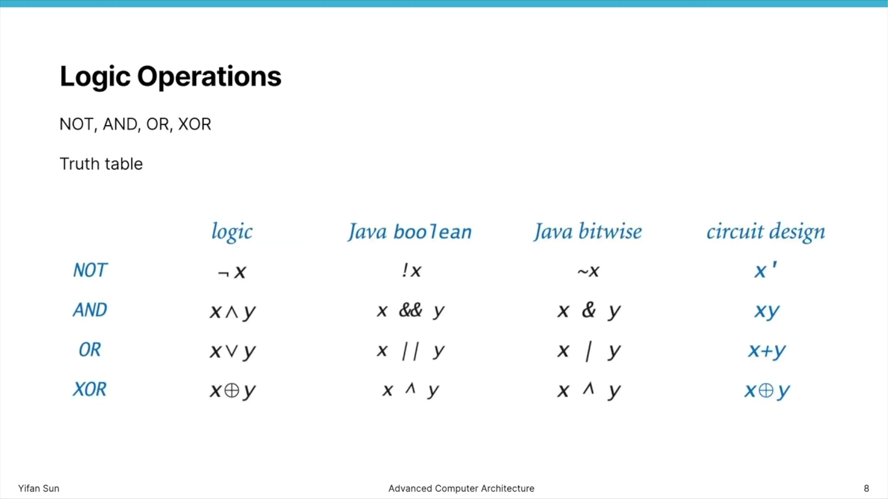
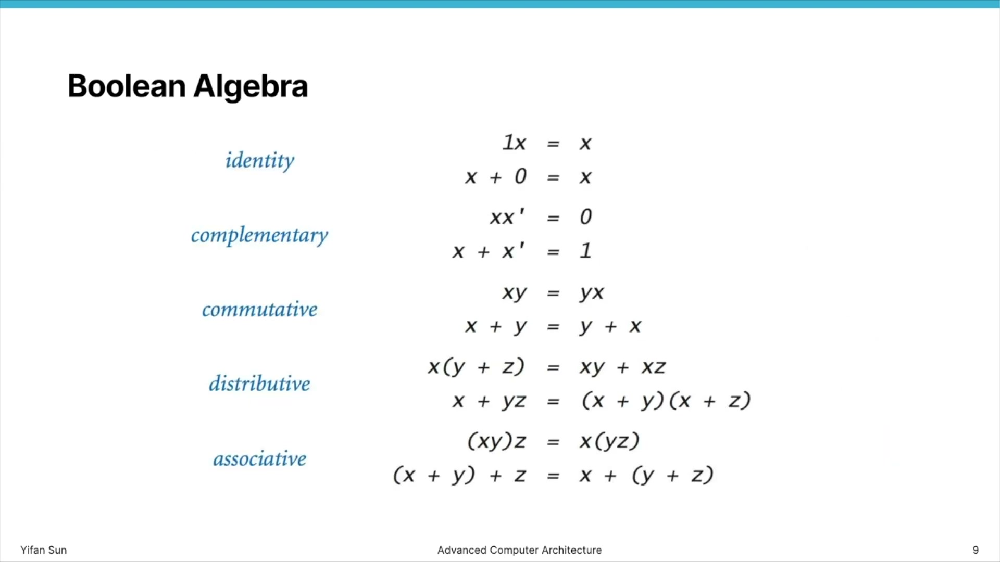
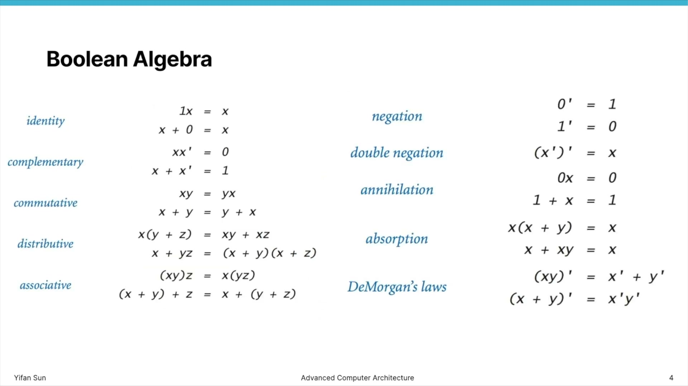

### Truth Tables for Basic Gates:

**NOT gate**: Input 0 → Output 1; Input 1 → Output 0. Represented with prime: X'

**AND gate**: Output = 1 **only if** both inputs are 1. Represented as XY (like multiplication — "anything times zero is zero").

**OR gate**: Output = 1 if **any** input is 1. Represented with `+`. **⚠️ Critical difference from arithmetic**: In Boolean logic, 1 + 1 = **1** (not 2).

**XOR (eXclusive OR)**: Output = 1 if inputs are **different**, 0 if same. XOR can be built from AND/OR/NOT — it's a convenient shorthand, not a primitive. Truth table: (0,0)→0, (0,1)→1, (1,0)→1, (1,1)→0.

---

## Slide 9–11 — Boolean Algebra Rules
**Timestamp**: [06:36 – 10:46]

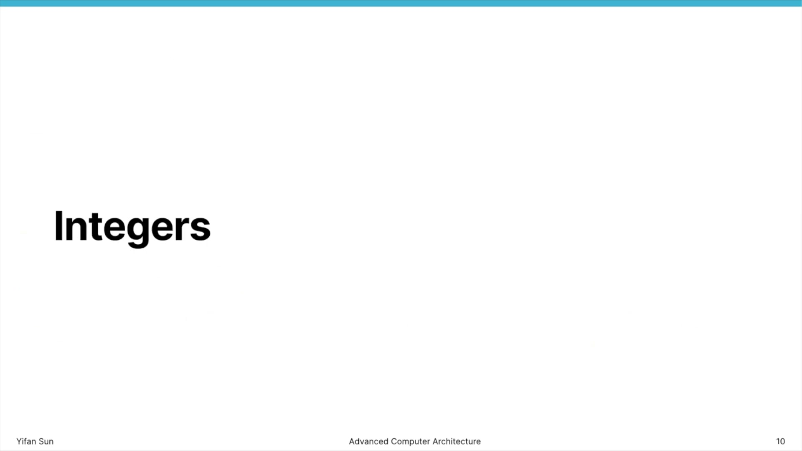
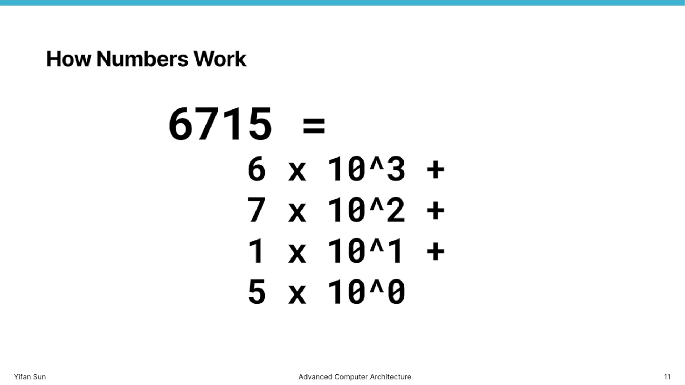
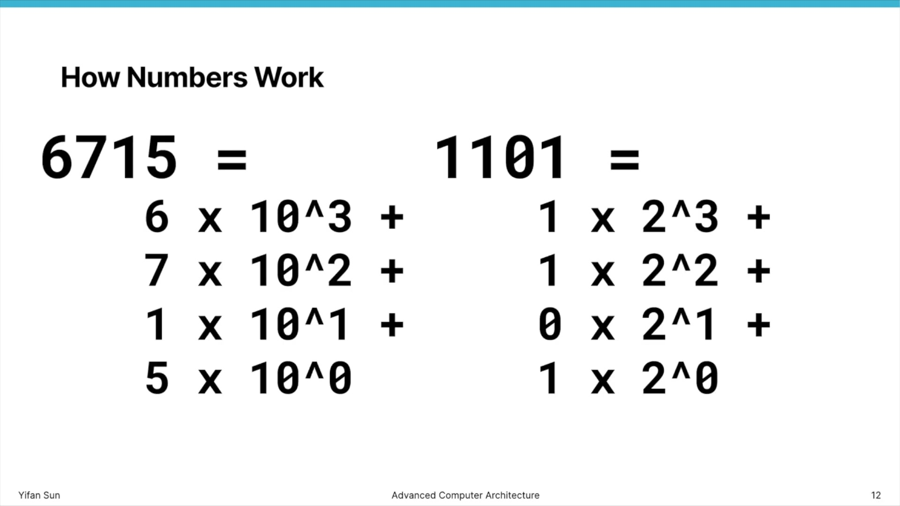

The professor presents fundamental Boolean algebra laws (all provable by truth table enumeration):

1. **Identity**: 1·X = X; 0 + X = X
2. **Complement (Inverse Law)**: X·X' = 0; X + X' = 1
3. **Commutative & Associative**: Same as arithmetic
4. **Involution (Double Negation)**: (X')' = X
5. **Absorption**: X·(X+Y) = X; X + (X·Y) = X — "If X is already there, Y is not useful"
6. **De Morgan's Law** (singled out as "super useful"): (X+Y)' = X'·Y'; (X·Y)' = X' + Y'

**De Morgan's in programming**: The professor says he uses De Morgan's even when writing software (C, Java, Go, JavaScript) to simplify complex `if` conditions with many parentheses.

**Proof method**: List the truth table (at most 4 rows for 2 variables, 8 for 3). If both sides match in every row, the law is proved. No more sophisticated proof needed.

---

## Slide 12–16 — Binary Numbers: Base-2, Shifts, Addition
**Timestamp**: [09:47 – 16:29]

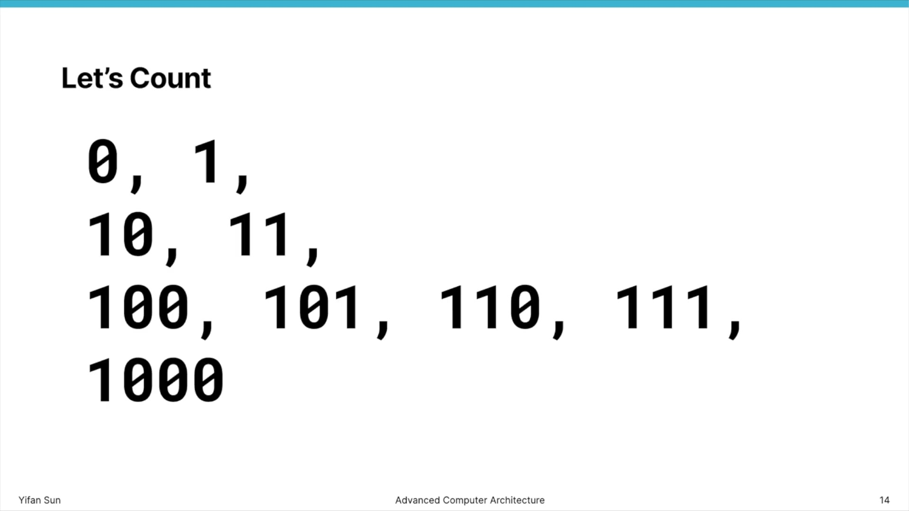
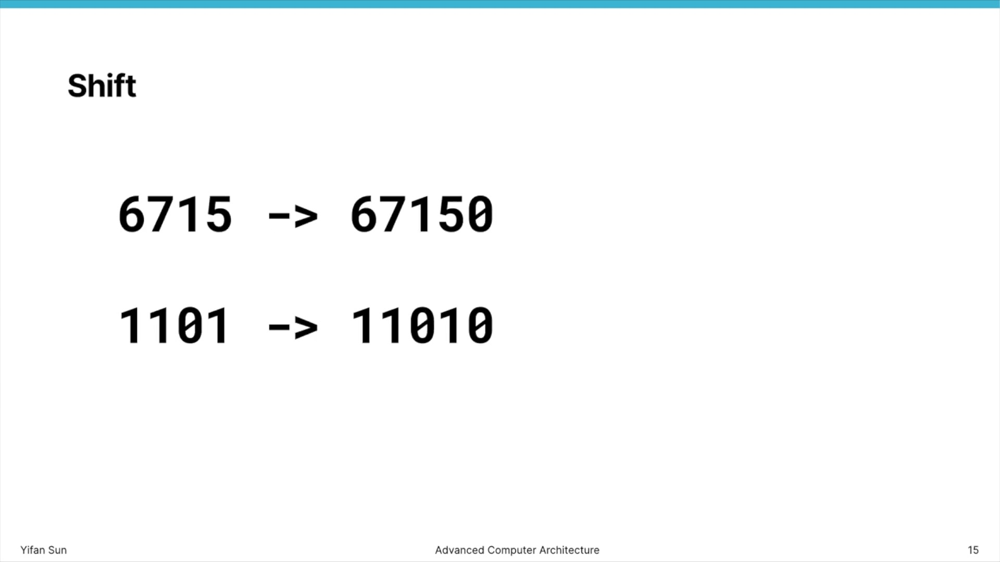
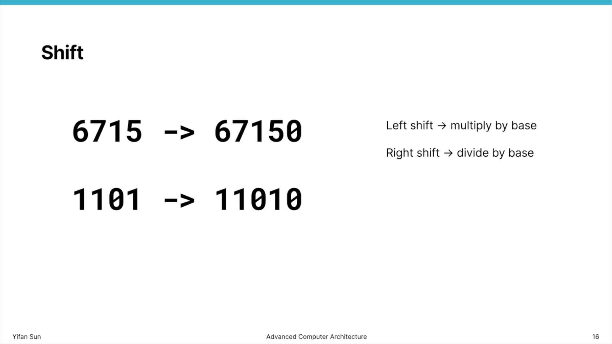
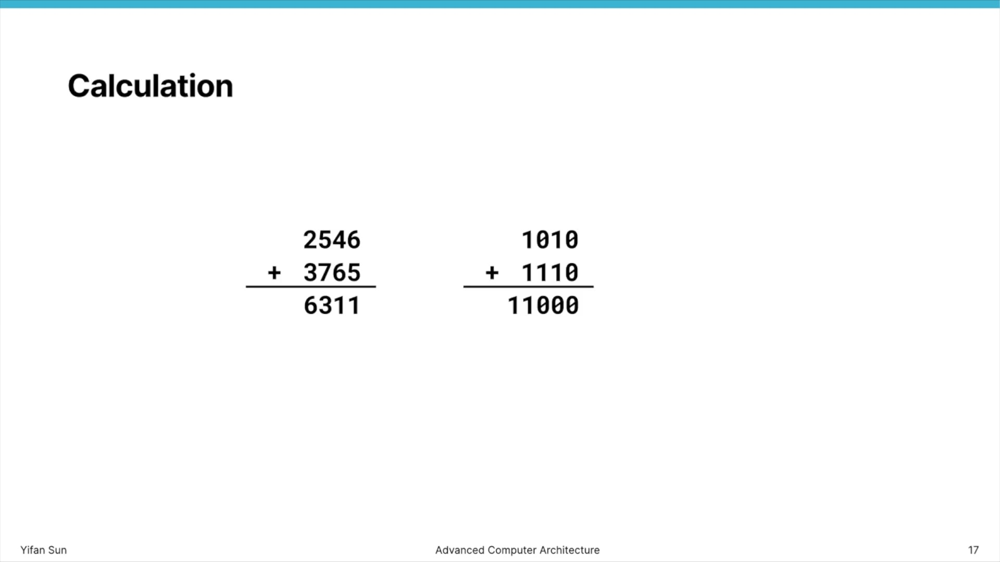
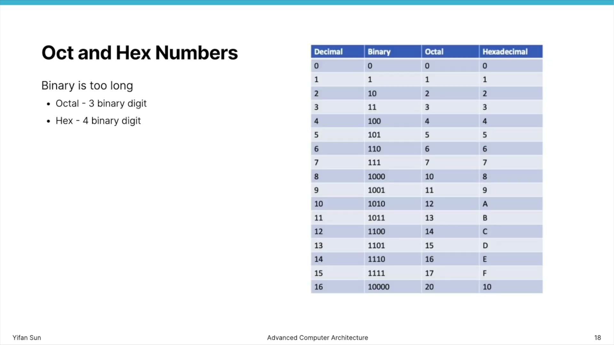

### Binary as Base-2 Positional Notation

Decimal 527 = 5×10² + 2×10¹ + 7×10⁰. Binary works identically with base 2: 1101₂ = 1×8 + 1×4 + 0×2 + 1×1 = 13₁₀.

**Student interaction**: A student converts 1101 to decimal with the professor's guidance.

**Professor's practical trick**: "I'm too lazy for formal conversion." Count from known anchor points: 100₂=8, 101₂=9, 110₂=10, 111₂=11, 1000₂=12...

### Shift Operations (critical for computer architecture)

- **Left shift by 1** = multiply by 2 (add a zero at the end)
- **Left shift by N** = multiply by 2^N
- **Right shift by 1** = divide by 2 (with rounding down)
- This follows from the base: in decimal, shifting adds/multiplies by 10; in binary, by 2
- Almost every computer architecture supports shift operations natively

### Binary Addition

Same rules as decimal, but base 2:
- 0+0=0, 1+0=1, 0+1=1
- 1+1=**0, carry 1** (i.e., 10₂ = 2₁₀)
- 1+1+1=**1, carry 1** (i.e., 11₂ = 3₁₀)

The professor notes this foreshadows adder design: to build a binary adder, you add three digits (two operands + carry-in), list all possible input combinations in a truth table, and express results as combinational logic.

---

## Slide 17–18 — Hexadecimal, Octal, Bits & Bytes
**Timestamp**: [14:22 – 18:57]

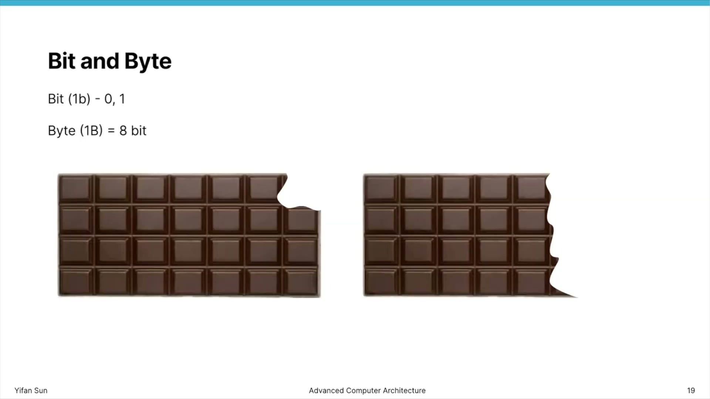
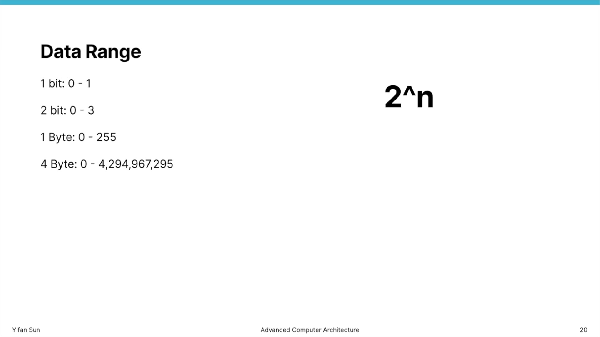

### Hexadecimal (Base-16)
- Digits: 0-9 then A=10, B=11, C=12, D=13, E=14, F=15
- **Binary → Hex**: Group 4 binary digits, convert each group. Much more concise!
- **Binary → Octal**: Group 3 binary digits
- Example: FFFF is much shorter than 1111111111111111

### Bits, Bytes, and Data Range
- **Bit**: Smallest unit (0 or 1)
- **Byte**: Historically debated (4, 5, or 8 bits), converged to **8 bits**
- 1 byte → 0 to 255 (256 values)
- 4 bytes (32 bits) → ~4 billion values

**Why 32-bit machines max at 4 GB**: 32-bit addresses, each pointing to a byte. 2^32 = ~4 GB. "Even phones migrated from 32 to 64 bits." Adding one bit doubles the range. 64-bit = "almost unlimited by today's standards" — but the professor speculates in 10 years even that may be limiting.

---

## Slide 19–23 — Representing Negative Numbers
**Timestamp**: [18:57 – 36:12]

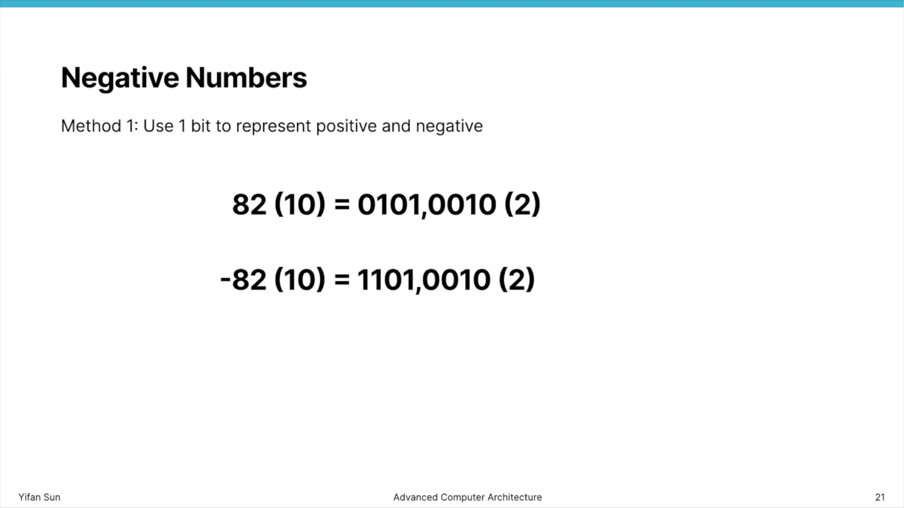
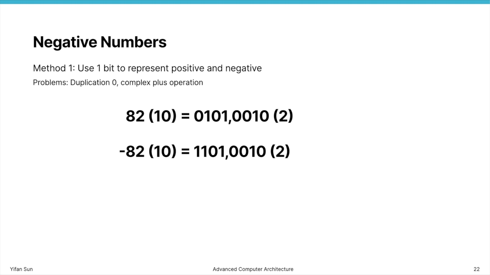
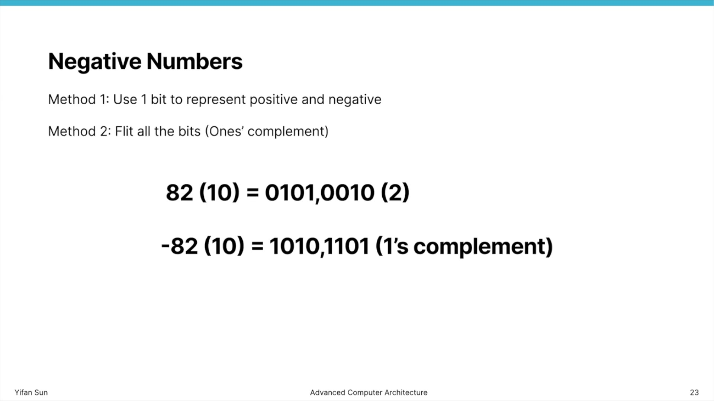
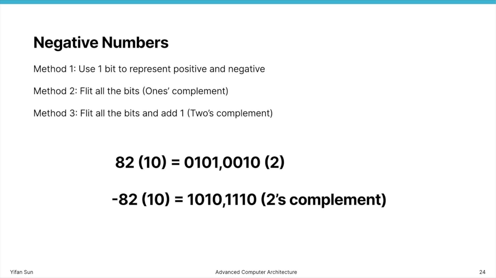
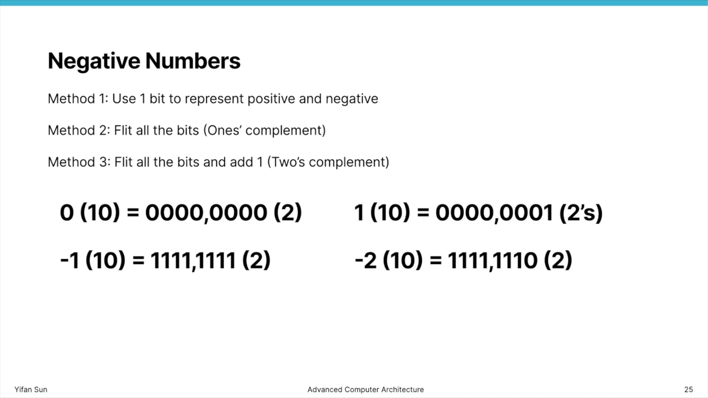

### Method 1: Sign-Magnitude
Dedicate the most significant bit to sign (0=+, 1=−), remaining bits = magnitude. **Intuitive but two problems**:
1. **Duplicate zero**: +0 (0000) and −0 (1000) — wasteful
2. **Three separate circuits needed**: positive+positive, negative+negative, and positive+negative each need different logic. "Really annoying."

### Method 2: One's Complement
Flip ALL bits for negative. Still uses MSB as sign. Still doesn't solve the multiple-circuits problem. "I don't know why one's complement is still there."

### Method 3: Two's Complement (The Standard)
**Flip all bits, then add 1.** "Very counterintuitive at the beginning."

Example for −82 in 8 bits:
- +82 = `01010010`
- Flip: `10101101`
- Add 1: `10101110` = representation of −82

**Why two's complement wins**:
1. **Single zero**: 00000000 = 0. No negative zero.
2. **−1 = all ones** (11111111)
3. **Natural underflow**: 0 − 1 = 11111111 (wraps around naturally)
4. **Unified addition circuit**: Same adder works for signed AND unsigned!

**Demonstration — 1 + (−1) = 0**:
```
  00000001 (+1)
+ 11111111 (−1)
-----------
 100000000  → discard carry → 00000000 = 0 ✓
```

**The PhD-level insight**: Early computers had very limited devices. They "tweaked the numbering system a lot" so a single circuit works for both positive and negative — no special-casing needed. The same bit pattern means different things depending on encoding: `11111111` = 255 (unsigned) or −1 (signed). "Your memory is just a huge list of 4 GB × 8 zeros and ones. How you use those numbers depends on your program."

**Signed byte range**: −128 to +127 (asymmetric because 0 counts as positive). Largest: 01111111=127. Smallest: 10000000=−128.

---

## Slide 24–27 — IEEE 754 Floating Point
**Timestamp**: [26:19 – 34:00]

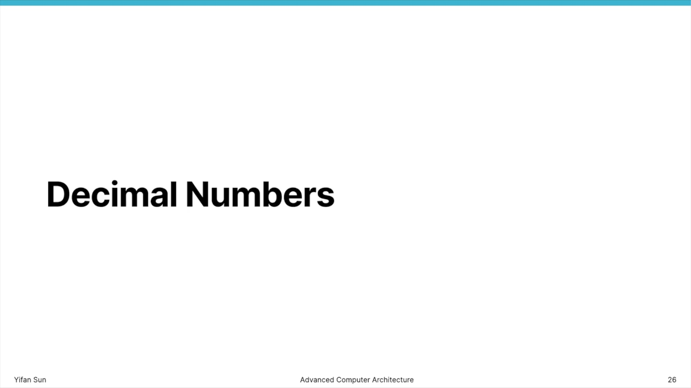
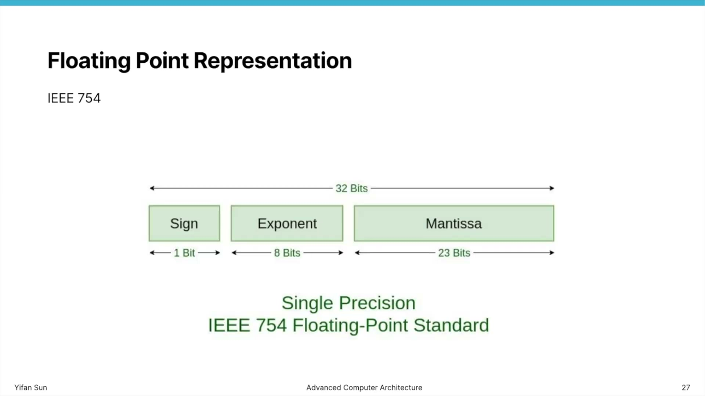
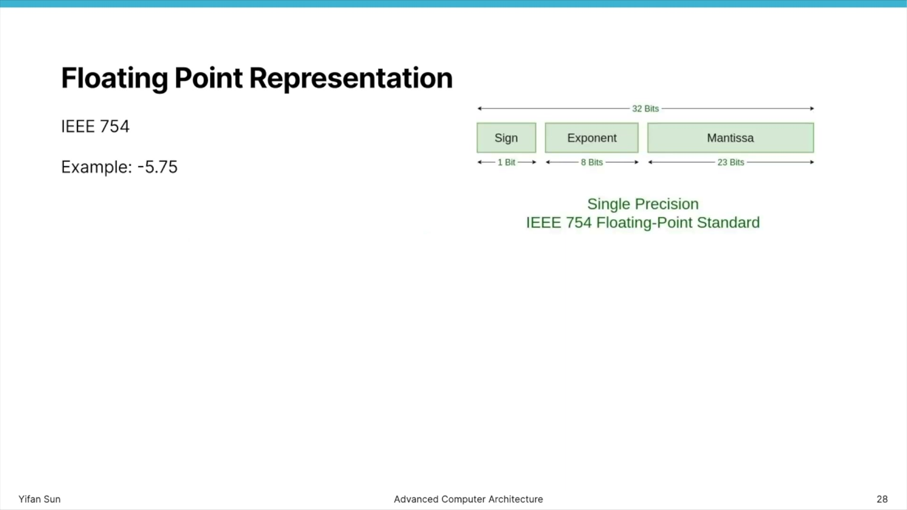
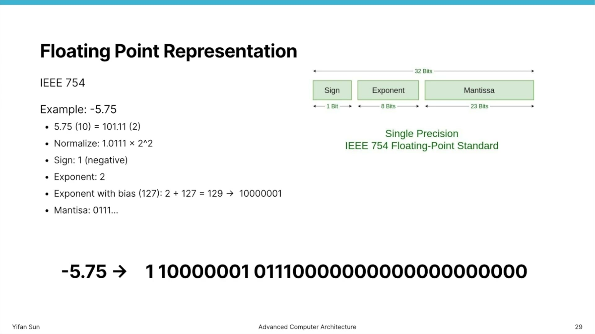

### Encoding −5.75 in IEEE 754 Single Precision (32-bit)

**Format**: 1 sign | 8 exponent (biased by 127) | 23 mantissa

**Step-by-step**:
1. **Convert to binary**: 5 = 101. 0.75 = 0.11 (2⁻¹=0.5 + 2⁻²=0.25). So 5.75 = 101.11₂
2. **Normalize**: 1.0111 × 2² (one digit before radix point, base 2)
3. **Sign bit** = 1 (negative)
4. **Exponent** = 2 + bias(127) = 129 = `10000001`
5. **Mantissa** = fractional part `0111...` (leading 1 is **implicit** — not stored, saves one bit!)
6. **Final**: `1 10000001 01110000000000000000000`

### Float vs Integer: Same Bit Count, Different Distribution

**Student Q&A**: "Which can represent more numbers — 32-bit int or 32-bit float?"
**Answer**: Both can represent 2^32 values (same number of bit patterns). The difference: float covers a **huge range** (2^127) but with **gaps** — precision is sacrificed for range. Large numbers cannot be exact.

### The Floating-Point Precision Problem
- 12/4 might give 3.0 or 2.9999999999999
- Apply `floor()` → could get 2 or 3 — correctness hazard!
- Professor: "I have been struggling with this type of problem for a very long time when developing simulators"

**Special cases**: +0, −0 (still has the double-zero problem), +∞, −∞, **NaN** (Not a Number — for 0/0, which would crash an integer program but allows float programs to continue).

---

## Slide 28–33 — GPU Precision Tiers & Low-Precision Formats
**Timestamp**: [34:00 – 41:45]

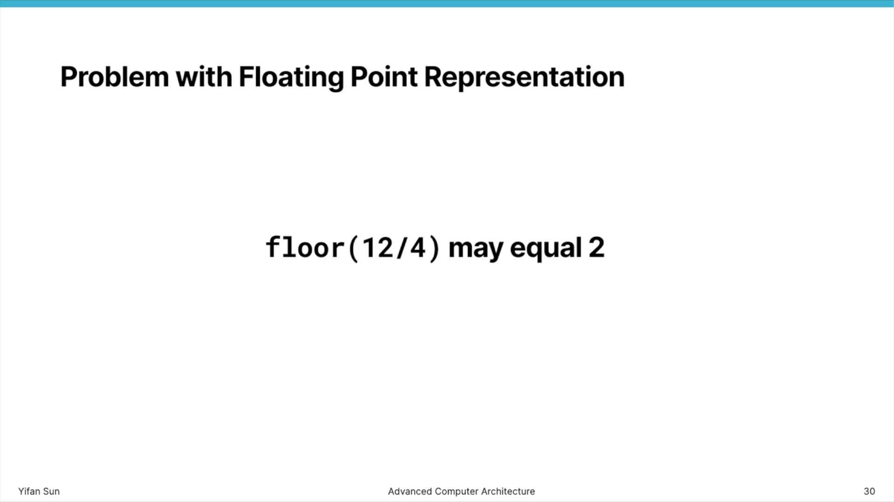
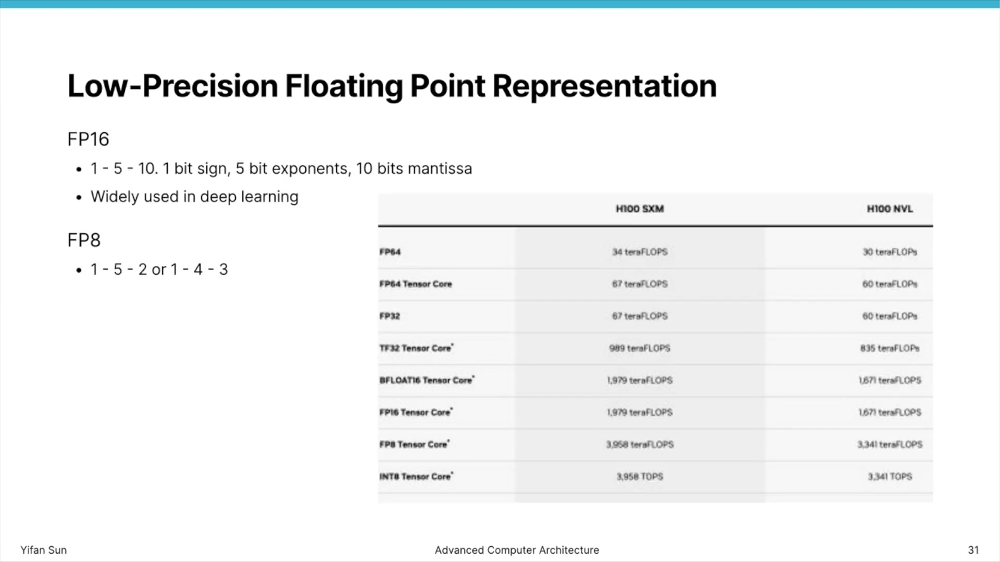
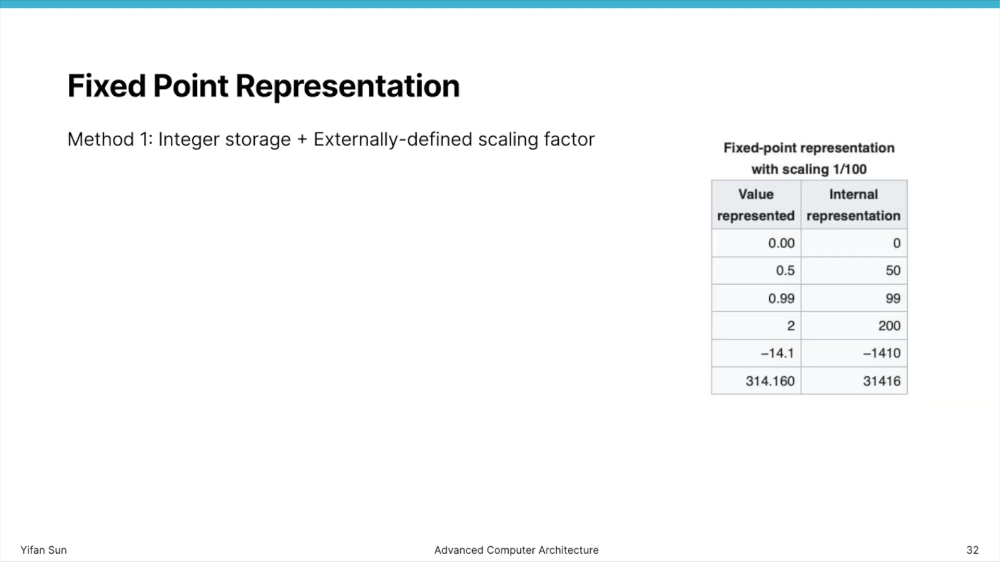
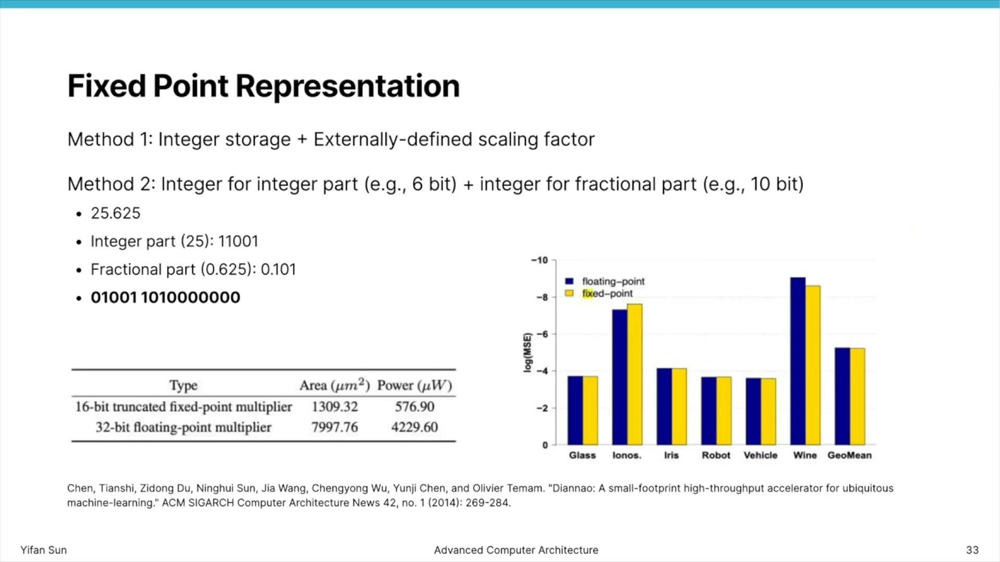
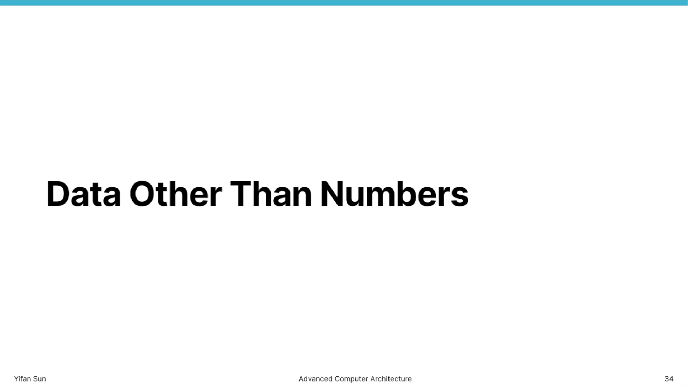
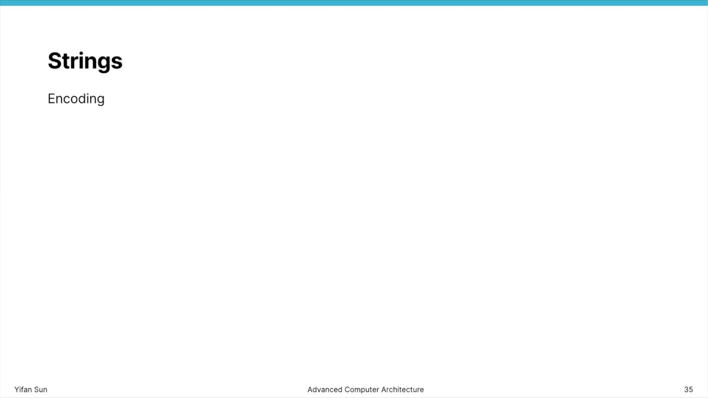

### NVIDIA H100 Performance by Precision

| Format | Throughput |
|--------|-----------|
| FP64 | ~30 TFLOPS |
| FP32 | ~60 TFLOPS |
| TF32 | ~120 TFLOPS |
| FP16 | ~240 TFLOPS |
| FP8 | ~480 TFLOPS |

**Each time you halve the bit-width, you roughly double throughput.** Gaming GPUs often omit FP64 entirely — unnecessary for rendering.

**FLOPS terminology**: FL = Floating Point, OP = Operation. Lowercase "s" = plural (flops = count of operations). Uppercase "S" = per second (FLOPS = rate). The professor notes the slide he screenshotted mixed them up — "really annoying."

### FP16, FP8, FP4 Formats

- **FP16** (half precision): 1 sign, 5 exponent, 10 mantissa. Widely used in deep learning.
- **FP8**: Two variants — **E5M2** (more range, 2-bit mantissa) and **E4M3** (smaller range, 3-bit mantissa, better precision). Used in modern LLM training/inference.
- **FP4**: Only 4 bits total. With 2 exponent bits → 4 possible exponent values (~0.25, 0.5, 0.75, 1.0). Extremely limited but sufficient for some compressed workloads.

**The trend**: Machine learning flipped the priority — from demanding MORE precision to demanding LESS precision but MORE throughput.

---

## Slide 34–38 — Fixed-Point Representation
**Timestamp**: [37:50 – 45:46]

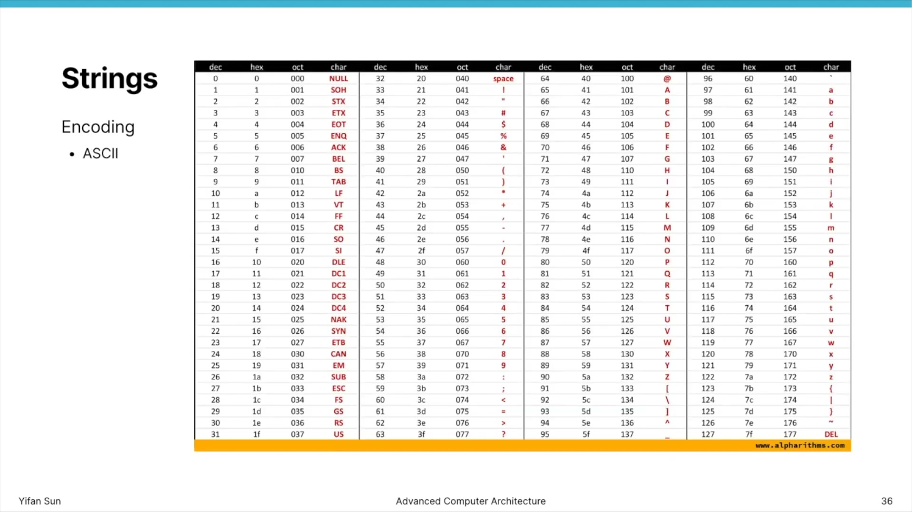
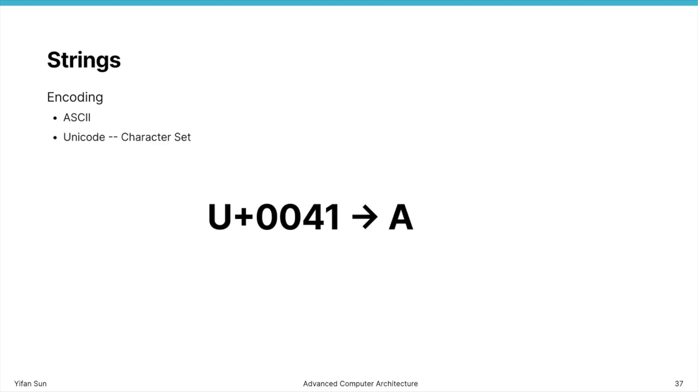
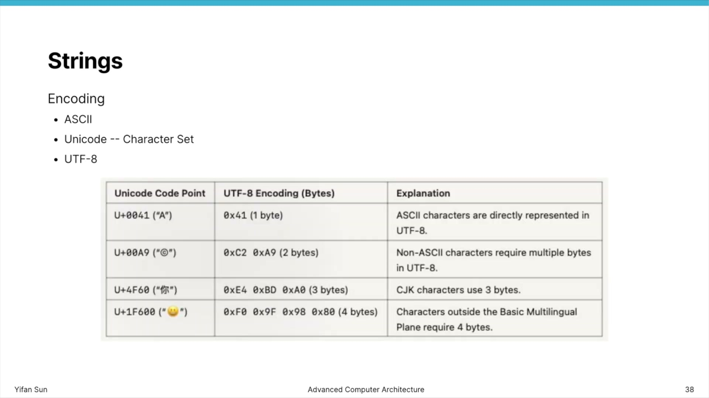
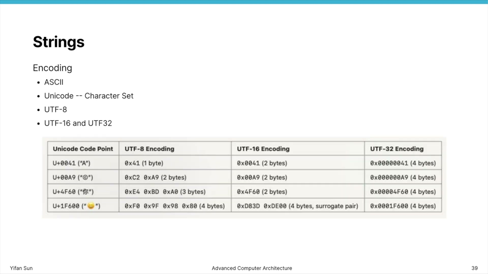
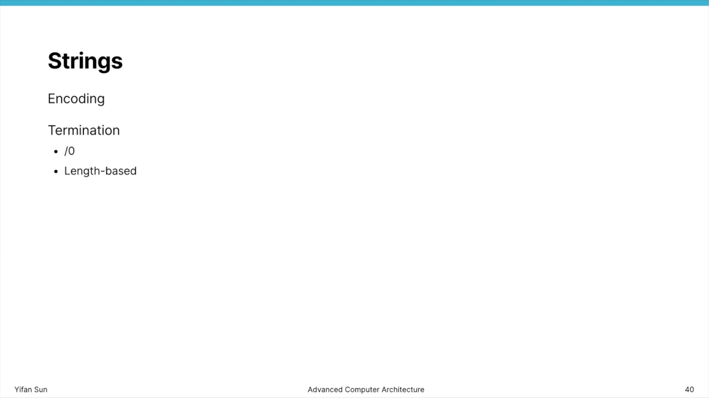

When you know the number range in advance (e.g., ML activations fall within −2 to 2), you don't need floating point's flexibility. **Fixed-point**: store as integer with an implicit scaling factor.

- Method 1: Store 50 with scale 1/100 → actual value = 0.5
- Method 2: Split bits — 6 for integer part, 10 for fraction

**Benefits**: Fewer bits → smaller area, lower power. Used in mobile neural engines.

**Key architecture principle**: "There's typically no best way to solve a problem. You find a particular problem, observe the characteristics and uniqueness, then find a solution." Machine learning's known number ranges make fixed point suitable.

---

## Slide 39–41 — String Encoding: ASCII, Unicode, UTF-8
**Timestamp**: [41:33 – 48:02]

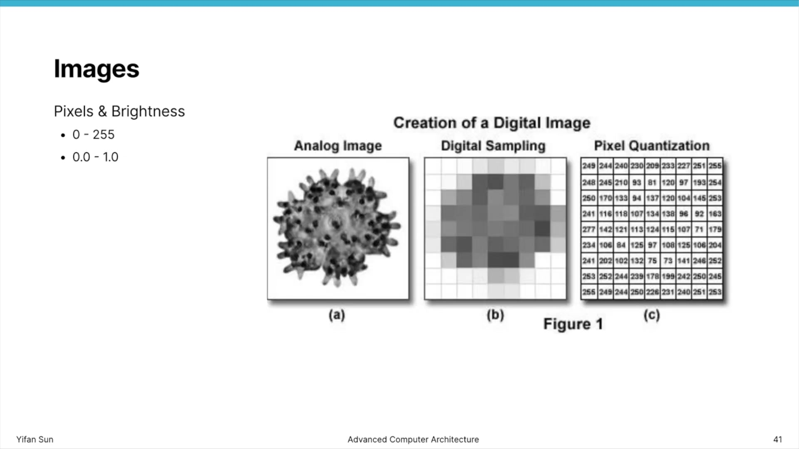
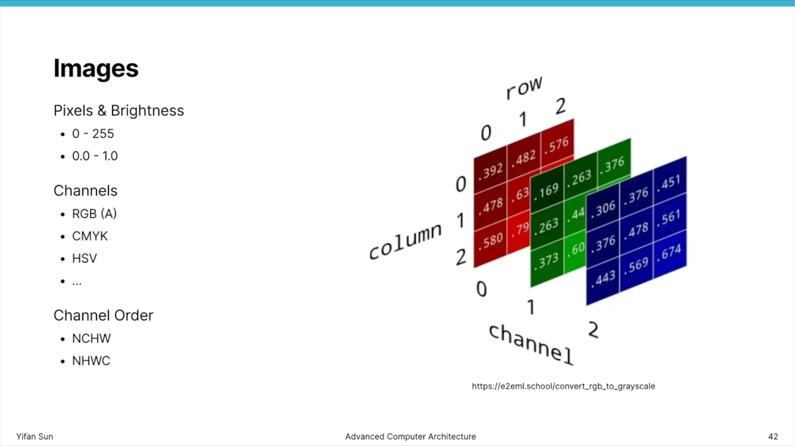
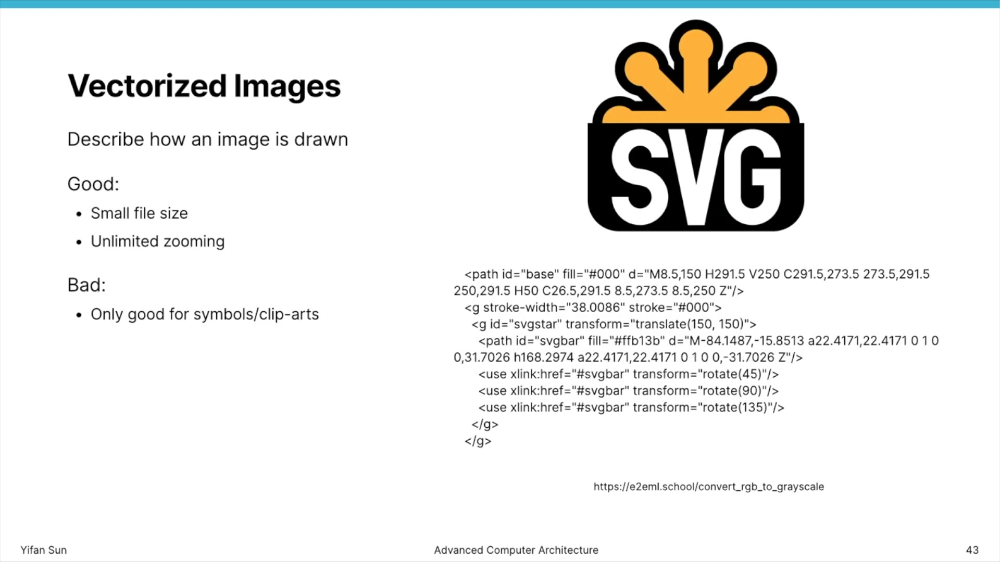

### ASCII
128 characters (7 bits). 'M' = 77. Predefined consensus worldwide. **Problem**: Only English — no accented characters, no CJK.

### Unicode ≠ Encoding
Unicode is a **character set**: it assigns a number (codepoint) to every character. You must petition the Unicode Consortium to add new emoji. It is NOT an encoding — it's a catalog.

### UTF-8 (The Web Standard)
Variable-length: 1, 2, 3, or 4 bytes per character.

**How variable length works**: The first byte's leading bits signal the length:
- Starts with `0` → 1-byte (ASCII compatible!)
- Starts with `110` → 2 bytes
- Starts with `1110` → 3 bytes
- Starts with `11110` → 4 bytes
- Continuation bytes start with `10`

This makes UTF-8: (1) compact for English, (2) self-synchronizing, (3) backward-compatible with ASCII.

**Student Q**: "Why UTF-16 for CJK?" — Chinese/Japanese characters need 3 bytes in UTF-8 but only 2 in UTF-16. UTF-8 is still most common.

### String Termination
1. **Null-terminated** (C): Zero byte marks end — "causes many pain points"
2. **Length-prefixed**: Integer prefix for string length — modern, safer

---

## Slide 42–45 — Images, Audio & Universal Digital Representation
**Timestamp**: [45:45 – 51:41]

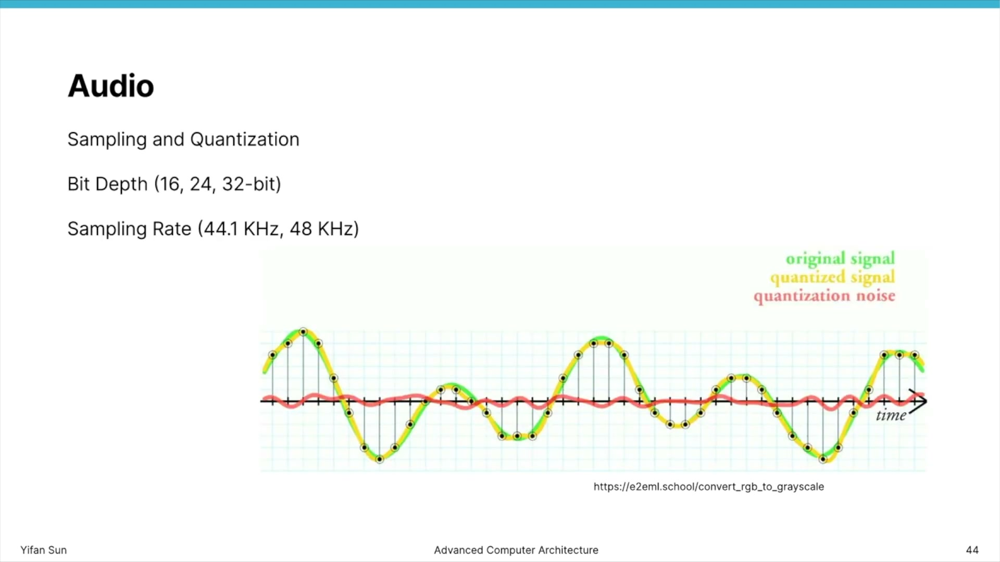
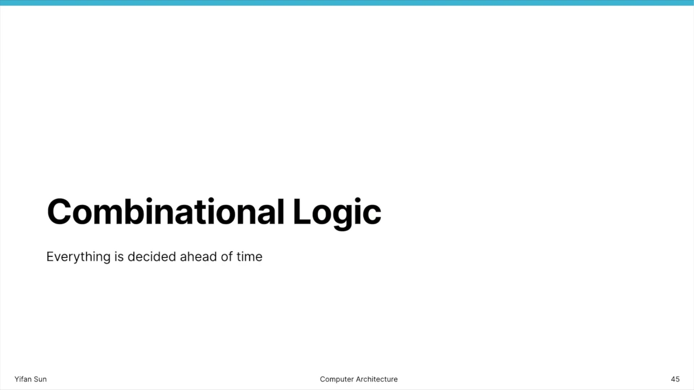
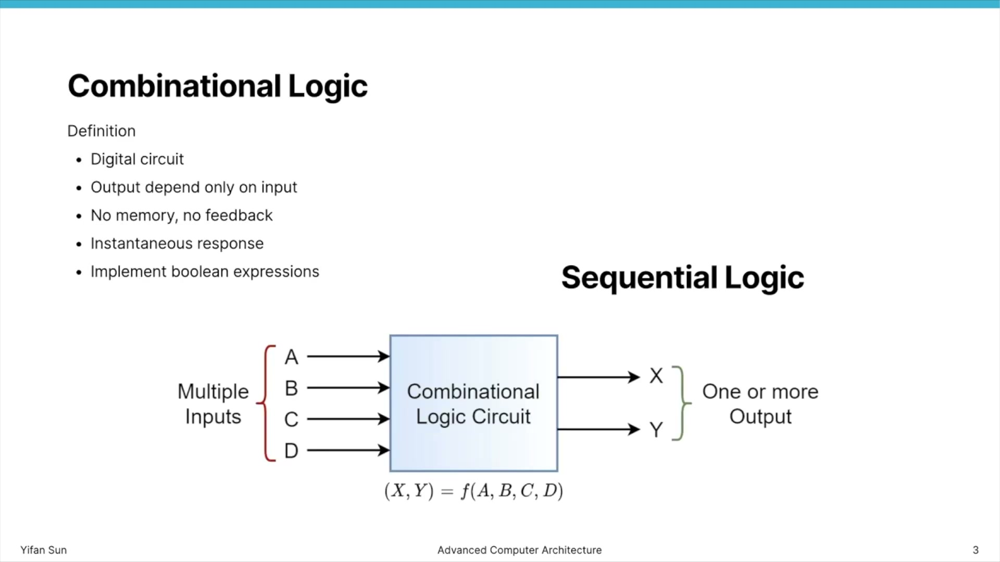
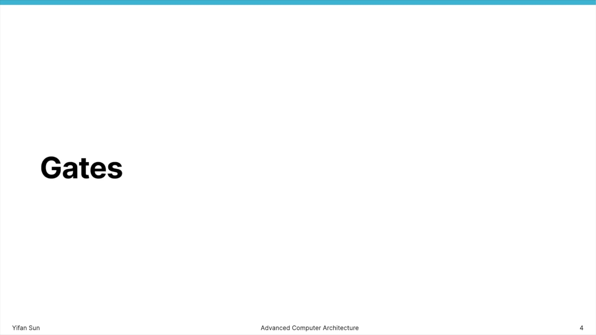

### Images
- **Pixels**: Brightness as 0-255 integer or 0.0-1.0 float. ML prefers floats; storage prefers integers.
- **Color (RGB)**: Three channels for human eyes' three cone cell types. Interesting fact: a type of shrimp has 22 cone cell types → 22-dimensional color space!
- **Memory layout matters for GPU performance**:
  - **NCHW**: Channel-first (all R, then all G, then all B)
  - **NHWC**: Channel-last (R,G,B per pixel interleaved)
  - Different layouts → "very different performance" on GPUs
- **Vector graphics (SVG)**: Coordinates and paths, no pixels. Infinite zoom. Not for photos.

### Audio
- **Sampling**: Taking periodic snapshots of analog waveform
- **Quantization**: Approximating each sample to nearest digital value
- Nyquist principle: sample at ≥2× max frequency. Humans: 20Hz–20kHz → ≥40kHz sampling
- CD: 44.1kHz; Digital media: 48kHz; Professional: up to 384kHz

### The Universal Principle (Key Takeaway)
> "Pretty much everything in our world can be represented by digital values — by pure binary numbers. If we know how to convert a binary number to another binary number, then we can design circuits to process things and to automate things. That's how the computer was designed at the very root level."

---

## Slide 46–48 — Introduction to Combinational Logic
**Timestamp**: [48:44 – 56:29]

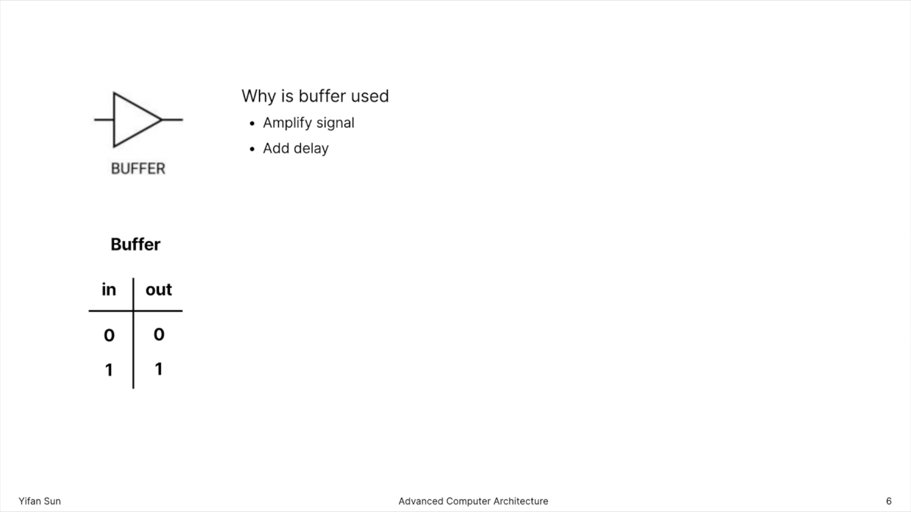
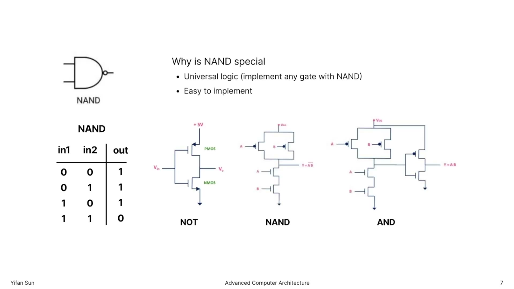
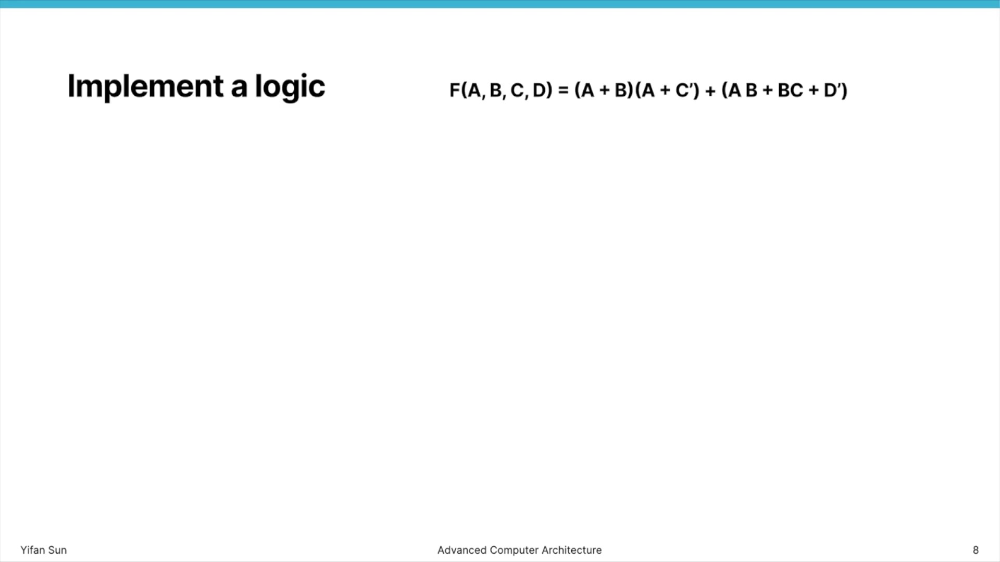

### Combinational Logic Definition

**vs. Sequential Logic**:
- **Combinational**: Result instant, no memory
- **Sequential**: Needs time, has state/memory (next lectures)

**Defining properties**:
1. Digital circuit (0s and 1s, gates)
2. Output depends **only on current inputs** — deterministic
3. **No memory, no feedback** — results don't feed back for next cycle
4. **Instantaneous response** — at architecture level, treated as zero time
5. Implements **Boolean expressions** using AND, OR, NOT

**Practical timing**: At 1 GHz, one cycle = 1 nanosecond. All combinational logic must settle within that cycle. This is more of an EE/digital-design concern, but as architects: "you cannot do too many things in one cycle."

---

## Slide 49–53 — Logic Gates & NAND Universality
**Timestamp**: [51:40 – 60:32]

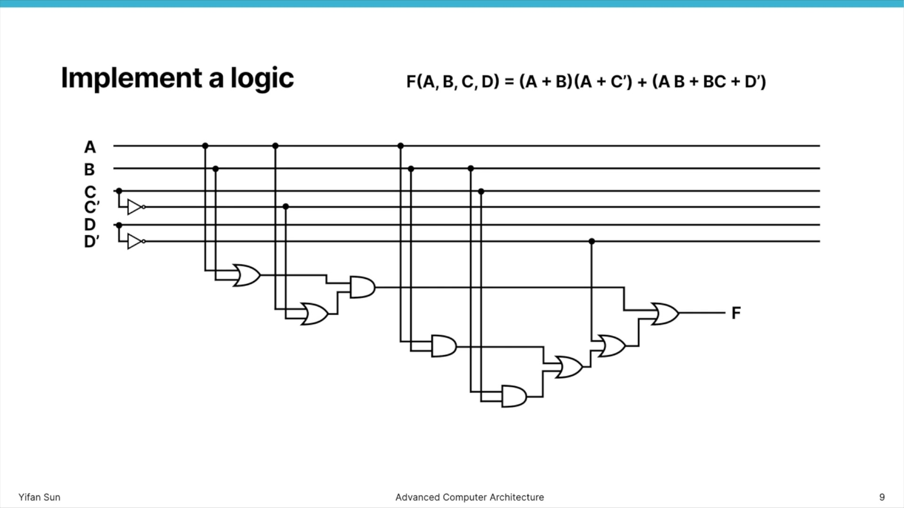
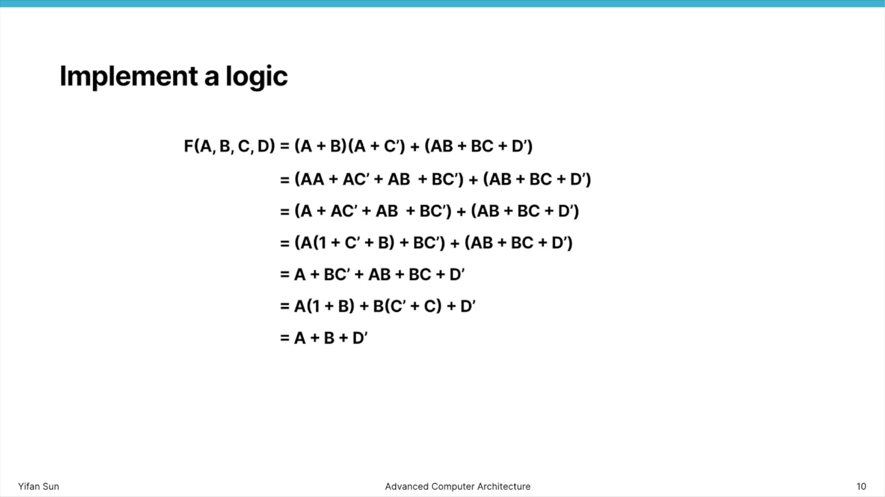


### Gate Symbols
- **AND**: Round front | **OR**: Angled front | **NOT**: Triangle + circle (bubble)
- **Buffer**: Triangle only (output=input) — used for intentional delay on paths with fewer gates
- **NAND**: AND + bubble | **NOR**: OR + bubble
- **XOR**: OR + extra curved line behind | **XNOR**: XOR + bubble
- **Bubble on input**: Invert before feeding into gate (saves drawing a separate NOT gate)

### The NAND Gate — The Universal Gate

**In real CMOS chip design, only NAND gates are actually used.** Why?
- NAND = only **4 transistors** (smallest, most efficient)
- AND = NAND + NOT (6+ transistors)
- NAND is **functionally complete** — any Boolean operation can be built from NAND gates alone
- Optimizing around NAND gates significantly reduces die size and power consumption
- In practice, there is effectively no "NOT gate" — just NAND gates configured differently

---

## Slide 54–58 — Circuit Drawing & Boolean Simplification
**Timestamp**: [56:01 – 64:57]


### Circuit Drawing Methodology
1. Put all possible inputs on top ("wires on the ceiling")
2. Drag wires down as needed
3. Work through expression gate by gate

### Why Simplify?
"Gates are not free — they have die size and consume energy when they flip." **Goal: minimize gates → reduce energy and chip area.**

**Example**: A complex expression `(A OR B) AND (A AND C') OR ...` simplifies to just `A + B + D'`. C doesn't even matter — it cancels out entirely! Simplified circuit: 2 OR gates + 1 NOT gate vs. many gates in the original.

### Two Canonical Forms
- **Sum of Products (SOP)**: AND gates → final OR gate (e.g., ABC + BCD')
- **Product of Sums (POS)**: OR gates → final AND gate

---

## Slide 59–61 — Deriving Logic from Truth Tables (Sum of Products)
**Timestamp**: [58:42 – 62:53]


### The SOP Method (XOR Example)

1. Write the truth table
2. Find all rows where **output = 1**
3. For each such row, write a **product term**: input=1 → variable; input=0 → variable'
4. OR all product terms together

**XOR**: (0,1)→1 and (1,0)→1

| X | Y | Output | Product Term |
|---|---|--------|-------------|
| 0 | 1 | 1 | X'Y |
| 1 | 0 | 1 | XY' |

**Result**: XOR = X'Y + XY'

Implementation: 2 AND gates + 1 OR gate + NOT gates for complements. The professor: "At the beginning I really didn't feel comfortable about this. Just see more examples and eventually you'll get comfortable."

---

## Slide 62–66 — Karnaugh Maps (K-maps)
**Timestamp**: [62:29 – 72:33]


K-maps are a **visual** method for Boolean simplification — an "ancient way," now done by computer programs.

### How K-maps Work
1. Draw grid — **adjacent cells differ by only one bit** (Gray code ordering)
2. Fill in 1s from truth table
3. Circle adjacent 1s in **rectangular blocks** (1, 2, 4, or 8 cells)
4. Each circle → one product term. Variables that **don't change** within circle → kept. Variables that change → eliminated.

### 3-Variable Example
Two adjacent cells with A=0, B=0, C differing (C and C') — C cancels, leaving **A'B'**.

### Circling Rules
1. Fewest circles to cover **all** 1s
2. Rectangular only (no L-shapes)
3. No zeros inside circles
4. Circles as large as possible (powers of 2)
5. **K-map wraps around edges** — it's a torus/donut (top↔bottom, left↔right connect)
6. A 1 may be circled multiple times
7. **Don't-care (X)**: Treat as 1 if it enlarges a circle, 0 otherwise

**Professor's exam note**: "I won't put K-maps on the quiz. I don't think it's useful today. I just want you to know it's possible."

---

## Slide 67 — Seven-Segment Display Decoder Example
**Timestamp**: [70:04 – 74:26]


A practical combinational logic design: **4-bit BCD input** (0-9) → **7 output segments** (a-g).

### Design Methodology
**"Design each output pin independently."** Don't try to optimize all 7 outputs simultaneously.

For segment **a**:
1. Truth table: 4 inputs, 1 output (segment a on/off for digits 0-9)
2. K-map with 1s where segment lights, X for unused inputs (10-15)
3. Circle to produce simplified Boolean expression
4. Draw circuit from expression

**Don't-care (X) power**: Unused BCD combinations (1010-1111) can be treated as 1 or 0 — whichever makes larger circles. Larger circles = fewer gates = simpler circuit.

---

## Conclusion & Next Lecture
**Timestamp**: [73:58 – 74:44]

> **"If we know the input-output relationship, if we can write down a Boolean expression or a truth table, we can design a combinational logic circuit that achieves that result."**

**Next lecture**: Building blocks — adders and more complex operations built from these fundamental logic principles.

---

## Key Terms

| Term | Definition |
|------|-----------|
| **Boolean algebra** | Mathematics of true/false (1/0) values with AND, OR, NOT |
| **Truth table** | Exhaustive listing of all input combinations and outputs |
| **De Morgan's Law** | (A+B)' = A'·B'; (A·B)' = A'+B' |
| **Two's complement** | Flip bits + add 1; enables unified signed/unsigned addition |
| **IEEE 754** | Standard for floating-point representation |
| **Mantissa** | Fractional part of floating point (leading 1 is implicit) |
| **Exponent bias** | In FP32: stored_exponent = actual_exponent + 127 |
| **FP16/FP8/FP4** | Reduced-precision float formats for ML throughput |
| **Fixed-point** | Integer with implicit scaling factor; no exponent field |
| **ASCII** | 7-bit English text encoding |
| **Unicode** | Character set (not encoding); assigns numbers to all characters |
| **UTF-8** | Variable-length (1-4 byte) encoding; web standard |
| **Combinational logic** | Output = f(inputs only); no memory, no feedback |
| **SOP (Sum of Products)** | AND gates → OR gate; derived from truth table rows with output=1 |
| **K-map** | Visual Boolean simplification using Gray-code adjacency |
| **Don't-care (X)** | Unused input combination; can be 0 or 1 for best simplification |
| **NAND universality** | All gates implementable using only NAND (4 transistors each) |

---

*67 slides extracted via 1fps capture + animation frame deduplication (threshold=0.012, window=5s).*
*Transcript: YouTube JSON3 auto-captions (1494 sentences).*
