# Common Circuit Blocks — slide notes

- **Lecture:** Advanced Computer Architecture, Lecture 3
- **Instructor:** Yifan Sun, William & Mary
- **Video:** [YouTube](https://www.youtube.com/watch?v=DboxH6EYa40)
- **Duration:** 1:08:30
- **Sources used:** downloaded 1080p video, English subtitles, and extracted slide frames
- **Notation:** $X'$ means NOT $X$; juxtaposition means AND; $+$ means OR unless discussing arithmetic.

> The presentation uses progressive builds. Closely related animation states are combined below, while every substantive slide/topic is covered.
>
> Each image below is a frame captured from the downloaded lecture video. The explanation beneath it follows the teacher's spoken explanation in the English subtitles rather than merely transcribing the visible slide text.

## 1. Combinational-logic review

### Slide 1 — Lecture 3: Combinational Logic ([00:00:04](https://www.youtube.com/watch?v=DboxH6EYa40&t=4s))

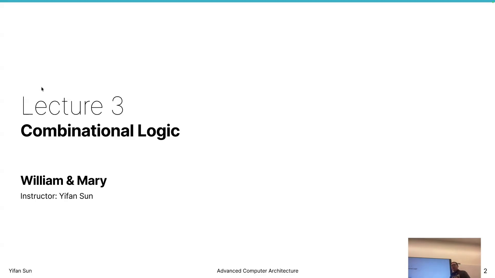

Opening title for the lecture. The lecture finishes common combinational building blocks and then introduces the storage elements needed for sequential logic.

### Slide 2 — Combinational Logic ([00:00:18](https://www.youtube.com/watch?v=DboxH6EYa40&t=18s))

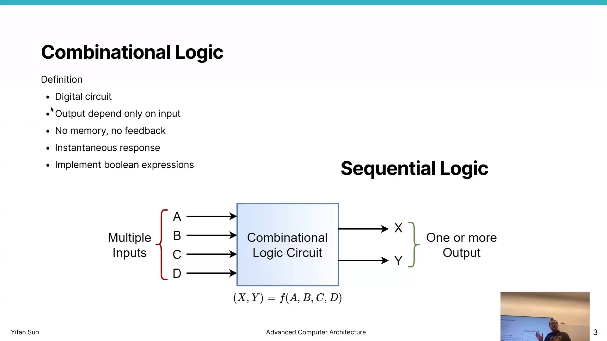

A combinational circuit:

- is a digital circuit built from gates and wires;
- can have multiple inputs and one or more outputs;
- has outputs determined **only by current inputs**;
- has no memory and no feedback;
- responds effectively instantaneously, apart from physical propagation delay;
- implements Boolean expressions such as $(X,Y)=f(A,B,C,D)$.

Because the output is deterministic for each input combination, its complete behavior can be tabulated in a truth table.

### Slide 3 — Logic-gate symbols ([00:01:12](https://www.youtube.com/watch?v=DboxH6EYa40&t=72s))

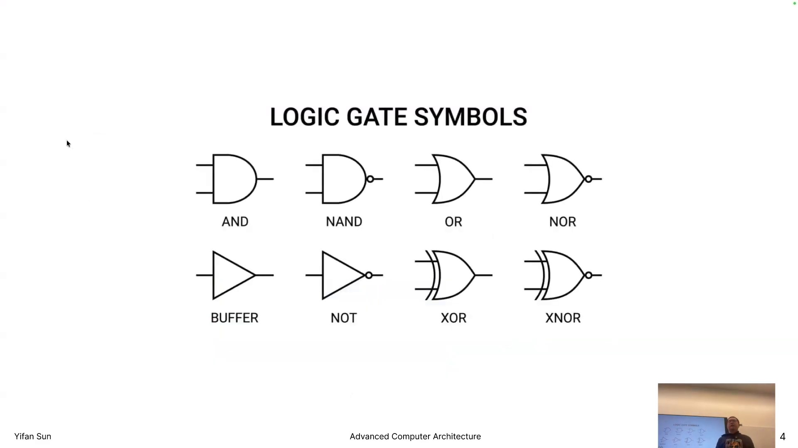

Symbols reviewed: AND, NAND, OR, NOR, buffer, NOT, XOR, and XNOR.

- AND/OR/NOT are convenient for expressing Boolean equations.
- NAND is especially important in physical implementation because it is functionally complete: every other gate can be constructed from NAND gates.

### Slide 4 — Implement a logic ([00:01:36](https://www.youtube.com/watch?v=DboxH6EYa40&t=96s))

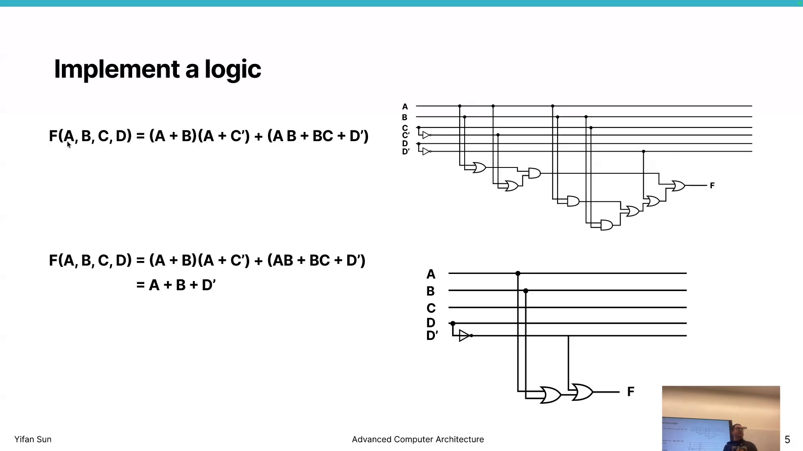

The same Boolean function can have very different circuit costs before and after simplification. The slide contrasts a direct gate-by-gate implementation with a reduced expression and much smaller circuit.

**Design lesson:** do not implement an unsimplified equation immediately. Fewer gates generally mean less area, delay, and energy.

### Slide 5 — What if I have the truth table? ([00:01:56](https://www.youtube.com/watch?v=DboxH6EYa40&t=116s))

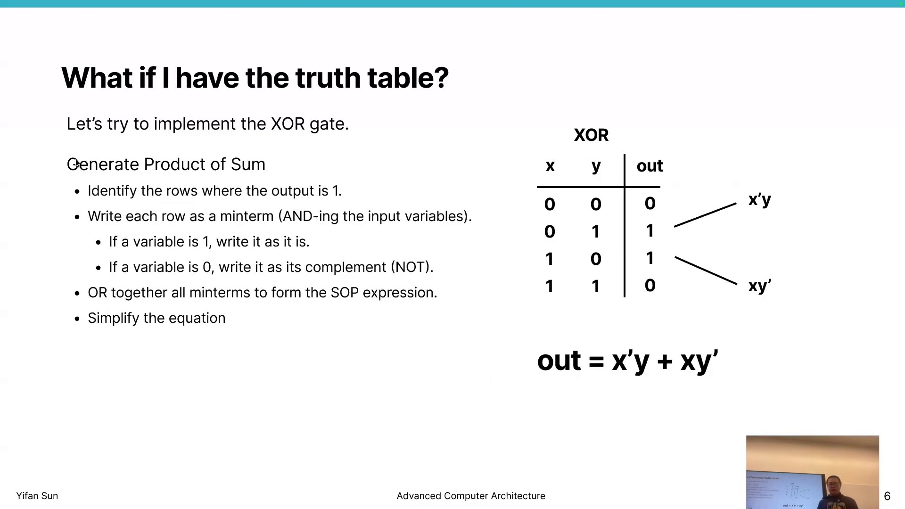

Truth-table-to-circuit procedure, illustrated with XOR:

1. Find every row where the output is 1.
2. Write one product term for each such row.
   - Use $x$ when the row has $x=1$.
   - Use $x'$ when the row has $x=0$.
3. OR the product terms to obtain a sum-of-products expression.
4. Simplify the expression.
5. Implement it with gates.

For XOR, the 1-rows are $01$ and $10$, so

$$
X\oplus Y=X'Y+XY'.
$$

### Slide 6 — Karnaugh map ([00:02:26](https://www.youtube.com/watch?v=DboxH6EYa40&t=146s))

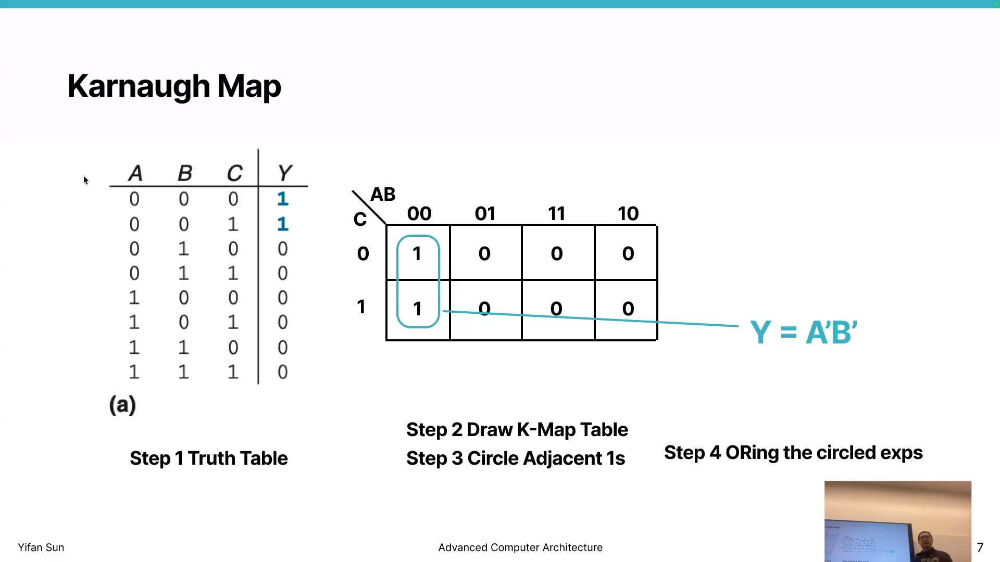

A Karnaugh map is a visual method for simplifying Boolean expressions:

1. Build the truth table.
2. Transfer values to the K-map in Gray-code order.
3. Circle adjacent 1s in power-of-two groups.
4. OR the simplified expressions represented by those groups.

Manual algebra is also valid, while real design tools normally perform this minimization automatically.

### Slide 7 — Building Blocks ([00:03:00](https://www.youtube.com/watch?v=DboxH6EYa40&t=180s))

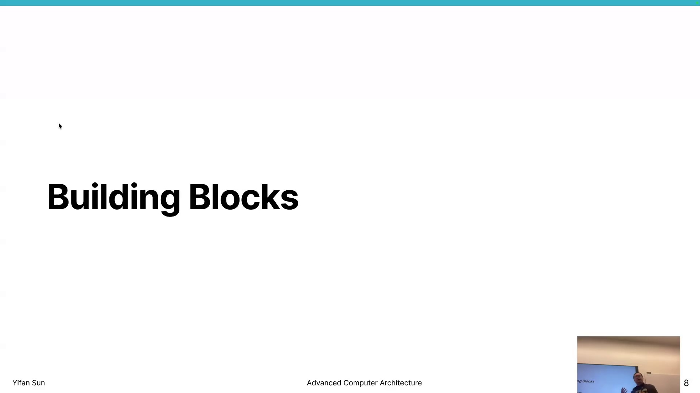

Modern designers usually describe hardware in an HDL such as Verilog rather than drawing every gate. A statement conceptually like $C=A+B$ becomes a multi-bit adder circuit.

- Adding two 32-bit values may require a 33-bit result because of carry-out.
- Multiplying two 32-bit values may require a 64-bit result.
- Complex arithmetic still ultimately reduces to Boolean logic and gates.

The rest of the lecture constructs complex components hierarchically from simpler reusable blocks.

## 2. Adders

### Slide 8 — Half adder ([00:08:02](https://www.youtube.com/watch?v=DboxH6EYa40&t=482s))

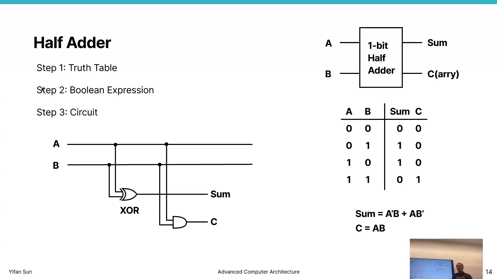

A half adder adds two one-bit values $A$ and $B$ and produces a one-bit sum plus carry.

| $A$ | $B$ | Sum | Carry |
|---:|---:|---:|---:|
| 0 | 0 | 0 | 0 |
| 0 | 1 | 1 | 0 |
| 1 | 0 | 1 | 0 |
| 1 | 1 | 0 | 1 |

Equations:

$$
\text{Sum}=A'B+AB'=A\oplus B
$$

$$
C=AB.
$$

Thus the compact implementation uses one XOR gate and one AND gate.

### Slide 9 — Full adder: truth table ([00:08:14](https://www.youtube.com/watch?v=DboxH6EYa40&t=494s))

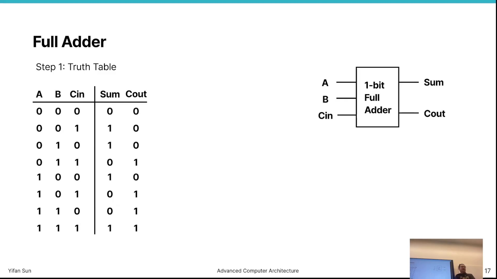

A full adder includes carry-in $C_{in}$ and produces Sum and $C_{out}$.

- Three input bits create eight truth-table rows.
- $0+0+0=00_2$.
- $1+1+1=11_2=3$; therefore both Sum and $C_{out}$ are 1.

Compact equations:

$$
\text{Sum}=A\oplus B\oplus C_{in}
$$

$$
C_{out}=AB+AC_{in}+BC_{in}.
$$

The carry equation is a majority function: carry is 1 whenever at least two inputs are 1.

### Slide 10 — Full adder: K-map simplification ([00:09:08](https://www.youtube.com/watch?v=DboxH6EYa40&t=548s))

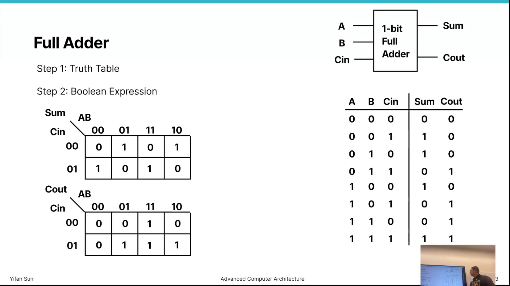

Separate K-maps are made for Sum and $C_{out}$.

- Sum has alternating diagonal 1s and does not group conveniently in ordinary sum-of-products form; XOR is its natural expression.
- Carry groups into three two-cell implicants, yielding $AB+AC_{in}+BC_{in}$.

Each output must be analyzed independently even though both belong to one component.

### Slides 11–14 — Full adder built from half adders ([00:10:00](https://www.youtube.com/watch?v=DboxH6EYa40&t=600s))

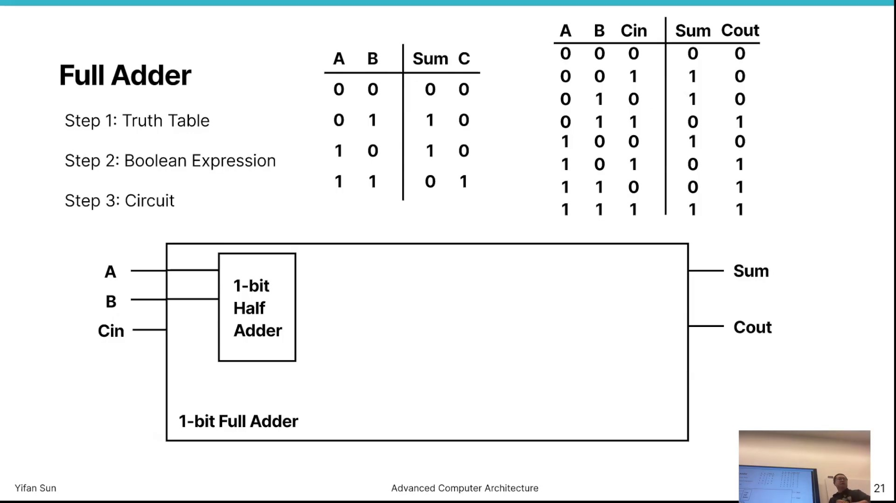

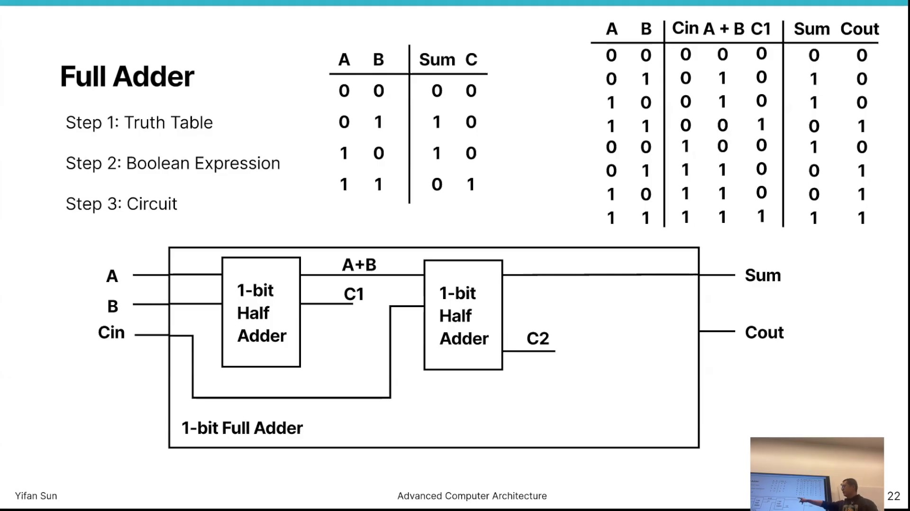

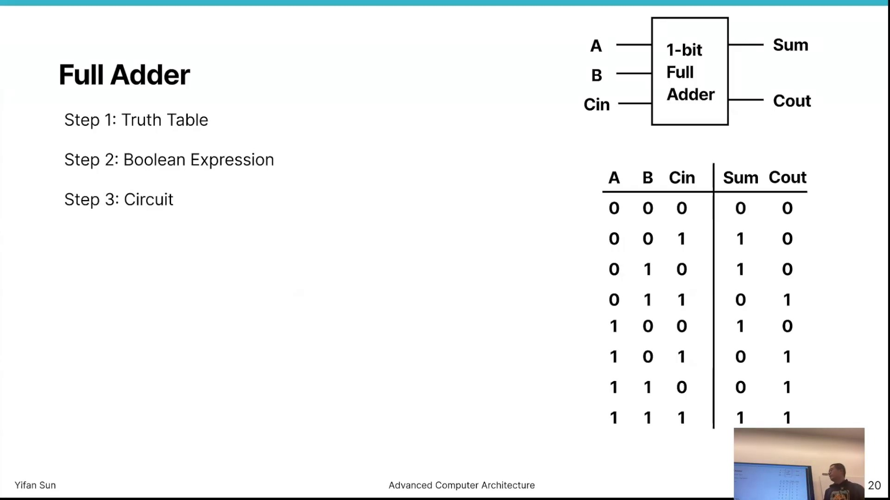

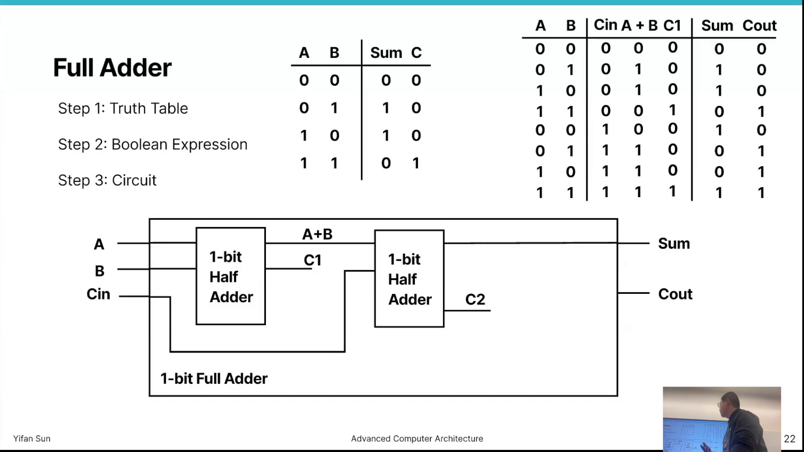

The progressive slide builds a full adder hierarchically:

1. Half adder 1 adds $A$ and $B$, producing $A\oplus B$ and carry $C_1=AB$.
2. Half adder 2 adds $C_{in}$ to $A\oplus B$, producing the final Sum and $C_2=C_{in}(A\oplus B)$.
3. An OR gate combines the two carry candidates:

$$
C_{out}=C_1+C_2.
$$

This illustrates abstraction: once a half adder exists as a building block, reuse it instead of starting again from individual gates.

### Slide 15 — One-bit full-adder symbol ([00:11:34](https://www.youtube.com/watch?v=DboxH6EYa40&t=694s))

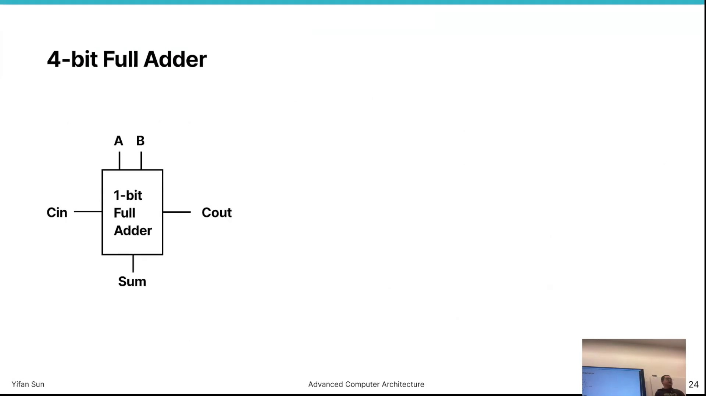

The component is abstracted to a block with:

- $A$ and $B$ at the top;
- $C_{in}$ entering from one side;
- $C_{out}$ leaving the other side;
- Sum leaving the bottom.

The block hides its internal gates and makes larger designs readable.

### Slide 16 — Four-bit full adder ([00:12:06](https://www.youtube.com/watch?v=DboxH6EYa40&t=726s))

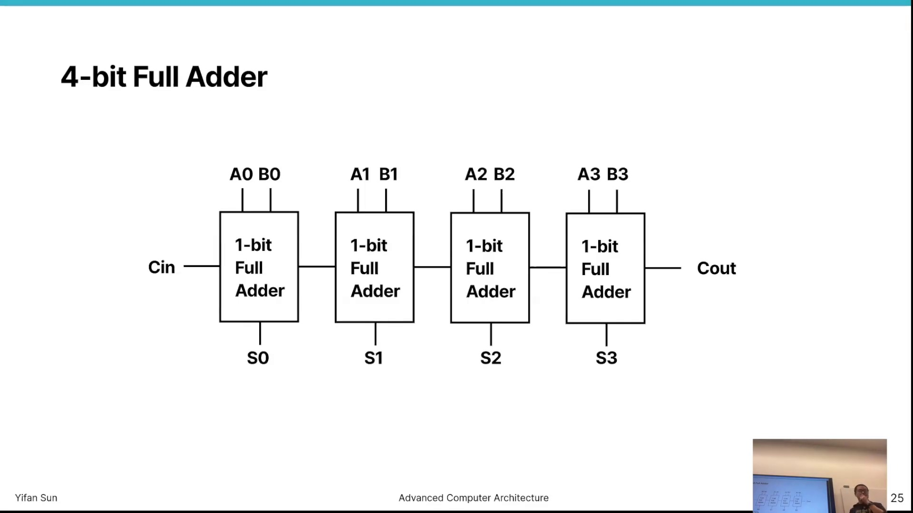

Four one-bit full adders are chained into a ripple-carry adder:

- stage 0 adds $A_0$, $B_0$, and external $C_{in}$, producing $S_0$;
- each stage's carry-out becomes the next stage's carry-in;
- stage 3 produces $S_3$ and final $C_{out}$.

The design is simple, but carry must propagate through every stage; this creates a critical delay for wide adders.

**Signed arithmetic:** two's-complement signed and unsigned addition can use the same adder hardware. Subtraction uses

$$
A-B=A+(\overline{B}+1),
$$

so addition and subtraction need not have separate datapaths. Even a move can be performed conceptually as adding zero.

## 3. Multiplexers, buses, encoders, and decoders

### Slide 17 — Multiplexer ([00:14:36](https://www.youtube.com/watch?v=DboxH6EYa40&t=876s))

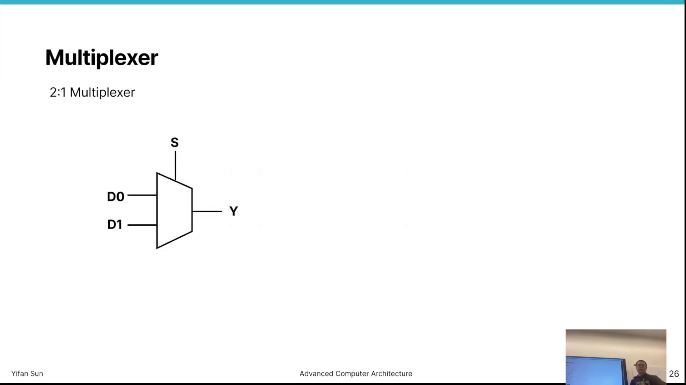

A 2:1 multiplexer selects one of two data inputs using select bit $S$:

$$
Y=\begin{cases}
D_0,&S=0\\
D_1,&S=1.
\end{cases}
$$

It is analogous to merging two traffic lanes into one: the select signal determines which input passes.

For $n$ inputs, the number of select bits is $\log_2 n$; four inputs need two bits and eight inputs need three.

### Slide 18 — 2:1 multiplexer implementation ([00:18:00](https://www.youtube.com/watch?v=DboxH6EYa40&t=1080s))

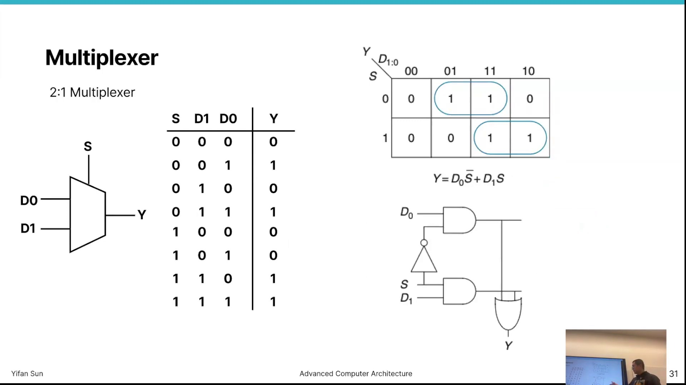

From its truth table and K-map:

$$
Y=D_0S'+D_1S.
$$

The circuit uses two AND gates, one inverter, and one OR gate.

### Multiplexer hierarchy ([00:18:14](https://www.youtube.com/watch?v=DboxH6EYa40&t=1094s))

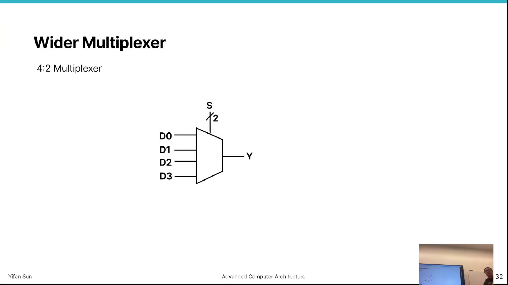

A 4:1 multiplexer can be built from three 2:1 multiplexers:

1. Two first-level muxes select between $(D_0,D_1)$ and $(D_2,D_3)$ using $S_0$.
2. A final mux selects between those intermediate outputs using $S_1$.

This is another example of building a larger component from repeated smaller blocks.

### Buses and wide multiplexers ([00:21:00](https://www.youtube.com/watch?v=DboxH6EYa40&t=1260s))

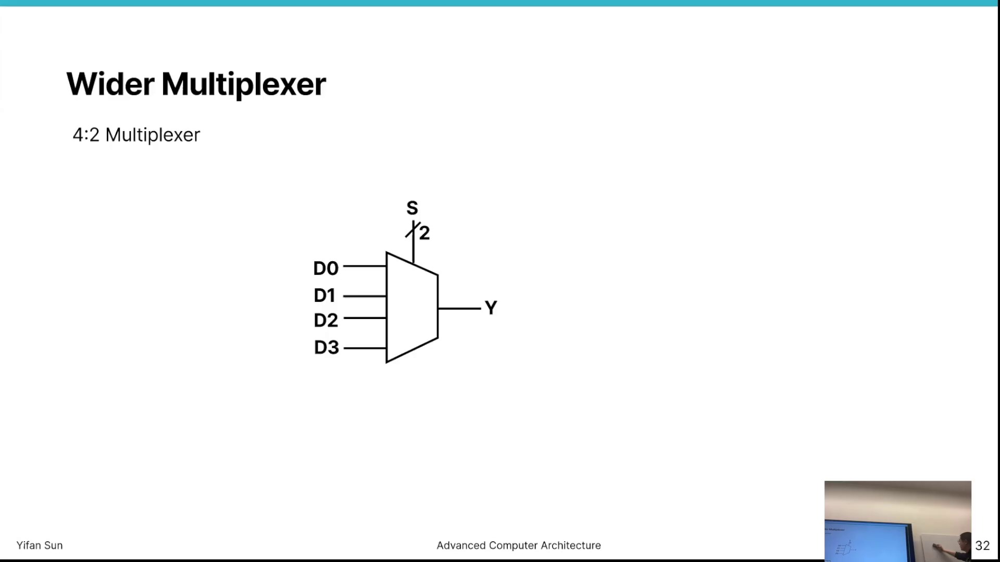

A slash drawn across a wire denotes a **bus**: a group of physical wires carrying a multi-bit value.

For an 8-bit-wide 4:1 mux:

- there are four 8-bit input buses;
- there is one 8-bit output bus;
- selection still needs only two bits because it chooses one of four complete values;
- implementation uses eight parallel one-bit 4:1 muxes, all sharing the same select signal.

Each physical wire carries one bit; a bus is schematic shorthand for many such wires.

### Encoder and decoder ([00:26:04](https://www.youtube.com/watch?v=DboxH6EYa40&t=1564s))

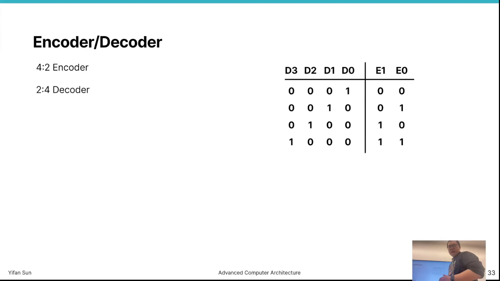

- An **encoder** converts a one-hot input (exactly one asserted wire) into a binary index. Four input wires encode to two output bits: $00$, $01$, $10$, or $11$.
- A **decoder** performs the reverse operation: a binary number selects exactly one output wire.

These are common small blocks embedded in larger combinational circuits.

## 4. Latches: introducing memory through feedback

### Slide 19 — More Complex Building Blocks ([00:27:28](https://www.youtube.com/watch?v=DboxH6EYa40&t=1648s))

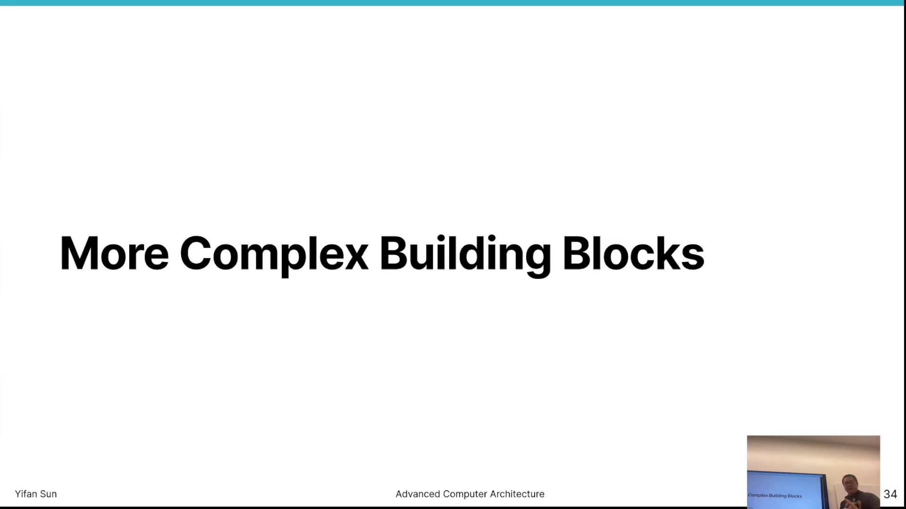

The lecture now deliberately breaks a combinational-logic rule: it introduces loops. Feedback permits the circuit to retain state, which begins sequential logic.

### Slide 20 — Latches ([00:27:40](https://www.youtube.com/watch?v=DboxH6EYa40&t=1660s))

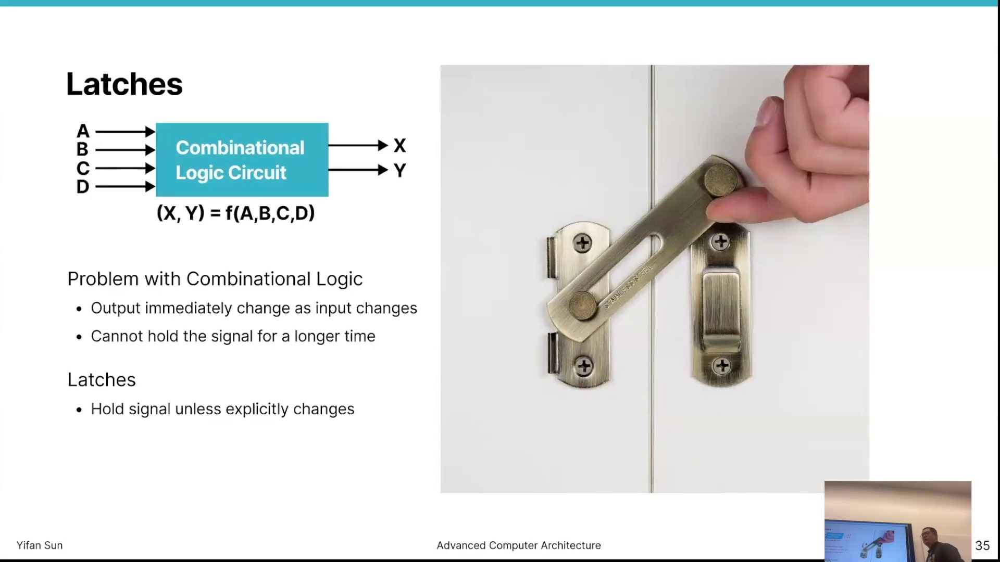

Problems with relying only on combinational logic:

- outputs change whenever inputs change;
- large circuits need nonzero time to settle;
- there is no inherent point at which a downstream block knows the result is stable;
- there is no memory of a previous result.

A **latch** holds a value until an explicit control tells it to change—like a physical door latch.

### Slide 21 — SR latch circuit ([00:29:48](https://www.youtube.com/watch?v=DboxH6EYa40&t=1788s))

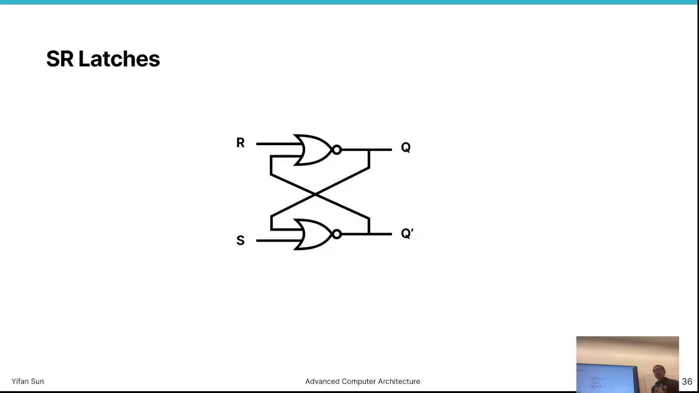

An SR latch uses two cross-coupled NOR gates. The outputs $Q$ and $Q'$ feed back into the opposite gate.

- $S$ means set.
- $R$ means reset.
- Under valid states, $Q'$ is the complement of $Q$.

The loop allows a previously established output to reinforce itself after the initiating input is removed.

### Slides 22–23 — SR latch truth table and modes ([00:36:24](https://www.youtube.com/watch?v=DboxH6EYa40&t=2184s))

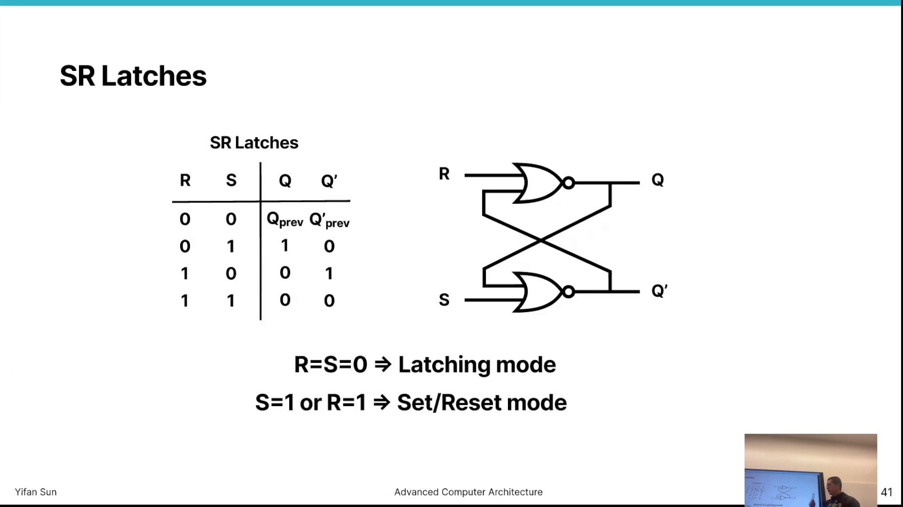

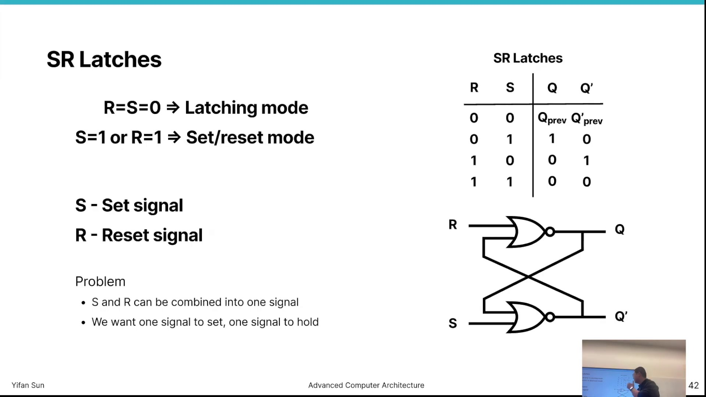

| $R$ | $S$ | next $Q$ | next $Q'$ | Meaning |
|---:|---:|---:|---:|---|
| 0 | 0 | previous $Q$ | previous $Q'$ | hold/latch |
| 0 | 1 | 1 | 0 | set |
| 1 | 0 | 0 | 1 | reset |
| 1 | 1 | 0 | 0 | invalid/undesired |

When $R=S=0$, feedback preserves the preceding state indefinitely. The $R=S=1$ case violates complementarity; when both inputs return to 0, tiny timing differences can determine the final state, so designers avoid it.

## 5. D latch and clocking

### Slide 24 — D latch goal ([00:37:44](https://www.youtube.com/watch?v=DboxH6EYa40&t=2264s))

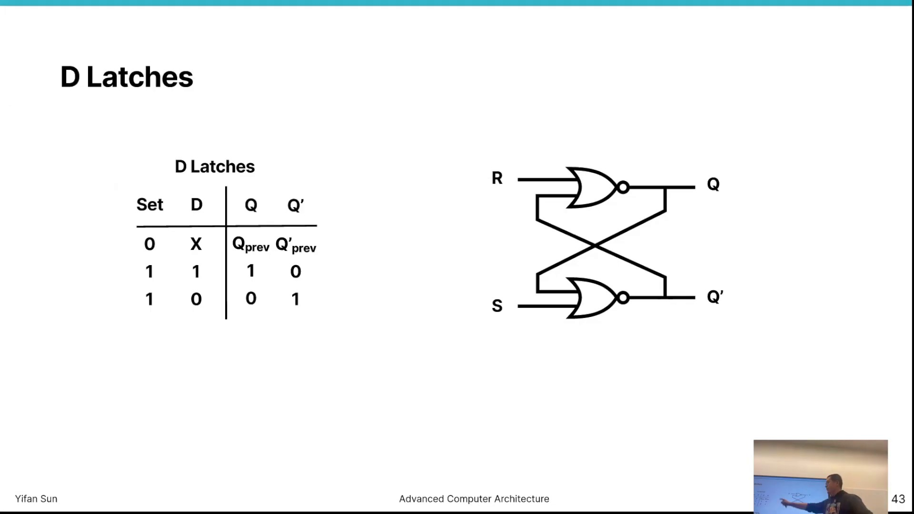

The D latch combines the desired behavior into data $D$ and one enable/set control:

| Enable | $D$ | next $Q$ | Meaning |
|---:|---:|---:|---|
| 0 | X | previous $Q$ | hold |
| 1 | 0 | 0 | follow $D$ |
| 1 | 1 | 1 | follow $D$ |

It prevents the invalid SR combination and is more intuitive: enabled means “copy the data”; disabled means “retain the prior value.”

### Slide 25 — D latch derived from SR latch ([00:38:40](https://www.youtube.com/watch?v=DboxH6EYa40&t=2320s))

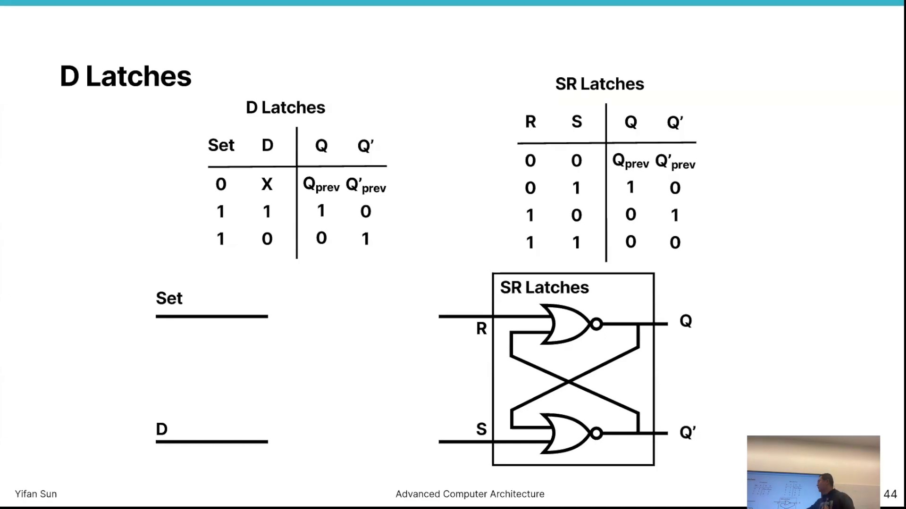

Combinational input logic converts Enable and $D$ into valid SR inputs. Conceptually:

$$
S=\text{Enable}\cdot D,
\qquad
R=\text{Enable}\cdot D'.
$$

Therefore $S$ and $R$ cannot both be 1. The implementation adds two AND gates and an inverter around the SR latch.

### Slide 26 — Clocked D-latch waveform ([00:46:36](https://www.youtube.com/watch?v=DboxH6EYa40&t=2796s))

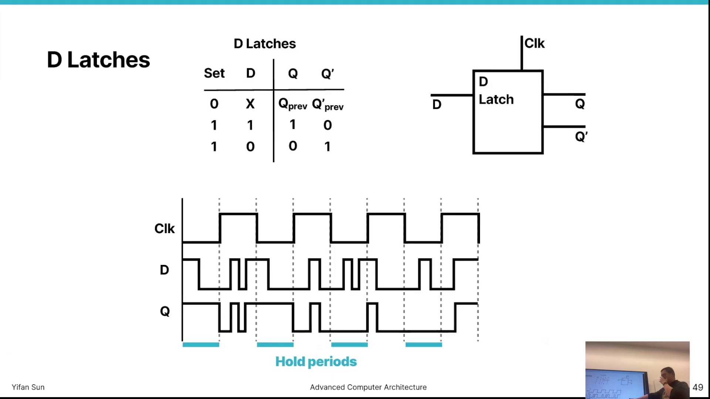

The enable is commonly a clock, `Clk`:

- `Clk = 1`: transparent/follow mode, so $Q$ follows $D$.
- `Clk = 0`: hold mode, so $Q$ retains its last value.

The waveform shows $Q$ copying changes in $D$ during transparent intervals and ignoring them during hold intervals.

#### Clock frequency, propagation, and energy (speaker explanation)

- Clock frequency governs how often synchronous state may advance.
- Static energy includes leakage even when no switching occurs.
- Dynamic energy grows with switching activity and frequency.
- **DVFS** means dynamic voltage and frequency scaling: systems lower both voltage and frequency under light load to save energy.
- Higher voltage can make a signal cross the digital threshold sooner, supporting a higher frequency, but increases energy and heat.
- Real signals are not perfect square waves, and wires/gates have propagation delay.

A level-sensitive D latch leaves only the hold half-cycle as reliably stable processing time. The next component removes that limitation.

## 6. D flip-flop and registers

### Slide 27 — D flip-flop ([00:51:30](https://www.youtube.com/watch?v=DboxH6EYa40&t=3090s))

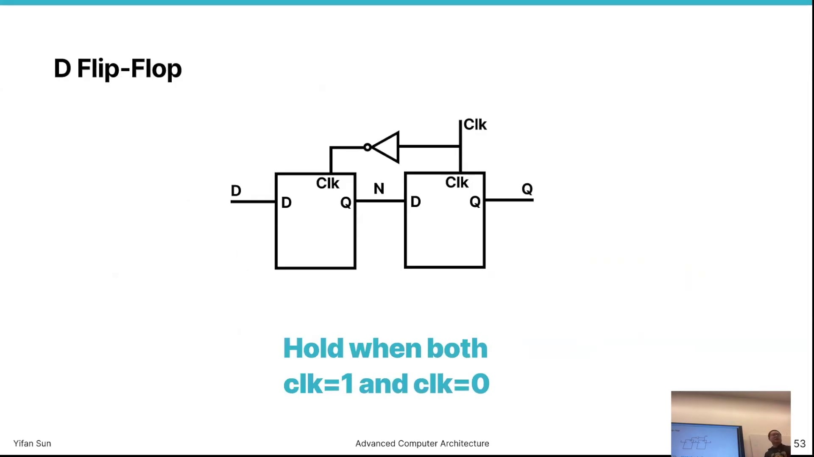

A D flip-flop combines two latches in a master–slave arrangement with opposite clock polarity.

- One latch is holding while the other is transparent.
- There is never a continuously transparent path from $D$ to $Q$.
- Both clock levels therefore isolate the output from ongoing input changes.

### Slide 28 — Master/slave data movement ([00:52:28](https://www.youtube.com/watch?v=DboxH6EYa40&t=3148s))

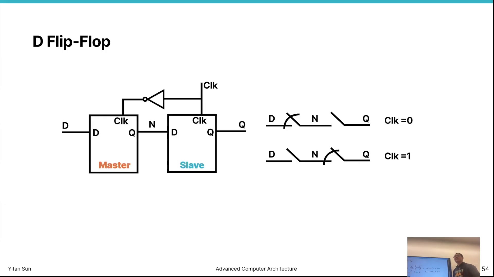

During one half-cycle, the master captures/follows $D$ while the slave holds $Q$. During the other half-cycle, the master holds its captured value while the slave transfers it to $Q$.

Data moves through the two stages only at the boundary between phases—the rising clock edge for the configuration shown.

### Slides 29–30 — Edge-triggered waveform ([00:55:16](https://www.youtube.com/watch?v=DboxH6EYa40&t=3316s))

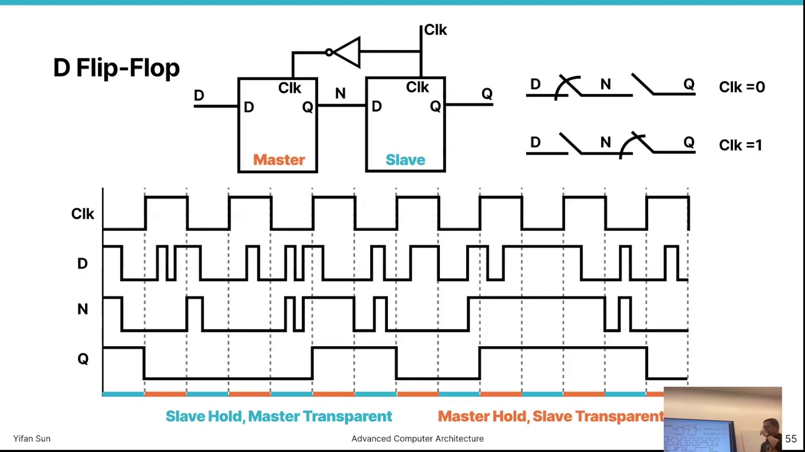

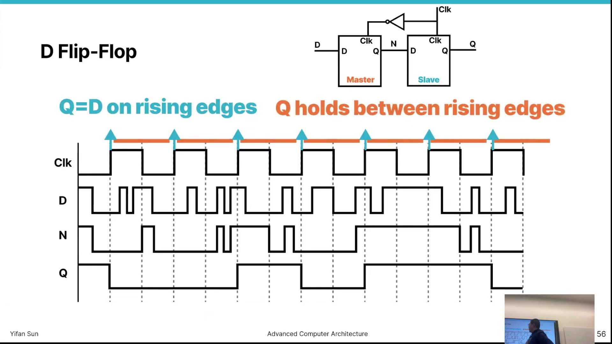

The waveform highlights the central rule:

- $Q=D$ **at each rising edge**;
- $Q$ holds between rising edges;
- changes or glitches in $D$ during the cycle do not immediately propagate to $Q$.

A clock cycle is the interval between consecutive equivalent edges, normally consecutive rising edges. Falling-edge-triggered components are possible too, but the lecture assumes rising-edge operation.

This gives combinational logic a nearly full cycle to settle. Intermediate glitches do not matter if the final result is stable by the next capturing edge.

The cycle period must be long enough for the slowest combinational path. Ripple carry across a wide adder is one such limiting path. Large operations may therefore be split across several cycles rather than forcing every operation to fit one very long cycle.

### Slide 31 — Register ([01:00:22](https://www.youtube.com/watch?v=DboxH6EYa40&t=3622s))

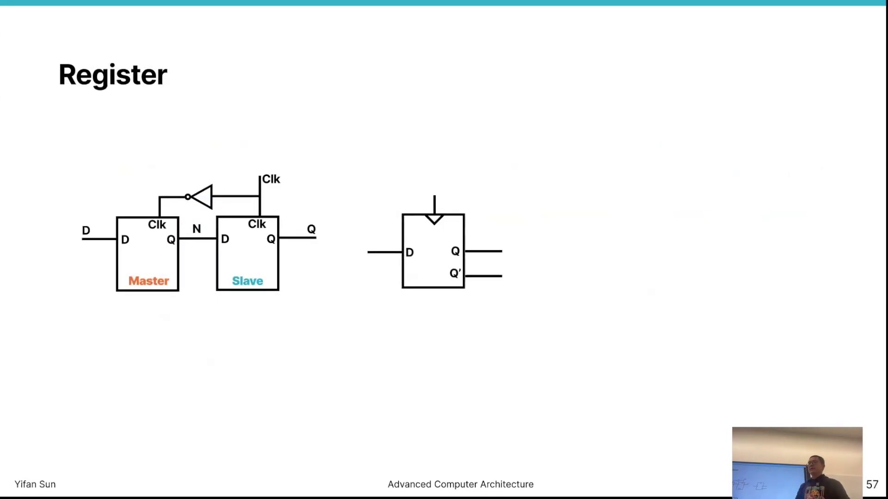

A D flip-flop is also called a one-bit **register**. It stores the $D$ value sampled at the previous active clock edge. Its schematic symbol is simplified to a box with $D$, $Q$, and a triangle marking the clock input.

Registers are fast but costly in transistor count and energy. A practical flip-flop may use roughly a few tens of transistors depending on its circuit and controls.

#### SRAM versus DRAM

- SRAM cells are commonly around 6 transistors per bit, before peripheral read/write logic. SRAM is fast but area-expensive, so it is used for caches.
- DRAM stores a bit with roughly one transistor plus a capacitor. It is denser and cheaper but slower and requires refresh, so it is used for main memory.
- The memory hierarchy uses both because systems need speed near the processor and large capacity farther away.

## 7. Synchronous design

### Slide 32 — Synchronous logic design ([01:05:24](https://www.youtube.com/watch?v=DboxH6EYa40&t=3924s))

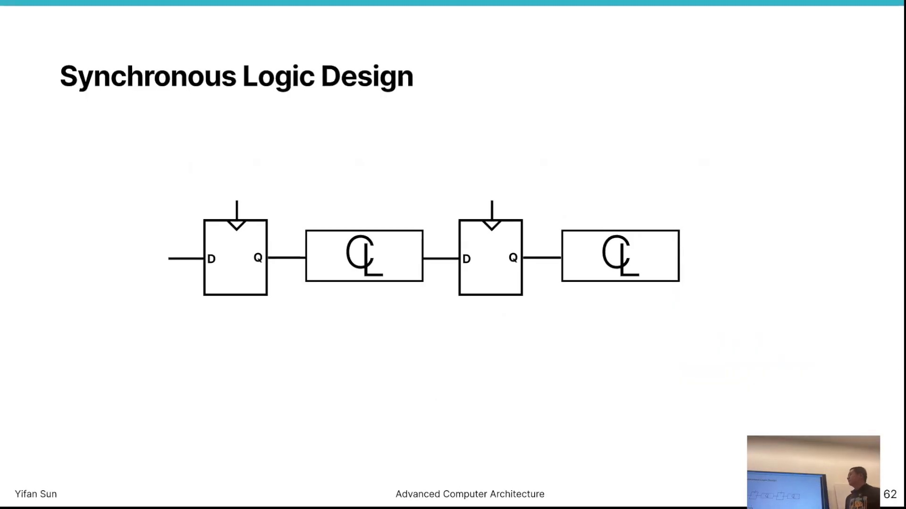

A synchronous datapath alternates registers and combinational logic:

$$
\text{register}\rightarrow\text{combinational logic}\rightarrow
\text{register}\rightarrow\text{combinational logic}\rightarrow\cdots
$$

Design assumptions/rules:

- Registers across the design share a common clock abstraction.
- Real clock arrival times vary slightly by location; this is clock skew.
- Every cyclic feedback path must contain at least one register.
- A stage computes from values captured in an earlier cycle.
- If a result must feed itself within the same cycle, that dependency must be part of the combinational logic and still meet timing.

Registers divide a large computation into stable, clocked stages and make sequential behavior predictable.

### Slide 33 — Summary ([01:07:22](https://www.youtube.com/watch?v=DboxH6EYa40&t=4042s))

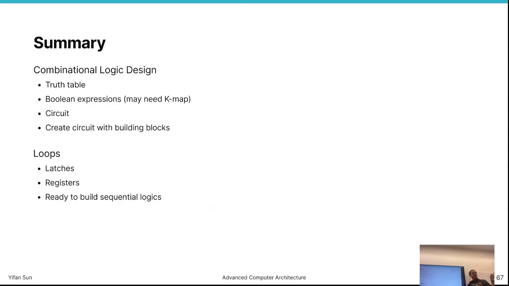

Combinational design flow:

1. Truth table.
2. Boolean expressions.
3. Optional K-map/algebraic minimization.
4. Gate circuit.
5. Reuse through blocks such as adders, muxes, encoders, and decoders.

Adding feedback creates state:

- loops create latches;
- latches lead to edge-triggered registers;
- registers plus combinational logic form synchronous sequential systems.

The next lecture proceeds to finite-state machines as a systematic way to design sequential logic.

## Key formulas and rules

$$
\begin{aligned}
\text{Half-adder Sum} &= A\oplus B=A'B+AB'\\
\text{Half-adder Carry} &= AB\\
\text{Full-adder Sum} &= A\oplus B\oplus C_{in}\\
\text{Full-adder }C_{out} &= AB+AC_{in}+BC_{in}\\
\text{2:1 mux }Y &= D_0S'+D_1S\\
A-B &= A+(\overline B+1)
\end{aligned}
$$

- Combinational output depends on current input only.
- A latch is level-sensitive; it may be transparent for an entire clock level.
- A flip-flop/register is edge-triggered; it samples at an edge and holds between edges.
- A synchronous stage's clock period must accommodate register overhead plus the worst combinational propagation delay.
