# Sequential Logic Circuit Design — illustrated lecture notes

- **Course:** Advanced Computer Architecture
- **Instructor:** Yifan Sun, William & Mary
- **Video:** [YouTube](https://www.youtube.com/watch?v=zLhmFOjmMJk)
- **Duration:** 1:08:11
- **Sources:** downloaded 1080p lecture video, original English subtitles, and extracted slide frames
- **Focus:** sequential logic, finite-state machines (FSMs), and counters

> Each slide image is captured from the lecture video. The explanation below each image follows the teacher's spoken explanation in the subtitles, including examples and design reasoning that may not appear on the slide itself.

## 1. Sequential logic review

### Slide 1 — Sequential Logic ([00:00:02](https://www.youtube.com/watch?v=zLhmFOjmMJk&t=2s))

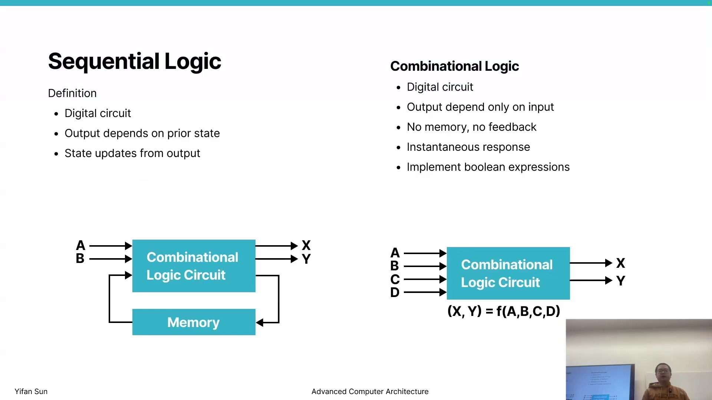

Sequential logic is still digital—signals are interpreted as 0 or 1—but unlike combinational logic, its output depends on a **prior state** as well as current inputs. Registers hold that state, and feedback carries the newly calculated state back for the next cycle.

The teacher contrasts the two forms:

- **Combinational logic:** output depends only on current input, has no memory or feedback, responds after propagation delay, and implements Boolean expressions.
- **Sequential logic:** combines combinational logic with memory; the previous state influences the output and next state.

Nearly every modern chip with control behavior is sequential rather than purely combinational. State updates occur at clock boundaries, and the clock determines when and how quickly the system advances.

### Slide 2 — SR latches and storage-element review ([00:01:58](https://www.youtube.com/watch?v=zLhmFOjmMJk&t=118s))

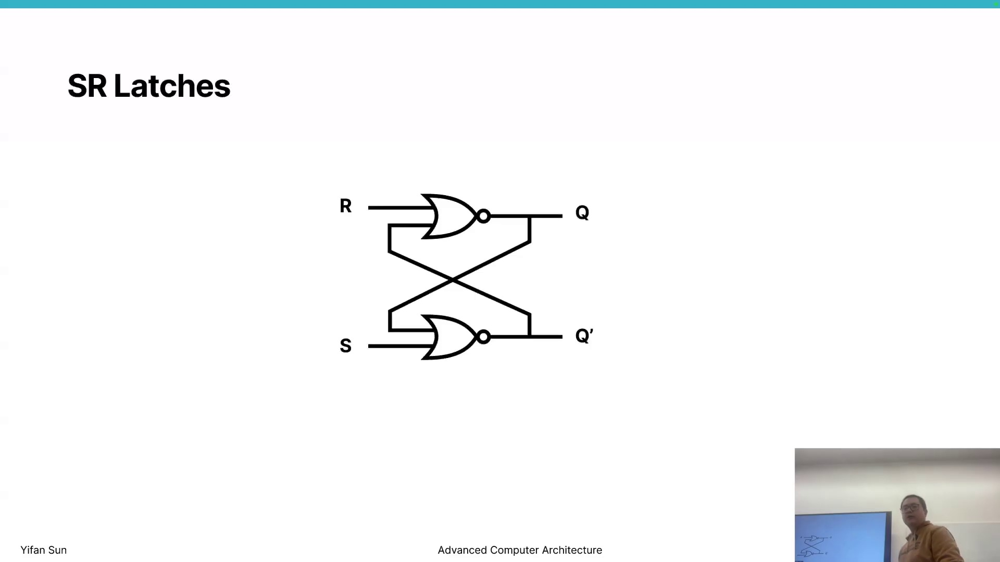

The teacher reviews the storage blocks from the previous lecture:

- In an **SR latch**, asserting $S$ sets $Q=1$; asserting $R$ resets $Q=0$; with $S=R=0$, feedback preserves the old value.
- A **D latch** has a hold mode and a transparent/follow mode. When disabled, $Q$ keeps its previous value; when enabled, $Q$ follows $D$ almost immediately.
- A **D flip-flop** connects two oppositely controlled D latches. It holds during both clock levels and transfers data only at a clock edge.
- A flip-flop is a one-bit **register**: it stores the value sampled at the preceding active clock edge.

Millions of registers are normal in a chip, but registers consume area and energy, so designers still budget them carefully.

### Slide 3 — Synchronous Logic Design ([00:05:40](https://www.youtube.com/watch?v=zLhmFOjmMJk&t=340s))

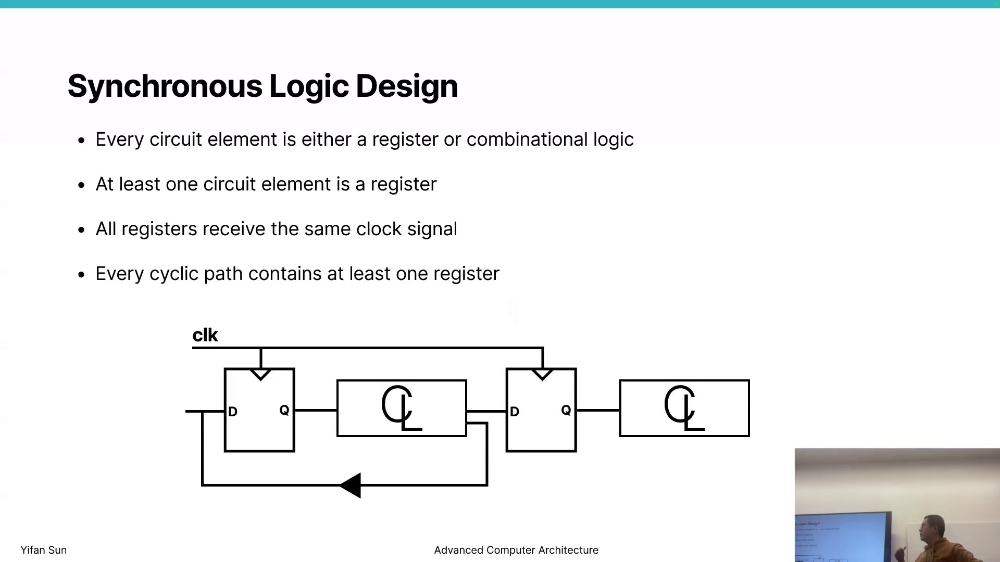

A synchronous system alternates registers and combinational logic. Registers hold stable inputs for a complete cycle; combinational logic computes new values; the next register captures them at the following edge. Feedback paths must include at least one register.

Key rules from the lecture:

- Every element is either a register or combinational logic.
- At least one element in every cyclic path is a register.
- Registers are modeled as receiving the same clock and updating together.
- Simulation can therefore advance discretely from cycle to cycle instead of modeling every intermediate voltage change.

The teacher notes that this resembles a pipeline. Real systems may contain asynchronous boundaries—for example, CPU, GPU, and memory can run at different frequencies—but communication across those clock domains requires extra synchronization. The lecture concentrates on synchronous design.

## 2. Finite-state-machine design: traffic-light controller

### Slide 4 — State Machines ([00:08:16](https://www.youtube.com/watch?v=zLhmFOjmMJk&t=496s))

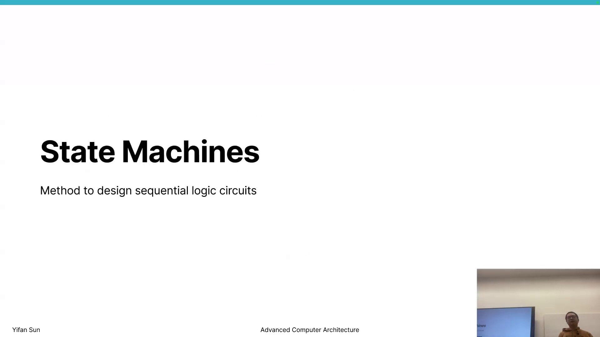

A finite-state machine is the principal method introduced for designing sequential logic. Instead of treating a complex controller as one enormous circuit, the designer describes:

1. the finite set of situations the system can be in;
2. the inputs that trigger movement between those situations;
3. the outputs associated with each state or transition.

### Slide 5 — Design a Traffic Light ([00:08:32](https://www.youtube.com/watch?v=zLhmFOjmMJk&t=512s))

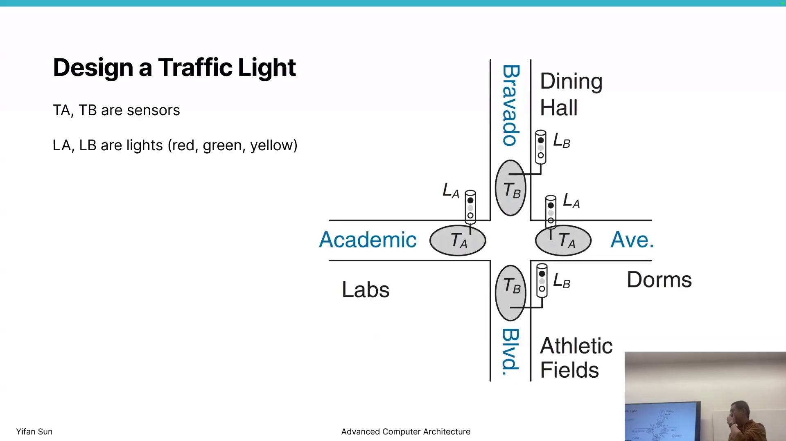

The example controls the intersection of Academic Avenue and Bravado Boulevard:

- $T_A$ and $T_B$ are one-bit car-presence sensors.
- $L_A$ and $L_B$ control the two sets of traffic lights.
- Each light requires a two-bit bus because it has three meaningful values: green, yellow, and red.

The teacher emphasizes a universal first design step: identify the **inputs and outputs**, then ask whether the inputs provide enough information to determine the required behavior.

Only four output combinations are safe and meaningful:

1. $L_A$ green, $L_B$ red;
2. $L_A$ yellow, $L_B$ red;
3. $L_A$ red, $L_B$ green;
4. $L_A$ red, $L_B$ yellow.

These become states $S0$–$S3$. The controller stays green while traffic is present, moves through yellow for one cycle when traffic is absent, and then gives the opposite road green.

### Slide 6 — State Transition Table ([00:14:52](https://www.youtube.com/watch?v=zLhmFOjmMJk&t=892s))

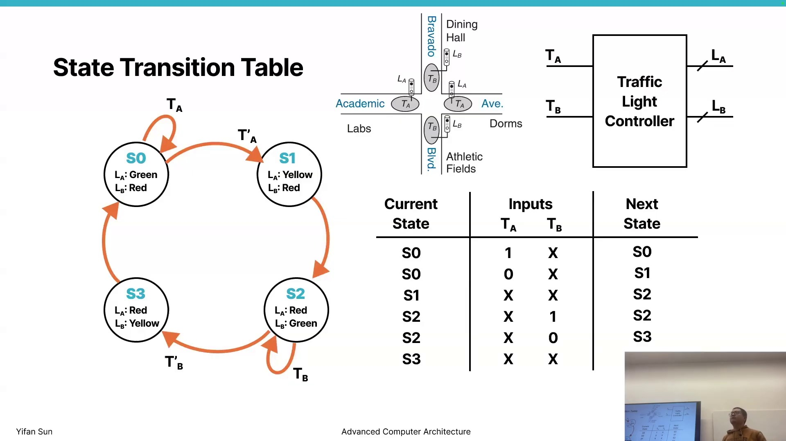

The state diagram is translated into a table. One row is needed for each actual transition arrow; an `X` means that input does not matter.

Representative behavior:

- In $S0$, $T_A=1$ keeps the controller in $S0$; $T_A=0$ moves to $S1$.
- $S1$ is yellow and unconditionally advances to $S2$ after one cycle.
- In $S2$, $T_B=1$ keeps the controller in $S2$; $T_B=0$ moves to $S3$.
- $S3$ unconditionally returns to $S0$.

The states are encoded with two bits: $S0=00$, $S1=01$, $S2=10$, and $S3=11$. The light values are also encoded, for example green $=00$, yellow $=01$, and red $=10$.

The teacher compares this arbitration to shared computer buses: several requesters may want one shared resource, so a controller grants one the right of way while preventing collisions.

### Slide 7 — Hardware structure for next-state logic ([00:18:52](https://www.youtube.com/watch?v=zLhmFOjmMJk&t=1132s))

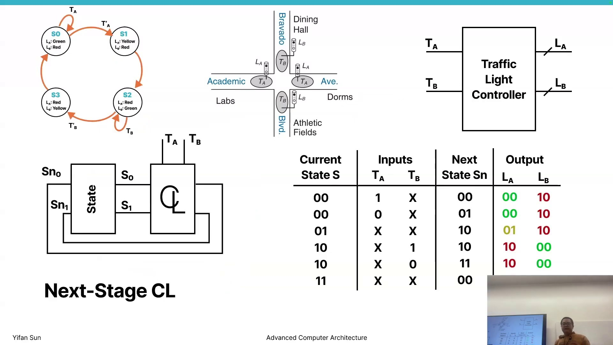

The two state bits are held in two registers. Their outputs, $S_1$ and $S_0$, remain stable throughout the cycle and enter the next-state combinational logic together with $T_A$ and $T_B$. That logic computes $S_{N1}$ and $S_{N0}$, which feed the registers' $D$ inputs.

At the next rising edge:

$$
(S_1,S_0)\leftarrow(S_{N1},S_{N0}).
$$

The teacher explains that next-state signals may briefly jitter while gates settle, but the registers isolate this activity. Current-state outputs remain stable until the next edge. In that sense, registers “memorize” the preceding state and give the combinational circuit a whole cycle to calculate.

### Slide 8 — Output combinational logic ([00:23:20](https://www.youtube.com/watch?v=zLhmFOjmMJk&t=1400s))

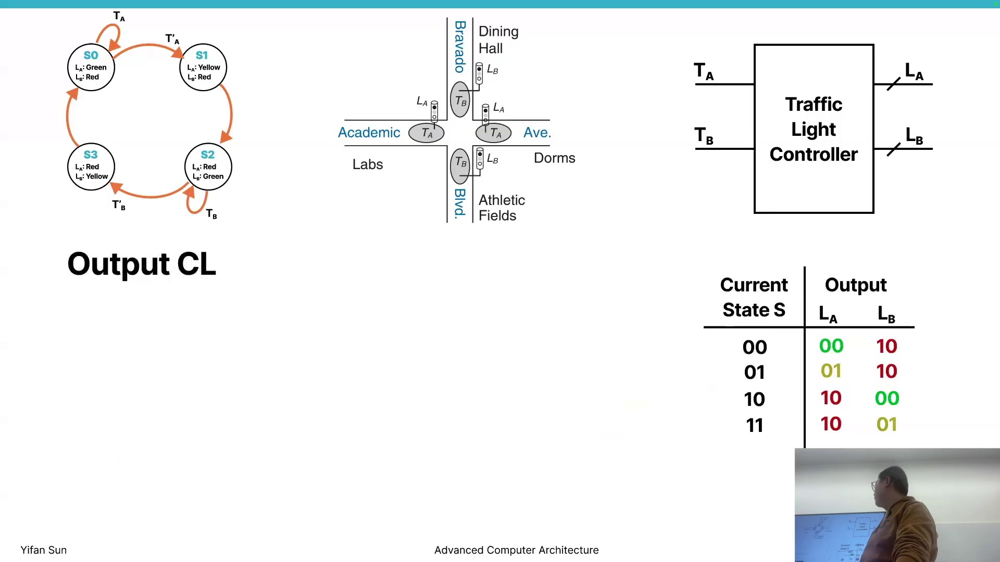

Once the state-transition table exists, next-state generation becomes ordinary combinational-logic design: derive Boolean expressions from the truth table and simplify them algebraically or with Karnaugh maps.

A separate output combinational-logic block maps the current state to $L_A$ and $L_B$. The teacher deliberately uses current state—not unstable next-state signals—to determine the lights.

### Slide 9 — Next-State CL equations ([00:23:28](https://www.youtube.com/watch?v=zLhmFOjmMJk&t=1408s))

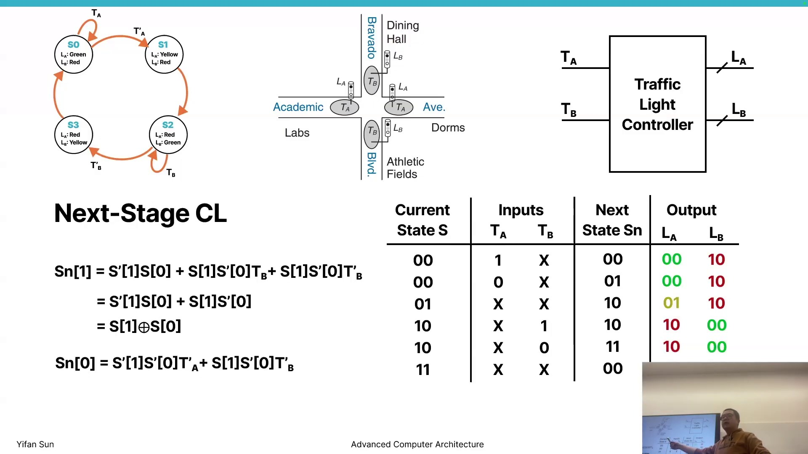

The transition table is treated as a four-input, two-output Boolean function:

- inputs: $S_1,S_0,T_A,T_B$;
- outputs: $S_{N1},S_{N0}$.

The slide derives and simplifies the equations. One state bit has a compact relation, while the other requires more product terms. The important lesson is the procedure, not memorizing these particular equations: each next-state bit is independently derived exactly like a combinational output.

### Slide 10 — Output CL circuit ([00:24:14](https://www.youtube.com/watch?v=zLhmFOjmMJk&t=1454s))

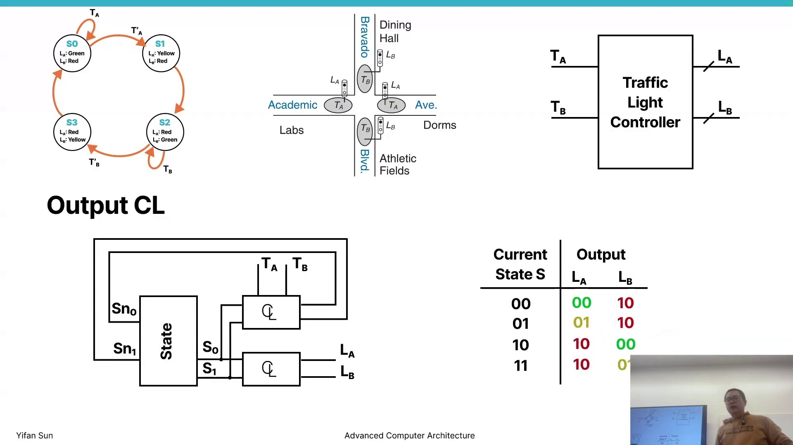

The output block has two state inputs and four output wires—the two-bit $L_A$ bus and two-bit $L_B$ bus. Because every current-state encoding has a defined light encoding, the mapping is deterministic and can be realized with a small set of gates.

The teacher separates output logic from next-state logic to make each responsibility clear:

- **Next-state CL:** current state plus sensors $\rightarrow$ next state.
- **Output CL:** current state $\rightarrow$ light outputs.

### Slide 11 — Complete traffic-light controller ([00:25:50](https://www.youtube.com/watch?v=zLhmFOjmMJk&t=1550s))

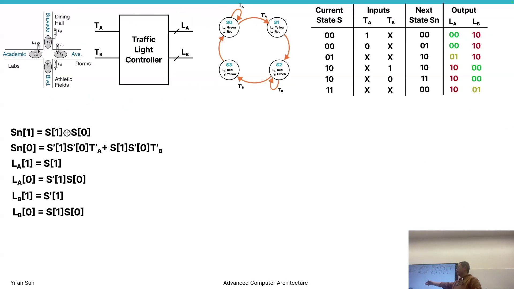

The completed controller contains:

1. a register bank storing the current state;
2. next-state combinational logic feeding the register inputs;
3. output combinational logic driving $L_A$ and $L_B$;
4. the common clock.

For this example the combinational calculation has four inputs—two state bits plus $T_A,T_B$—and six outputs—two next-state bits plus four light bits.

The teacher summarizes the full FSM design process:

1. define system inputs and outputs;
2. list possible outputs and states;
3. draw the state-transition diagram;
4. encode states and outputs;
5. create the transition/output truth table;
6. derive and simplify Boolean expressions;
7. draw the register and combinational circuits.

### Slide 12 — Finite State Machine design recipe ([00:28:22](https://www.youtube.com/watch?v=zLhmFOjmMJk&t=1702s))

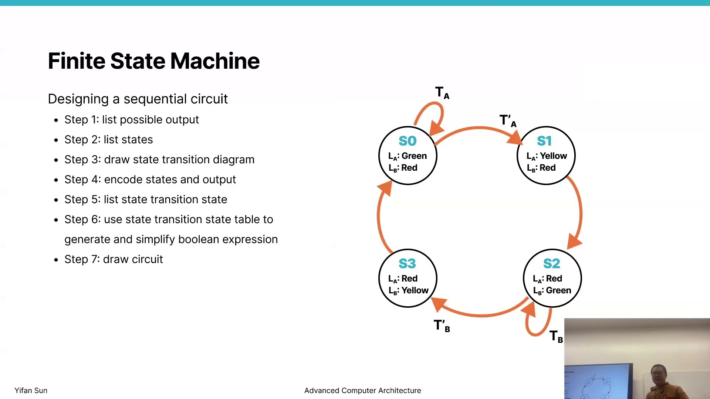

The slide formalizes the seven-step workflow. The teacher stresses that combinational logic remains a large part of every sequential design: registers supply context, while ordinary Boolean logic computes next state and output.

Complex systems can be decomposed into these pieces. A button press that eventually reaches memory, a GPU, and a display is implemented by many sequential controllers acting cycle by cycle.

### Slide 13 — Moore and Mealy machine structures ([00:30:12](https://www.youtube.com/watch?v=zLhmFOjmMJk&t=1812s))

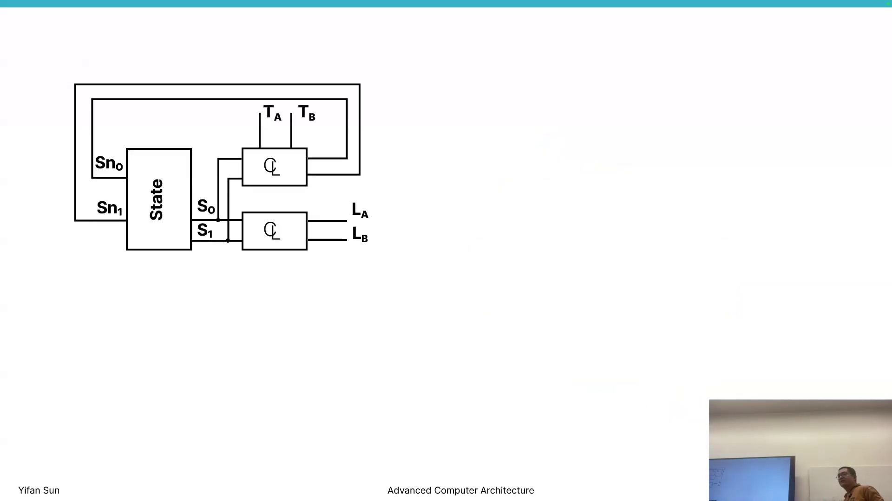

The teacher introduces two equivalent FSM styles (the subtitles misrecognize their names several times):

- **Moore machine:** output depends only on current state.
- **Mealy machine:** output depends on current state and current input.

Tradeoffs described in the lecture:

| Moore | Mealy |
|---|---|
| Output changes at clock-controlled state changes | Output can respond immediately to input |
| Easier to design and debug | Often uses fewer states/registers |
| More stable against input glitches | Lower response latency |
| Often a good first implementation | Useful when aggressive optimization matters |

A Mealy output path may react without waiting for another cycle, but can also expose asynchronous input glitches. Moore and Mealy models can be converted into one another and both are used in practice.

## 3. Secure-door password FSM

### Slide 14 — Secure Door Access Password System ([00:36:38](https://www.youtube.com/watch?v=zLhmFOjmMJk&t=2198s))

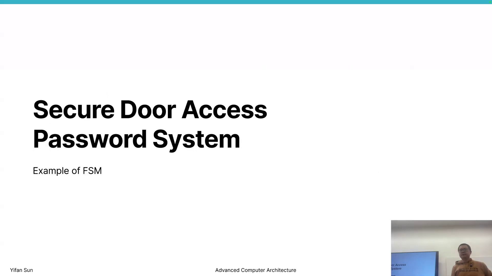

The second example is a more realistic FSM: unlock a door after four correct digits are entered consecutively and in order.

### Slide 15 — Problem Statement ([00:36:46](https://www.youtube.com/watch?v=zLhmFOjmMJk&t=2206s))

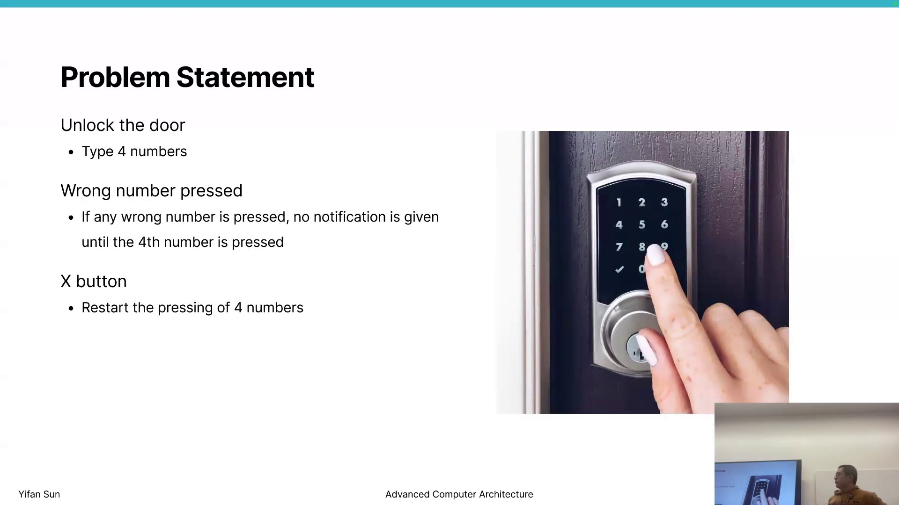

Requirements:

- Four correct numbers must be entered in sequence.
- A wrong number moves the controller onto an error path; a later correct suffix does not retroactively repair the sequence.
- An `X`/restart action restarts entry.
- The simplified design uses an explicit unlock state to assert the output.

The FSM begins in `IDLE`. Correct entries move through $C1,C2,C3$; incorrect entries move through $E1,E2,E3$. From $C3$, the final correct digit moves to `Unlock`; otherwise the machine returns to `IDLE`. `Unlock` is transient and returns to `IDLE` after producing the signal.

The teacher notes that a Mealy design could omit the explicit unlock state by producing the signal from $C3$ plus the final input. The shown Moore design needs the state because output depends only on state.

Unused or impossible encodings should recover to `IDLE`, and a reset signal should always provide a known recovery path.

### Slide 16 — State Encoding ([00:40:48](https://www.youtube.com/watch?v=zLhmFOjmMJk&t=2448s))

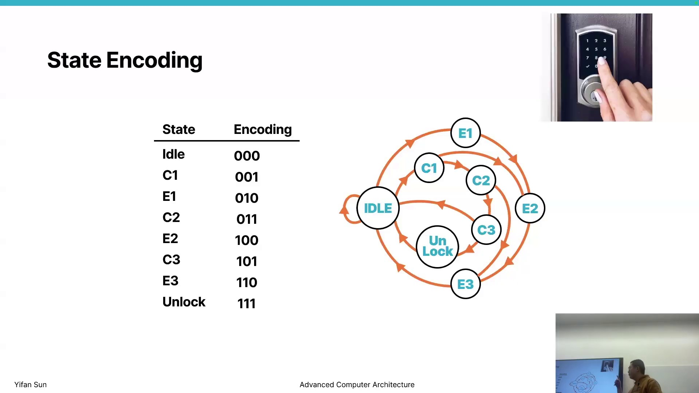

Eight states are assigned three-bit codes:

| State | Encoding | Meaning |
|---|---:|---|
| IDLE | 000 | waiting for first digit |
| C1 | 001 | first digit correct |
| E1 | 010 | first digit wrong |
| C2 | 011 | first two correct |
| E2 | 100 | an error after two entries |
| C3 | 101 | first three correct |
| E3 | 110 | error after three entries |
| Unlock | 111 | assert unlock |

State encoding turns symbolic states into register values that can participate in truth tables and Boolean equations.

### Slide 17 — State Transition table ([00:41:24](https://www.youtube.com/watch?v=zLhmFOjmMJk&t=2484s))

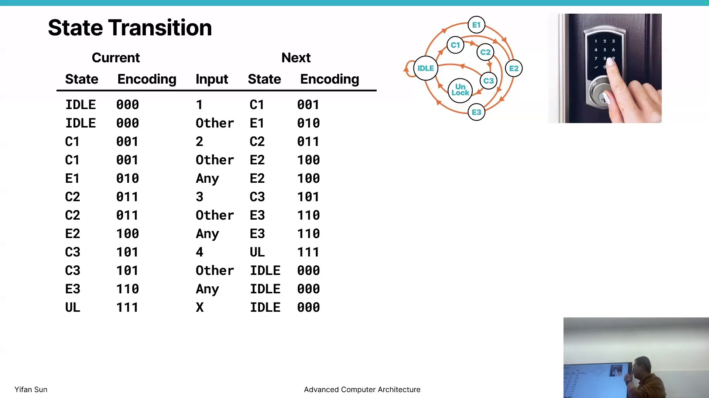

The table records, for every current state, which input advances to which next state. “Other” combines the many inputs that are not the expected digit. Error states advance according to position until the attempt completes, then return to `IDLE`. `Unlock` also returns to `IDLE`.

This is a larger truth table than the traffic-light example but uses exactly the same design method.

### Slide 18 — Clock-Based State Transition ([00:42:18](https://www.youtube.com/watch?v=zLhmFOjmMJk&t=2538s))

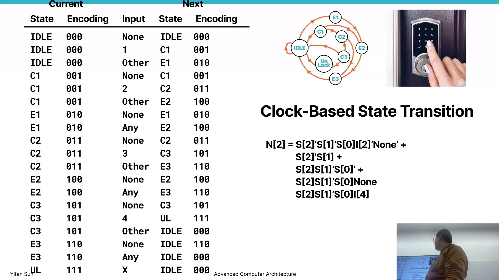

The transition table is expanded into Boolean expressions for each next-state bit. For example, $N[2]$ is asserted by the rows whose next-state encodings have bit 2 equal to 1. Each row contributes a product term consisting of current-state bits and the required input condition.

### Slide 19 — Boolean Expressions ([00:42:26](https://www.youtube.com/watch?v=zLhmFOjmMJk&t=2546s))

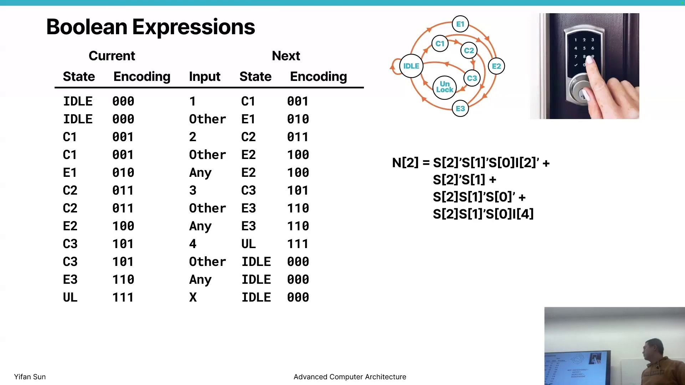

All next-state bits can be generated systematically from the encoded table. The expressions are longer and offer less simplification than the earlier example, but they remain ordinary combinational logic. The teacher skips drawing every gate because the derivation procedure is now established.

## 4. Deriving an FSM from an existing circuit

### Slide 20 — Derive an FSM from circuit ([00:42:50](https://www.youtube.com/watch?v=zLhmFOjmMJk&t=2570s))

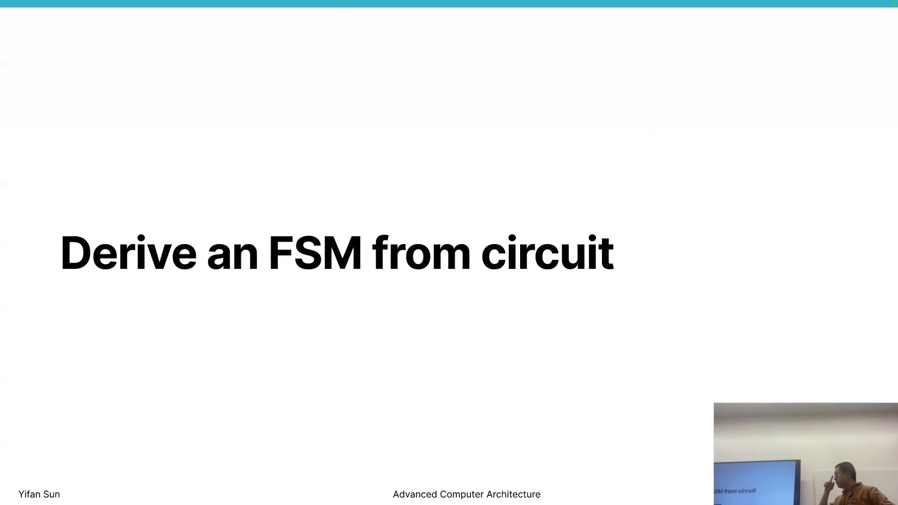

The reverse problem starts with a circuit and reconstructs its behavior. This is often simpler than synthesis because the gates directly reveal equations for next state and output.

### Slide 21 — Circuit ([00:42:58](https://www.youtube.com/watch?v=zLhmFOjmMJk&t=2578s))

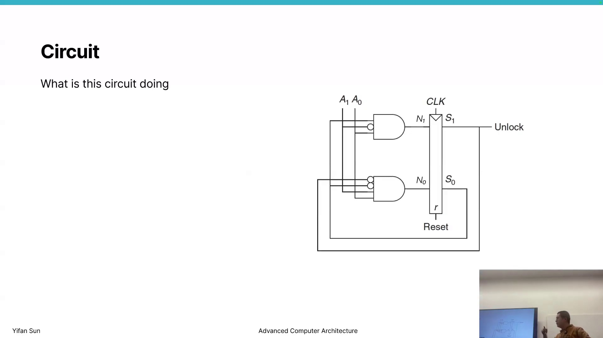

The circuit contains two state registers, next-state gate logic, clock, and reset. Reset returns the machine to its known initial state—a feature the teacher says is more common than omitting reset.

From the wires and gates:

- `Unlock` is directly related to state bit $S_1$;
- the gate network determines $N_1$ and $N_0$ from $S_1,S_0,A_1,A_0$;
- those equations can be evaluated for all possible input combinations.

### Slide 22 — Truth Table and recovered behavior ([00:44:02](https://www.youtube.com/watch?v=zLhmFOjmMJk&t=2642s))

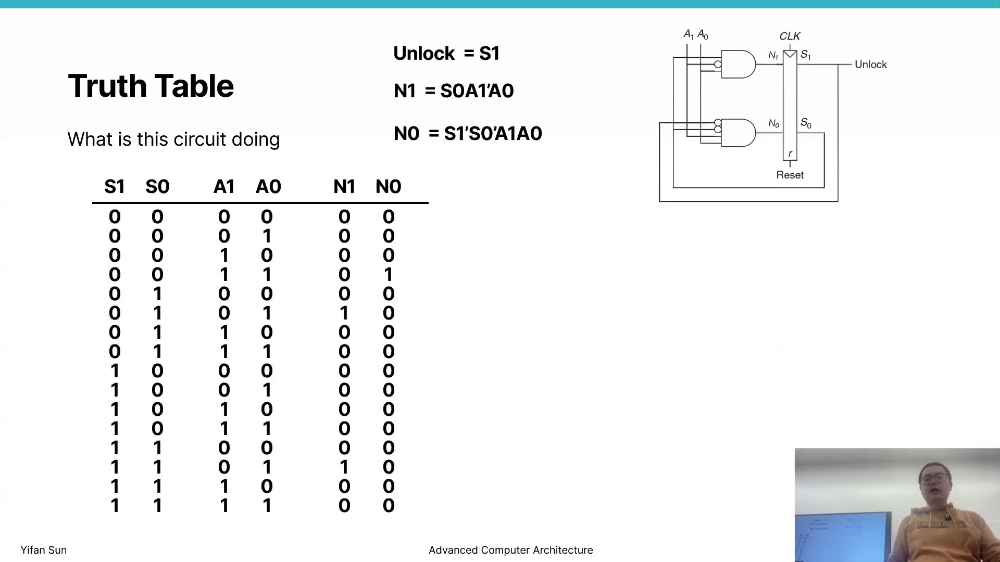

Treat $S_1,S_0,A_1,A_0$ as inputs and $N_1,N_0$ as outputs, then enumerate all 16 combinations. Decode the resulting state values to recover a three-state FSM:

1. From state 0, input $A=3$ advances to state 1; other values return/stay at state 0.
2. From state 1, input $A=1$ advances to state 2; other values return to state 0.
3. State 2 asserts `Unlock` because its high state bit is 1, then returns to state 0.

Thus the circuit recognizes the two-number passcode `3, 1`. The fourth encoding is unused and may safely recover to another state.

## 5. Counter as a sequential building block

### Slide 23 — Counter ([00:46:42](https://www.youtube.com/watch?v=zLhmFOjmMJk&t=2802s))

An $N$-bit counter combines:

- an $N$-bit register;
- combinational increment logic that adds 1;
- feedback from the register output to the incrementer;
- a clock and reset.

At every active clock edge, the register captures its previous value plus 1. Reset returns it to zero. It can be viewed as a mature reusable block or as an FSM forming one large cycle through all $2^N$ encodings.

The wedge-shaped block marked `+` represents arithmetic combinational logic—an ALU-like block. In this counter it performs only increment, so it is simpler than a general ALU.

### Slide 24 — Counter as frequency divider ([00:51:44](https://www.youtube.com/watch?v=zLhmFOjmMJk&t=3104s))

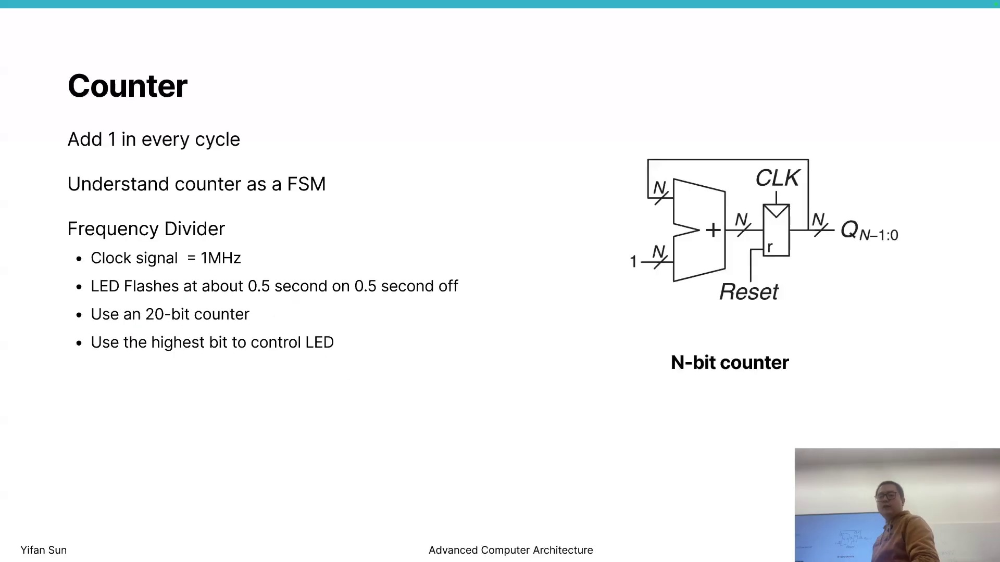

A counter can divide a high clock frequency. Its highest bit is 0 for half the count range and 1 for the other half, producing a 50% duty-cycle square wave at a much lower frequency.

Useful powers of two emphasized by the teacher:

$$
2^{10}\approx 1\text{K},\qquad
2^{20}\approx 1\text{M},\qquad
2^{30}\approx 1\text{G}.
$$

A roughly 20-bit counter can reduce a 1 MHz source to around 1 Hz, which can make an LED stay on for about 0.5 seconds and off for about 0.5 seconds. Crystal watches similarly divide a stable, high-frequency oscillator down to one-second ticks.

A divider can produce lower frequencies; it cannot create a frequency higher than its source clock.

### Slide 25 — Digitally Controlled Oscillator ([00:52:36](https://www.youtube.com/watch?v=zLhmFOjmMJk&t=3156s))

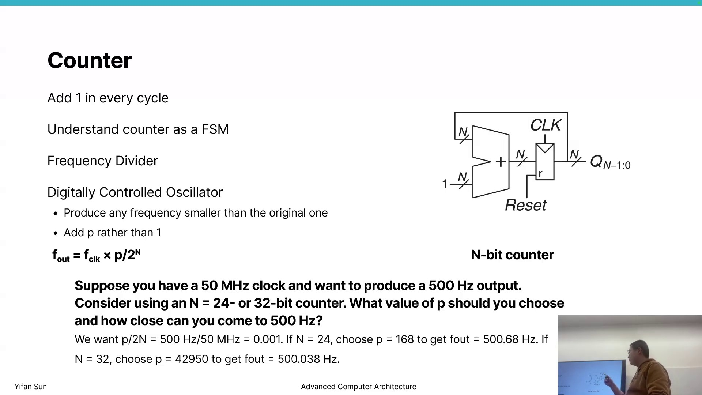

For a desired output frequency $f_{out}$ from source $f_{in}$, choose a count interval near

$$
N\approx\frac{f_{in}}{f_{out}}.
$$

The implementation selects a practical integer/power-of-two count, so the obtained frequency may only approximate the target. The slide's 50 MHz to 500 Hz example illustrates choosing a 24- or 32-bit counter and an appropriate terminal-count value.

### Slide 26 — PWM signal generator ([00:53:44](https://www.youtube.com/watch?v=zLhmFOjmMJk&t=3224s))

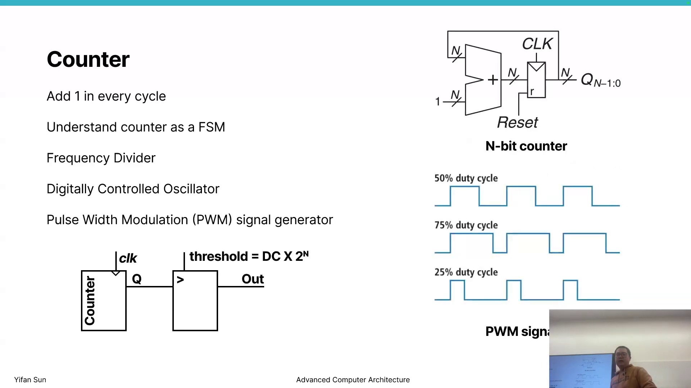

Pulse-width modulation keeps the period/frequency fixed while changing the fraction of each period that the signal is high—the **duty cycle**.

A counter supplies a repeating ramp of digital values. A comparator produces the output according to a programmable threshold. Conceptually:

$$
\text{Out}=1\quad\text{when counter is on one side of the threshold}.
$$

Changing the threshold creates 25%, 50%, 75%, or other duty cycles. A faster source clock gives finer duty-cycle resolution.

Applications discussed:

- screen brightness, by varying on-time faster than most users can perceive;
- motor/servo control in robotics, where duty cycle represents target position;
- some forms of power or volume control.

The teacher corrects a proposed pitch example: PWM here changes pulse width, not the repetition frequency.

### Slide 27 — Button-press detection/debouncing ([00:57:34](https://www.youtube.com/watch?v=zLhmFOjmMJk&t=3454s))

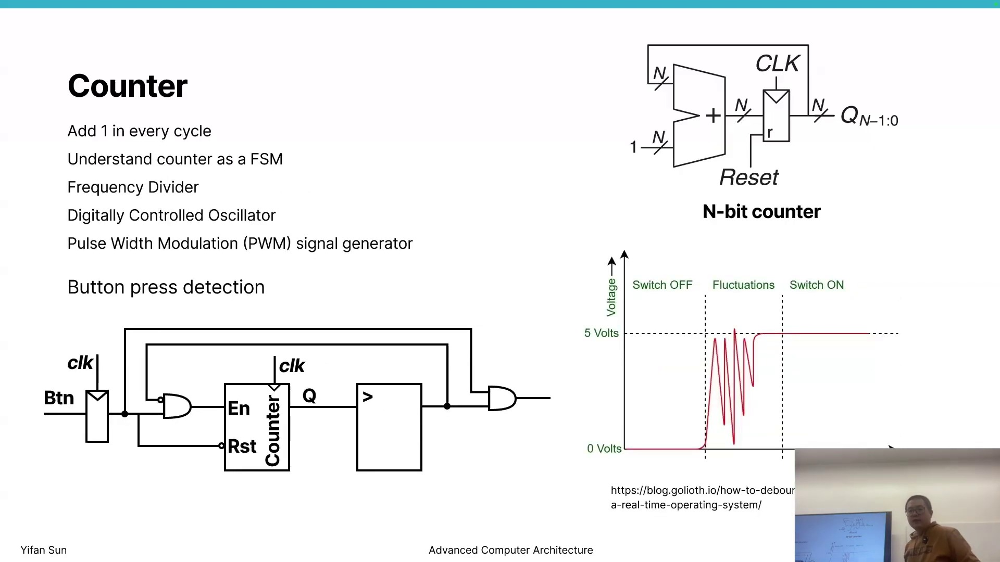

Mechanical contacts do not produce one clean edge. A single press can bounce, causing the voltage to cross the digital threshold many times; a directly connected counter may therefore count one press as dozens or thousands.

The shown circuit uses a counter as a time filter:

1. While the button is asserted, enable the counter and count clock cycles.
2. If the button drops during bouncing, reset the counter immediately.
3. Accept the press only after the signal remains asserted long enough to pass a threshold.

At 1 MHz, requiring about 1 ms of stability means counting roughly 1000 cycles. This creates deliberate latency but converts a noisy mechanical event into one reliable digital event. Similar debouncing is needed behind keyboard keys.

### Slide 28 — Counter application summary ([01:01:54](https://www.youtube.com/watch?v=zLhmFOjmMJk&t=3714s))

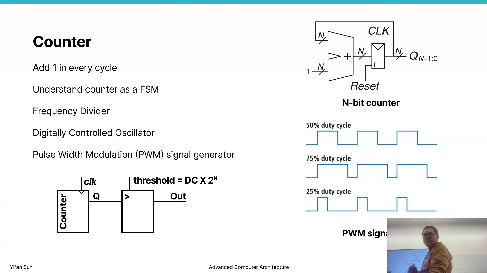

The slide consolidates the counter's uses:

- increment once per cycle;
- model a large cyclic FSM;
- divide frequency;
- form a digitally controlled oscillator;
- generate PWM through a comparator;
- debounce buttons through thresholded timing.

The teacher uses the counter to show how a simple sequential building block combines with familiar combinational blocks—incrementers and comparators—to form practical systems.

## 6. Summary and mental model

### Slide 29 — Summary ([01:05:10](https://www.youtube.com/watch?v=zLhmFOjmMJk&t=3910s))

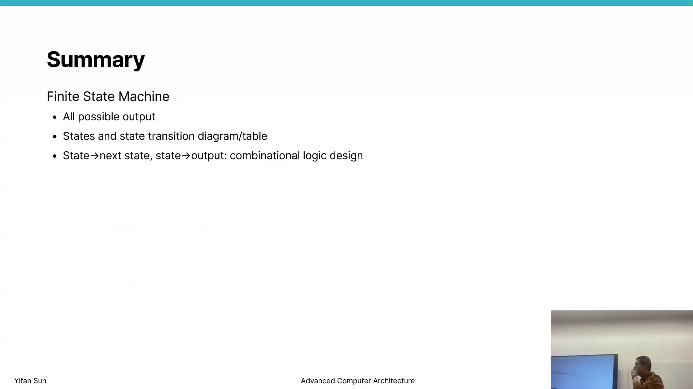

Finite-state-machine design consists of:

- identifying all possible outputs and states;
- expressing behavior as a state-transition diagram/table;
- encoding state in registers;
- designing state-to-next-state and state-to-output combinational logic.

The teacher's final analogy explains the division of responsibility. Imagine losing all memory every morning and reading only yesterday's journal. During the day you act from that journal; at night you write the journal for the next day.

- The **register is the journal**: the only context preserved across cycles.
- The **combinational logic is the current day's reasoning**: it has no memory of its own.
- The **next-state output becomes tomorrow's journal** at the clock edge.

This cycle-by-cycle, context-limited view is useful when designing or simulating caches, processors, and other computer-architecture components. The lecture concludes that these digital-design foundations are sufficient to begin studying CPU and GPU cores.

## Key definitions and formulas

### Sequential system

$$
\text{NextState}=f(\text{CurrentState},\text{Input})
$$

For a Moore machine:

$$
\text{Output}=g(\text{CurrentState}).
$$

For a Mealy machine:

$$
\text{Output}=g(\text{CurrentState},\text{Input}).
$$

### Clocked state update

$$
\text{CurrentState}\leftarrow\text{NextState}
$$

only at the active clock edge. Between edges, current-state registers remain stable while combinational logic settles.

### Counter

For an $N$-bit counter without reset:

$$
Q_{next}=(Q+1)\bmod 2^N.
$$

Each successive counter bit divides the preceding bit's frequency by approximately two. A comparator against a programmable threshold converts the count ramp into a PWM duty cycle.

## Design checklist

1. Define inputs and outputs.
2. List legal states and outputs.
3. Specify reset/recovery behavior, including unused states.
4. Draw every conditional and unconditional transition.
5. Choose a state encoding.
6. Build the transition/output table.
7. Derive one Boolean expression per next-state and output bit.
8. Simplify and implement the combinational logic.
9. Place registers on feedback paths and connect the clock/reset.
10. Check timing, glitches, and whether Moore or Mealy behavior is more appropriate.
