# Introduction to GPU Programming — illustrated lecture notes

- **Course:** Advanced Computer Architecture
- **Instructor:** Yifan Sun, William & Mary
- **Video:** [YouTube](https://www.youtube.com/watch?v=2KUZpiB4t_4)
- **Duration:** 1:12:15
- **Sources:** downloaded lecture video, original English subtitles, extracted slide frames

> Images are captured from the video. Explanations follow the teacher’s narration, not only the visible slide text.

## 1. Why GPU programming?

### Slide 1 — GPU Architecture 1 ([00:00:02](https://www.youtube.com/watch?v=2KUZpiB4t_4&t=2s))
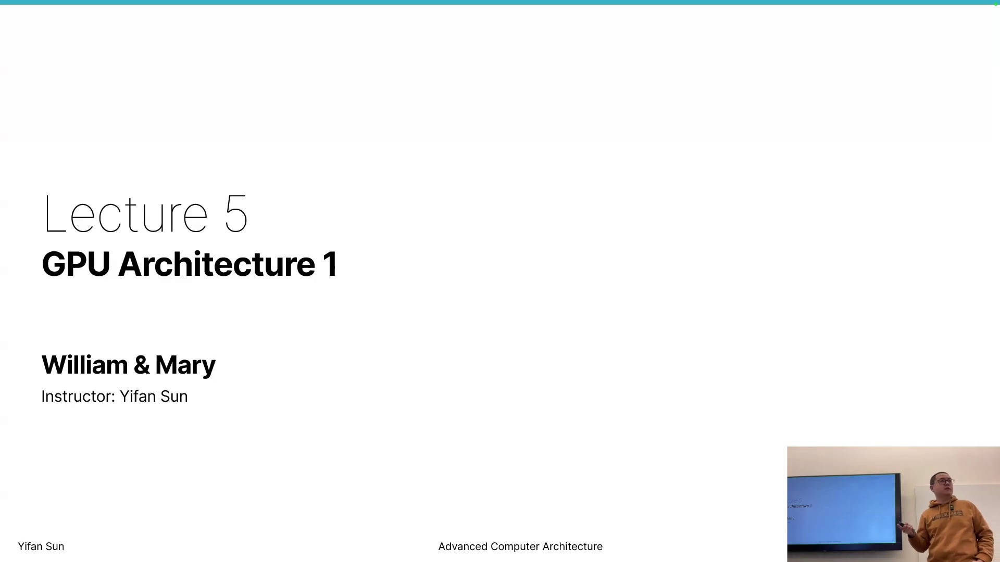

This begins a three-lecture GPU unit. GPU optimizations are introduced before CPU optimizations because their data-parallel design is more direct and visible.

### Slide 2 — Sequential logic review ([00:00:58](https://www.youtube.com/watch?v=2KUZpiB4t_4&t=58s))
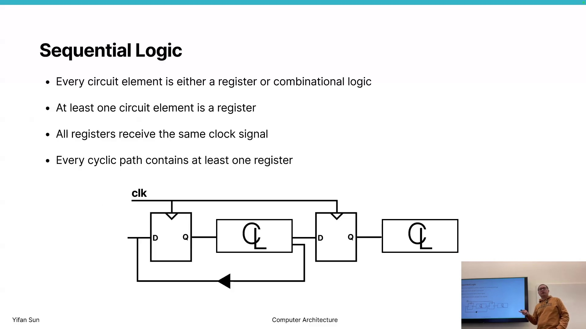

Digital systems combine registers and combinational logic. Registers update on a common clock; every feedback cycle must contain storage. Hand-designed K-maps are small, but real chips contain huge numbers of registers and logic blocks.

### Slide 3 — Sequential logic in real hardware ([00:01:58](https://www.youtube.com/watch?v=2KUZpiB4t_4&t=118s))
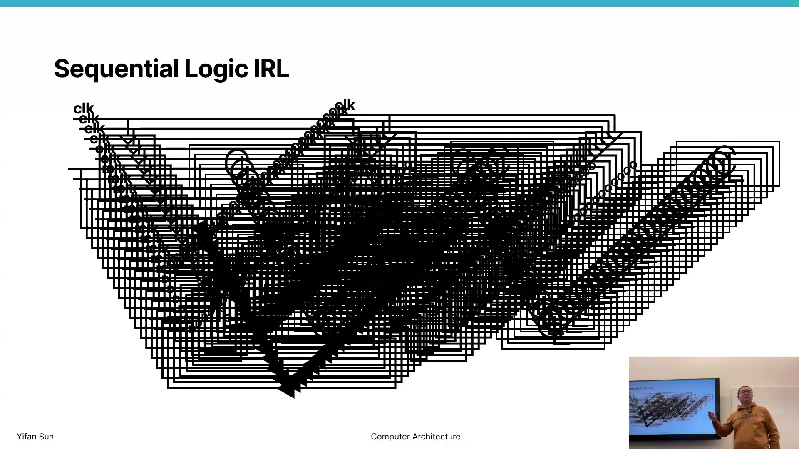

When registers change, many independent combinational blocks calculate simultaneously. Hardware is naturally massively parallel even though programs are commonly written as sequential instruction streams.

### Slide 4 — The intrinsic conflict ([00:02:34](https://www.youtube.com/watch?v=2KUZpiB4t_4&t=154s))
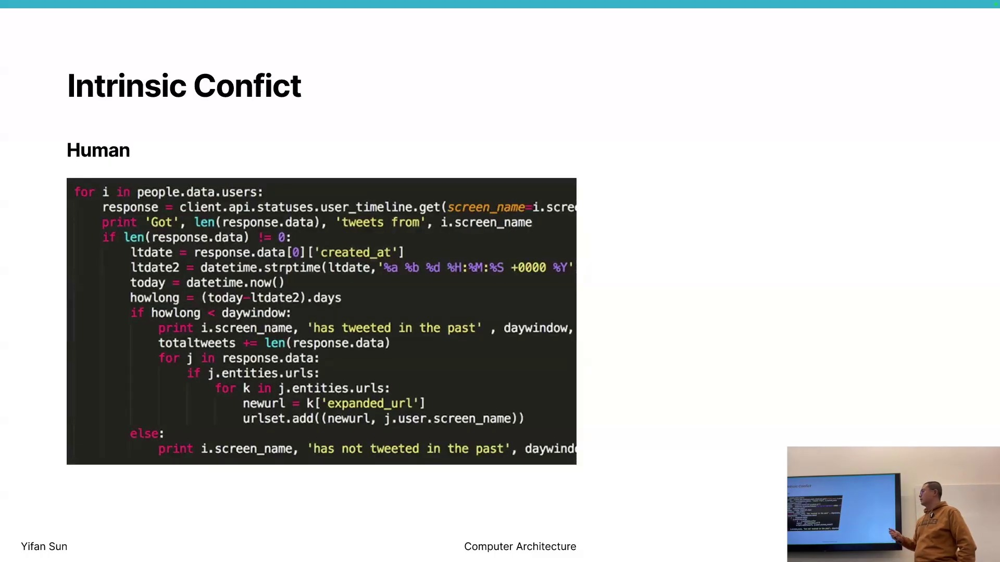

Humans describe “first A, then B,” while hardware could perform thousands of independent operations together. GPU programming exposes data/thread parallelism to the programmer. CPUs traditionally hid parallelism through instruction-level techniques; modern multicore CPUs also expose threads.

### Slide 5 — Vector addition ([00:04:10](https://www.youtube.com/watch?v=2KUZpiB4t_4&t=250s))
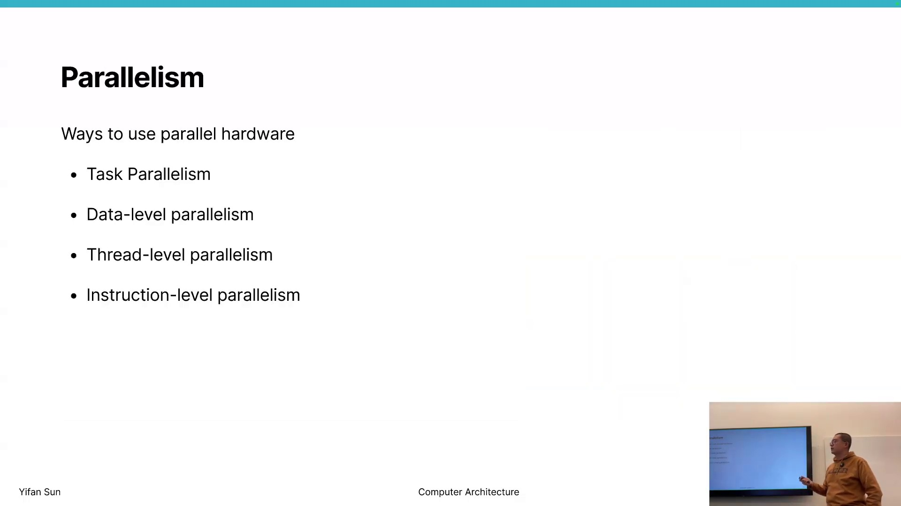

For $C[i]=A[i]+B[i]$, every output element is independent. Iterations can execute in any order, making this **embarrassingly parallel**. A common GPU strategy is one logical task per output element.

### Slide 6 — Naïve pthread version ([00:06:44](https://www.youtube.com/watch?v=2KUZpiB4t_4&t=404s))
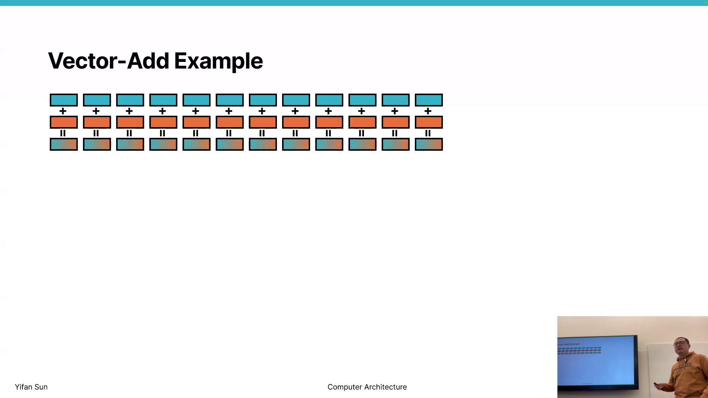

One CPU thread per element is theoretically parallel but practically poor: thread creation, stack allocation, and scheduling cost more than one addition. CPU code should usually create roughly one worker per core and give each worker many elements.

### Slide 7 — Joining workers ([00:06:54](https://www.youtube.com/watch?v=2KUZpiB4t_4&t=414s))
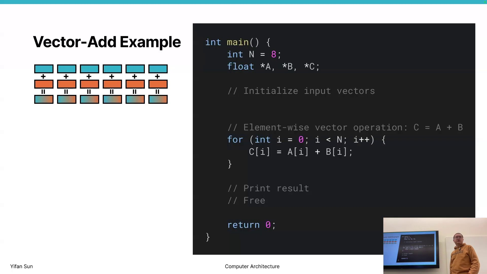

The main thread must `pthread_join` workers before consuming results. Parallel launches are asynchronous; an explicit synchronization point prevents reading incomplete output. GPU programming follows the same launch-then-wait pattern.

### Slide 8 — Finding parallelism ([00:08:52](https://www.youtube.com/watch?v=2KUZpiB4t_4&t=532s))
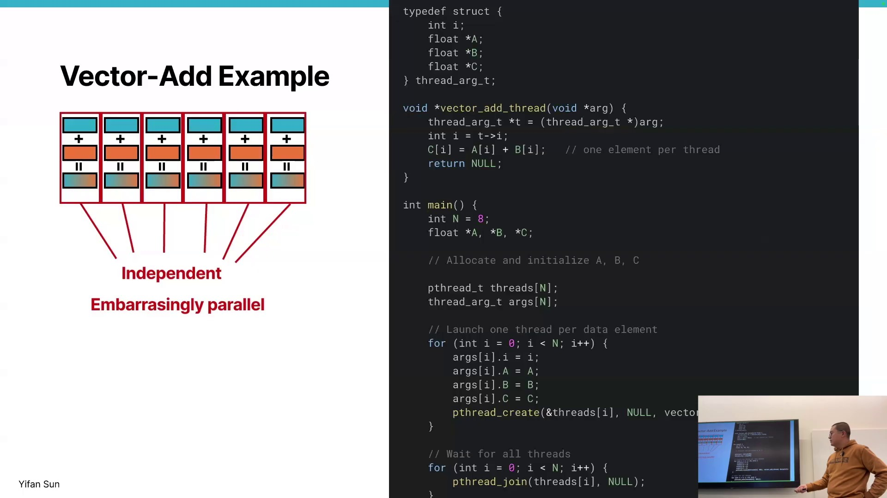

Look for independent output elements, then map those tasks to parallel workers. Real applications may not be entirely embarrassingly parallel, but often contain regions that are.

### Slides 9–10 — Matrix multiplication ([00:12:42](https://www.youtube.com/watch?v=2KUZpiB4t_4&t=762s))
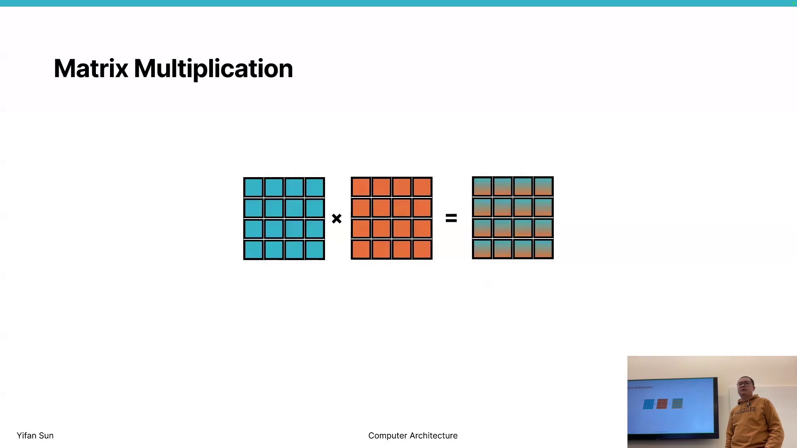
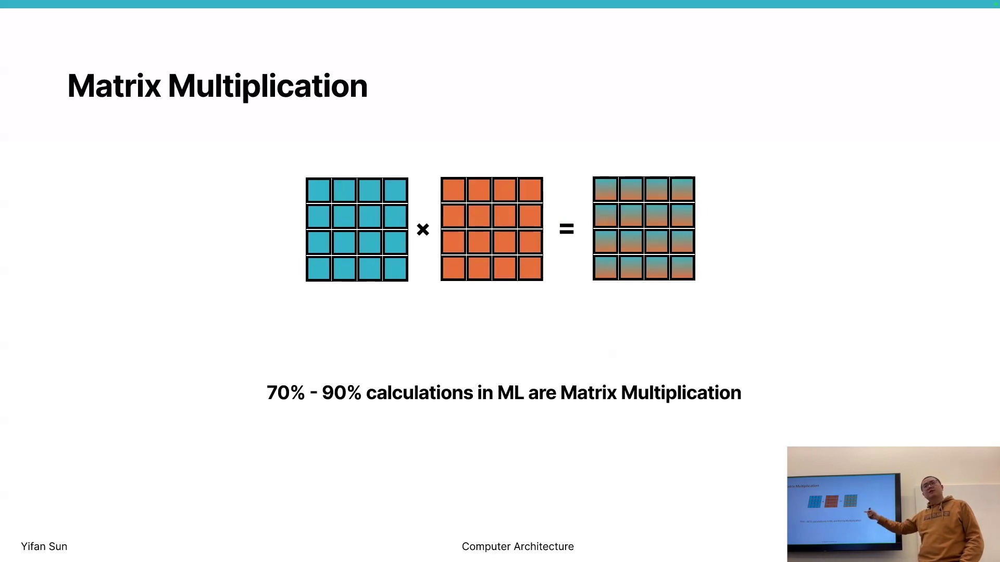

Each matrix output cell is a dot product:

$$
C_{ij}=\sum_k A_{ik}B_{kj}
$$

Cells are independent, so large matrices provide enormous parallelism. Matrix multiplication dominates fully connected layers, transformed convolutions, and transformers; GPU design decisions strongly prioritize it. The teacher says a gain in matrix multiplication can justify losses elsewhere, while a regression in it is usually unacceptable.

### Slide 11 — Graphics origins ([00:16:32](https://www.youtube.com/watch?v=2KUZpiB4t_4&t=992s))
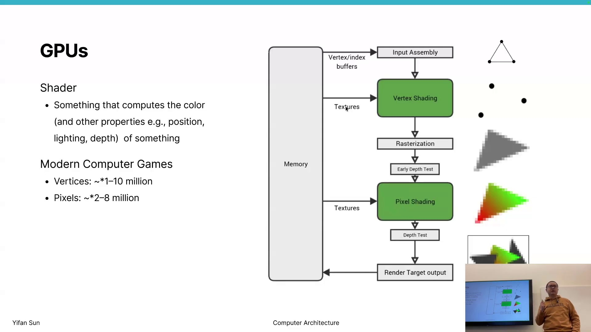

Graphics maps naturally to parallel hardware: transform millions of vertices, rasterize triangles, and shade millions of pixels independently. Ray tracing adds many independent ray/intersection tests per pixel. ML researchers later reused this throughput architecture for numerical computing.

## 2. Host/device and memory models

### Slide 12 — Host and device ([00:18:42](https://www.youtube.com/watch?v=2KUZpiB4t_4&t=1122s))
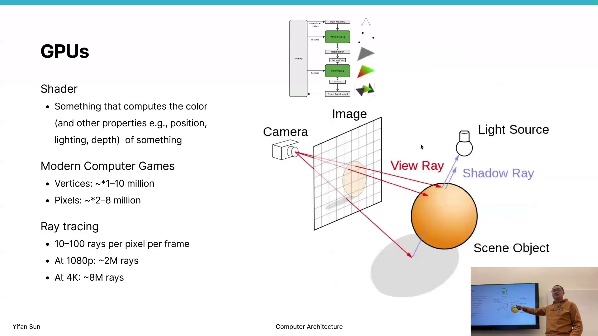

The **host** CPU initializes data, handles files/network/input, launches work, and consumes results. The **device** GPU accelerates highly parallel regions but is weak at sequential orchestration.

Frameworks discussed:

- CUDA: NVIDIA-only, mature ecosystem.
- OpenCL: portable but verbose.
- HIP: AMD’s CUDA-like API; much code can be translated.
- Metal: Apple platform.
- Triton: Python/tile-based ML kernels with automatic tuning; a good ML-first option, though CUDA concepts remain useful.

### Slide 13 — Separate CPU/GPU memory ([00:21:58](https://www.youtube.com/watch?v=2KUZpiB4t_4&t=1318s))
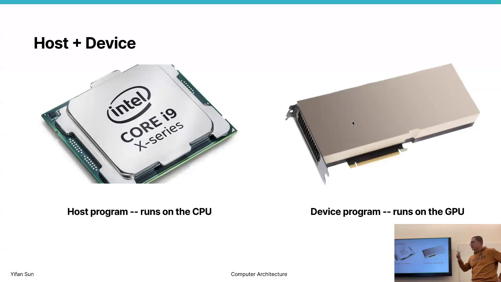

Discrete GPUs have a separate address space. The host normally allocates CPU and device buffers, copies inputs host-to-device, launches a kernel, then copies results device-to-host. Capacity can be as limiting as compute for large models.

### Slide 14 — GDDR and HBM hardware ([00:22:36](https://www.youtube.com/watch?v=2KUZpiB4t_4&t=1356s))
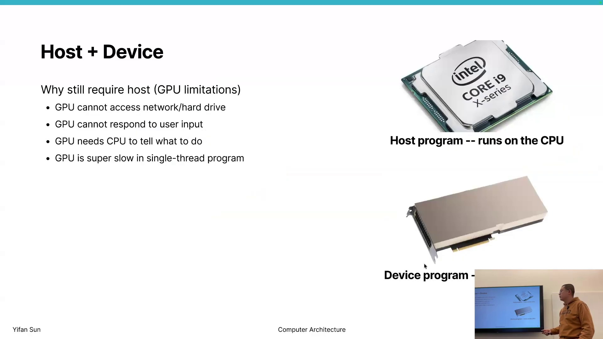

Consumer GPUs surround the die with GDDR chips, balancing latency, bandwidth, and cost. Compute accelerators use stacked HBM for much higher bandwidth at greater packaging cost. Graphics has strict frame deadlines; compute workloads often value aggregate throughput more.

### Slide 15 — Memory hierarchy comparison ([00:28:46](https://www.youtube.com/watch?v=2KUZpiB4t_4&t=1726s))
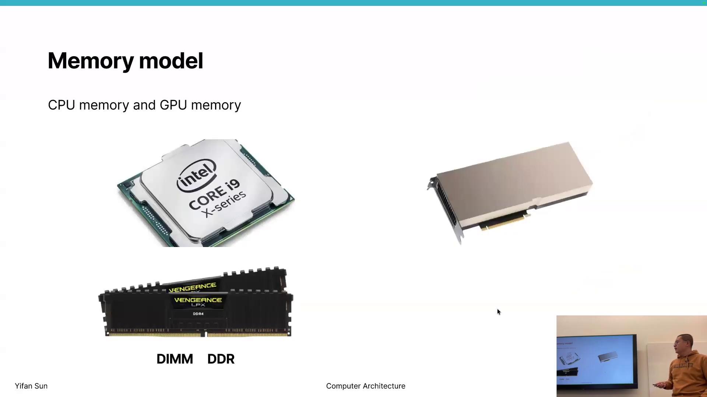

CPU DDR DIMMs and GPU GDDR/HBM are different physical subsystems. Explicit movement is expensive, so programs should transfer in large useful batches and avoid unnecessary round trips.

### Slide 16 — Consumer versus compute GPU ([00:30:22](https://www.youtube.com/watch?v=2KUZpiB4t_4&t=1822s))
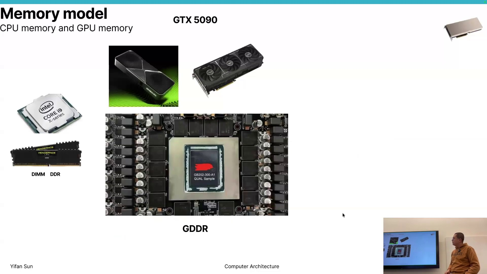

A gaming GPU favors cost and latency; an H100-class accelerator invests in HBM capacity/bandwidth and advanced packaging. Workload needs—not only nominal compute—determine the better design.

### Slide 17 — GH200 and MI300A ([00:33:02](https://www.youtube.com/watch?v=2KUZpiB4t_4&t=1982s))
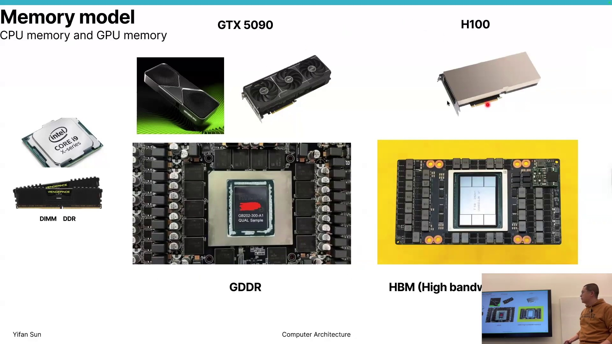

Chiplets bring CPU, GPU, and HBM closer. NVIDIA Grace Hopper offers a tightly connected unified address space; AMD MI300A integrates CPU and GPU chiplets with shared HBM. Access remains potentially non-uniform: placement affects latency and bandwidth.

### Slide 18 — Unified-memory spectrum ([00:36:56](https://www.youtube.com/watch?v=2KUZpiB4t_4&t=2216s))
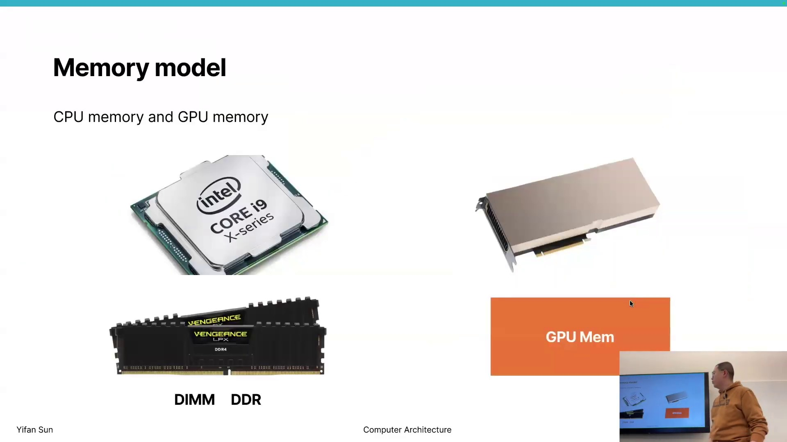

“Unified memory” ranges from software-managed page migration on discrete GPUs to genuinely shared physical memory on integrated designs. Demand access over PCIe can cost thousands of cycles; migrating a page helps reuse but has setup cost.

Teacher guidance: prefer explicit copies on discrete accelerators; unified access is more attractive on tightly integrated hardware, but NUMA placement can still matter.

### Slide 19 — Unified implementations ([00:39:24](https://www.youtube.com/watch?v=2KUZpiB4t_4&t=2364s))
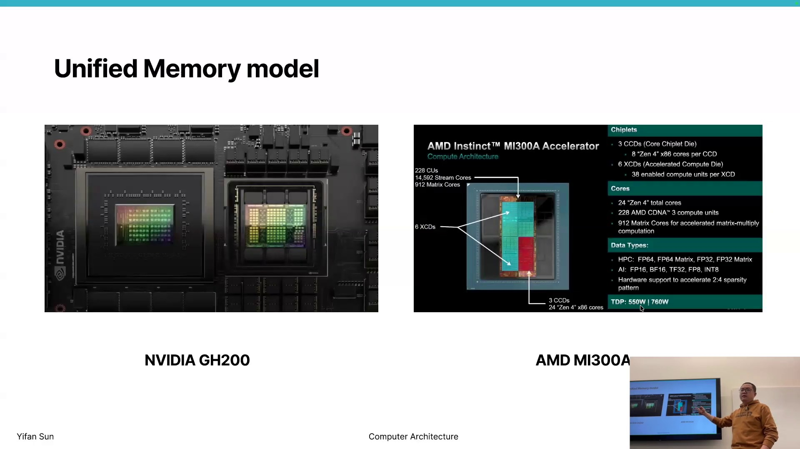

GH200 and MI300A illustrate different integration points. Unified addressing simplifies pointers, but does not guarantee uniform physical access speed.

### Slide 20 — Apple M3 Ultra ([00:41:58](https://www.youtube.com/watch?v=2KUZpiB4t_4&t=2518s))
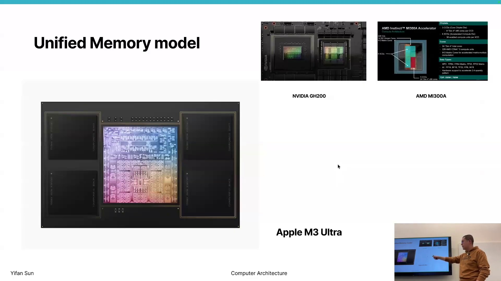

Apple integrates CPU, GPU, and large shared LPDDR memory. Avoiding duplicate host/device copies makes it attractive for capacity-heavy inference. Training still benefits from accelerator HBM bandwidth and specialized hardware.

### Slide 21 — Unified-memory code ([00:49:20](https://www.youtube.com/watch?v=2KUZpiB4t_4&t=2960s))
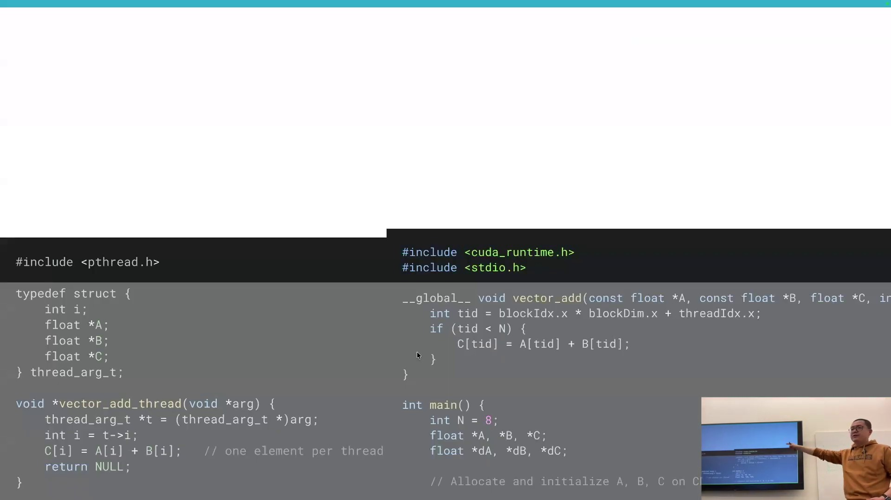

One allocation can be visible to CPU and GPU, eliminating paired pointers and explicit transfers. This simplifies code and preserves capacity, but performance depends on the actual hardware implementation.

## 3. CUDA vector addition

### Slide 22 — Program structure ([00:49:42](https://www.youtube.com/watch?v=2KUZpiB4t_4&t=2982s))
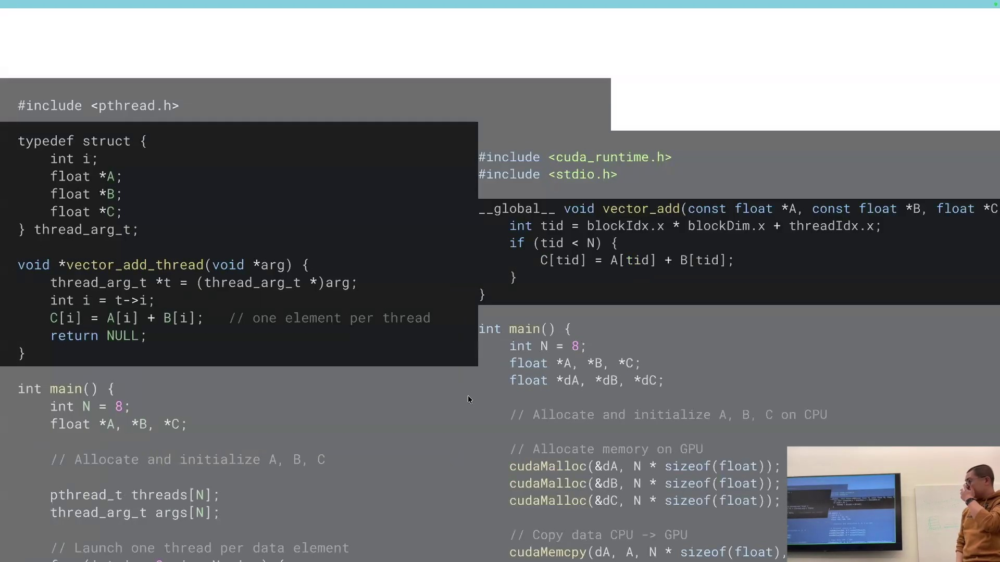

CUDA host code is ordinary C/C++ plus runtime calls. Device work is written as a kernel. Unlike pthread code, CUDA does not need one argument structure and OS thread object per logical task.

### Slide 23 — Kernel definition ([00:51:40](https://www.youtube.com/watch?v=2KUZpiB4t_4&t=3100s))
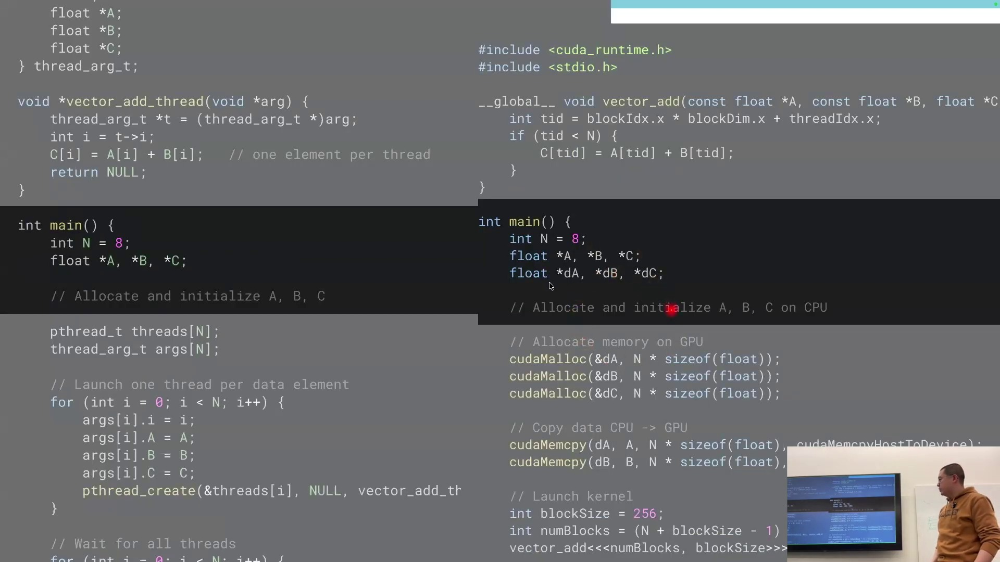

A kernel uses `__global__` and runs once per GPU thread. Each thread calculates a unique global index:

$$
\mathrm{tid}=\mathrm{blockIdx.x}\times\mathrm{blockDim.x}+\mathrm{threadIdx.x}
$$

Then it computes `C[tid] = A[tid] + B[tid]` if `tid < N`.

### Slide 24 — Device allocation and copies ([00:52:14](https://www.youtube.com/watch?v=2KUZpiB4t_4&t=3134s))
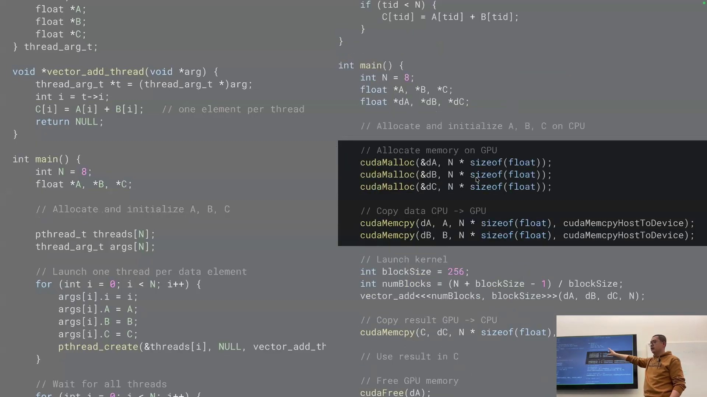

Host arrays use `malloc`; device arrays conventionally named `dA`, `dB`, `dC` use `cudaMalloc`. `cudaMemcpy(..., cudaMemcpyHostToDevice)` stages inputs on the GPU.

### Slide 25 — Launch and synchronization ([00:53:30](https://www.youtube.com/watch?v=2KUZpiB4t_4&t=3210s))
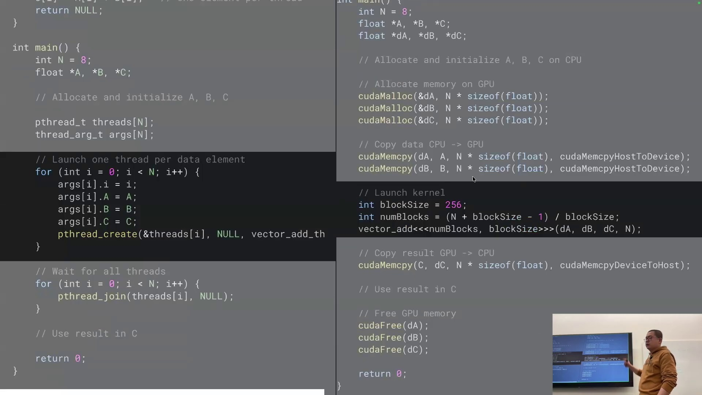

CUDA launches `kernel<<<numBlocks, blockSize>>>(...)`. Ceiling division computes the block count:

$$numBlocks=\left\lceil\frac{N}{blockSize}\right\rceil
=\frac{N+blockSize-1}{blockSize}\quad\text{(integer division)}.$$

Copying output back synchronizes with the kernel; `cudaFree` releases device buffers.

### Slide 26 — pthread versus CUDA ([00:55:00](https://www.youtube.com/watch?v=2KUZpiB4t_4&t=3300s))
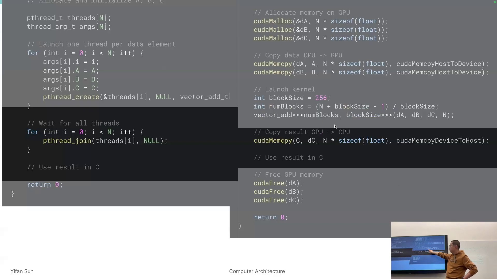

CUDA replaces per-thread creation/join loops with one scalable launch. Hardware supplies thread indices, while CUDA runtime calls manage device memory.

### Slide 27 — Complete host flow ([00:55:44](https://www.youtube.com/watch?v=2KUZpiB4t_4&t=3344s))
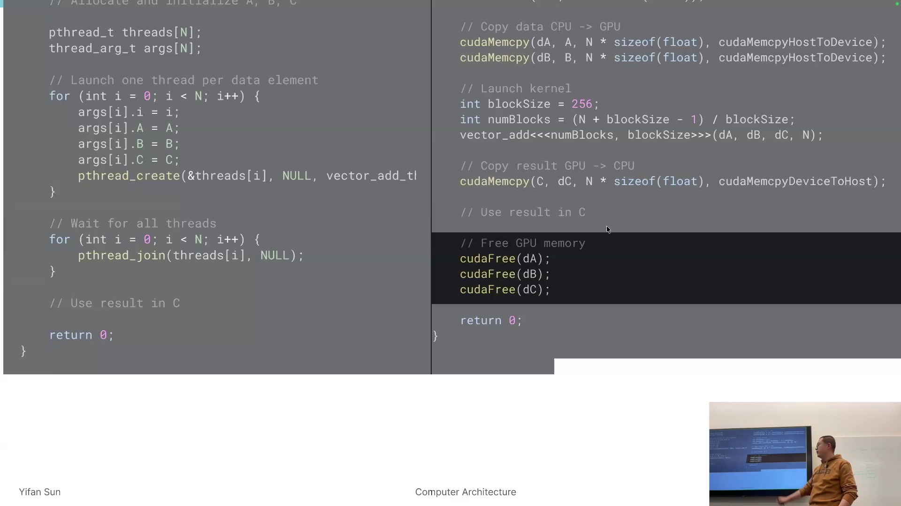

The complete sequence is allocate host/device memory, initialize host input, copy inputs, launch, copy output, use results, and free both memory spaces.

## 4. Threads, blocks, and SIMT

### Slide 28 — Kernel concept ([00:56:14](https://www.youtube.com/watch?v=2KUZpiB4t_4&t=3374s))
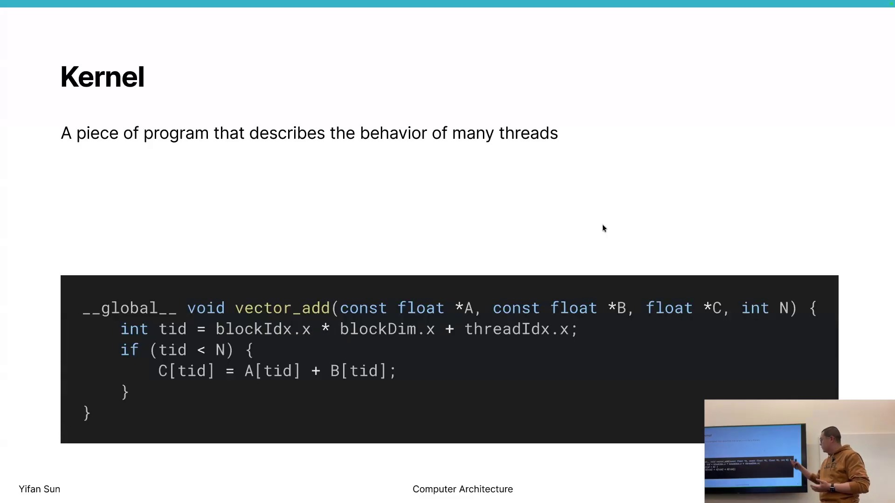

A kernel describes the behavior of many threads. The code is shared, but each thread’s IDs and data differ.

### Slide 29 — Blocks ([00:57:44](https://www.youtube.com/watch?v=2KUZpiB4t_4&t=3464s))
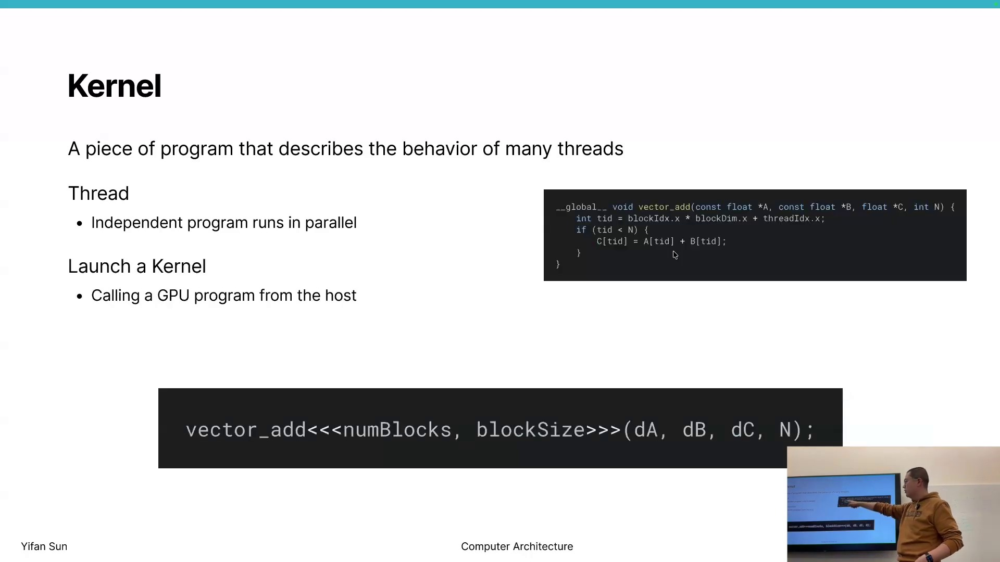

A block is a group of threads that may communicate through shared memory and synchronize. Different blocks cannot safely synchronize inside one kernel; a kernel boundary provides global synchronization.

### Slide 30 — Choosing dimensions ([00:58:04](https://www.youtube.com/watch?v=2KUZpiB4t_4&t=3484s))
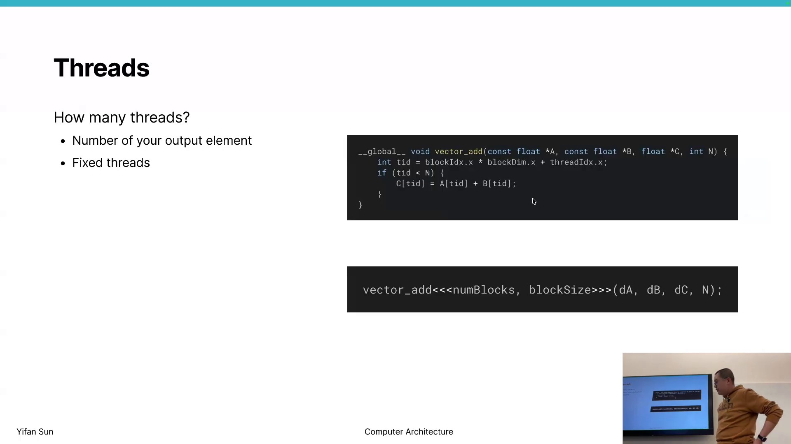

Typical block sizes are multiples of 32 up to 1024. One thread per element is simple, but dispatch overhead can dominate trivial work; profiling may favor a fixed thread count with each thread processing several elements.

### Slide 31 — Global indexing ([01:03:20](https://www.youtube.com/watch?v=2KUZpiB4t_4&t=3800s))
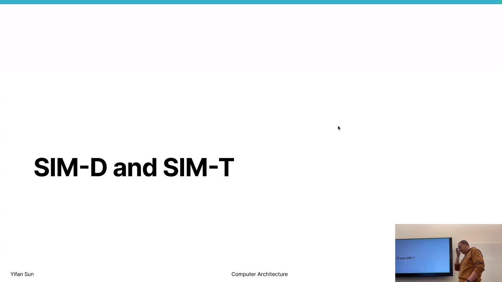

`threadIdx.x` identifies a lane within a block; `blockIdx.x` identifies the block; `blockDim.x` gives block width. Rounded-up launches create extra threads, so the bounds check prevents invalid access.

### Slide 32 — SIMD and SIMT ([01:04:52](https://www.youtube.com/watch?v=2KUZpiB4t_4&t=3892s))
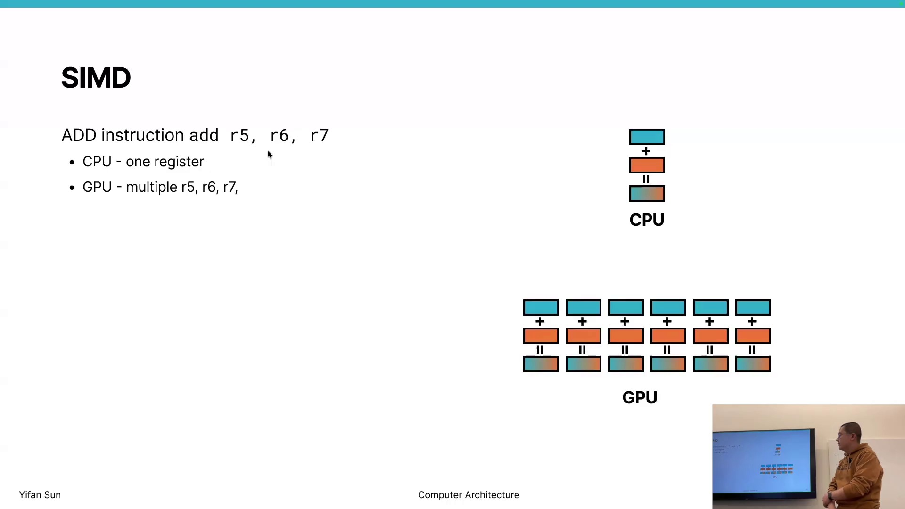

SIMD applies one explicit instruction to multiple packed data values. GPU **SIMT** presents independent threads to the programmer but groups them into lockstep hardware warps/wavefronts. This gives a thread-oriented programming model atop SIMD-like execution.

### Slide 33 — Execution-model summary ([01:11:56](https://www.youtube.com/watch?v=2KUZpiB4t_4&t=4316s))
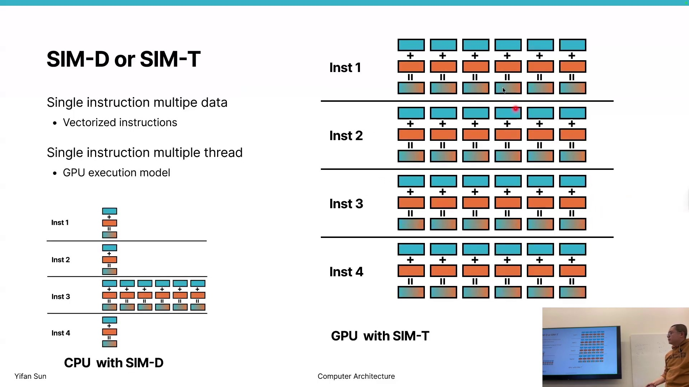

The hierarchy is kernel → grid → blocks → threads. Threads in a warp/wavefront execute together; blocks are the communication/scheduling boundary. Efficient GPU programs expose abundant independent work, move data deliberately, choose sensible block sizes, and avoid making thread-launch overhead dominate useful computation.

## Key formulas

$$
C_{ij}=\sum_k A_{ik}B_{kj}
$$

$$
\mathrm{tid}=\mathrm{blockIdx.x}\cdot\mathrm{blockDim.x}+\mathrm{threadIdx.x}
$$

$$
\mathrm{numBlocks}=\left\lceil\frac{N}{\mathrm{blockSize}}\right\rceil
$$
