# GPU Architecture and Kernel Dispatching

**Course:** CSCI 654 Advanced Computer Architecture, Spring 2026  
**Instructor:** Yifan Sun, William & Mary  
**Video:** [YouTube lecture](https://www.youtube.com/watch?v=3P4gzNcxzQ0) (57:17)

These notes cover the lecture's substantive slides and progressive diagrams. Explanations are based on the original English captions and visuals; obvious caption errors are normalized to CUDA, opcode, operands, wavefront, and execution mask.

## From CUDA to GPU instructions

### Slide 1 — GPU architecture continuation ([00:00:05](https://www.youtube.com/watch?v=3P4gzNcxzQ0&t=5s))

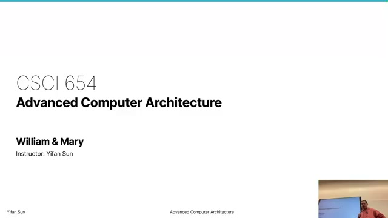

This lecture continues the course's GPU architecture unit. The goal is to descend from the CUDA programming model into the hardware mechanisms that execute a kernel, then explain how a CPU submits work and how blocks are dispatched to compute units (CUs).

### Slide 2 — Review ([00:00:35](https://www.youtube.com/watch?v=3P4gzNcxzQ0&t=35s))

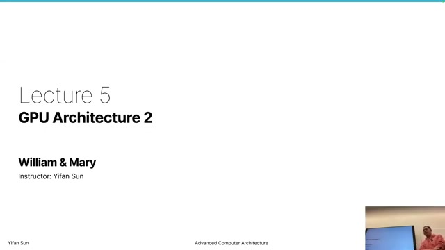

The previous lecture introduced data-level parallelism: many independent data elements undergo the same operation. GPUs originated in graphics, where vertices and pixels naturally exhibit this structure. The review connects that history to general-purpose kernels and identifies embarrassingly parallel work as the easiest kind of parallelism to exploit.

### Slide 3 — Intrinsic conflict ([00:01:05](https://www.youtube.com/watch?v=3P4gzNcxzQ0&t=65s))

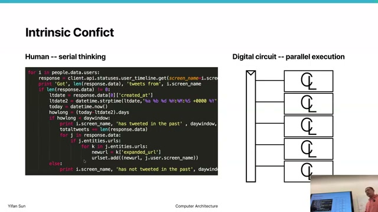

The instructor calls out an intrinsic conflict: people often describe algorithms as sequential steps, but digital hardware contains many independent circuits that can operate simultaneously. GPU programming asks the programmer and compiler to expose independent work so that this physical parallelism is not left idle.

### Slide 4 — Vector-add kernel ([00:01:35](https://www.youtube.com/watch?v=3P4gzNcxzQ0&t=95s))

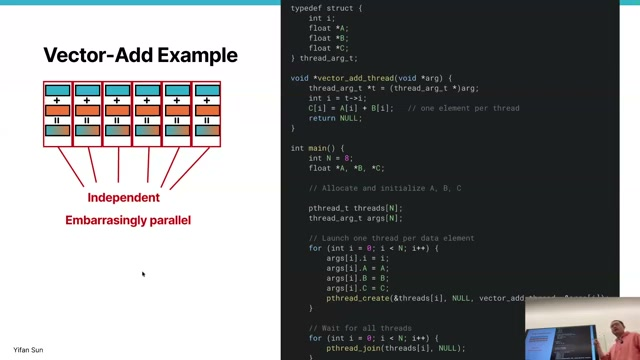

A CUDA kernel describes what **one thread** does. In vector addition, each thread reads corresponding elements, adds them, and writes one output. The launch supplies the number of blocks and threads per block; together they create enough logical threads to cover the data. Threads run the same kernel but select different elements through their indices.

### Slide 5 — CUDA index hierarchy ([00:02:15](https://www.youtube.com/watch?v=3P4gzNcxzQ0&t=135s))

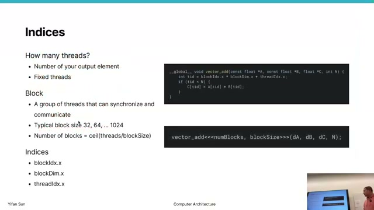

CUDA organizes a launch as a grid of blocks, each containing threads. In one dimension, a thread's global index is

$$
i = blockIdx.x \times blockDim.x + threadIdx.x.
$$

`threadIdx.x` identifies a thread within its block, `blockIdx.x` identifies the block, and `blockDim.x` is the block width. Grids and blocks may also be two- or three-dimensional. A block can contain up to an implementation-defined limit, commonly 1024 threads.

### Slide 6 — Down into the assembly ([00:04:05](https://www.youtube.com/watch?v=3P4gzNcxzQ0&t=245s))

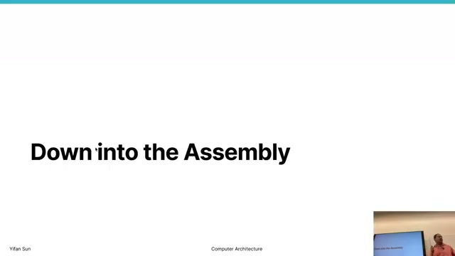

The lecture now asks how CUDA's abstractions map to hardware. Restrictions such as “threads in different blocks cannot synchronize directly” are not arbitrary language rules: they follow from a dispatch design in which blocks may run on different CUs, at different times, with no guarantee that they coexist.

### Slide 7 — Shifted-copy source and assembly ([00:05:15](https://www.youtube.com/watch?v=3P4gzNcxzQ0&t=315s))

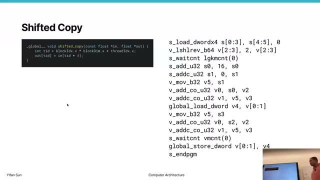

The running kernel is simpler than vector addition: each thread copies a value shifted by four elements.

```c
output[i] = input[i + 4];
```

The generated AMD-style assembly first derives the thread's index, computes byte addresses, loads from global memory, waits for the data, and stores the result. Since a `float` is four bytes, the index-to-address conversion includes a factor of four. The long assembly listing exposes work hidden by one source statement: launch metadata, address formation, memory operations, and synchronization.

### Slide 8 — Scalar and vector execution ([00:10:30](https://www.youtube.com/watch?v=3P4gzNcxzQ0&t=630s))

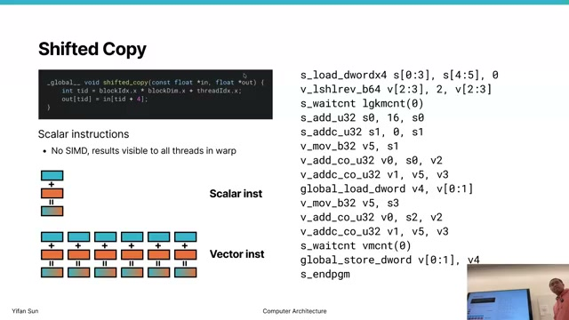

AMD GPU assembly separates scalar (`s`) and vector (`v`) registers and instructions.

| Property | Scalar path | Vector path |
|---|---|---|
| Values | One value shared by the wavefront | One value per lane/thread |
| Register storage | One 32-bit value | One 32-bit value for every lane |
| Instruction effect | One operation | Same operation across all lanes |
| Good use | Uniform addresses, sizes, constants | Per-thread indices and data |

For an AMD wavefront of 64 lanes, one vector instruction conceptually performs 64 lane operations. A scalar operation executes once and shares its result. The distinction avoids replicating work known to be uniform, while vector registers carry thread-specific state.

### Slide 9 — Wavefront memory synchronization ([00:13:00](https://www.youtube.com/watch?v=3P4gzNcxzQ0&t=780s))

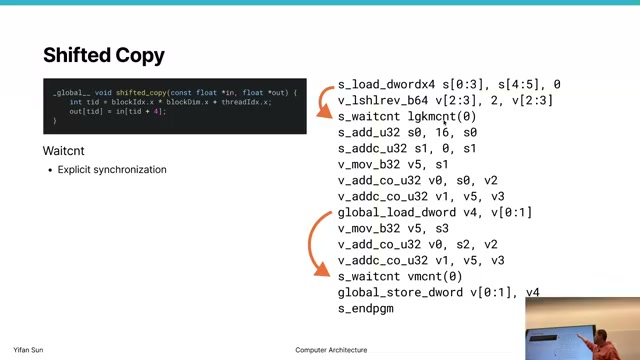

A **wavefront** is AMD's lockstep execution group, commonly 64 threads; NVIDIA calls its typically 32-thread group a **warp**. Memory loads are asynchronous, so generated code can perform independent address calculations while data is in flight.

`s_waitcnt` provides explicit synchronization. The lecture describes a counter that increases when memory work is issued and decreases as requests finish. Waiting for the relevant counter to reach zero guarantees that a subsequent instruction does not consume data before it arrives. This makes dependency handling visible to the compiler instead of relying on CPU-style dynamic scheduling hardware.

## Thread divergence

### Slide 10 — Branches inside a wavefront ([00:23:35](https://www.youtube.com/watch?v=3P4gzNcxzQ0&t=1415s))

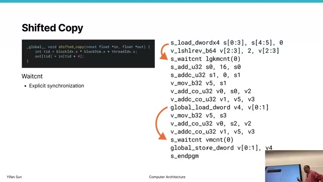

Lockstep execution is straightforward until threads evaluate a condition differently. A vector comparison produces a per-lane predicate, represented by a bit mask such as AMD's VCC. A bit is 1 when that lane satisfies the comparison and 0 otherwise. The control-flow instructions use this information to determine which lanes should have an effect in each basic block.

**Thread divergence** occurs when lanes in one wavefront need different branches. The hardware does not turn the wavefront into independent scalar threads; it executes paths with different lane masks.

### Slide 11 — Execution mask and predication ([00:26:30](https://www.youtube.com/watch?v=3P4gzNcxzQ0&t=1590s))

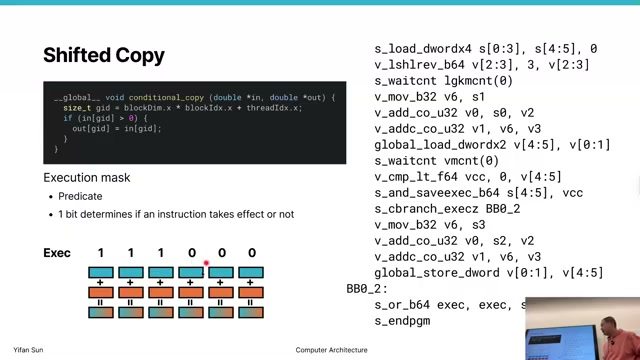

The execution mask (`EXEC` in AMD terminology) has one bit per lane. A set bit enables that lane's architectural effect. A cleared bit suppresses its writes, but the masked lane still occupies the lockstep instruction slot, so time and execution capacity are wasted.

For an `if/else`, the machine runs one branch under the “true” mask, flips to the complementary mask for the other branch, and restores the original mask at reconvergence. Nested conditions require saved masks and behave like a stack. If a mask becomes all zero, control flow can skip a block because no lane has useful work there.

### Slide 12 — Calculating divergence cost ([00:31:10](https://www.youtube.com/watch?v=3P4gzNcxzQ0&t=1870s))

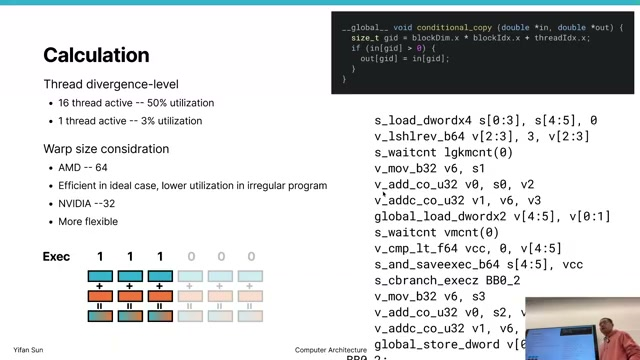

For a 32-thread NVIDIA warp with only 16 active lanes,

$$
\text{lane utilization} = \frac{16}{32} = 50\%.
$$

All 32 lanes advance in lockstep, but only 16 commit results; the other half consumes time without useful effects. In the lecture's `if (n < 16) ... else ...` example, one half-warp is enabled for the first arm and the other half for the second. Both instruction sequences execute, each at 50% lane utilization, before the full mask is restored.

This motivates a warp-size tradeoff. Larger AMD wavefronts amortize control overhead well for regular programs; smaller NVIDIA warps can waste fewer lanes when control flow is irregular. Lane utilization is distinct from occupancy: utilization asks how many lanes in a scheduled wave are useful, while occupancy asks how many wave slots on a CU are resident.

## CPU–GPU command flow

### Slide 13 — CPU and GPU connection ([00:35:35](https://www.youtube.com/watch?v=3P4gzNcxzQ0&t=2135s))

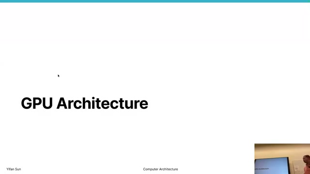

In a discrete system, the CPU and GPU communicate over PCIe, or in some systems a higher-bandwidth link such as NVLink. The CPU sends commands rather than controlling every GPU instruction. Important command classes include memory transfers and kernel launches. This command-oriented boundary allows host and device to proceed asynchronously.

### Slide 14 — Command processor and DMA engines ([00:36:30](https://www.youtube.com/watch?v=3P4gzNcxzQ0&t=2190s))

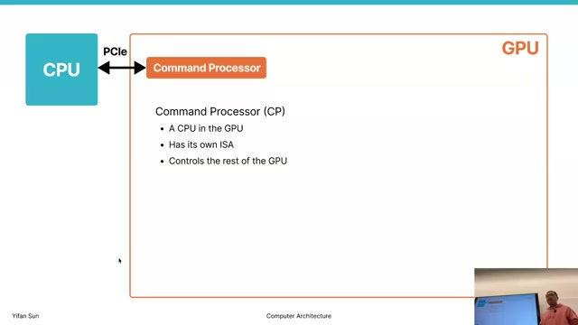

The GPU front end contains a **command processor (CP)**, described as a small processor with its own instruction set. The CPU places work into command queues; the CP reads those commands, communicates with the host, and coordinates internal engines.

Direct-memory-access (DMA) engines move data without tying up compute units. Separate host-to-device and device-to-host engines can permit transfers in both directions and overlap copies with computation when dependencies and hardware permit. A CPU API call can enqueue work and return before the GPU finishes, so explicit synchronization is needed whenever the host requires the result.

### Slide 15 — ACEs and compute units ([00:38:10](https://www.youtube.com/watch?v=3P4gzNcxzQ0&t=2290s))

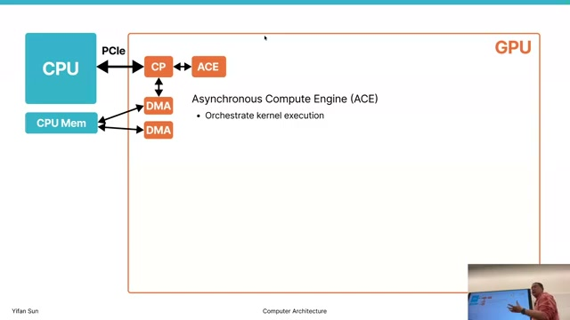

AMD **Asynchronous Compute Engines (ACEs)** orchestrate kernel execution. The command processor assigns compute work to an ACE; the ACE dispatches it and reports completion. Multiple ACEs allow multiple queues or kernels to make progress concurrently, subject to implementation and resource limits.

The actual instructions execute in **compute units (CUs)**, broadly analogous to NVIDIA streaming multiprocessors (SMs). A CU contains execution lanes, wavefront scheduling state, register files, caches, and shared/local memory resources.

## Kernel and block dispatch

### Slide 16 — From a kernel grid to CUs ([00:41:35](https://www.youtube.com/watch?v=3P4gzNcxzQ0&t=2495s))

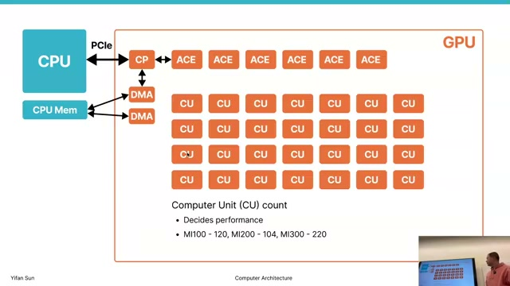

The ACE interprets a kernel's grid dimensions, divides the grid into blocks, and assigns ready blocks to CUs with capacity. A CU may host multiple blocks, and a large grid runs in batches as resources become free.

Block order is not guaranteed. One block may run before, after, or concurrently with another. Consequently, a kernel cannot rely on direct inter-block communication or a grid-wide barrier unless it ends the kernel and launches another synchronization phase. This scheduling freedom is what lets the same program scale across GPUs with different CU counts.

### Slide 17 — CU resources for resident blocks ([00:48:10](https://www.youtube.com/watch?v=3P4gzNcxzQ0&t=2890s))

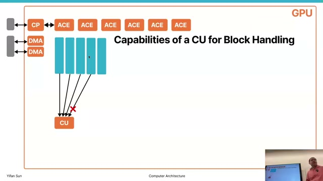

A CU cannot accept unlimited blocks. Every resident block consumes several finite resources:

1. **Wavefront slots** for its groups of lockstep threads.
2. **Scalar registers** for uniform values.
3. **Vector registers** for per-lane values.
4. **Shared/local memory** requested by the kernel.

The tightest resource determines residency. In simplified form,

$$
B_{resident} = \min\left(
\left\lfloor\frac{W_{slots}}{W_{block}}\right\rfloor,
\left\lfloor\frac{S_{total}}{S_{block}}\right\rfloor,
\left\lfloor\frac{V_{total}}{V_{block}}\right\rfloor,
\left\lfloor\frac{M_{shared}}{M_{block}}\right\rfloor
\right).
$$

Simple kernels may hit the wave-slot limit first; register-heavy optimized kernels often hit the vector-register limit. A GPU with 120 CUs and capacity for 10 blocks per CU can have roughly $120 \times 10 = 1200$ blocks resident, then dispatch later batches as those finish.

### Slide 18 — Dispatch constraints and latency ([00:53:40](https://www.youtube.com/watch?v=3P4gzNcxzQ0&t=3220s))

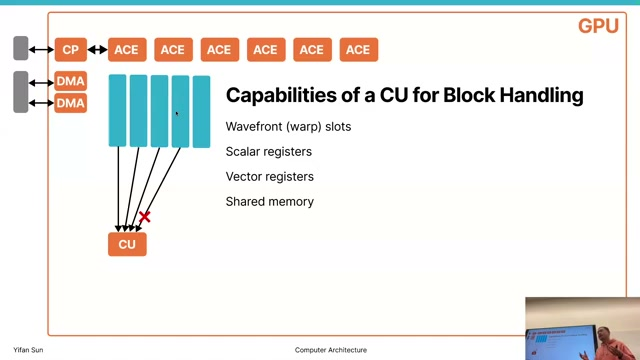

Dispatch repeatedly finds a pending block, selects a CU with enough free resources, initializes wavefront state and kernel arguments, and marks the waves ready. The lecture estimates dispatch at roughly 40–50 cycles per block. Across many CUs and blocks, setup can span thousands of cycles; if kernels or waves are extremely short, dispatch throughput becomes a bottleneck rather than arithmetic throughput.

Occupancy measures resident waves relative to hardware capacity:

$$
\text{occupancy} = \frac{\text{active wavefronts}}{\text{maximum wavefront slots}}.
$$

For example, 10 active waves in 40 slots gives 25% occupancy. More occupancy often helps hide memory latency, but maximum occupancy is not automatically maximum performance: extra waves can increase register pressure, shared-memory demand, cache pressure, or memory-bandwidth contention.

## Key formulas and takeaways

1. Global thread ID: $i = blockIdx.x \times blockDim.x + threadIdx.x$.
2. A kernel describes one logical thread; the grid and block dimensions create the parallel instance space.
3. Scalar instructions operate on uniform wavefront state; vector instructions operate on one value per lane.
4. AMD wavefronts commonly contain 64 lanes; NVIDIA warps commonly contain 32.
5. `s_waitcnt` exposes memory synchronization through outstanding-operation counters.
6. Divergent paths execute under complementary lane masks and reconverge afterward.
7. Lane utilization is $active\ lanes / total\ lanes$; masked lanes consume cycles without committing results.
8. CPU–GPU work submission is command-based and asynchronous.
9. DMA engines can overlap data movement with compute and with transfers in the opposite direction.
10. ACEs dispatch kernel blocks; CUs execute their wavefront instructions.
11. Block order is unspecified, enabling dispatch to any CU with available resources.
12. Resident block count is limited by the minimum of wave slots, scalar registers, vector registers, and shared memory.
13. Occupancy is $active\ waves / maximum\ wave\ slots$, not the same as per-wave lane utilization.
14. Very short kernels can become dispatch-bound because each block has nonzero setup latency.