# GPU Core Architecture — illustrated lecture notes

- **Course:** Advanced Computer Architecture
- **Instructor:** Yifan Sun, William & Mary
- **Video:** [YouTube](https://www.youtube.com/watch?v=DOZnwVUP3C4)
- **Duration:** 1:13:41
- **Sources:** downloaded lecture video, English subtitle analysis, and extracted slide frames

> Every image is captured from the lecture. Explanations follow the teacher’s subtitle narration. Display formulas use multiline KaTeX delimiters for VS Code Markdown compatibility.

## 1. Review and GPU hierarchy

### Slide 1 — GPU Core Architecture ([00:00:02](https://www.youtube.com/watch?v=DOZnwVUP3C4&t=2s))

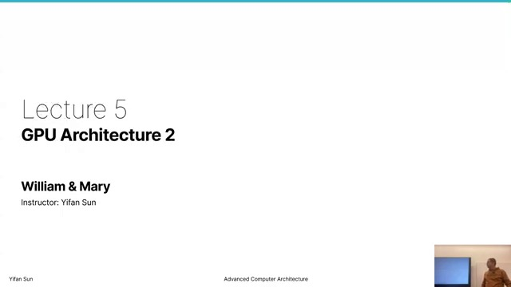

This lecture opens the compute unit and explains how scalar, vector, memory, branch, and synchronization instructions execute on GPU hardware.

### Slide 2 — Previous topics ([00:00:30](https://www.youtube.com/watch?v=DOZnwVUP3C4&t=30s))

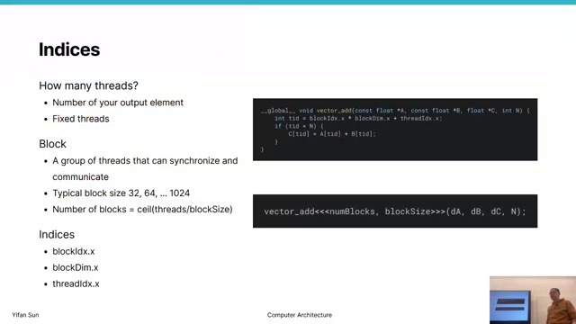

The teacher reviews CUDA kernels, shifted-copy assembly, scalar/vector instructions, global memory operations, and explicit `s_waitcnt` synchronization. The goal is now to map those instructions onto the compute unit.

### Slide 3 — Instruction types ([00:00:50](https://www.youtube.com/watch?v=DOZnwVUP3C4&t=50s))

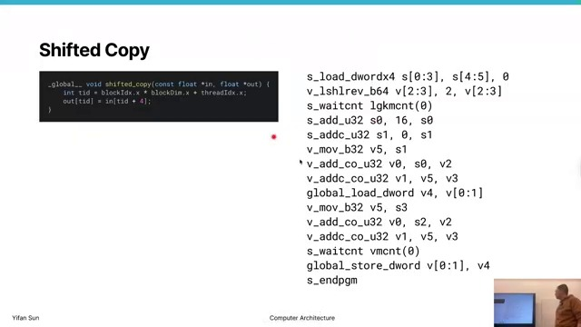

GPU instructions target specialized pipelines:

- scalar integer/control/address arithmetic;
- vector floating-point and integer arithmetic;
- vector/global memory;
- branch/control flow;
- LDS/shared-memory access;
- explicit synchronization.

Specialization permits several types of work to proceed concurrently.

### Slides 4–5 — Divergence review ([00:01:26](https://www.youtube.com/watch?v=DOZnwVUP3C4&t=86s))

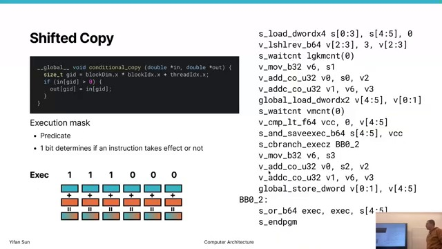

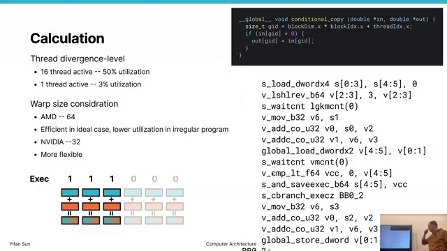

An execution mask supports divergent branches. Disabled lanes do not commit results, but still hold wavefront slots and consume issue/execution time. Avoiding divergence improves utilization, although real programs cannot always eliminate it.

### Slides 6–8 — System control ([00:02:06](https://www.youtube.com/watch?v=DOZnwVUP3C4&t=126s))

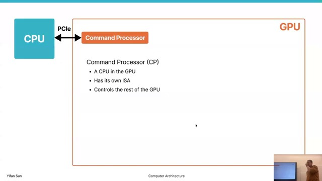

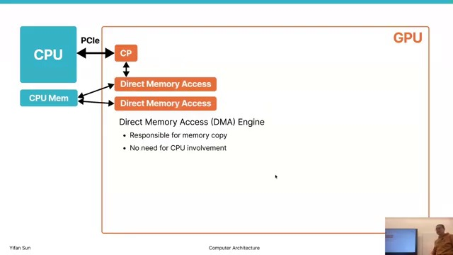

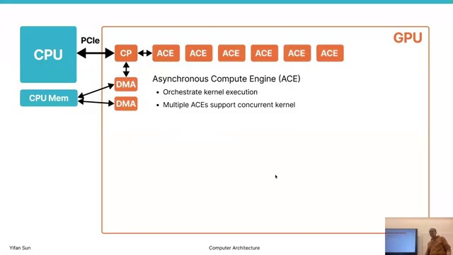

The command processor coordinates GPU resources. DMA engines move data between host and device, potentially in both directions concurrently. Asynchronous Compute Engines (ACEs) queue kernels and dispatch blocks; multiple ACEs permit concurrent kernels.

### Slides 9–10 — Compute Units and SMs ([00:03:08](https://www.youtube.com/watch?v=DOZnwVUP3C4&t=188s))

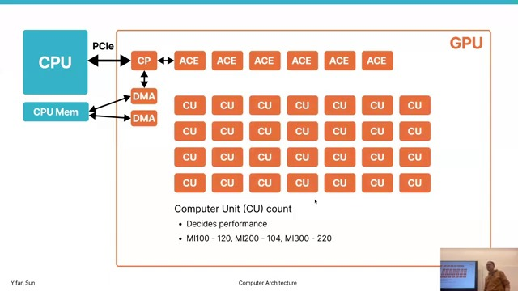

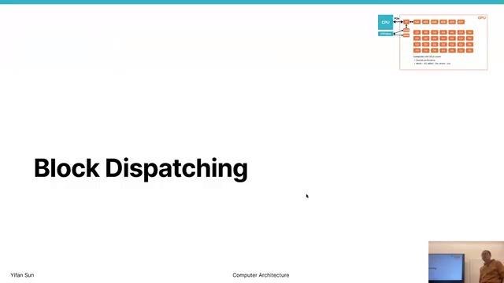

AMD calls the physical execution core a Compute Unit (CU); NVIDIA calls it a Streaming Multiprocessor (SM). A rough comparison is:

$$
\text{GPU throughput}\approx N_{\mathrm{cores}}\times\text{throughput per core}
$$

Real performance also depends on memory, utilization, and software. NVIDIA’s CUDA ecosystem is a major practical advantage even when raw hardware capability is comparable.

### Slide 11 — Block placement ([00:04:10](https://www.youtube.com/watch?v=DOZnwVUP3C4&t=250s))

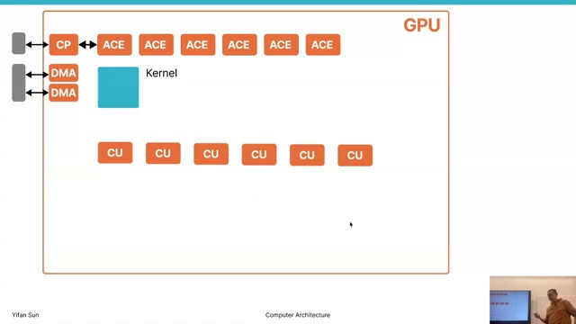

All threads in one block reside on one CU so they can use local/shared memory and block barriers. One CU can hold several blocks concurrently.

### Slide 12 — Occupancy limits ([00:05:04](https://www.youtube.com/watch?v=DOZnwVUP3C4&t=304s))

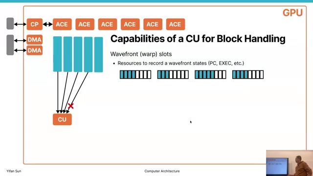

Maximum resident work is limited by the first exhausted resource:

- wavefront slots;
- scalar registers (SGPRs);
- vector registers (VGPRs);
- local/shared memory (LDS).

$$
B_{\mathrm{resident}}
=\min\left(
B_{\mathrm{slots}},
B_{\mathrm{SGPR}},
B_{\mathrm{VGPR}},
B_{\mathrm{LDS}}
\right)
$$

### Slide 13 — Latency hiding ([00:06:52](https://www.youtube.com/watch?v=DOZnwVUP3C4&t=412s))

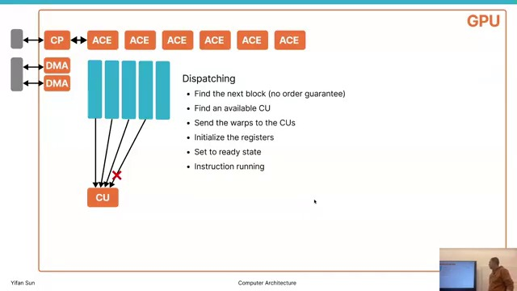

Global memory can take hundreds or thousands of cycles. Rather than making one thread low-latency, a GPU keeps many ready wavefronts and issues another while one waits. CPUs optimize response latency; GPUs optimize aggregate throughput.

### Slide 14 — Dispatch overhead ([00:08:02](https://www.youtube.com/watch?v=DOZnwVUP3C4&t=482s))

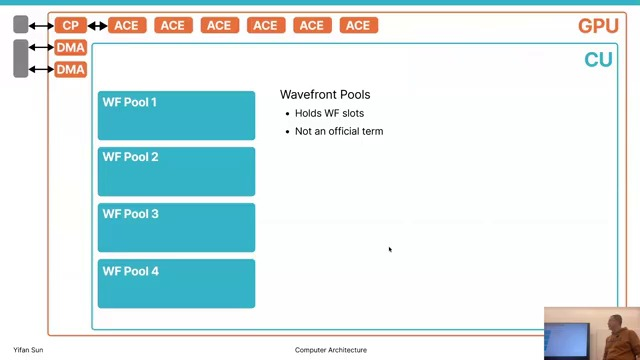

Launching one thread for each trivial element can make dispatch overhead important. A fixed number of threads processing chunks may be 2–2.5× faster, though each thread then needs more state/registers. Profiling should determine whether one-element-per-thread or chunking is better.

## 2. Compute-unit front end

### Slide 15 — Wavefront pools ([00:11:38](https://www.youtube.com/watch?v=DOZnwVUP3C4&t=698s))

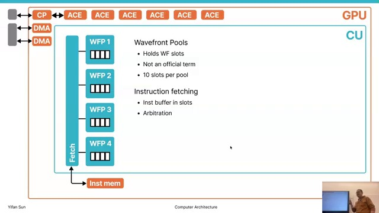

The teacher models a CU as four wavefront pools with roughly ten resident slots each. A slot stores a program counter, execution mask, state, and buffered instructions.

With 64 threads per wavefront:

$$
10\ \text{slots/pool}\times4\ \text{pools/CU}\times64\ \text{threads/wave}
=2560\ \text{resident threads/CU}
$$

### Slide 16 — Fetch arbitration ([00:15:16](https://www.youtube.com/watch?v=DOZnwVUP3C4&t=916s))

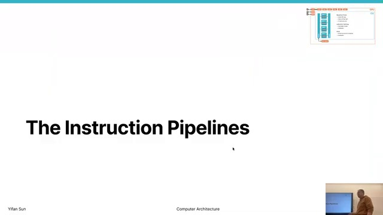

Many resident waves compete for instruction-cache bandwidth. The fetch unit arbitrates and fills wave instruction buffers. Policies can favor recently served waves for locality or rotate for fairness.

### Slide 17 — Issue unit ([00:15:28](https://www.youtube.com/watch?v=DOZnwVUP3C4&t=928s))

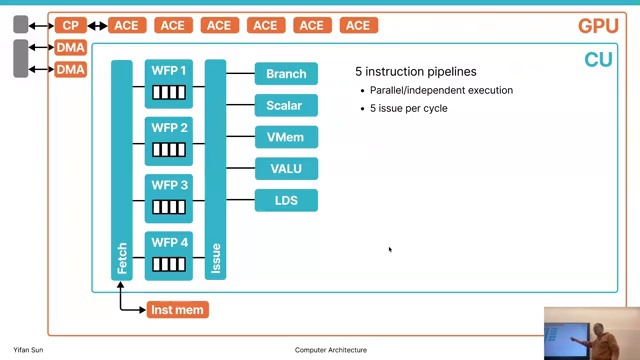

The issue unit chooses ready instructions and routes them to compatible back-end pipelines while checking resource availability and hazards. Fetch/buffering form the front end; execution units form the back end.

### Slide 18 — Five execution pipelines ([00:18:18](https://www.youtube.com/watch?v=DOZnwVUP3C4&t=1098s))

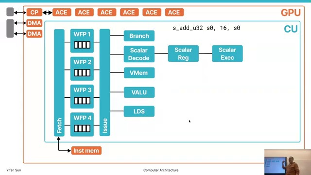

The simplified CU has five execution paths:

1. branch unit;
2. scalar unit;
3. vector-memory unit;
4. vector logic/arithmetic unit (VALU/VLU);
5. LDS/shared-memory unit.

Different instruction classes can potentially issue together, though full simultaneous utilization is uncommon.

## 3. Pipelines and hazards

### Slide 19 — Avoiding RAW hazards ([00:23:44](https://www.youtube.com/watch?v=DOZnwVUP3C4&t=1424s))

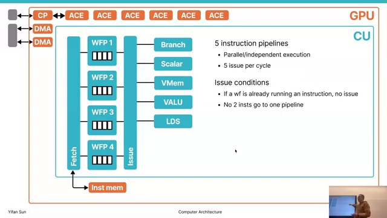

A CPU uses forwarding, interlocks, and out-of-order scheduling to overlap dependent instructions. A simpler GPU policy can allow only one in-flight instruction from a given wavefront, filling the pipeline with instructions from other waves. This prevents same-wave read-after-write hazards at the cost of instruction-level parallelism.

### Slide 20 — Scalar ALU pipeline ([00:24:20](https://www.youtube.com/watch?v=DOZnwVUP3C4&t=1460s))

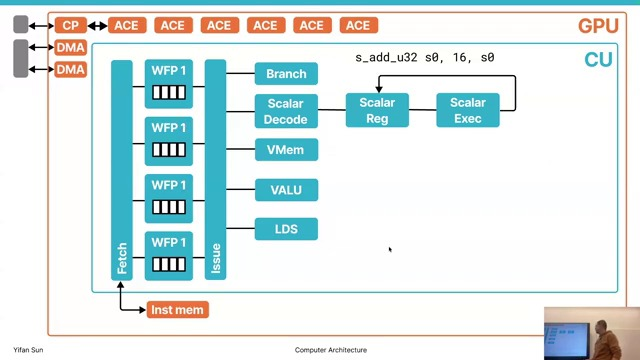

The stages are fetch, issue, decode, register read/load, execute, and write-back. Decode generates controls; multiplexers select scalar operands; the ALU computes; write-back updates the register file. Different wavefronts occupy different pipeline stages concurrently.

### Slide 21 — Scalar memory ([00:27:22](https://www.youtube.com/watch?v=DOZnwVUP3C4&t=1642s))

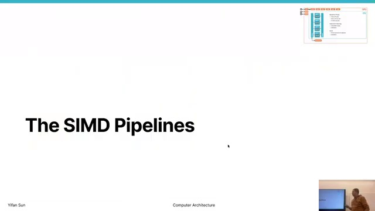

Scalar loads add a memory stage and use a small scalar cache, often shared among several CUs. Scalar values include kernel parameters, uniform addresses, block sizes, and offsets.

### Slide 22 — Vector memory ([00:27:32](https://www.youtube.com/watch?v=DOZnwVUP3C4&t=1652s))

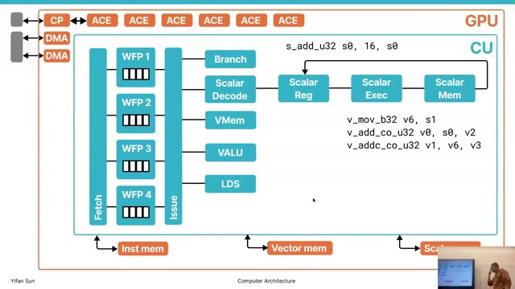

A vector load serves one value per active lane and demands far more bandwidth. Each CU therefore commonly has a dedicated vector-data cache/interface, while instruction and scalar caches can be shared.

### Slide 23 — Vector logic and SIMD ([00:28:24](https://www.youtube.com/watch?v=DOZnwVUP3C4&t=1704s))

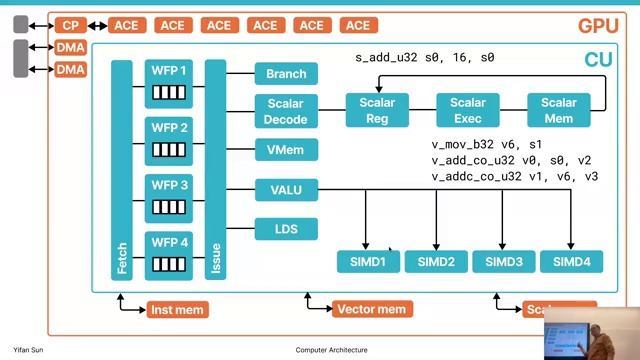

The vector unit handles `v_*` instructions and floating point; scalar ALUs mainly perform integer/control/address work. In the model, four wave pools map to four SIMD units, simplifying issue selection.

## 4. SIMD lanes and throughput

### Slide 24 — Sixteen-lane SIMD organization ([00:32:54](https://www.youtube.com/watch?v=DOZnwVUP3C4&t=1974s))

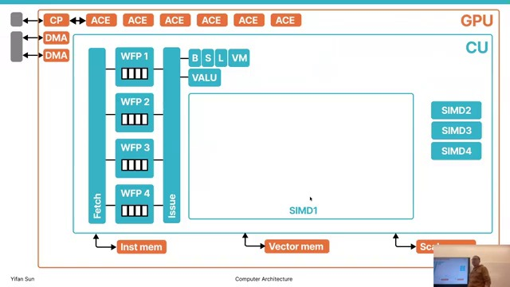

One 64-thread wavefront executes as four 16-thread quarters on a 16-lane SIMD. Four SIMD units rotate work so each receives another quarter/wave at the proper interval.

### Slides 25–26 — Pipeline filling ([00:34:42](https://www.youtube.com/watch?v=DOZnwVUP3C4&t=2082s))

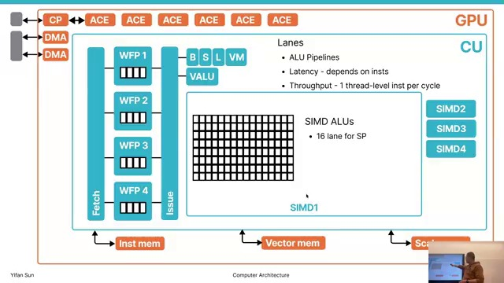

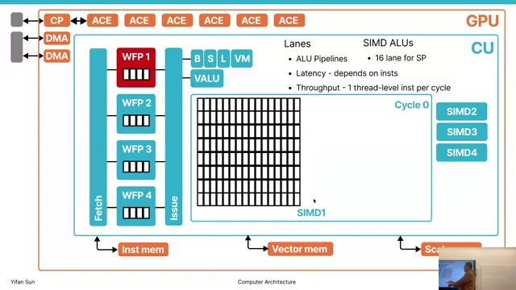

Each lane accepts one thread operation and advances it through a multi-cycle arithmetic pipeline. Successive wavefront quarters fill successive stages; once full, all stages perform useful work. Multiplication, division, and transcendental functions have different latency, but interleaving waves hides much of it.

The teacher compares this to a swimming pool: lanes are swimmers side by side, pipeline stages are positions down the pool, and new groups enter while earlier groups advance.

### Slide 27 — Concurrent threads ([00:59:00](https://www.youtube.com/watch?v=DOZnwVUP3C4&t=3540s))

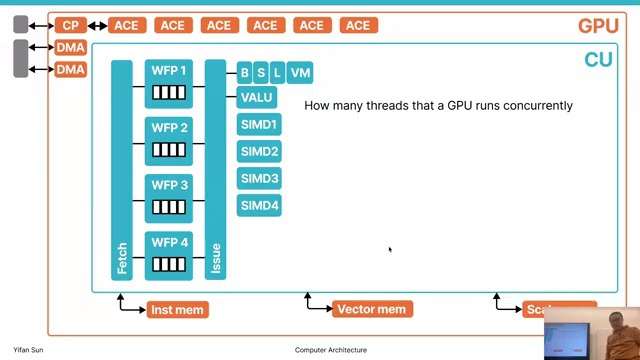

For the R9 Nano example:

$$
10\times4\times64=2560\ \text{resident threads/CU}
$$

With 64 CUs:

$$
2560\times64=163{,}840\approx160\text{K resident threads}
$$

Resident does not mean all issue in one cycle; it means their state is available for scheduling and latency hiding.

### Slide 28 — Peak throughput ([01:09:28](https://www.youtube.com/watch?v=DOZnwVUP3C4&t=4168s))

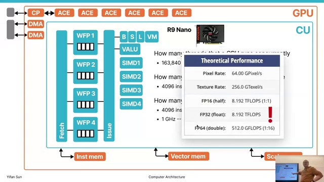

Sixteen lanes × four SIMD units give 64 thread-level operations per CU per cycle. Across 64 CUs:

$$
16\times4\times64=4096\ \text{operations/cycle}
$$

At 1 GHz:

$$
4096\times10^9
=4.096\times10^{12}\ \text{operations/s}
$$

A fused multiply-add performs one multiplication and one addition, conventionally counted as two FLOPs, giving the advertised peak:

$$
2\times4.096=8.192\ \text{TFLOP/s}
$$

### Slide 29 — Peak versus achieved performance ([01:09:56](https://www.youtube.com/watch?v=DOZnwVUP3C4&t=4196s))

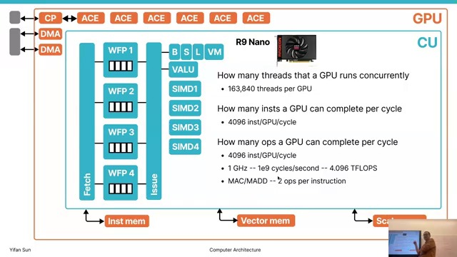

Peak FLOP/s assumes every lane executes useful FMA every cycle:

$$
\mathrm{result}\leftarrow\mathrm{result}+a\times b
$$

A naïve matrix multiply may obtain about 1% of peak. Tuned vendor libraries can approach 50%, and exceptionally favorable square/layout-transposed cases may reach roughly 80%. Memory access, divergence, occupancy, dependencies, and instruction mix explain the gap.

## Key takeaways

- CUs/SMs retain many waves and hide latency by selecting ready work.
- Occupancy is constrained by slots, registers, and LDS—not simply by launched thread count.
- Scalar, vector, memory, branch, and LDS pipelines divide responsibilities.
- SIMD lanes process wavefront quarters through deep pipelines.
- Resident threads, issued instructions, and FLOP/s are distinct metrics.
- Peak FLOP/s is an upper bound; sustained performance depends on software and memory behavior.
