# GPU Memory Architecture — illustrated lecture notes

- **Course:** Advanced Computer Architecture
- **Instructor:** Yifan Sun, William & Mary
- **Video:** [YouTube](https://www.youtube.com/watch?v=1PlOAW03UXo)
- **Duration:** 1:16:57
- **Sources:** downloaded lecture video, original English subtitles, and extracted slide frames

> Every image is captured from the lecture. Explanations follow the teacher’s spoken explanation in the subtitles. Display formulas use multiline KaTeX delimiters for VS Code Markdown compatibility.

## 1. Review and the memory-bandwidth problem

### Slide 1 — GPU Architecture: memory subsystem ([00:00:02](https://www.youtube.com/watch?v=1PlOAW03UXo&t=2s))

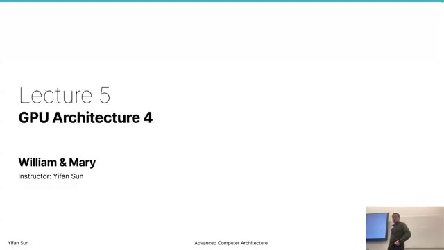

This final GPU-architecture lecture shifts from compute-unit execution to the memory hierarchy. Previous lectures established block dispatch, CU resources, pipelines, and SIMD throughput; this lecture explains how data reaches those compute units efficiently.

### Slide 2 — Block dispatch constraints ([00:00:28](https://www.youtube.com/watch?v=1PlOAW03UXo&t=28s))

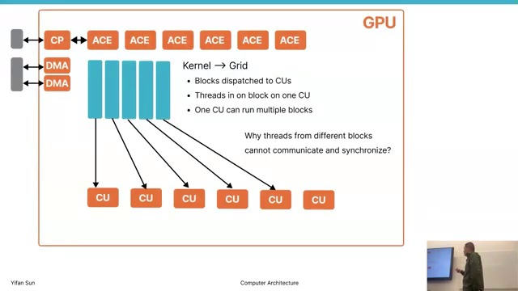

All threads in one block must reside on one CU. The number of simultaneously resident blocks is limited by the first resource that runs out:

- wavefront/warp slots;
- scalar registers;
- vector registers;
- shared memory/LDS.

A block is admitted only when the CU can allocate all resources required by every thread in it.

### Slide 3 — CU instruction scheduling review ([00:01:34](https://www.youtube.com/watch?v=1PlOAW03UXo&t=94s))

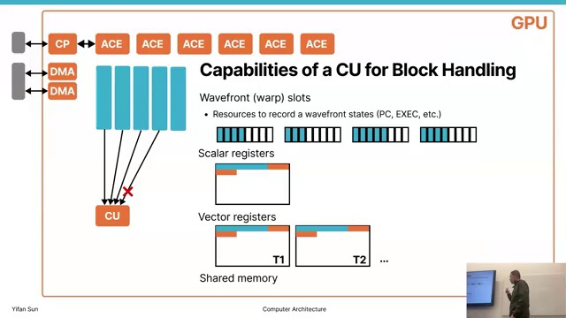

The simplified CU can issue instructions to several distinct pipelines, but only when dependencies and resources allow. The architecture avoids CPU-style out-of-order complexity: a wave with an outstanding instruction may be held back, and two instructions cannot claim the same functional unit simultaneously.

### Slide 4 — Compute metrics ([00:02:34](https://www.youtube.com/watch?v=1PlOAW03UXo&t=154s))

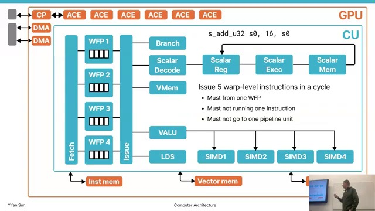

The teacher separates three metrics:

1. **Resident threads:** state that can be held for latency hiding.
2. **Instructions per cycle:** work the pipelines can accept each cycle.
3. **FLOP/s:** arithmetic operations performed per second.

Large resident-thread count does not mean all threads execute simultaneously; it supplies ready alternatives when other waves stall.

### Slide 5 — Three CU memory interfaces ([00:04:54](https://www.youtube.com/watch?v=1PlOAW03UXo&t=294s))

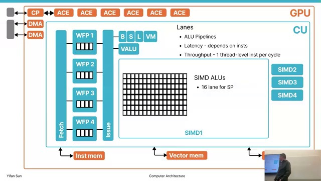

A CU accesses instruction, scalar, and vector memory. Vector memory is the bandwidth challenge: one 64-thread wave may generate one address per lane. Treating these as 64 independent DRAM operations would overwhelm the interface.

## 2. Memory coalescing

### Slide 6 — Cache lines and coalescing ([00:07:00](https://www.youtube.com/watch?v=1PlOAW03UXo&t=420s))

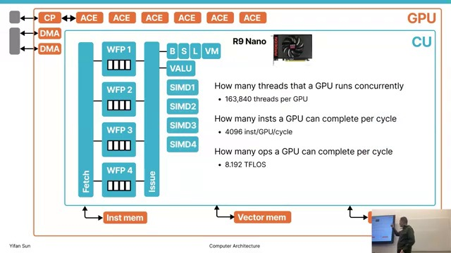

**Memory coalescing** merges lane accesses that touch the same transfer unit/cache line. With a 64-byte cache line, the low six address bits select a byte within the line:

$$
\log_2(64)=6
$$

A 48-bit byte address therefore has 42 bits identifying the cache line and six offset bits. Best case: all lane requests span only a few adjacent lines, producing a few transactions. Worst case: random addresses produce nearly one transaction per lane.

### Slide 7 — Matrix access patterns ([00:08:54](https://www.youtube.com/watch?v=1PlOAW03UXo&t=534s))

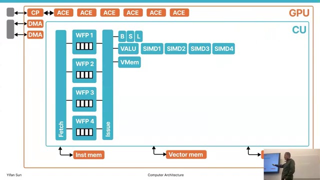

Adjacent threads reading adjacent row-major elements are coalesced. If neighboring threads traverse a column of a wide row-major matrix, addresses may be kilobytes apart and touch distinct cache lines.

For 1024 `float` elements per row:

$$
1024\times4\ \text{bytes}=4096\ \text{bytes}=4\ \text{KiB}
$$

Thus successive column accesses can be 4 KiB apart. Remedies include:

- transpose/reformat data once if reused many times;
- tile the matrices;
- cooperatively load tiles into LDS/shared memory with coalesced global reads;
- compute repeatedly from fast local storage;
- store results coalescently.

The teacher emphasizes that thread-to-data assignment matters as much as the mathematical algorithm. Regular workloads can often be reorganized; graph and other irregular workloads may inherently coalesce poorly.

## 3. GPU cache hierarchy

### Slide 8 — L1 cache organization ([00:19:44](https://www.youtube.com/watch?v=1PlOAW03UXo&t=1184s))

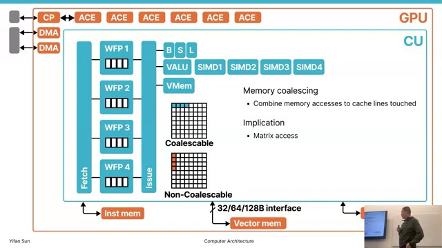

Each CU has a dedicated L1 vector cache because different CUs usually process different data and would otherwise evict one another. In contrast, approximately four CUs share scalar and instruction caches:

- instructions are common because CUs execute the same kernel;
- kernel parameters and uniform addresses are heavily shared;
- vector working sets are mostly private.

An instruction miss is especially damaging because no new instruction can be issued, so the instruction cache should achieve a high hit rate.

### Slide 9 — Shader arrays and L2 ([00:24:02](https://www.youtube.com/watch?v=1PlOAW03UXo&t=1442s))

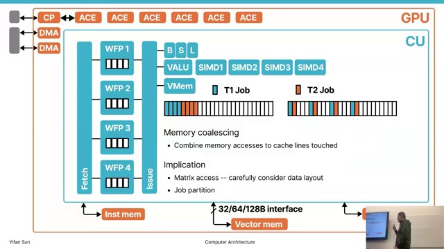

A group of CUs sharing scalar/instruction caches is historically called a **shader array**. Larger groupings form shader engines. L1 caches connect to shared, memory-side L2 partitions, and normal accesses follow:

$$
\text{CU}\rightarrow\text{L1}\rightarrow\text{L2}\rightarrow\text{DRAM/HBM}
$$

L2 increases effective bandwidth and captures reuse shared across CUs.

### Slide 10 — L2 address interleaving ([00:28:30](https://www.youtube.com/watch?v=1PlOAW03UXo&t=1710s))

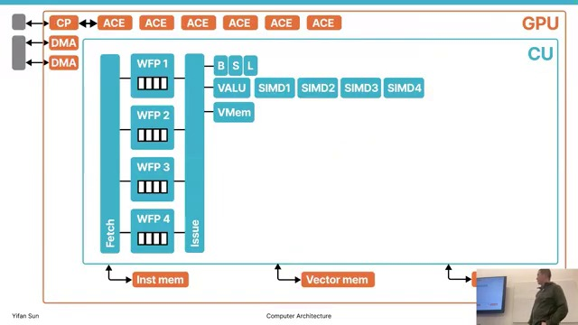

Memory is interleaved across L2 partitions at cache-line granularity. Conceptually:

$$
\mathrm{partition}=\mathrm{cacheLineAddress}\bmod N_{L2}
$$

Assigning one large contiguous address range to each partition could leave most partitions idle when the active working set falls in one range. Fine-grained interleaving spreads even small/contiguous workloads across the available cache and DRAM bandwidth.

### Slide 11 — Network-on-chip and crossbar ([00:28:58](https://www.youtube.com/watch?v=1PlOAW03UXo&t=1738s))

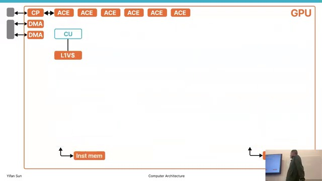

Every L1 may need any L2 partition, requiring a network-on-chip. A crossbar can connect multiple nonconflicting input/output pairs simultaneously, unlike a shared bus that permits one transfer at a time.

The problem is physical scaling: hundreds of endpoints require many long wires, substantial area, and propagation time. Modern large GPUs partition the fabric/L2 into regions, reducing distance and wiring but introducing NUMA-like locality—remote partitions can cost more latency.

## 4. Coherency model

### Slide 12 — Cache coherency ([00:40:24](https://www.youtube.com/watch?v=1PlOAW03UXo&t=2424s))

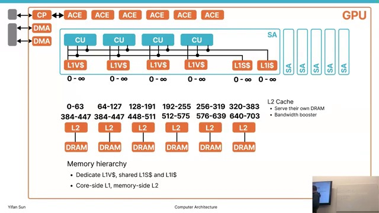

If CU1 writes a new value while CU2 retains an older L1 copy, CU2 can read stale data. GPUs simplify this problem through hardware policy and programming restrictions:

- L1 vector writes are propagated toward L2 so L2 receives the newest value.
- Threads within a block communicate through LDS/shared memory and barriers on one CU.
- Blocks should not communicate arbitrarily inside a kernel.
- A kernel boundary acts as a global coordination/coherency point; a later kernel re-observes updated memory.

This reflects a GPU design philosophy: constrain the programming model to simplify hardware and maximize throughput, instead of providing fully transparent CPU-like coherence everywhere.

## 5. Visual GPU simulator and trace analysis

### Slide 13 — Simulator visualization ([00:42:28](https://www.youtube.com/watch?v=1PlOAW03UXo&t=2548s))

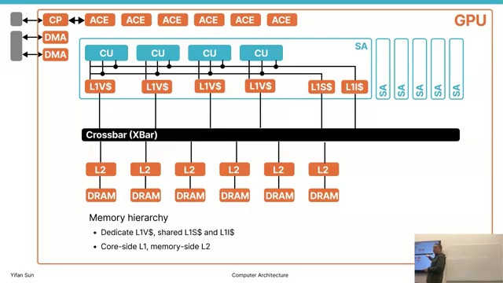

The teacher introduces a cycle-level simulator and browser visualization tool. It displays incoming request rate, average latency, and buffer occupancy for GPU components. A full buffer plus rising latency suggests a bottleneck; an empty buffer suggests spare capacity.

Large traces can exceed many gigabytes, so small representative workloads are better for interactive analysis.

### Slide 14 — Zoom and aggregation ([00:45:30](https://www.youtube.com/watch?v=1PlOAW03UXo&t=2730s))

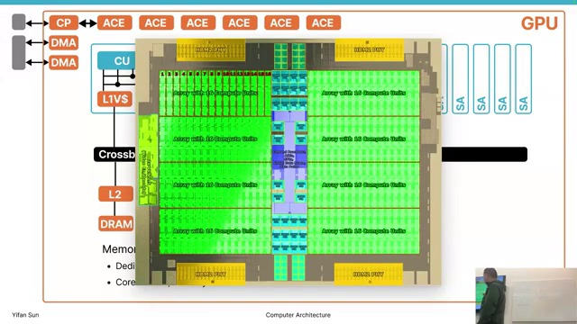

A zoomed-out line can make occupancy look steady, while cycle-level zoom reveals isolated bursts and long idle intervals. Aggregates are useful for trends but can conceal temporal imbalance.

### Slide 15 — Component transactions ([00:46:34](https://www.youtube.com/watch?v=1PlOAW03UXo&t=2794s))

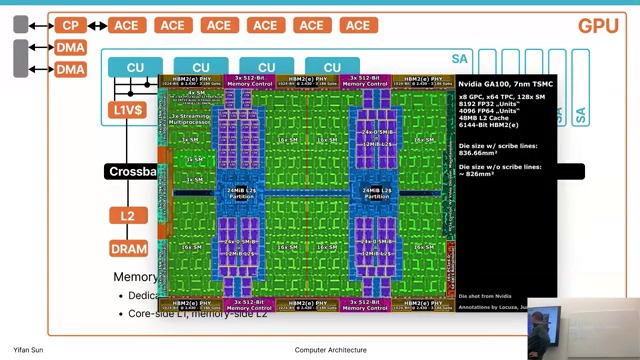

Each bar represents a transaction with arrival, execution, and completion times. Child requests reveal misses that travel to a lower level; a cache hit may complete without a lower-level child. Overlapping bars show parallel requests in flight.

### Slide 16 — Instruction hierarchy ([00:48:10](https://www.youtube.com/watch?v=1PlOAW03UXo&t=2890s))

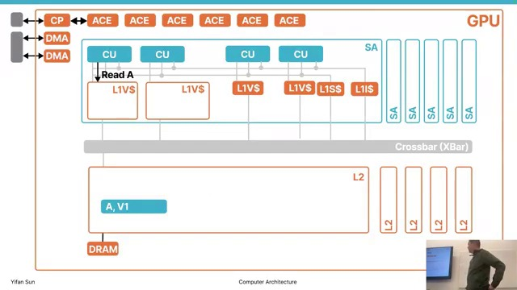

The trace can be navigated from kernel to block/work group, wavefront, instruction, and memory transaction. It exposes instruction fetches, branches, scalar/vector work, LDS accesses, and barriers. Long vector-memory bars reveal latency that other waves should hide.

### Slides 17–18 — Coalescing in a trace ([00:49:48](https://www.youtube.com/watch?v=1PlOAW03UXo&t=2988s))

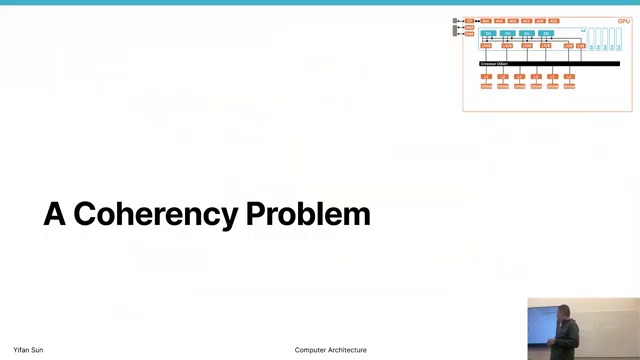

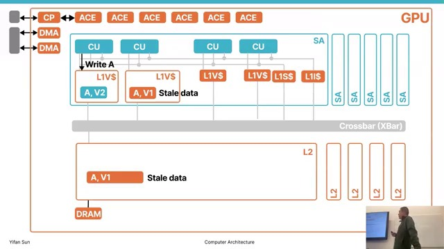

A 64-lane vector load does not necessarily create 64 lower-level transactions. Requests to one cache line merge; one miss fetches the line and other requests wait on it. The demonstrated access takes roughly hundreds of nanoseconds/cycles, but many requests/waves overlap.

### Slide 19 — L2 traffic distribution ([00:55:44](https://www.youtube.com/watch?v=1PlOAW03UXo&t=3344s))

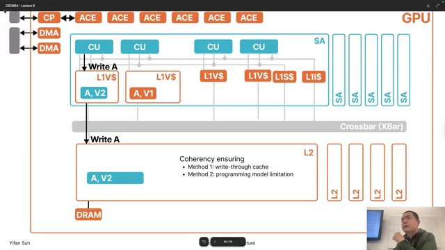

Traffic across the 16 L2 partitions peaks at different times, indicating interleaved address mapping and asynchronous requests from multiple CUs. Early cold misses can produce higher latency; reuse lowers average latency as caches warm.

### Slide 20 — Translation and ordered return ([00:56:10](https://www.youtube.com/watch?v=1PlOAW03UXo&t=3370s))

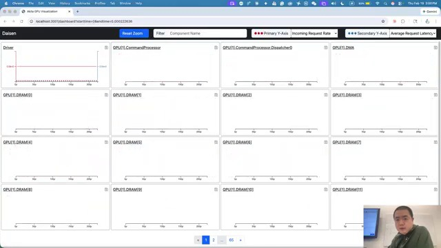

The trace exposes address translation and result ordering in addition to cache access. In the shown workload, virtual-to-physical translation can take longer than fetching data, making TLB/page-walk behavior a potential bottleneck. Architecture optimization must consider translation, not only cache/DRAM latency.

### Slide 21 — One L1 miss lifecycle ([00:58:20](https://www.youtube.com/watch?v=1PlOAW03UXo&t=3500s))

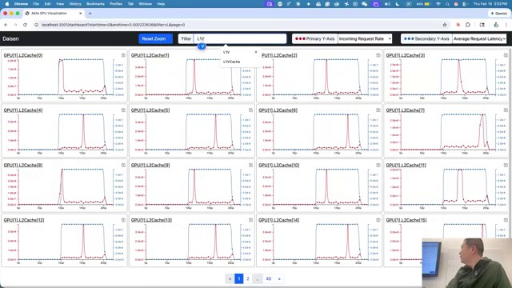

A detailed miss proceeds as follows:

1. core request arrives at L1;
2. tag lookup misses;
3. L1 sends a child request to L2;
4. L2 returns the line;
5. L1 installs it and signals data-ready;
6. a later access can hit locally.

The hit avoids network and L2 traversal, reducing both latency and energy.

### Slide 22 — Parent/child navigation ([01:00:54](https://www.youtube.com/watch?v=1PlOAW03UXo&t=3654s))

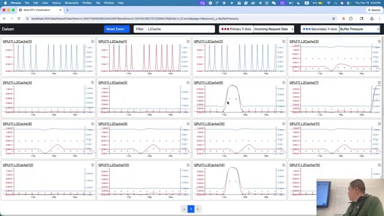

Parent and child links reconstruct causality: a memory request belongs to a vector instruction, which belongs to a wave, block, kernel, and ultimately host command.

### Slide 23 — Commands and transfers ([01:01:02](https://www.youtube.com/watch?v=1PlOAW03UXo&t=3662s))

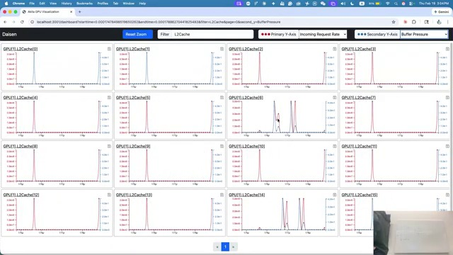

At the highest level the trace shows host-to-device copies, kernel launch, device execution, synchronization, and result copies. PCIe transfers are often significant and should be amortized with substantial device work.

### Slide 24 — Kernel decomposition ([01:02:00](https://www.youtube.com/watch?v=1PlOAW03UXo&t=3720s))

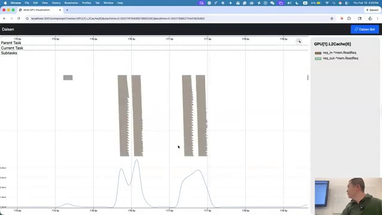

A kernel decomposes into blocks and then wavefronts. For example, a 256-thread block contains four 64-thread AMD wavefronts. The visual trace shows which work groups and waves were dispatched.

### Slide 25 — Wavefront instruction timeline ([01:02:32](https://www.youtube.com/watch?v=1PlOAW03UXo&t=3752s))

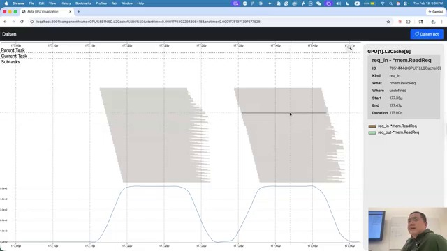

Instruction bars distinguish fetch, scalar, vector-memory, LDS, ALU, branch, and synchronization operations. Long/frequent vector loads indicate a memory-bound region; barriers last until the slowest participating work reaches them.

### Slide 26 — Overlap and latency hiding ([01:03:12](https://www.youtube.com/watch?v=1PlOAW03UXo&t=3792s))

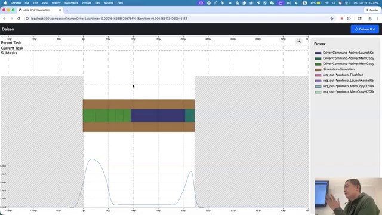

Overlapping memory and compute bars reveal useful concurrency. One wave can execute arithmetic while another waits for data. Both instruction-level independence and thread-level scheduling contribute to latency hiding.

### Slide 27 — L2 request merging ([01:04:14](https://www.youtube.com/watch?v=1PlOAW03UXo&t=3854s))

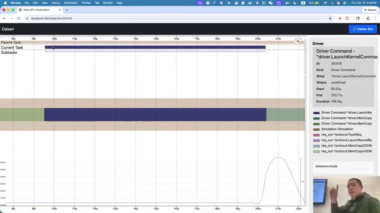

Several L1 requests targeting one L2 line can share one DRAM fetch. The first request creates the child DRAM transaction; later matching requests attach/wait. This secondary merging further reduces off-chip traffic.

### Slide 28 — DRAM activity ([01:05:24](https://www.youtube.com/watch?v=1PlOAW03UXo&t=3924s))

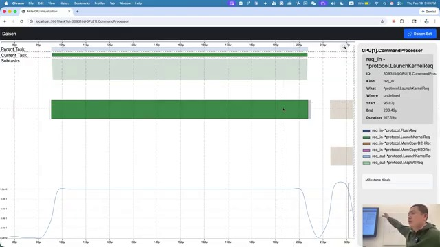

The demonstration has sparse DRAM traffic because the small matrix working set fits well in cache. Modern DRAM uses banks for concurrent access, while interleaving helps distribute requests. Workload phases create bursty load/compute patterns.

### Slide 29 — Selective component investigation ([01:05:52](https://www.youtube.com/watch?v=1PlOAW03UXo&t=3952s))

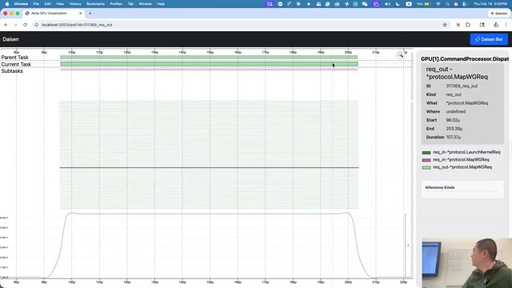

A practical analysis starts with high latency, request rate, or buffer pressure, then drills into only suspicious intervals/components. Individual requests reveal source, destination, cache outcome, and latency breakdown.

### Slide 30 — Optimization lessons ([01:06:36](https://www.youtube.com/watch?v=1PlOAW03UXo&t=3996s))

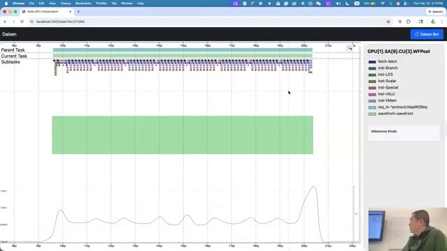

The trace reinforces four programming priorities:

1. coalesce adjacent threads’ accesses;
2. tile/transpose to improve locality;
3. overlap memory and compute with sufficient resident work;
4. recognize that highly irregular workloads may fit CPUs better.

### Slide 31 — Address translation ([01:08:36](https://www.youtube.com/watch?v=1PlOAW03UXo&t=4116s))

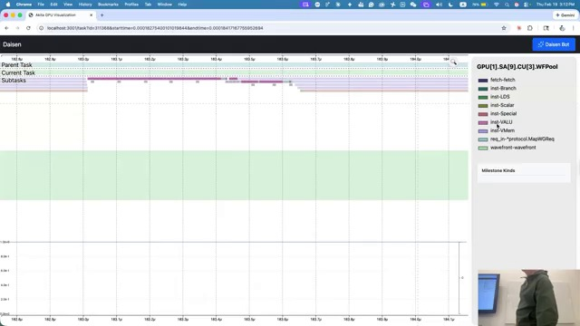

A TLB caches virtual-to-physical mappings. A hit is fast; a miss triggers a multi-level page-table walk. Thousands of threads and large working sets can stress translation. Larger TLBs and huge pages increase mapping coverage and reduce misses.

## 6. Interactive visualization walkthrough

### Slide 32 — Tool overview ([01:09:20](https://www.youtube.com/watch?v=1PlOAW03UXo&t=4160s))

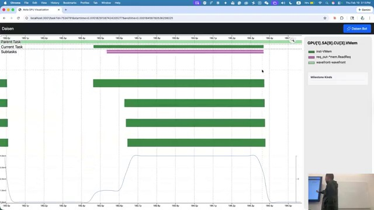

The interactive session demonstrates component search, metric selection, time navigation, and zoom.

### Slide 33 — L1 cache search ([01:09:40](https://www.youtube.com/watch?v=1PlOAW03UXo&t=4180s))

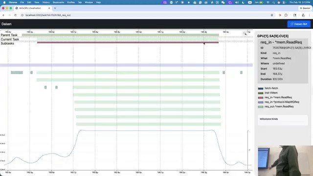

Filtering for L1 vector/scalar components allows comparison across cache instances and reveals imbalance between CUs.

### Slide 34 — Buffer pressure ([01:10:04](https://www.youtube.com/watch?v=1PlOAW03UXo&t=4204s))

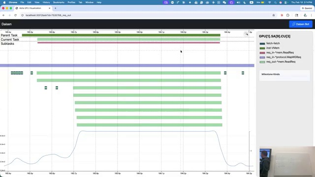

Buffer occupancy indicates queueing pressure. Sustained near-capacity occupancy suggests demand exceeds service rate.

### Slide 35 — Request-rate peaks ([01:10:28](https://www.youtube.com/watch?v=1PlOAW03UXo&t=4228s))

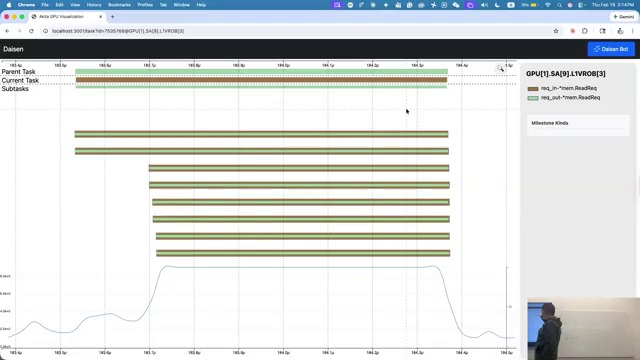

Request-rate peaks should be correlated with latency and occupancy. A high request rate alone is useful utilization; high rate plus growing queues signals congestion.

### Slide 36 — Secondary axes and detail ([01:10:50](https://www.youtube.com/watch?v=1PlOAW03UXo&t=4250s))

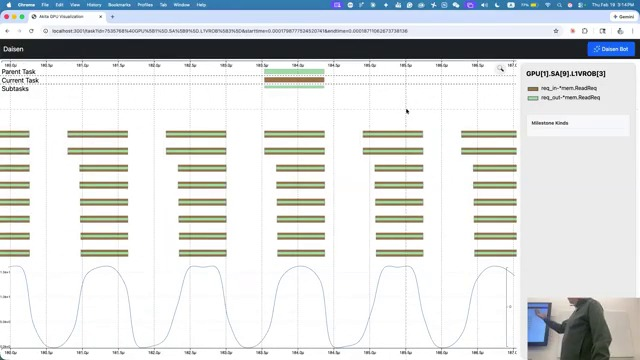

The tool exposes exact counts and multiple metrics so visually similar traces can be distinguished quantitatively.

### Slide 37 — Temporal zoom ([01:11:04](https://www.youtube.com/watch?v=1PlOAW03UXo&t=4264s))

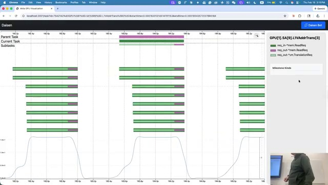

Zooming from whole-kernel scale to nanoseconds changes interpretation from average utilization to individual bursts and stalls.

### Slide 38 — Cycle-level behavior ([01:12:12](https://www.youtube.com/watch?v=1PlOAW03UXo&t=4332s))

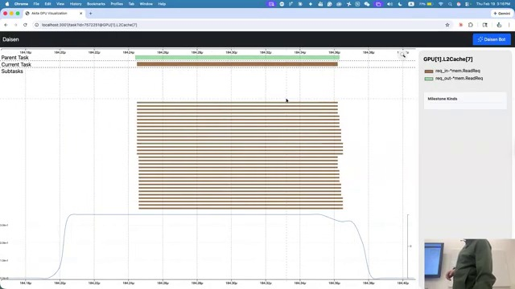

At cycle scale, isolated arrivals, queue service, and idle gaps become visible, enabling precise bottleneck diagnosis.

### Slide 39 — Task containment ([01:12:24](https://www.youtube.com/watch?v=1PlOAW03UXo&t=4344s))

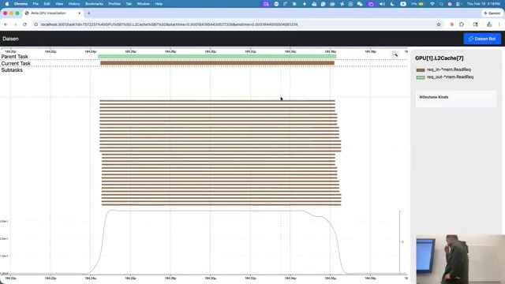

Parent/child task bars connect component-level events to instructions and higher-level kernel work.

### Slide 40 — Wrap-up and assignment ([01:14:20](https://www.youtube.com/watch?v=1PlOAW03UXo&t=4460s))

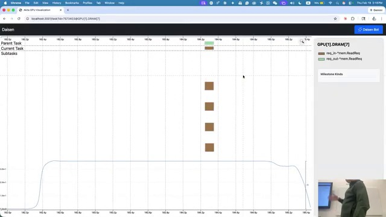

Students are expected to use the simulator visualization on small traces, identify bottlenecks, and transfer the observed patterns to larger workloads. The tool integrates the lecture’s compute, dispatch, cache, coalescing, translation, and DRAM concepts.

## Key formulas and rules

### Resident threads

$$
T_{\mathrm{resident}}
=N_{\mathrm{CU}}\times N_{\mathrm{waves/CU}}\times N_{\mathrm{threads/wave}}
$$

For the lecture’s R9 Nano model:

$$
64\times40\times64=163{,}840\ \text{resident threads}
$$

### Cache-line decomposition

For cache-line size $L$ bytes, the number of byte-offset bits is:

$$
N_{\mathrm{offset}}=\log_2 L
$$

For $L=64$ bytes, $N_{\mathrm{offset}}=6$.

### Coalescing efficiency

If a wave generates $N_{\mathrm{lane}}$ lane accesses but they touch only $N_{\mathrm{line}}$ unique cache lines, the lower level sees approximately $N_{\mathrm{line}}$ transactions rather than $N_{\mathrm{lane}}$:

$$
\text{transaction reduction}\approx\frac{N_{\mathrm{lane}}}{N_{\mathrm{line}}}
$$

### Practical rules

- Map adjacent threads to adjacent addresses whenever possible.
- Use tiling/LDS when an algorithm requires both row and column reuse.
- Keep enough resident waves to hide memory latency, without exhausting registers or LDS.
- Treat blocks as independent within a kernel; use a kernel boundary for global coordination.
- Examine address translation and network congestion as well as cache hit rate.
- Interpret throughput, latency, and occupancy together rather than separately.
