# RISC-V ISA and Assembly Language

**Course:** CSCI 654 Advanced Computer Architecture, Spring 2026  
**Instructor:** Yifan Sun, William & Mary  
**Video:** [YouTube lecture](https://www.youtube.com/watch?v=3Tf5iTvtgiI) (1:18:39)

These notes follow the lecture's substantive slides and progressive visual states. Explanations are based on the original English captions and the slide visuals; obvious caption errors such as "risk five," "a z," and "colleague" are normalized to RISC-V, `a0`, and callee.

## ISA as an abstraction

### Slide 1 — Lecture 9: RISC-V ISA ([00:00:05](https://www.youtube.com/watch?v=3Tf5iTvtgiI&t=5s))

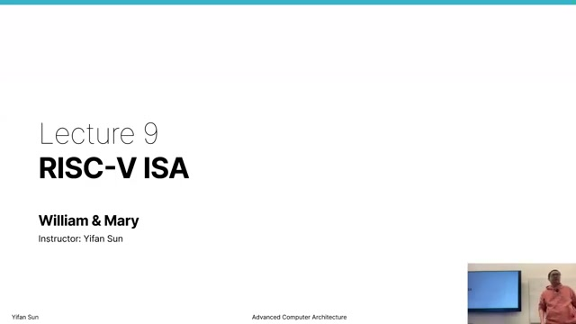

The course moves from four GPU-architecture lectures to CPU architecture. The instructor chose the GPU-first order because GPUs make some ideas, such as pipelines and cache behavior, visible in a comparatively regular design. RISC-V will now be the running CPU example because it is common in academic architecture work and gives the next lecture a concrete ISA on which to build a core.

### Slide 2 — Early programming ([00:01:49](https://www.youtube.com/watch?v=3Tf5iTvtgiI&t=109s))

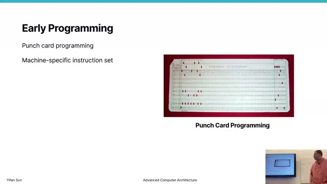

Punch-card programs were tied to a particular machine's instruction set. Moving software to another computer could therefore mean rewriting it. This motivates an abstraction between software and a particular circuit implementation: programs target a stable instruction set rather than the accidental details of one machine.

### Slide 3 — IBM System/360 ([00:03:00](https://www.youtube.com/watch?v=3Tf5iTvtgiI&t=180s))

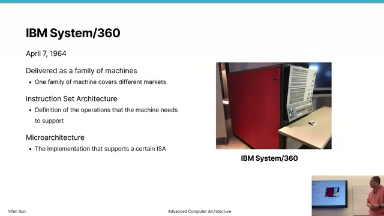

IBM's System/360 family is presented as the landmark separation of **instruction set architecture (ISA)** from **microarchitecture**. Machines aimed at different markets could implement the same operations while differing in cost and speed. At the ISA boundary, hardware promises the correct architectural result for an encoded program; it does not promise a particular performance.

A low-end implementation can even omit a fast divide unit and realize division through slower operations. The same principle appears in modern performance and efficiency cores: implementations differ, while the software-visible contract remains stable.

### Slide 4 — Examples of instruction set architectures ([00:05:53](https://www.youtube.com/watch?v=3Tf5iTvtgiI&t=353s))

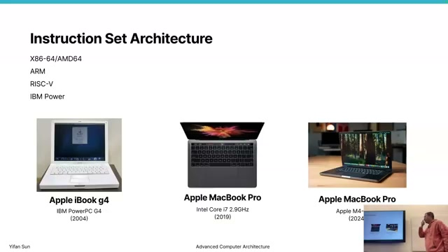

The slide traces Apple's PowerPC, x86-64, and ARM transitions. An ISA change is difficult in an open CPU ecosystem because hardware, operating systems, compilers, and applications may be controlled by different groups. Old software may have no maintainer available to rebuild it. Apple made the ARM transition unusually effective by controlling much of that stack and providing compatibility tooling; the instructor contrasts the power and battery behavior of Apple Silicon with older Intel laptops.

GPU vendors can change internal instruction sets more freely because they control the driver/compiler boundary and generally do not expose the hardware ISA as a durable application contract.

### Slide 5 — CISC and RISC comparison ([00:09:47](https://www.youtube.com/watch?v=3Tf5iTvtgiI&t=587s))

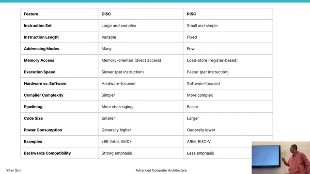

**CISC** favors a large set of instructions that may combine memory access and arithmetic. **RISC** favors fewer, simpler operations and an explicit load/store organization. A complex operation such as adding a memory operand can become a sequence like:

```asm
lw   t0, 0(s0)      # load from memory
add  t1, t2, t0     # compute in registers
sw   t1, 0(s0)      # store when needed
```

RISC may execute more instructions, but the regular operations are easier to pipeline and schedule. Modern x86 blurs the old boundary: it preserves a complex x86 ISA for compatibility but translates instructions internally into simpler micro-operations. The historical ISA remains a contract even when the microarchitecture underneath changes radically.

## Programs, binaries, and assembly

### Slide 6 — Machine languages ([00:14:50](https://www.youtube.com/watch?v=3Tf5iTvtgiI&t=890s))

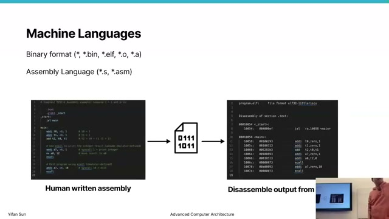

Machine code is the binary representation consumed by the processor; assembly is its human-readable form. An assembler maps mnemonics, registers, immediates, and labels into encoded instructions, while a disassembler performs the reverse interpretation. The address printed beside each disassembled instruction is its program-counter location, not part of the mnemonic itself.

The relation is close but not perfectly one-name-to-one because assemblers support **pseudo-instructions**: convenient spellings that lower to real encodings.

### Slide 7 — ELF file format ([00:16:46](https://www.youtube.com/watch?v=3Tf5iTvtgiI&t=1006s))

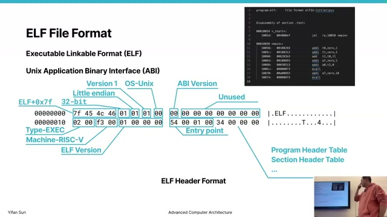

Linux and other Unix-like systems commonly store executables and shared libraries in **ELF**, the Executable and Linkable Format. Its magic bytes are:

$$
\texttt{7f 45 4c 46} = \texttt{0x7F + "ELF"}.
$$

The ELF header identifies properties such as file type and target ISA and points to the program-header and section-header tables. This lets tools and the operating system interpret the file before any instruction executes.

### Slide 8 — ELF tools and tables ([00:20:25](https://www.youtube.com/watch?v=3Tf5iTvtgiI&t=1225s))

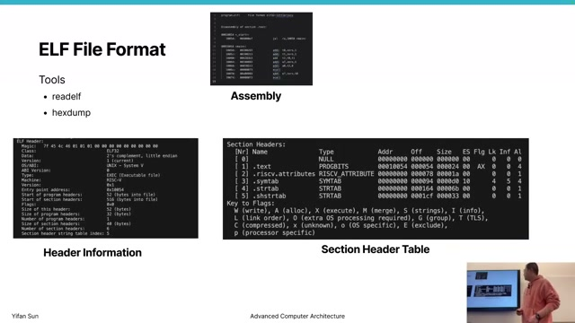

The instructor uses `readelf` and `hexdump` to connect an ELF file's bytes to its structure. Important sections include:

| Section | Typical contents |
|---|---|
| `.text` | Executable instructions |
| `.data` | Initialized writable globals |
| `.bss` | Uninitialized globals |
| `.rodata` | Read-only constants |
| `.strtab` | Stored strings and names |
| `.symtab` | Functions, labels, and other symbols |

Program headers describe segments the loader maps into memory; section headers organize link-time and analysis information. A GPU **fat binary** can embed a device ELF inside a host executable, allowing the runtime to find and launch the device code. The instructor distinguishes an API, a source-level software interface, from an ABI, the binary-level conventions that independently compiled components must share.

### Slide 9 — Assembly source structure ([00:22:52](https://www.youtube.com/watch?v=3Tf5iTvtgiI&t=1372s))

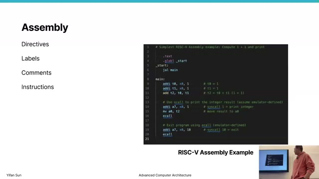

Assembly contains directives, labels, comments, and instructions. Directives guide the assembler; labels give symbolic names to instruction addresses; comments are discarded; instructions become machine code. An instruction such as `addi t0, x0, 1` exposes the core fields: operation, destination register, source register, and immediate. Because `x0` always reads as zero, this example places the constant 1 in `t0`.

## RISC-V organization

### Slide 10 — RISC-V ISA ([00:26:30](https://www.youtube.com/watch?v=3Tf5iTvtgiI&t=1590s))

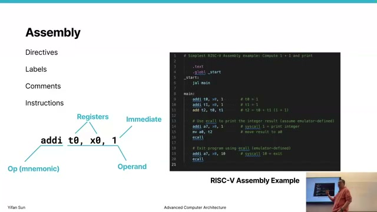

RISC-V is an open ISA designed at UC Berkeley. Its name refers to the fifth Berkeley RISC design. The lecture emphasizes that a small base can support even constrained systems while leaving room for standardized and custom extensions.

### Slide 11 — RISC-V extensibility ([00:27:32](https://www.youtube.com/watch?v=3Tf5iTvtgiI&t=1652s))

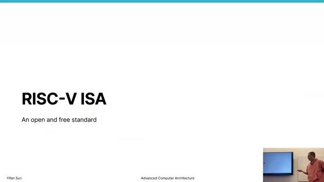

`RV32I` is the 32-bit integer base and `RV64I` is the 64-bit counterpart. Common extensions include:

| Extension | Capability |
|---|---|
| `M` | Integer multiply and divide |
| `A` | Atomic operations |
| `F` / `D` | Single-/double-precision floating point |
| `C` | Compressed instruction encodings |
| `V` | Vector operations |
| `B` | Bit manipulation |

An implementation selects only what it needs, and designers may define custom extensions for specialized accelerators. The instructor mentions research prototypes that add GPU-oriented operations to RISC-V and evaluate them on FPGA-based systems.

### Slide 12 — Register set ([00:30:35](https://www.youtube.com/watch?v=3Tf5iTvtgiI&t=1835s))

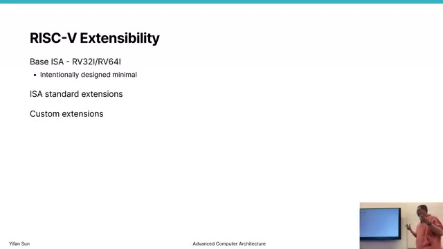

The integer ISA exposes 32 registers, `x0` through `x31`. `x0` is hardwired to zero: writes are discarded and reads return zero. The remaining architectural names include `ra` (return address), `sp` (stack pointer), argument registers `a0`-`a7`, saved registers `s0`-`s11`, and temporaries `t0`-`t6`.

The instructor contrasts this compact CPU state with a GPU's very large register file. GPUs keep many thread contexts resident to hide latency, making fine-grained context switching much more expensive than saving a CPU thread's architectural registers. Heavy per-thread register use also reduces GPU occupancy.

### Slide 13 — Register roles and calling convention ([00:31:55](https://www.youtube.com/watch?v=3Tf5iTvtgiI&t=1915s))

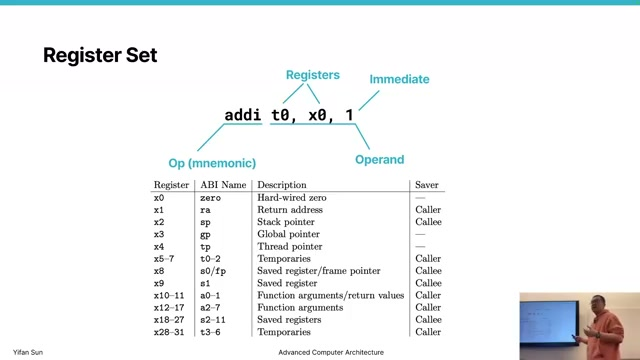

The ABI gives registers stable roles so separately compiled functions can cooperate:

| Registers | Role | Preserved across a call? |
|---|---|---|
| `x0` / `zero` | Constant zero | Fixed |
| `x1` / `ra` | Return address | No |
| `x2` / `sp` | Stack pointer | Yes |
| `a0`-`a7` | Arguments; `a0`-`a1` also return values | No |
| `t0`-`t6` | Temporaries | No (caller-saved) |
| `s0`-`s11` | Saved values | Yes (callee-saved) |

“Preserved” is a contract, not a physical property. A callee may use an `s` register only if it saves the old value and restores it before returning. A caller must assume `a` and `t` registers can be overwritten.

### Slide 14 — Instruction groups and loops ([00:37:05](https://www.youtube.com/watch?v=3Tf5iTvtgiI&t=2225s))

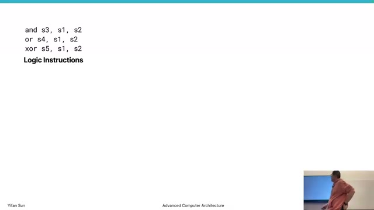

Logical instructions include `and`, `or`, and `xor`, with immediate forms such as `andi`. `sll` and `srl` shift logically and fill with zeros; `sra` replicates the sign bit, preserving the sign of a two's-complement value during a right shift.

Arithmetic uses `add`, `addi`, and `sub`; there is no need for a separate `subi` because `addi` accepts a negative immediate. In RV32, multiplying two 32-bit values may produce 64 bits, so the low and high halves are obtained separately:

$$
P = (\operatorname{mulh}(a,b) \ll 32) \;|\; \operatorname{mul}(a,b).
$$

Branches (`beq`, `bne`, `blt`, `bge`, plus unsigned forms) compare registers and either redirect the PC or fall through. Labels allow backward branches to form loops and forward branches to skip code.

### Slide 15 — Conditional branches and basic blocks ([00:46:10](https://www.youtube.com/watch?v=3Tf5iTvtgiI&t=2770s))

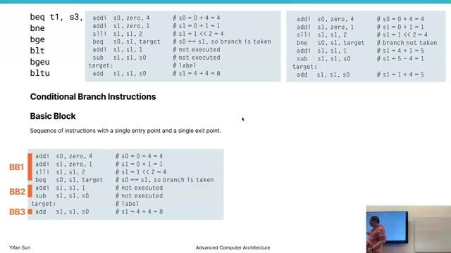

A conditional branch such as `beq s0, s1, target` jumps only when its comparison is true. Otherwise execution continues at the next instruction. A **basic block** is a straight-line sequence with one entry and no internal control-flow split; its final branch or jump selects the next block. This concept is central to compiler optimization and later processor control-flow analysis.

Labels are represented through symbols while instructions in `.text` occupy addresses in sequence. For normal 32-bit instructions:

$$
PC_{next} = PC + 4
$$

unless a taken branch or jump supplies another target.

### Slide 16 — High-level control flow in assembly ([00:49:00](https://www.youtube.com/watch?v=3Tf5iTvtgiI&t=2940s))

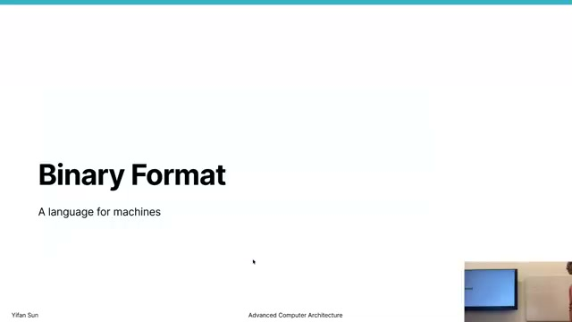

Assembly has no built-in `if`, `switch`, `while`, or `for`; compilers construct them from comparisons, conditional branches, labels, and jumps. An `if/else` branches to one arm and jumps past the other. A loop branches back to its test or body. Array access combines address arithmetic with loads and stores, making the high-level loop's hidden pointer updates explicit.

## Binary encodings

### Slide 17 — Binary format overview ([00:54:10](https://www.youtube.com/watch?v=3Tf5iTvtgiI&t=3250s))

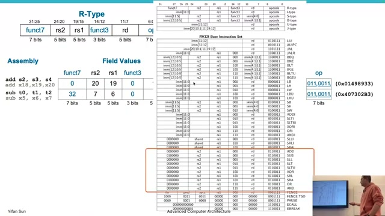

RISC-V's regular 32-bit encodings reuse field positions. In the common R-type layout, the opcode selects a broad instruction class, `rd` is the destination, `rs1` and `rs2` are sources, and `funct3`/`funct7` distinguish operations within the class:

$$
\underbrace{funct7}_{7}\;\underbrace{rs2}_{5}\;\underbrace{rs1}_{5}\;\underbrace{funct3}_{3}\;\underbrace{rd}_{5}\;\underbrace{opcode}_{7}.
$$

Keeping register fields in consistent positions simplifies decode hardware. Immediate formats rearrange some bits to preserve those positions and to give each instruction class the range it needs.

### Slide 18 — R-, I-, S-, B-, U-, and J-type encodings ([00:58:50](https://www.youtube.com/watch?v=3Tf5iTvtgiI&t=3530s))

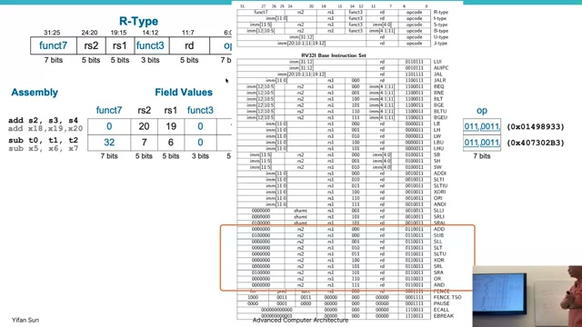

The slide works from assembly operands through field values to machine code. R-type instructions encode two source registers and one destination. I-type instructions replace `rs2`/`funct7` with a 12-bit immediate and are used by operations such as `addi` and loads. S-type stores split the immediate around the register fields because there is no destination register. B-type branches similarly scatter an aligned PC-relative offset; U- and J-types provide larger immediates for upper-immediate and long-jump operations.

The important method is systematic: identify the format from the opcode, map each assembly operand to its field, encode signed immediates in two's complement, then concatenate the fields in bit-position order. Disassembly reverses the same process.

## Functions and stacks

### Slide 19 — Functions, arguments, and return values ([01:03:05](https://www.youtube.com/watch?v=3Tf5iTvtgiI&t=3785s))

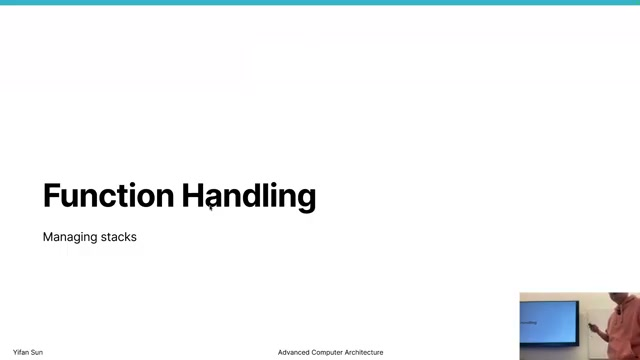

A high-level function call hides argument transport, a control transfer, a return address, and result transport. The RISC-V convention places the first eight integer arguments in `a0`-`a7` and returns up to two register-sized values in `a0`-`a1`. The calling convention is jointly shaped by the ISA, operating system, language, and compiler; all participants must agree for separately compiled code to interoperate.

### Slide 20 — RISC-V calling convention ([01:05:19](https://www.youtube.com/watch?v=3Tf5iTvtgiI&t=3919s))

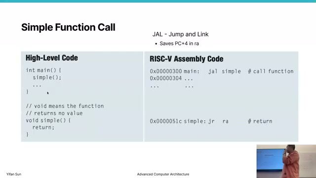

The register table is a division of responsibility. The callee must restore `sp` and any `s` registers it changes. The caller must preserve any live values held in `a` or `t` registers before making a call. This minimizes unnecessary memory traffic: a function saves only the state that is both live and at risk of being overwritten.

### Slide 21 — Simple function call with `jal` ([01:06:25](https://www.youtube.com/watch?v=3Tf5iTvtgiI&t=3985s))

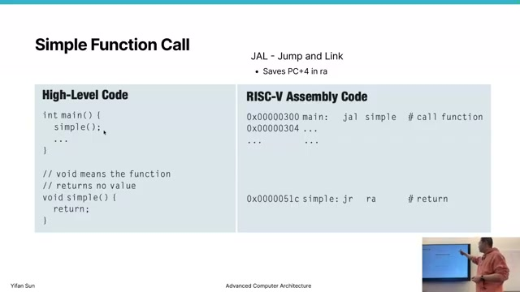

`jal` performs two jobs: it transfers control to the callee and writes the return point, `PC + 4`, to `ra` (`x1` by convention). A return jumps indirectly through `ra`, often written with the `ret` pseudo-instruction. Saving `PC + 4` is essential; saving the call instruction's own address would execute the call again on return.

```asm
jal  ra, simple     # ra = PC + 4; PC = address(simple)
...
simple:
  ret               # pseudo-instruction: jump through ra
```

### Slide 22 — Arguments and a stack frame ([01:11:30](https://www.youtube.com/watch?v=3Tf5iTvtgiI&t=4290s))

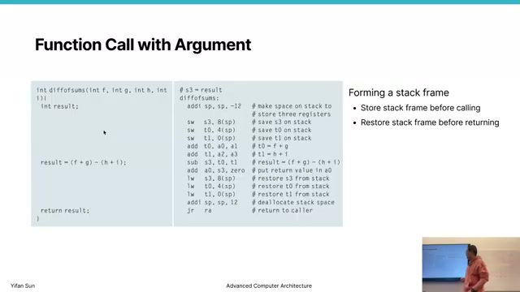

The example computes a function of four values, passing them in `a0`-`a3` and placing the result in `a0`. A written `mv a0, s3` is a pseudo-instruction; because adding zero copies a value, the assembler can encode it as an `add`/`addi` form rather than requiring a distinct move opcode.

If the callee needs an `s` register, it forms a stack frame, stores the old value, computes, reloads the value, and releases the frame. For three 32-bit values the illustrated conservative frame subtracts 12 from `sp`; because the stack grows toward lower addresses, subtraction allocates space:

```asm
addi sp, sp, -12    # allocate three words
sw   s3, 8(sp)
sw   t0, 4(sp)
sw   t1, 0(sp)
# function body
lw   t1, 0(sp)
lw   t0, 4(sp)
lw   s3, 8(sp)
addi sp, sp, 12     # release frame
```

The instructor then calls this deliberately over-conservative: `t0` and `t1` are caller-saved, so a normal callee need not restore them. Saving only `s3` removes expensive loads and stores. Stack allocation is fast because it is pointer adjustment in ordinary memory, but stack capacity is finite; large local arrays can make frames large.

### Slide 23 — Non-leaf function calls ([01:17:30](https://www.youtube.com/watch?v=3Tf5iTvtgiI&t=4650s))

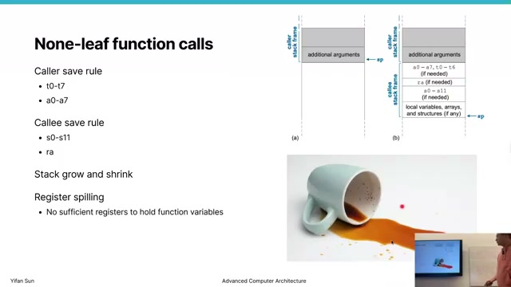

A **leaf** function calls no other function; a **non-leaf** function does. A nested `jal` overwrites `ra`, so a non-leaf callee must save its incoming return address before making another call and restore it before returning. It must likewise preserve any callee-saved registers it changes. Conversely, callers save live `a` and `t` values if they will be needed after the call.

The stack therefore grows and shrinks with nested calls. Each frame holds exactly the return state, preserved registers, spills, and local data required by that invocation. The final spilled-cup analogy emphasizes that failing to save the right state destroys the caller's context.

## Key formulas and takeaways

1. The ISA specifies **what** architectural result hardware must produce; microarchitecture determines **how** and how fast it is produced.
2. ELF starts with `7f 45 4c 46` and packages executable code, data, loader information, sections, strings, and symbols.
3. RISC-V uses a small integer base plus optional standard or custom extensions.
4. `x0 = 0` at all times; writes to it are discarded.
5. Normal 32-bit sequential execution advances by $PC + 4$.
6. A full RV32 product can be reconstructed as $(mulh \ll 32)\;|\;mul$.
7. `srl` shifts in zeros; `sra` shifts in the sign bit.
8. Assembly control flow is built from fall-through, conditional branches, labels, and jumps.
9. `jal` writes $PC + 4$ to `ra` while transferring control to the target.
10. `a0`-`a7` carry arguments; `a0`-`a1` carry return values.
11. Callees preserve `s` registers and `sp`; callers preserve live `a` and `t` registers.
12. Stack-frame size and save/restore traffic should match actual liveness: preserving unnecessary temporaries wastes memory operations.