# Automated Program Optimization - Episode 5

**Course:** Machine Learning Compilation, Summer 2022  
**Instructor:** Tianqi Chen  
**Video:** [YouTube lecture](https://www.youtube.com/watch?v=P0L-EFMswUg) (45:08)  
**Notebook:** [Automatic Program Optimization](https://github.com/mlc-ai/notebooks/blob/main/5_Automatic_Program_Optimization.ipynb)

This episode turns deterministic TensorIR schedules into searchable program spaces. It separates three responsibilities: stochastic transformations generate valid candidates, measurements or cost models estimate their quality, and search strategies select promising traces.

## From manual schedules to search spaces

### Slide 1 — Automated program optimization ([00:00:05](https://www.youtube.com/watch?v=P0L-EFMswUg&t=5s))

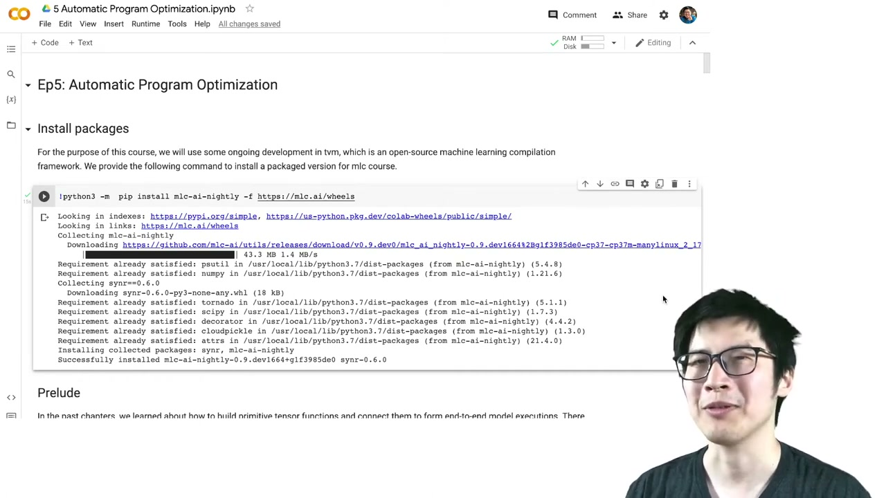

Previous episodes represented and manually transformed tensor programs. Episode 5 asks how a compiler can discover transformation choices automatically rather than relying on an expert to specify every split factor, loop order, and hardware mapping.

### Slide 2 — Manual matrix-multiplication schedule ([00:01:30](https://www.youtube.com/watch?v=P0L-EFMswUg&t=90s))

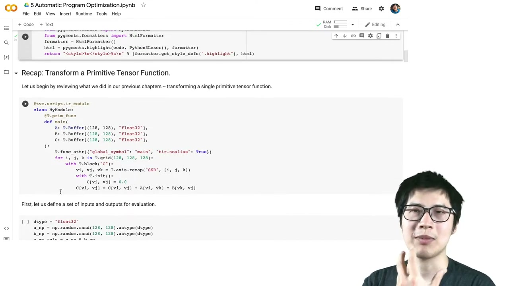

The running 128×128 matrix multiplication uses a hand-written schedule: locate a block and loops, split an axis by a fixed factor, reorder loops, and decompose reduction initialization. The schedule improves locality, but its constants reflect human choices for one workload and target.

### Slide 3 — Schedule traces ([00:03:30](https://www.youtube.com/watch?v=P0L-EFMswUg&t=210s))

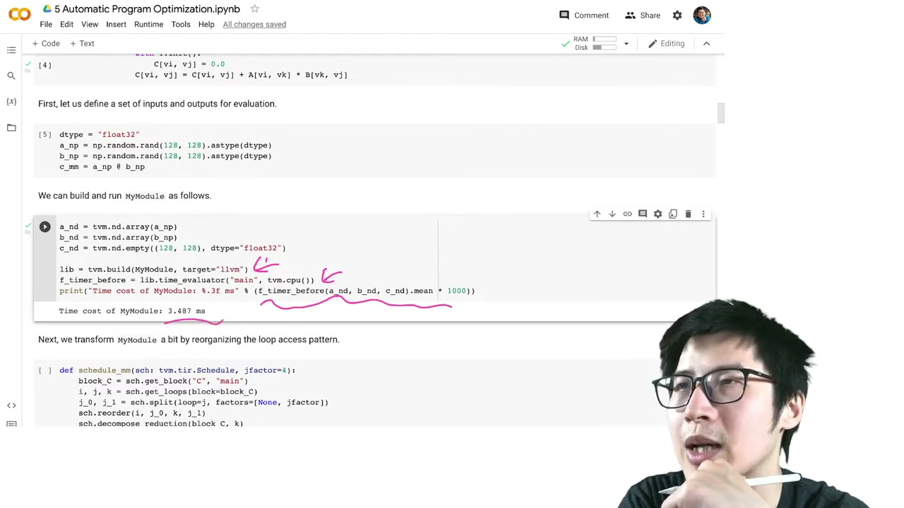

A TensorIR schedule records a **trace** of its operations: `get_block`, `get_loops`, `split`, `reorder`, `decompose_reduction`, and related calls. The trace is a reproducible program for deriving the transformed IR, not merely a dump of final code.

This representation lets a search system replay the same structure with different decisions.

### Slide 4 — Stochastic schedule transformations ([00:06:00](https://www.youtube.com/watch?v=P0L-EFMswUg&t=360s))

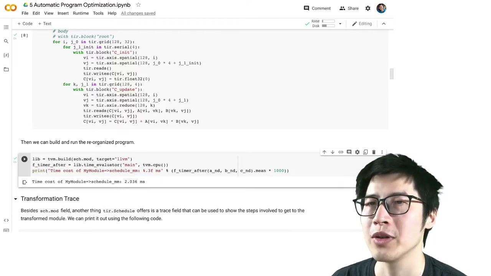

A deterministic schedule chooses one factorization. A stochastic schedule introduces sampling instructions where the best value is unknown. It therefore defines a family of valid programs while retaining deterministic, trusted transformations around those choices.

### Slide 5 — `sample_perfect_tile` ([00:08:30](https://www.youtube.com/watch?v=P0L-EFMswUg&t=510s))

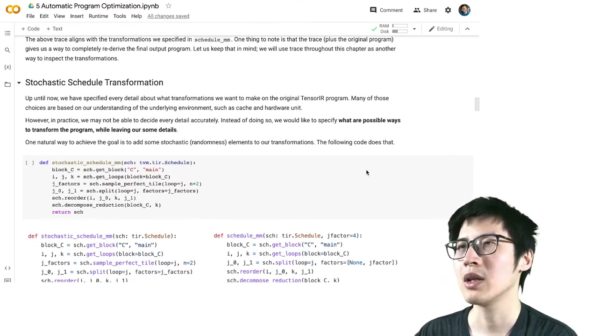

`sample_perfect_tile(loop, n=2)` samples two factors whose product equals the loop extent. For extent 128, valid ordered pairs include

$$
(1,128),(2,64),(4,32),(8,16),(16,8),(32,4),(64,2),(128,1).
$$

The sampled symbolic factors feed `split`; divisibility is guaranteed by construction, so every sampled program remains structurally valid.

### Slide 6 — Different sampled variants ([00:11:00](https://www.youtube.com/watch?v=P0L-EFMswUg&t=660s))

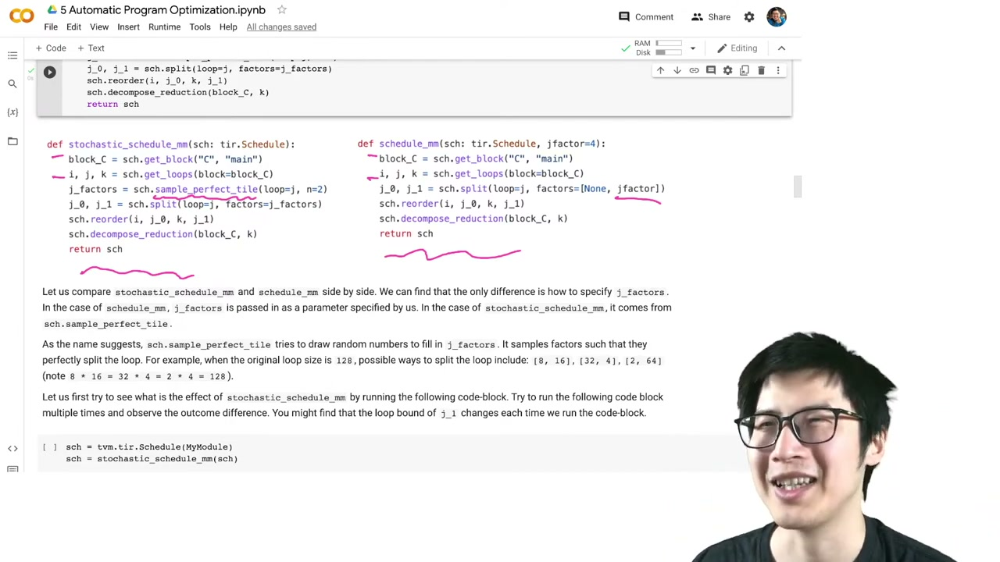

Repeated calls to the stochastic schedule yield different loop nests. The transformation skeleton stays constant, but sampled tile sizes alter locality, vector lengths, and loop overhead. The best choice is hardware- and shape-dependent, so source-level intuition alone is insufficient.

### Slide 7 — A program search space ([00:13:00](https://www.youtube.com/watch?v=P0L-EFMswUg&t=780s))

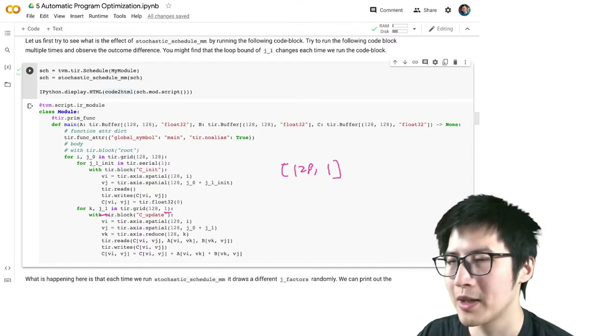

The stochastic schedule is a generator over programs:

$$
S(\theta)\rightarrow P_\theta,
$$

where $	heta$ is the collection of sampled decisions and $P_\theta$ is the resulting TensorIR program. Composing more samples—multi-level tiles, orders, vector widths, parallel factors—causes the space to grow combinatorially.

## Measuring and searching

### Slide 8 — Random search loop ([00:15:00](https://www.youtube.com/watch?v=P0L-EFMswUg&t=900s))

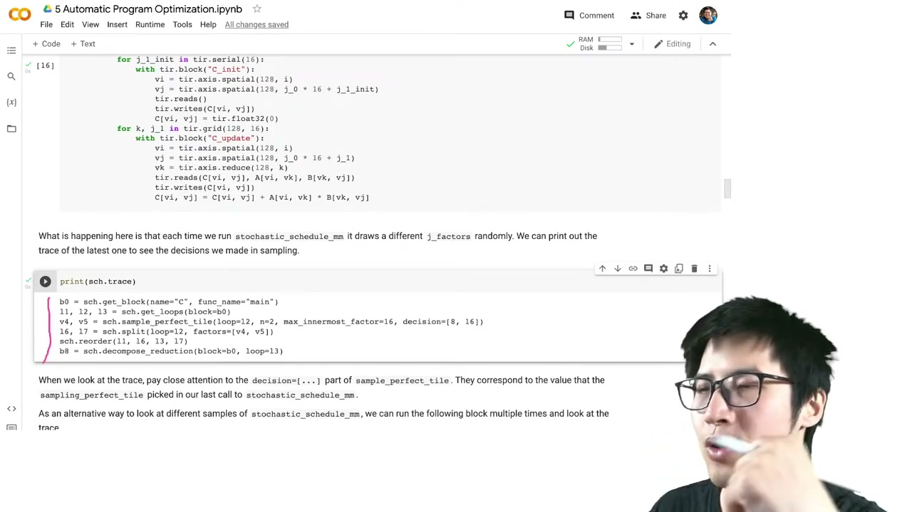

A minimal optimizer repeatedly:

1. samples a schedule,
2. builds the candidate,
3. benchmarks it,
4. records the fastest candidate.

Random search is easy to implement and useful as a baseline. It can work for small spaces but wastes trials when many choices are poor.

### Slide 9 — Runtime varies across traces ([00:17:00](https://www.youtube.com/watch?v=P0L-EFMswUg&t=1020s))

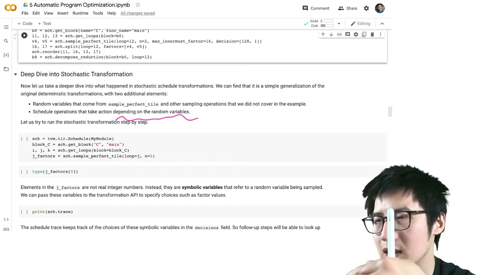

The notebook shows several tile decisions with different measured runtimes. Arithmetic is equivalent, yet memory access, cache reuse, compiler vectorization, and loop overhead differ. A measured winner is specific to the machine, compiler, shape, and measurement conditions.

### Slide 10 — MetaSchedule tuning API ([00:19:00](https://www.youtube.com/watch?v=P0L-EFMswUg&t=1140s))

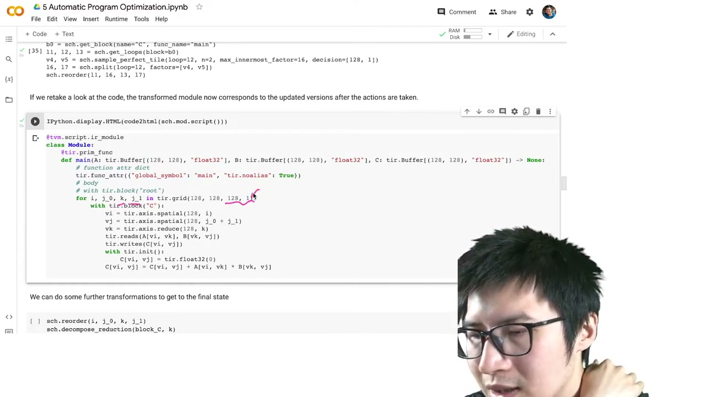

TVM MetaSchedule packages search infrastructure around TensorIR. A tuning call supplies the module/workload, target, trial budget, and execution configuration. The system generates candidates, builds and measures selected programs, records results in a database, and returns the best trace found within the budget.

### Slide 11 — Evolutionary trace search ([00:21:00](https://www.youtube.com/watch?v=P0L-EFMswUg&t=1260s))

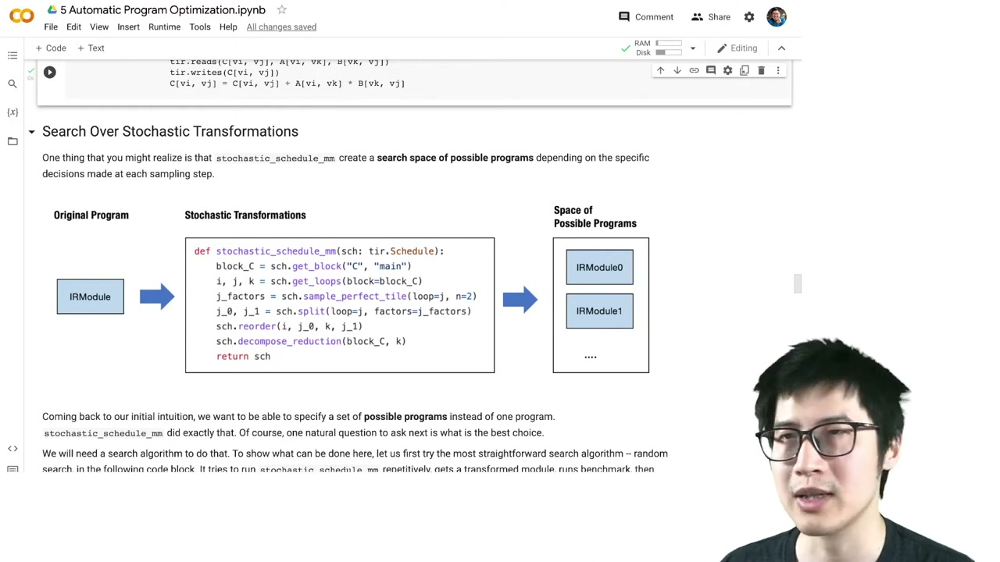

Evolutionary search keeps promising traces and mutates their decision values to create a new population. Measurements provide fitness; poor candidates are discarded while useful structures survive. This reuses information from earlier trials instead of sampling every candidate independently.

### Slide 12 — Default schedule rules ([00:23:00](https://www.youtube.com/watch?v=P0L-EFMswUg&t=1380s))

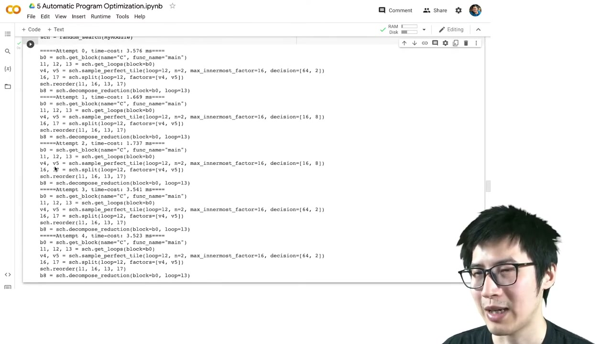

MetaSchedule can analyze blocks, loops, and access patterns and apply generic rules for tiling, parallelization, vectorization, unrolling, and related transformations. Rules create the structural trace; stochastic instructions inside those rules expose tunable decisions.

The rules are reusable across operation families, while target-specific constraints and workload structure determine applicability.

### Slide 13 — Multi-level tiling search ([00:25:00](https://www.youtube.com/watch?v=P0L-EFMswUg&t=1500s))

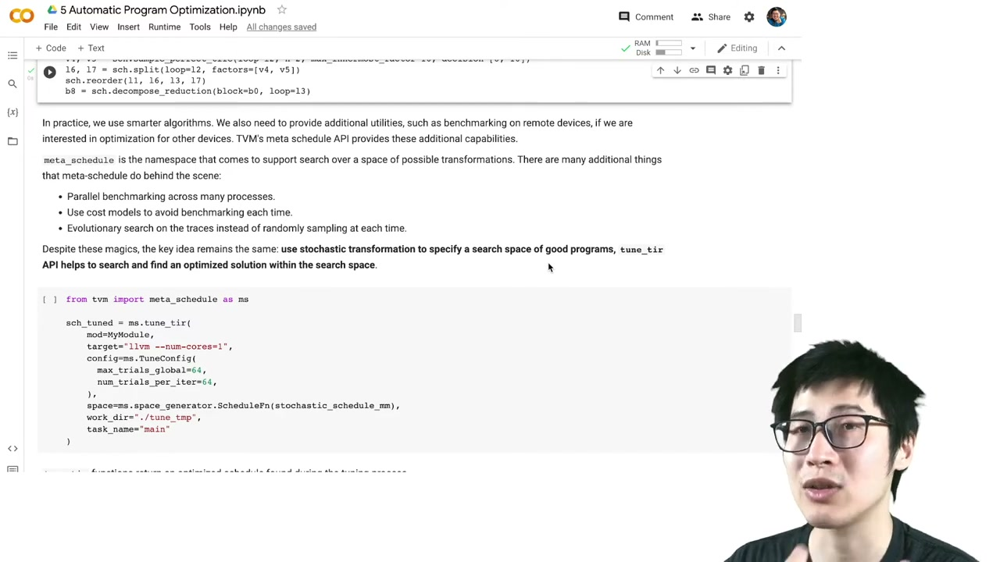

Automatic rules can generate deeper tiling hierarchies than the lecture's single manual split. Multiple levels correspond to thread partitions, cache tiles, register tiles, or vector lanes. Each level adds decisions, making exhaustive enumeration impractical but giving search more opportunity to match hardware hierarchy.

### Slide 14 — Annotations and low-level directives ([00:27:00](https://www.youtube.com/watch?v=P0L-EFMswUg&t=1620s))

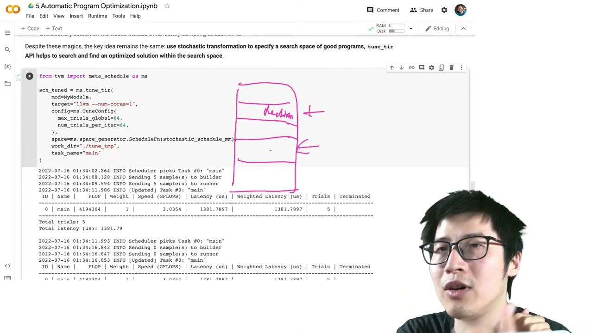

The selected program can contain parallel loops, vectorization, unroll annotations, and block metadata. These directives guide later compiler lowering without changing tensor semantics. Postprocessors verify target constraints and normalize a sampled schedule before compilation.

### Slide 15 — Three automation components ([00:29:00](https://www.youtube.com/watch?v=P0L-EFMswUg&t=1740s))

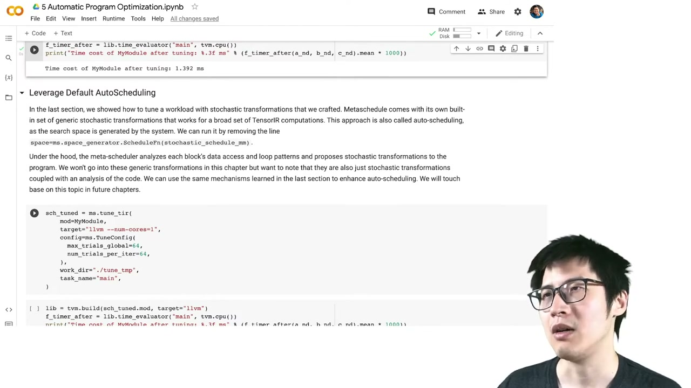

The workflow has three separable layers:

1. **Stochastic transformations** define possible implementations.
2. **Search/tuning** selects decisions within that space.
3. **Schedule rules and postprocessors** generate and validate broad candidate structures.

This modularity allows domain experts to add rules without rewriting the tuner and allows search algorithms to improve without changing TensorIR semantics.

## Scaling the optimization workflow

### Slide 16 — From one primitive to a model ([00:31:00](https://www.youtube.com/watch?v=P0L-EFMswUg&t=1860s))

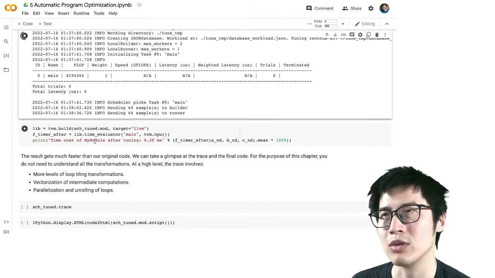

An end-to-end model contains multiple primitive workloads. Each can be extracted, tuned for its shape and target, and replaced with the best implementation recorded in a tuning database. Graph-level optimization and primitive-level tuning remain complementary.

### Slide 17 — Validate and compare implementations ([00:33:00](https://www.youtube.com/watch?v=P0L-EFMswUg&t=1980s))

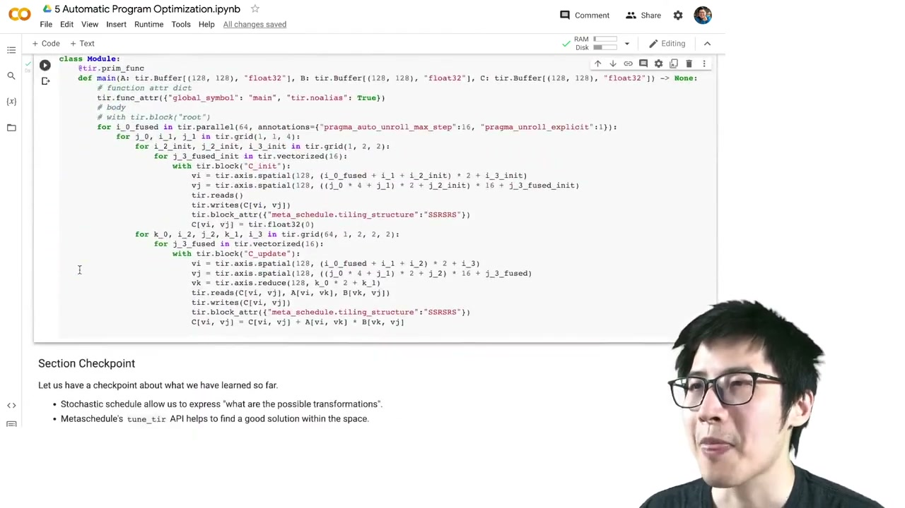

Candidates must pass correctness checks before performance matters. Measurements then compare naive, manually scheduled, randomly found, and MetaSchedule-selected variants. Search is not guaranteed to find a global optimum; it finds the best observed implementation under its space, budget, and measurement noise.

### Slide 18 — Measurement infrastructure ([00:35:00](https://www.youtube.com/watch?v=P0L-EFMswUg&t=2100s))

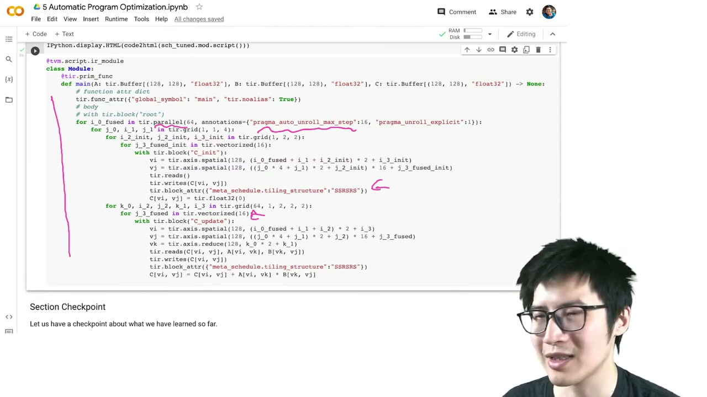

Building and benchmarking thousands of candidates is expensive. Tuning systems parallelize compilation and execution, control warm-up and repetition, reject invalid programs, and store results. Remote runners can measure on the actual target rather than the host machine.

### Slide 19 — Cost models ([00:37:00](https://www.youtube.com/watch?v=P0L-EFMswUg&t=2220s))

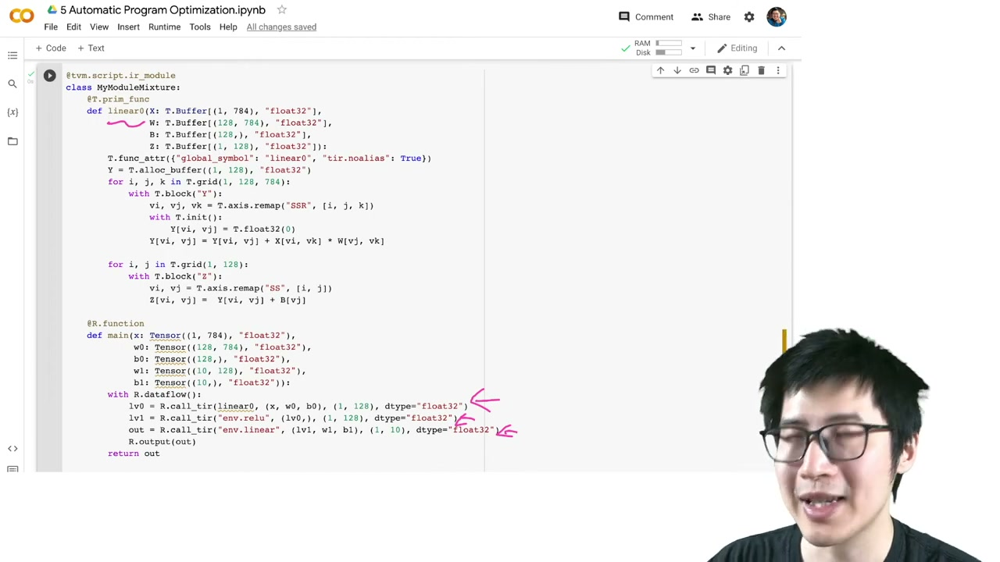

A cost model predicts candidate quality from program features and prior measurements. Search can rank a large candidate pool cheaply and spend real benchmark trials only on likely winners. The model is updated as new measurements arrive:

$$
\hat{c}(P_\theta)=f(features(P_\theta);\mathcal{D}_{measured}).
$$

Prediction reduces measurement demand but does not replace final validation on hardware.

### Slide 20 — Search strategy and reuse ([00:39:00](https://www.youtube.com/watch?v=P0L-EFMswUg&t=2340s))

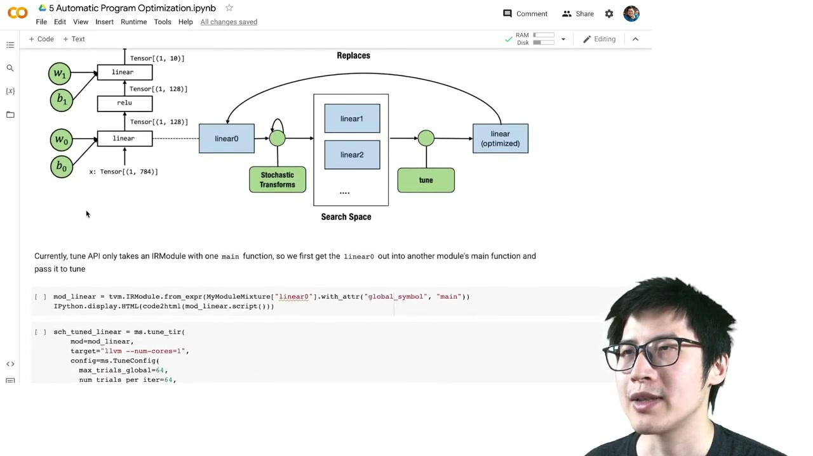

Search combines trace mutation, cost-model ranking, measured feedback, and databases. Results can seed related workloads or shapes, though transfer is only useful when hardware and access patterns are sufficiently similar. Replaying a trace makes the discovered implementation reproducible.

### Slide 21 — Deployment tradeoffs ([00:41:00](https://www.youtube.com/watch?v=P0L-EFMswUg&t=2460s))

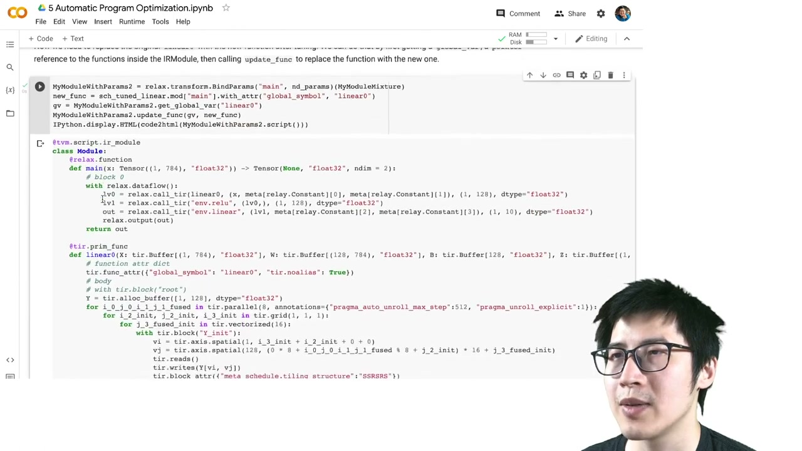

Tuning quality competes with compilation time, benchmark access, database size, and portability. Offline server deployment may justify many trials; dynamic mobile or browser workloads may rely more heavily on pre-tuned databases and cost-model predictions. The optimization target must match the real deployment device.

### Slide 22 — Summary ([00:44:00](https://www.youtube.com/watch?v=P0L-EFMswUg&t=2640s))

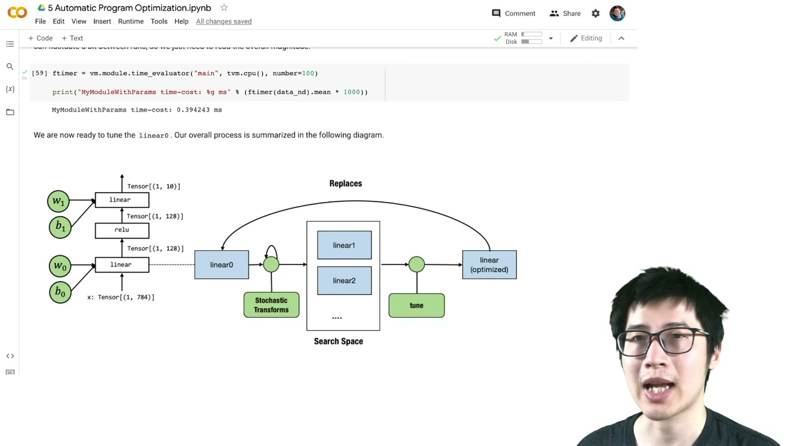

Automated optimization converts schedule expertise into reusable transformation rules and searchable decisions. TensorIR traces represent candidates; stochastic schedule primitives expose a space; measurement and cost models evaluate it; evolutionary search focuses the trial budget; MetaSchedule integrates the complete loop.

## Key takeaways

1. A deterministic schedule produces one implementation; a stochastic schedule defines many.
2. `sample_perfect_tile` samples legal loop factorizations.
3. Traces record transformation structure and concrete sampled decisions.
4. Replaying a trace reproduces a candidate implementation.
5. Search-space generation and search strategy are separate concerns.
6. Random search is a useful baseline but ignores information from earlier trials.
7. Evolutionary search mutates and selects promising traces.
8. Schedule rules generate structures such as multi-level tiling and parallel loops.
9. Postprocessors enforce target constraints before build.
10. Runtime depends on shape, hardware, compiler, and memory behavior.
11. Measurements must include correctness checks and robust timing procedures.
12. Cost models rank candidates using features learned from measured data.
13. Final performance should be verified on the deployment target.
14. Trial budgets trade tuning time for expected implementation quality.
15. Tuning databases let optimized traces be reused at deployment.
16. Graph optimization and primitive schedule tuning operate at complementary levels.
17. Automation reduces manual effort but still benefits from domain-specific rules and constraints.