# Build End to End Models - Episode 4

**Course:** Machine Learning Compilation, Summer 2022  
**Instructor:** Tianqi Chen  
**Video:** [YouTube lecture](https://www.youtube.com/watch?v=JfrbfwUwoV0) (54:58)  
**Course materials:** [Episode notes](https://mlc.ai/chapter_end_to_end/index.html) · [Notebook](https://github.com/mlc-ai/notebooks/blob/main/4_Build_End_to_End_Model.ipynb)

This episode composes primitive TensorIR functions into an end-to-end Fashion-MNIST model using Relax. It explains how high-level dataflow functions call destination-passing kernels, how parameters are represented and bound, and how the complete module is built and executed.

## Model and reference implementation

### Slide 1 — End-to-end model execution ([00:00:05](https://www.youtube.com/watch?v=JfrbfwUwoV0&t=5s))

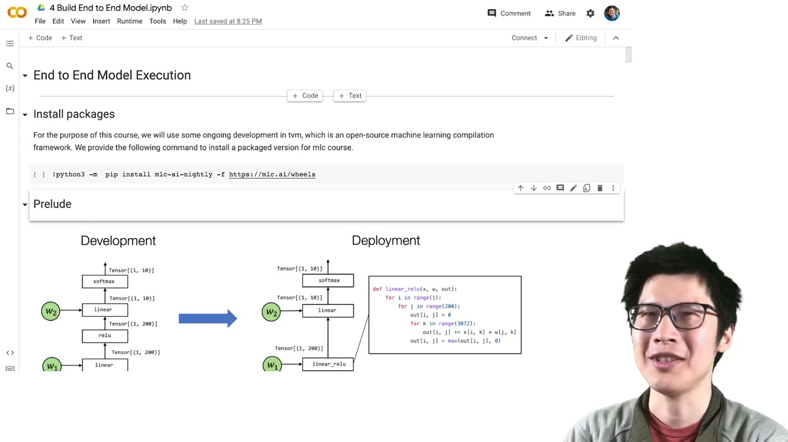

Previous episodes optimized individual primitive tensor functions. This lecture asks how to connect those primitives into a model, preserve graph-level dependencies, manage intermediate tensors and parameters, and produce a deployable runtime module.

### Slide 2 — Development and deployment forms ([00:01:00](https://www.youtube.com/watch?v=JfrbfwUwoV0&t=60s))

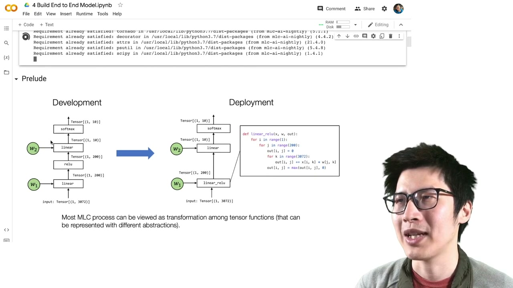

An end-to-end model in a development framework is a graph of layers and parameters. Deployment requires a graph-level representation for composition plus low-level implementations for each primitive. MLC transforms both levels: graph structure can be fused or rewritten, while primitive schedules can be specialized for hardware.

### Slide 3 — Fashion-MNIST setup ([00:02:30](https://www.youtube.com/watch?v=JfrbfwUwoV0&t=150s))

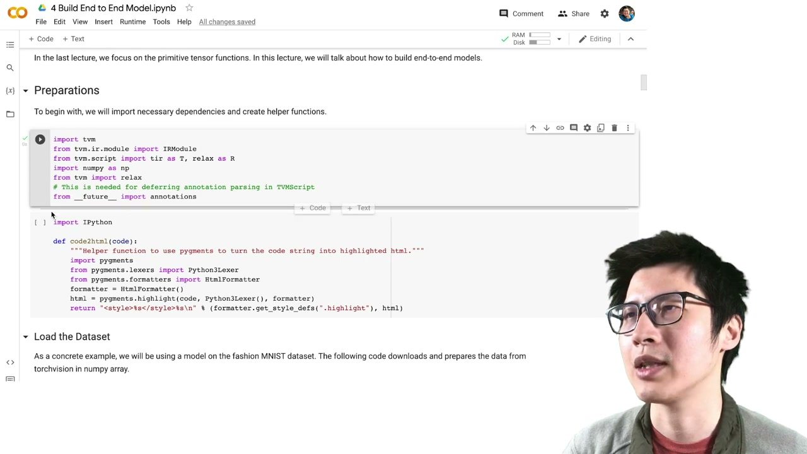

Fashion-MNIST supplies $28\times28$ grayscale images and ten clothing classes. The notebook loads one test image and its label, converts it to NumPy, and uses a pre-trained parameter checkpoint. Flattening gives a 784-element input vector.

### Slide 4 — Two-layer neural network ([00:05:00](https://www.youtube.com/watch?v=JfrbfwUwoV0&t=300s))

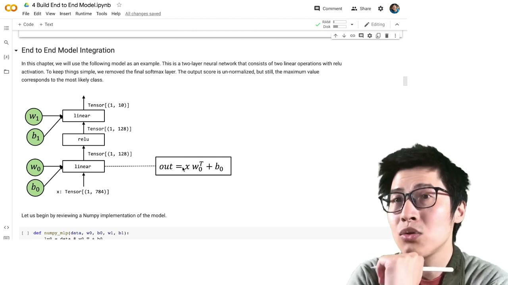

The model is a small multilayer perceptron:

$$
h=\operatorname{ReLU}(xW_0^T+b_0), \qquad
z=hW_1^T+b_1.
$$

The predicted class is $\arg\max_j z_j$; softmax is unnecessary when only the maximizing class is needed because softmax preserves logit order.

### Slide 5 — Parameter and activation shapes ([00:06:30](https://www.youtube.com/watch?v=JfrbfwUwoV0&t=390s))

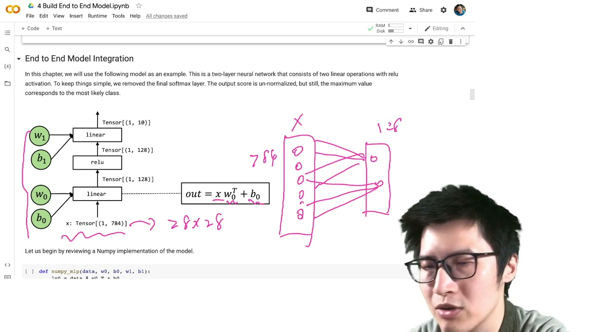

For batch size one:

| Tensor | Shape |
|---|---|
| Input $x$ | $[1,784]$ |
| First weight $W_0$ | $[128,784]$ |
| First bias $b_0$ | $[128]$ |
| Hidden activation $h$ | $[1,128]$ |
| Second weight $W_1$ | $[10,128]$ |
| Second bias $b_1$ | $[10]$ |
| Logits $z$ | $[1,10]$ |

Shapes are part of the compilation contract and determine both graph type checking and primitive specialization.

### Slide 6 — High-level NumPy model ([00:08:00](https://www.youtube.com/watch?v=JfrbfwUwoV0&t=480s))

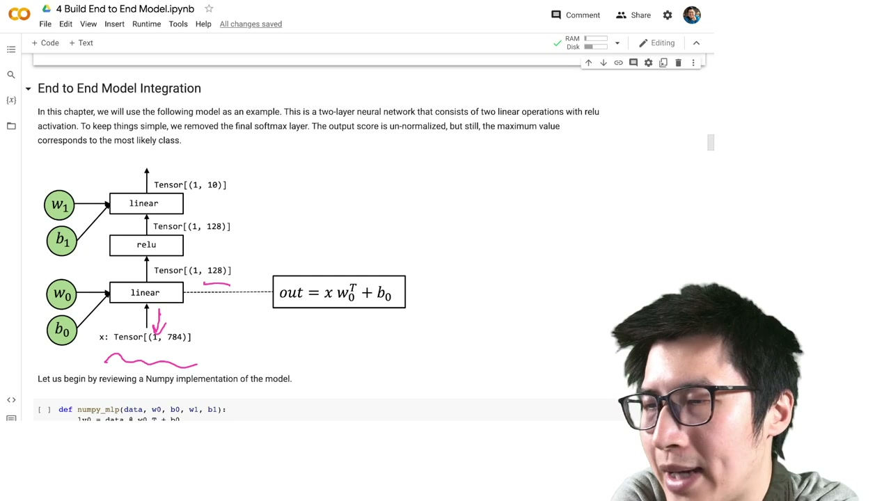

The functional reference uses array operators:

```python
lv0 = x @ w0.T + b0
lv1 = np.maximum(lv0, 0)
out = lv1 @ w1.T + b1
```

This concise form defines expected semantics but delegates allocation, dispatch, and kernel selection to NumPy.

### Slide 7 — Run inference and inspect prediction ([00:10:30](https://www.youtube.com/watch?v=JfrbfwUwoV0&t=630s))

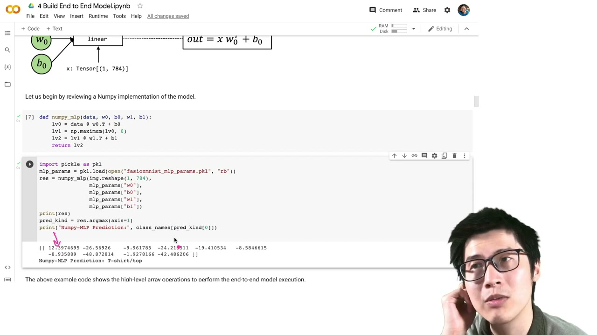

The notebook executes the reference model, prints the ten logits, takes `argmax`, and compares the class name with the Fashion-MNIST label. This establishes an end-to-end reference before replacing operations with lower-level primitives.

### Slide 8 — Low-level matrix multiplication ([00:12:00](https://www.youtube.com/watch?v=JfrbfwUwoV0&t=720s))

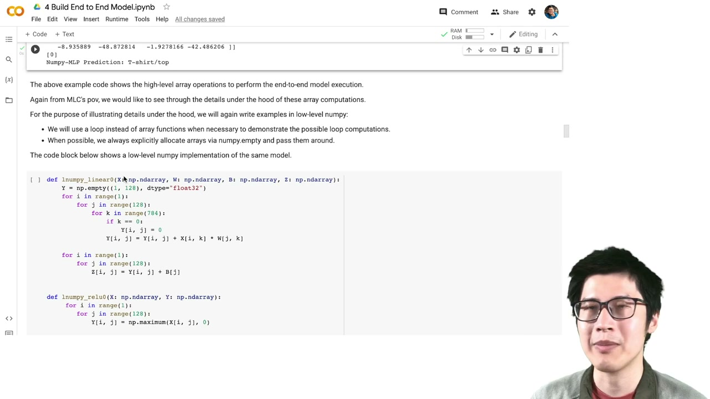

The linear operation is expanded into loops:

$$
Y_{ij}=b_j+\sum_k X_{ik}W_{jk}.
$$

The implementation receives a preallocated output buffer and writes each element through explicit initialization and accumulation. This destination-passing style mirrors low-level kernels and exposes memory control.

### Slide 9 — Destination-passing convention ([00:13:30](https://www.youtube.com/watch?v=JfrbfwUwoV0&t=810s))

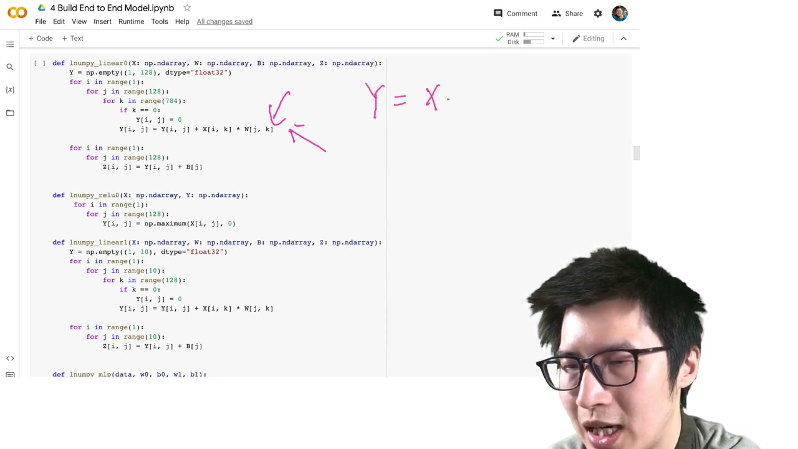

Instead of returning a newly allocated array, a primitive receives its destination as an argument. The caller controls allocation and lifetime:

```python
linear(x, weight, bias, output)
relu(input, output)
```

This makes kernels easy to map to fixed buffers and runtimes, but differs from the expression-oriented semantics expected by computational graphs.

### Slide 10 — Compose low-level primitives ([00:15:00](https://www.youtube.com/watch?v=JfrbfwUwoV0&t=900s))

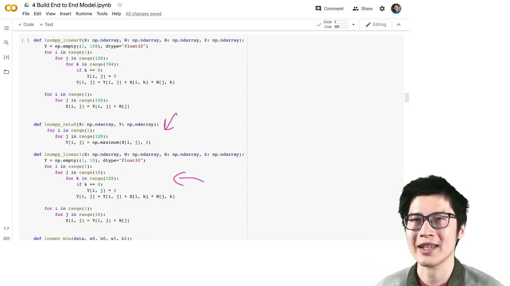

The low-level model allocates intermediate buffers and calls three shape-specialized primitives in order: `linear0`, `relu0`, and `linear1`. The explicit sequence makes data dependencies and temporary memory visible but forces the programmer to orchestrate every allocation.

## End-to-end IRModule and Relax

### Slide 11 — From primitives to a graph abstraction ([00:16:30](https://www.youtube.com/watch?v=JfrbfwUwoV0&t=990s))

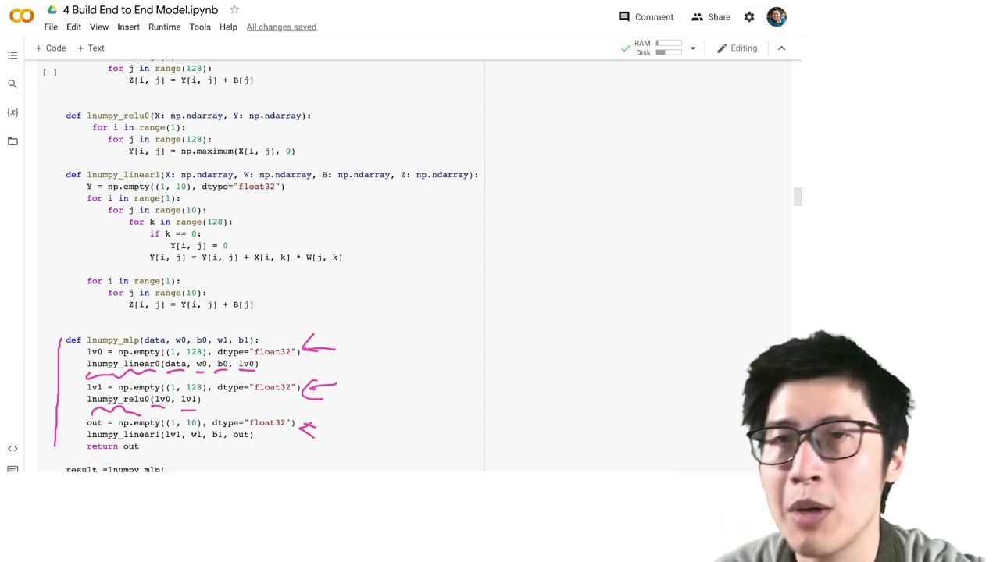

TensorIR is appropriate for primitive implementations, while an end-to-end model needs a higher-level representation whose values behave like returned tensors. Relax provides functions, expressions, dataflow blocks, and calls that describe model composition without manually assigning storage.

### Slide 12 — IRModule with TensorIR primitives ([00:18:00](https://www.youtube.com/watch?v=JfrbfwUwoV0&t=1080s))

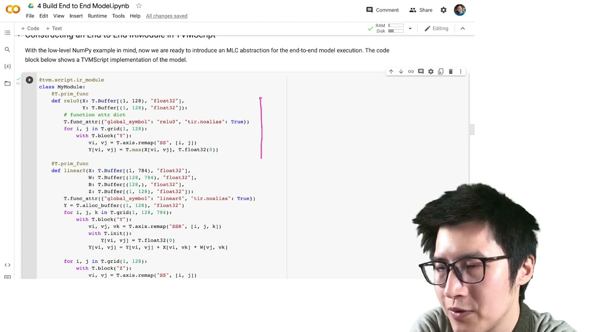

An `IRModule` can contain several `@T.prim_func` definitions plus a Relax entry function. The primitive functions encode linear and ReLU kernels with typed buffers; the high-level function names and composes them. Keeping both dialects in one module makes cross-level transformations possible.

### Slide 13 — Relax dataflow function ([00:19:30](https://www.youtube.com/watch?v=JfrbfwUwoV0&t=1170s))

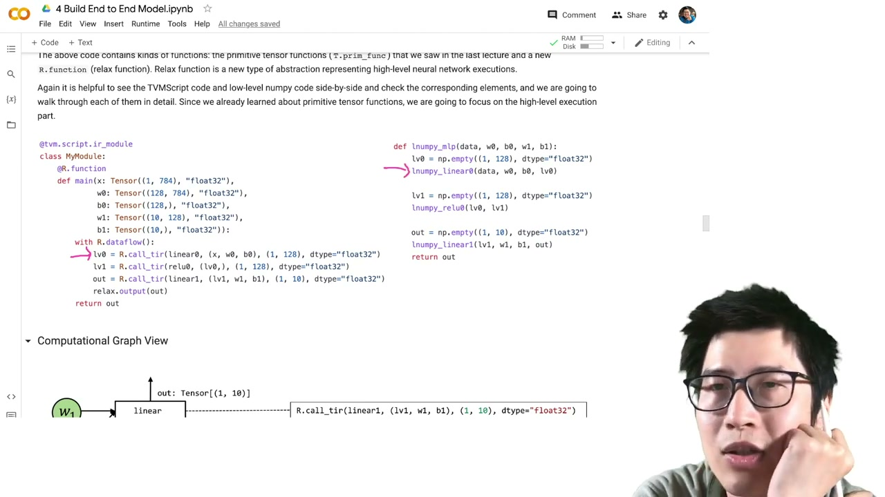

A Relax function declares tensor inputs and enters a dataflow block. Bindings assign symbolic values such as `lv0`, `lv1`, and `out`; each value depends on earlier expressions. The graph exposes producer–consumer structure for fusion, memory planning, and other transformations.

### Slide 14 — `call_tir` bridge ([00:21:30](https://www.youtube.com/watch?v=JfrbfwUwoV0&t=1290s))

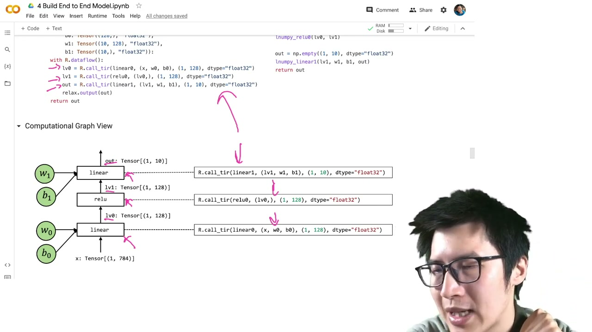

`relax.call_tir` adapts a destination-passing TensorIR primitive into an expression that returns a tensor. Conceptually, the compiler allocates output storage, calls the primitive with that destination, and produces a Relax value:

```python
lv0 = R.call_tir(linear0, (x, w0, b0), out_sinfo=R.Tensor((1, 128), "float32"))
```

Output structural information supplies shape and dtype needed before low-level allocation is materialized.

### Slide 15 — Pure expression semantics ([00:25:00](https://www.youtube.com/watch?v=JfrbfwUwoV0&t=1500s))

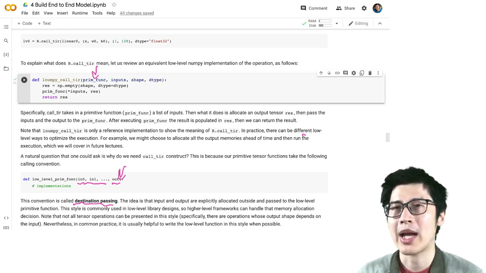

Relax treats each binding as producing a value rather than mutating visible global state. This functional view permits graph rewrites and dataflow reasoning. The called TensorIR kernel may write its private destination buffer internally, but `call_tir` contains that effect behind a pure graph-level interface.

### Slide 16 — Complete model graph ([00:29:00](https://www.youtube.com/watch?v=JfrbfwUwoV0&t=1740s))

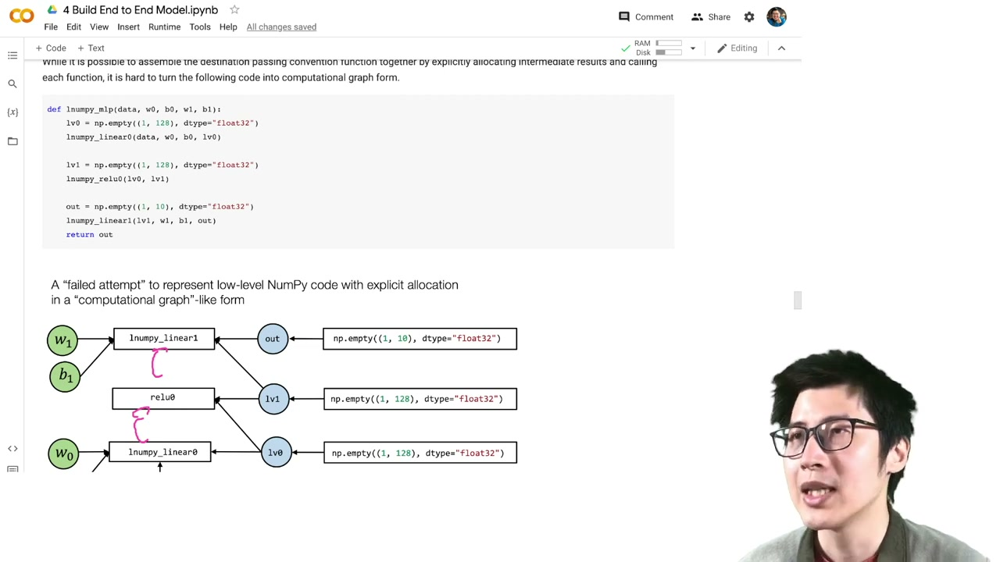

The entry function chains three `call_tir` expressions:

$$
x\xrightarrow{linear_0}lv0\xrightarrow{relu_0}lv1\xrightarrow{linear_1}out.
$$

`R.output(out)` marks the value escaping the dataflow block, and the function returns it. Weights and biases remain explicit parameters at this stage.

### Slide 17 — Dataflow graph interpretation ([00:33:00](https://www.youtube.com/watch?v=JfrbfwUwoV0&t=1980s))

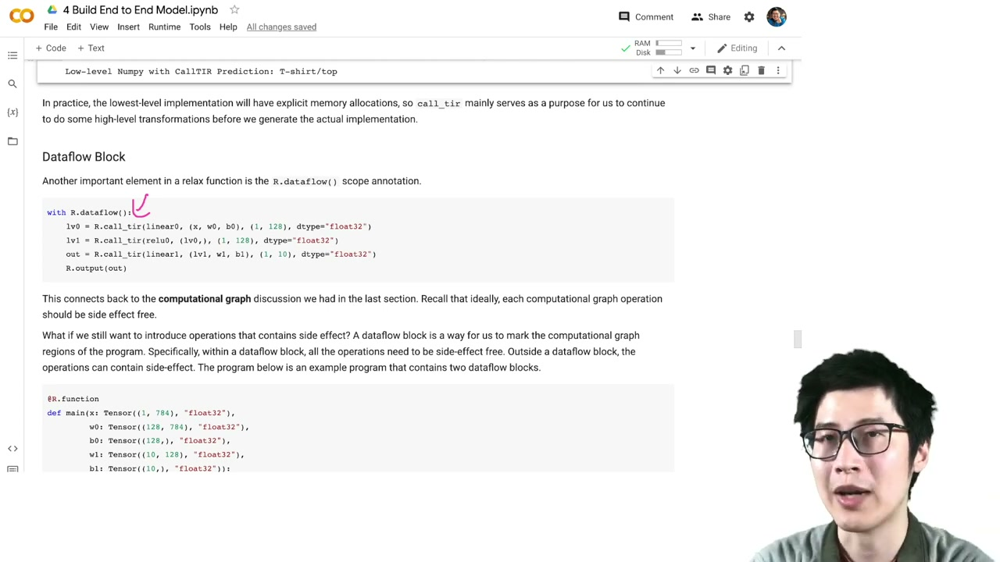

The textual Relax program corresponds to a directed acyclic graph: nodes are primitive calls and edges carry tensors. Topological dependencies determine legal execution order; independent nodes could run concurrently, while adjacent compatible nodes may be fused to avoid intermediate memory traffic.

### Slide 18 — Build the mixed module ([00:37:00](https://www.youtube.com/watch?v=JfrbfwUwoV0&t=2220s))

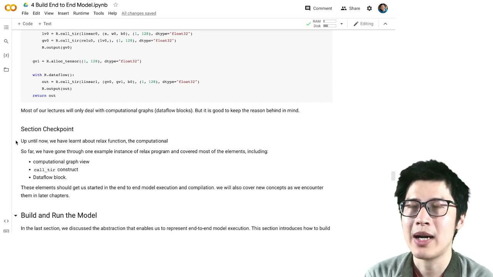

Compilation lowers the mixed Relax/TensorIR module toward a target. Graph-level passes plan calls and storage; TensorIR passes lower primitive loops; the backend emits native code. The result is a runtime executable rather than a Python interpretation of the graph.

### Slide 19 — Runtime and virtual machine ([00:40:00](https://www.youtube.com/watch?v=JfrbfwUwoV0&t=2400s))

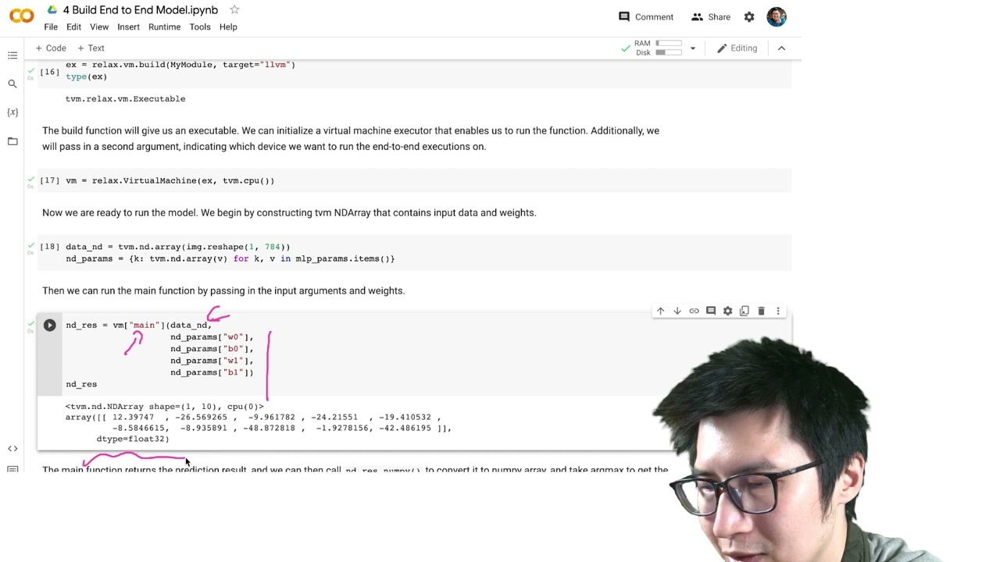

A Relax virtual machine loads the executable and target device. TVM NDArrays carry the input and parameters. Invoking the model's entry function returns a runtime tensor whose NumPy conversion can be compared with the reference logits.

### Slide 20 — Bind model parameters ([00:43:00](https://www.youtube.com/watch?v=JfrbfwUwoV0&t=2580s))

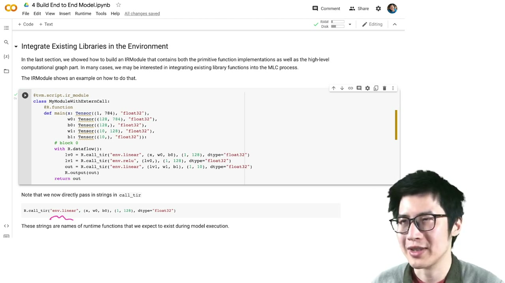

Weights and biases initially appear as function arguments, useful for reusable or trainable models. A deployment transformation can bind known parameter NDArrays as constants, leaving only the input in the public entry signature. Binding enables constant-aware optimization and simplifies invocation, while increasing the compiled artifact's model specificity.

### Slide 21 — Verify end-to-end output ([00:46:00](https://www.youtube.com/watch?v=JfrbfwUwoV0&t=2760s))

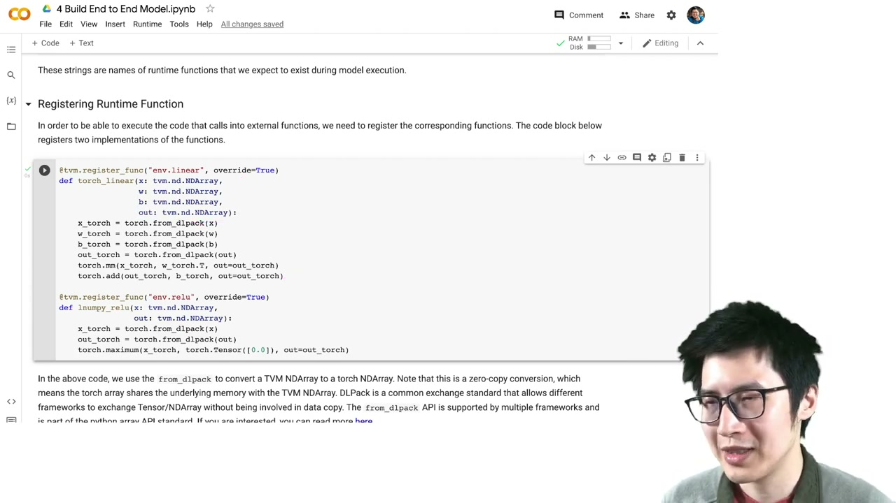

The runtime result is checked against the high-level NumPy implementation. Matching logits/prediction demonstrate that the model survives translation across high-level array code, low-level primitives, Relax graph composition, compilation, and runtime execution.

## Graph transformations and deployment

### Slide 22 — Graph-level optimization opportunities ([00:49:00](https://www.youtube.com/watch?v=JfrbfwUwoV0&t=2940s))

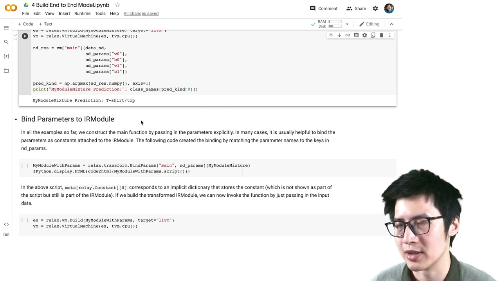

Relax exposes end-to-end transformations unavailable when primitives are compiled independently. Examples include operator fusion, constant folding, layout propagation, dead-code elimination, and memory planning. Such passes can create new fused primitive regions, which TensorIR then schedules for a target.

### Slide 23 — Mixed abstraction hierarchy ([00:52:00](https://www.youtube.com/watch?v=JfrbfwUwoV0&t=3120s))

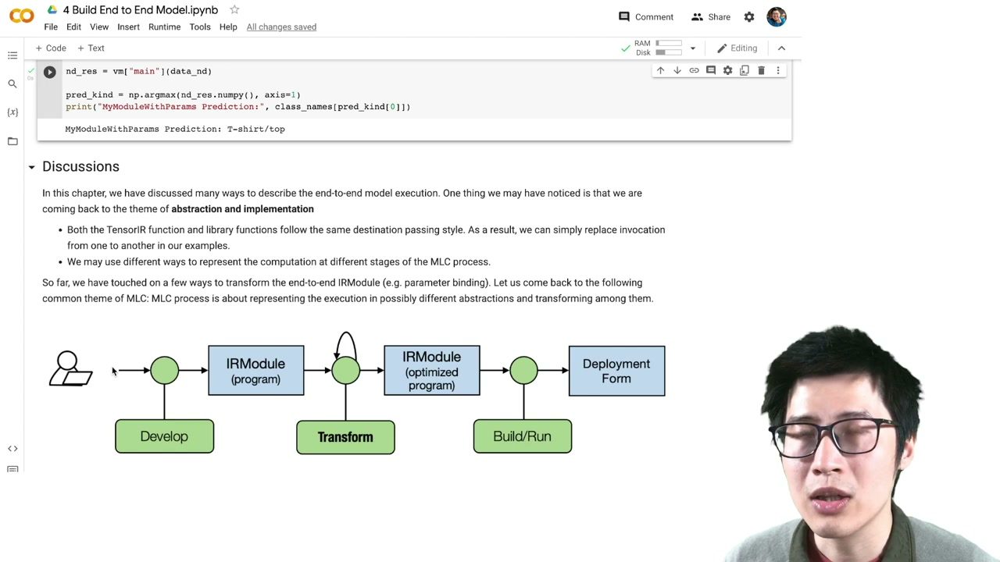

The complete stack alternates abstraction levels:

1. Relax represents end-to-end tensor dependencies.
2. `call_tir` connects graph nodes to primitive TensorIR implementations.
3. TensorIR schedules expose loops and memory behavior.
4. Build lowers both levels to target code and runtime calls.

MLC transformations can move boundaries—fusing nodes creates a larger primitive, while library dispatch can replace generated kernels.

### Slide 24 — Summary ([00:54:00](https://www.youtube.com/watch?v=JfrbfwUwoV0&t=3240s))

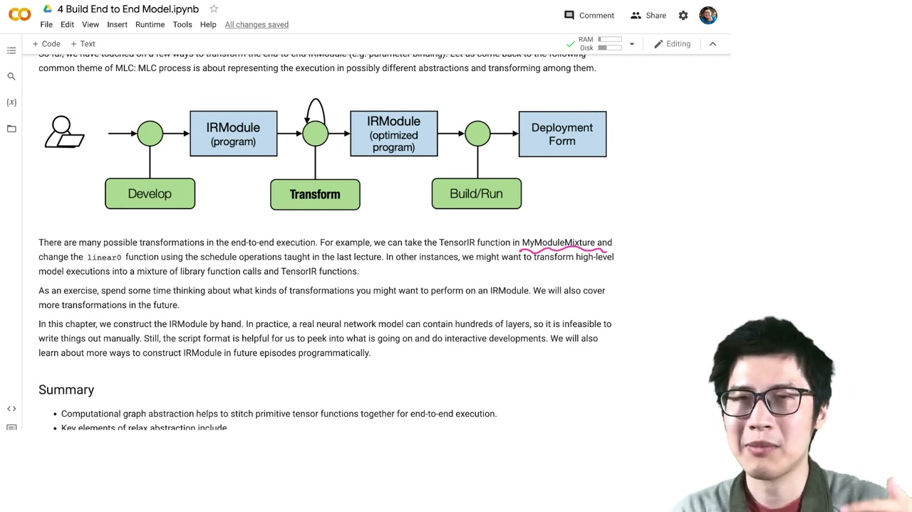

End-to-end compilation requires both compositional graph semantics and efficient primitive implementations. Relax supplies the former; TensorIR supplies the latter; `call_tir` bridges their calling conventions. The resulting IRModule can be transformed, parameterized, built, and executed as a deployment artifact.

## Key takeaways

1. Fashion-MNIST uses $28\times28=784$ input features and ten output classes.
2. The model computes $z=(\operatorname{ReLU}(xW_0^T+b_0))W_1^T+b_1$.
3. High-level NumPy defines model semantics; low-level loops expose implementation mechanics.
4. Destination-passing primitives receive preallocated output buffers.
5. Explicit composition reveals temporary allocation and primitive dependencies.
6. TensorIR describes primitive kernels; Relax describes end-to-end tensor dataflow.
7. One IRModule can contain both Relax functions and TensorIR PrimFuncs.
8. `call_tir` wraps a destination-passing primitive as a tensor-returning Relax expression.
9. Output structural information gives `call_tir` shape and dtype.
10. Dataflow blocks expose dependencies while containing internal values.
11. Graph-level functional semantics enable reordering, fusion, and memory planning.
12. Parameters can remain arguments or be bound as deployment constants.
13. Build lowers graph and primitive representations together toward a target.
14. Runtime output must match the reference implementation within numerical tolerance.
15. Graph transformations and primitive schedules are complementary optimization levels.
16. Fusing graph nodes changes primitive boundaries and can eliminate intermediates.