# Computational Graph Optimization - Episode 9

**Course:** Machine Learning Compilation, Summer 2022  
**Instructor:** Tianqi Chen  
**Video:** [YouTube lecture](https://www.youtube.com/watch?v=dfL0EoI6T_4) (44:05)

This episode develops high-level Relax graph transformations. It first rewrites a multiply-plus-add pattern into FMA, then fuses dense-plus-bias regions into primitive sub-functions and discusses lowering those fused groups to libraries or TensorIR.

## Relax graph structure and rewriting

### Slide 1 — Computational graph optimization ([00:00:05](https://www.youtube.com/watch?v=dfL0EoI6T_4&t=5s))

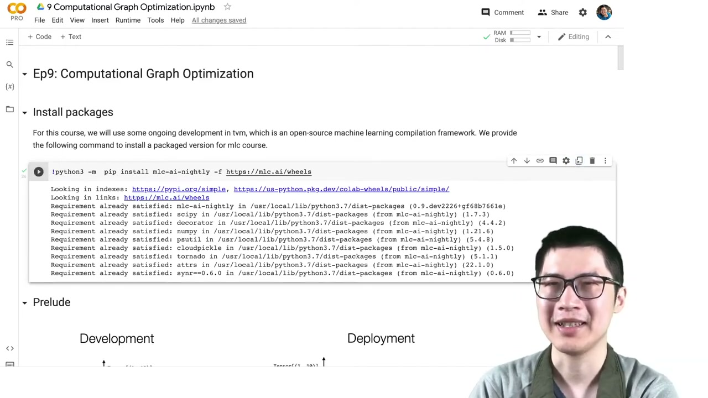

Primitive schedules optimize one tensor function; graph optimization changes how functions are connected. Relax makes model dataflow explicit so passes can recognize algebraic patterns, fuse operators, remove intermediates, and form new primitive regions before low-level code generation.

### Slide 2 — Relax function data structures ([00:02:10](https://www.youtube.com/watch?v=dfL0EoI6T_4&t=130s))

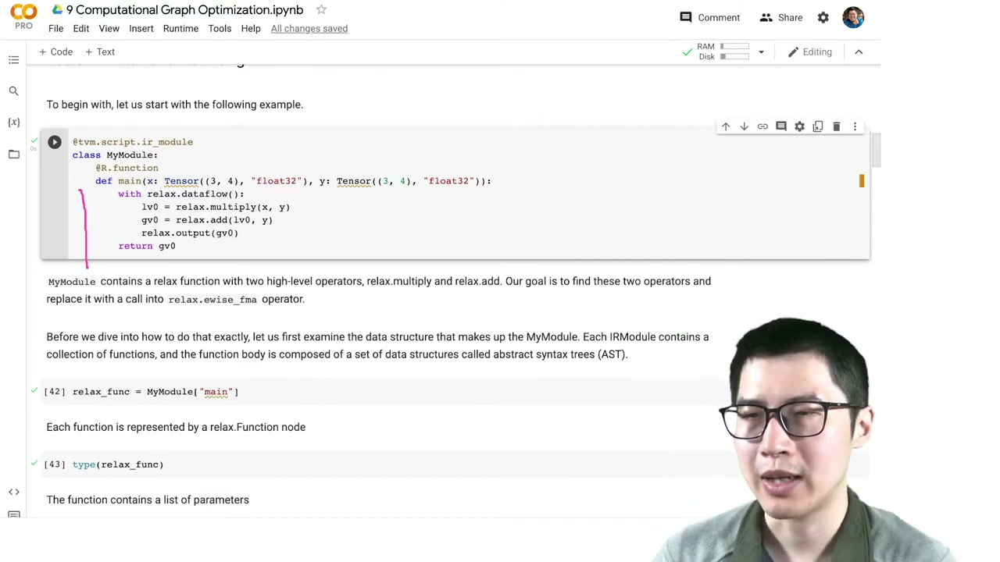

A Relax function has parameters and a body. The body commonly contains a sequence expression with binding blocks; dataflow blocks contain side-effect-free value bindings. Each binding has a variable on the left and an expression—often a call—on the right.

This structured AST is the object traversed by optimization passes.

### Slide 3 — Bindings form a dataflow graph ([00:03:00](https://www.youtube.com/watch?v=dfL0EoI6T_4&t=180s))

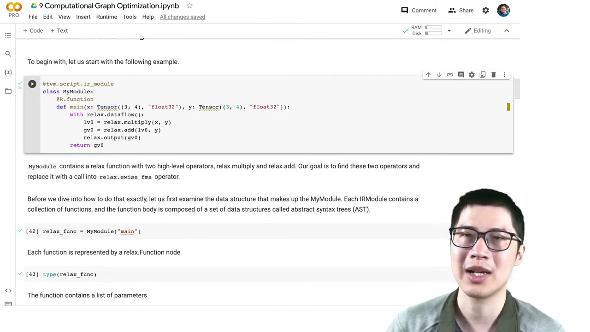

Bindings such as

```python
lv0 = R.multiply(x, y)
gv0 = R.add(lv0, y)
R.output(gv0)
```

represent nodes and edges in a DAG. Variables name intermediate results, and uses of those variables encode dependencies. Relax normal form makes each intermediate explicit, simplifying analysis and rewrites.

### Slide 4 — Fused multiply-add opportunity ([00:05:00](https://www.youtube.com/watch?v=dfL0EoI6T_4&t=300s))

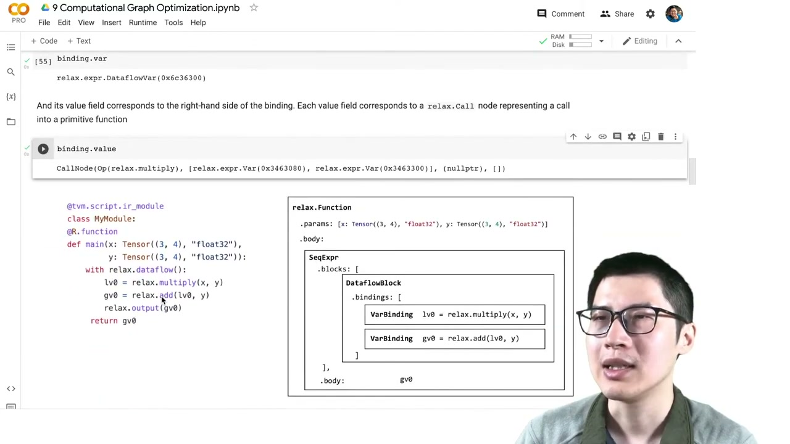

The two bindings compute

$$
z=x\times y+y.
$$

If the target supports or benefits from an FMA operation, the graph can replace multiply followed by add with `R.ewise_fma(x, y, y)` or the corresponding Relax FMA operator. Fusion can reduce launches/intermediates and expose a hardware primitive.

The rewrite must verify operation semantics, dtypes, broadcasting, and use constraints.

### Slide 5 — Expression visitors and mutators ([00:08:00](https://www.youtube.com/watch?v=dfL0EoI6T_4&t=480s))

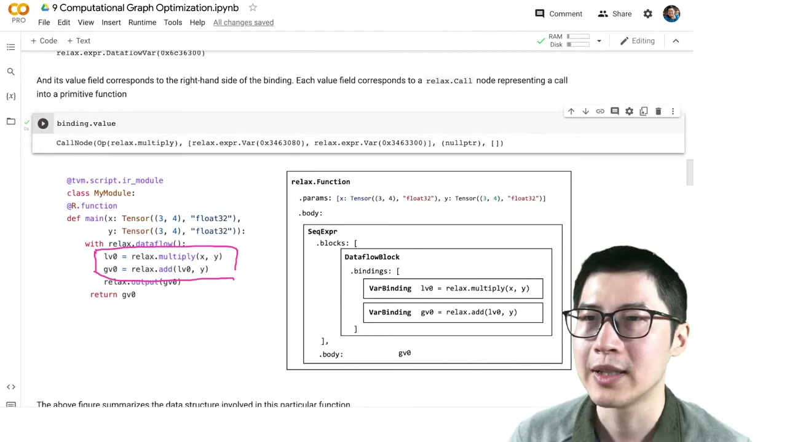

An expression visitor traverses IR nodes to inspect or collect information. An expression mutator recursively visits children and returns replacement nodes. Overriding call- or binding-specific methods localizes rewrite logic while the base class handles recursion and reconstruction.

### Slide 6 — Implement the FMA matcher ([00:11:00](https://www.youtube.com/watch?v=dfL0EoI6T_4&t=660s))

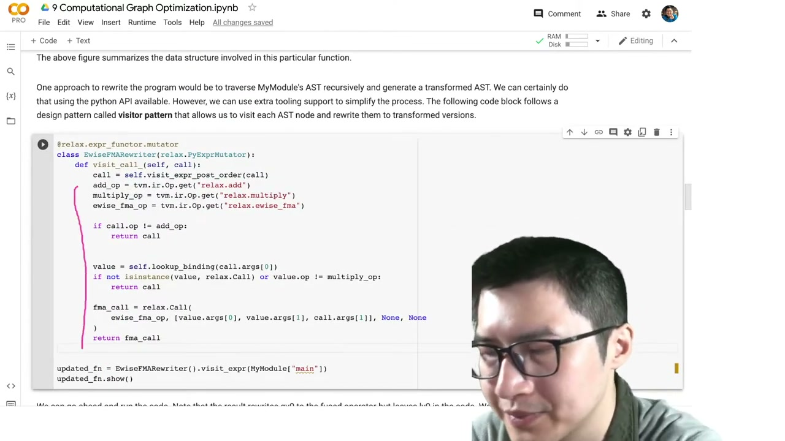

The matcher checks whether a call is `add`, identifies an argument bound to another variable, looks up that binding, and checks whether its value is `multiply`. On success it constructs an FMA call from the multiply operands and the other add operand; otherwise it preserves the original call.

Matching by operator identity and binding structure is safer than matching printed variable names.

### Slide 7 — Normal form and binding lookup ([00:13:00](https://www.youtube.com/watch?v=dfL0EoI6T_4&t=780s))

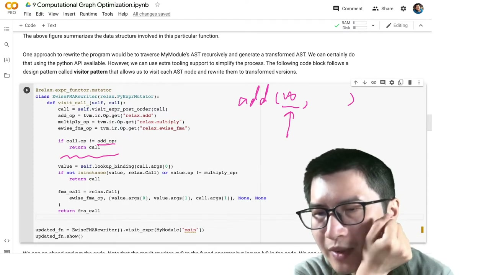

Because primitive call inputs are normally variables, a multi-node pattern requires resolving each variable to its defining expression. A binding environment maps variables to values within the current scope. The mutator uses this environment to follow graph edges backward from add to multiply.

Dominance, scope, and multiple uses still matter: a producer used elsewhere may not be removable even if one consumer is fused.

### Slide 8 — Rewrite and dead-code cleanup ([00:15:00](https://www.youtube.com/watch?v=dfL0EoI6T_4&t=900s))

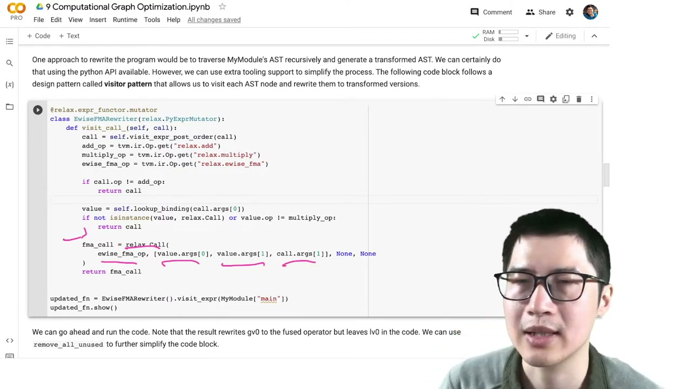

After replacing the add, the old multiply binding may become unused. A dead-binding elimination pass removes it. Graph optimization therefore commonly follows the sequence:

$$
match\rightarrow rewrite\rightarrow canonicalize\rightarrow eliminate\ dead\ code.
$$

Cleanup should occur after matching has consumed the original dependency structure.

## Dense-plus-bias fusion

### Slide 9 — Fashion-MNIST model pattern ([00:17:00](https://www.youtube.com/watch?v=dfL0EoI6T_4&t=1020s))

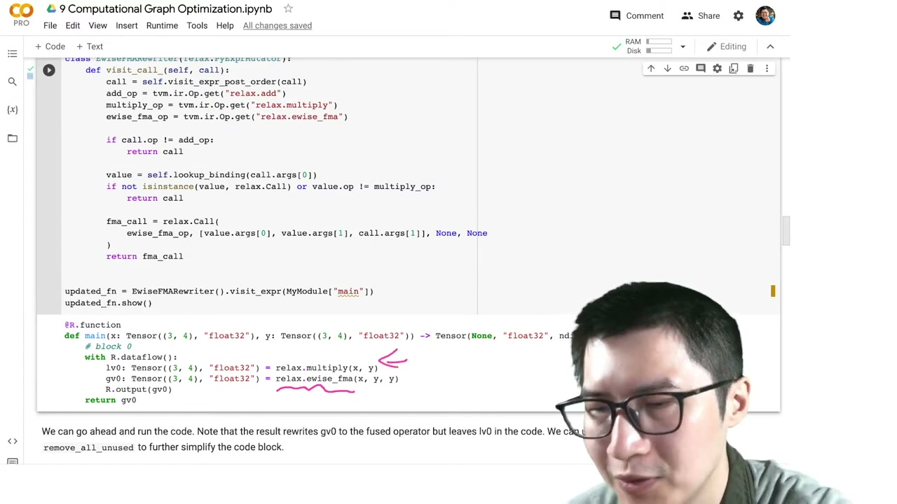

The end-to-end model from Episode 4 contains dense operations followed by bias addition, with ReLU between layers. Dense-plus-bias is a common practical fusion target because the bias can be applied while the output tile is still local, avoiding a separate graph operation and intermediate traversal.

### Slide 10 — Why create primitive sub-functions? ([00:19:00](https://www.youtube.com/watch?v=dfL0EoI6T_4&t=1140s))

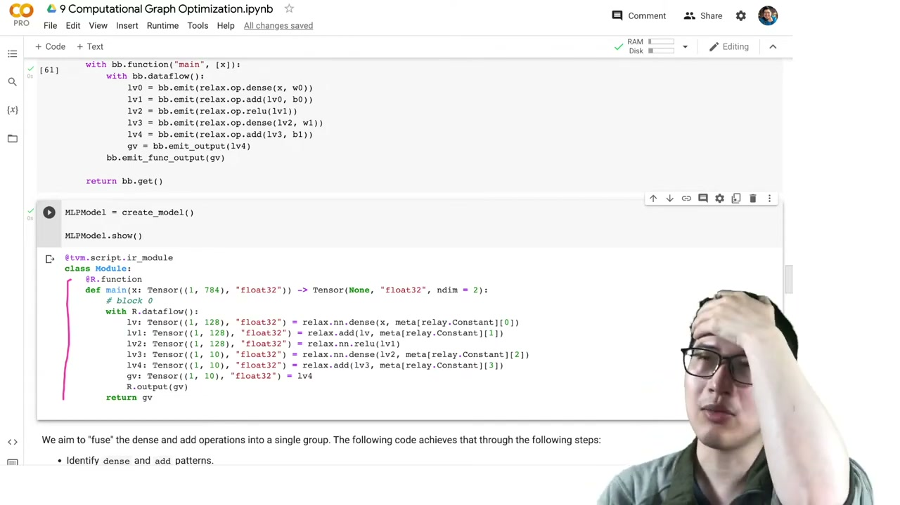

Defining a distinct global operator for every possible fusion combination would create an unmanageable operator vocabulary. Instead, Relax groups the matched region into a generated sub-function and replaces the original nodes with a call to that function.

The sub-function preserves a compositional graph representation while marking a candidate primitive compilation unit.

### Slide 11 — Build a fused function ([00:21:00](https://www.youtube.com/watch?v=dfL0EoI6T_4&t=1260s))

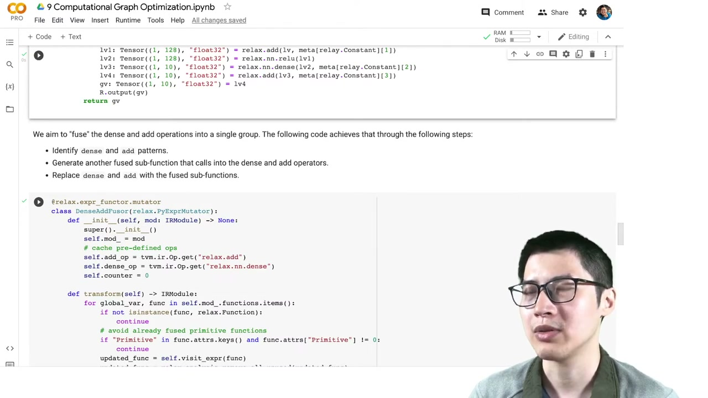

A BlockBuilder creates parameters for the external inputs of the matched region, emits dense and add bindings inside a new function, marks the output, and adds the function to the IRModule under a unique name. The original graph is rewritten to call this global function with captured inputs.

### Slide 12 — Package the rewrite as a pass ([00:23:00](https://www.youtube.com/watch?v=dfL0EoI6T_4&t=1380s))

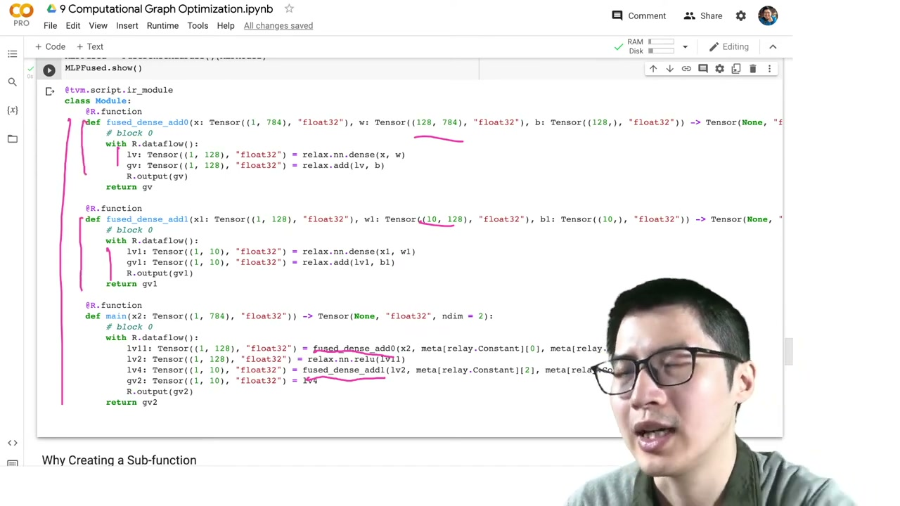

The transformation is wrapped as an IR/module or function pass so it can be invoked, composed, configured through a pass context, and tested independently. Pass-based architecture separates transformation policy from notebook driver code and establishes a reproducible pipeline.

### Slide 13 — Primitive function attribute ([00:25:00](https://www.youtube.com/watch?v=dfL0EoI6T_4&t=1500s))

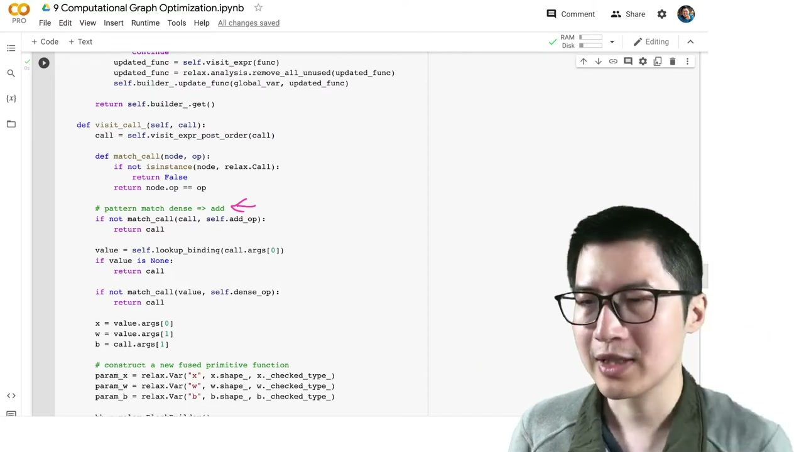

The generated function receives a `Primitive`-style attribute by convention. Downstream passes treat it as one fusion group that should be lowered as a unit rather than inlined back into the high-level graph. Attributes carry compiler intent without changing tensor semantics.

### Slide 14 — Lower fused groups ([00:27:00](https://www.youtube.com/watch?v=dfL0EoI6T_4&t=1620s))

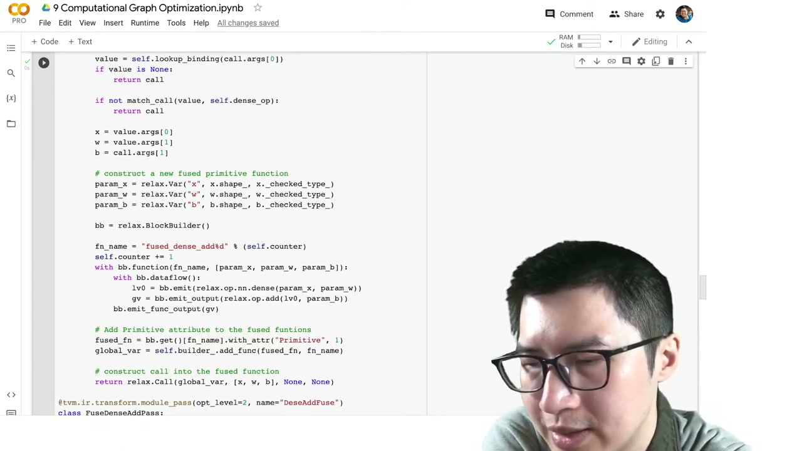

Fusion alone does not make executable code. A primitive Relax function must map to an implementation. Possible paths include:

1. dispatch to an optimized library pattern;
2. generate a TensorIR function and schedule it;
3. invoke an external backend/compiler.

Graph fusion chooses the region; primitive lowering chooses how that region runs.

### Slide 15 — Traverse and remap expressions ([00:29:00](https://www.youtube.com/watch?v=dfL0EoI6T_4&t=1740s))

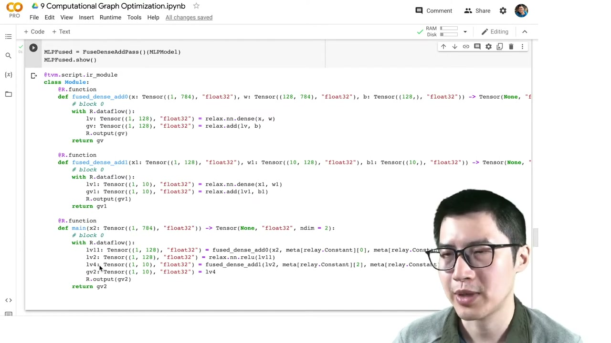

A lowering mutator walks the fused function, translates supported high-level calls, and records old-to-new expression mappings. As with framework import, each operation has a handler that creates target-level expressions while preserving dependency order and types.

### Slide 16 — Dispatch by operation ([00:31:00](https://www.youtube.com/watch?v=dfL0EoI6T_4&t=1860s))

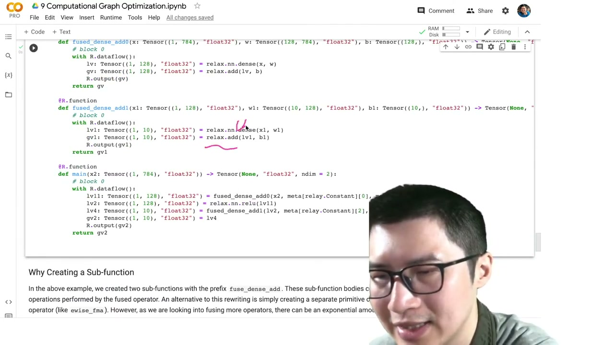

Call nodes are inspected by operator. Dense and add handlers extract translated arguments and either construct TE computations, library calls, or lower-level nodes. Unsupported operations must remain explicit errors or fallbacks; silently approximating framework semantics would invalidate the model.

### Slide 17 — Extract fused inputs ([00:33:00](https://www.youtube.com/watch?v=dfL0EoI6T_4&t=1980s))

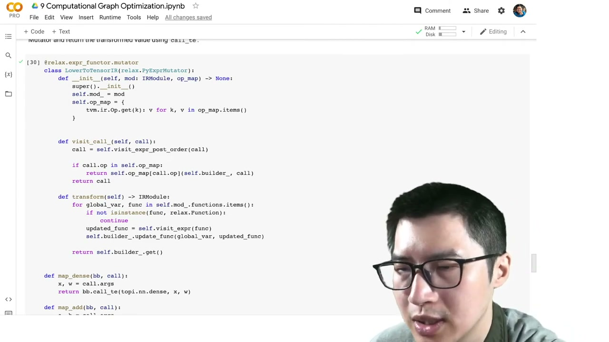

The matcher collects values entering the dense-plus-bias region—data, weight, and bias—and creates corresponding sub-function parameters. Internal values remain local. This boundary analysis is essential: missing an external dependency or exposing an internal temporary changes function semantics.

### Slide 18 — Finalize and remove unused bindings ([00:35:00](https://www.youtube.com/watch?v=dfL0EoI6T_4&t=2100s))

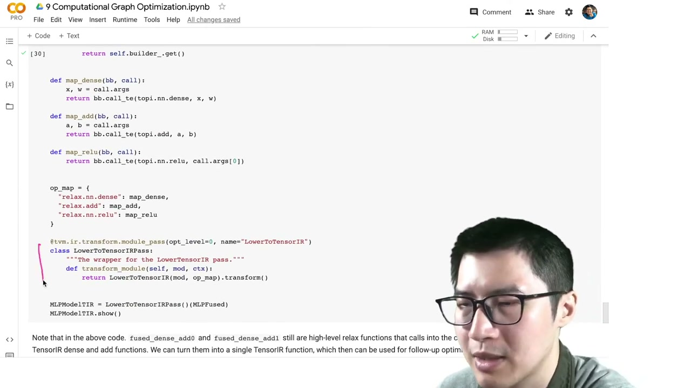

After calls are replaced, old dense/add bindings can be removed if no other users remain. The builder finalizes newly generated functions and the transformed main function, then analysis/cleanup passes restore a compact normal form.

### Slide 19 — Shape-specialized fused functions ([00:37:00](https://www.youtube.com/watch?v=dfL0EoI6T_4&t=2220s))

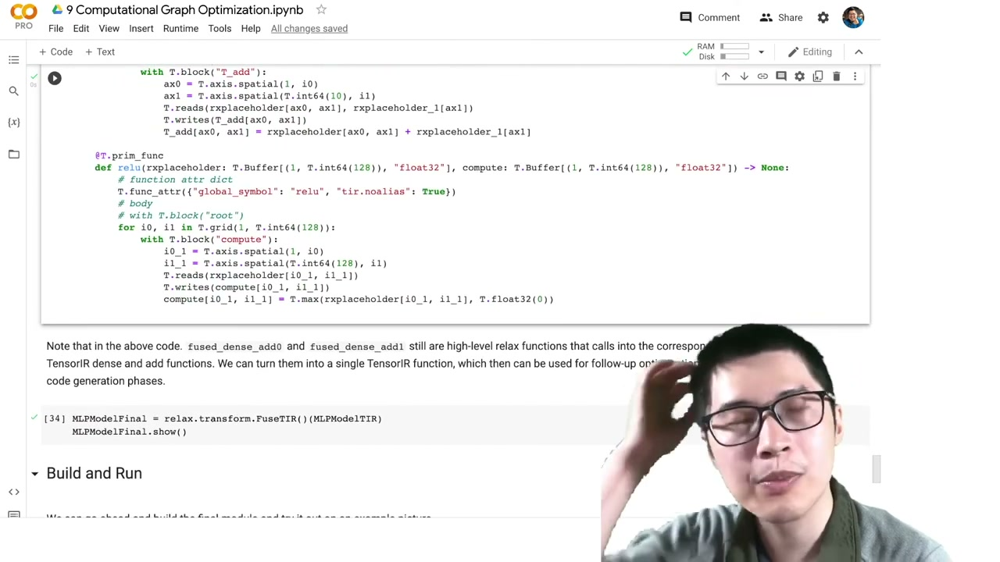

Each generated dense-add function can carry concrete tensor shapes and dtypes from its call site. Shape specialization helps low-level scheduling and library selection, but may create several compiled variants when the model uses different dimensions.

Caching or deduplicating equivalent fusion groups avoids unnecessary code growth.

## Optimization pipeline and verification

### Slide 20 — Graph fusion versus low-level optimization ([00:39:00](https://www.youtube.com/watch?v=dfL0EoI6T_4&t=2340s))

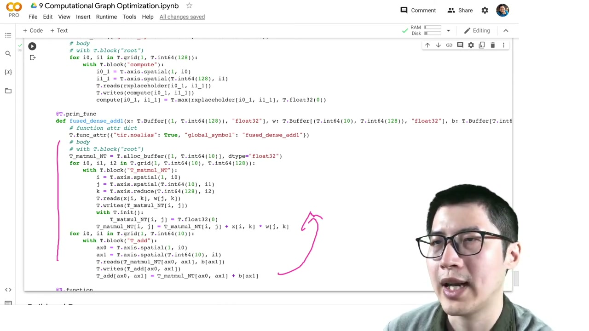

Graph fusion changes primitive boundaries and removes graph-level intermediates. TensorIR scheduling then tiles, vectorizes, parallelizes, or tensorizes each primitive. These levels are complementary: fusion can expose a larger optimization unit, while low-level scheduling maps it efficiently to hardware.

### Slide 21 — Fashion-MNIST transformed module ([00:41:00](https://www.youtube.com/watch?v=dfL0EoI6T_4&t=2460s))

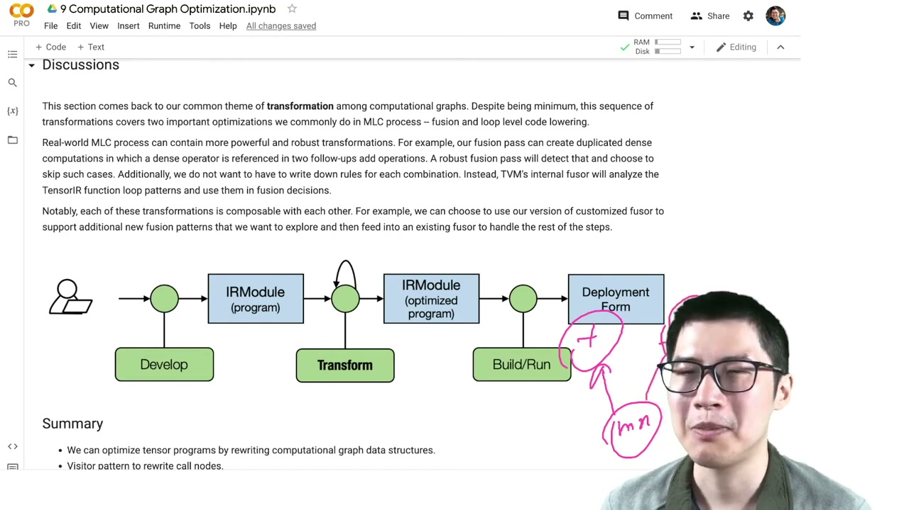

The transformed model replaces dense-plus-bias chains with calls to generated primitive functions while preserving ReLU and model output dependencies. Building and running the module with the original parameters/input should reproduce the same logits and predicted class.

Verification checks both graph rewrite correctness and the chosen primitive implementations.

### Slide 22 — Summary ([00:43:00](https://www.youtube.com/watch?v=dfL0EoI6T_4&t=2580s))

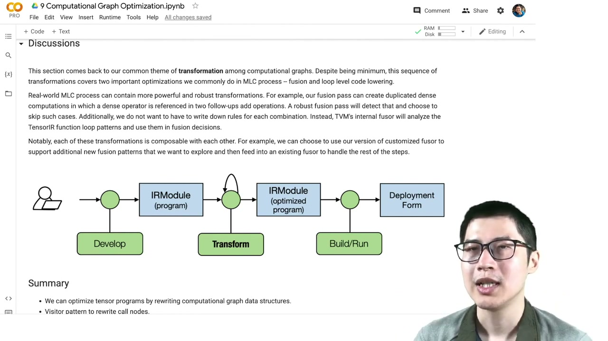

Computational graph optimization is structured IR rewriting. Relax normal form and dataflow blocks make dependencies explicit; visitors and binding lookup recognize patterns; BlockBuilder creates fused sub-functions; pass infrastructure composes rewrites; lowering maps primitive groups to libraries or TensorIR.

## Key takeaways

1. Relax graph optimization operates on functions, blocks, bindings, variables, and calls.
2. Normal form makes intermediate dependencies explicit and matchable.
3. Visitors inspect IR; mutators return transformed IR.
4. Multi-node patterns require binding lookup, not only local call inspection.
5. FMA fusion replaces multiply-plus-add when semantics permit.
6. Dead-code elimination removes obsolete producer bindings after rewrite.
7. Real model patterns include dense-plus-bias and dense-plus-bias-plus-activation.
8. Fusion groups are represented as generated sub-functions rather than new global op types.
9. BlockBuilder constructs sub-functions and inserts calls into the parent graph.
10. Primitive attributes mark regions for downstream lowering.
11. Passes package transformations into composable compiler stages.
12. Fusion boundary analysis must capture every external input and output.
13. Shape-specialized groups improve optimization but can increase variant count.
14. Graph fusion and TensorIR scheduling solve different levels of the stack.
15. Primitive groups can lower to libraries, generated TensorIR, or external backends.
16. Every graph rewrite and lowered implementation must be verified against original model outputs.