# GPU and Specialized Hardware, Part 1 - Episode 7

**Course:** Machine Learning Compilation, Summer 2022  
**Instructor:** Tianqi Chen  
**Video:** [YouTube lecture](https://www.youtube.com/watch?v=CSMcOzv5Bhw) (39:02)

This episode introduces GPU execution and memory hierarchy through TensorIR schedules. It progresses from vector addition to a shared-memory window sum and then to a tiled matrix multiplication using block, thread, register, and shared-memory reuse.

## GPU execution model

### Slide 1 — GPU acceleration setup ([00:00:05](https://www.youtube.com/watch?v=CSMcOzv5Bhw&t=5s))

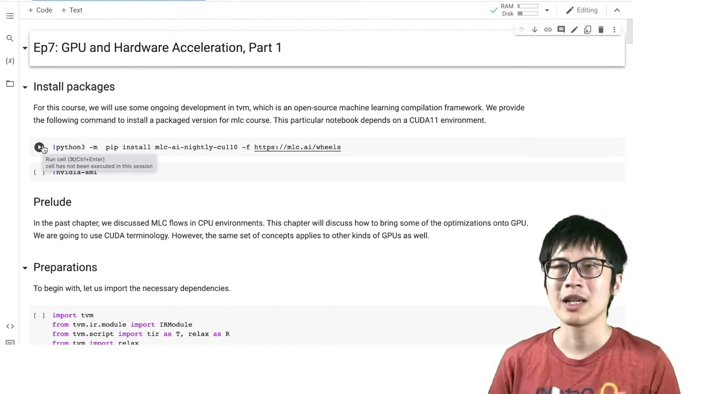

The lecture begins a two-part hardware-acceleration unit. Part 1 targets a CUDA-capable GPU and focuses on thread binding and memory hierarchy; Part 2 extends the same TensorIR ideas to specialized matrix/tensor instructions.

### Slide 2 — CPU and GPU parallelism ([00:01:05](https://www.youtube.com/watch?v=CSMcOzv5Bhw&t=65s))

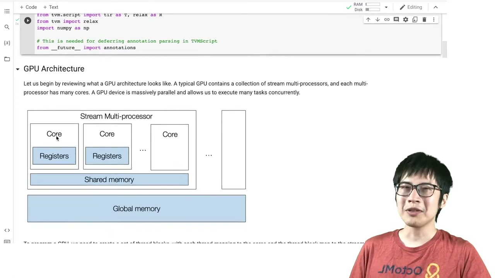

CPUs devote substantial hardware to a few latency-optimized cores, while GPUs use many simpler execution lanes to maximize throughput. ML tensor programs often expose enough regular parallel work to occupy those lanes, provided the compiler maps loops and memory accesses appropriately.

### Slide 3 — GPU memory and multiprocessors ([00:01:47](https://www.youtube.com/watch?v=CSMcOzv5Bhw&t=107s))

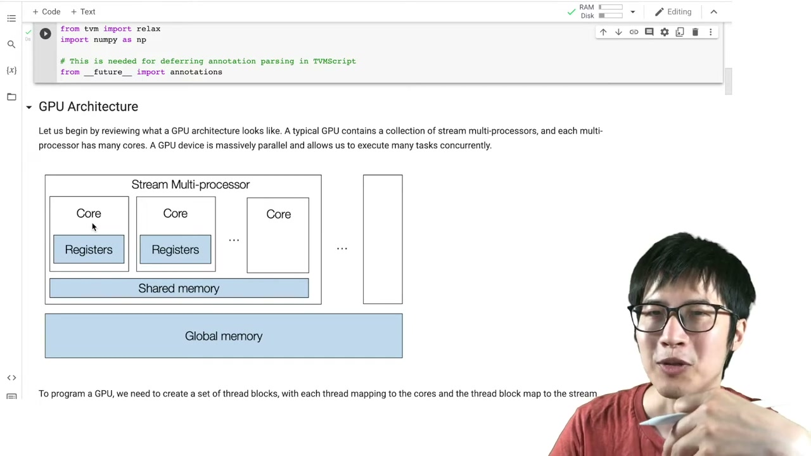

The simplified GPU has global device memory and several streaming multiprocessors. Each multiprocessor contains execution lanes, registers/private state, and on-chip shared memory accessible by threads in one block. Global memory is large and off-chip; shared memory and registers are small but support reuse at much lower access cost.

### Slide 4 — Threads and blocks ([00:03:01](https://www.youtube.com/watch?v=CSMcOzv5Bhw&t=181s))

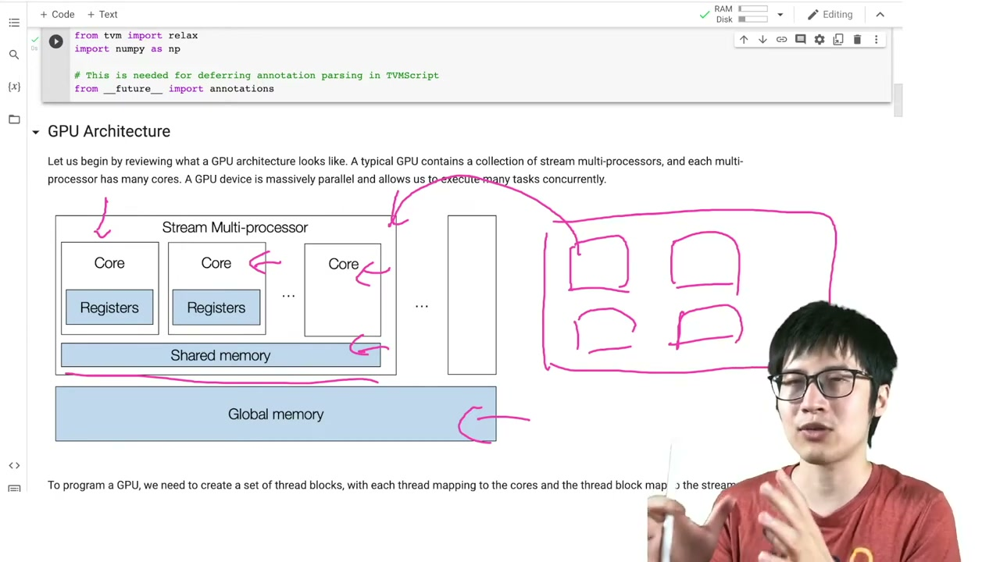

A GPU kernel launches many threads. Threads are grouped into blocks; a block is scheduled on one multiprocessor, so its threads can cooperate through shared memory and barriers. Blocks must remain largely independent so the device can run them in any order or concurrently.

### Slide 5 — Bind vector addition to the GPU ([00:05:22](https://www.youtube.com/watch?v=CSMcOzv5Bhw&t=322s))

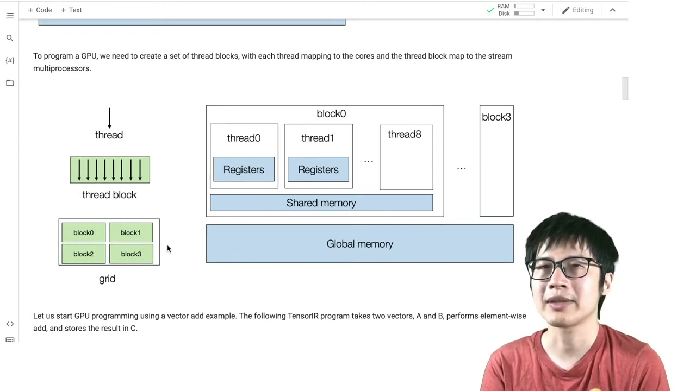

For $C[i]=A[i]+B[i]$, split the one-dimensional loop and bind its parts:

```python
bx, tx = sch.split(i, factors=[None, threads_per_block])
sch.bind(bx, "blockIdx.x")
sch.bind(tx, "threadIdx.x")
```

The reconstructed global index is

$$
i=blockIdx.x\times threadsPerBlock+threadIdx.x.
$$

Each thread computes one independent element.

### Slide 6 — Build and launch a CUDA kernel ([00:08:40](https://www.youtube.com/watch?v=CSMcOzv5Bhw&t=520s))

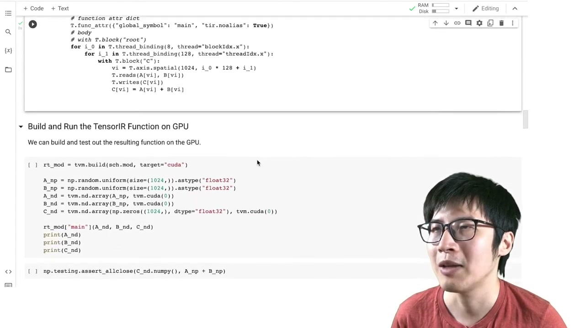

Building with a CUDA target produces host-facing module metadata and device kernel code. Inputs and outputs are allocated on the CUDA device, the generated function launches the kernel, and results are copied back when requested. The Python call interface resembles CPU execution even though storage and execution occur on another device.

### Slide 7 — Validate vector-add output ([00:09:32](https://www.youtube.com/watch?v=CSMcOzv5Bhw&t=572s))

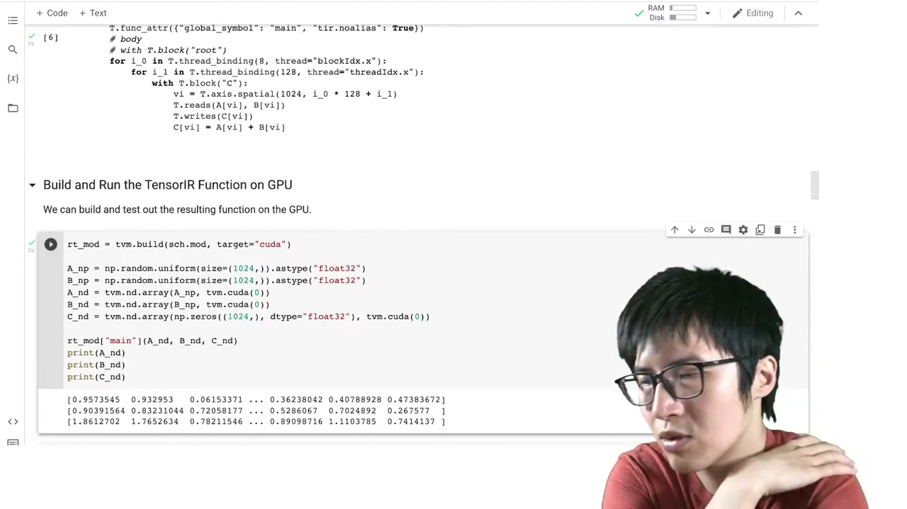

The GPU result is compared with NumPy to confirm correctness. This build–run–validate cycle is repeated after every schedule transformation; GPU parallelism cannot justify a result that changes semantics or races.

## Shared memory and cooperative fetching

### Slide 8 — Sliding-window reuse ([00:10:47](https://www.youtube.com/watch?v=CSMcOzv5Bhw&t=647s))

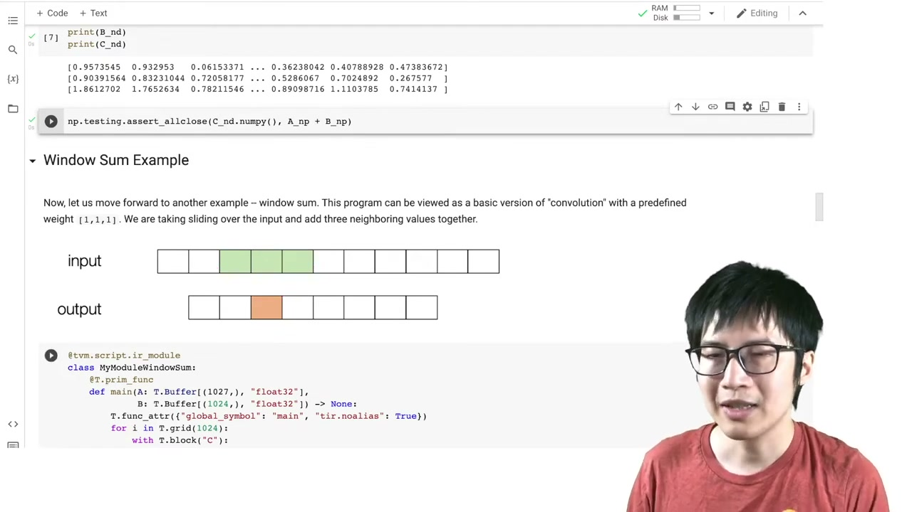

A window sum reads several adjacent input elements per output. Neighboring output threads request overlapping windows, so a naive kernel repeatedly loads the same global-memory elements. The arithmetic is cheap; redundant memory traffic dominates.

### Slide 9 — Stage data in shared memory ([00:11:41](https://www.youtube.com/watch?v=CSMcOzv5Bhw&t=701s))

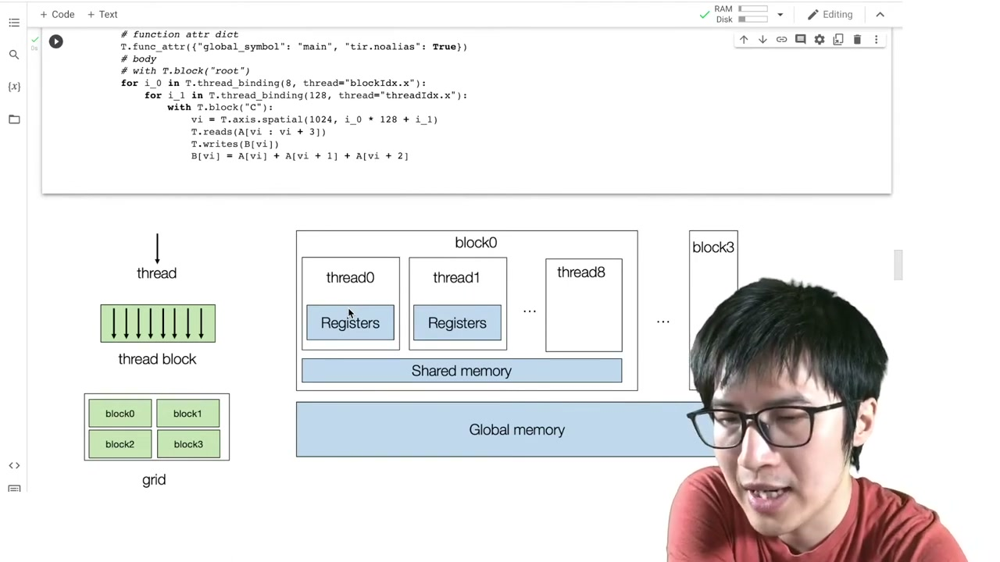

`cache_read` creates a shared-memory copy consumed by the output block:

```python
A_shared = sch.cache_read(block, read_buffer_index=0, storage_scope="shared")
sch.compute_at(A_shared, bx)
```

Each block fetches the union of its threads' windows once, then threads reuse that on-chip tile. Shared memory changes the source of inner reads but does not alter the tensor function.

### Slide 10 — Place and synchronize shared data ([00:12:29](https://www.youtube.com/watch?v=CSMcOzv5Bhw&t=749s))

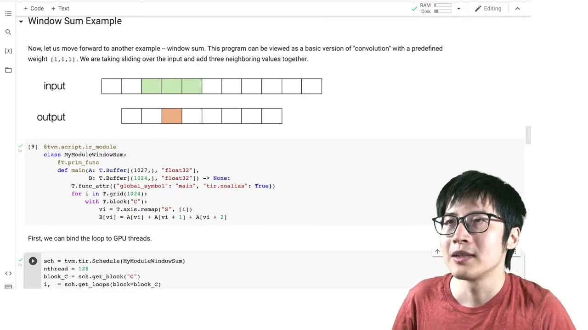

Placing the cache stage inside the block loop gives each block its own shared allocation. All participating threads must finish loading before any consumes the tile; generated GPU code inserts a block-level synchronization where required. Correct placement is therefore both a locality and ordering decision.

### Slide 11 — Cooperative fetching ([00:18:32](https://www.youtube.com/watch?v=CSMcOzv5Bhw&t=1112s))

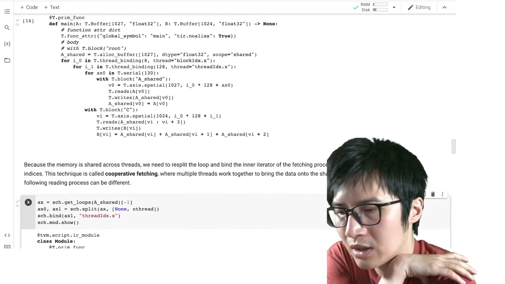

The shared-load loops are fused or flattened, split by the block's thread count, and bound to `threadIdx.x`. Each thread loads a subset:

```python
fetch = sch.get_loops(A_shared)[-1]
fo, fi = sch.split(fetch, factors=[None, threads_per_block])
sch.bind(fi, "threadIdx.x")
```

Collectively, the block fills the tile in parallel instead of assigning all copies to one thread.

### Slide 12 — Inspect generated CUDA ([00:19:00](https://www.youtube.com/watch?v=CSMcOzv5Bhw&t=1140s))

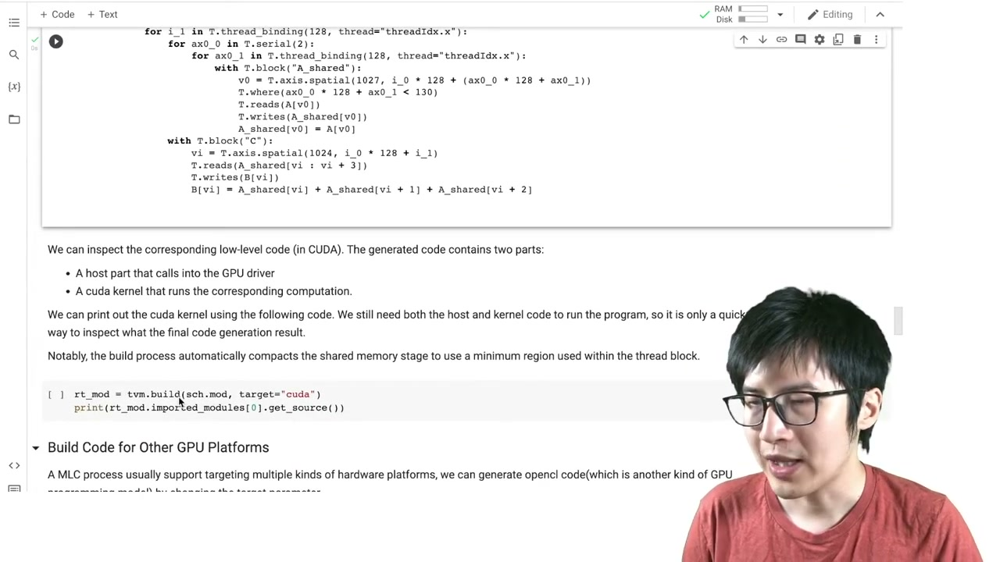

The generated kernel reveals `__shared__` storage, thread-indexed load addresses, a synchronization barrier, and reads from the staged tile. Inspecting backend code verifies that high-level schedule primitives map to the expected GPU mechanisms.

### Slide 13 — Backend portability ([00:22:02](https://www.youtube.com/watch?v=CSMcOzv5Bhw&t=1322s))

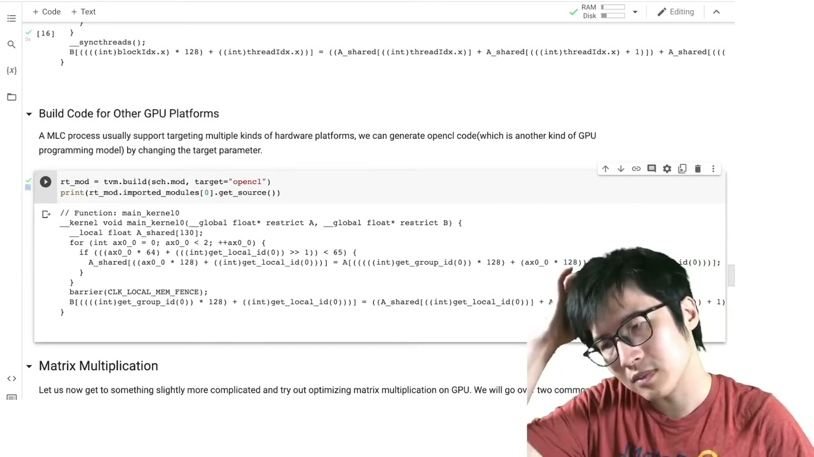

The same scheduled TensorIR can target CUDA, OpenCL, or Metal when the schedule uses supported concepts. Thread axes and memory scopes lower to backend-specific syntax. Portability is not automatic performance portability—legal limits, warp/wave size, memory banks, and optimal tile sizes still differ.

## Tiled matrix multiplication

### Slide 14 — Matrix multiplication baseline ([00:23:11](https://www.youtube.com/watch?v=CSMcOzv5Bhw&t=1391s))

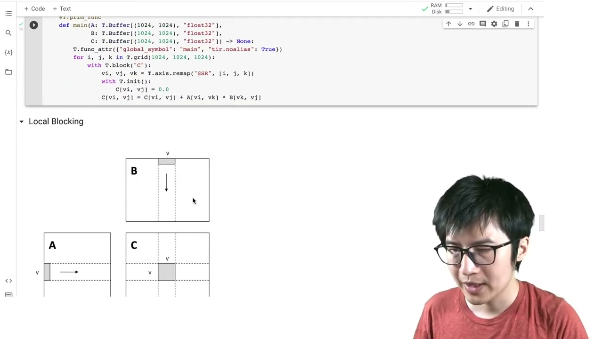

The second case study computes

$$
C_{ij}=\sum_k A_{ik}B_{kj}.
$$

A naive GPU mapping assigns outputs to threads but repeatedly fetches $A$ and $B$ from global memory. GEMM's performance comes from reusing input tiles across many multiply-accumulate operations.

### Slide 15 — Register blocking ([00:24:27](https://www.youtube.com/watch?v=CSMcOzv5Bhw&t=1467s))

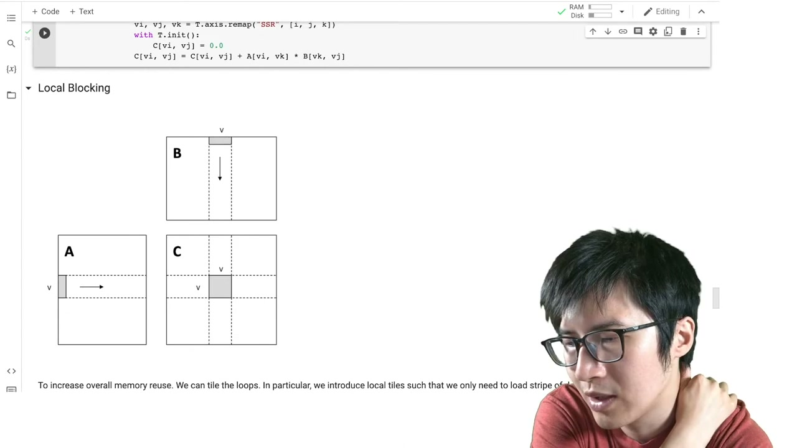

One thread can compute a small $v_i\times v_j$ output tile instead of one scalar. Values loaded from an $A$ row fragment and $B$ column fragment contribute to several accumulator elements, increasing arithmetic per load. Accumulators live in registers through a `local` cache-write stage.

Larger register tiles improve reuse but increase register pressure and may reduce occupancy.

### Slide 16 — Block, thread, and register tiling ([00:26:51](https://www.youtube.com/watch?v=CSMcOzv5Bhw&t=1611s))

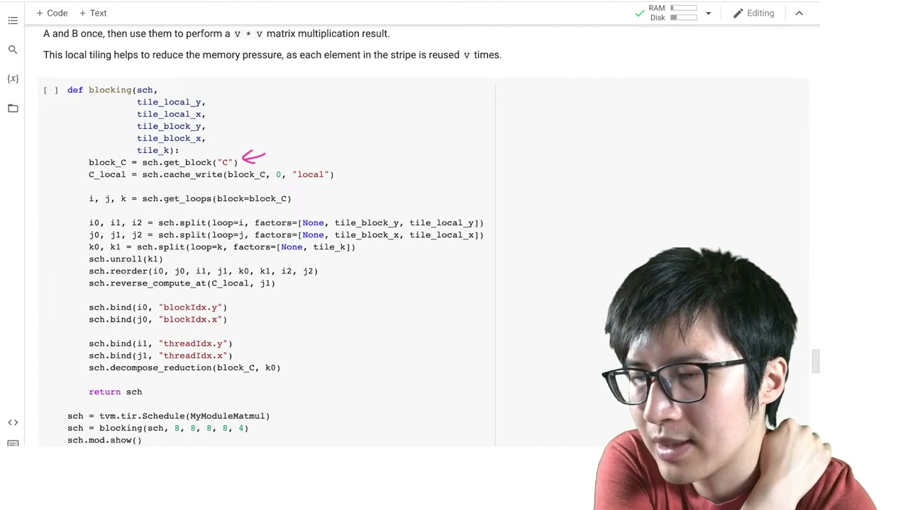

Output axes are split into levels:

1. outer tiles bind to `blockIdx.x/y`,
2. middle tiles bind to `threadIdx.x/y`,
3. inner tiles remain serial/register-local.

The reduction axis is also tiled so each $k$ tile's inputs can be staged and reused before moving to the next. Loop reorder establishes the desired hierarchy.

### Slide 17 — Local accumulator cache ([00:28:04](https://www.youtube.com/watch?v=CSMcOzv5Bhw&t=1684s))

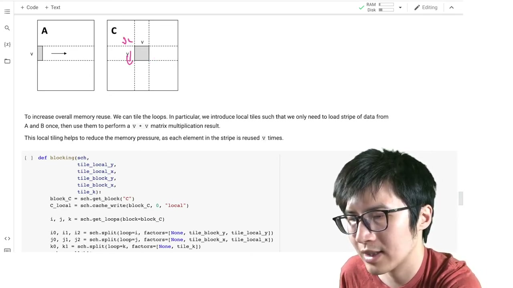

`cache_write(..., "local")` creates a private accumulator stage. `reverse_compute_at` or related placement puts the final global write at the chosen loop level, while the reduction updates local values. After the reduction completes, each thread writes its tile to global memory once.

### Slide 18 — Measure GEMM throughput ([00:30:23](https://www.youtube.com/watch?v=CSMcOzv5Bhw&t=1823s))

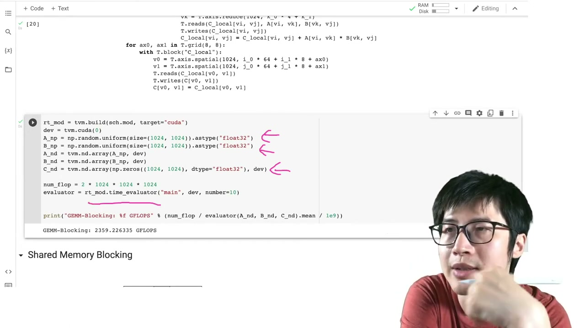

The notebook builds, validates, and benchmarks the kernel. GEMM work is approximately

$$
FLOPs=2MNK,
$$

counting multiply and add separately. Throughput is $2MNK/t$. The measured result demonstrates a substantial gain from hierarchy-aware scheduling, but the absolute number is specific to the GPU, dimensions, precision, and timing method.

### Slide 19 — Shared-memory blocking for GEMM ([00:31:42](https://www.youtube.com/watch?v=CSMcOzv5Bhw&t=1902s))

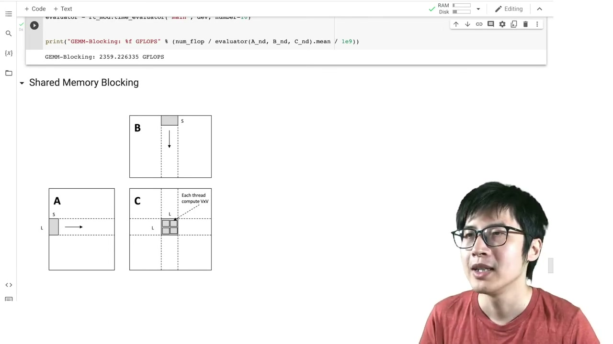

Shared-memory caches for $A$ and $B$ are computed at the reduction-tile loop. Threads in one block cooperatively load an input tile, synchronize, and repeatedly use those values for their register accumulators. This creates the classic hierarchy:

$$
Global\rightarrow Shared\rightarrow Registers\rightarrow Accumulators.
$$

### Slide 20 — Vectorized cooperative loads ([00:35:02](https://www.youtube.com/watch?v=CSMcOzv5Bhw&t=2102s))

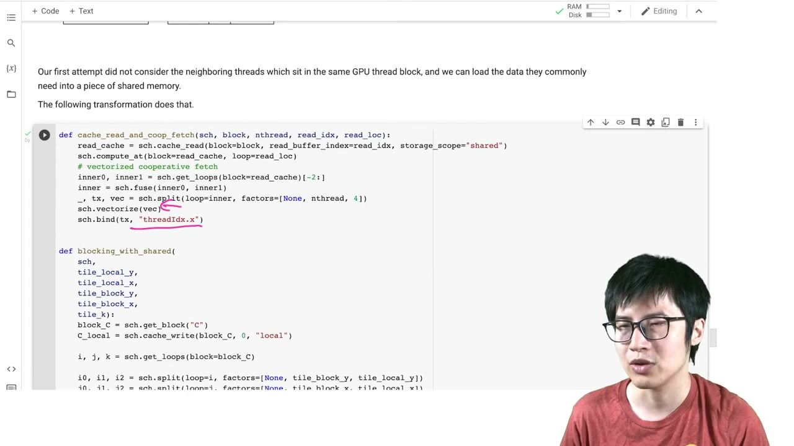

For contiguous and aligned addresses, the cooperative-fetch loop can be split again and its innermost factor vectorized. Each thread issues a wider load/store, reducing instruction overhead and helping memory transactions coalesce. Vectorization is legal only when layout, alignment, extent, and target support agree.

### Slide 21 — Automatic schedule search ([00:36:48](https://www.youtube.com/watch?v=CSMcOzv5Bhw&t=2208s))

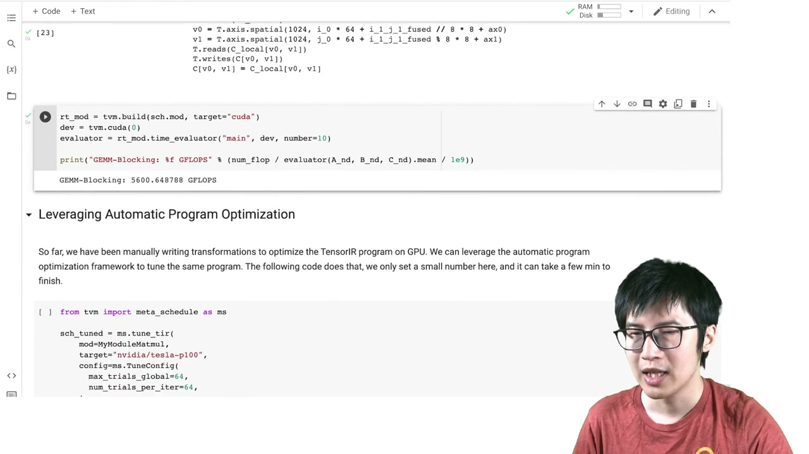

Block sizes, thread tiles, register tiles, reduction tiles, cooperative-fetch factors, and vector widths form a large target-dependent search space. MetaSchedule can encode these choices stochastically and measure candidates on the GPU, complementing the hand-developed schedule shown in the lecture.

### Slide 22 — Summary ([00:37:42](https://www.youtube.com/watch?v=CSMcOzv5Bhw&t=2262s))

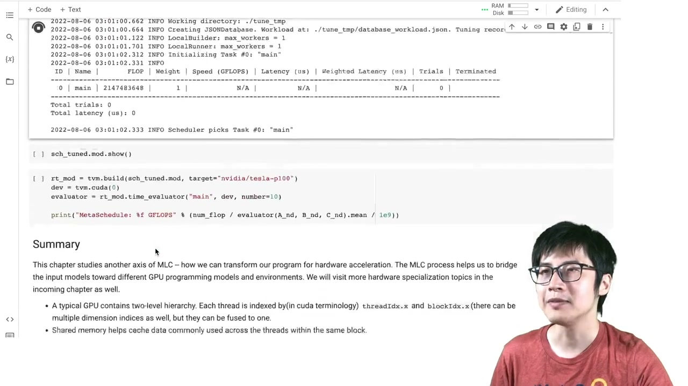

High-performance GPU TensorIR schedules map loops to the hardware hierarchy and stage data through progressively faster memory. The core techniques are thread/block binding, register blocking, shared-memory blocking, cooperative fetching, synchronization, and vectorized loads. Part 2 extends these ideas to tensorized specialized instructions.

## Key takeaways

1. GPU throughput comes from many concurrent threads and regular parallel work.
2. Blocks map to multiprocessors and share on-chip memory.
3. `sch.bind` maps implementation loops to GPU block/thread axes.
4. Device arrays and target-specific builds are required for GPU execution.
5. Shared memory eliminates redundant global loads across threads in one block.
6. `cache_read` and `compute_at` place staged data in the loop hierarchy.
7. Cooperative fetching distributes tile loading across block threads.
8. Barriers separate shared-memory production from consumption.
9. One TensorIR schedule may lower to multiple GPU APIs, but tuning remains target-specific.
10. Register blocking lets one thread reuse inputs across several outputs.
11. Multi-level tiling maps work to blocks, threads, and per-thread serial loops.
12. `cache_write(..., "local")` keeps accumulators private until final writeback.
13. Shared-memory GEMM tiles reuse inputs across many thread-local multiply-accumulates.
14. GEMM operation count is approximately $2MNK$ FLOPs.
15. Vectorized loads require contiguous, aligned, target-supported access patterns.
16. Tile sizes trade locality against shared-memory use, register pressure, and occupancy.
17. Automated search is valuable because optimal GPU schedules are hardware-dependent.