# GPU and Specialized Hardware, Part 2 - Episode 8

**Course:** Machine Learning Compilation, Summer 2022  
**Instructor:** Tianqi Chen  
**Video:** [YouTube lecture](https://www.youtube.com/watch?v=V1d4F3-AAfc) (37:54)

This episode studies common compilation patterns for specialized tensor accelerators. A hypothetical accelerator makes data movement, memory scopes, matrix instructions, blockization, and tensor intrinsics concrete without tying the discussion to one proprietary device.

## Why specialized hardware changes compilation

### Slide 1 — Hardware specialization trend ([00:00:05](https://www.youtube.com/watch?v=V1d4F3-AAfc&t=5s))

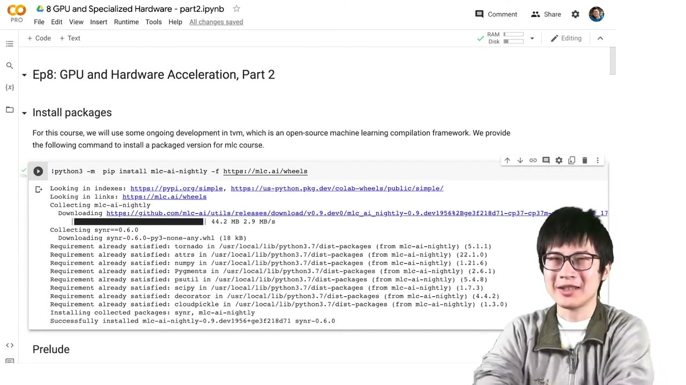

Computing has progressed from scalar instructions to vector units and increasingly to domain-specific matrix/tensor engines. ML workloads motivate hardware that executes larger structured operations than a conventional scalar core, requiring compilers to expose matching computation and data movement.

### Slide 2 — Specialized ML accelerators ([00:00:53](https://www.youtube.com/watch?v=V1d4F3-AAfc&t=53s))

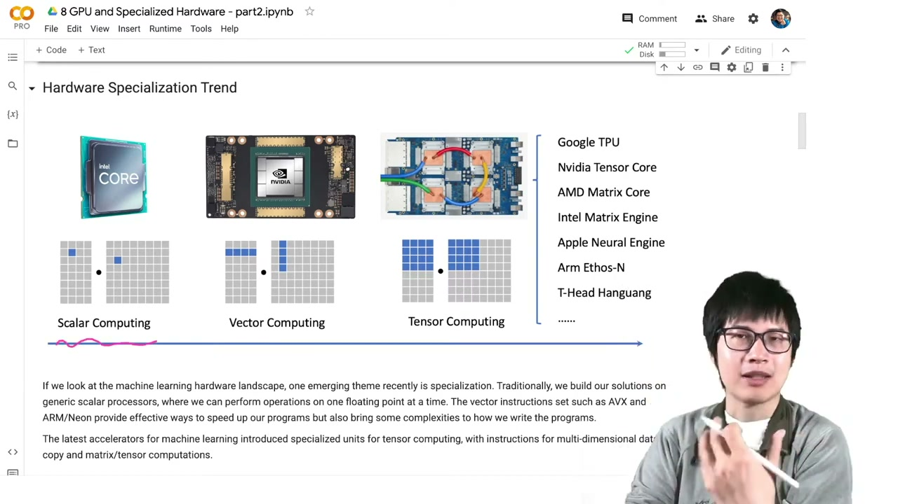

Examples include Google's TPU, NVIDIA Tensor Cores, AMD matrix engines, and CPU matrix extensions. Each combines specific instruction shapes, numeric types, memory resources, and transfer mechanisms. “Tensor computing” means that a matrix tile or another region—not one scalar—is the unit of an instruction.

### Slide 3 — Bulk tensor operations ([00:02:00](https://www.youtube.com/watch?v=V1d4F3-AAfc&t=120s))

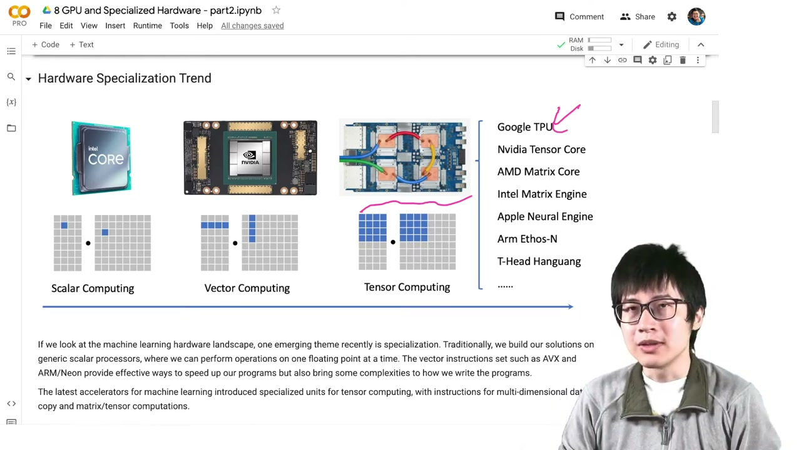

Specialized code typically moves tiles in bulk into dedicated storage, performs matrix multiply-accumulate or similar operations, and writes results back. A hardware instruction may consume fixed-shape fragments such as $16\times16$ matrices, making alignment, layout, and tile shape part of compilation.

### Slide 4 — Backend diversity ([00:03:00](https://www.youtube.com/watch?v=V1d4F3-AAfc&t=180s))

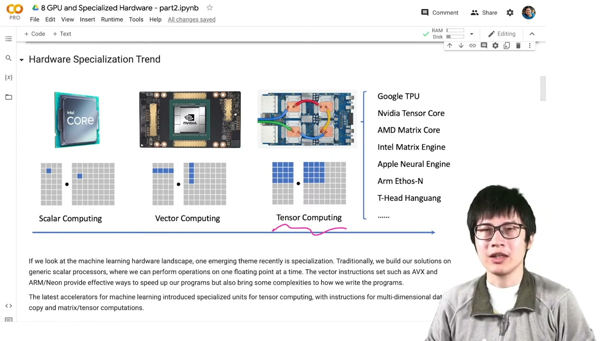

Accelerators differ in matrix dimensions, DMA transaction sizes, memory hierarchy, accumulator behavior, and supported data types. A schedule hard-coded for one device is not portable. MLC therefore needs abstractions that preserve common structure while allowing backend-specific implementations and constraints.

### Slide 5 — Common compilation properties ([00:03:30](https://www.youtube.com/watch?v=V1d4F3-AAfc&t=210s))

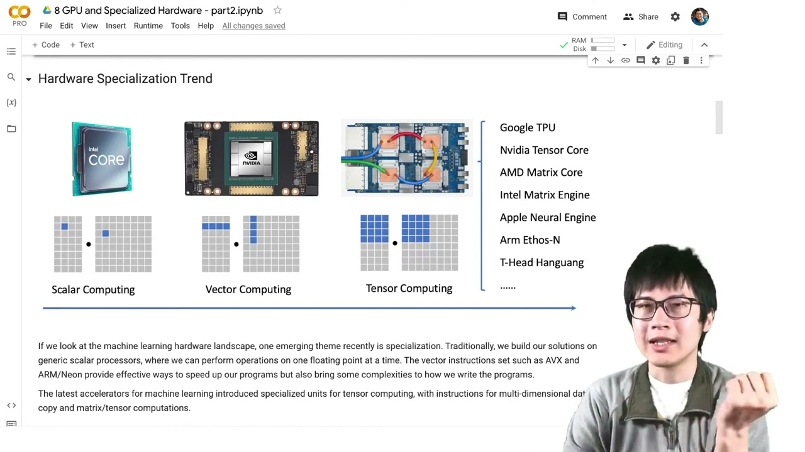

The lecture focuses on reusable concepts rather than one undocumented accelerator: tiled computations, explicit memory scopes, bulk copy operations, specialized instructions, block isolation, and pattern-based replacement. A backend supplies concrete scope mappings and intrinsic implementations.

## A hypothetical tensor accelerator

### Slide 6 — Low-level accelerator model ([00:05:00](https://www.youtube.com/watch?v=V1d4F3-AAfc&t=300s))

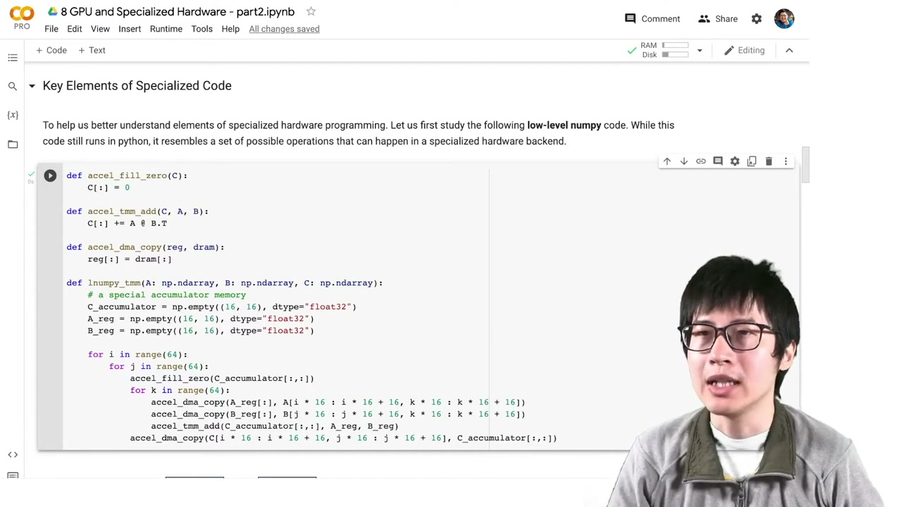

A low-level NumPy-like program models explicit accelerator behavior. It allocates input-register tiles and an accumulator tile, copies submatrices from global memory, invokes a tensor matrix instruction, and copies the result back. The simulation is slow Python but makes the intended hardware sequence visible.

### Slide 7 — Tiled transposed matrix product ([00:05:30](https://www.youtube.com/watch?v=V1d4F3-AAfc&t=330s))

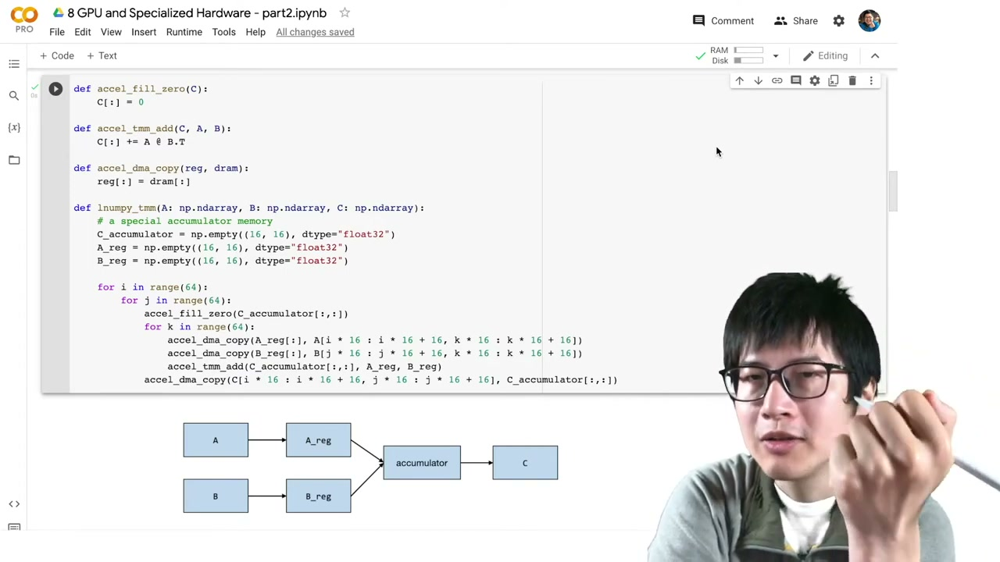

The running operation computes a product with one operand transposed:

$$
C_{ij}=\sum_k A_{ik}B_{jk}=AB^T.
$$

Large matrices are partitioned into fixed accelerator tiles. For each output tile, the reduction dimension is traversed tile by tile and the partial products accumulate in dedicated storage.

### Slide 8 — DMA-style copies ([00:08:00](https://www.youtube.com/watch?v=V1d4F3-AAfc&t=480s))

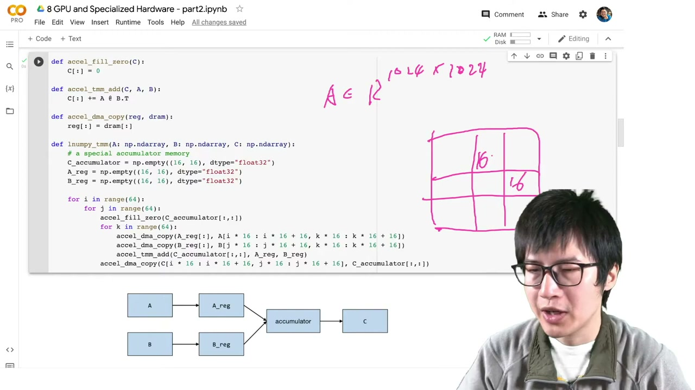

Bulk copy operations transfer $A$ and $B$ tiles from global memory into specialized input memories. After all reduction tiles have accumulated, another transfer writes the result tile back. Data movement is explicit because specialized hardware often has software-managed memories rather than transparent caches.

### Slide 9 — Accelerator dataflow ([00:10:00](https://www.youtube.com/watch?v=V1d4F3-AAfc&t=600s))

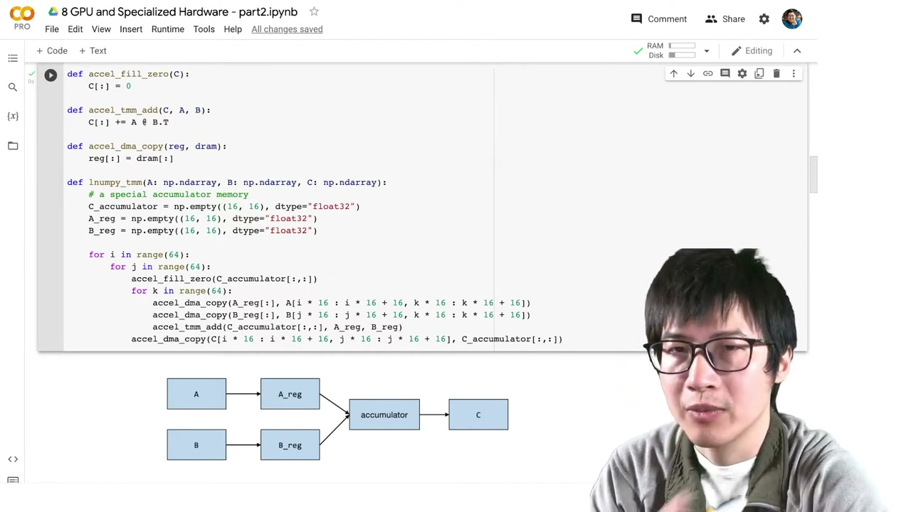

The common pipeline is:

$$
Global\ Memory\rightarrow Input\ Tiles\rightarrow Matrix\ Unit
\rightarrow Accumulator\rightarrow Global\ Memory.
$$

Performance depends on overlapping or batching transfers, reusing tiles, and keeping the matrix unit supplied. Arithmetic throughput alone does not determine end-to-end speed.

### Slide 10 — Three universal ingredients ([00:10:30](https://www.youtube.com/watch?v=V1d4F3-AAfc&t=630s))

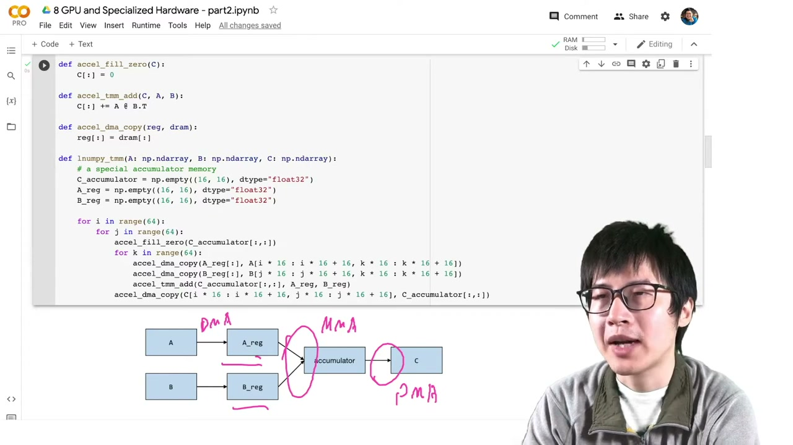

Specialized accelerator programs combine:

1. **memory scopes** representing input registers, accumulators, or scratchpads;
2. **copy primitives** representing DMA or hardware-managed transfer;
3. **compute intrinsics** representing tensor operations.

Scheduling decides tiling, ordering, placement, and reuse around those ingredients.

## TensorIR blocks and blockization

### Slide 11 — Tensor-level blocks ([00:13:00](https://www.youtube.com/watch?v=V1d4F3-AAfc&t=780s))

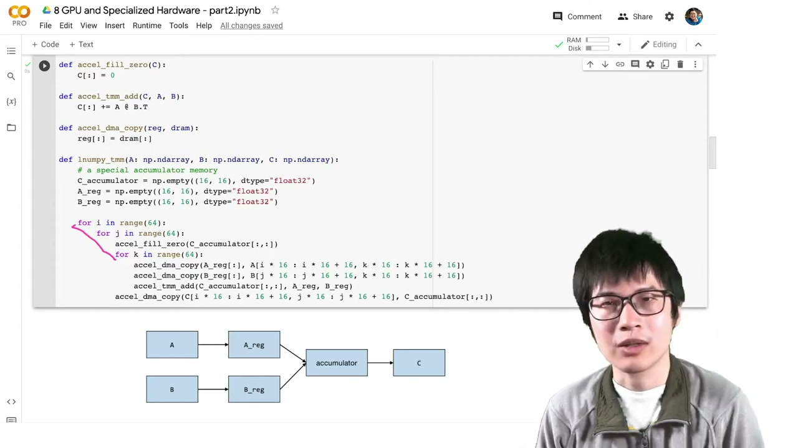

TensorIR blocks can describe a region-level computation rather than one scalar element. A block's axes, read regions, write regions, initialization, and update summarize the externally visible behavior of an inner tile computation.

### Slide 12 — Anatomy of a tensorized block ([00:15:00](https://www.youtube.com/watch?v=V1d4F3-AAfc&t=900s))

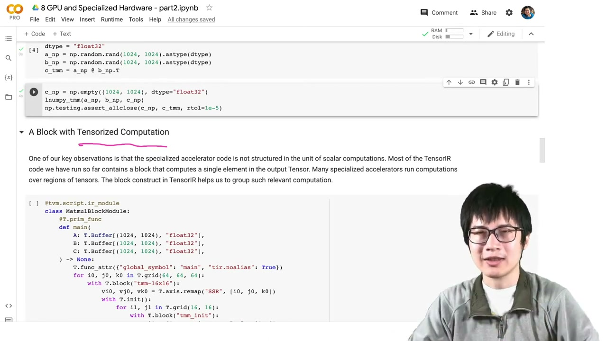

A matrix tile block has spatial axes selecting output tiles and a reduction axis selecting input tile pairs. Its semantic region is equivalent to many scalar iterations:

$$
C[I:I+t,J:J+t]\mathrel{+}=A[I:I+t,K:K+t]\;B[J:J+t,K:K+t]^T.
$$

The block also captures the accumulator initialization required before reduction updates.

### Slide 13 — Block isolation ([00:17:00](https://www.youtube.com/watch?v=V1d4F3-AAfc&t=1020s))

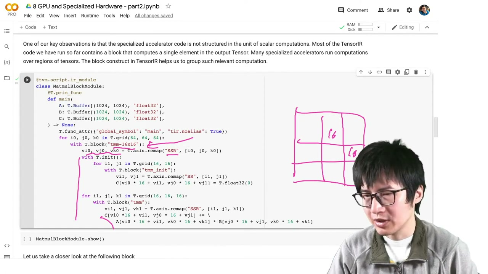

From outside, a block is characterized by iterator bindings and read/write regions. Its implementation may be scalar loops or one hardware intrinsic. This isolation lets outer loops be tiled or reordered without rewriting the inner operation and lets the compiler replace a matching block body safely.

### Slide 14 — `blockize` scalar loops ([00:21:30](https://www.youtube.com/watch?v=V1d4F3-AAfc&t=1290s))

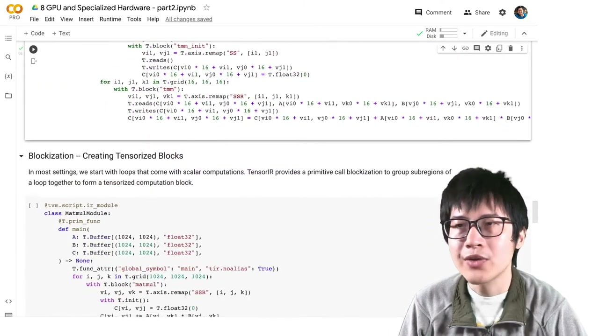

A high-level matmul begins as scalar $i,j,k$ loops. The schedule splits axes by the intrinsic tile sizes, reorders inner loops into a contiguous subtree, and calls `blockize` on that loop. TensorIR creates an outer block whose body is the grouped inner tile computation.

```python
i_o, i_i = sch.split(i, factors=[None, tile])
j_o, j_i = sch.split(j, factors=[None, tile])
k_o, k_i = sch.split(k, factors=[None, tile])
sch.reorder(i_o, j_o, k_o, i_i, j_i, k_i)
tile_block = sch.blockize(i_i)
```

The exact legal loop subtree depends on block structure and dependencies.

### Slide 15 — Result of blockization ([00:23:00](https://www.youtube.com/watch?v=V1d4F3-AAfc&t=1380s))

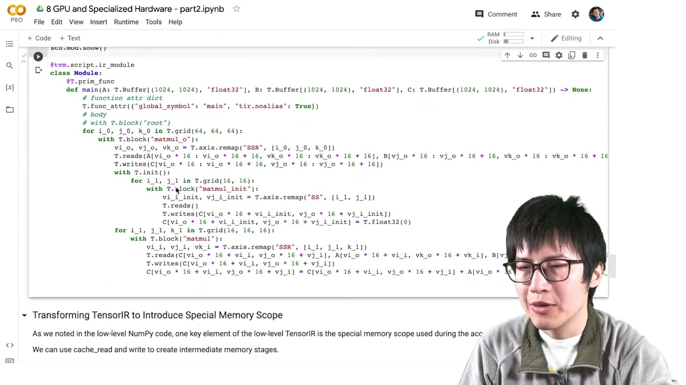

After blockization, the outer IR explicitly reads and writes tile regions, while the nested block retains scalar axes and statements. This structured tile is now a candidate for memory-scope placement or matching against a tensor intrinsic.

### Slide 16 — Specialized memory scopes ([00:24:30](https://www.youtube.com/watch?v=V1d4F3-AAfc&t=1470s))

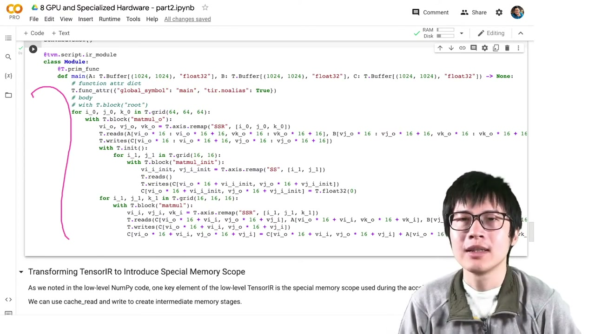

Logical buffers are placed into scopes such as input registers and accumulator storage. Cache/read transformations and explicit copy blocks move data between global memory and those scopes. The backend maps scope names to physical resources and enforces size, alignment, and access constraints.

## Tensorization and external implementations

### Slide 17 — Vectorization versus tensorization ([00:27:00](https://www.youtube.com/watch?v=V1d4F3-AAfc&t=1620s))

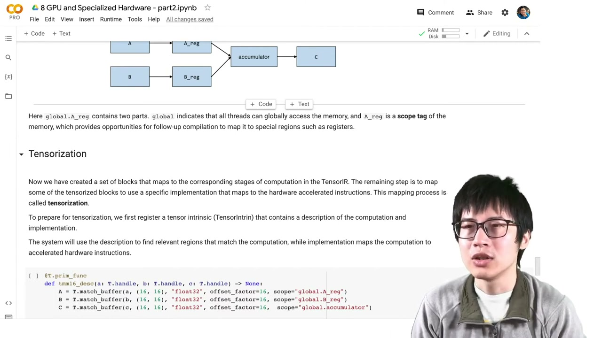

Vectorization replaces several scalar iterations with one vector instruction. **Tensorization** generalizes the idea: a multidimensional loop region is replaced with one tensor instruction or microkernel. The matched computation, tile shape, layout, dtype, and memory scopes must agree with the intrinsic contract.

### Slide 18 — Tensor intrinsic declaration ([00:28:00](https://www.youtube.com/watch?v=V1d4F3-AAfc&t=1680s))

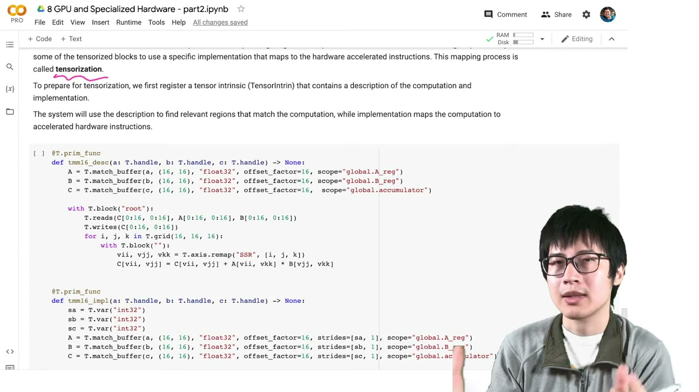

A tensor intrinsic pairs:

1. a **description PrimFunc** specifying the computation pattern and regions;
2. an **implementation PrimFunc** specifying the replacement call or low-level instructions.

The intrinsic is registered under a name. `sch.tensorize(loop_or_block, intrin_name)` pattern-matches the scheduled region against the description and substitutes the implementation.

### Slide 19 — Microkernel implementation ([00:35:30](https://www.youtube.com/watch?v=V1d4F3-AAfc&t=2130s))

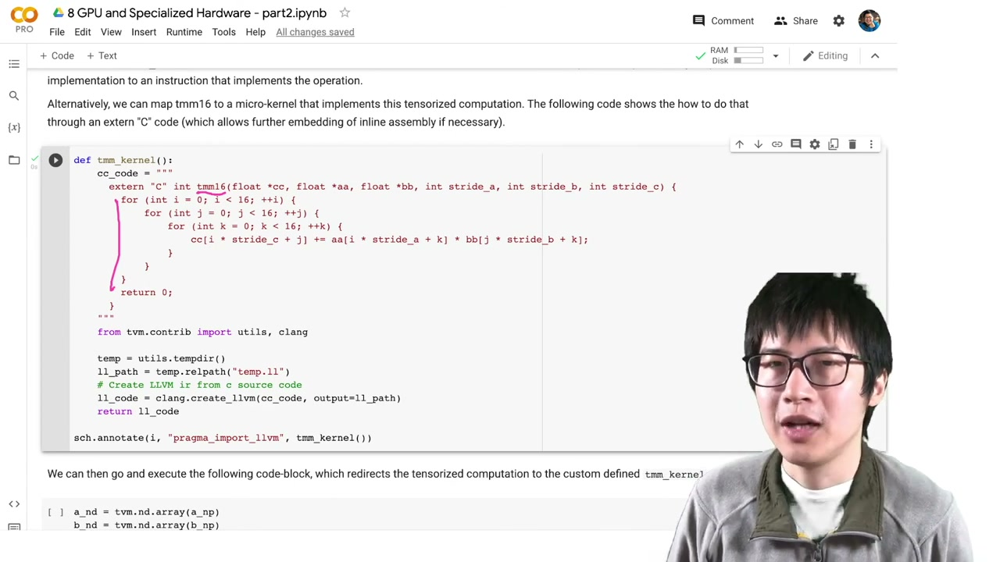

The demonstration's implementation calls a C/LLVM matrix microkernel. A real backend could emit inline assembly, invoke a vendor library, or lower to Tensor Core instructions. Strides and pointers connect TensorIR buffer regions to the external function's calling convention.

### Slide 20 — Build, run, and verify ([00:36:00](https://www.youtube.com/watch?v=V1d4F3-AAfc&t=2160s))

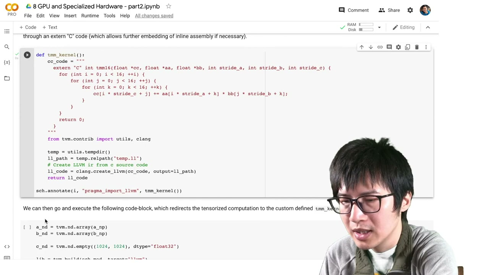

The compiled module links the microkernel implementation, executes with test arrays, and compares output against a reference. In the CPU demonstration, specialized scopes are simulated; on real hardware, backend lowering maps them to actual register or scratchpad resources.

### Slide 21 — Summary and real hardware ([00:37:27](https://www.youtube.com/watch?v=V1d4F3-AAfc&t=2247s))

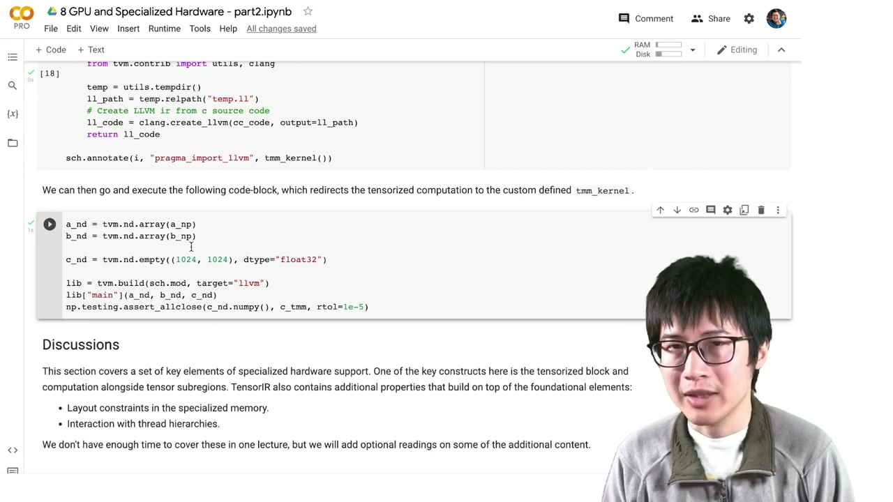

The transferable workflow is:

1. tile scalar TensorIR to the hardware operation shape;
2. blockize the matching loop region;
3. introduce required memory scopes and copy operations;
4. tensorize against a registered intrinsic;
5. lower, link, run, and verify.

Real Tensor Core/TPU backends add device-specific layouts, thread mappings, synchronization, and pipeline rules, but use the same abstraction pattern.

## Key takeaways

1. Specialized accelerators execute fixed-shape tensor operations and explicit transfers.
2. Hardware diversity requires backend-specific contracts behind common abstractions.
3. Accelerator code combines memory scopes, bulk copies, and compute intrinsics.
4. The running example computes a tiled $AB^T$ product.
5. Explicit data movement often matters as much as arithmetic throughput.
6. TensorIR blocks summarize tile-level reads, writes, axes, init, and updates.
7. Block isolation separates outer scheduling from inner implementation.
8. `blockize` groups a legal loop subtree into a tile-level block.
9. Memory-scope tags are logical until a backend maps them to hardware.
10. Vectorization replaces 1-D scalar regions; tensorization replaces multidimensional regions.
11. A tensor intrinsic contains a semantic description and concrete implementation.
12. Tensorization succeeds only when shape, layout, dtype, scope, and computation match.
13. Intrinsic implementations may be generated instructions, assembly, libraries, or microkernels.
14. External functions require correct pointer, stride, and calling-convention mapping.
15. Every specialized lowering must be validated against reference semantics.
16. Real backends extend the workflow with threads, synchronization, and memory pipelines.