# Integration with Machine Learning Frameworks - Episode 6

**Course:** Machine Learning Compilation, Summer 2022  
**Instructor:** Tianqi Chen  
**Video:** [YouTube lecture](https://www.youtube.com/watch?v=EhD7LgTl_CQ) (47:00)  
**Course materials:** [Episode notes](https://mlc.ai/chapter_integration/index.html) · [Notebook](https://github.com/mlc-ai/notebooks/blob/main/6_Integration_with_Machine_Learning_Frameworks.ipynb)

This episode shows how to import computations from an existing ML framework into an MLC IRModule. It introduces TVM's Tensor Expression DSL, programmatic Relax construction with BlockBuilder, and a small TorchFX-to-Relax translator.

## Tensor Expression to TensorIR

### Slide 1 — Integration with ML frameworks ([00:00:05](https://www.youtube.com/watch?v=EhD7LgTl_CQ&t=5s))

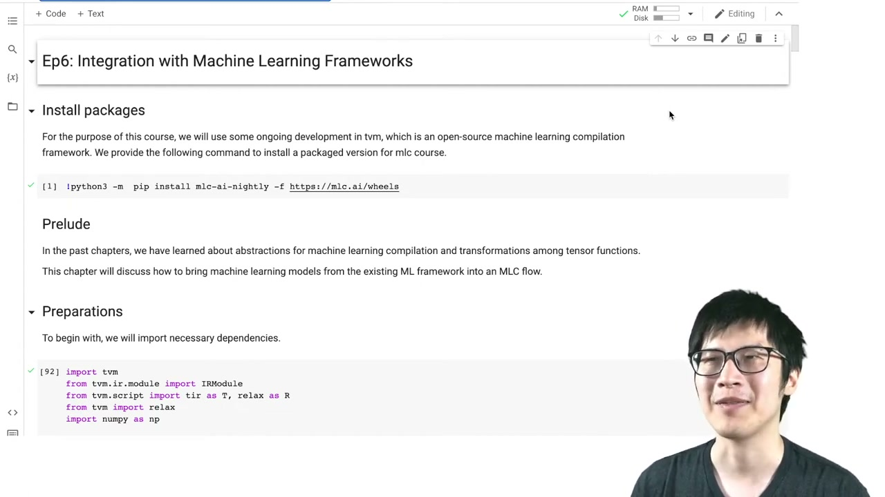

MLC needs an entry path from development frameworks such as PyTorch and JAX. Once a model is represented in an IRModule, graph transformations can optimize end-to-end structure and TensorIR schedules can optimize primitive implementations.

### Slide 2 — Tensor Expression DSL ([00:01:40](https://www.youtube.com/watch?v=EhD7LgTl_CQ&t=100s))

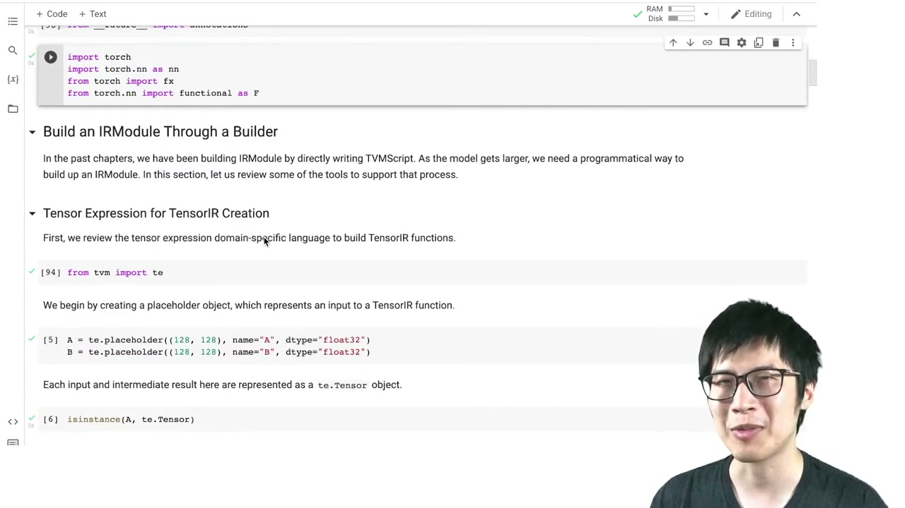

TVM's Tensor Expression (TE) language concisely describes tensor computations from shapes and element formulas. It is higher-level than TensorIR loops: users state output indexing and reductions, and TE constructs a computation graph that can be lowered into a PrimFunc.

### Slide 3 — `te.compute` for matrix multiplication ([00:03:30](https://www.youtube.com/watch?v=EhD7LgTl_CQ&t=210s))

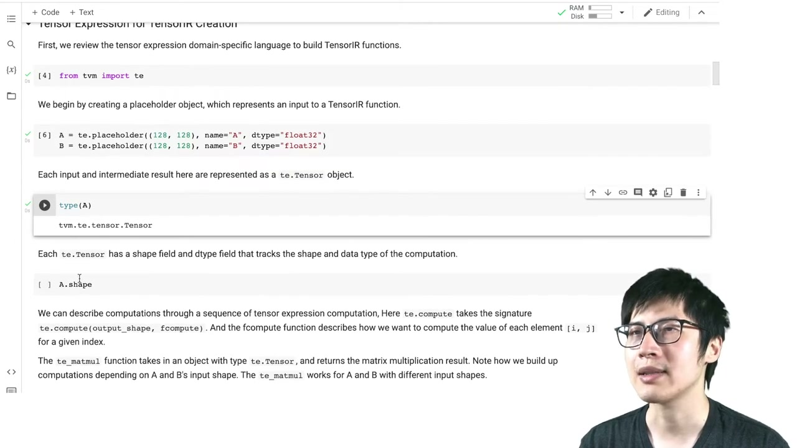

Placeholders represent input tensors, a reduction axis represents the contracted dimension, and `te.compute` defines output elements:

```python
k = te.reduce_axis((0, K), name="k")
C = te.compute(
    (M, N),
    lambda i, j: te.sum(A[i, k] * B[k, j], axis=k),
    name="C",
)
```

The formula is $C_{ij}=\sum_k A_{ik}B_{kj}$, parameterized by symbolic or concrete shapes.

### Slide 4 — `create_prim_func` ([00:04:40](https://www.youtube.com/watch?v=EhD7LgTl_CQ&t=280s))

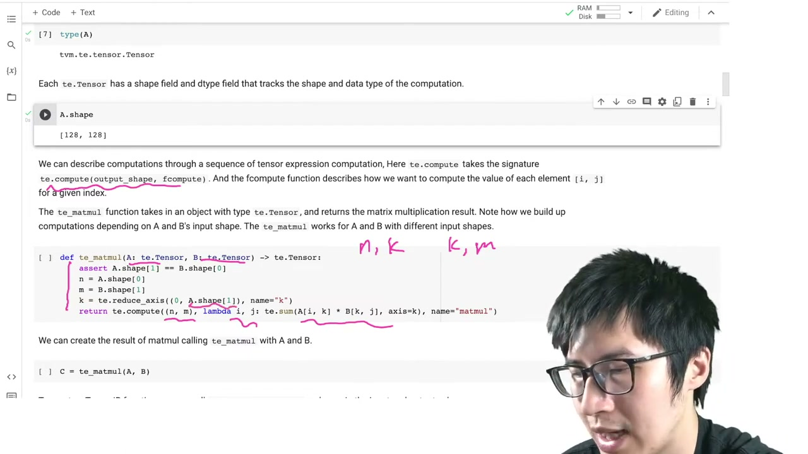

`te.create_prim_func([A, B, C])` converts the TE graph into TensorIR with typed buffers, loops, blocks, spatial/reduction axes, and inferred regions. TE therefore provides a productive way to generate correct primitive structure without hand-writing every loop.

### Slide 5 — Generic ReLU tensor expression ([00:05:40](https://www.youtube.com/watch?v=EhD7LgTl_CQ&t=340s))

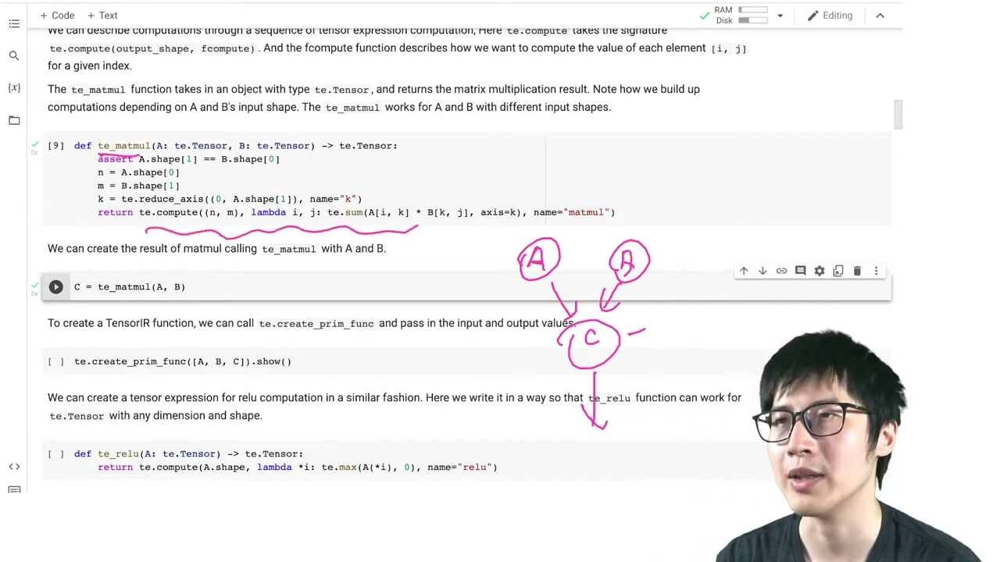

An elementwise function can accept arbitrary-rank tensors by expanding index arguments:

```python
def te_relu(A):
    return te.compute(A.shape, lambda *idx: te.max(A[idx], 0.0), name="relu")
```

The output shape follows the input, while the scalar rule applies independently at every coordinate.

### Slide 6 — Fuse matmul and ReLU ([00:08:40](https://www.youtube.com/watch?v=EhD7LgTl_CQ&t=520s))

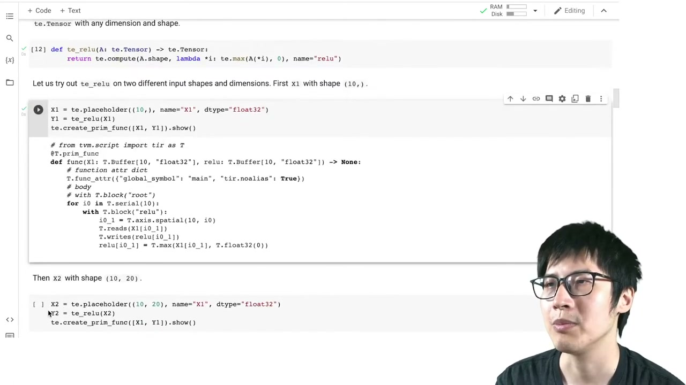

TE computations compose: ReLU can consume the matmul tensor before either is lowered. Creating a PrimFunc with only external inputs and final output makes the matmul result an internal temporary. The compiler can then control its allocation and potentially optimize producer–consumer locality.

Passing the intermediate as a function parameter is also possible, but fixes an external storage boundary and exposes less fusion freedom.

## Programmatic Relax construction

### Slide 7 — Why use BlockBuilder? ([00:10:00](https://www.youtube.com/watch?v=EhD7LgTl_CQ&t=600s))

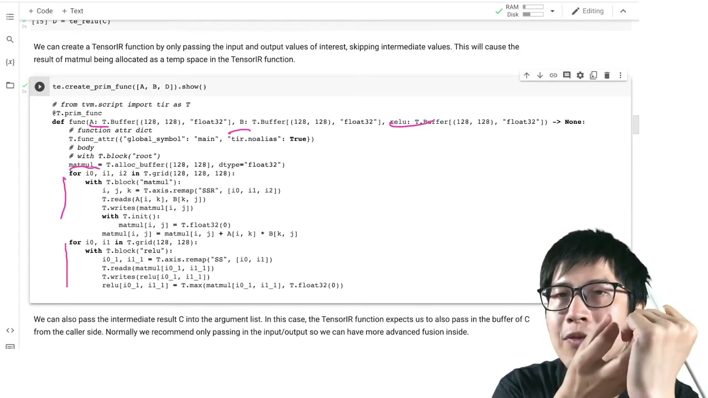

TE creates primitive tensor functions; an end-to-end model needs a graph that calls several primitives. `relax.BlockBuilder` incrementally constructs Relax functions and adds generated TensorIR PrimFuncs to one IRModule.

### Slide 8 — Relax variables and dataflow ([00:11:00](https://www.youtube.com/watch?v=EhD7LgTl_CQ&t=660s))

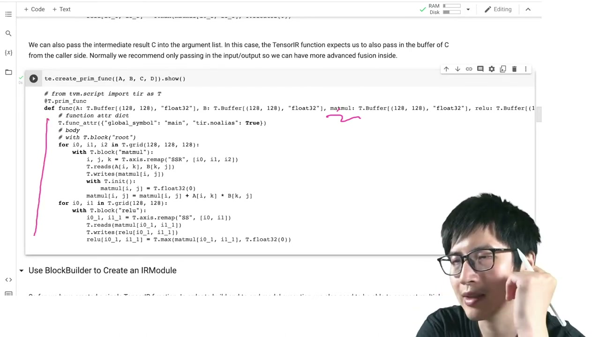

Relax input variables carry tensor structural information. A builder function scope defines parameters, and a dataflow scope contains pure internal bindings. This mirrors a computational graph while enforcing which values are local and which may escape.

### Slide 9 — BlockBuilder function structure ([00:12:30](https://www.youtube.com/watch?v=EhD7LgTl_CQ&t=750s))

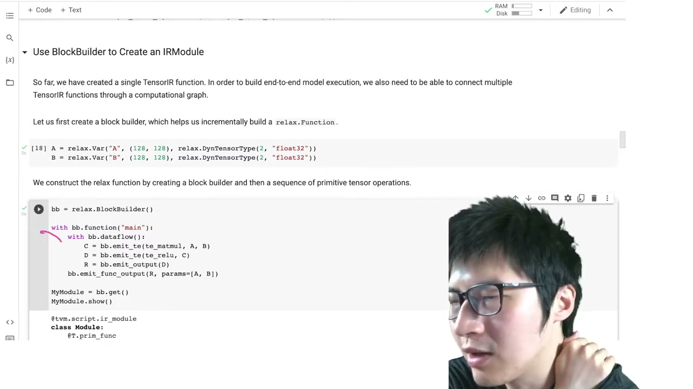

The common pattern is:

```python
bb = relax.BlockBuilder()
with bb.function("main", [x, w]):
    with bb.dataflow():
        lv0 = bb.emit_te(te_matmul, x, w)
        lv1 = bb.emit_te(te_relu, lv0)
        out = bb.emit_output(lv1)
    bb.emit_func_output(out)
```

The builder records bindings and finalizes an IRModule.

### Slide 10 — What `emit_te` does ([00:14:00](https://www.youtube.com/watch?v=EhD7LgTl_CQ&t=840s))

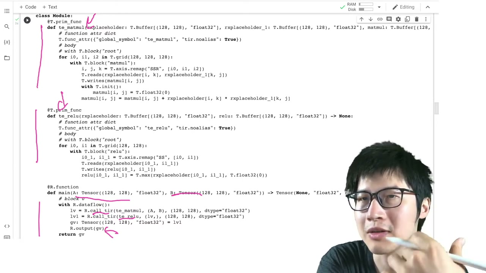

`emit_te` adapts Relax values to TE placeholders, invokes the TE function, lowers its graph through `create_prim_func`, adds the resulting PrimFunc to the module, and emits a Relax `call_tir` binding. It automates the same bridge constructed manually in Episode 4.

### Slide 11 — DataflowVar and output scope ([00:16:00](https://www.youtube.com/watch?v=EhD7LgTl_CQ&t=960s))

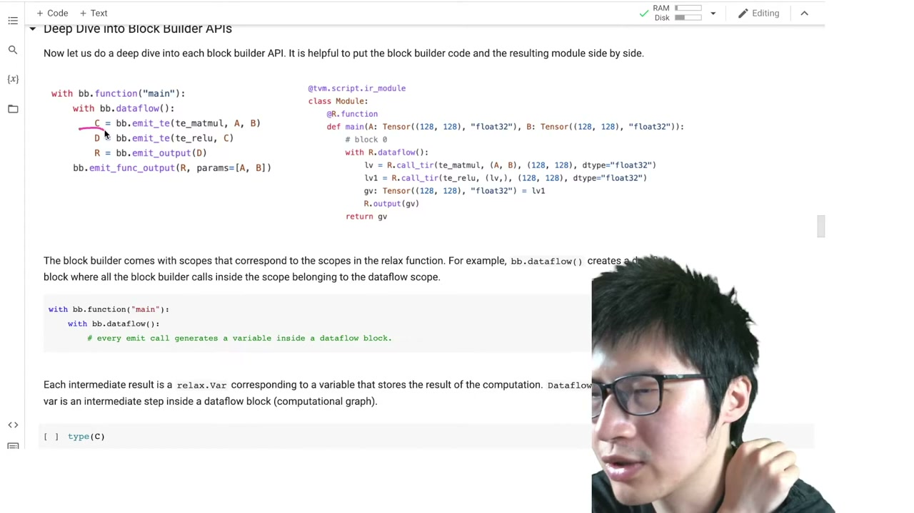

Intermediate emissions are `DataflowVar` values usable only inside the dataflow block. `emit_output` promotes a selected value to an ordinary Relax variable that can be referenced outside. This scope discipline helps transformations reason about internal graph regions.

### Slide 12 — Function parameters and finalization ([00:17:00](https://www.youtube.com/watch?v=EhD7LgTl_CQ&t=1020s))

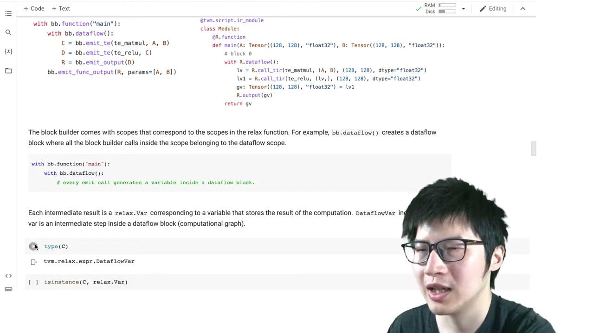

Parameters may be known before graph construction or collected while translating an external graph. BlockBuilder supports both workflows, but a function must be finalized with a consistent parameter list and output value. Dynamic importers often collect placeholders and parameters as nodes are visited.

## Importing a PyTorch model

### Slide 13 — Define a PyTorch module ([00:20:00](https://www.youtube.com/watch?v=EhD7LgTl_CQ&t=1200s))

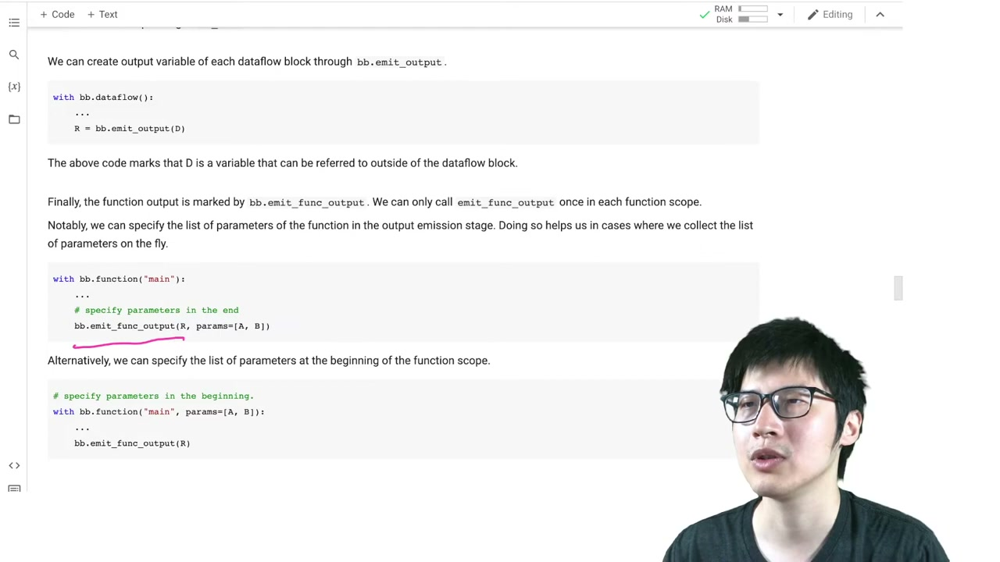

The example `torch.nn.Module` registers a weight parameter and defines `forward` as matrix multiplication followed by ReLU. Parameters are module state; the input is a runtime value. The translation must preserve both computation and parameter identity.

### Slide 14 — TorchFX symbolic tracing ([00:22:00](https://www.youtube.com/watch?v=EhD7LgTl_CQ&t=1320s))

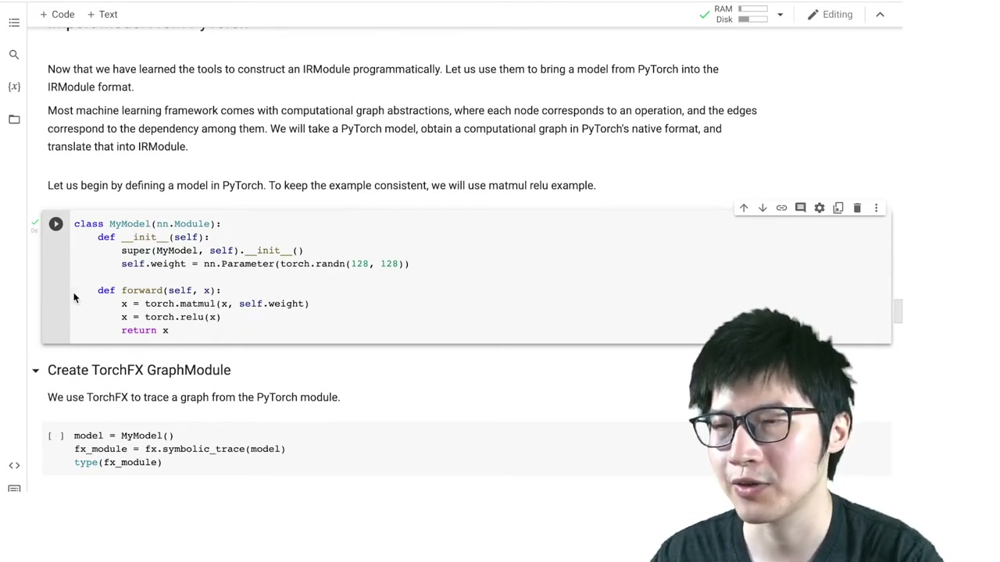

`torch.fx.symbolic_trace(model)` executes the model with proxy values to capture an `fx.GraphModule`. Its graph contains dataflow nodes such as `placeholder`, `get_attr`, `call_function`, and `output` in topological order.

Symbolic tracing works well for traceable dataflow code, but arbitrary Python control flow depending on runtime tensor values requires other capture or rewriting techniques.

### Slide 15 — Inspect FX graph nodes ([00:24:00](https://www.youtube.com/watch?v=EhD7LgTl_CQ&t=1440s))

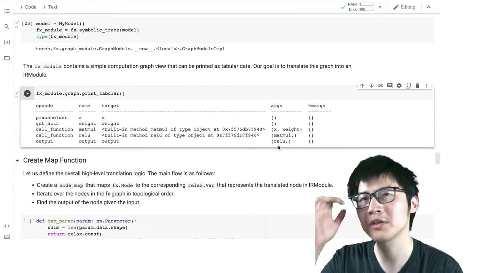

The graph for the example is:

$$
x,weight\rightarrow matmul\rightarrow relu\rightarrow output.
$$

`node.op` classifies the node, `node.target` identifies an attribute or called function, and `node.args` references predecessor nodes. These fields are enough to build a small translator.

### Slide 16 — Map PyTorch parameters ([00:25:00](https://www.youtube.com/watch?v=EhD7LgTl_CQ&t=1500s))

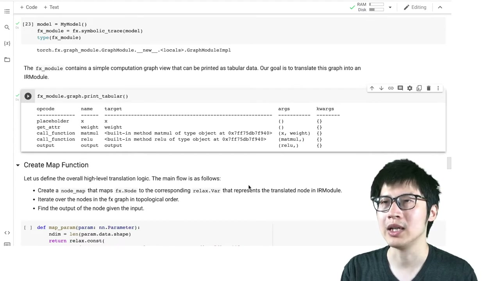

`get_attr` nodes refer to module parameters such as `weight`. The importer resolves the nested attribute, detaches it from autograd, moves it to CPU if needed, converts to NumPy, and creates a Relax constant or external parameter value with matching dtype and shape.

Whether parameters become constants or function arguments is a deployment design choice.

### Slide 17 — Node-to-value translation map ([00:27:00](https://www.youtube.com/watch?v=EhD7LgTl_CQ&t=1620s))

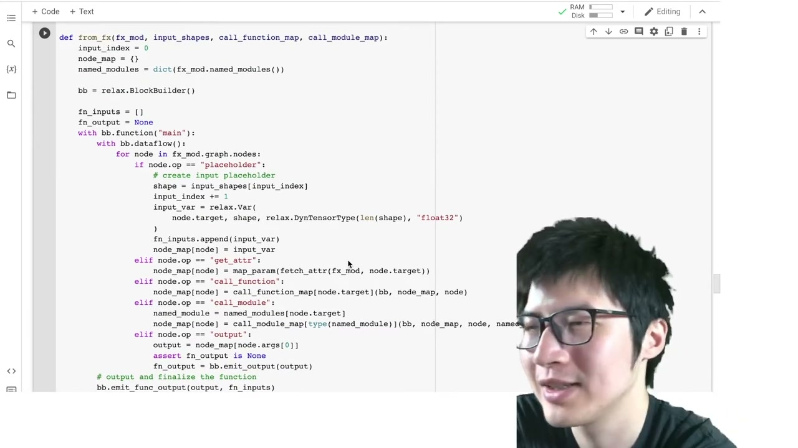

The translator maintains

```python
node_map: dict[fx.Node, relax.Expr]
```

As FX nodes are visited in topological order, each translated Relax value is stored. When translating an operation, its FX argument nodes are looked up in this map, guaranteeing the corresponding Relax expressions already exist.

### Slide 18 — Create the Relax function ([00:29:00](https://www.youtube.com/watch?v=EhD7LgTl_CQ&t=1740s))

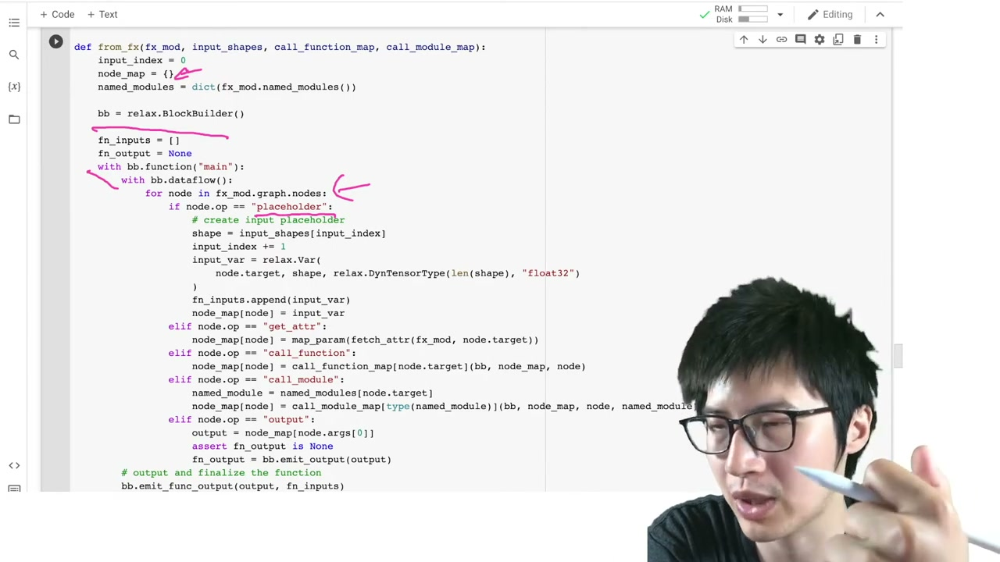

The importer creates a BlockBuilder, enters a `main` function and dataflow scope, and dispatches on each node's `op`. Placeholder nodes create typed Relax variables and are collected for the final signature; attributes become constants or parameters.

### Slide 19 — Translate placeholder nodes ([00:31:00](https://www.youtube.com/watch?v=EhD7LgTl_CQ&t=1860s))

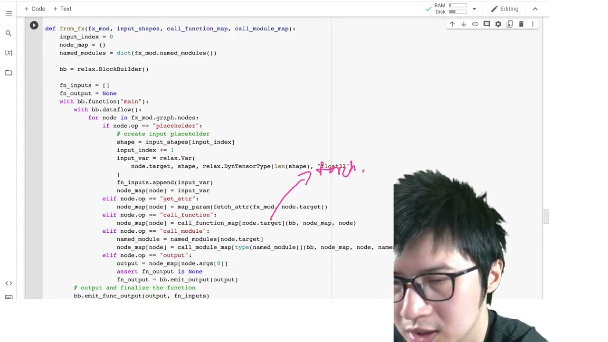

FX placeholders do not fully encode all desired shape information, so the simple importer receives example/input shapes. For each placeholder it constructs a tensor `relax.Var`, records it in `node_map`, and appends it to the function parameter list.

Real importers use shape propagation, symbolic dimensions, or framework metadata to avoid manual shape lists.

### Slide 20 — Translate operation nodes ([00:34:00](https://www.youtube.com/watch?v=EhD7LgTl_CQ&t=2040s))

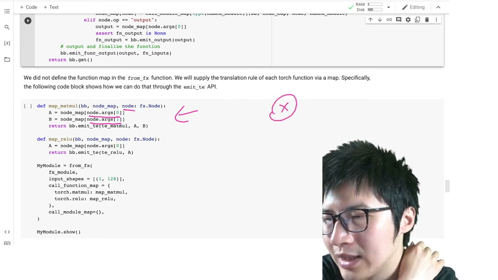

For a `call_function` node, the importer maps `node.target` to a translator. A matmul translator looks up two operands and calls `bb.emit_te(te_matmul, a, b)`; a ReLU translator looks up one operand and emits `te_relu`. Adding target mappings extends supported framework operations.

Unsupported functions should produce explicit diagnostics rather than silently changing semantics.

### Slide 21 — Translator helper pattern ([00:37:00](https://www.youtube.com/watch?v=EhD7LgTl_CQ&t=2220s))

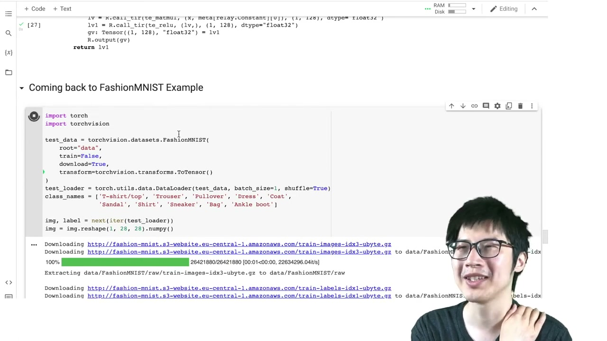

Each translator encapsulates one framework-to-IR semantic mapping. It receives the builder, node map, and FX node; resolves arguments and attributes; emits Relax or TE expressions; and returns the target expression. This design separates graph traversal from operator-specific logic.

### Slide 22 — Output and function finalization ([00:40:00](https://www.youtube.com/watch?v=EhD7LgTl_CQ&t=2400s))

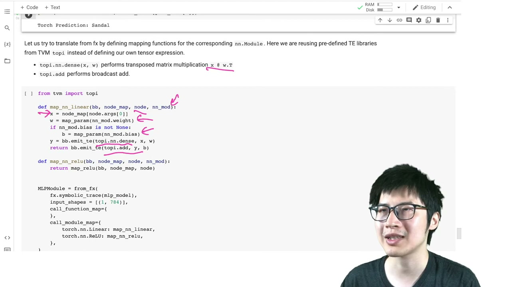

The FX `output` node identifies one or more graph results. The importer resolves them through `node_map`, calls `emit_output`, exits dataflow, and finalizes the function with collected inputs. The produced IRModule contains the Relax `main` plus TensorIR PrimFuncs generated by `emit_te`.

### Slide 23 — Build and verify imported model ([00:43:00](https://www.youtube.com/watch?v=EhD7LgTl_CQ&t=2580s))

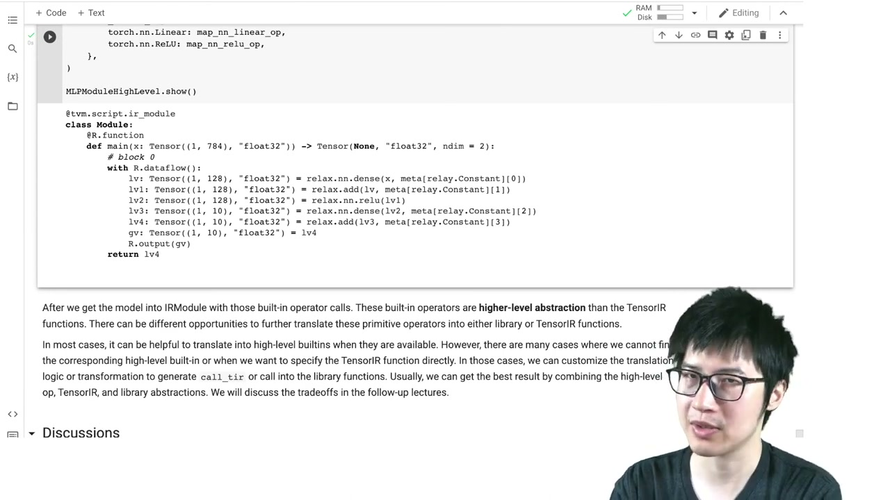

The module is compiled and executed with the same input and parameter values as PyTorch. Numerical comparison checks that the imported model preserves framework behavior. Verification is essential because differences in broadcasting, dtype promotion, layout, mutation, and numerical definitions can make apparently similar operators inequivalent.

### Slide 24 — General integration pattern ([00:46:00](https://www.youtube.com/watch?v=EhD7LgTl_CQ&t=2760s))

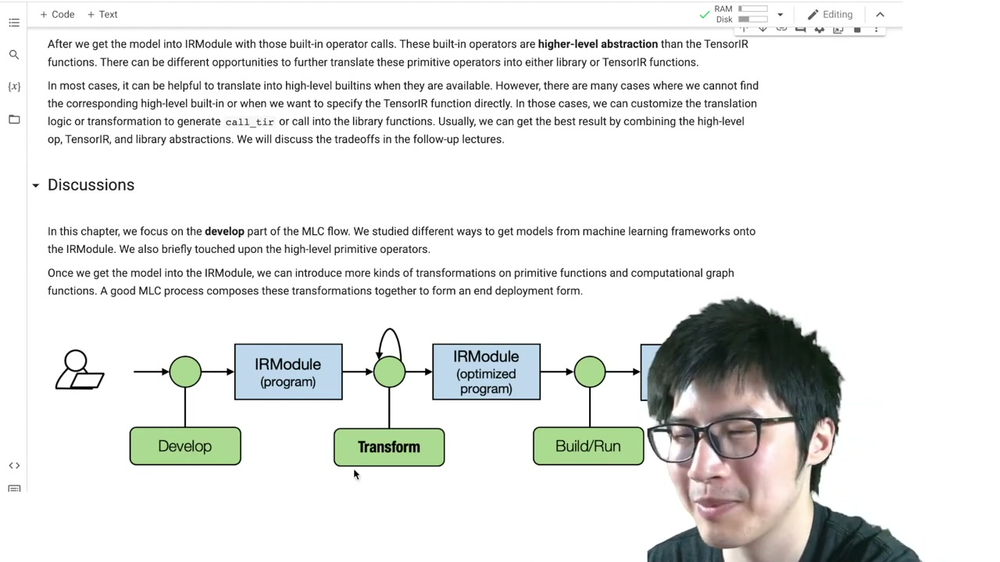

Framework integration follows a reusable pipeline:

1. capture or export a framework graph,
2. propagate shapes and types,
3. visit nodes in dependency order,
4. map parameters and operators to target expressions,
5. construct an IRModule,
6. compile and verify against the source framework.

The same architecture applies to ONNX, TensorFlow, JAX, and other sources, though each requires precise semantic mappings and support for its control-flow, shape, and state model.

## Key takeaways

1. TE describes tensor computations from output shapes and element formulas.
2. `te.create_prim_func` lowers a TE graph into TensorIR.
3. Composed TE operations can make intermediates internal to one primitive.
4. BlockBuilder programmatically constructs Relax functions and IRModules.
5. `emit_te` generates a PrimFunc and a corresponding `call_tir` binding.
6. Dataflow variables are scoped; `emit_output` marks escaping values.
7. TorchFX captures traceable PyTorch dataflow into an ordered graph.
8. FX nodes distinguish inputs, parameters, operations, and outputs.
9. A node map connects source graph nodes to translated Relax expressions.
10. `get_attr` translation resolves framework parameters and constants.
11. Operation translators must preserve source semantics, not just names.
12. Placeholder shape/type metadata is required to construct target variables.
13. The imported IRModule combines graph-level Relax and primitive TensorIR.
14. Numerical comparison against the source framework validates translation.
15. Dynamic control flow, mutation, symbolic shapes, and dtype rules complicate import.
16. Graph extraction and semantic lowering are distinct stages of integration.
17. A modular translator table makes framework support extensible.