# Machine Learning Compilation: Episode 1 / Overview

**Course:** Machine Learning Compilation, Summer 2022  
**Instructor:** Tianqi Chen  
**Video:** [YouTube lecture](https://www.youtube.com/watch?v=Oc_wVXdnrrM) (47:01)  
**Course materials:** [Episode notes](https://mlc.ai/chapter_introduction/) · [Episode slides](https://mlc.ai/summer22/slides/1-Introduction.pdf)

These notes follow the lecture's substantive slides and explanations. They introduce the deployment problem that motivates machine learning compilation, its goals, and the tensor-function abstractions used throughout the course.

## Why machine learning compilation?

### Slide 1 — Machine Learning Compilation ([00:00:05](https://www.youtube.com/watch?v=Oc_wVXdnrrM&t=5s))

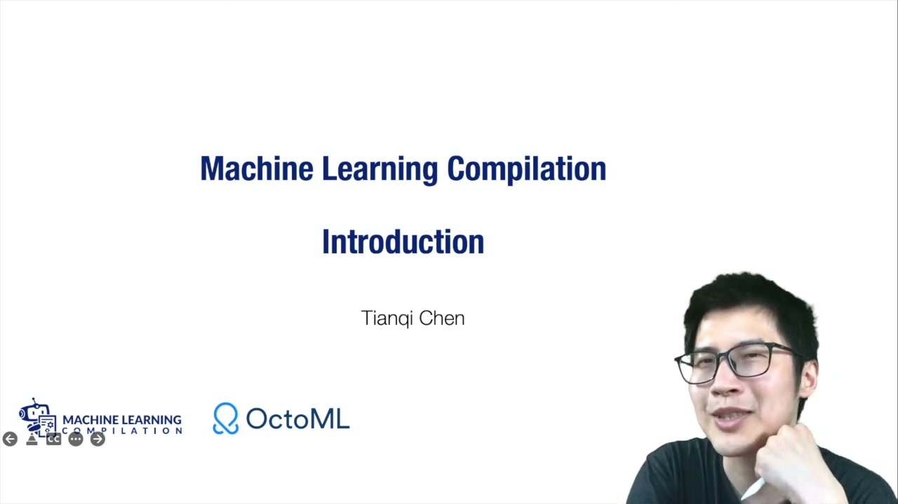

Tianqi Chen opens the course with two questions: what machine learning compilation (MLC) is, and why it deserves systematic study. This first lecture also introduces tensors, tensor functions, abstractions, and transformations—the common vocabulary for later optimization and deployment work.

### Slide 2 — Traditional software landscape ([00:01:00](https://www.youtube.com/watch?v=Oc_wVXdnrrM&t=60s))

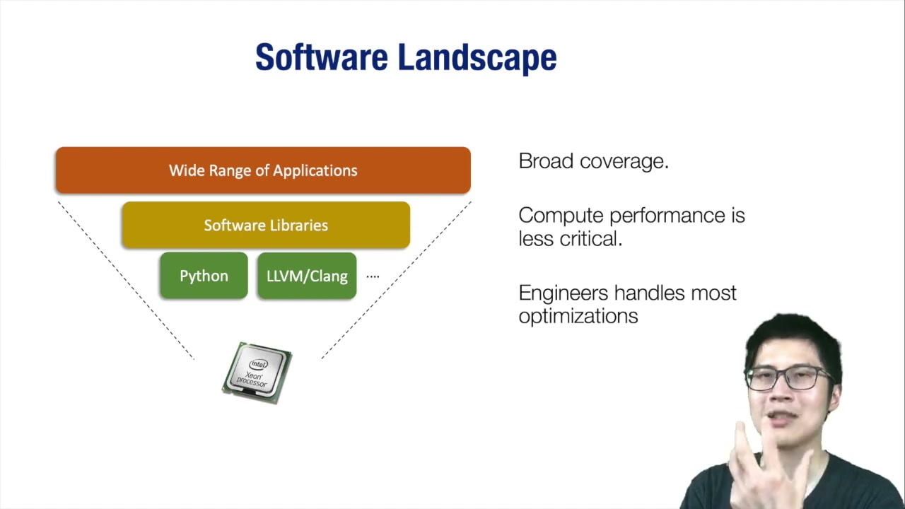

Traditional software development targets a wide range of applications using a relatively compact stack of programming languages, libraries, compilers, operating systems, and general-purpose processors. The compiler and runtime hide many machine details, allowing one source program to work across compatible platforms.

ML changes this landscape because both the applications and the deployment hardware diversify rapidly.

### Slide 3 — AI software landscape ([00:02:30](https://www.youtube.com/watch?v=Oc_wVXdnrrM&t=150s))

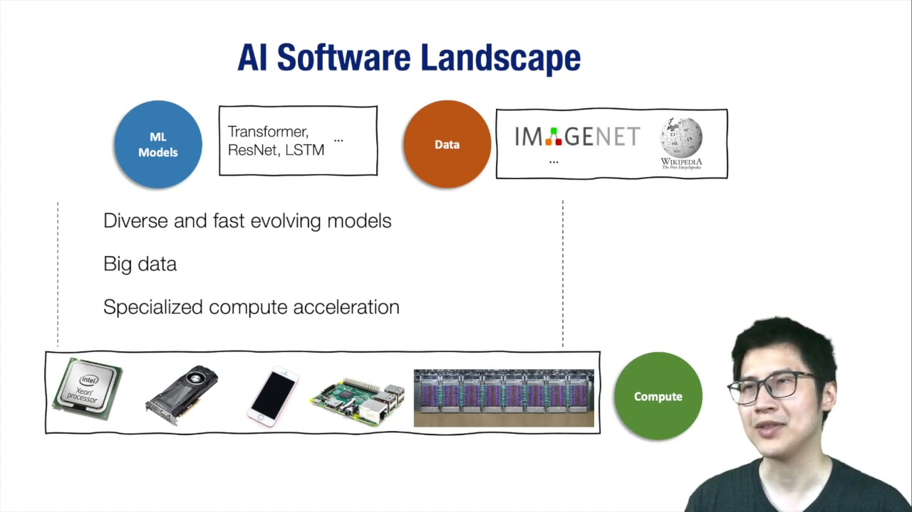

AI applications include speech, vision, language models, autonomous systems, and scientific workloads. Their models vary in operator mix, shape, precision, and scale. Deployment targets range from cloud GPUs and TPUs to phones, embedded processors, custom accelerators, and distributed systems.

This creates a many-to-many problem: many model families must run efficiently on many heterogeneous environments.

### Slide 4 — Machine learning deployment problem ([00:04:15](https://www.youtube.com/watch?v=Oc_wVXdnrrM&t=255s))

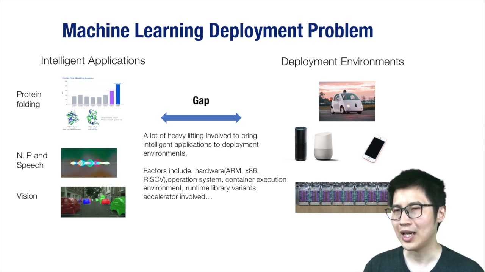

The slide places intelligent applications on the left and deployment environments on the right. Bridging them requires choices about model format, operator implementation, runtime, operating-system API, processor, accelerator, and memory constraints. Building a separate hand-tuned path for every model–device pair causes a combinatorial engineering burden.

The gap is not just “generate machine code.” A deployable system must package the model, parameters, execution logic, libraries, and hardware interfaces into a form that works in the target environment.

## What is machine learning compilation?

### Slide 5 — Development form to deployment form ([00:08:00](https://www.youtube.com/watch?v=Oc_wVXdnrrM&t=480s))

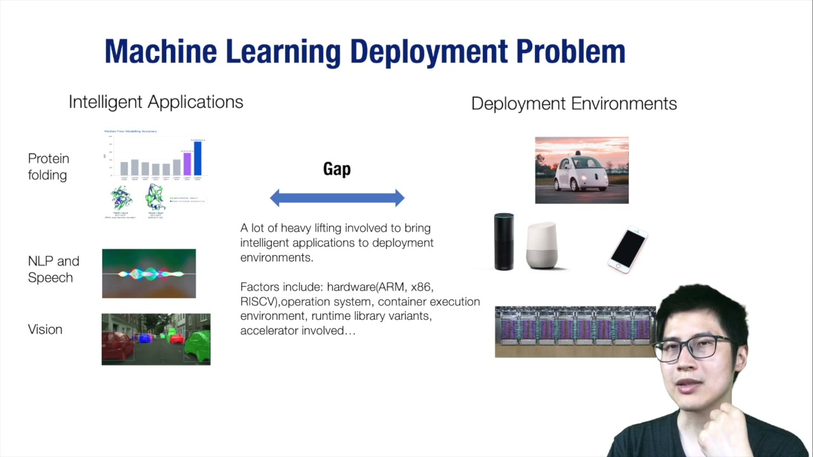

MLC transforms a model from its **development form** into a **deployment form**.

| Development form | Deployment form |
|---|---|
| PyTorch, TensorFlow, JAX, or another framework | Executable model representation and parameters |
| Convenient experimentation and training abstractions | Target-specific operator implementations |
| Flexible, often dependency-heavy environment | Runtime, system APIs, and hardware integration |

The MLC process can combine automatic compiler passes, learned search, libraries, and manual engineering. The defining property is a systematic transformation toward deployment requirements.

### Slide 6 — Deployment packaging and runtime layers ([00:10:30](https://www.youtube.com/watch?v=Oc_wVXdnrrM&t=630s))

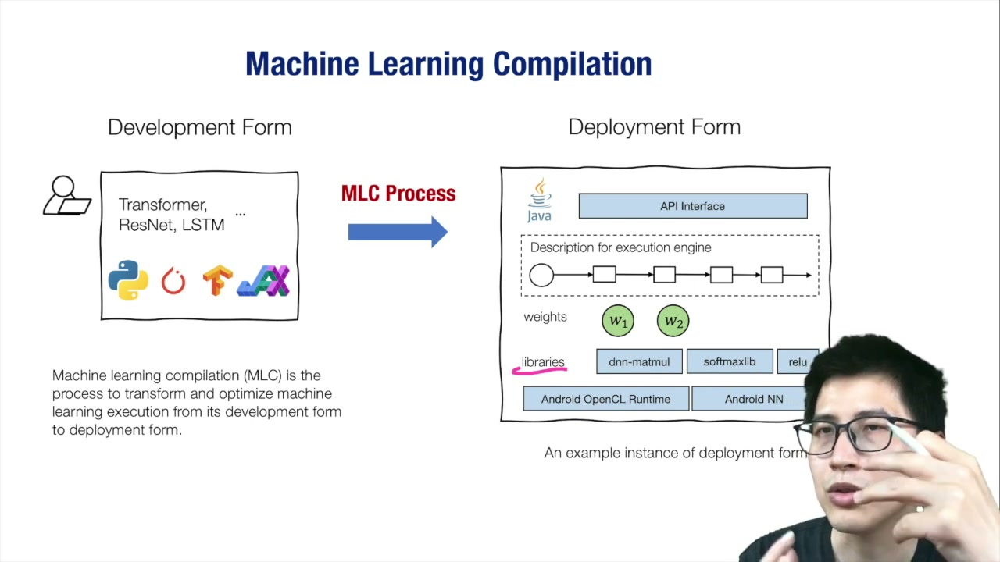

An Android-style deployment illustrates the layers: an application API invokes a model runtime; the runtime interprets or executes a model description and weights; operators map to optimized libraries or generated kernels; those implementations use APIs such as OpenCL or NNAPI to reach CPU, GPU, or accelerator hardware.

MLC decides which pieces are required, how they connect, and where each computation should execute.

### Slide 7 — Goal: integration and dependency minimization ([00:13:00](https://www.youtube.com/watch?v=Oc_wVXdnrrM&t=780s))

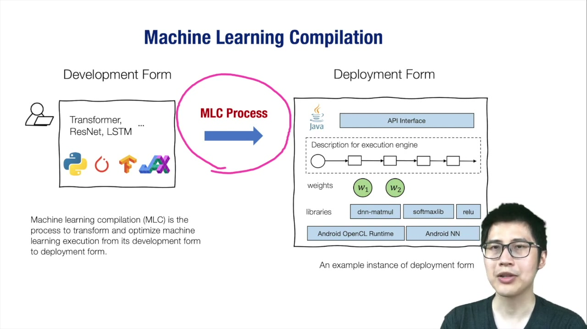

One goal is to integrate useful implementations from frameworks, vendor libraries, generated kernels, and system runtimes while carrying only the dependencies needed by the model. A deployment artifact should be complete enough to run but avoid shipping an entire development framework when only a small operator subset is required.

This matters for binary size, portability, security surface, startup cost, and maintainability.

### Slide 8 — Goal: leverage native acceleration ([00:15:00](https://www.youtube.com/watch?v=Oc_wVXdnrrM&t=900s))

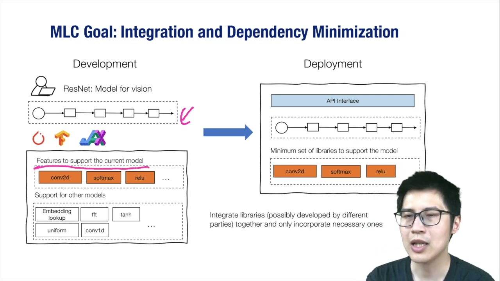

MLC should exploit target-native capabilities such as vector instructions, GPU kernels, tensor cores, specialized matrix engines, and vendor libraries. The best implementation depends on tensor shapes, data types, memory hierarchy, and available hardware.

The compiler therefore needs both portable representations and target-aware lowering or library selection.

### Slide 9 — Goal: optimization in general ([00:16:00](https://www.youtube.com/watch?v=Oc_wVXdnrrM&t=960s))

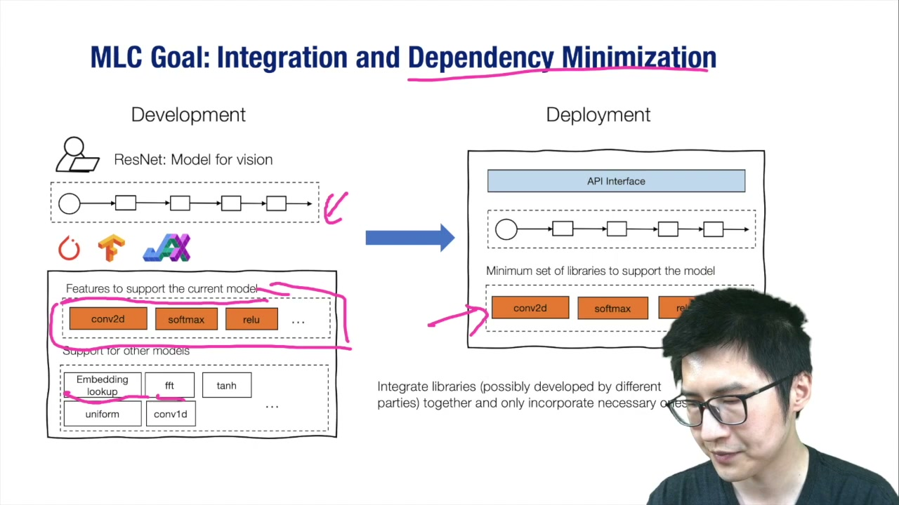

Deployment optimization is multi-objective. A data-center service may prioritize throughput; an interactive application may prioritize latency; a phone may prioritize memory and energy; a distributed workload may prioritize communication and scaling.

MLC exposes transformations and search spaces that can optimize for the metric relevant to a deployment rather than assuming one universal optimum.

### Slide 10 — Remarks on “compilation” ([00:17:30](https://www.youtube.com/watch?v=Oc_wVXdnrrM&t=1050s))

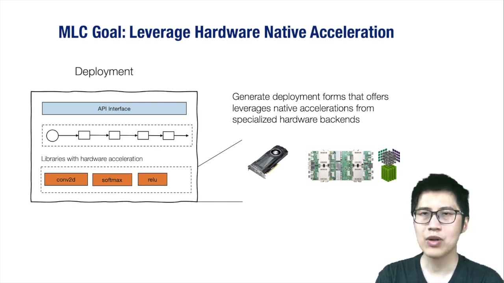

The term is analogous to a traditional compiler transforming a development program into a deployable artifact. However, MLC need not end in newly generated assembly. It may rewrite graphs, fuse tensor functions, specialize shapes, tune schedules, select vendor libraries, package runtimes, or generate low-level code.

The development and deployment forms can even use the same framework interface; what matters is the transformation of representation, dependencies, and implementation choices.

## Why study MLC?

### Slide 11 — Deployment tools and framework understanding ([00:21:00](https://www.youtube.com/watch?v=Oc_wVXdnrrM&t=1260s))

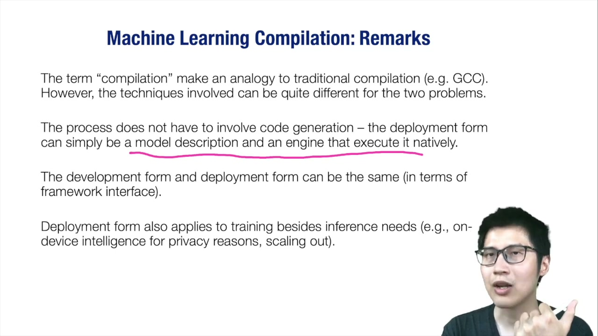

The first reason is practical: deploying models efficiently requires tools that bridge frameworks and production targets. The second is that modern frameworks increasingly incorporate tracing, graph capture, automatic differentiation, fusion, code generation, and runtime specialization.

Understanding these mechanisms helps ML practitioners extend frameworks with new operators or model structures while retaining system-level performance.

### Slide 12 — Emerging hardware and full-stack understanding ([00:23:00](https://www.youtube.com/watch?v=Oc_wVXdnrrM&t=1380s))

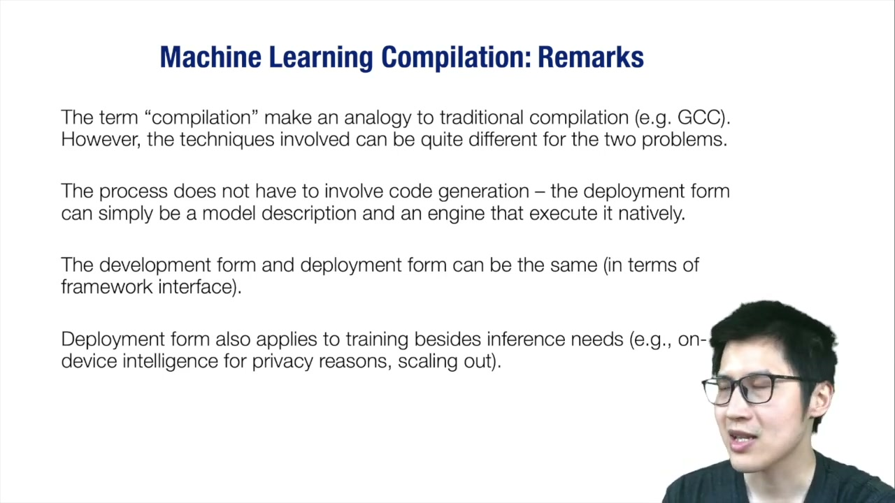

The third reason is the rapid growth of specialized ML hardware. New accelerators are useful only when software can map models to their memory systems and primitives. MLC provides reusable abstractions for building those stacks.

The fourth reason is intellectual and practical: following a model from a high-level definition through tensor transformations, runtime code, and hardware execution gives a full-stack understanding and enables new optimizations.

## Key elements

### Slide 13 — Technical outline ([00:25:30](https://www.youtube.com/watch?v=Oc_wVXdnrrM&t=1530s))

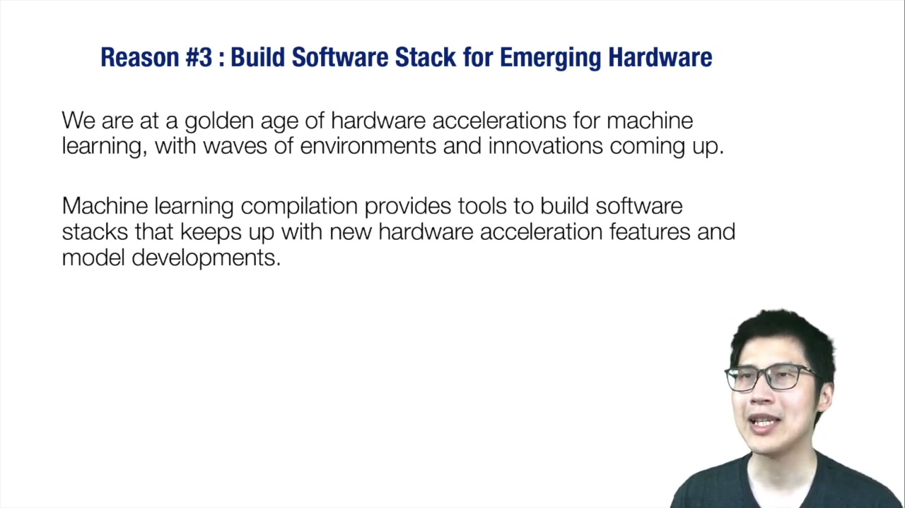

The lecture transitions from motivation to two foundational objects:

1. **Tensors**, which hold model inputs, outputs, parameters, and intermediate values.
2. **Tensor functions**, which compute output tensors from input tensors.

MLC repeatedly changes the representation and implementation of these functions while preserving their intended semantics.

### Slide 14 — Tensors and tensor functions ([00:29:00](https://www.youtube.com/watch?v=Oc_wVXdnrrM&t=1740s))

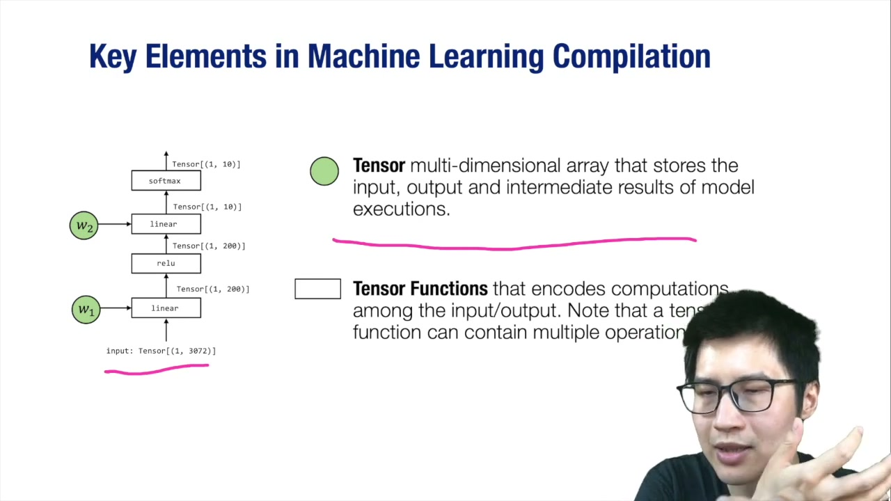

A tensor is a typed multidimensional array. The example network flattens a $32\times32\times3$ image into shape $[1,3072]$, projects it to an intermediate $[1,200]$ tensor, and produces $[1,10]$ class scores.

A tensor function describes a relationship such as

$$
Y=\operatorname{ReLU}(XW^T+b).
$$

It may represent a single operator or a fused region. Tensor shapes and data types are part of the information needed for validation, specialization, memory planning, and implementation selection.

### Slide 15 — Example compilation process ([00:34:00](https://www.youtube.com/watch?v=Oc_wVXdnrrM&t=2040s))

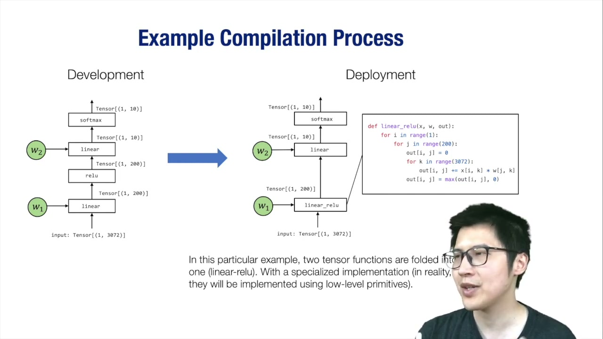

The development graph contains separate linear, ReLU, linear, and softmax operations. An MLC transformation can fuse the first linear operation with ReLU into a `linear_relu` tensor function. A deployment implementation then realizes that function using explicit loops, generated kernels, or an optimized library.

Fusion can avoid writing and rereading an intermediate tensor, improve locality, and expose a larger unit for scheduling. It must still preserve model semantics and account for target constraints.

### Slide 16 — Abstraction and implementation ([00:38:00](https://www.youtube.com/watch?v=Oc_wVXdnrrM&t=2280s))

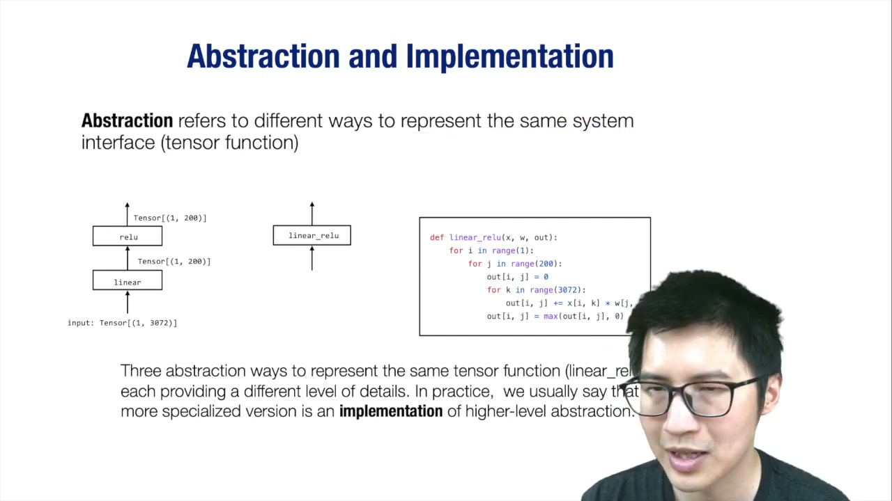

The same tensor function can appear as separate graph nodes, a fused node, a loop program, or a hardware primitive. These are different **abstractions**: interfaces that expose some properties and hide others.

An **implementation** is a concrete realization under a chosen abstraction. A high-level graph is good for model-wide rewrites; loops expose memory access and scheduling; hardware primitives expose accelerator-specific opportunities. No single representation is best for every transformation.

### Slide 17 — MLC as tensor-function transformation ([00:41:00](https://www.youtube.com/watch?v=Oc_wVXdnrrM&t=2460s))

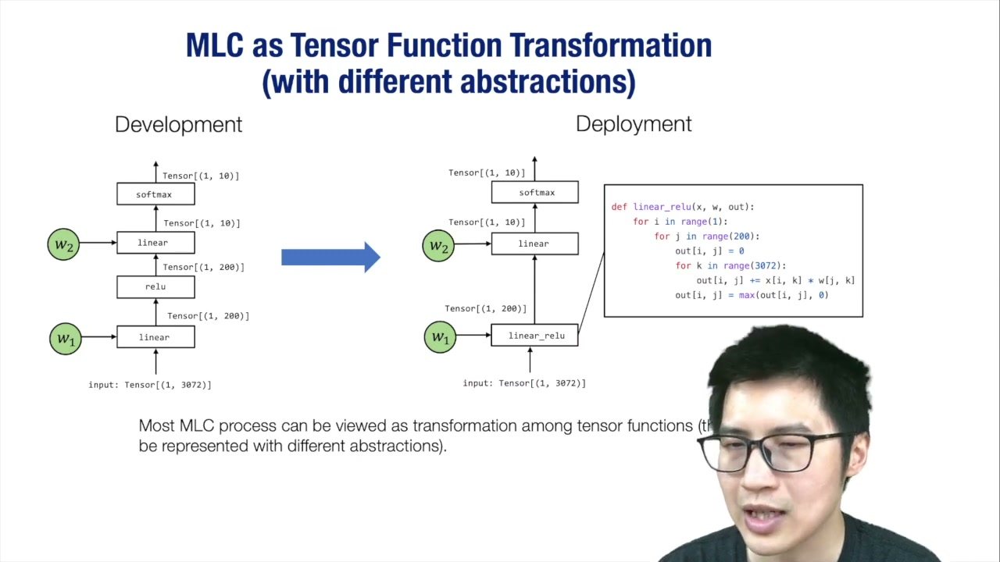

The unifying view is:

> Machine learning compilation transforms tensor functions represented through different abstractions.

A pipeline may import framework operations, rewrite a computational graph, lower fused regions into tensor programs, tune schedules, replace functions with library calls, and finally map operations to hardware primitives. Each step changes what details are explicit while maintaining an equivalence contract.

### Slide 18 — Four categories of abstractions ([00:43:00](https://www.youtube.com/watch?v=Oc_wVXdnrrM&t=2580s))

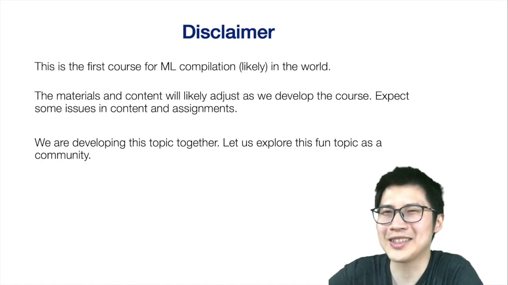

The course will revisit four categories:

| Category | Represents | Typical use |
|---|---|---|
| Computational graphs | Dependencies among high-level tensor operators | Graph rewriting, fusion, layout planning |
| Tensor programs | Explicit loop and tensor computations | Scheduling, tiling, vectorization, memory optimization |
| Libraries and runtimes | Reusable implementations and execution services | Operator dispatch, packaging, device/runtime integration |
| Hardware primitives | Instructions and accelerator operations | Target-specific lowering and code generation |

Effective MLC moves between these layers rather than trying to solve all problems in one IR.

### Slide 19 — Course logistics and summary ([00:46:00](https://www.youtube.com/watch?v=Oc_wVXdnrrM&t=2760s))

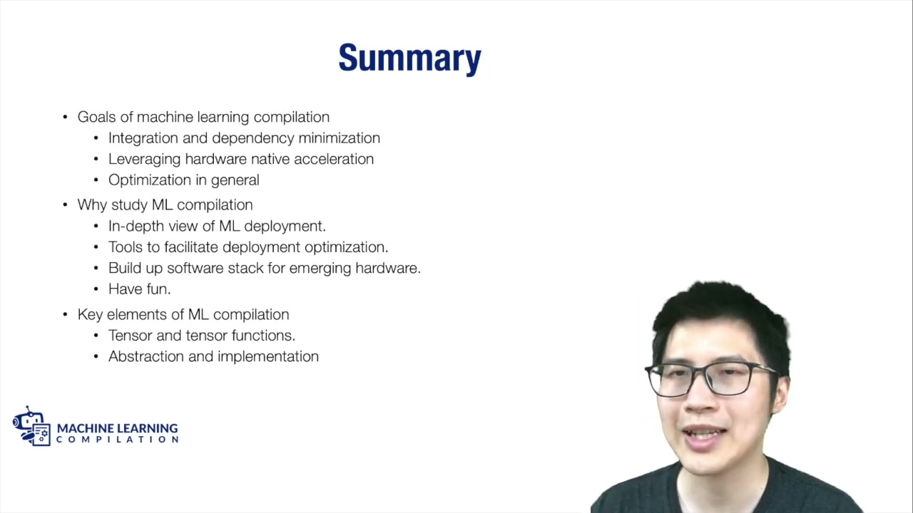

The course is presented as an early comprehensive treatment of a developing field, so materials may evolve. Lectures, code exercises, and discussions are intended to build the subject collaboratively.

The main conclusions are:

- MLC bridges diverse model-development frameworks and heterogeneous deployment environments.
- Its goals include integration, dependency minimization, hardware acceleration, and deployment-specific optimization.
- Tensors and tensor functions provide the core semantic objects.
- Compilation is a sequence of transformations across multiple abstractions and implementations.

## Key takeaways

1. ML deployment is a many-model-to-many-target systems problem.
2. Development form prioritizes model construction; deployment form packages efficient execution for a target.
3. MLC includes graph rewriting, library selection, runtime integration, tuning, and code generation.
4. Dependency minimization reduces deployment footprint and complexity.
5. Hardware-native acceleration requires target-aware representations and implementations.
6. Optimization objectives can include latency, throughput, memory, energy, and distributed scaling.
7. A tensor is a typed multidimensional array holding model state and intermediate results.
8. A tensor function maps input tensors to output tensors and is the main semantic unit of transformation.
9. Operator fusion can remove intermediates and improve locality.
10. Abstractions expose different details of the same computation.
11. Implementations specialize an abstraction for a concrete execution strategy.
12. Computational graphs, tensor programs, libraries/runtimes, and hardware primitives form complementary layers.
13. MLC provides the software bridge needed to make emerging accelerators useful.
14. Understanding the full stack enables both framework extensions and deployment optimization.