# Summary and Future Directions - Episode 10

**Course:** Machine Learning Compilation, Summer 2022  
**Instructor:** Tianqi Chen  
**Video:** [YouTube lecture](https://www.youtube.com/watch?v=2R2TOSwPJvc) (27:38)

The final episode synthesizes the course around two ideas: **IRModule is the noun** that holds programs at multiple abstraction levels, and **transformations are the verbs** that move those programs from development to deployment. It closes with a vision for interactive, feedback-driven, collaborative ML compilation.

## Course synthesis

### Slide 1 — Summary and future directions ([00:00:05](https://www.youtube.com/watch?v=2R2TOSwPJvc&t=5s))

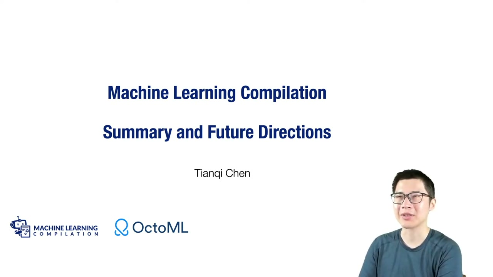

Tianqi Chen opens the last lecture by thanking participants and reflecting on the first iteration of the course. The objective is not to enumerate every compiler technique, but to connect the principles used across the episodes and identify directions still requiring research and engineering.

### Slide 2 — Machine learning compilation process ([00:01:30](https://www.youtube.com/watch?v=2R2TOSwPJvc&t=90s))

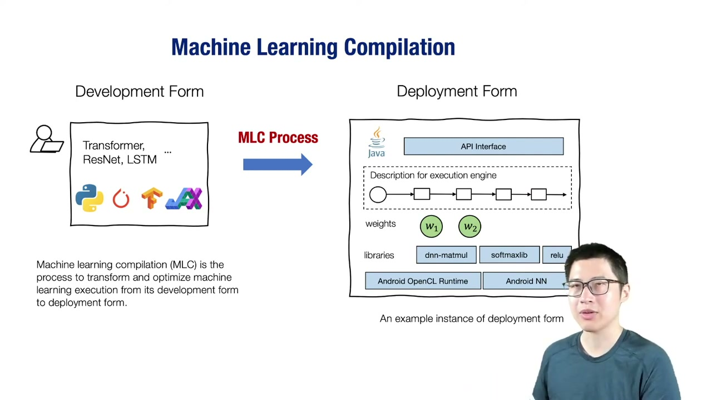

MLC transforms a model from a **development form**—for example PyTorch, TensorFlow, or JAX—into a **deployment form** suited to a runtime and target. Deployment may require a smaller dependency set, graph restructuring, target libraries, generated kernels, memory planning, and APIs such as OpenCL, NNAPI, Metal, CUDA, or CPU instruction sets.

The deployment form is not universal: it is chosen for a model, target, and operational goal.

### Slide 3 — Key elements: tensors and tensor functions ([00:04:00](https://www.youtube.com/watch?v=2R2TOSwPJvc&t=240s))

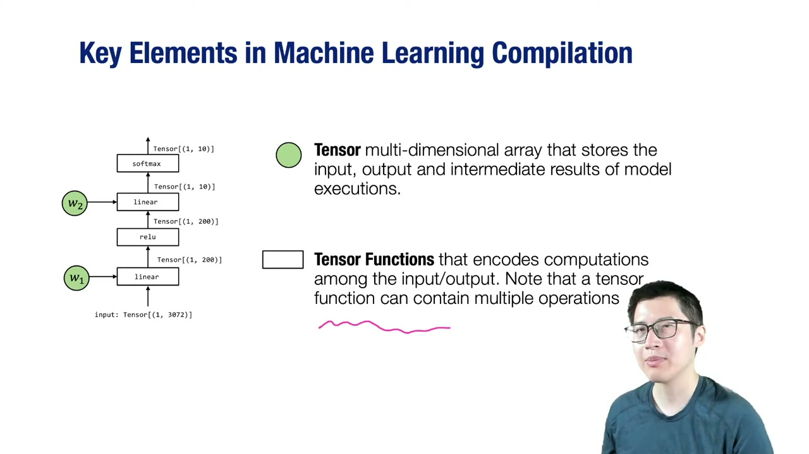

Tensors hold inputs, parameters, outputs, and intermediate values. Tensor functions describe computation among those tensors. The course encountered the same function at several levels:

| Form | Exposes |
|---|---|
| Computational graph | Operator dependencies and model dataflow |
| Tensor program | Loops, buffers, blocks, and memory access |
| Scheduled CPU/GPU program | Parallel mapping, locality, vectorization |
| Specialized implementation | Libraries, microkernels, tensor instructions |

These are related representations of computation, not disconnected topics.

### Slide 4 — MLC as tensor-function transformation ([00:06:00](https://www.youtube.com/watch?v=2R2TOSwPJvc&t=360s))

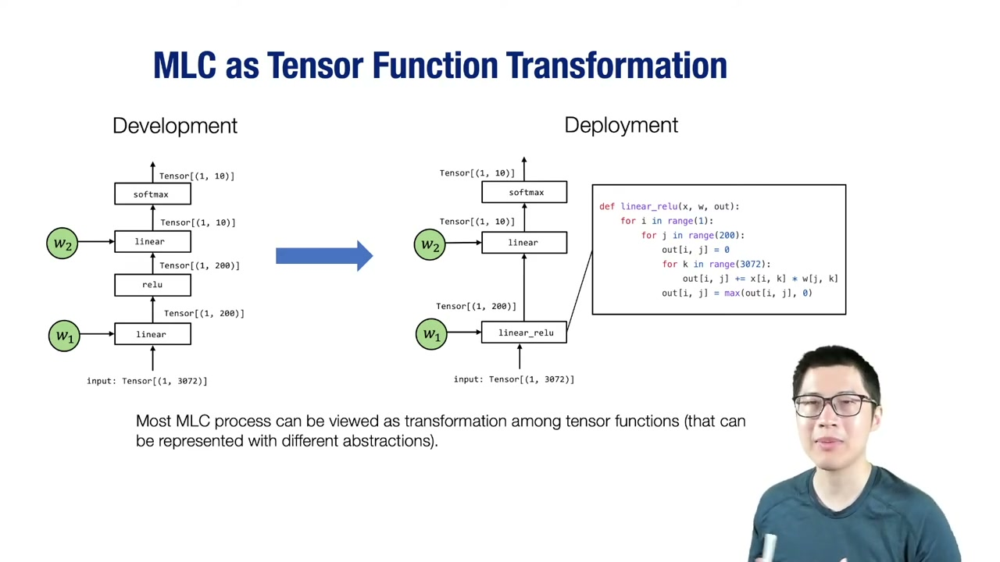

The central MLC activity is transforming tensor functions while preserving required semantics. Examples from the course include graph fusion, loop splitting and reordering, GPU thread binding, shared-memory staging, tensorization, parameter binding, and framework import.

The transformation can change abstraction level or stay within one level. Its correctness contract is semantic equivalence under the model's numerical and deployment requirements.

### Slide 5 — Development and deployment representations ([00:07:00](https://www.youtube.com/watch?v=2R2TOSwPJvc&t=420s))

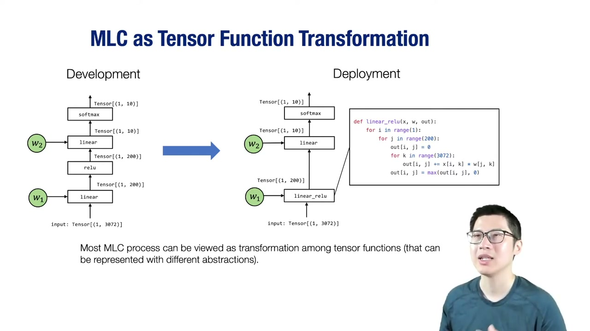

A high-level two-layer network may become a graph with fused regions, then TensorIR loops, then target code or library calls. Questions such as whether to fuse linear-plus-ReLU, use AVX instructions, launch CUDA kernels, or dispatch to a vendor library are deployment decisions made through transformations and lowering.

### Slide 6 — Overall MLC workflow ([00:08:11](https://www.youtube.com/watch?v=2R2TOSwPJvc&t=491s))

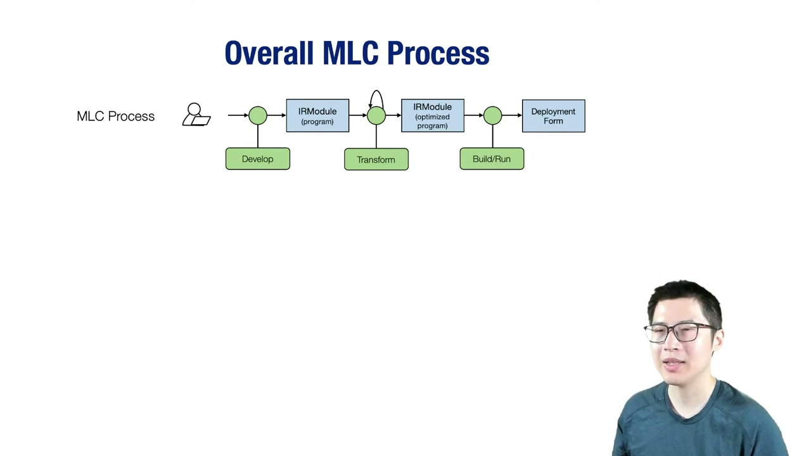

The course workflow is:

$$
Development\rightarrow Import/Represent\rightarrow Transform^*\rightarrow Build\rightarrow Run.
$$

Breaking the process into passes means one step can handle graph fusion, another memory layout, another primitive scheduling, and another target code generation. No single transformation needs to solve the entire deployment problem.

### Slide 7 — IRModule: the noun ([00:08:33](https://www.youtube.com/watch?v=2R2TOSwPJvc&t=513s))

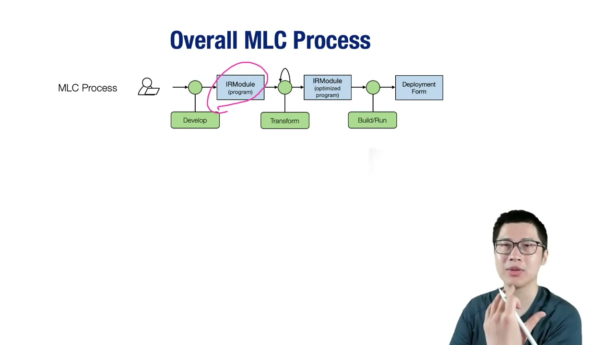

`IRModule` is the shared data structure flowing through MLC. It can contain Relax graph functions, TensorIR PrimFuncs, generated primitive sub-functions, and declarations or calls for external libraries. Keeping multiple abstraction levels together enables gradual lowering and cross-level transformations.

An IRModule is inspectable and serializable, allowing each intermediate stage to be understood rather than hidden behind a monolithic compiler call.

### Slide 8 — Transformations: the verbs ([00:15:47](https://www.youtube.com/watch?v=2R2TOSwPJvc&t=947s))

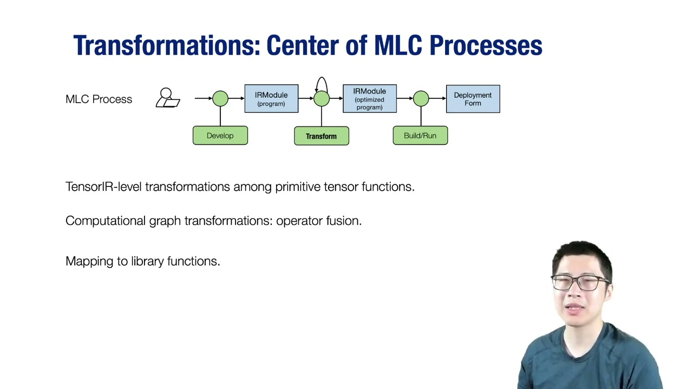

A transformation maps one module to another:

$$
T: IRModule\rightarrow IRModule.
$$

The system becomes extensible when transformations are modular, composable, and independently testable. New graph rewriters, schedule rules, target mappings, and optimizers can be added without replacing the representation or rebuilding the entire stack.

### Slide 9 — Conventional ML framework pipeline ([00:16:07](https://www.youtube.com/watch?v=2R2TOSwPJvc&t=967s))

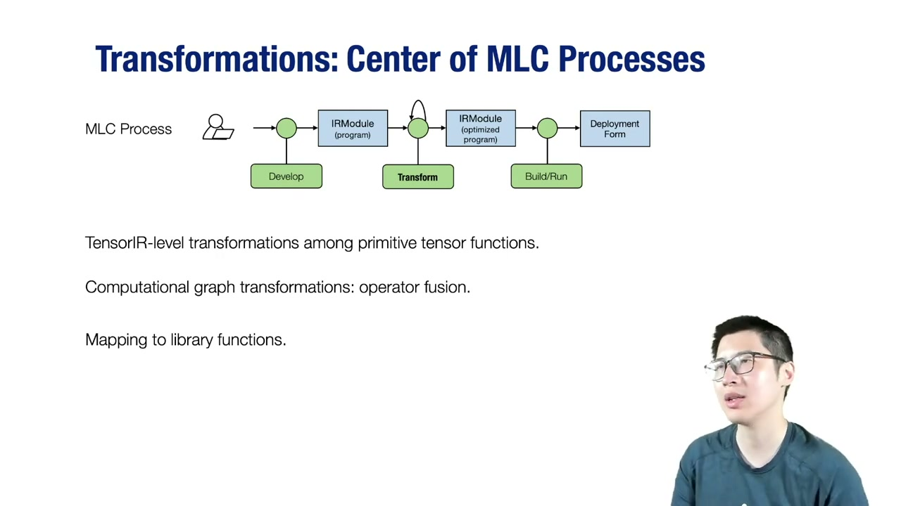

A conventional framework often imports a model to a computational graph, rewrites/fuses the graph, maps operators to optimized library calls, and executes through a runtime. This multi-stage lowering is effective but is often presented as a black box.

MLC retains the useful staged structure while exposing representations and transformations so developers can inspect, replace, or combine them.

### Slide 10 — Interactive transformation process ([00:19:10](https://www.youtube.com/watch?v=2R2TOSwPJvc&t=1150s))

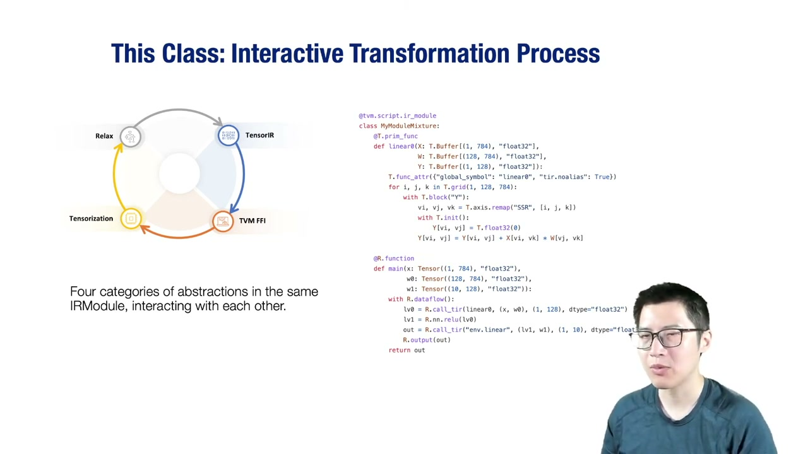

The course advocates a Python-first interactive workflow: inspect TVM Script in a notebook, apply one transformation, print the result, build, measure, and iterate. This is valuable because ML engineers and hardware specialists often possess domain knowledge that a fully automatic compiler lacks.

Interactivity is not a substitute for automation. It is a way to develop, debug, and compose transformations before incorporating them into repeatable passes and search systems.

## Future directions

### Slide 11 — Feedback and cross-layer optimization ([00:22:08](https://www.youtube.com/watch?v=2R2TOSwPJvc&t=1328s))

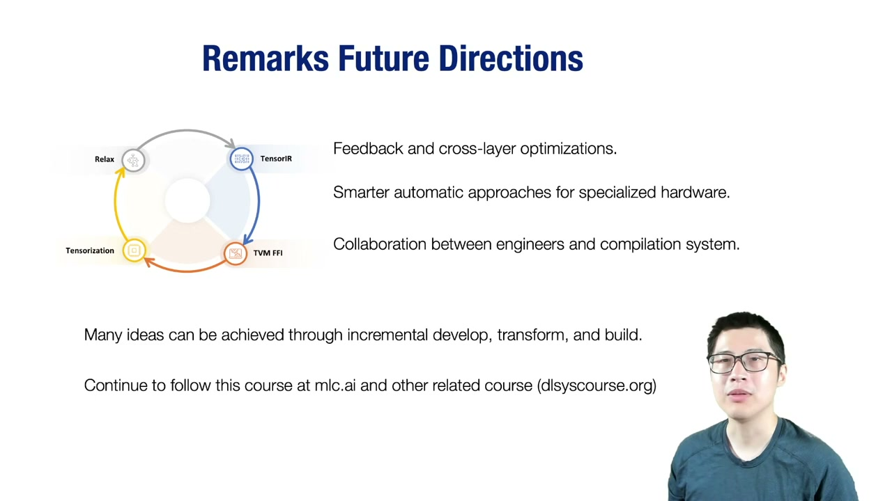

Future MLC systems should reduce rigid boundaries between graph lowering, primitive scheduling, and hardware mapping. A tensor-level layout choice can affect graph fusion; a hardware constraint can change operator boundaries; measurements can feed back into earlier decisions.

Promising directions include:

- feedback and cost models across optimization layers,
- more automatic support for specialized hardware,
- searchable transformations spanning graphs and tensor programs,
- reuse of expert microkernels and libraries,
- collaboration interfaces where engineers provide constraints or hints.

These are forward-looking goals rather than solved capabilities.

### Slide 12 — Collaboration and closing ([00:26:20](https://www.youtube.com/watch?v=2R2TOSwPJvc&t=1580s))

The final vision is collaborative. Compiler developers contribute representations and passes; hardware vendors describe targets and intrinsics; HPC experts contribute kernels; ML practitioners supply model knowledge and deployment goals; automatic systems search and measure alternatives.

The lecture closes by inviting continued participation through mlc.ai and Apache TVM. MLC is framed as an evolving systems discipline whose abstractions and workflows should become a standard part of efficient ML development.

## Key takeaways

1. MLC transforms models from development form to target-specific deployment form.
2. Tensors hold values; tensor functions encode computation among them.
3. Graphs, tensor programs, schedules, and hardware primitives are complementary abstractions.
4. MLC is primarily transformation among tensor-function representations.
5. The overall flow is import, represent, transform, build, and run.
6. IRModule is the central noun containing programs at multiple abstraction levels.
7. Transformations are composable verbs mapping IRModule to IRModule.
8. Graph fusion, scheduling, tensorization, and library mapping solve different layers.
9. Exposed intermediate representations make compilation inspectable and extensible.
10. Interactive notebooks help develop and debug transformations.
11. Automation, measurement, and human guidance should complement one another.
12. Cross-layer feedback is important for specialized hardware and layout decisions.
13. Modular passes enable collaboration across framework, compiler, and hardware teams.
14. The field remains open, especially in search, cost modeling, and heterogeneous deployment.