# Tensor Program Abstraction - Episode 2

**Course:** Machine Learning Compilation, Summer 2022  
**Instructor:** Tianqi Chen  
**Video:** [YouTube lecture](https://www.youtube.com/watch?v=H0UrECDLHMc) (47:53)  
**Course materials:** [Episode notes](https://mlc.ai/chapter_tensor_program/) · [Episode slides](https://mlc.ai/summer22/slides/2-TensorProgram.pdf) · [Notebook](https://github.com/mlc-ai/notebooks/blob/main/2_tensor_program_abstraction.ipynb)

These notes follow the lecture's conceptual slides and notebook demonstration. The central distinction is between a primitive tensor function's semantics—what it computes—and its implementation schedule—how loops and buffers realize that computation.

## Primitive tensor functions

### Slide 1 — Tensor Program Abstraction ([00:00:05](https://www.youtube.com/watch?v=H0UrECDLHMc&t=5s))

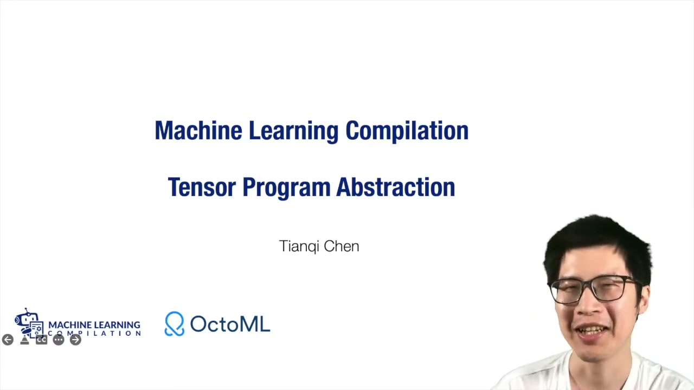

Episode 2 introduces tensor programs: representations of primitive tensor computations that expose loops, buffers, and statements to systematic compiler transformations. The goal is to optimize one computational unit while preserving its tensor-level meaning.

### Slide 2 — Recap: tensors and tensor functions ([00:00:35](https://www.youtube.com/watch?v=H0UrECDLHMc&t=35s))

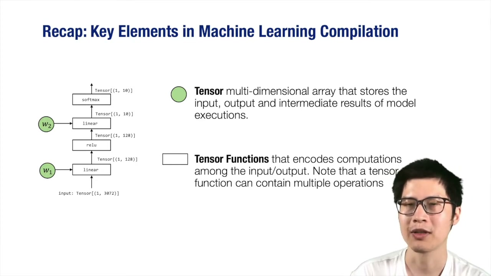

A tensor is a typed multidimensional array holding inputs, parameters, outputs, or intermediates. A tensor function maps input tensors to output tensors and may contain several operations. MLC transforms these functions across different abstraction levels.

### Slide 3 — Primitive tensor function ([00:01:30](https://www.youtube.com/watch?v=H0UrECDLHMc&t=90s))

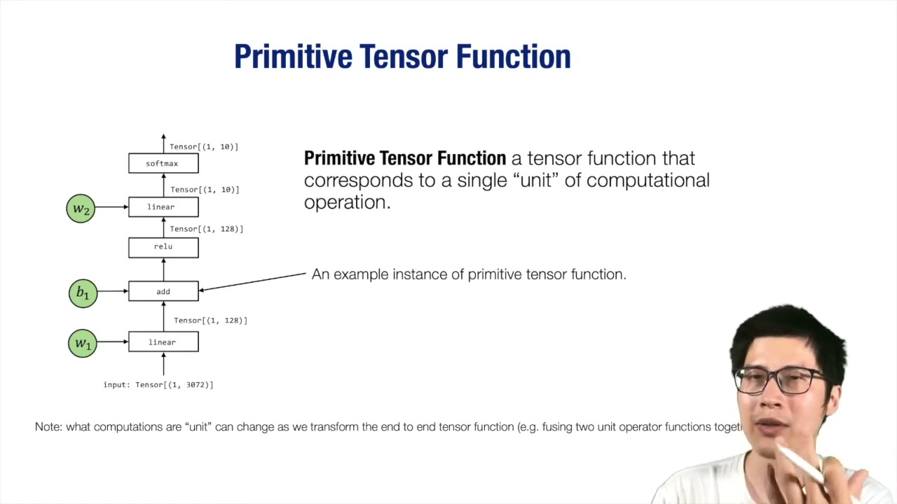

A **primitive tensor function** is one computational unit within a model. A graph may contain primitive functions for matrix multiplication, bias addition, activation, or softmax. “Primitive” is relative to the current abstraction: internally, the function may still contain many loop iterations and scalar operations.

### Slide 4 — Primitive functions in ML frameworks ([00:03:30](https://www.youtube.com/watch?v=H0UrECDLHMc&t=210s))

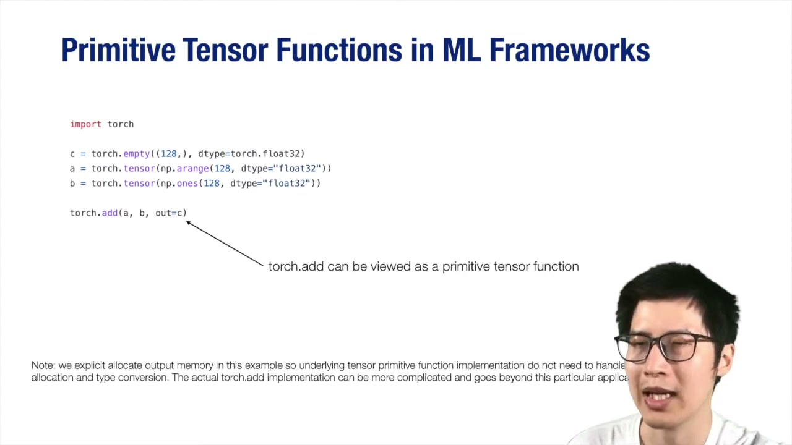

Framework calls such as `torch.add(a, b)` present vector addition as one operator. The framework handles output allocation, shape/type checking, dispatch, and implementation selection. This interface is convenient but hides the loops and memory behavior needed for fine-grained optimization.

### Slide 5 — Abstractions for one primitive function ([00:05:00](https://www.youtube.com/watch?v=H0UrECDLHMc&t=300s))

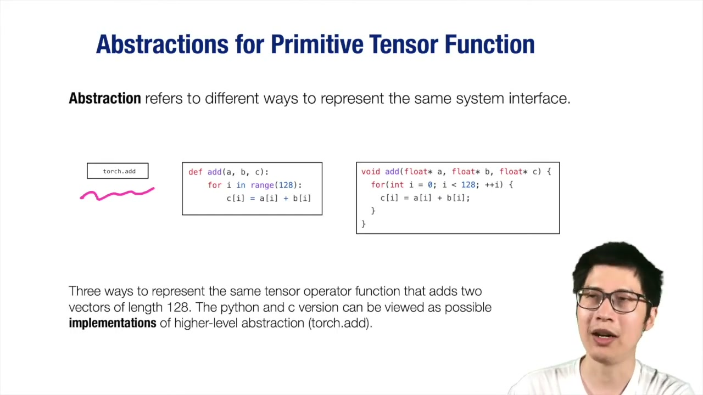

The same vector addition can be represented as a library call, explicit Python-style loops, or lower-level C-like code. These representations have the same external tensor semantics but reveal different implementation details. Higher levels are concise; lower levels expose memory access, loop order, parallelism, and vectorization.

### Slide 6 — MLC through primitive-function transformation ([00:07:30](https://www.youtube.com/watch?v=H0UrECDLHMc&t=450s))

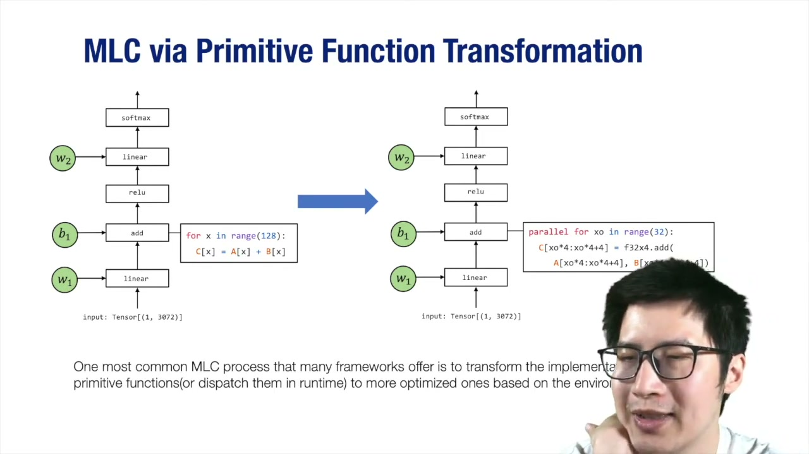

MLC can replace a primitive function with an equivalent implementation better suited to the target. One implementation may execute a scalar loop; another may split work into chunks, vectorize inner operations, or distribute outer iterations across threads. The input/output contract remains unchanged.

### Slide 7 — Transformation approaches ([00:10:00](https://www.youtube.com/watch?v=H0UrECDLHMc&t=600s))

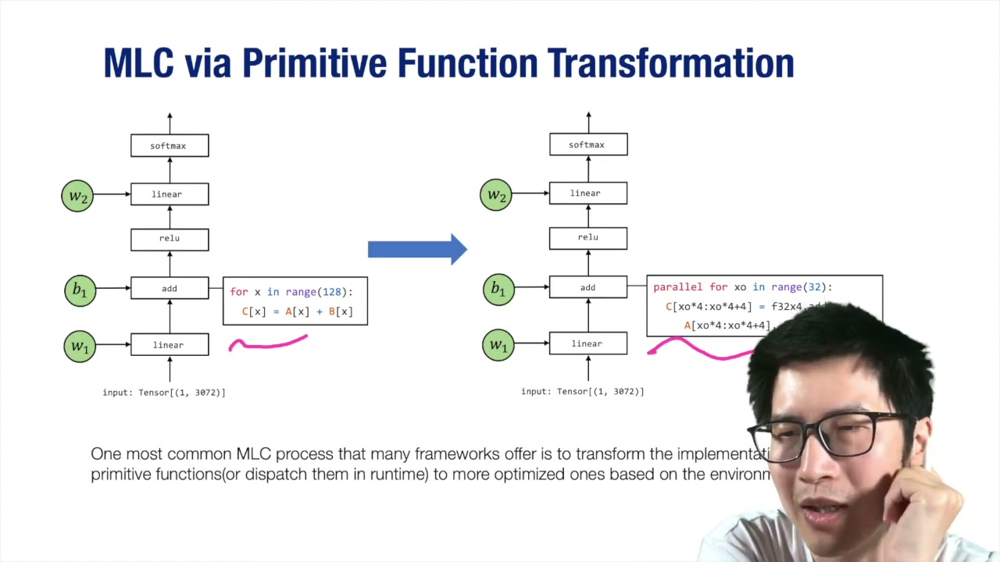

Two broad approaches are:

1. **Library mapping:** select a pre-optimized implementation such as a CPU BLAS or CUDA library routine.
2. **Program transformation:** manipulate loops and memory organization to generate an implementation.

Libraries provide strong known kernels; transformations offer portability, specialization, and a search space for shapes or hardware not covered by a library.

## Tensor program abstraction

### Slide 8 — Outline ([00:12:30](https://www.youtube.com/watch?v=H0UrECDLHMc&t=750s))

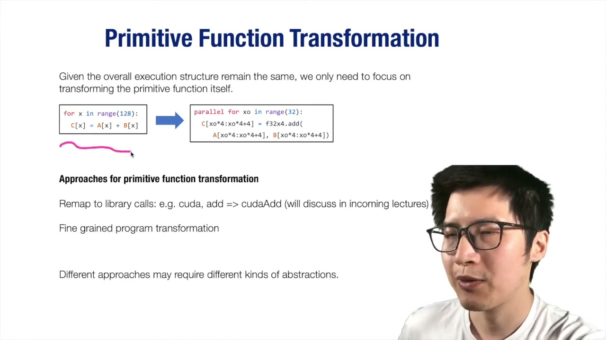

The remainder of the lecture defines the tensor program abstraction, demonstrates loop transformations, explains legality constraints, and then applies those ideas with TVM Script and the schedule API.

### Slide 9 — Key elements of a tensor program ([00:13:30](https://www.youtube.com/watch?v=H0UrECDLHMc&t=810s))

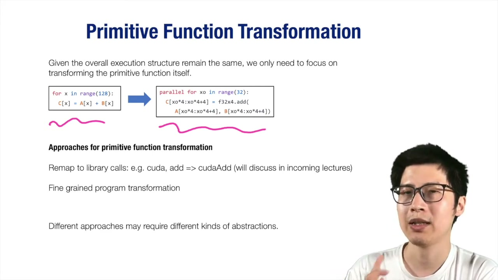

A tensor program contains:

| Element | Role |
|---|---|
| Multidimensional buffers | Hold inputs, outputs, and temporary values |
| Loop nests | Enumerate tensor dimensions and reduction axes |
| Compute statements | Read buffer elements, calculate values, and write results |

For vector addition, the semantic rule is $C[i]=A[i]+B[i]$ for every valid $i$; many loop structures can implement that rule.

### Slide 10 — Why use this abstraction? ([00:15:00](https://www.youtube.com/watch?v=H0UrECDLHMc&t=900s))

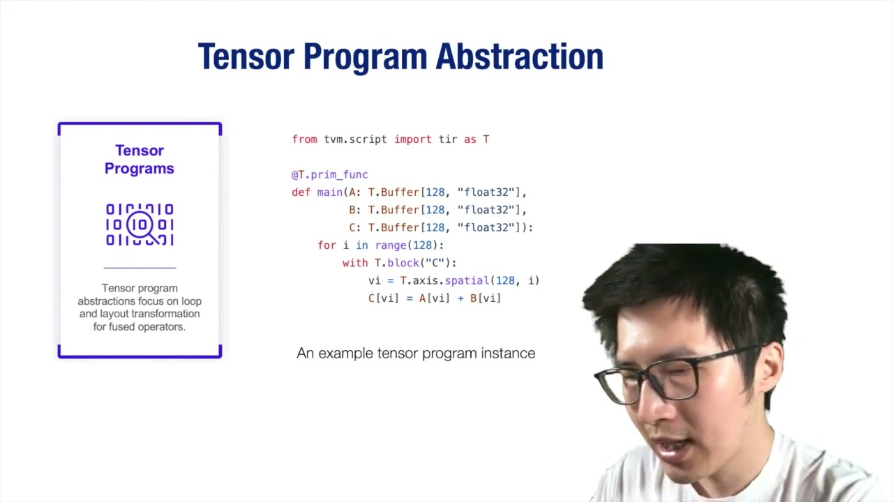

The representation is designed not merely to describe code but to support reusable transformations. A compiler can explore split factors, orders, parallel mappings, and memory placements programmatically instead of requiring a handwritten kernel for every operator–hardware combination.

### Slide 11 — Loop splitting ([00:17:00](https://www.youtube.com/watch?v=H0UrECDLHMc&t=1020s))

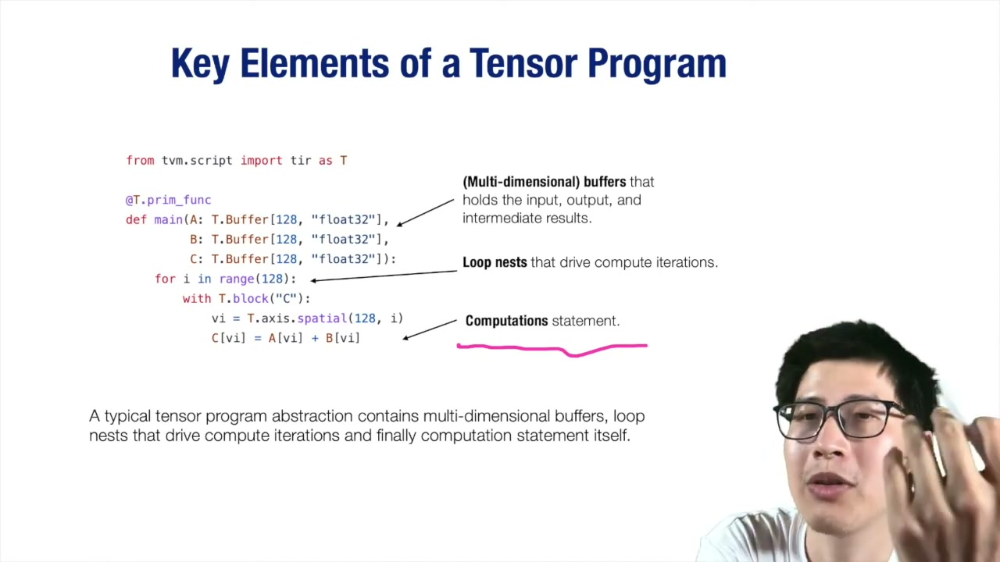

Splitting decomposes one loop into outer and inner loops. For extent 128 and factor 4:

$$
i_o\in[0,32),\qquad i_i\in[0,4),\qquad i=4i_o+i_i.
$$

The same 128 points execute, but the hierarchy creates units suitable for vector lanes, tiles, thread blocks, or further transformations. Non-divisible extents require predicates or rounded bounds.

### Slide 12 — Loop reorder ([00:18:30](https://www.youtube.com/watch?v=H0UrECDLHMc&t=1110s))

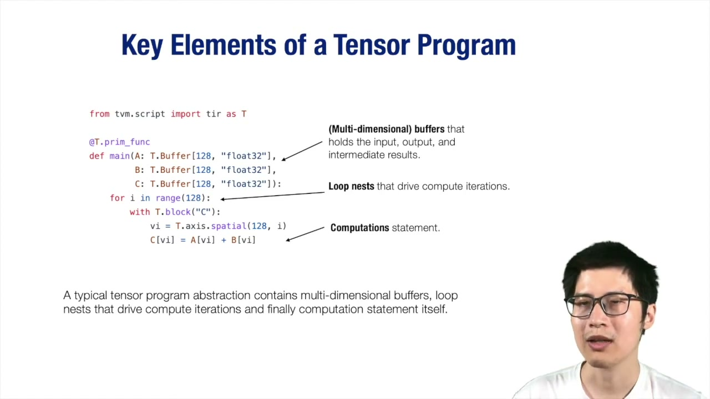

Reordering exchanges loop nesting order. If iterations are independent, `(i, j)` and `(j, i)` enumerate the same points but produce different memory traversal and reuse. A favorable order can make accesses contiguous, retain data in cache, or expose parallel dimensions.

### Slide 13 — Thread binding ([00:20:30](https://www.youtube.com/watch?v=H0UrECDLHMc&t=1230s))

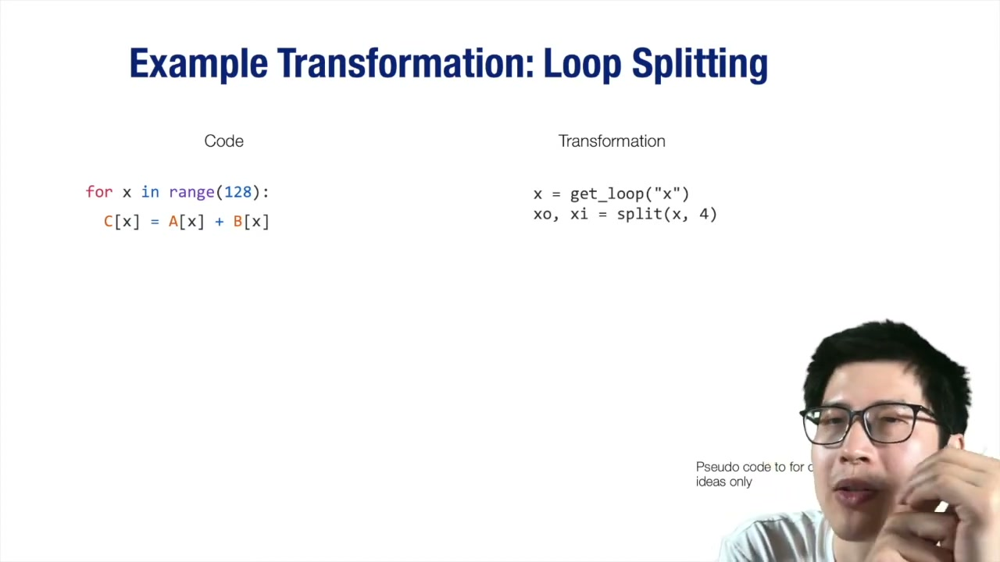

Thread binding maps a logical loop to a hardware execution axis such as a GPU block or thread. After splitting, an outer loop can select blocks and an inner loop can select lanes. Binding changes the execution mechanism, so the mapped iterations must be independent or synchronized correctly.

### Slide 14 — Transformations must be legal ([00:22:00](https://www.youtube.com/watch?v=H0UrECDLHMc&t=1320s))

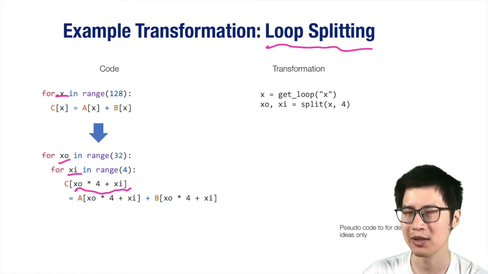

Loops cannot be transformed arbitrarily. A loop-carried dependence exists when one iteration consumes a value produced by another; reordering or parallelizing those iterations can change results. A legal transformation must preserve reads, writes, ordering constraints, and reduction semantics.

### Slide 15 — Blocks and iterator annotations ([00:24:00](https://www.youtube.com/watch?v=H0UrECDLHMc&t=1440s))

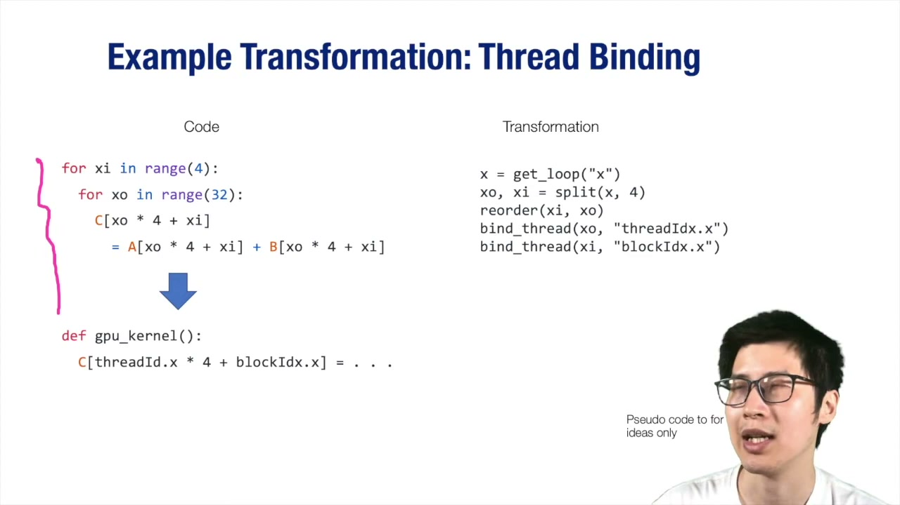

Tensor programs add blocks and annotations that make structure explicit. A block identifies a computation region, its spatial or reduction iterators, and its read/write regions. In TVM Script, `T.axis.spatial` indicates an output dimension whose iterations are logically independent; reduction axes carry different update semantics.

This information helps the scheduler validate transformations without reconstructing intent from arbitrary low-level code.

## Transformation in action

### Slide 16 — Notebook setup ([00:26:00](https://www.youtube.com/watch?v=H0UrECDLHMc&t=1560s))

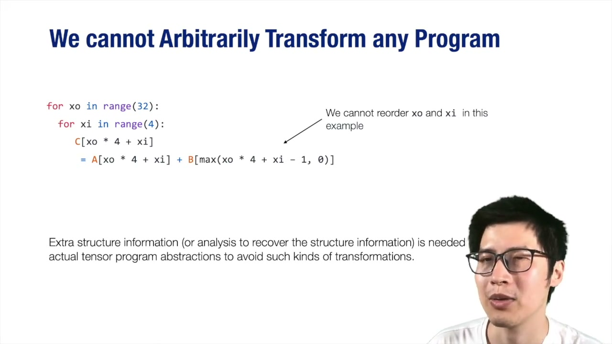

The demonstration uses TVM Script, a Python syntax for constructing tensor IR, and the TVM schedule API. The notebook installs/imports the MLC/TVM package, defines a primitive function, inspects its IR, applies transformations, builds native code, and verifies the result.

### Slide 17 — Construct an IRModule ([00:28:00](https://www.youtube.com/watch?v=H0UrECDLHMc&t=1680s))

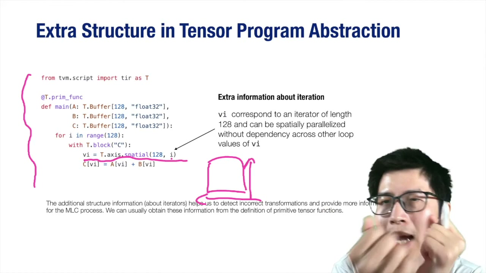

A decorated TVM Script function describes buffers, loops, and a compute block. It is placed in an `IRModule`, the container passed between compiler transformations. Printing `.script()` reveals normalized block metadata, including axis bindings and inferred read/write regions.

### Slide 18 — Build and execute the baseline ([00:30:00](https://www.youtube.com/watch?v=H0UrECDLHMc&t=1800s))

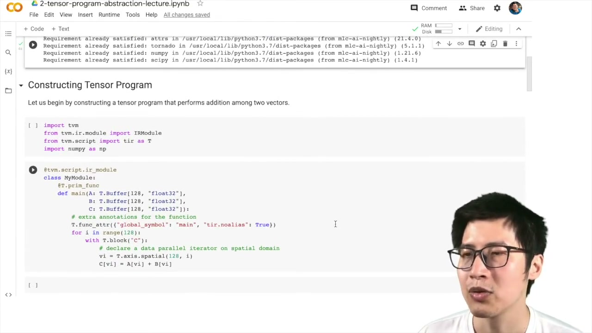

The untransformed module can be built for an LLVM CPU target and called with allocated input/output arrays. Comparing the result with a NumPy reference establishes semantic correctness before scheduling. This baseline separates “the function is right” from “the function is optimized.”

### Slide 19 — Schedule, block, and loop inspection ([00:34:00](https://www.youtube.com/watch?v=H0UrECDLHMc&t=2040s))

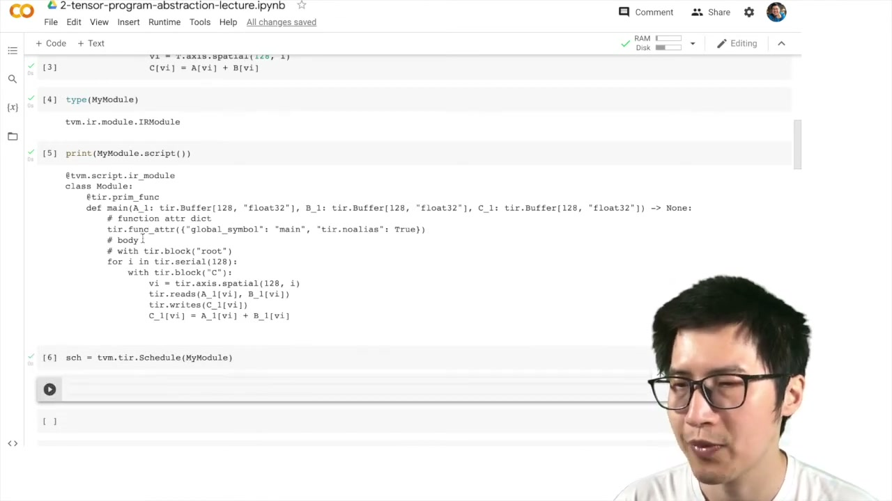

A `tir.Schedule` wraps the module. `get_block` locates the named compute region, and `get_loops` returns surrounding loop handles. Transformations operate on these handles and produce a new scheduled module while retaining the original function contract.

### Slide 20 — Split and reorder in the notebook ([00:39:00](https://www.youtube.com/watch?v=H0UrECDLHMc&t=2340s))

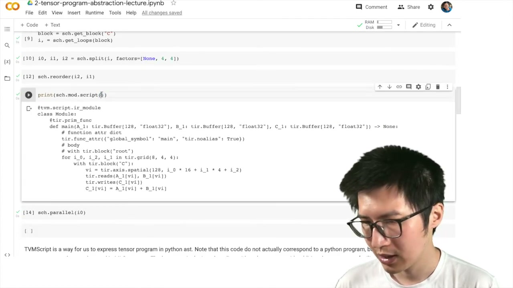

The notebook splits a loop into several factors and then changes their nesting order. For factors with product equal to the original extent, the original index is reconstructed from the mixed-radix coordinates. For example:

$$
i=16i_o+4i_i+i_u
$$

for extents $i_o\in[0,8)$, $i_i\in[0,4)$, and $i_u\in[0,4)$. Reordering these loops changes traversal while preserving the reconstructed index set.

### Slide 21 — Build the transformed program ([00:43:00](https://www.youtube.com/watch?v=H0UrECDLHMc&t=2580s))

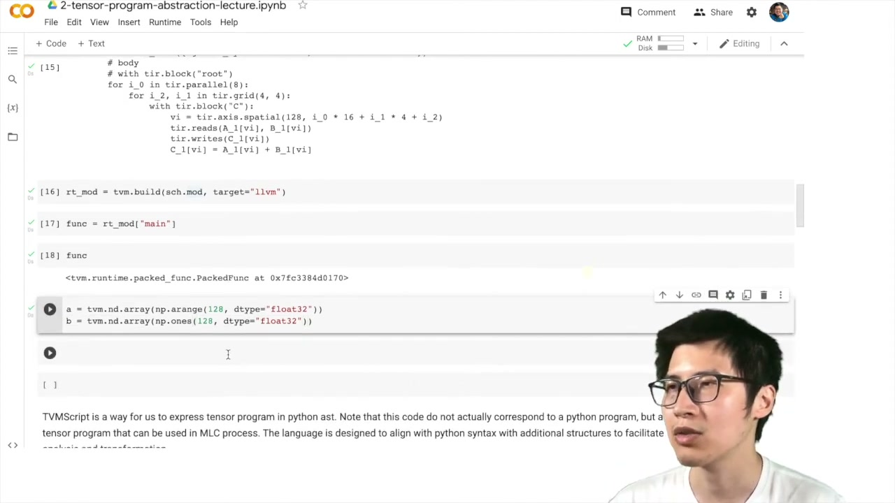

The schedule marks an outer loop parallel, which appears as `T.parallel` in the transformed IR. Building the scheduled module lowers those annotations to a target implementation. The returned runtime module exposes a callable packed function; running it on arrays and comparing against the reference confirms that the transformed schedule remains correct.

### Slide 22 — Summary ([00:47:00](https://www.youtube.com/watch?v=H0UrECDLHMc&t=2820s))

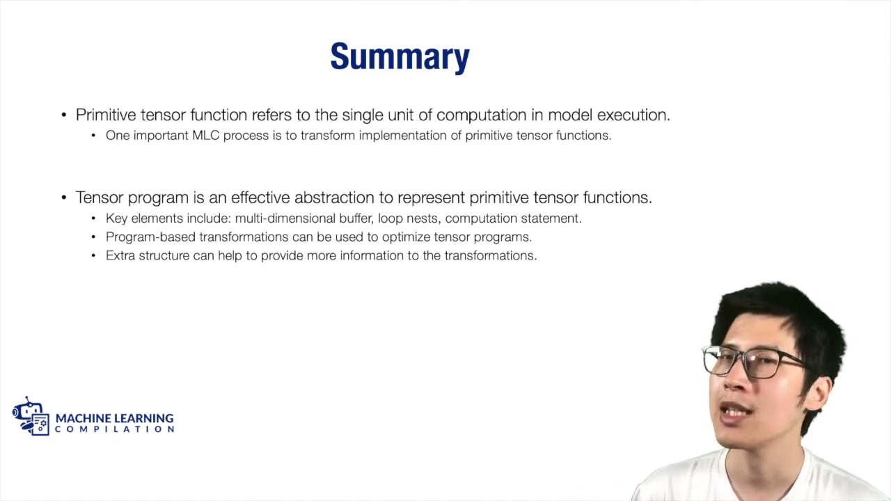

A primitive tensor function is the single-unit computation abstraction in model execution. Tensor programs represent implementations with multidimensional buffers, loop nests, compute blocks, and iterator semantics. MLC optimizes a primitive by applying legal program transformations such as splitting, reordering, parallelization, and hardware binding, then lowering the result to executable code.

## Key takeaways

1. Primitive tensor functions define computation units with stable input/output semantics.
2. One primitive can have library, loop-program, and low-level implementations.
3. Tensor programs expose buffers, loops, statements, and computation blocks.
4. A schedule changes implementation order and mapping without changing intended results.
5. Loop splitting maps $i$ to hierarchical indices such as $i=fi_o+i_i$.
6. Loop reorder changes traversal and locality but is legal only when dependencies permit.
7. Thread binding maps logical loops to hardware parallel axes.
8. Loop-carried dependencies constrain reorder and parallelization.
9. Spatial/reduction annotations and read/write regions make legality analyzable.
10. TVM Script embeds tensor IR construction in a readable Python syntax.
11. An `IRModule` contains primitive functions; a `Schedule` incrementally transforms them.
12. Block and loop handles identify where schedule primitives apply.
13. Building lowers a scheduled tensor program to target-native execution.
14. Numerical comparison against a reference validates semantic preservation.
15. Programmatic schedules enable reusable optimization and automated search across targets.