# Tensor Program Abstraction Case Study: TensorIR - Episode 3

**Course:** Machine Learning Compilation, Summer 2022  
**Instructor:** Tianqi Chen  
**Video:** [YouTube lecture](https://www.youtube.com/watch?v=NSOdtaSW1A4) (1:06:57)  
**Course materials:** [Episode notes](https://mlc.ai/chapter_tensor_program/case_study.html) · [Notebook](https://github.com/mlc-ai/notebooks/blob/main/3_TensorIR_Tensor_Program_Abstraction_Case_Study_Action.ipynb) · [Exercises](https://mlc.ai/chapter_tensor_program/tensorir_exercises.html)

This episode develops TensorIR through a matrix-multiplication-plus-ReLU case study. It moves from a NumPy reference to structured blocks, schedule transformations, native compilation, correctness checks, and performance measurement.

## From an algorithm to TensorIR

### Slide 1 — TensorIR case study ([00:00:05](https://www.youtube.com/watch?v=NSOdtaSW1A4&t=5s))

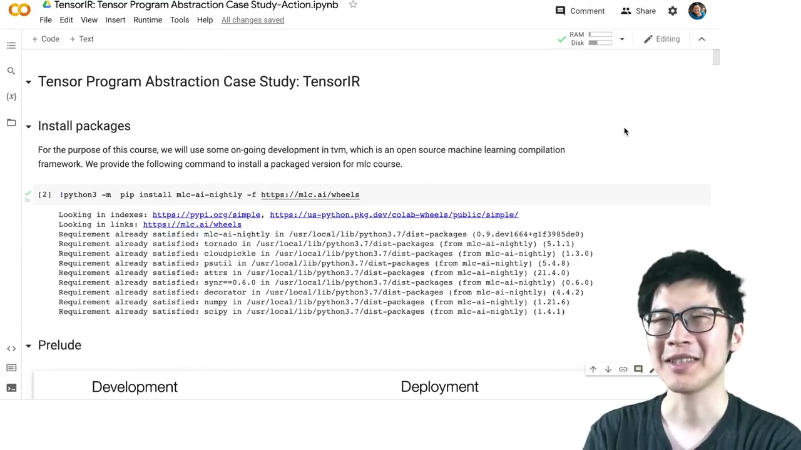

The lecture deepens Episode 2's tensor-program abstraction using TensorIR, Apache TVM's low-level tensor IR. The aim is to understand not only its syntax, but why blocks and axis metadata make programs transformable.

### Slide 2 — Why a concrete case study? ([00:04:00](https://www.youtube.com/watch?v=NSOdtaSW1A4&t=240s))

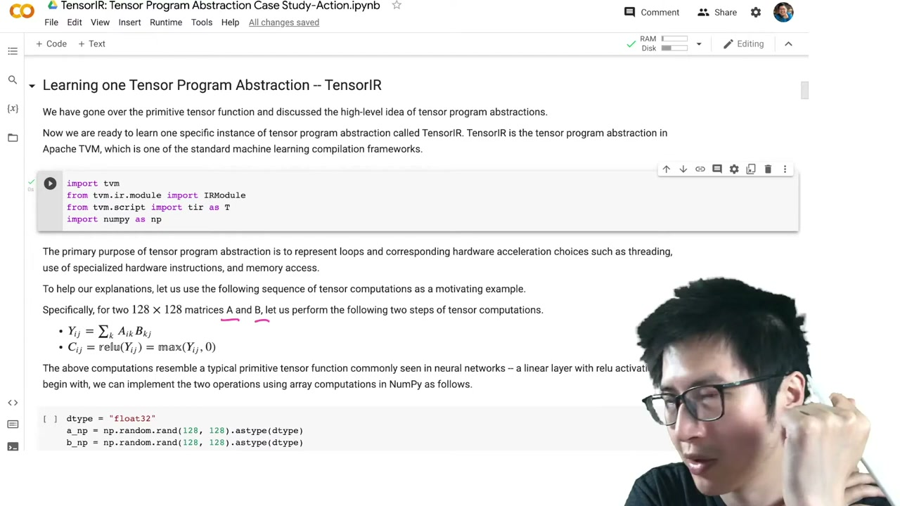

MLC transforms a development representation into deployable implementations. TensorIR is one representation in that path: explicit enough to expose loops and memory, but structured enough for programmatic analysis and transformation.

### Slide 3 — TensorIR and the notebook environment ([00:06:00](https://www.youtube.com/watch?v=NSOdtaSW1A4&t=360s))

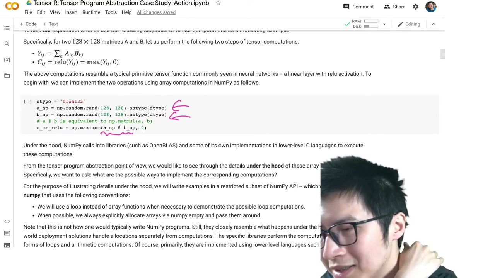

The notebook imports TVM/TensorIR and NumPy. NumPy supplies reference arrays and results; TVM Script describes primitive tensor programs; schedule APIs derive optimized variants; `tvm.build` lowers them to a target.

### Slide 4 — Running example: matmul plus ReLU ([00:08:00](https://www.youtube.com/watch?v=NSOdtaSW1A4&t=480s))

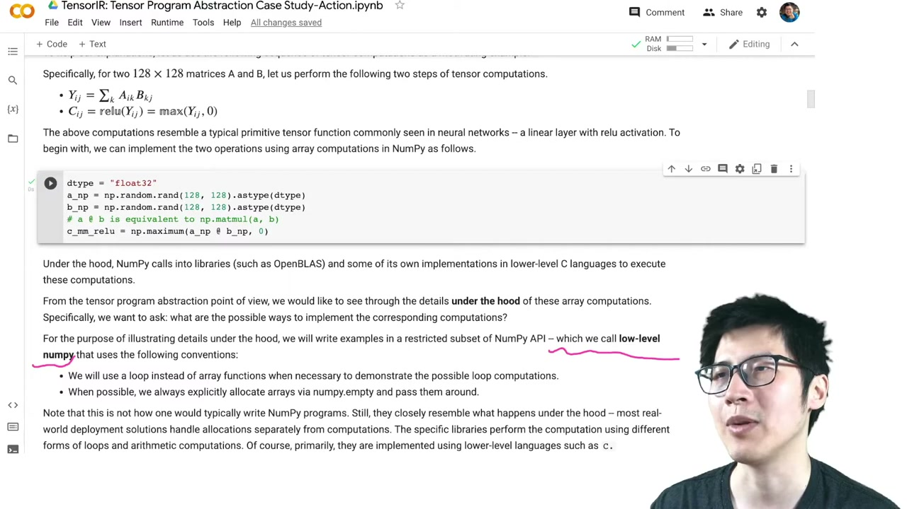

The example computes

$$
Y_{ij}=\sum_k A_{ik}B_{kj}, \qquad C_{ij}=\max(Y_{ij},0).
$$

It contains spatial output dimensions $i,j$, a reduction dimension $k$, an intermediate buffer $Y$, and a second elementwise computation—enough structure to demonstrate most TensorIR concepts.

### Slide 5 — High-level NumPy reference ([00:10:00](https://www.youtube.com/watch?v=NSOdtaSW1A4&t=600s))

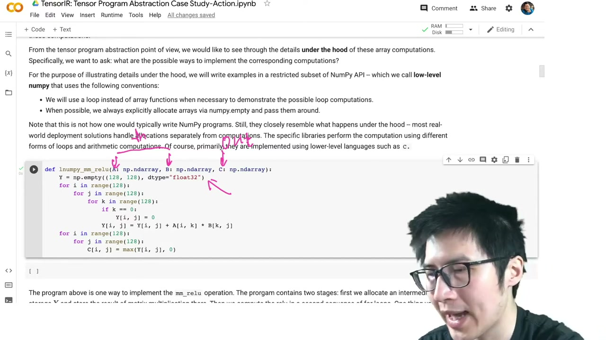

At the highest level, NumPy expresses the function compactly:

```python
y = a @ b
c = np.maximum(y, 0)
```

This is the semantic reference. It says what to compute but leaves loop order, allocation strategy, parallelism, and hardware implementation to library internals.

### Slide 6 — Low-level NumPy convention ([00:14:00](https://www.youtube.com/watch?v=NSOdtaSW1A4&t=840s))

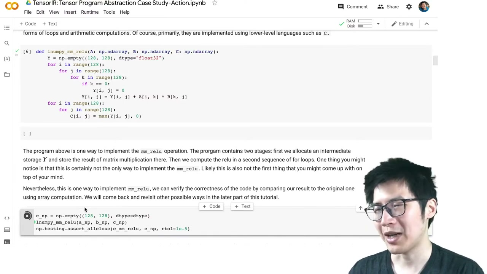

The lower-level version preallocates output/intermediate arrays and uses scalar operations inside explicit loops. This resembles C-like implementation code and exposes the decisions hidden by `@` and `maximum`.

### Slide 7 — Allocation and loop nests ([00:16:30](https://www.youtube.com/watch?v=NSOdtaSW1A4&t=990s))

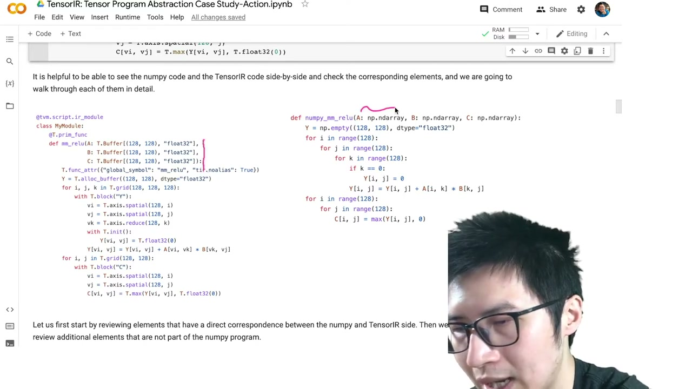

An intermediate $Y$ is allocated, followed by loops over $i$, $j$, and $k$. The first two select an output element; the third accumulates its dot product. Explicit allocation makes buffer lifetime and memory traffic visible to later transformations.

### Slide 8 — Reduction initialization and update ([00:20:00](https://www.youtube.com/watch?v=NSOdtaSW1A4&t=1200s))

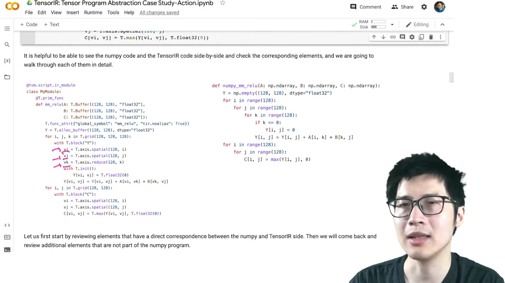

Matrix multiplication has two phases for each $Y_{ij}$:

$$
Y_{ij}\leftarrow0, \qquad
Y_{ij}\leftarrow Y_{ij}+A_{ik}B_{kj}\quad\forall k.
$$

TensorIR represents this distinction explicitly because initialization and update may later be placed, tiled, or lowered differently.

### Slide 9 — Elementwise ReLU loop ([00:22:00](https://www.youtube.com/watch?v=NSOdtaSW1A4&t=1320s))

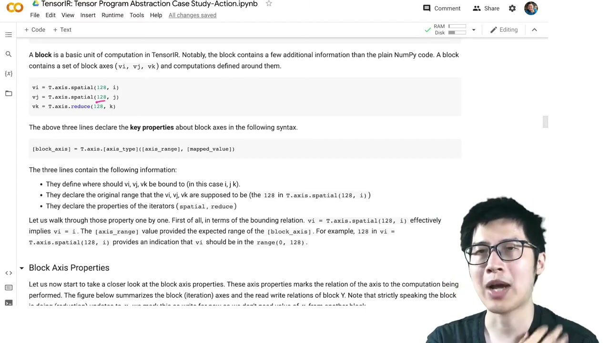

After the reduction, a separate two-dimensional loop writes $C_{ij}=\max(Y_{ij},0)$. Keeping matmul and ReLU as separate blocks lets a schedule reason about their producer–consumer relationship and potentially move or fuse them.

### Slide 10 — Validate the reference ([00:25:00](https://www.youtube.com/watch?v=NSOdtaSW1A4&t=1500s))

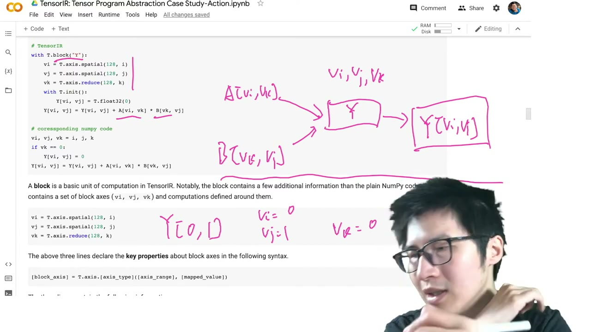

Random inputs run through both high- and low-level implementations, and `assert_allclose` checks elementwise agreement within tolerance. Every later transformed program is checked against the same reference: optimization is acceptable only when semantics remain equivalent.

## TensorIR block semantics

### Slide 11 — Introduce the TensorIR program ([00:29:00](https://www.youtube.com/watch?v=NSOdtaSW1A4&t=1740s))

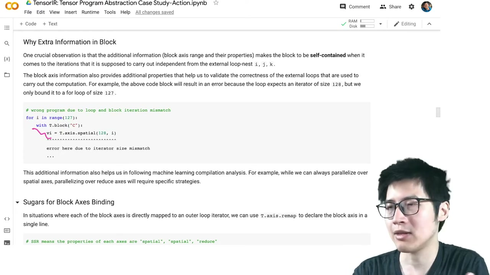

The TensorIR version describes the same function in TVM Script. Unlike arbitrary Python, it constructs compiler IR: buffers, loop nodes, blocks, expressions, and metadata are explicit objects that can be inspected and rewritten.

### Slide 12 — TVM Script embedding ([00:32:00](https://www.youtube.com/watch?v=NSOdtaSW1A4&t=1920s))

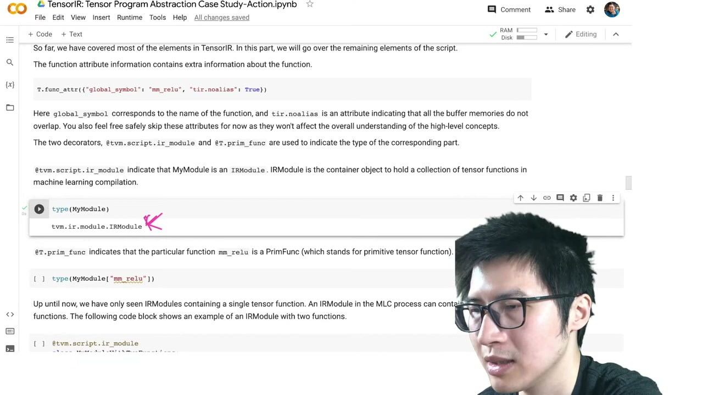

`@T.prim_func` defines a primitive function inside an `IRModule`. Python-like syntax improves readability, while the parser builds TensorIR rather than executing the loops as ordinary Python.

### Slide 13 — Typed buffers ([00:35:00](https://www.youtube.com/watch?v=NSOdtaSW1A4&t=2100s))

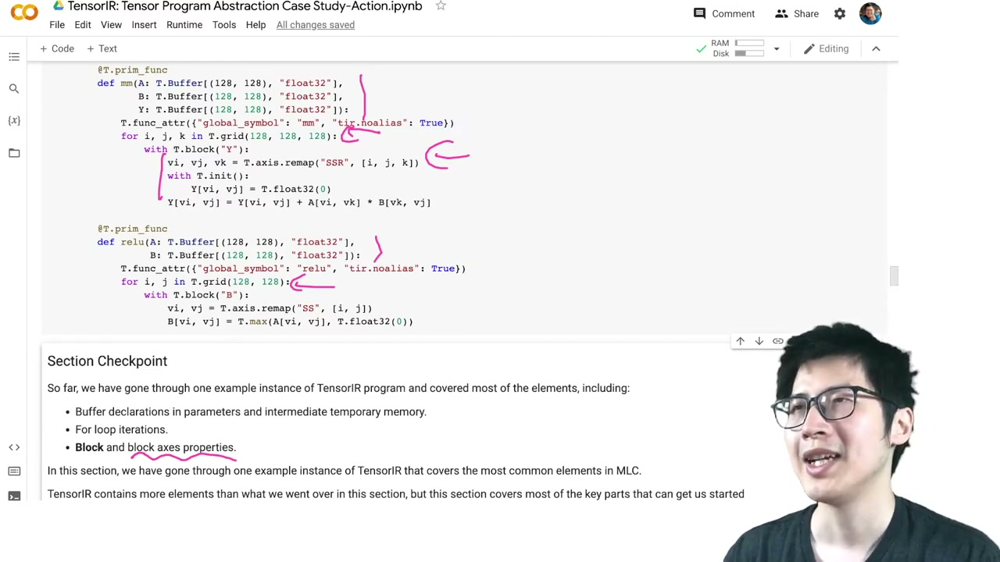

Arguments use `T.Buffer` annotations containing shape and data type. Static buffer metadata enables bounds checking, region inference, layout reasoning, and target code generation. Outputs are passed as buffers rather than returned as newly allocated Python objects.

### Slide 14 — `T.grid` and loop structure ([00:38:00](https://www.youtube.com/watch?v=NSOdtaSW1A4&t=2280s))

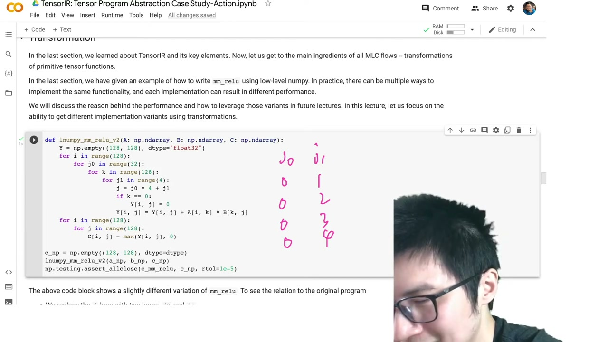

`T.grid(M,N,K)` is shorthand for a nested iteration product. It compactly creates the loops, while block-axis bindings inside the body preserve the semantic relation between transformed loops and original tensor coordinates.

### Slide 15 — Blocks as computation units ([00:41:00](https://www.youtube.com/watch?v=NSOdtaSW1A4&t=2460s))

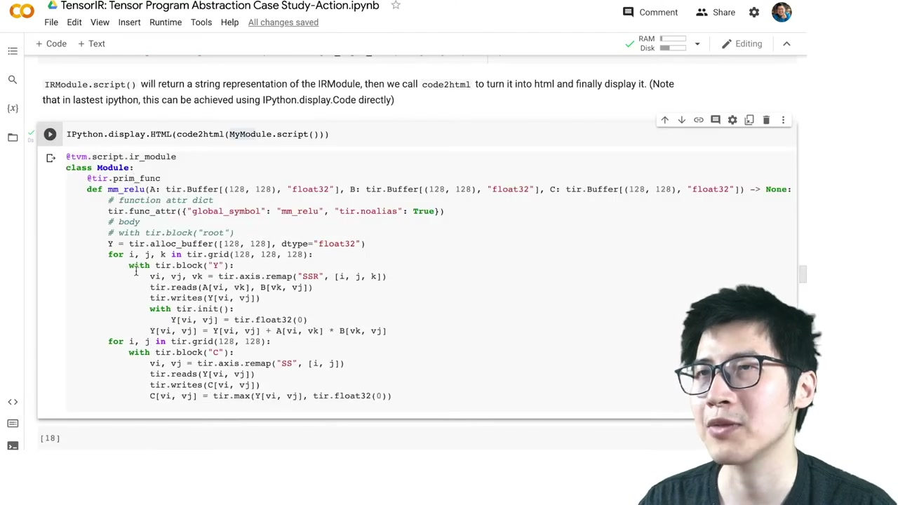

A `T.block` names one computation and contains axis bindings, read/write regions, initialization, and update statements. Blocks are the handles used by schedules: transformations target a semantic computation rather than fragile source-code positions.

### Slide 16 — Block axes and ranges ([00:44:00](https://www.youtube.com/watch?v=NSOdtaSW1A4&t=2640s))

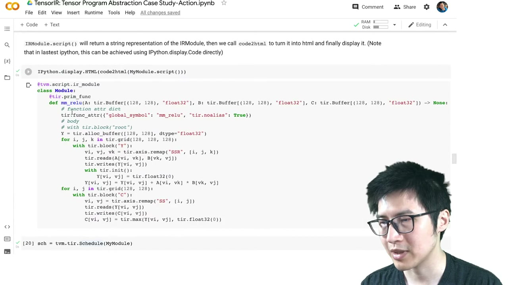

Bindings such as

```python
vi = T.axis.spatial(M, i)
vj = T.axis.spatial(N, j)
vk = T.axis.reduce(K, k)
```

state each axis's extent, kind, and mapping from surrounding loops. The semantic axes $v_i,v_j,v_k$ remain stable even after the implementation loops are split or reordered.

### Slide 17 — Spatial and reduction semantics ([00:47:00](https://www.youtube.com/watch?v=NSOdtaSW1A4&t=2820s))

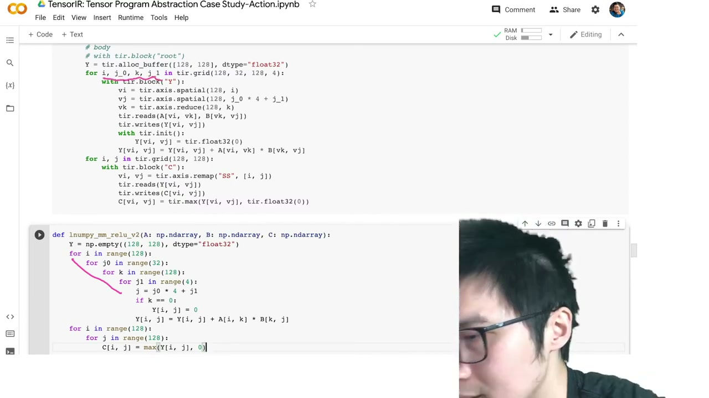

Spatial iterations produce distinct output locations and are natural parallel candidates. Reduction iterations contribute to the same output and require an associative update plus suitable synchronization or decomposition. This distinction prevents the scheduler from treating every loop as freely parallel.

### Slide 18 — Decompose reduction ([00:50:00](https://www.youtube.com/watch?v=NSOdtaSW1A4&t=3000s))

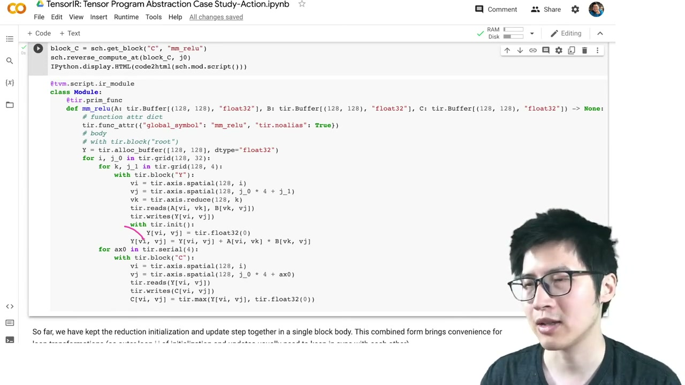

`decompose_reduction` separates `T.init()` from the update block. The transformation preserves their relationship while producing explicit initialization and accumulation loops, which can then be scheduled independently when lowering requires it.

## Scheduling, compilation, and performance

### Slide 19 — Create and inspect a schedule ([00:53:00](https://www.youtube.com/watch?v=NSOdtaSW1A4&t=3180s))

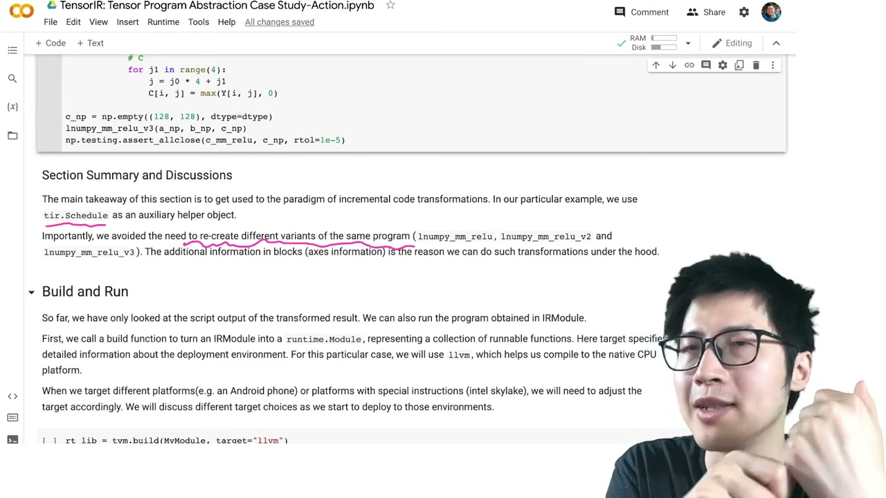

A `tir.Schedule` wraps the module. `get_block("Y")` locates matmul, `get_loops(block)` returns surrounding loops, and schedule primitives create a new implementation incrementally. Printing `sch.mod.script()` reveals each intermediate IR.

### Slide 20 — Build, run, and benchmark ([00:56:00](https://www.youtube.com/watch?v=NSOdtaSW1A4&t=3360s))

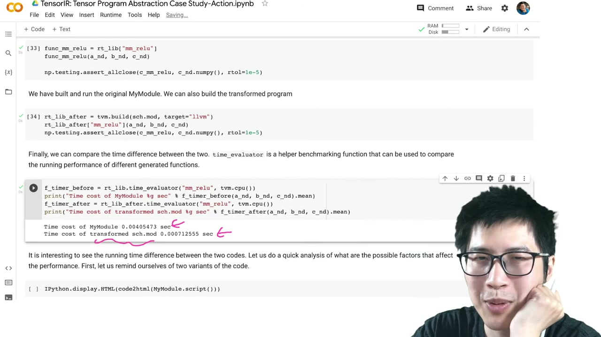

`tvm.build(module, target="llvm")` lowers TensorIR to a CPU runtime module. TVM NDArrays hold inputs and output, the packed function executes, and NumPy validates correctness. A time evaluator compares implementations; the lecture observes a greater-than-fivefold difference from changing loop structure.

### Slide 21 — Why loop order changes speed ([00:58:00](https://www.youtube.com/watch?v=NSOdtaSW1A4&t=3480s))

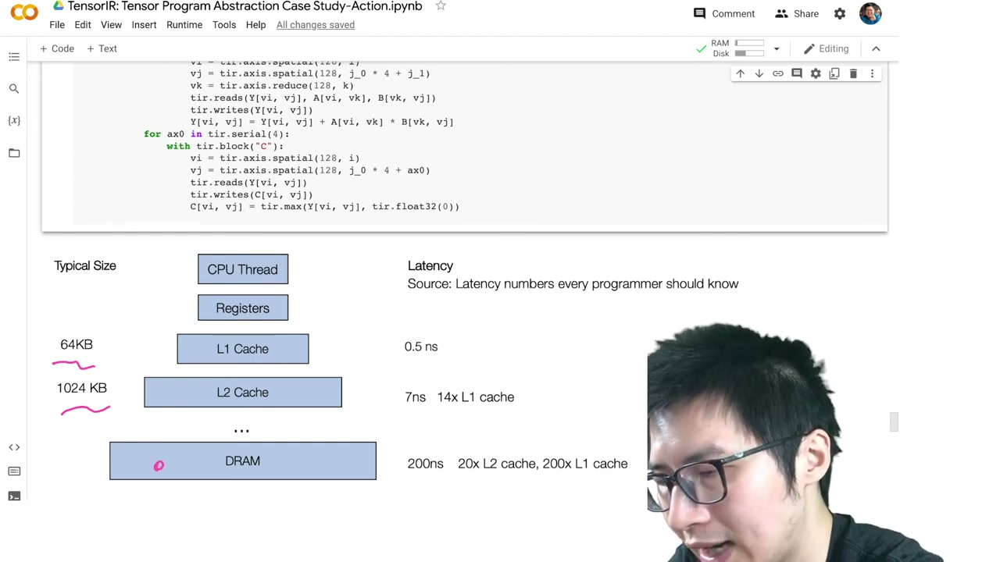

Splitting $j$ into $(j_0,j_1)$ and reordering around $k$ changes the sequence of accesses to $A$, $B$, and $Y$. Computation count remains essentially unchanged, but a small tile can reuse loaded values and keep active data near the processor.

For a split factor $f$:

$$
j=fj_0+j_1.
$$

The speedup demonstrates why schedule is part of performance even when tensor semantics are unchanged.

### Slide 22 — Hardware and library implementations ([01:00:00](https://www.youtube.com/watch?v=NSOdtaSW1A4&t=3600s))

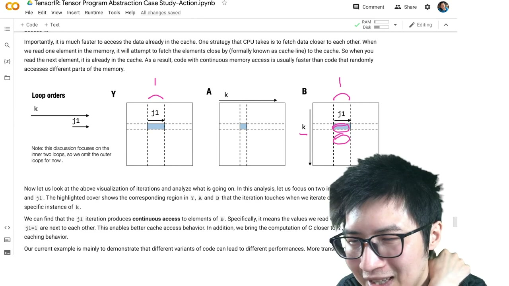

Tensor programs ultimately lower to CPU loops, GPU kernels, hardware intrinsics, or calls into optimized libraries. Structured blocks and axes provide the pattern information needed to match a computation to such implementations. This episode motivates that integration; it does not yet implement a complete tensorization pipeline.

### Slide 23 — Programmatic transformation workflow ([01:03:00](https://www.youtube.com/watch?v=NSOdtaSW1A4&t=3780s))

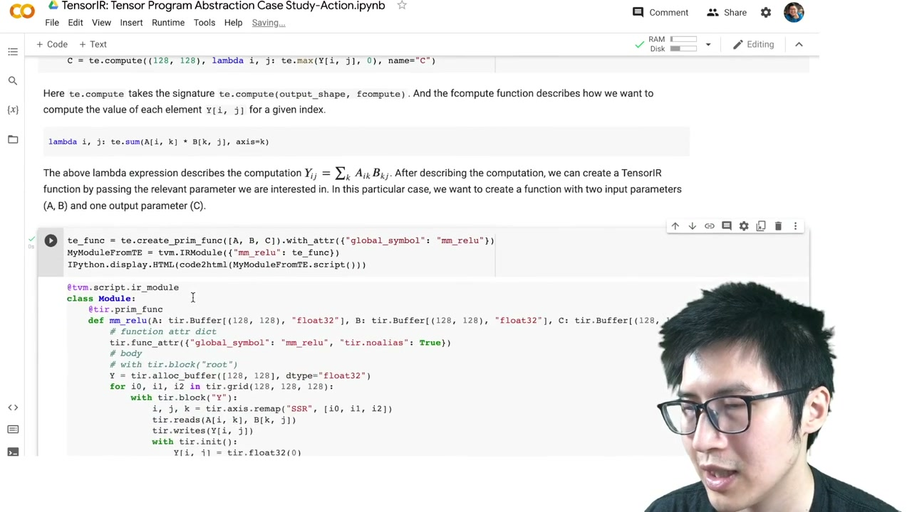

Instead of hand-writing variants $v_0,v_1,v_2$, MLC starts with an IRModule and derives variants through schedules. Because transformations are executable programs, future systems can search split factors, orders, fusion choices, and target mappings automatically. Handwritten libraries remain valuable and can be combined with generated transformations.

### Slide 24 — Summary and next step ([01:06:00](https://www.youtube.com/watch?v=NSOdtaSW1A4&t=3960s))

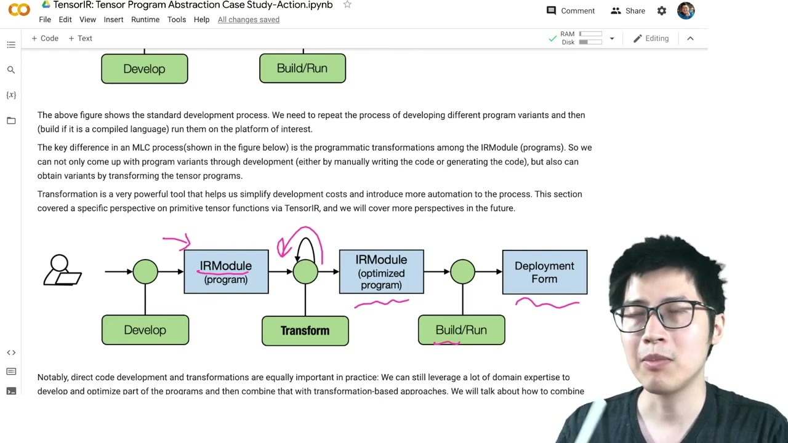

TensorIR enriches loops with blocks, semantic axes, regions, and reduction structure. Schedules transform implementation without redefining the tensor function; build lowers a selected variant to deployment code. The next course step is to compose primitive tensor functions into end-to-end neural-network computations.

## Key takeaways

1. TensorIR represents primitive tensor implementations as structured compiler IR.
2. The running function is $C=\operatorname{ReLU}(AB)$.
3. A NumPy reference defines semantics; explicit loops expose implementation choices.
4. Reductions require separate initialization and accumulation semantics.
5. `T.Buffer` records shape, dtype, and buffer identity.
6. `T.grid` creates nested iteration spaces.
7. Blocks are named semantic computation units targeted by schedules.
8. Spatial axes identify output coordinates; reduction axes combine contributions.
9. Read/write regions and axis mappings enable legality and dependence analysis.
10. Semantic block axes remain stable when surrounding implementation loops change.
11. `split`, `reorder`, placement operations, and reduction decomposition compose into schedules.
12. `decompose_reduction` materializes distinct init and update blocks.
13. `tvm.build` lowers a scheduled IRModule to a selected target.
14. Every transformed implementation must be checked against the reference result.
15. Loop order changes locality and can produce large speed differences without changing arithmetic.
16. Programmatic transformations create a search space for automated optimization.
17. Generated schedules and optimized libraries are complementary deployment techniques.