# TileLang 开源训练营 P01 — 开营专场：国产GPU生态飞轮

> **演讲者**：李兆石（沐曦AI研究院院长）  
> **日期**：2026年5月18日  
> **活动**：TileLang Puzzle 算子开发实战营 开营仪式  
> **主办**：CCF开源发展技术委员会、AI Infra开源社区、Tile AI社区、沐曦股份、DataWhale开源学习社区、CNB社区、格维社区

---

## 一、开场与训练营介绍（主持人 马佩）

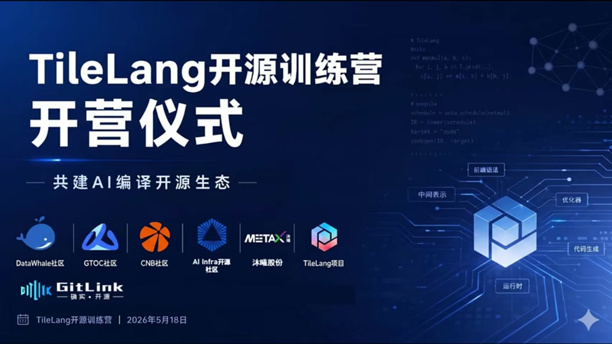

主持人马佩开场，欢迎同学们来到 **TileLang Puzzle 算子开发实战营**的开营仪式。

**训练营定位**：
- 由 CCF开源发展技术委员会、AI Infra开源社区、Tile AI社区、沐曦股份、DataWhale、CNB社区、格维社区**联合打造**
- **全程免费**，纯公益性质
- 课程设计**零基础友好**——把 AI 编译、算子开发这种"门槛很高的硬核底层技术"拆解成可上手学习和实战的内容
- 目标：让更多同学亲手触摸开源项目核心，参与开源共建生态

**到场嘉宾**：产业伙伴（支持开源生态）、TileLang 项目核心开发者、各大开源社区负责人、训练营讲师团队。

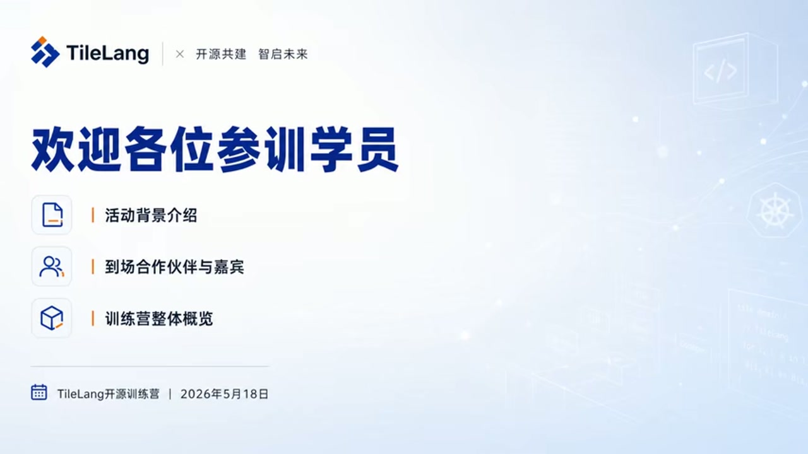

议程：活动背景介绍 → 到场合作伙伴与嘉宾 → 训练营整体概览。

---

## 二、国产GPU生态飞轮（李兆石博士）

### 2.1 生态飞轮的核心概念

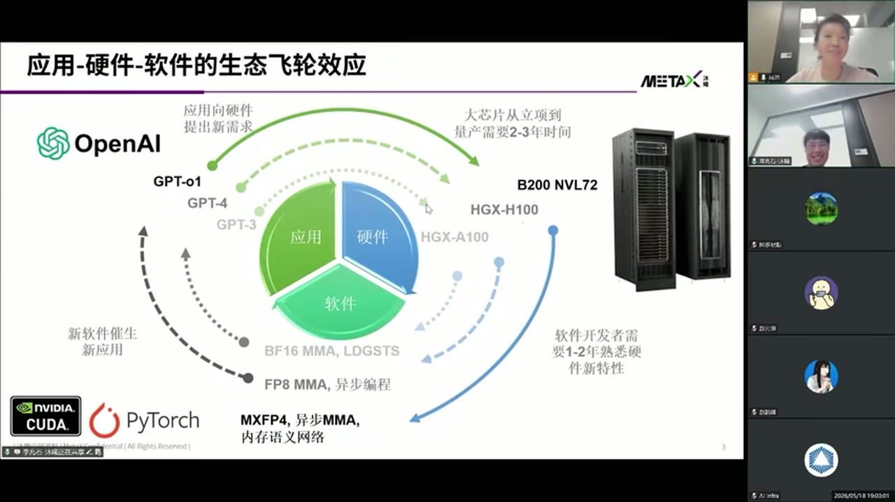

李兆石院长展示了一页**两年前做的PPT**，但"今天还是非常有效"——**应用-硬件-软件的生态飞轮效应**。

> "慕曦是一家做GPU的公司，我们特别需要这样的生态飞轮。这也是我认为**英伟达护城河最关键的地方**。"

**飞轮三环**：
1. **应用 → 硬件**：应用向硬件提出新需求（GPT-3 → GPT-4 → GPT-01）
2. **硬件 → 软件**：大芯片从立项到量产需要 **2-3年**，软件开发者需要 1-2年熟悉硬件新特性
3. **软件 → 应用**：新软件催生新应用（BF16 MMA → FP8 MMA/异步编程 → MXFP4/异步MMA/内存语义网络）

**关键洞察**：生态的核心**不是**某个具体的软件栈或编程语言（不是说"CUDA就是生态"），而是从应用、模型到硬件到软件的**飞轮效应**。

### 2.2 黄仁勋论软实力与生态

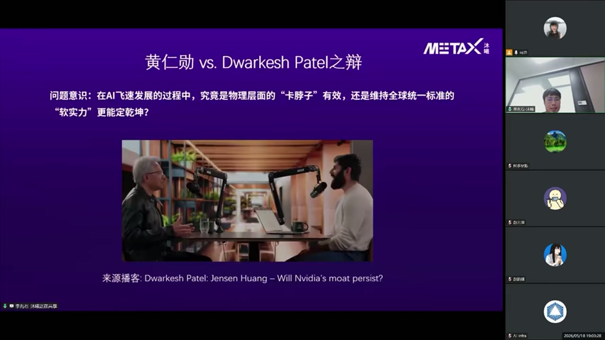

李院长提到近期一个播客：**黄仁勋 vs. PETO** 辩论——对中国的"卡脖子"有效，还是扩大"软实力"更有效？

- 黄仁勋主张**软实力更有效**
- 视频约 **46分钟**处，黄仁勋详细阐释了为什么 GPU 公司需要生态
- B站上有中文字幕翻译版，推荐观看

> "N卡对中国的禁售，其实让英伟达**失去了**这样的一个生态。"

### 2.3 芯片设计的3年周期焦虑

做国产大芯片最害怕的事：**3年后芯片上市时，应用已经过时了**。

- 在北美，模型公司和GPU公司之间互动**非常紧密**
- 国内也开始看到 DeepSeek 等模型公司与芯片公司深入互动、深入交流
- 但中间**软件环节**虽不如模型公司或GPU公司亮眼，却是闭环中**不可缺少的一环**

> "任何硬件的新特性，如果想要被有效地用起来，一定是要有很好的软件抽象。"

芯片设计时难以想象上市时整个应用是什么样子，所以需要**软件作为桥梁**。

---

## 三、低精度案例：生态闭环的威力

### 3.1 混合精度与 Tensor Core 演进

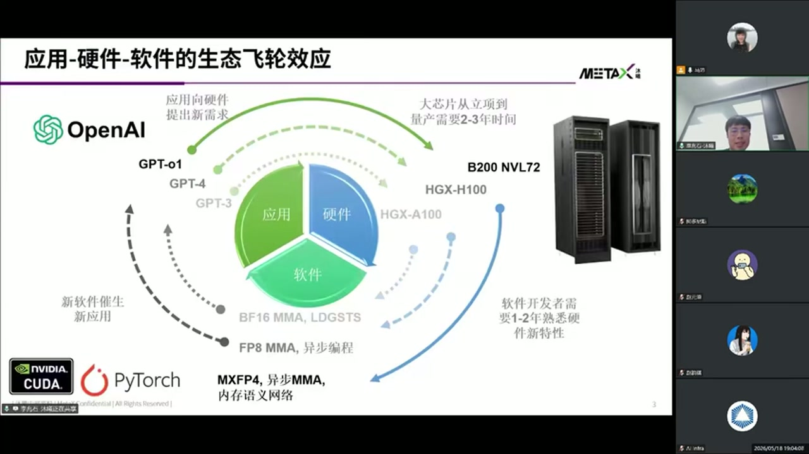

**GPU的"瓦特时刻"**：2017年 Volta 引入 Tensor Core。

| 特性 | P100 (Pascal) | V100 (Volta) |
|------|--------------|--------------|
| SMs | 56 | 80 |
| CUDA Cores | 3,584 | 5,120 |
| Tensor Cores | 无 | 640 |
| 半精度/Tensor TFLOPs | 18.7 | 112 |

**NVIDIA Tensor Core 路线图**：
- 16-bit 计算吞吐率每代翻倍
- 增加更低精度的算力（INT8 / FP8 / FP4…）
- 增加 2:4 结构化稀疏（未实用）

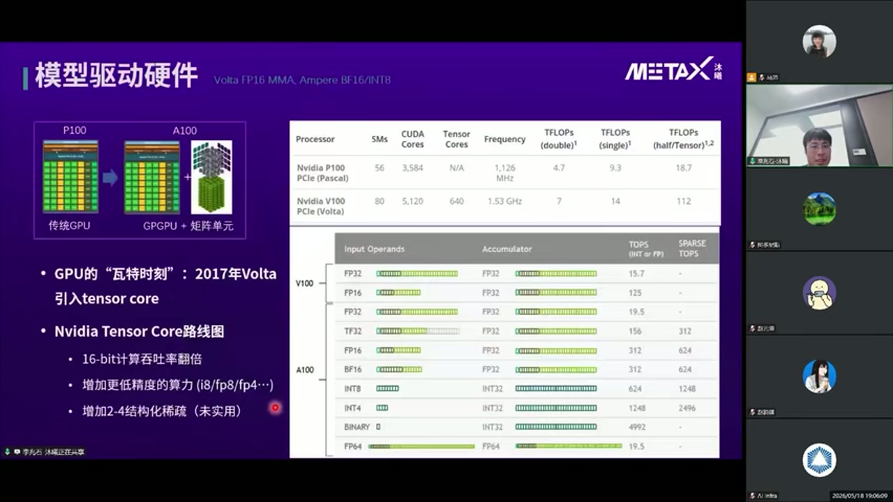

从 BF16 以后，数值精度**没有国际通行标准**——Tensor Core 里有很多坑（累加精度、内积项链长度等），大家就把英伟达做成了"事实标准"（因为市占率最高）。

### 3.2 Hopper FP8 的累加精度问题

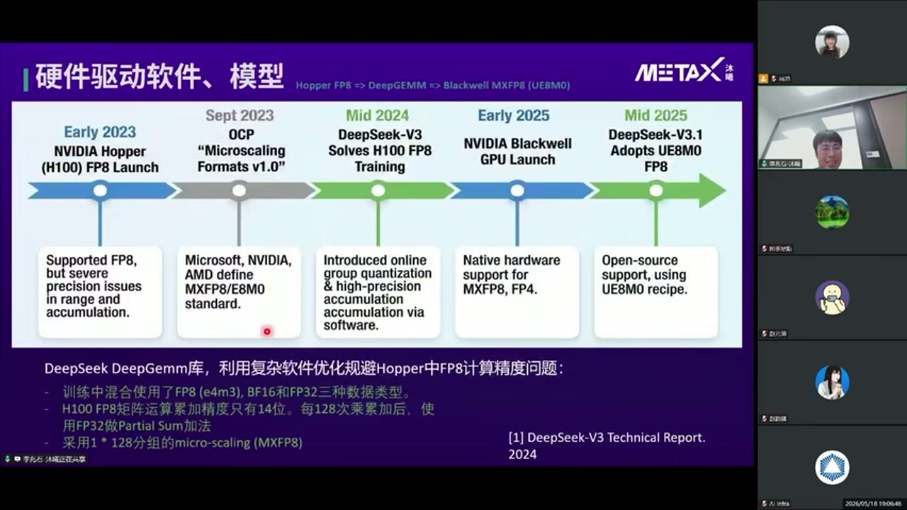

**FP8 时间线**：

| 时间 | 事件 |
|------|------|
| 2023初 | NVIDIA Hopper (H100) FP8 发布，但精度问题严重 |
| 2023.9 | OCP "Microscaling Formats v1.0"——微软、NVIDIA、AMD 定义 MXFP8/E8M0 标准 |
| 2024中 | DeepSeek-V3 通过软件解决 H100 FP8 训练问题 |
| 2025初 | NVIDIA Blackwell 发布，原生硬件支持 MXFP8、FP4 |
| 2025中 | DeepSeek-V3.1 采用 UE8M0 FP8 |

**DeepSeek DeepGEMM 库**的核心 workaround：
- 训练中混合使用 FP8 (e4m3)、BF16、FP32 三种数据类型
- **H100 FP8 矩阵运算累加精度只有14位**——每128次乘累加后，用 FP32 做 Partial Sum 加法
- 采用 1×128 分组的 micro-scaling (MXFP8)

> "硬件公司为了减少芯片面积（=成本），把累加位数做低了，结果大家发现 Hopper FP8 怎么都不收敛。软件做了一个 workaround 解决了这个问题。"

### 3.3 Blackwell 的修正：模型驱动硬件

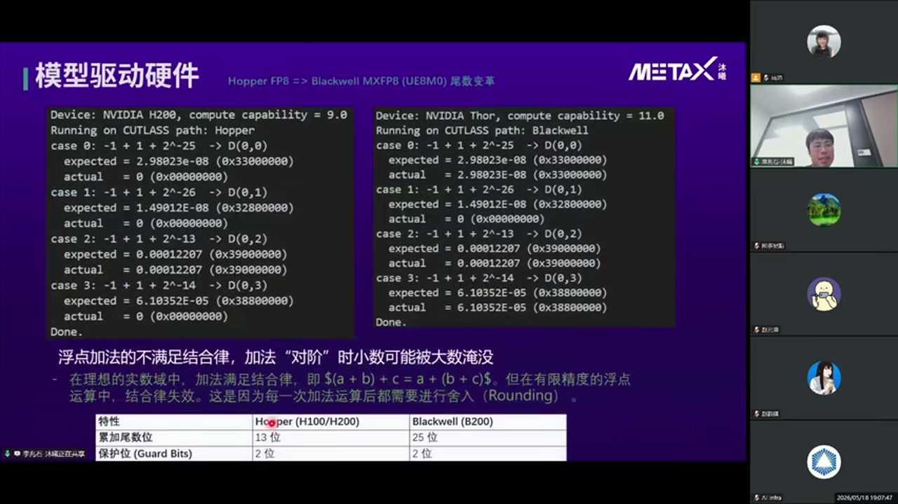

英伟达在 **Blackwell** 这一代很快吸取了软件端的反馈：

| 特性 | Hopper (H100/H200) | Blackwell (B200) |
|------|--------------------|--------------------|
| 累加尾数位 | **13 bits** | **25 bits** |
| 保护位 (Guard Bits) | 2 bits | 2 bits |

**浮点加法不满足结合律**：在有限精度下，加法"对阶"时小数可能被大数淹没。(a+b)+c ≠ a+(b+c)。累加尾数位从13→25，大幅减少了这种精度损失。

> "这就是生态闭环的威力——除了模型和硬件以外，中间的软件桥梁是必不可少的。"

---

## 四、GPU编程的学习价值

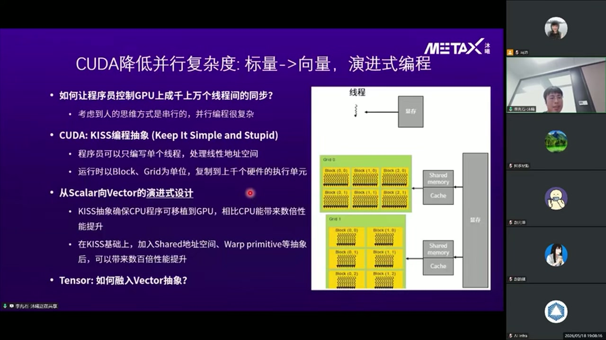

李院长对在线学生们的建议：

**GPU编程是"Keep It Simple, Stupid" (KISS) 的编程抽象**：
- 刚学 GPU 编程时，看到的就是**一个线程 + 一个线性地址空间**——跟学 C/Python 非常像
- 用这种简单抽象就能获得相比 CPU 程序 **3~5倍**的性能提升
- 但距离 GPU 峰值性能还有很大差距

**正反馈循环**（像玩游戏打怪升级）：
- 想发挥性能潜力 → 学习 GPU 架构细节
- 学得越多 → 性能提升越好 → 正反馈

> "GPU编程是一个非常好的入门**计算机体系结构**和**分布式系统**的手段。"

对比：李院长上学时还是 CPU + MPI 的时代，MPI "真的非常非常难学，写起来非常困难"。GPU 编程的入门门槛低得多。

---

## 五、国产软件生态的崛起

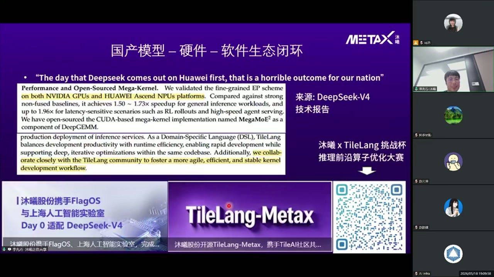

**2025年最欣喜的事**：看到国产软件生态的崛起。

**背景**：之前不管是 PyTorch 还是 Triton，软件的 owner 都在北美。

**真实案例**：
- DeepSeek 向 Triton（OpenAI维护）提需求时，**不会得到直接答复**
- 所以 DeepSeek 从 NSA 开始，积极跟 **TileLang** 深度合作

**DeepSeek-V4 技术报告**中的关键引用：

> *"As a Domain-Specific Language (DSL), TileLang balances development productivity with runtime efficiency, enabling rapid development while supporting deep, iterative optimizations within the same codebase. Additionally, we collaborate closely with the TileLang community to foster a more agile, efficient, and stable kernel development workflow."*

> *"We validated the fine-grained EP scheme on both NVIDIA GPUs and HUAWEI Ascend NPUs platforms... achieves 1.50~1.73x speedup for general inference workloads, and up to 1.96x for latency-sensitive scenarios."*

**沐曦的合作**：
- 一方面与模型公司合作
- 另一方面与 TileLang 社区深度合作
- 沐曦携手 FlagOS、上海人工智能实验室，**Day 0 适配 DeepSeek-V4**
- 沐曦 × TileLang 挑战杯：**推理前沿算子优化大赛**

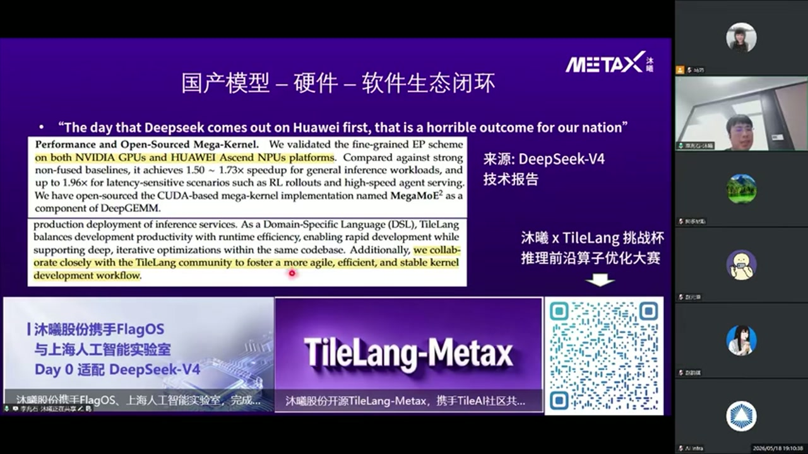

---

## 六、寄语与结语

> "希望大家通过 TileLang 训练营，像玩游戏打怪升级一样，快速建立自己的能力。"

> "也希望大家对国产 XPU 多宽容一些——芯片从设计到量产有3年时间。我们课程上用的 C500 是21-22年设计的芯片，相比英伟达最先进芯片确实有差距，但我们希望通过越来越健康的国产生态闭环，持续改进芯片，跟软件社区携手共进。"

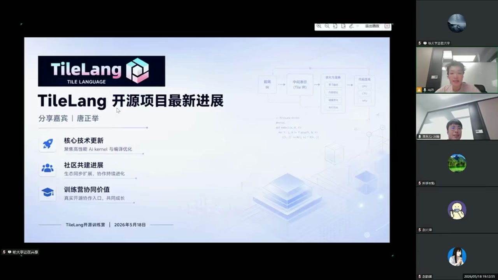

**沐曦为训练营同学提供免费算力券**，当天即可在开发者社区领取。

---

## 七、TileLang 开源项目最新进展（唐正举）

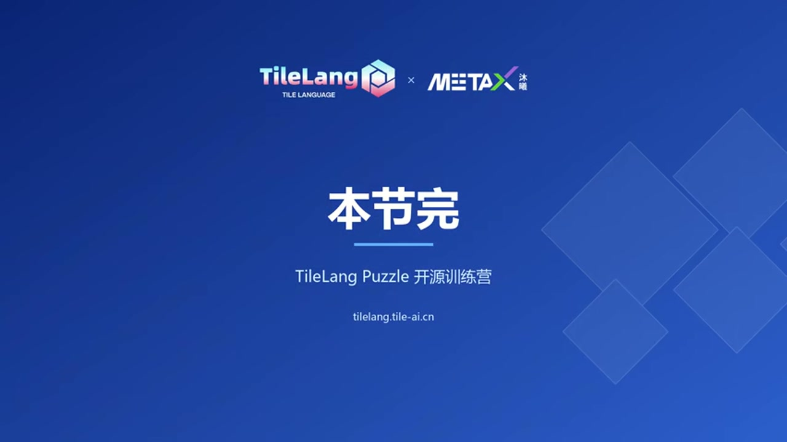

第二位分享嘉宾**唐正举**介绍 TileLang 项目进展，聚焦三个方面：
1. **核心技术更新**：聚焦高性能 AI kernel 与编译优化
2. **社区建设进展**：生态同步扩展，协作持续进化
3. **训练营协作价值**：真实开源协作入口，共同成长

---

## Key Terms 关键术语

| 术语 | 说明 |
|------|------|
| 生态飞轮 (Ecosystem Flywheel) | 应用→硬件→软件→应用的自增强循环 |
| Tensor Core | NVIDIA GPU 中专用矩阵运算单元，2017年 Volta 架构引入 |
| FP8 (e4m3/e5m2) | 8位浮点格式，Hopper 引入但累加精度不足 |
| MXFP8 / UE8M0 | OCP 定义的 Microscaling FP8 标准，Blackwell 原生支持 |
| DeepGEMM | DeepSeek 开发的 GEMM 库，用软件 workaround 解决 Hopper FP8 精度问题 |
| 累加尾数位 (Accumulated Mantissa Bits) | 矩阵乘累加器中尾数精度，Hopper 13位 → Blackwell 25位 |
| TileLang | 开源 DSL，平衡开发效率与运行性能，支持跨硬件 kernel 开发 |
| KISS (Keep It Simple, Stupid) | GPU 编程的入门抽象——单线程+线性地址空间 |
| C500 | 沐曦2021-22年设计的GPU芯片，本次训练营使用的算力平台 |
| 挑战杯 | 沐曦 × TileLang 推理前沿算子优化大赛 |
