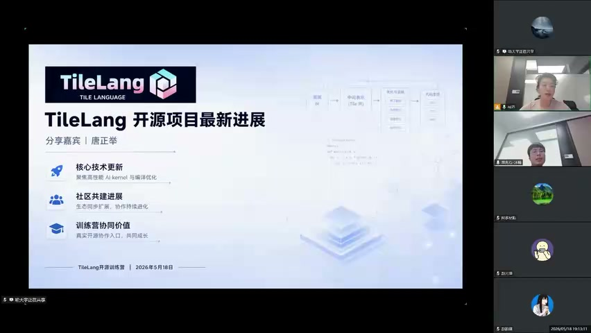
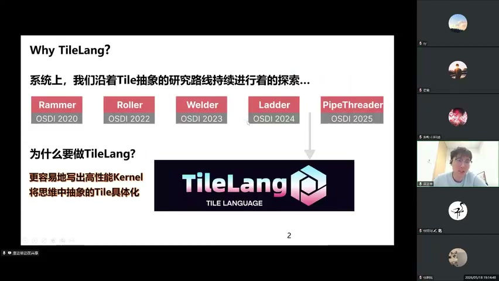
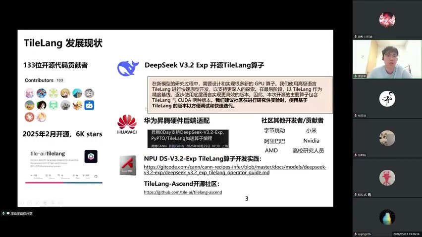
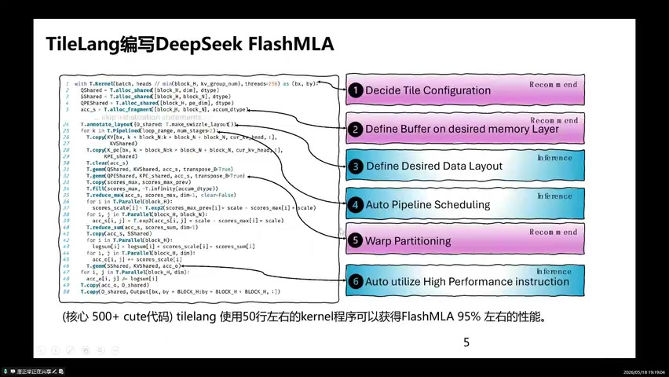
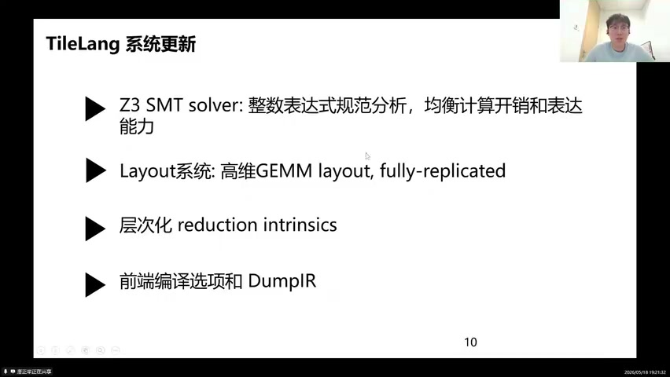

# TileLang 开源训练营 P02 — 开营专场：TileLang项目最新进展

> **演讲者**：唐正举（北京大学，TileLang社区核心开发者）  
> **日期**：2026年5月18日  
> **活动**：TileLang Puzzle 算子开发实战营 开营仪式

---

## 一、TileLang 的起源与研究路线

唐正举介绍了 TileLang 项目的三大主题：**核心技术更新**（高性能 AI kernel 与编译优化）、**社区建设**（生态同步扩展，协作持续进化）、**训练营协作价值**（真实开源协作入口，共同成长）。

**研究路线**：TileLang 并非凭空出现，而是沿着 **Tile 抽象**这条研究路线持续探索的成果系列：

| 项目 | 会议 | 核心贡献 |
|------|------|----------|
| Rammer | OSDI 2020 | GPU 子任务切分 |
| Roller | OSDI 2022 | 感知硬件内存层级 |
| Welder | OSDI 2023 | 低精度优化 |
| Ladder | OSDI 2024 | 软件流水 |
| PipeThreader | OSDI 2025 | 线程级流水 |

> "为什么要做 TileLang？——**更容易地写出高性能 Kernel**，将思维中抽象的 Tile 具体化。"

**核心洞察**：在现代 GPU 编程中（无论是 CUDA 还是其介绍文档），数据都是以**一块一块（Tile）**作为基本编程单元。TileLang 的起源非常直接——把数据瓦片（Tile）作为**一等公民**，直接对它进行操作。

---

## 二、项目发展现状

TileLang 是一个非常年轻的项目（2025年2月开源），但发展迅速：
- **6000+ GitHub Stars**
- **130+ 开源代码贡献者**
- DeepSeek V3.2 和 V4 都开源了 TileLang 算子（支持国产GPU）
- DeepSeek 建议社区在研究性实验时使用基于 TileLang 的版本（更方便调试和迭代）

**社区参与者**：阿里、AMD、英伟达、小米、华为、众多高校研究人员。

---

## 三、为什么要学 TileLang？

### 3.1 性能优势

在 NVIDIA H100 上的 benchmark（横轴=代码行数/Code Lines，纵轴=相对 PyTorch 加速比）：

- TileLang 处在**左上角**（代码少 + 性能高）
- 性能与手写 CUDA 的 FlashAttention 相当
- 在 MHA 上几乎达到 FlashAttention 性能
- 性能-书写复杂度的 trade-off **远远优于**其他编程框架

### 3.2 DeepSeek FlashMLA 实例

用 TileLang 编写 DeepSeek FlashMLA 的 6 步流程：

1. **Decide Tile Configuration** — 确定分块配置
2. **Define Buffer on desired memory Layer** — 在目标内存层定义缓冲区
3. **Define Desired Data Layout** — 定义数据布局
4. **Auto Pipeline Scheduling** — 自动流水调度
5. **Warp Partitioning** — Warp 分区
6. **Auto utilize High Performance instruction** — 自动使用高性能指令

> "TileLang 使用 **50行左右**的 kernel 程序可以获得 FlashMLA **95%** 左右的性能。"（对比核心 500+ 行 CUDA 代码）

其中很多优化隐藏在编译器后端自动完成，开发者可以控制关键决策点。

### 3.3 其他优势

- **低 CPU overhead**：采用更高效的 Python binding（如 TPMFFI），将 host 代码的检查挪到 C++ 侧
- **跨版本兼容**：一份代码同时适配多个 Python 和 CUDA 版本
- **数值精度与一致性**：默认关闭 fast math（与 Triton 不同），可显式选择高精度计算或快速数学库
- 面向模型训推**生产环境**设计

---

## 四、硬件支持与最新特性

### 4.1 硬件适配

TileLang 的 Tile 抽象对各种硬件天然适配：
- **NVIDIA**（包括 Blackwell 最新架构）
- **AMD**
- **沐曦 MetaX**
- **华为**、摩尔线程等国产芯片

架构：Python 前端 → 自动 lower 到 **TileIR** 中间表示 → 硬件抽象层做针对性调度优化。

### 4.2 Blackwell 支持

- TC (Tensor Core) Gen05
- RS 的 JP / FA 调度
- MXFP8 特性支持（相对完善）

### 4.3 系统更新

| 更新 | 说明 |
|------|------|
| Z3 SMT Solver | 整数表达式规范分析，均衡计算开销和表达能力 |
| Layout 系统 | 高维 GEMM layout, fully-replicated |
| 层次化 reduction intrinsics | 提升 attention 中频繁的 reduction 操作效率 |
| 前端编译选项 + DumpIR | 方便调试和查看中间表示 |

---

## 五、TileLang Puzzle 训练营

**目标**：From Beginner to Experts

- 公开了 **10 个 Puzzle**（从简单 copy 到复杂的 Dequant 反量化）
- 由易到难的算子书写，由浅入深了解 TileLang 设计特性
- 学习通用的算子 kernel 和高性能调优方法
- 为更广泛的硬件特性奠定基础

---

## 六、社区生态扩展

除 TileLang 核心外，Tile AI 社区还孵化了：

| 项目 | 定位 |
|------|------|
| **TL** (TileLang Distributed) | 统一分布式算法编程——跨节点、通算融合、cluster 间矩阵乘法 |
| **TileSize** | 轻量级自动调优框架，快速找到性能优越的调度策略 |
| **TileOps / TileRT** | 算子库 / 运行时衍生项目 |

> "TileLang 本身是对单节点/单 GPU 的算子编程；TL 则扩展到多设备、多节点的分布式场景。"

---

## Key Terms 关键术语

| 术语 | 说明 |
|------|------|
| Tile（数据瓦片） | GPU 编程中以数据块为基本编程单元的抽象 |
| TileIR | TileLang 的中间表示，连接前端 Python 与后端硬件代码生成 |
| FlashMLA | DeepSeek 开源的 MLA (Multi-head Latent Attention) 高性能实现 |
| Z3 SMT Solver | 微软的定理证明器，用于 TileLang 中整数表达式的规范分析 |
| Warp Partitioning | 将计算任务分配到 GPU warp 级别的策略 |
| Pipeline Scheduling | 软件流水——重叠数据搬运与计算以隐藏延迟 |
| TileSize | TileLang 生态中的轻量级自动调优框架 |
| OSDI | USENIX Symposium on Operating Systems Design and Implementation（系统顶会） |
