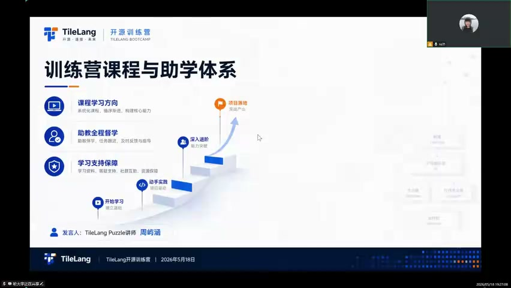
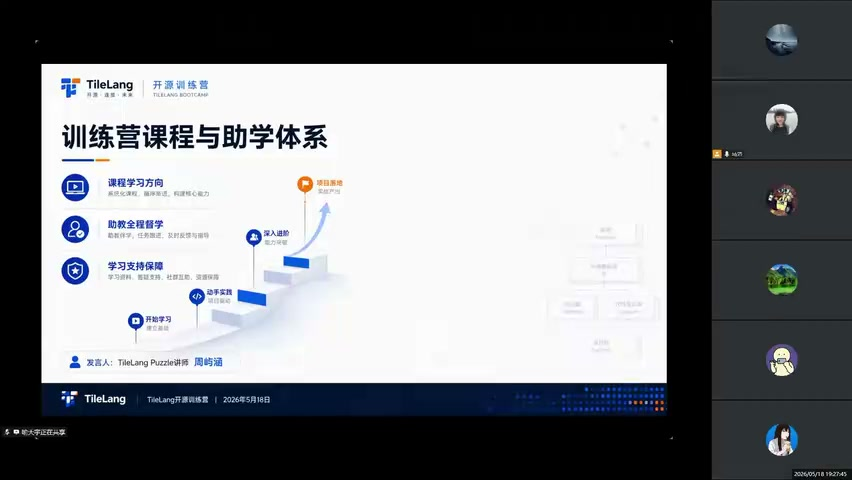
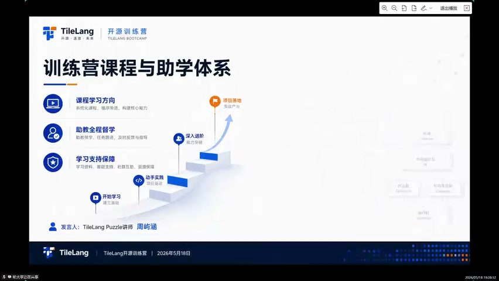
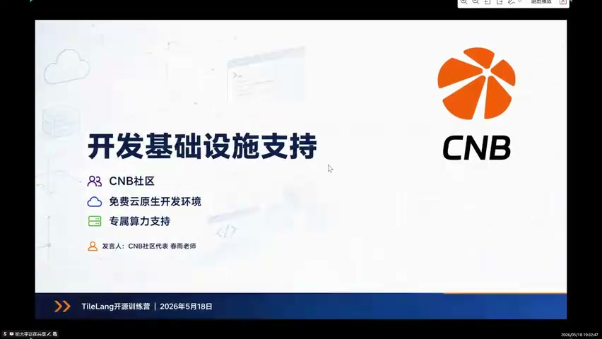
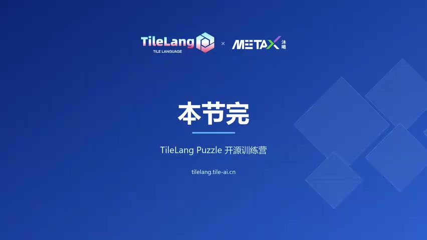

# [P03] 开营专场 - 训练营课程结构介绍与CNB云原生平台

> **演讲者**：周雨涵（TileLang Puzzle讲师）、春雨（CNB社区运营负责人）  
> **日期**：2026年5月18日  
> **活动**：TileLang Puzzle 算子开发实战营 开营仪式  

---

## 一、训练营课程与助学体系（周雨涵）

### 训练营基本信息

- **组队时间**：22天（5月18日 ~ 6月10日）
- **联合打造**：TileLang、Tile AI、沐曦AI、AI Infra社区
- **核心目标**：打破 AI 框架与底层硬件之间的黑盒，掌握面向 Kernel 开发的 TileLang 高性能 GPU 算子优化

### 双轨并行实验模式

- 既要理解 **CUDA 原生手写底层**
- 也要掌握 **TileLang 自动化优化 DSL**
- 实验仓库包含 NV（NVIDIA）和 MetaX（沐曦）双平台

### 课程时间表

| 日期 | 课程内容 |
|------|----------|
| 5月19日 | 第1课：GPU核心技术讲解 |
| 5月21日 | 第2课：国产GPU核心架构与硬件加速指令对比分析（NVIDIA vs 沐曦MetaX） |
| 5月23日 | 第3课：TileLang T.copy 搬运指令核心与应用 |
| 5月26日 | 第4课：AI编译进阶 TVM 精讲（TileLang前身） |
| 5月28日~30日 | 第5课：算子开发入门、性能初判与实战 |

### 实验任务

- 每堂课后有**小任务打卡**（GitLink上）
- 五个算子开发：**Copy、VectorAdd、ReduceSum、Softmax** + 综合
- 配套 **IntelliJ 纳米级算子运行时框架**——同一套测试用例和 Python 接口可无缝在 NVIDIA 和 MetaX 硬件上运行
- 结营产出：包含五个算子的**性能对比报告**

### 学习收获与激励

- 掌握从手写底层 → TileLang 自动化 DSL → 性能优化的 **AI Infra 方法论**
- 适配国产 GPU（MetaX）+ 大模型端优化的硬核工程项目
- 各大 AI 开源竞赛及大厂 AI 算子优化岗位的**核心加分项**
- 表现优异者可直接参与 TileLang 核心开源生态，获得大厂/底层生态企业**内推机会**
- 挑战杯揭榜赛：沐曦开源三个算子，参赛者在其上进行优化

---

## 二、CNB云原生开发平台介绍（春雨老师）

### CNB 平台简介

- **全称**：Cloud Native Build（云原生构建）
- **背景**：腾讯自研，2024年10月上线
- 此前支撑了 QMoE 训练营等开源活动

### 四大特点

| # | 特点 | 说明 |
|---|------|------|
| 1 | **超大仓库编译加速** | 支持百GB级仓库秒级克隆；并发流水线提高 CI 反馈速度（腾讯内部2018年起迭代） |
| 2 | **外网访问加速** | 利用腾讯云网络加速，解决国内访问 GitHub、Docker Hub、HuggingFace 慢的问题 |
| 3 | **云原生开发环境一键启动** | 基于容器的云端环境；Fork 助教仓库 → 一键启动，无需本地搭建（解决 Mac/Win 环境差异痛点） |
| 4 | **免费算力** | 创建组织即获 **1600核时/月** 免费 GPU 算力（每月重置），在"用量管理"中查看消耗 |

### 使用方式

1. 在 CNB 平台创建组织
2. Fork 助教配置好的仓库到自己的组织下
3. 一键启动云端开发环境
4. 在"组织设置 → 用量管理"中查看算力使用情况

---

## 三、主持人总结

- 学生反馈环境搭建困难 → CNB 云原生环境 + 沐曦 GPU 资源解决
- 使用问题可在群内提出，春雨老师和助教团队及时响应

---

## Key Terms

| 术语 | 含义 |
|------|------|
| TileLang DSL | TileLang 的领域特定语言，用于描述算子逻辑并自动生成高性能 Kernel |
| CNB (Cloud Native Build) | 腾讯自研云原生构建平台，提供代码托管、CI/CD、云端开发环境 |
| MetaX | 沐曦（MetaX）国产 GPU 品牌 |
| 双轨并行 | 同时学习 CUDA 手写 和 TileLang DSL 两种开发方式 |
| 1600核时 | CNB 平台每月每组织提供的免费 GPU 算力额度 |
| GitLink | 训练营任务打卡平台 |
