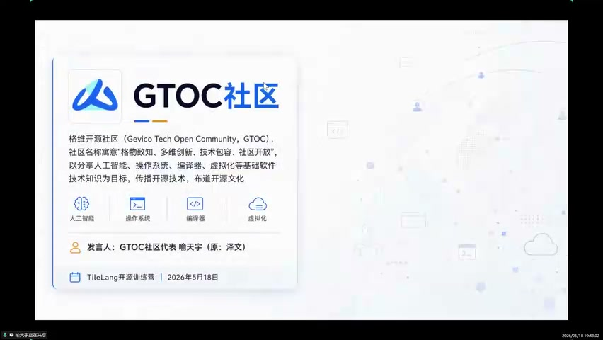
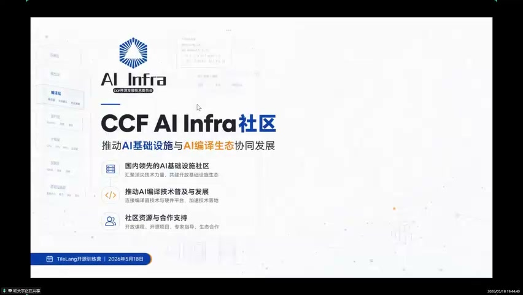
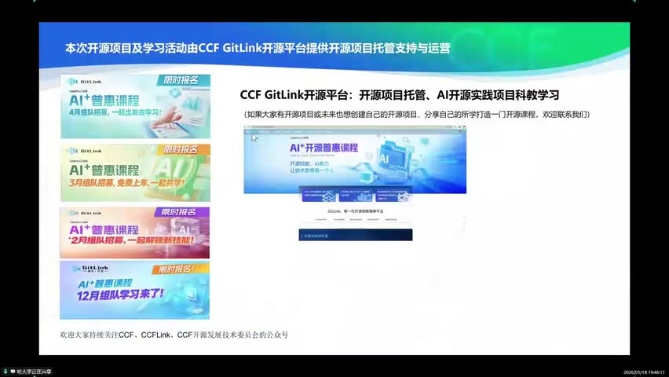
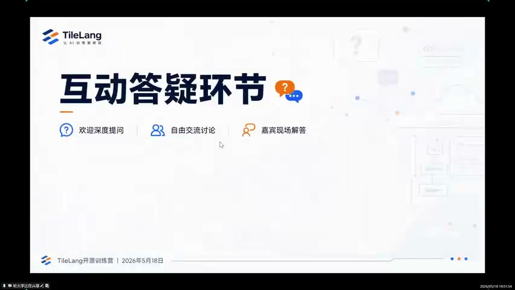

# [P04] 开营仪式 - 训练营框架与AI-Infra实战路径

> **演讲者**：喻天宇（GTOC社区代表 / CCF AI Infra社区）  
> **日期**：2026年5月18日  
> **活动**：TileLang Puzzle 算子开发实战营 开营仪式  

---

## 一、GTOC社区与AI Infra社区介绍

### GTOC社区（格维开源社区）

- **全称**：Gevico Tech Open Community
- **寓意**：格物致知、多维创新、技术包容、社区开放
- **目标**：分享 AI、操作系统、编译器、虚拟化等基础软件技术知识，传播开源技术，布道开源文化
- 此前与 CNB 社区合作举办过 KVM 训练营（与清华合作）

### AI Infra 社区定位

- 隶属于 CCF（中国计算机学会）AI Infra 社区
- 重点帮助**国产软件栈**在硬件层面和软件层面做协同
- 与多个实验室、企业、大型开源社区合作
- 通过**产学研**方式打通路径，让学员理解工业场景中的完整流程

---

## 二、训练营整体框架

### 课程设计哲学

- 本质是为 **TileLang** 服务——理解 TileLang 为何在抽象层面做了大量优化
- 但仍需从底层了解：原生 GPU 算子如何调用硬件加速指令、沐曦卡上哪些加速指令常用
- 基于三种语言（CUDA / TileLang DSL / 沐曦原生）封装了 **Nano 算子库**（Runtime）
  - 后端同时支持 **NVIDIA** 和 **MetaX（沐曦）**
  - 沐曦方舟容器中需手动安装 TileLang MetaX 版（助教会出 Markdown 文档说明）

### 两阶段安排

| 阶段 | 时间 | 内容 |
|------|------|------|
| **第一阶段（教学）** | 5~6月 | 跑通 Nano 算子库的 Kernel 写法（Introduction 级扫盲） |
| **第二阶段（项目）** | 7~8月 | 算子封装 → PyTorch 格式 → 对接推理引擎；或算子库注册/Benchmark/CI |

### 第一阶段要求

- 只需写 Kernel，**不强调性能**，跑通算子库 Runtime 即可毕业
- 算子库提供三种模式：Test / Bench / 完整流程
- 有基础的学员可尝试修改 `.cu` 文件、调整分块策略和指令选择做优化

### 第二阶段方向（项目阶段）

- 将 Nano 算子库封装成 **PyTorch 格式** → 对接简单推理引擎
- 在模型中替换算子为 TileLang 算子，跑通全流程（开发→注册→封装→载入推理引擎）
- 在原生算子库上注册 GEMM 算子、设计 Benchmark、CI 约束工程
- 用 TileLang 实现**融合算子** → 完成算子库注册（服务9月挑战杯）
- 项目阶段**仅使用沐曦（MetaX）卡**，不涉及 NVIDIA 平台

### 算力资源

| 平台 | 提供内容 |
|------|----------|
| **CNB 社区** | NVIDIA 一键启动环境 + 算力 |
| **沐曦方舟** | 报名注册即获 **~300元算力券**（跑通第一阶段绰绰有余） |

---

## 三、CCF GitLink 平台支持

- 课程依托 **CCF GitLink** 开源平台（5月报名共学活动）
- **DataWhale** 也是合作渠道之一
- GitLink 提供：开源项目托管、AI 开源实践项目科教学习
- 鼓励学员未来创建自己的开源项目/课程

---

## 四、互动答疑

- 学员提问：除听课外是否有真实算子开发实战任务？
- 回答：项目阶段（7~8月）有落地小项目，包括算子封装、推理引擎对接、融合算子设计等
- 鼓励坚持学习，阶段结束后会看到不一样的自己

---

## Key Terms

| 术语 | 含义 |
|------|------|
| GTOC | Gevico Tech Open Community，格维开源社区 |
| Nano 算子库 | 训练营配套的轻量级算子运行时框架，后端支持 NVIDIA + MetaX |
| 沐曦方舟 | 沐曦提供的云端 GPU 算力平台 |
| CCF GitLink | CCF 开源项目托管与科教学习平台 |
| 融合算子 | 将多个算子合并为一个 Kernel 执行，减少内存访问开销 |
| CI 约束工程 | 持续集成中对算子正确性/性能的自动化测试与约束 |
