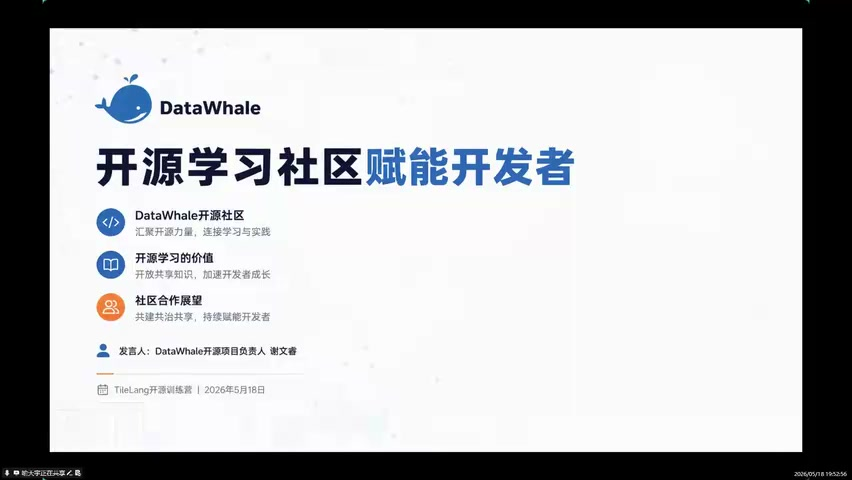
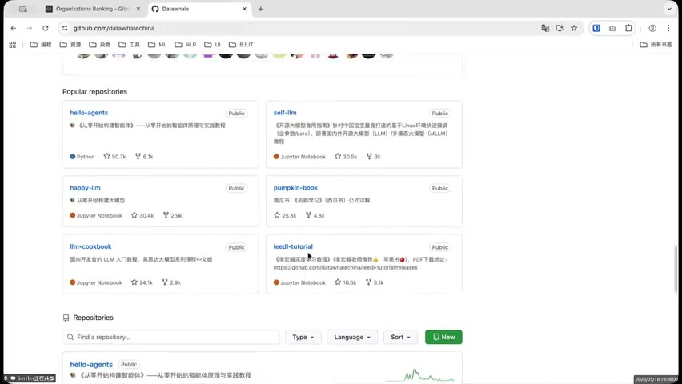
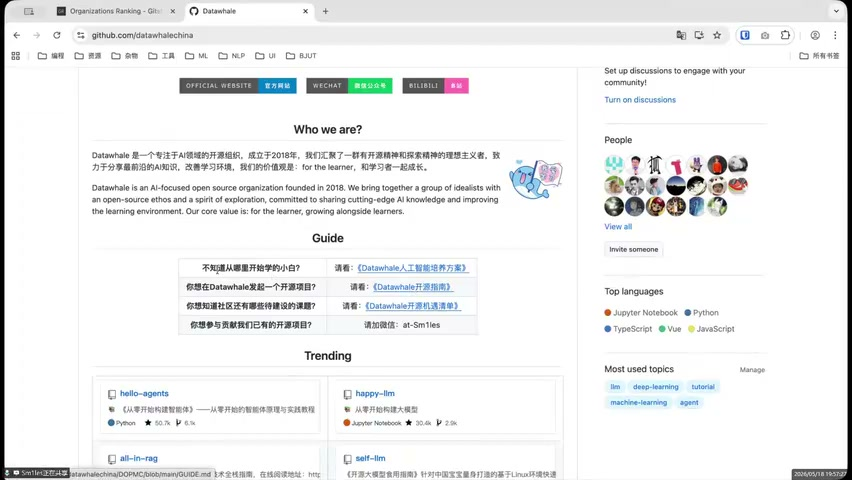

# [P05] 开营仪式 - 开源学习社区与答疑结营

> **演讲者**：谢文睿（DataWhale开源项目负责人）  
> **日期**：2026年5月18日  
> **活动**：TileLang Puzzle 算子开发实战营 开营仪式  

---

## 一、DataWhale 开源学习社区介绍

### 社区定位

- **DataWhale**：AI 领域开源学习组织，成立于 2018 年
- 三大核心价值：
  1. **DataWhale开源社区**：汇聚开源力量，连接学习与实践
  2. **开源学习的价值**：开放共享知识，加速开发者成长
  3. **社区合作展望**：共建共治共享，持续赋能开发者

### GitHub 开源项目

DataWhale 在 GitHub（github.com/datawhalechina）上的热门项目：

| 项目 | 描述 | Stars |
|------|------|-------|
| hello-agents | 《从零开始的智能体体验》——智能体原理与实践教程 | 50.7k |
| self-llm | 《开源大模型应用指南》基于 Linux 环境快速部署 | 30.5k |
| pumpkin-book | 南瓜书：《机器学习》（西瓜书）公式详解 | 25.8k |
| llm-cookbook | 面向开发者的 LLM 入门教程（吴恩达课程中文版） | 24.1k |
| leedt-tutorial | 《李宏毅深度学习教程》 | 16.6k |

### 社区资源与指引

- **小白入门**：DataWhale 人工智能培养方案
- **发起项目**：DataWhale 开源指南
- **特设课题**：DataWhale 开源清单
- **参与贡献**：联系社区负责人

### 主要技术方向

- Jupyter Notebook、Python、TypeScript、Vue、JavaScript
- 核心话题：LLM、Deep Learning、Tutorial、Machine Learning、Agent

---

## 二、与训练营的合作

- DataWhale 作为本次训练营的**渠道合作伙伴**，通过开源学习社区推广 TileLang 课程
- 有专门的 DataWhale 渠道报名群
- 鼓励学员参与 DataWhale 社区的开源项目贡献

---

## 三、开营仪式总结与答疑

- 主持人总结开营仪式各环节
- 强调学习路径：听课 → 完成算子 Kernel → 项目阶段 → 挑战杯
- 鼓励学员坚持学习，利用社区资源（CNB、DataWhale、沐曦方舟）
- 进入第一课：GPGPU 核心技术介绍（泽文老师）

---

## Key Terms

| 术语 | 含义 |
|------|------|
| DataWhale | AI 领域开源学习社区，2018年成立，GitHub 上多个万星项目 |
| hello-agents | DataWhale 最热门项目（50.7k stars），智能体入门教程 |
| self-llm | 开源大模型应用指南，面向国内开发者 |
| 开源学习社区 | 以开源方式组织学习，共建共享知识 |
