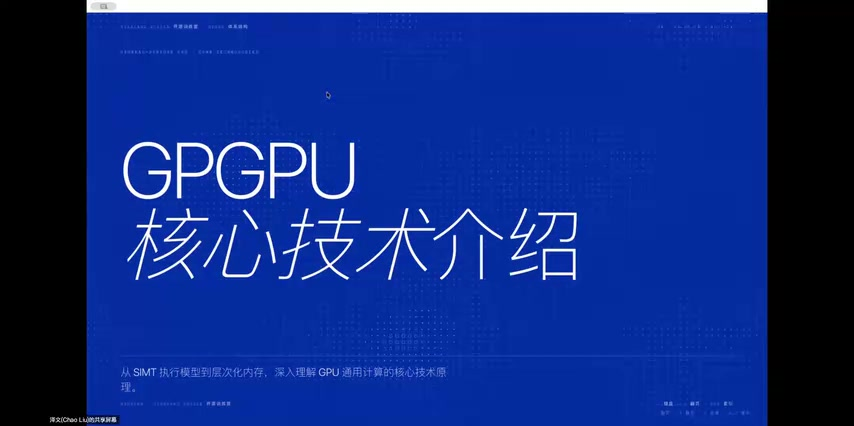
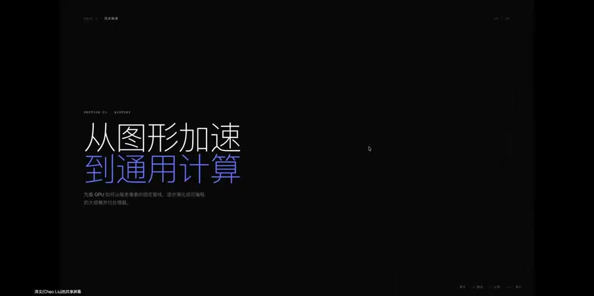
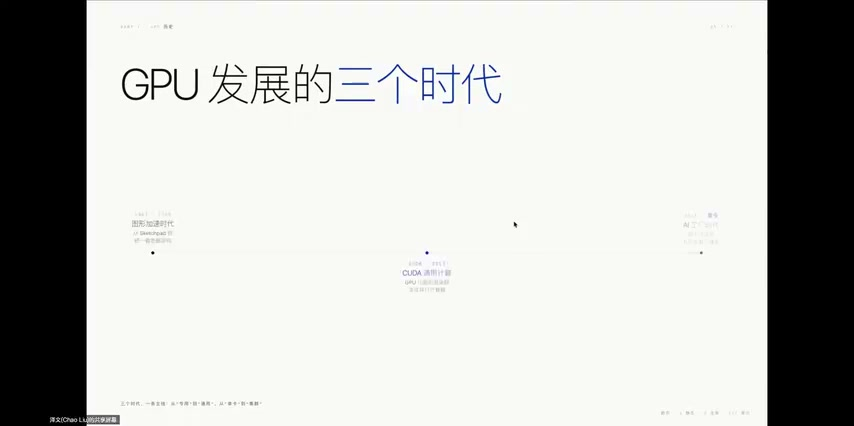

# [P06] GPGPU核心技术 - 冯诺伊曼架构与GPU发展史

> **演讲者**：泽文（HPC & AI加速硬件方向）  
> **日期**：2026年5月19日  
> **活动**：TileLang Puzzle 算子开发实战营 第一课  

---

## 一、GPU vs GPGPU：同一硬件的两种使用方式

### GPU（图形处理器）

- 设计目标：加速 3D 图形渲染流水线
- 流程：顶点变换 → 光栅化 → 像素着色 → 帧缓冲输出
- 专用硬件：TMU（纹理单元）、ROP（光栅输出单元）
- 编程接口：OpenGL、DirectX、Vulkan
- 数据模型：三角形、纹理、像素——一切围绕画图

### GPGPU（通用计算GPU）

- 不改变硬件，改变**使用方式**——把 GPU 当大规模并行处理器
- 关键支撑：
  - 统一着色器架构 → 所有 ALU 执行通用计算指令
  - CUDA 编程生态 → 无需把计算伪装成图形操作
  - 共享内存 + 线程同步 → 线程间可协作
- 现代数据中心 GPU（A100/H100/B200）：芯片面积优先给 Tensor Core、HBM、NVLink，图形渲染不再是设计中心

### 演进路线

固定管线 → 可编程着色器 → 统一着色器架构 → CUDA 通用并行计算（每步增加灵活性和可编程性）

---

## 二、并行计算执行模型对比

| 模型 | 全称 | 特点 | 典型代表 |
|------|------|------|----------|
| **SIMD** | 单指令多数据 | 一条指令对多个元素同步执行；向量宽度对编译器可见；需数据对齐 | CPU 向量扩展：Intel AVX、ARM NEON、RISC-V V |
| **SIMT** | 单指令多线程 | 编程视角像独立标量程序；硬件以 Warp(32/16线程) 为单位发射；用 active mask 处理分支 | **GPU（NVIDIA/AMD/沐曦）** |
| **MIMD** | 多指令多数据 | 每个核心独立执行不同指令流；最灵活 | 多核 CPU、分布式集群、Cerebras WSE |

**GPU 选择 SIMT 的原因**：在数据并行场景下兼顾编程灵活性（写标量程序）和硬件吞吐量（向量化执行）。

> 软件自由度 ↑ → 硬件设计妥协 ↑；软件实现简单 → 硬件更复杂

---

## 三、CUDA 编程模型层级（Thread → Warp → Block → Grid）

### Thread（线程）

- 编程模型中最小执行实例
- 有自己的寄存器、线程索引、局部变量
- 写 Kernel 时像写一个**标量程序**（如 `c = a * b + c`）

### Warp（线程束）

- 32 个线程（NVIDIA）或 16 个线程（部分硬件）组成
- 硬件基本调度单元，共享 PC（程序计数器）
- 用 **active mask** 决定哪些线程参与执行
- 分支分歧时：分批执行不同路径（性能损失来源）
- Volta 架构后：引入专有硬件让线程执行状态更独立，但调度仍围绕 Warp

### Warp 调度与零开销切换

- 调度器每周期选一个就绪 Warp 发射指令
- 当前 Warp 等内存 → 立即切到另一个 Warp
- 每个 Warp 计算资源独立/动态分配 → **context switch 开销≈0**
- 这是 GPU **隐藏内存延迟（Latency Hiding）** 的核心机制

### Block（线程块）

- 多个 Warp 组成一个 Block
- Block 内线程可通过**共享内存（Shared Memory）** 通信
- 一个 Block 被分配到一个 SM 上执行

### Grid（网格）

- 多个 Block 组成 Grid，对应一次 Kernel 启动
- Block 分配到不同 SM 上并行执行
- **Block 之间无法直接通信**
- 编程第一步：通过 `gridDim/blockIdx/threadIdx` 获取 thread id → 映射数据

---

## 四、分支分歧（预告）

- Warp 内线程走不同分支 → 硬件分批执行 → 性能下降
- 对性能优化影响极大，后续课程详细讲解

---

## Key Terms

| 术语 | 含义 |
|------|------|
| GPGPU | General-Purpose computing on GPU，通用计算GPU |
| SIMT | Single Instruction Multiple Threads，单指令多线程 |
| Warp | GPU 基本调度单元，NVIDIA 为 32 线程 |
| Active Mask | 标记 Warp 内哪些线程当前参与执行的位掩码 |
| SM | Streaming Multiprocessor，流式多处理器 |
| Latency Hiding | 通过切换 Warp 隐藏内存访问延迟 |
| Tensor Core | NVIDIA 专用矩阵乘加硬件单元 |
| HBM | High Bandwidth Memory，高带宽显存 |
| NVLink | NVIDIA GPU 间高速互联 |
| Cerebras WSE | 采用 MIMD 架构的 AI 加速芯片 |
