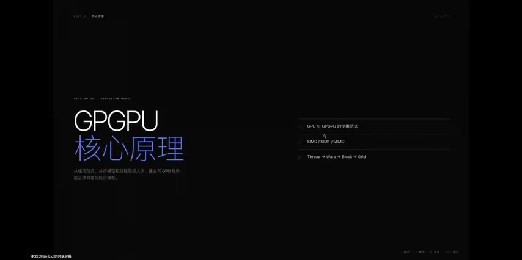
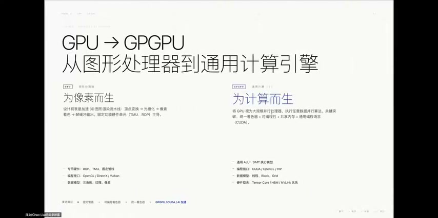
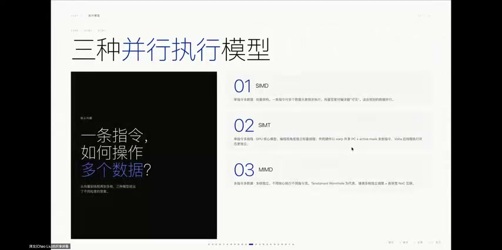
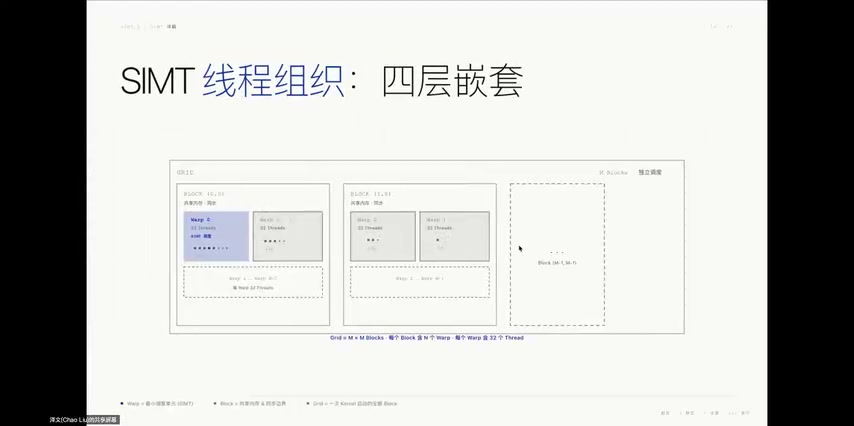

# [P07] GPGPU核心技术 - GPU工作原理·SIMT执行模型与线程层级

> **演讲者**：泽文（HPC & AI加速硬件方向）  
> **日期**：2026年5月19日  
> **活动**：TileLang Puzzle 算子开发实战营 第一课（续）  

---

## 一、分支分歧（Branch Divergence）



### 问题本质

- Warp 内 32 线程走同一 if 路径 → 全速执行，无问题
- 16 线程走 if，16 线程走 else → 硬件用 **SIMT Stack** 分批执行：
  1. 先执行 if 路径（else 线程用掩码屏蔽）
  2. 再执行 else 路径
  3. 两条路径完成后在**汇聚点**重新同步
- 最极端：32 线程走 32 条不同路径 → 串行化执行 32 遍 → 并行度降为零

### 优化启示

> **同一 Warp 内，让线程尽量走相同的控制流路径**

- 把条件判断按 **Warp 边界**设计，而非按 thread 设计
- 这是非常重要的性能优化技巧

---

## 二、GPU 架构流水线



数据从 CPU 到 GPU 的完整执行路径：

```
Host CPU 存储 → PCIe 总线 → GPU 调度引擎 → Block 分配到空闲 SM
→ SM 内 Scheduler 选就绪 Warp → Dispatch Unit → 执行单元
→ 结果写回 HBM / memcpy 回 Host
```

执行单元类型：
- **CUDA Core**：通用标量/向量计算
- **Tensor Core**：矩阵乘加专用
- **SFU**：特殊函数单元（sin/cos/exp 等）

---

## 三、GPU 内存层次（同心圆模型）



> GPU 性能很大程度上不是由计算决定，而是由**内存**决定

| 层级 | 存储 | 延迟 | 特点 |
|------|------|------|------|
| 最内层 | **寄存器** | ~1 cycle | 线程私有；数量有限；用越多 → SM 驻留线程越少 → Occupancy 下降 |
| 第二层 | **Shared Memory + L1 Cache** | 1~2 cycles | Block 内线程共享；SRAM 实现；64KB 可灵活分配（Fermi 起）；**数据复用黄金区域** |
| 第三层 | **L2 Cache + HBM（全局内存）** | 400~600 cycles | 容量大、带宽高（H100 HBM3: 3TB/s）；访问模式不好时有效带宽可能仅 1/10 |
| 最外层 | **Host 内存（DDR）** | 最高 | 通过 PCIe 拷贝；很多应用瓶颈在此 |

### Shared Memory vs Cache 的区别

- **Shared Memory**：软件直接控制数据存取
- **Cache**：硬件自动控制数据驻留和刷新

### 核心经验

> 尽量让数据待在靠近计算单元的地方

- 频繁访问数据 → 放 Shared Memory 或寄存器
- 一次性大块连续数据 → 走全局内存
- 碎片化数据 → 拼成连续大块再搬运

---

## 四、近存计算与异步搬运



### 近存计算的 GPU 语境

- 不是把计算塞进内存芯片
- 而是把可复用数据**一级级推到更靠近 SM/执行单元的位置**
- GPU 给程序员越来越强的数据访问粒度控制

### 软件层面的数据搬运编排

| 层级 | 机制 | 说明 |
|------|------|------|
| Host ↔ Device | `cudaMemcpyAsync` + CUDA Stream | 异步拷贝与 Kernel 计算重叠 |
| HBM → Shared Memory | `cp.async`（Ampere）/ **TMA**（Hopper） | 硬件异步搬运，可排队、与计算重叠 |
| Shared Memory → Register | 软件控制 | 决定哪块 tile 先搬、哪块在算、哪块写回 |

### 流水线化思想

> 写高性能 GPU Kernel 不只是让 ALU 忙起来，还要让数据在**正确的时间**走到**正确的层级**

- **少搬、提前搬、搬算流水化**
- 把所有空腔塞满，不让硬件闲置
- 这就是近存计算的软件核心思路

---

## Key Terms

| 术语 | 含义 |
|------|------|
| Branch Divergence | Warp 内线程走不同分支导致串行化执行 |
| SIMT Stack | 硬件用栈结构管理分支分歧的掩码和汇聚点 |
| Occupancy | SM 上实际驻留线程数与最大容量的比值 |
| cp.async | Ampere 架构引入的异步全局→共享内存拷贝指令 |
| TMA | Tensor Memory Accelerator，Hopper 架构的硬件异步搬运单元 |
| 近存计算 | 将数据推到靠近计算单元的层级，减少搬运开销 |
| 搬算重叠 | 数据搬运与计算并行执行，隐藏延迟 |
